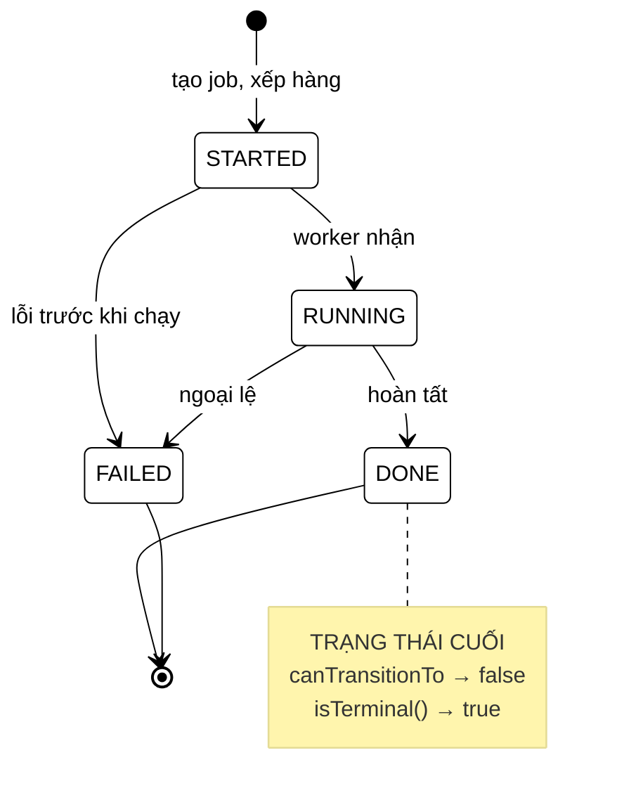

# CrawlStatus — bốn lỗi im lặng của một biến `String`

**File nguồn:** `search-engine/src/main/java/com/vnsearch/service/CrawlStatus.java` (81 dòng)
**Gói:** `com.vnsearch.service` · **Loại:** `enum` có **thân riêng cho từng hằng** (constant-specific body)
**Vị trí trong sơ đồ:** trạng thái của một job crawl, do [`CrawlJobManager`](./CrawlJobManager.md) quản lý
**Đọc kèm:** [`CrawlJobManager.md`](./CrawlJobManager.md) · [`../controller/AdminController.md`](../controller/AdminController.md)

---

## 📌 Hiểu trong 30 giây

**State pattern** ở dạng gọn nhất mà Java cho phép: một `enum` bốn hằng, mỗi
hằng tự cài `canTransitionTo` — tức là **mỗi trạng thái tự biết mình đi được đi
đâu**.

Nó thay cho một biến `volatile String status` gán bằng chuỗi tự do, và Javadoc
dòng 14 gọi đúng tên vấn đề: **bốn lỗi, tất cả đều là lỗi IM LẶNG.**



```
   MÁY TRẠNG THÁI (Javadoc dòng 30-34)

        STARTED ──→ RUNNING ──→ DONE
           │           │
           └───────────┴──────→ FAILED

   BỐN TRẠNG THÁI · NĂM CHUYỂN TIẾP HỢP LỆ

   Và đáng chú ý là những chuyển tiếp KHÔNG có:
        DONE   ──✗──→ RUNNING      (job xong không chạy lại được)
        DONE   ──✗──→ FAILED       (đã thành công thì không hỏng)
        FAILED ──✗──→ RUNNING      (phải tạo job MỚI, không "hồi sinh")
        STARTED ─✗──→ DONE         (không thể xong mà chưa từng chạy)
```

---

## 1. Bốn lỗi im lặng của bản cũ

Javadoc dòng 7–23.

```java
// BẢN CŨ
volatile String status = "STARTED";
...
job.status = "RUNNING";
job.status = "DONE";
```

### 1.1 Gõ sai không bị bắt

```
   job.status = "DONEE";
                     ↑ thừa một chữ E

   ✔ BIÊN DỊCH BÌNH THƯỜNG
   ✔ chạy bình thường
   ✘ tầng UI đọc "DONE" sẽ KHÔNG BAO GIỜ khớp

   TRIỆU CHỨNG:
        thanh tiến trình quay MÃI MÃI
        người dùng chờ một job đã xong từ lâu
        không có lỗi nào trong log
```

```java
// BẢN MỚI
job.status = CrawlStatus.DONEE;
//                       ^^^^^ LỖI BIÊN DỊCH: cannot find symbol
```

Đây là lợi ích cơ bản nhất và cũng lớn nhất: **chuyển một lỗi lúc chạy thành
lỗi lúc biên dịch.**

### 1.2 Không có ràng buộc chuyển trạng thái

```
   Với String, KHÔNG GÌ NGĂN:

        job.status = "DONE";
        ...
        job.status = "RUNNING";     ← job đã xong lại "đang chạy"

   Hậu quả thật:
        - UI hiện lại thanh tiến trình cho một job đã kết thúc
        - bộ đếm "số job đang chạy" tăng sai
        - và nếu CrawlJobManager giới hạn MAX_CONCURRENT_JOBS,
          một job ma sẽ chiếm mất suất của job thật
```

```java
// BẢN MỚI — kiểm tra được ngay tại chỗ gán
if (!current.canTransitionTo(next)) {
    throw new IllegalStateException("Không thể chuyển " + current + " -> " + next);
}
```

### 1.3 Không liệt kê được tập trạng thái

```
   "Hệ thống có những trạng thái nào?"

   Với String:  phải GREP TOÀN BỘ codebase tìm mọi phép gán
                → và vẫn không chắc đã tìm hết
                → và không phát hiện được trạng thái nào đã chết

   Với enum:    CrawlStatus.values()  → xong.
                IDE tự liệt kê khi gõ "CrawlStatus."
```

### 1.4 `switch` không kiểm tra đầy đủ nhánh

```
   switch (statusString) {
       case "STARTED" -> ...;
       case "RUNNING" -> ...;
       case "DONE"    -> ...;
       // QUÊN "FAILED" → rơi vào default hoặc không làm gì
   }
   → không có cảnh báo nào

   switch (status) {                    // enum
       case STARTED -> ...;
       case RUNNING -> ...;
       case DONE    -> ...;
   }
   → LỖI BIÊN DỊCH (switch biểu thức): "the switch expression
     does not cover all possible input values"
```

```
   ┌──────────────────────────────────────────────────────────────┐
   │  LỢI ÍCH LỚN NHẤT: khi THÊM một trạng thái mới               │
   │  (ví dụ PAUSED, CANCELLED), trình biên dịch sẽ CHỈ RA         │
   │  MỌI chỗ switch cần cập nhật.                                │
   │                                                              │
   │  Với String, việc đó phải làm bằng trí nhớ — và quên một      │
   │  chỗ nghĩa là một nhánh im lặng không xử lý.                 │
   └──────────────────────────────────────────────────────────────┘
```

---

## 2. Thân riêng cho từng hằng — nơi State pattern nằm

Javadoc dòng 25–28.

```java
public enum CrawlStatus {
    STARTED {
        @Override public boolean canTransitionTo(CrawlStatus next) {
            return next == RUNNING || next == FAILED;
        }
    },
    RUNNING {
        @Override public boolean canTransitionTo(CrawlStatus next) {
            return next == DONE || next == FAILED;
        }
    },
    DONE   { @Override public boolean canTransitionTo(CrawlStatus next) { return false; } },
    FAILED { @Override public boolean canTransitionTo(CrawlStatus next) { return false; } };

    public abstract boolean canTransitionTo(CrawlStatus next);
}
```

### 2.1 So với cách viết bằng `switch` tập trung

```
   CÁCH A — switch tập trung (phổ biến)

        public boolean canTransitionTo(CrawlStatus next) {
            return switch (this) {
                case STARTED -> next == RUNNING || next == FAILED;
                case RUNNING -> next == DONE || next == FAILED;
                case DONE, FAILED -> false;
            };
        }

        ✔ nhìn một chỗ thấy toàn bộ máy trạng thái
        ✘ thêm trạng thái mới → phải NHỚ sửa switch này
          (switch biểu thức có bắt, nhưng chỉ nếu không có default)


   CÁCH B — thân riêng cho từng hằng (đang dùng)

        ✔ "MỖI TRẠNG THÁI TỰ BIẾT MÌNH ĐI ĐƯỢC ĐI ĐÂU"
        ✔ Thêm trạng thái mới → TRÌNH BIÊN DỊCH BẮT BUỘC khai báo
          chuyển tiếp của nó (vì phương thức là abstract)
        ✘ máy trạng thái bị tản ra 4 chỗ
```

Javadoc dòng 27–28 nêu đúng lý do chọn B:

> Thêm một trạng thái mới thì **trình biên dịch bắt buộc phải khai báo chuyển
> tiếp của nó**.

```
   ĐÂY LÀ SỰ KHÁC BIỆT THEN CHỐT:

        Cách A:  quên sửa → có thể vẫn biên dịch → hành vi sai im lặng
        Cách B:  quên khai báo → KHÔNG BIÊN DỊCH ĐƯỢC

   ⇒ Cùng một nguyên tắc đã thấy ở CrawlEventBus.noop() (mục 4.1)
     và ở ImageStorage.pathFor() (mục 3.2):

        LÀM CHO TRẠNG THÁI SAI KHÔNG BIỂU DIỄN ĐƯỢC,
        thay vì kiểm tra rồi báo lỗi.
```

### 2.2 Cái giá phải trả

```
   Enum có thân riêng cho từng hằng KHÔNG PHẢI enum thường:

        - mỗi hằng là một LỚP CON ẩn danh
        - CrawlStatus.STARTED.getClass()  →  CrawlStatus$1
        - CrawlStatus.class.isEnum()      →  true
        - STARTED.getClass().isEnum()     →  FALSE (!)

   Ảnh hưởng thực tế:
        ✘ vài thư viện serialize/ORM cũ xử lý sai
        ✘ getClass().getSimpleName() cho ra "" (chuỗi rỗng)
          — cùng cạm bẫy với lambda ở PageEventHandler mục 4.1

   ⇒ Dùng name() hoặc toString(), KHÔNG dùng getClass().
     Jackson serialize enum theo name() nên không có vấn đề ở đây.
```

---

## 3. `isTerminal()` — gom một phép so rải rác

Javadoc dòng 73–77.

```java
public boolean isTerminal() {
    return this == DONE || this == FAILED;
}
```

```
   TRƯỚC:  tầng UI phải so chuỗi RẢI RÁC ở nhiều nơi

        if (status.equals("DONE") || status.equals("FAILED")) {
            stopPolling();
        }
        ...
        // ở file khác:
        if (!status.equals("DONE") && !status.equals("FAILED")) {
            showSpinner();
        }
        ...
        // ở file thứ ba: QUÊN "FAILED"
        if (status.equals("DONE")) {
            hideSpinner();          ← job FAILED sẽ quay mãi
        }

   SAU:   status.isTerminal()

   ⇒ Một khái niệm ("còn phải hỏi lại không?") có MỘT định nghĩa.
     Thêm trạng thái cuối mới (ví dụ CANCELLED) chỉ sửa MỘT chỗ.
```

Đây là ứng dụng của nguyên tắc **đặt tên cho vị ngữ**: `isTerminal()` nói *ý
định*, còn `== DONE || == FAILED` chỉ nói *cách kiểm tra*. Khi tập trạng thái
cuối đổi, mọi chỗ gọi vẫn đúng.

**Điểm không nhất quán nhỏ:** `isTerminal()` có thể suy ra từ
`canTransitionTo` — một trạng thái cuối là trạng thái không chuyển đi đâu được.
Nhưng viết như vậy sẽ phải duyệt `values()`:

```java
// PHƯƠNG ÁN thay thế — KHÔNG dùng
public boolean isTerminal() {
    return Arrays.stream(values()).noneMatch(this::canTransitionTo);
}
```

```
   ✔ tự động đúng khi thêm trạng thái
   ✘ O(n) thay vì O(1) — không đáng kể, nhưng...
   ✘ KHÓ ĐỌC HƠN HẲN, và ý định bị che đi
   ✘ và nó tạo một phụ thuộc ngầm: đổi canTransitionTo là đổi isTerminal

   ⇒ Bản hiện tại (liệt kê tường minh) DỄ ĐỌC hơn.
     Cái giá: thêm trạng thái cuối mới phải nhớ sửa cả hai chỗ.
     Xem đề xuất 2.
```

---

## 4. Hướng dẫn về code

### 4.1 Ý nghĩa từng trạng thái

| Trạng thái | Ý nghĩa | Đi được đâu |
|---|---|---|
| `STARTED` | Job **đã tạo và xếp hàng**, chưa chạy | `RUNNING`, `FAILED` |
| `RUNNING` | Worker **đang** crawl | `DONE`, `FAILED` |
| `DONE` | Hoàn tất thành công — **cuối** | — |
| `FAILED` | Thất bại — **cuối** | — |

```
   VÌ SAO CÓ STARTED TÁCH KHỎI RUNNING?

   CrawlJobManager giới hạn MAX_CONCURRENT_JOBS = 2.
   Job thứ ba được TẠO nhưng phải CHỜ.

        STARTED = "đã nhận yêu cầu, đang xếp hàng"
        RUNNING = "worker đã nhận, đang tải trang"

   Nếu gộp làm một, người dùng không phân biệt được
   "hệ thống đang bận" với "đang crawl chậm" —
   hai tình huống cần hai lời giải thích khác nhau ở giao diện.
```

```
   VÌ SAO STARTED → FAILED LÀ HỢP LỆ?

   Job có thể hỏng TRƯỚC khi chạy:
        - URL hạt giống không hợp lệ (SeedUrlValidator từ chối)
        - cấu hình sai (maxDepth âm, allowedDomains rỗng)
        - hàng đợi bị huỷ

   ⇒ Không phải mọi thất bại đều xảy ra khi đang chạy.
```

### 4.2 Cách dùng đúng trong `CrawlJobManager`

```java
// Mẫu chuẩn — kiểm tra trước khi chuyển
private void transition(CrawlJob job, CrawlStatus next) {
    CrawlStatus current = job.getStatus();
    if (!current.canTransitionTo(next)) {
        throw new IllegalStateException(
                "Chuyển trạng thái không hợp lệ: " + current + " -> " + next);
    }
    job.setStatus(next);
}
```

```
   ⚠ CẠM BẪY: enum KHÔNG TỰ ÉP kiểm tra.

   canTransitionTo() chỉ TRẢ LỜI CÂU HỎI.
   Nếu chỗ gọi viết thẳng job.setStatus(DONE) mà không hỏi,
   máy trạng thái này VÔ TÁC DỤNG.

   ⇒ Giá trị của enum này phụ thuộc HOÀN TOÀN vào việc
     CrawlJobManager có gọi canTransitionTo hay không.
     Xem đề xuất 1.
```

### 4.3 Đọc–kiểm–ghi vẫn cần đồng bộ

```
   transition() ở trên là ĐỌC-KIỂM-GHI — KHÔNG nguyên tử.

        Luồng A: đọc RUNNING, thấy → DONE hợp lệ
        Luồng B: đọc RUNNING, thấy → FAILED hợp lệ
        A ghi DONE
        B ghi FAILED          ← job "thành công" bị đánh dấu thất bại

   ⇒ Enum KHÔNG giải bài toán đồng thời. CrawlJobManager
     phải tự lo (synchronized, hoặc AtomicReference + compareAndSet).

   Đây là cùng lớp lỗi với check-then-act ở:
        CrawlAnalyticsService mục 4.3 (updateAndGet)
        ImageStore mục 4.1 (compute)
```

### 4.4 Cạm bẫy khi sửa lớp này

| Ý định | Hậu quả |
|---|---|
| Thêm trạng thái mới | Trình biên dịch **bắt buộc** khai báo `canTransitionTo` ✓ nhưng **không** nhắc sửa `isTerminal()` |
| Thêm `default` vào `switch` ở chỗ gọi | Mất luôn phép kiểm tra đầy đủ nhánh — lợi ích chính ở mục 1.4 |
| Cho `DONE → RUNNING` (để "chạy lại") | Phá ngữ nghĩa trạng thái cuối; đúng cách là tạo **job mới** |
| Dùng `getClass()` trên hằng enum | Trả về `CrawlStatus$1`, `getSimpleName()` là chuỗi rỗng |
| Gán trạng thái không qua `transition()` | Máy trạng thái trở nên vô tác dụng |
| Lưu `ordinal()` thay vì `name()` | Chèn một hằng vào giữa sẽ đổi số của mọi hằng sau ⇒ dữ liệu cũ đọc sai |

---

## 5. Độ phức tạp & chi phí

| Đại lượng | Giá trị |
|---|---|
| `canTransitionTo` | O(1) — vài phép so tham chiếu |
| `isTerminal` | O(1) |
| Bộ nhớ | 4 thực thể singleton, tạo một lần khi nạp lớp |
| Chi phí so với `String` | **Rẻ hơn** — so tham chiếu (`==`) thay vì `String.equals` |

```
   ĐIỂM ÍT NGƯỜI ĐỂ Ý:  enum còn NHANH HƠN String.

        "DONE".equals(status)   →  so từng ký tự (tối đa 4 lần)
        status == DONE          →  MỘT phép so con trỏ

   Và switch trên enum biên dịch thành tableswitch (nhảy bảng, O(1)),
   còn switch trên String biên dịch thành hashCode + equals.

   ⇒ Enum tốt hơn ở CẢ ba mặt: an toàn kiểu, đọc hiểu, VÀ tốc độ.
     Đây là trường hợp hiếm không có đánh đổi nào.
```

---

## 6. Kiểm thử liên quan

| Bộ test | Kiểm gì |
|---|---|
| [`CrawlStatusTest`](../../../../test/java/com/vnsearch/service/CrawlStatusTest.md) | Ma trận chuyển tiếp; `isTerminal` |
| [`AdminController`](../controller/AdminController.md) | Bên phơi trạng thái ra API |

```
   MA TRẬN CHUYỂN TIẾP ĐẦY ĐỦ (4 × 4 = 16 ô)

              →  STARTED  RUNNING  DONE   FAILED
   STARTED       ✗        ✓        ✗      ✓
   RUNNING       ✗        ✗        ✓      ✓
   DONE          ✗        ✗        ✗      ✗
   FAILED        ✗        ✗        ✗      ✗

   Chỉ 5 ô ✓ trên 16 — và một bài test nên phủ CẢ 16,
   vì mỗi ô ✗ là một lỗi bị chặn.
```

Hai bài test còn thiếu, và bài đầu rất rẻ mà rất mạnh:

```java
// 1. Toàn bộ ma trận — 16 ô, sinh tự động
@ParameterizedTest
@MethodSource("moiCapTrangThai")
void maTranChuyenTiepDung(CrawlStatus tu, CrawlStatus den, boolean mongDoi) {
    assertEquals(mongDoi, tu.canTransitionTo(den),
            tu + " -> " + den);
}

// 2. isTerminal phải NHẤT QUÁN với canTransitionTo
@ParameterizedTest
@EnumSource(CrawlStatus.class)
void trangThaiCuoiKhongChuyenDiDauDuoc(CrawlStatus s) {
    if (s.isTerminal()) {
        for (CrawlStatus den : CrawlStatus.values()) {
            assertFalse(s.canTransitionTo(den),
                    s + " là trạng thái cuối nhưng vẫn chuyển được sang " + den);
        }
    } else {
        assertTrue(Arrays.stream(CrawlStatus.values()).anyMatch(s::canTransitionTo),
                s + " không phải trạng thái cuối nhưng không chuyển đi đâu được");
    }
}
```

Bài test 2 đáng giá nhất: nó **buộc hai định nghĩa phải khớp nhau**, và sẽ đỏ
ngay nếu ai đó thêm một trạng thái cuối mới mà quên cập nhật `isTerminal()` —
đúng khoảng trống đã nêu ở mục 3.

---

## 7. Chấm theo chuẩn doanh nghiệp

| Tiêu chí | Điểm | Nhận xét |
|---|---|---|
| Nhận diện vấn đề | 10/10 | Bốn lỗi của bản `String` được liệt kê cụ thể, và đều được gọi đúng tên "lỗi im lặng" |
| Chọn cấu trúc | 10/10 | Thân riêng cho từng hằng ⇒ thêm trạng thái mới **không biên dịch được** nếu quên khai báo |
| Đặt tên khái niệm | 10/10 | `isTerminal()` gom một phép so rải rác thành một khái niệm có tên |
| Ghi chép lịch sử | 10/10 | Javadoc giữ lại mã cũ và lý do thay — người sau hiểu được vì sao, không chỉ là gì |
| Hiệu năng | 10/10 | Nhanh hơn `String` ở mọi mặt; không có đánh đổi |
| Tính đầy đủ | 9/10 | Máy trạng thái đủ cho nhu cầu hiện tại; thiếu `CANCELLED` (xem đề xuất 3) |
| Ép tuân thủ | 6/10 | Enum chỉ **trả lời câu hỏi**; nếu chỗ gọi không hỏi thì máy trạng thái vô tác dụng |
| Nhất quán nội tại | 7/10 | `isTerminal()` và `canTransitionTo()` là hai định nghĩa **độc lập** có thể lệch nhau |
| Khả năng kiểm thử | 8/10 | Rất dễ test (thuần, không phụ thuộc); nhưng thiếu test ma trận đầy đủ |

**Bốn đề xuất nâng lên mức sản phẩm:**

1. **Đưa phép kiểm tra vào chính enum.** Hiện `canTransitionTo` chỉ trả lời câu
   hỏi; việc *hỏi* là trách nhiệm của `CrawlJobManager`. Nếu một chỗ gọi quên
   hỏi, toàn bộ máy trạng thái vô tác dụng — và không có gì phát hiện được. Thêm
   một phương thức ép buộc:
   ```java
   public CrawlStatus transitionTo(CrawlStatus next) {
       if (!canTransitionTo(next)) {
           throw new IllegalStateException("Không thể chuyển " + this + " -> " + next);
       }
       return next;
   }
   ```
   Rồi bắt `CrawlJobManager` dùng `job.setStatus(job.getStatus().transitionTo(DONE))`.
   Lúc đó việc bỏ qua kiểm tra trở nên **khó hơn** việc làm đúng.

2. **Test nhất quán `isTerminal` ↔ `canTransitionTo`** (mã ở mục 6). Hai định
   nghĩa hiện độc lập nhau; thêm `CANCELLED` (một trạng thái cuối) mà quên sửa
   `isTerminal()` sẽ làm UI hỏi lại vô hạn cho job đã huỷ. Bài test này khoá hai
   định nghĩa lại với nhau mà không phải viết lại `isTerminal` theo kiểu khó đọc.

3. **Cân nhắc `CANCELLED`.** Hiện không có cách phân biệt "job thất bại vì lỗi"
   với "người dùng bấm huỷ" — cả hai đều thành `FAILED`. Với một giao diện quản
   trị có nút dừng crawl, đây là khoảng trống thật: người vận hành nhìn danh sách
   job thấy 5 cái `FAILED` và không biết cái nào cần điều tra. Chuyển tiếp cần
   thêm: `STARTED → CANCELLED`, `RUNNING → CANCELLED`.

4. **Ghi rõ trong Javadoc rằng enum không lo đồng bộ.** Mục 4.3 mô tả một cuộc
   đua thật ở chỗ gọi. Enum bất biến và thread-safe, nhưng *phép chuyển trạng
   thái* thì không — và người đọc dễ nhầm hai điều đó. Một câu
   *"Việc kiểm tra rồi gán là đọc–kiểm–ghi; bên gọi phải tự đồng bộ"* đặt đúng
   chỗ sẽ tiết kiệm cho người sau một lần dò lỗi rất khó.

---

## 8. Liên kết

- Bên quản lý vòng đời job: [`CrawlJobManager.md`](./CrawlJobManager.md)
- Bên phơi trạng thái ra API: [`../controller/AdminController.md`](../controller/AdminController.md)
- Cùng nguyên tắc "trạng thái sai không biểu diễn được": [`../crawler/modular/ImageStorage.md`](../crawler/modular/ImageStorage.md) mục 3.2 · [`../crawler/bus/CrawlEventBus.md`](../crawler/bus/CrawlEventBus.md) mục 4.1
- Cùng lớp lỗi đọc–kiểm–ghi: [`../crawler/modular/ImageStore.md`](../crawler/modular/ImageStore.md) mục 4.1
- Nơi `jobId` được sinh và mang theo: [`../crawler/bus/PageEvent.md`](../crawler/bus/PageEvent.md) mục 4
- Tổng quan: `docs/ARCHITECTURE.md`
