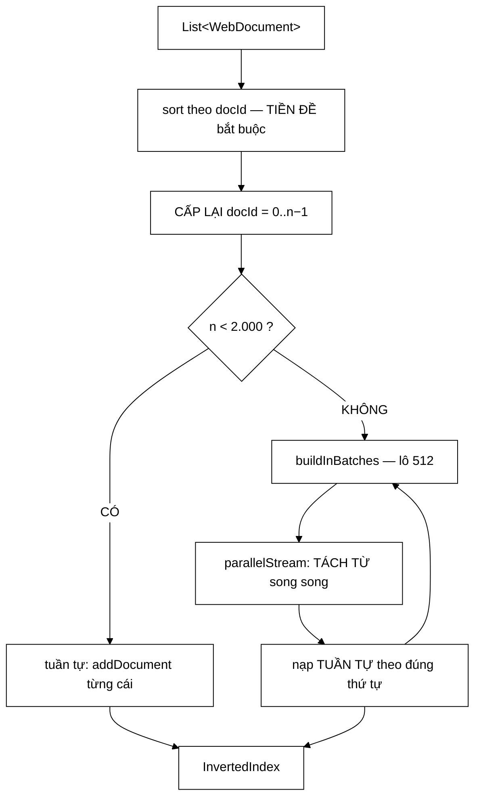

# IndexBuilder — một tiền đề bắt buộc, lặp ở ba nơi, quên một chỗ là kết quả sai im lặng

**File nguồn:** `search-engine/src/main/java/com/vnsearch/service/IndexBuilder.java` (135 dòng)
**Gói:** `com.vnsearch.service` · **Loại:** `@Component` Spring, một trường `final` ⇒ bất biến, an toàn đa luồng
**Vị trí trong luồng:** biến danh sách `WebDocument` thành `InvertedIndex` — chạy lúc khởi động, sau crawl, và khi reindex
**Đọc kèm:** [`../index/InvertedIndex.md`](../index/InvertedIndex.md) · [`../index/VietnameseTokenizer.md`](../index/VietnameseTokenizer.md) · [`SearchEngineFacade.md`](./SearchEngineFacade.md)

---

## 📌 Hiểu trong 30 giây

Lớp này tồn tại vì **một tiền đề** phải được giữ, và nó từng bị lặp ở ba nơi.

```
   TIỀN ĐỀ: addDocument phải được gọi theo thứ tự docId TĂNG DẦN
            ⇒ bất biến "posting list sắp xếp theo docId" được đảm bảo MIỄN PHÍ

   TRƯỚC: lặp ở BA nơi, mỗi nơi tự nhớ sort
     - SearchEngineFacade
     - EvaluationRunner
     - GinBaselineRunner

   ⇒ Quên một chỗ = hệ thống trả kết quả SAI một cách IM LẶNG
```



---

## 1. Vì sao tách thành lớp riêng

Javadoc dòng 18–27:

> *"Việc này có **MỘT tiền đề bắt buộc phải giữ** — `addDocument` phải được gọi
> theo thứ tự docId **TĂNG DẦN** để bất biến «posting list sắp xếp theo docId»
> được đảm bảo **miễn phí**. Trước đây tiền đề đó được lặp lại ở **BA** nơi
> (`SearchEngineFacade`, `EvaluationRunner`, `GinBaselineRunner`), mỗi nơi tự nhớ
> sort. Quên một chỗ là hệ thống trả kết quả **SAI một cách im lặng**."*

```
   VÌ SAO "MIỄN PHÍ"

   Nếu addDocument được gọi theo docId tăng dần:
     mỗi posting mới LUÔN có docId lớn hơn mọi posting đã có
     ⇒ chỉ cần .add() vào cuối danh sách
     ⇒ danh sách TỰ ĐỘNG sắp xếp, O(1) mỗi lần

   Nếu gọi lung tung:
     phải chèn đúng vị trí ⇒ O(n) mỗi lần
     hoặc sort lại toàn bộ khi xong ⇒ O(V · d log d)

   ⇒ Một phép sort ở ĐẦU VÀO thay thế hàng trăm nghìn
     phép chèn có thứ tự bên trong.
```

```
   ⚠️ VÌ SAO "SAI IM LẶNG" LÀ TỪ CHÍNH XÁC

   Posting list không sắp xếp ⇒ PostingListMerger.intersect
   cho kết quả SAI (xem ../query/PostingListMerger.md mục 1.1:
   thuật toán two-pointer dựa HOÀN TOÀN vào bất biến này).

   Nhưng nó không NÉM ngoại lệ. Nó chỉ trả về ít kết quả hơn
   đáng lẽ phải có.

   ⇒ Người dùng thấy "3 kết quả" thay vì "142 kết quả"
   ⇒ Không có gì báo. Không test nào đỏ trừ khi test đó
     kiểm đúng ca đó.
```

```
   ⭐ HAI LỚP BẢO VỆ ĐỘC LẬP

   Javadoc dòng 25–27: "InvertedIndex nay cũng tự ÉP tiền đề đó
   bằng cách ném ngoại lệ nếu bị gọi sai thứ tự — hai lớp bảo vệ
   độc lập."

   ① IndexBuilder    → luôn sort trước, nên KHÔNG THỂ sai
   ② InvertedIndex   → ném nếu bị gọi sai, nên nếu ai đó
                        gọi thẳng addDocument thì lộ ra NGAY

   ⇒ Lớp ① loại bỏ lỗi ở đường đi chính.
   ⇒ Lớp ② biến "sai im lặng" thành "sai ồn ào" ở mọi
     đường đi khác.
   ⇒ Đây là mô hình phòng vệ đúng: một lớp làm cho lỗi
     không xảy ra, một lớp làm cho lỗi không thể ẩn.
```

---

## 2. Cấp lại `docId` — danh tính thuộc về chỉ mục, không thuộc về trang web

```java
int nextDocId = 0;
for (WebDocument doc : sorted) {
    doc.setDocId(nextDocId++);   // CAP LAI danh tinh
}
```

Javadoc dòng 83–91:

> *"docId là **danh tính của tài liệu TRONG một chỉ mục cụ thể** — chỉ số vào
> posting list — chứ không phải thuộc tính của trang web. Corpus đi vào đây đến từ
> bên ngoài (tệp JSON của phiên crawl trước, bảng PostgreSQL, thậm chí tệp người
> dùng tự ghép) nên **không có gì bảo đảm nó đánh số duy nhất**. Trước đây một
> corpus có hai tài liệu trùng docId làm `addDocument` ném ngoại lệ ngay trong
> `@PostConstruct`, và **ứng dụng KHÔNG khởi động được** — một tệp dữ liệu không
> hoàn hảo không được phép gây ra hậu quả đó."*

```
   ⭐ PHÂN BIỆT "DANH TÍNH TRONG HỆ THỐNG" VỚI "THUỘC TÍNH CỦA VẬT"

   url        → thuộc tính THẬT của trang web, ổn định vĩnh viễn
   docId      → chỉ số vào mảng, có nghĩa TRONG MỘT chỉ mục

   ⇒ Cùng một trang web có docId KHÁC NHAU ở hai chỉ mục.
   ⇒ Nên tin dùng docId từ tệp bên ngoài là sai về nguyên tắc.

   ⇒ Đây cũng là lý do SearchEngineFacade phải chụp
     `index` một lần (xem SearchEngineFacade.md mục 1):
     docId 847 ở chỉ mục A là một tài liệu HOÀN TOÀN KHÁC
     ở chỉ mục B.
```

```
   HẬU QUẢ CỦA VIỆC TIN DÙNG docId BÊN NGOÀI

   ① tệp JSON có hai tài liệu docId = 5
   ② addDocument(doc thứ hai) thấy docId không tăng ⇒ NÉM
   ③ ném trong @PostConstruct ⇒ Spring không dựng được bean
   ④ ứng dụng KHÔNG KHỞI ĐỘNG

   ⇒ Một tệp dữ liệu hơi lỗi làm sập cả hệ thống.
   ⇒ Cùng họ với lỗi "index.json 159 byte" ở
     SearchEngineFacade.md mục 2.1: dữ liệu bên ngoài
     không hoàn hảo không được phép gây hậu quả thảm khốc.
```

```
   ⚠️ NHƯNG setDocId SỬA ĐỐI TƯỢNG CỦA NGƯỜI GỌI

   doc.setDocId(nextDocId++)  ← sửa TẠI CHỖ

   Đây đúng là "tác dụng phụ từ xa" mà
   ../model/WebDocument.md mục 1 cảnh báo, và mà
   withoutBodyText() được viết ra để tránh.

   ⇒ Người gọi truyền danh sách vào build(), và danh sách
     đó bị SỬA docId.
   ⇒ MultiDomainCrawlRunner ghi corpus ra tệp SAU khi
     build() ⇒ tệp sẽ mang docId đã được cấp lại.

   Thực tế điều này VÔ HẠI (thậm chí có ích: tệp được chuẩn hoá),
   nhưng nó không nhất quán với nguyên tắc mà chính dự án
   đã nêu ở lớp khác. Xem đề xuất 2.
```

---

## 3. Luôn dựng chỉ mục **mới**

```java
InvertedIndex index = new InvertedIndex(tokenizer);
```

Javadoc dòng 79–81:

> *"Luôn tạo chỉ mục mới thay vì cập nhật chỉ mục cũ: `addDocument` **không
> idempotent** (gọi hai lần cùng docId sẽ tạo posting trùng), và việc dựng lại chỉ
> tốn vài giây nên **không đáng đánh đổi tính đúng đắn**."*

```
   "KHÔNG ĐÁNG ĐÁNH ĐỔI TÍNH ĐÚNG ĐẮN" — CÁCH CÂN NHẮC ĐÚNG

   Cập nhật tăng dần (incremental update):
     ✓ nhanh hơn
     ✗ phải xử lý: xoá tài liệu cũ, cập nhật df, tính lại avgdl,
       dọn posting mồ côi, giữ posting list vẫn sắp xếp
     ✗ mỗi trường hợp là một chỗ có thể sai IM LẶNG

   Dựng lại từ đầu:
     ✗ chậm hơn (vài giây)
     ✓ KHÔNG có trạng thái cũ nào sót lại
     ✓ mọi đại lượng dẫn xuất tự đúng

   ⇒ Với tần suất reindex (hiếm) và chi phí (vài giây),
     dựng lại là lựa chọn hiển nhiên đúng.

   ⇒ Nhưng lập luận vẫn được ghi ra — vì "hiển nhiên"
     chỉ hiển nhiên với người đã biết cả hai phía.
```

---

## 4. Tách từ song song, nạp tuần tự

Javadoc dòng 29–45:

> *"Đo trên corpus 30.017 trang, bước dựng chỉ mục chiếm phần lớn trong 58 giây
> khởi động, và **gần như toàn bộ thời gian đó nằm ở phép tách từ** — một công
> việc thuần tính toán, không chạm I/O, và **độc lập giữa các tài liệu**."*

```java
List<List<VietnameseTokenizer.Token>> tokensPerDoc = batch.parallelStream()
        .map(doc -> tokenizer.tokenize(InvertedIndex.indexableText(doc)))
        .toList();

for (int i = 0; i < batch.size(); i++) {
    index.addDocument(batch.get(i), tokensPerDoc.get(i));
}
```

```
   ⭐ PHÂN CHIA ĐÚNG: SONG SONG PHẦN ĐỘC LẬP,
     TUẦN TỰ PHẦN CÓ RÀNG BUỘC THỨ TỰ.

   TÁCH TỪ:
     - thuần tính toán, không I/O
     - độc lập hoàn toàn giữa các tài liệu
     - tokenizer BẤT BIẾN (mọi trường final, từ điển chỉ đọc)
     ⇒ SONG SONG được

   NẠP VÀO CHỈ MỤC:
     - phải theo thứ tự docId tăng dần (mục 1)
     - sửa trạng thái chung của InvertedIndex
     ⇒ TUẦN TỰ bắt buộc

   ⇒ Chia đúng ranh giới này là toàn bộ giá trị của tối ưu.
```

```
   ĐIỀU KIỆN AN TOÀN ĐƯỢC NÊU TƯỜNG MINH

   Javadoc dòng 35–37: "VietnameseTokenizer bất biến sau khi dựng
   (mọi trường đều final, từ điển và trie chỉ đọc), nên nhiều luồng
   gọi tokenize cùng lúc là an toàn"

   ⇒ Đây là điều kiện PHẢI kiểm trước khi song song hoá.
   ⇒ Nếu tokenizer có bộ đệm nội bộ (một tối ưu rất tự nhiên),
     song song hoá sẽ hỏng NGAY và rất khó chẩn đoán.

   ⇒ Ghi điều kiện này ra là bảo vệ cho tương lai:
     ai định thêm bộ đệm vào tokenizer sẽ thấy nó.
```

### 4.1 Chia lô — chặn đỉnh bộ nhớ

Javadoc dòng 42–45:

> *"Đánh đổi: giữ toàn bộ token của cả corpus trong bộ nhớ một lúc sẽ tốn thêm rất
> nhiều RAM. Để tránh, corpus được chia thành **lô**: mỗi lô tách từ song song rồi
> nạp ngay, nên lượng token sống cùng lúc bị chặn ở kích thước **một lô** chứ
> không phải cả corpus."*

```
   PHÉP TÍNH ĐỈNH BỘ NHỚ

   Một tài liệu ~1.043 token, mỗi Token ~48 B
   ⇒ ~50 KB token mỗi tài liệu

   KHÔNG CHIA LÔ (30.017 tài liệu):
     30.017 × 50 KB ≈ 1,5 GB   ← ĐỈNH BỘ NHỚ
     ⇒ OutOfMemoryError với heap mặc định

   CHIA LÔ 512:
     512 × 50 KB ≈ 25 MB       ← chặn cứng
     ⇒ không phụ thuộc kích thước corpus

   ⇒ Đây là khác biệt giữa "chạy được" và "không chạy được".
```

```
   HAI HẰNG SỐ, HAI LÝ DO ĐƯỢC GIẢI THÍCH

   BATCH_SIZE = 512
     "Đủ lớn để chi phí điều phối song song không đáng kể
      so với công việc thực, đủ nhỏ để đỉnh bộ nhớ tạm không phình"

   PARALLEL_THRESHOLD = 2.000
     "Với vài chục tài liệu, chi phí khởi động bộ điều phối
      song song lớn hơn chính công việc. Ngưỡng này giữ cho
      các bài kiểm thử (thường 2-3 tài liệu) không phải trả giá đó"

   ⇒ Cả hai hằng số được biện minh, không phải số tròn tuỳ ý.
   ⇒ Lý do thứ hai đặc biệt thực tế: nó nói về TEST,
     tức tác giả đã đo thấy test chậm đi.
```

### 4.2 `parallelStream` giữ nguyên thứ tự

```java
// parallelStream giu nguyen THU TU khi thu ket qua bang toList(),
// nen token thu i van ung voi tai lieu thu i cua lo.
```

```
   ⭐ BÌNH LUẬN NÀY LÀ BẮT BUỘC PHẢI CÓ.

   parallelStream chạy KHÔNG theo thứ tự — đó là bản chất.
   Nhưng khi THU KẾT QUẢ bằng toList() (một thao tác
   "ordered collect"), Stream API đảm bảo thứ tự ĐẦU RA
   khớp thứ tự ĐẦU VÀO.

   ⇒ Nếu ai đó đổi .toList() thành .collect(toSet())
     hoặc dùng .forEach() thay vì .forEachOrdered(),
     token sẽ gán SAI tài liệu.

   ⇒ Và lỗi đó: mọi tài liệu vẫn được đánh chỉ mục,
     tổng số term vẫn đúng, chỉ là NỘI DUNG gán lẫn lộn.
   ⇒ Sai im lặng ở mức tệ nhất.

   ⇒ Không có test nào bắt được (mục 8), nên bình luận này
     là lớp bảo vệ DUY NHẤT.
```

---

## 5. Hướng dẫn thực hành

### 5.1 Dùng

```java
IndexBuilder builder = new IndexBuilder(tokenizer);
InvertedIndex index = builder.build(documents);

// ⚠️ documents ĐÃ BỊ SỬA: docId được cấp lại thành 0..n-1
```

### 5.2 Đọc log

```
   "Da dung chi muc: 5011 tai lieu, 136768 term, 8543 ms"

   ⇒ Ba con số này đủ để chẩn đoán:
     - tài liệu ít hơn mong đợi ⇒ corpus thiếu
     - term ít bất thường ⇒ tokenizer có vấn đề
     - thời gian tăng đột biến ⇒ song song hoá không chạy
       (kiểm tra n có vượt PARALLEL_THRESHOLD không)
```

### 5.3 Cạm bẫy

```
   ① build() SỬA docId của các WebDocument truyền vào.
     Danh sách gốc bị thay đổi.

   ② KHÔNG dùng lại InvertedIndex cũ. Mỗi lần build là
     một đối tượng mới. Người gọi phải thay tham chiếu.

   ③ parallelStream dùng ForkJoinPool.commonPool CHUNG
     của cả JVM. Nếu ứng dụng có tác vụ song song khác,
     chúng tranh nhau. Xem đề xuất 3.

   ④ Với n < 2.000 thì KHÔNG song song — kể cả khi
     tài liệu rất dài. Ngưỡng theo SỐ LƯỢNG, không theo
     tổng khối lượng văn bản.

   ⑤ subList trả về KHUNG NHÌN lên danh sách gốc,
     không phải bản sao. Ở đây an toàn (chỉ đọc),
     nhưng nếu ai đó sửa `sorted` trong vòng lặp thì hỏng.

   ⑥ tokenizer PHẢI là chính đối tượng mà QueryParser dùng —
     bất biến ở ../query/QueryParser.md mục 1.
     IndexBuilder nhận nó qua hàm dựng, và SearchEngineFacade
     truyền cùng một bean. ✓
```

---

## 6. Độ phức tạp & chi phí

Ký hiệu: $n$ = số tài liệu, $L$ = độ dài trung bình tài liệu, $p$ = số lõi CPU.

| Bước | Chi phí | Ghi chú |
|---|---|---|
| `sort` | $O(n \log n)$ | Không đáng kể |
| Cấp lại docId | $O(n)$ | |
| Tách từ (tuần tự) | $O(n \cdot L)$ | |
| Tách từ (song song) | $O(n \cdot L / p)$ | **Chi phối** |
| Nạp chỉ mục | $O(n \cdot L)$ | Tuần tự, không song song được |
| Đỉnh bộ nhớ tạm | $O(\text{BATCH\_SIZE} \cdot L)$ | ~25 MB, **không** phụ thuộc $n$ |

```
   TĂNG TỐC THỰC TẾ — 30.017 tài liệu, 8 lõi

   TUẦN TỰ:
     tách từ  ≈ 46 s
     nạp      ≈ 12 s
     ─────────────────
     ≈ 58 s

   SONG SONG (lý thuyết Amdahl):
     tách từ  ≈ 46/8 = 5,8 s
     nạp      ≈ 12 s        ← KHÔNG song song được
     ─────────────────
     ≈ 17,8 s

   ⇒ Tăng tốc 3,3× — KHÔNG phải 8×.

   ⇒ Phần tuần tự (nạp) trở thành nút cổ chai:
     nó chiếm 21 % lúc tuần tự nhưng 67 % sau khi song song hoá.
   ⇒ Định luật Amdahl: muốn nhanh hơn nữa phải tấn công
     bước NẠP, không phải thêm lõi.
```

---

## 7. Kiểm thử liên quan

```
   ⚠️ KHÔNG CÓ FILE TEST NÀO CHO LỚP NÀY.

   Nó được phủ gián tiếp qua SearchEngineFacadeApiTest
   và EmptyCorpusFallbackTest — nhưng cả hai đều chạy với
   corpus NHỎ (dưới PARALLEL_THRESHOLD).

   ⇒ NHÁNH SONG SONG — phần phức tạp nhất của lớp —
     KHÔNG BAO GIỜ được chạy trong test.
```

```
   NHỮNG THỨ KHÔNG ĐƯỢC CANH GIỮ

   ① Nhánh buildInBatches (n ≥ 2.000) chưa từng chạy trong test.

   ② Token thứ i ứng với tài liệu thứ i — bất biến ở mục 4.2.
     Đổi .toList() thành một collector không giữ thứ tự
     ⇒ nội dung tài liệu gán lẫn lộn, IM LẶNG.

   ③ docId được cấp lại thành 0..n−1 — kể cả khi đầu vào
     có docId trùng hoặc âm. Đây là lỗi từng làm ứng dụng
     KHÔNG KHỞI ĐỘNG ĐƯỢC.

   ④ Kết quả build() với corpus có docId lộn xộn phải
     GIỐNG HỆT kết quả với corpus đã sắp xếp sẵn.

   ⑤ build(danh sách rỗng) ⇒ chỉ mục rỗng, không ném.

   ⇒ Năm tính chất, không một test nào — ở lớp mà Javadoc
     mô tả là nơi "quên một chỗ là hệ thống trả kết quả sai
     một cách im lặng".
```

Xem đề xuất 1.

---

## 8. Liên kết

- Chỉ mục được dựng, và lớp bảo vệ thứ hai của tiền đề: [`../index/InvertedIndex.md`](../index/InvertedIndex.md)
- Bộ tách từ — điều kiện an toàn để song song hoá: [`../index/VietnameseTokenizer.md`](../index/VietnameseTokenizer.md) · [`../index/Tokenizer.md`](../index/Tokenizer.md)
- Thuật toán dựa hoàn toàn vào bất biến "posting list sắp xếp": [`../query/PostingListMerger.md`](../query/PostingListMerger.md)
- Ba nơi từng lặp tiền đề: [`SearchEngineFacade.md`](./SearchEngineFacade.md) · [`../eval/EvaluationRunner.md`](../eval/EvaluationRunner.md) · [`../storage/GinBaselineRunner.md`](../storage/GinBaselineRunner.md)
- Nguyên tắc "không sửa đối tượng của người gọi": [`../model/WebDocument.md`](../model/WebDocument.md)
- Nơi chỉ mục được ghi ra đĩa: [`../index/IndexPersistence.md`](../index/IndexPersistence.md)
