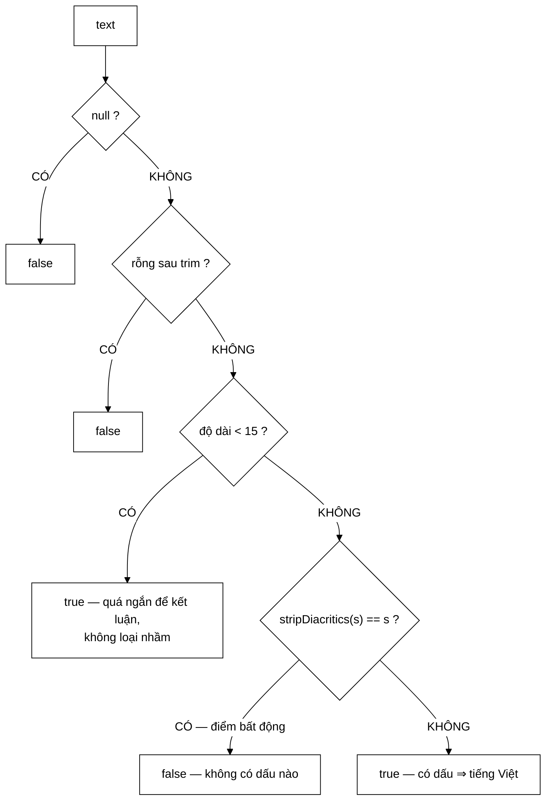

# LanguageDetector — một hàm đoán ngôn ngữ nằm trong lớp điều phối là ví dụ rõ nhất của "Feature Envy"

**File nguồn:** `search-engine/src/main/java/com/vnsearch/service/LanguageDetector.java` (54 dòng)
**Gói:** `com.vnsearch.service` · **Loại:** lớp `final`, hàm dựng `private`, API `static` ⇒ lớp tiện ích thuần hàm, an toàn đa luồng
**Vị trí trong luồng:** hai nơi — lọc trang lúc crawl, và lọc tài liệu khi sinh truy vấn đánh giá
**Đọc kèm:** [`../crawler/LanguageFilter.md`](../crawler/LanguageFilter.md) · [`../eval/KnownItemQueryGenerator.md`](../eval/KnownItemQueryGenerator.md) · [`../index/VietnameseTokenizer.md`](../index/VietnameseTokenizer.md)

---

## 📌 Hiểu trong 30 giây

Một heuristic 12 dòng: **văn bản tiếng Việt gần như luôn có ít nhất một dấu
thanh**. Kiểm tra bằng kỹ thuật **điểm bất động** của phép bỏ dấu.

```java
public static boolean looksVietnamese(String text) {
    if (text == null) return false;
    String trimmed = text.trim();
    if (trimmed.isEmpty()) return false;
    if (trimmed.length() < MIN_LENGTH_TO_JUDGE) return true;   // quá ngắn ⇒ không loại nhầm
    return !VietnameseTokenizer.stripDiacritics(trimmed).equals(trimmed);
}
```



---

## 1. "Feature Envy" — chẩn đoán đúng tên

Javadoc dòng 143–147:

> *"Trước đây đây là một phương thức `private looksVietnamese` nằm trong
> `SearchEngineFacade` — một lớp **điều phối**. Một hàm đoán ngôn ngữ nằm trong
> lớp điều phối là ví dụ rõ nhất của **«Feature Envy»**: nó **không dùng gì của
> lớp chứa nó**, và nó thuộc về một **miền tri thức hoàn toàn khác**."*

```
   ⭐ HAI DẤU HIỆU CHẨN ĐOÁN, VÀ CẢ HAI ĐỀU KIỂM ĐƯỢC

   ① "Không dùng gì của lớp chứa nó"
     looksVietnamese không đọc index, không đọc cache,
     không đọc bất kỳ trường nào của SearchEngineFacade.
     ⇒ Nó có thể là `static` ⇒ nó KHÔNG THUỘC VỀ đối tượng đó.

   ② "Thuộc về một miền tri thức hoàn toàn khác"
     SearchEngineFacade biết về: điều phối, cache, phân trang
     looksVietnamese biết về: chính tả tiếng Việt, Unicode

   ⇒ Phép thử nhanh: nếu một phương thức private có thể
     đổi thành `static` mà không phải sửa gì,
     nó đang ở SAI LỚP.
```

```
   PHÉP THỬ NÀY ÁP DỤNG ĐƯỢC CHO CẢ DỰ ÁN

   Các phương thức đã được tách ra khỏi SearchEngineFacade
   theo đúng chẩn đoán này:

     looksVietnamese      → LanguageDetector
     buildIndex           → IndexBuilder
     resolveCandidates    → CandidateResolver
     rebuildTrie          → SuggestionService

   ⇒ Bốn lần cùng một chẩn đoán, bốn lớp mới.
   ⇒ SearchEngineFacade từ 420 dòng ôm bảy trách nhiệm
     xuống còn "chỉ điều phối".
```

---

## 2. Lợi ích thứ hai: dùng được ở chỗ **trước đây bỏ sót**

Javadoc dòng 149–152:

> *"Tách ra còn cho phép dùng nó ở chỗ **THỨ HAI** mà trước đây bỏ sót:
> `KnownItemQueryGenerator` sinh truy vấn đánh giá từ corpus có lẫn bài tiếng
> Trung và tiếng Anh, tạo ra những truy vấn vô nghĩa như
> `"柬埔寨国会主席昆索达莉圆满结束对越南的正式访问 共产主义"`."*

```
   ⭐ ĐÂY LÀ LÝ DO MẠNH NHẤT ĐỂ TÁCH LỚP, MẠNH HƠN CẢ
     "CHO SẠCH KIẾN TRÚC".

   Một phương thức private KHÔNG DÙNG LẠI ĐƯỢC.
   ⇒ Nơi thứ hai cần nó có hai lựa chọn:
     ① viết lại một bản (⇒ hai bản trôi lệch)
     ② KHÔNG dùng gì cả (⇒ bỏ sót, như đã xảy ra)

   ⇒ Ở đây đã xảy ra ②: bộ sinh truy vấn đánh giá
     KHÔNG lọc ngôn ngữ, vì hàm lọc bị khoá trong
     một lớp khác.
```

```
   HẬU QUẢ CỤ THỂ — TRUY VẤN ĐÁNH GIÁ VÔ NGHĨA

   Truy vấn sinh ra:
     "柬埔寨国会主席昆索达莉圆满结束对越南的正式访问 共产主义"

   Điều gì xảy ra khi chạy nó:
     ① VietnameseTokenizer tách chuỗi Hán tự
        ⇒ ra một chuỗi "âm tiết" vô nghĩa
     ② Chỉ có ĐÚNG MỘT tài liệu chứa chúng (chính bài gốc)
     ③ ⇒ truy vấn này LUÔN đạt Success@1 = 100 %

   ⇒ Nó THỔI PHỒNG mọi độ đo chất lượng.
   ⇒ Và nó thổi phồng theo hướng KHÔNG ĐỀU:
     mô hình nào cũng đúng ở những ca này, nên nó làm
     GIẢM khoảng cách giữa BM25 và TF-IDF.

   ⇒ Tức là con số ΔMRR = +0,0452 ở
     ../ranking/RelevanceScorer.md mục 1 có thể đang bị
     ĐÁNH GIÁ THẤP.
```

```
   BÀI HỌC: MÃ KHÔNG DÙNG LẠI ĐƯỢC KHÔNG CHỈ LÀ
   "KHÓ BẢO TRÌ" — NÓ TẠO RA LỖ HỔNG CHỨC NĂNG.

   Cùng lập luận với ../query/CandidateResolver.md mục 2:
   logic bị khoá trong private buộc nơi khác phải viết lại
   hoặc bỏ qua, và cả hai đều làm hỏng giá trị của bằng chứng.
```

---

## 3. Heuristic dấu thanh — và giới hạn của nó

Javadoc dòng 154–156:

> *"Dùng **dấu thanh điệu** làm dấu hiệu. Văn bản tiếng Việt thật gần như luôn có
> ít nhất một nguyên âm mang dấu trong một câu đầy đủ; tiêu đề tiếng Anh thì không
> bao giờ có."*

```
   VÌ SAO HEURISTIC NÀY MẠNH VỚI TIẾNG VIỆT

   Tiếng Việt có 6 thanh: ngang, huyền, sắc, hỏi, ngã, nặng
   ⇒ 5/6 thanh có dấu

   Xác suất một âm tiết mang thanh ngang (không dấu) ≈ 30 %
   ⇒ Một câu 15 ký tự ≈ 4 âm tiết
   ⇒ P(cả 4 đều không dấu) ≈ 0,3⁴ ≈ 0,8 %

   ⇒ Với văn bản dài hơn, xác suất bỏ sót giảm theo hàm mũ.
   ⇒ Với một đoạn 100 từ, gần như KHÔNG THỂ không có dấu nào.
```

```
   ⚠️ GIỚI HẠN 1: VĂN BẢN TIẾNG VIỆT KHÔNG DẤU

   "may tinh xach tay gia re cho sinh vien"
   ⇒ stripDiacritics không đổi gì ⇒ trả FALSE
   ⇒ bị loại nhầm

   Đây là văn bản tiếng Việt THẬT, chỉ là gõ không dấu.
   Rất phổ biến trong bình luận, diễn đàn, tin nhắn.

   ⇒ Với corpus báo chí (nguồn crawl chính) thì hiếm.
   ⇒ Với corpus mạng xã hội thì đây là lỗi lớn.
   ⇒ Giới hạn này KHÔNG được nêu trong Javadoc.
```

```
   ⚠️ GIỚI HẠN 2: NGÔN NGỮ KHÁC CŨNG CÓ DẤU

   Tiếng Pháp:  "élève", "français", "après"
   Tiếng Tây Ban Nha: "año", "corazón"
   Tiếng Bồ:    "não", "coração"

   ⇒ stripDiacritics ĐỔI chúng ⇒ trả TRUE
   ⇒ Nhận nhầm là tiếng Việt

   Với mục đích lọc corpus tiếng Việt từ web Việt Nam,
   xác suất gặp tiếng Pháp rất thấp — nên chấp nhận được.
   Nhưng nó là NHẬN NHẦM (false positive), không phải
   BỎ SÓT (false negative).

   ⇒ Và đó là chiều sai ĐÚNG cho bài toán này:
     giữ nhầm một bài tiếng Pháp ⇒ tốn chỗ, vô hại
     loại nhầm một bài tiếng Việt ⇒ mất dữ liệu
   ⇒ Cùng nguyên tắc "khớp chiều sai với chiều an toàn"
     ở ../datastructure/BloomFilter.md mục 1.
```

---

## 4. `MIN_LENGTH_TO_JUDGE = 15` — không kết luận khi thiếu bằng chứng

```java
/**
 * Ngưỡng độ dài dưới đây thì không kết luận.
 *
 * <p>Tiêu đề rất ngắn ("Video", "Ảnh") có thể không có dấu nào mà vẫn là
 * tiếng Việt, nên coi như hợp lệ để không loại nhầm.
 */
public static final int MIN_LENGTH_TO_JUDGE = 15;

if (trimmed.length() < MIN_LENGTH_TO_JUDGE) {
    return true; // qua ngan de ket luan -> khong loai nham
}
```

```
   ⭐ TRẢ `true` KHI KHÔNG BIẾT — LỰA CHỌN CÓ CHỦ ĐÍCH

   Ba lựa chọn khả dĩ khi không đủ bằng chứng:
     ① trả true  ⇒ giữ lại  ⇒ có thể lẫn rác
     ② trả false ⇒ loại bỏ  ⇒ có thể mất dữ liệu tốt
     ③ trả Optional.empty() ⇒ người gọi tự quyết

   Chọn ① vì: mất một trang tiếng Việt tệ hơn giữ một trang lạ.

   ⇒ Đây là quyết định về CHÍNH SÁCH, không phải kỹ thuật.
   ⇒ Và nó được ghi ra, kèm ví dụ cụ thể ("Video", "Ảnh").
```

```
   ⚠️ NHƯNG NÓ LÀM TÊN HÀM NÓI SAI MỘT NỬA

   looksVietnamese("Hello") → true
                              ↑ "Hello" KHÔNG hề trông giống tiếng Việt

   Javadoc dòng 174 nói đúng: "true nếu văn bản có vẻ là tiếng Việt
   (HOẶC QUÁ NGẮN ĐỂ KẾT LUẬN)"

   ⇒ Tên hàm hứa một điều, hàm trả về hai điều khác nhau
     gộp làm một.
   ⇒ Người gọi không phân biệt được "chắc chắn tiếng Việt"
     với "không biết".

   ⇒ Với LanguageFilter (lọc crawl) thì gộp là đúng.
   ⇒ Với KnownItemQueryGenerator (sinh truy vấn) thì có thể
     muốn chặt hơn — nhưng không có cách nào.
     Xem đề xuất 2.
```

```
   VÌ SAO LÀ 15 CHỨ KHÔNG PHẢI SỐ KHÁC

   15 ký tự ≈ 3–4 âm tiết tiếng Việt

   Ngắn hơn: "Video" (5), "Hình ảnh" (8), "Thời sự" (8)
   ⇒ đều là tiêu đề mục THẬT trên báo Việt Nam
   ⇒ và một số trong đó không có dấu

   ⇒ Con số này gắn với dữ liệu thật, không phải số tròn.
   ⇒ Nhưng lý do chọn ĐÚNG 15 (thay vì 12 hay 20)
     không được đo — nó là ước lượng hợp lý.
```

---

## 5. Kỹ thuật điểm bất động

```java
return !VietnameseTokenizer.stripDiacritics(trimmed).equals(trimmed);
```

Javadoc dòng 158–159: *"Kỹ thuật kiểm tra dùng **điểm bất động** của phép bỏ dấu:
`stripDiacritics(s) == s` khi và chỉ khi `s` không có dấu nào."*

```
   ĐÂY LÀ LẦN THỨ HAI KỸ THUẬT NÀY XUẤT HIỆN TRONG DỰ ÁN

   ../ranking/QuerySyllables.md mục 2:
     dùng điểm bất động để quyết định "tiếng này có dấu không"
     ⇒ chọn chế độ khớp chính xác hay khớp lỏng

   Ở đây:
     dùng điểm bất động để quyết định "văn bản này có dấu không"
     ⇒ chọn giữ hay loại tài liệu

   ⇒ Cùng một kỹ thuật, hai bài toán khác nhau.
   ⇒ Và cùng một ưu điểm: phép kiểm ĐỊNH NGHĨA BẰNG
     chính phép biến đổi, nên hai thứ KHÔNG THỂ trôi lệch.
```

```
   VÌ SAO KHÔNG LIỆT KÊ KÝ TỰ CÓ DẤU

   if (text.matches(".*[àáảãạăằắẳẵặâầấẩẫậ...].*"))

   ⇒ ~134 ký tự phải liệt kê cho tiếng Việt
   ⇒ Sót một ký tự = sai âm thầm
   ⇒ Và nếu stripDiacritics đổi cách xử lý một ký tự nào đó,
     danh sách này KHÔNG tự đổi theo

   ⇒ Điểm bất động không có nhược điểm nào trong số đó.
```

```
   ⚠️ CHI PHÍ: stripDiacritics TẠO MỘT CHUỖI MỚI

   Với văn bản 6.000 ký tự, mỗi lần gọi:
     - chuẩn hoá Unicode NFD
     - duyệt và lọc từng ký tự
     - dựng chuỗi kết quả
   ⇒ ~12 KB rác mỗi lần gọi

   Gọi cho 30.017 trang ⇒ ~360 MB rác.

   ⇒ Có thể dừng NGAY khi tìm thấy ký tự có dấu ĐẦU TIÊN
     thay vì bỏ dấu cả chuỗi rồi so sánh.
   ⇒ Xem đề xuất 3.
```

---

## 6. Hướng dẫn thực hành

### 6.1 Dùng

```java
if (!LanguageDetector.looksVietnamese(doc.getBodyText())) {
    return;   // bo qua trang khong phai tieng Viet
}
```

### 6.2 Cạm bẫy

```
   ① looksVietnamese("Hello") → TRUE (quá ngắn để kết luận).
     Tên hàm không nói ra điều này. Đọc Javadoc.

   ② Văn bản tiếng Việt KHÔNG DẤU bị loại nhầm.
     "may tinh xach tay" → false.

   ③ Tiếng Pháp/Tây Ban Nha/Bồ Đào Nha bị nhận nhầm là tiếng Việt.
     Chấp nhận được vì chiều sai an toàn, nhưng phải biết.

   ④ Ngưỡng 15 tính theo KÝ TỰ, không theo âm tiết.
     Một chuỗi 15 dấu cách sẽ qua ngưỡng rồi trả false.
     (Thực tế trim() đã xử lý phần lớn trường hợp này.)

   ⑤ Mỗi lời gọi tạo một chuỗi mới cỡ bằng đầu vào.
     Gọi trên bodyText đầy đủ của 30.017 trang là ~360 MB rác.

   ⑥ Hàm trả boolean, KHÔNG trả mã ngôn ngữ.
     WebDocument.language lưu "vi"/"en"/"und" — ba giá trị,
     nhưng hàm này chỉ phân biệt được hai.
```

---

## 7. Độ phức tạp & chi phí

| Thao tác | Chi phí |
|---|---|
| `looksVietnamese` | $O(L)$ thời gian, $O(L)$ bộ nhớ tạm |

```
   PHÂN TÍCH — L = độ dài văn bản

   trim()                      O(L), có thể tạo chuỗi mới
   stripDiacritics(trimmed)    O(L), TẠO chuỗi mới
   .equals(trimmed)            O(L), so sánh từng ký tự
   ────────────────────────────────────────────────────
   O(L) thời gian, O(L) bộ nhớ tạm

   ⚠️ Nhưng .equals() dừng ở ký tự KHÁC ĐẦU TIÊN.
     Với văn bản tiếng Việt, ký tự có dấu thường xuất hiện sớm
     ⇒ so sánh thực tế rất nhanh.

   ⇒ Chi phí thật nằm ở stripDiacritics phải xử lý TOÀN BỘ
     chuỗi trước khi so sánh bắt đầu.
   ⇒ Đó chính là phần lãng phí mà đề xuất 3 nhắm tới.
```

---

## 8. Kiểm thử liên quan

```
   ⚠️ KHÔNG CÓ FILE TEST NÀO CHO LỚP NÀY.

   Nó được phủ gián tiếp qua LanguageFilterTest —
   nhưng đó là test cho lớp GỌI, không phải cho heuristic.
```

```
   NHỮNG THỨ KHÔNG ĐƯỢC CANH GIỮ

   ✗ Ngưỡng MIN_LENGTH_TO_JUDGE: chuỗi 14 ký tự không dấu
     → true, chuỗi 15 ký tự không dấu → false.
     Đây là ranh giới quyết định chính của hàm.

   ✗ null → false, chuỗi rỗng → false
   ✗ Tiếng Anh dài → false
   ✗ Tiếng Việt có dấu → true
   ✗ Tiếng Việt KHÔNG dấu → false (giới hạn đã biết —
     một test ghi lại nó biến "lỗi chưa biết" thành
     "hành vi đã ghi nhận")
   ✗ Tiếng Trung → false (chính ca đã sinh ra truy vấn
     đánh giá vô nghĩa ở mục 2)

   ⇒ Sáu tính chất, không một test nào — cho một hàm
     mà toàn bộ chất lượng corpus phụ thuộc vào.
```

Xem đề xuất 1.

---

## 9. Liên kết

- Nguồn `stripDiacritics` — phép biến đổi mà heuristic dựa vào: [`../index/VietnameseTokenizer.md`](../index/VietnameseTokenizer.md)
- Hai nơi sử dụng: [`../crawler/LanguageFilter.md`](../crawler/LanguageFilter.md) · [`../eval/KnownItemQueryGenerator.md`](../eval/KnownItemQueryGenerator.md)
- Nơi kết quả được lưu lại: [`../model/WebDocument.md`](../model/WebDocument.md) (trường `language`)
- Lớp từng chứa hàm này: [`SearchEngineFacade.md`](./SearchEngineFacade.md)
- Cùng kỹ thuật điểm bất động: [`../ranking/QuerySyllables.md`](../ranking/QuerySyllables.md) mục 2
- Cùng nguyên tắc "khớp chiều sai với chiều an toàn": [`../datastructure/BloomFilter.md`](../datastructure/BloomFilter.md) mục 1
- Nơi truy vấn đánh giá rác làm sai lệch số đo: [`../eval/EvaluationHarness.md`](../eval/EvaluationHarness.md) · [`../ranking/RelevanceScorer.md`](../ranking/RelevanceScorer.md)
