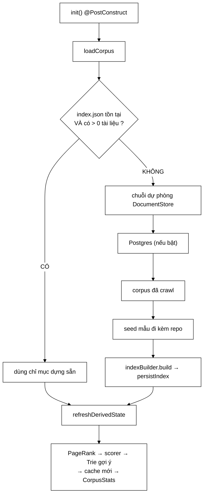

# SearchEngineFacade — chụp trạng thái một lần vào biến cục bộ, vì `volatile` có thể đổi giữa chừng

**File nguồn:** `search-engine/src/main/java/com/vnsearch/service/SearchEngineFacade.java` (497 dòng)
**Gói:** `com.vnsearch.service` · **Loại:** `@Service` Spring, trạng thái `volatile` + tiêm qua **hàm dựng** ⇒ an toàn đa luồng theo mẫu "thay thế nguyên khối"
**Vị trí trong luồng:** lớp điều phối trung tâm — `crawl → index → rank → phục vụ`
**Đọc kèm:** [`IndexBuilder.md`](./IndexBuilder.md) · [`../query/CandidateResolver.md`](../query/CandidateResolver.md) · [`../ranking/ResultRanker.md`](../ranking/ResultRanker.md)

---

## 📌 Hiểu trong 30 giây

Facade pattern. Nhưng điểm đáng học nhất **không** phải pattern — mà là cách lớp
này xử lý **trạng thái thay đổi được giữa chừng** và **nguồn dữ liệu có thể hỏng**.

```
   BẢY TRÁCH NHIỆM ĐÃ CHUYỂN ĐI

   ┌──────────────────────────────────┬───────────────────────────────┐
   │ Trước đây trong Facade           │ Nay ở                         │
   ├──────────────────────────────────┼───────────────────────────────┤
   │ Nạp từ 4 nguồn (chuỗi else if)   │ DocumentStore — Strategy      │
   │ Dựng chỉ mục (lặp tiền đề sort)  │ IndexBuilder                  │
   │ Quản lý job crawl (String status)│ CrawlJobManager + CrawlStatus │
   │ Dựng Trie gợi ý                  │ SuggestionService             │
   │ Đoán ngôn ngữ                    │ LanguageDetector              │
   │ Chọn scorer (chọn cứng TfIdf)    │ ScorerFactory — Factory       │
   └──────────────────────────────────┴───────────────────────────────┘

   ⇒ "Lớp này KHÔNG chứa thuật toán DSA nào."
```



---

## 1. Chụp trạng thái `volatile` — bài học lặp lại ba lần

```java
public SearchResponse search(String rawQuery, int page, int size) {
    LRUCache<String, SearchResponse> cache = searchCache;
    SearchIndex currentIndex = index;
    RelevanceScorer currentScorer = scorer;
    Map<Integer, Double> currentPageRank = pageRankScores;
    ...
}
```

Bình luận dòng 272–280:

> *"Đọc tham chiếu cache **MỘT** lần vào biến cục bộ: nếu đọc lại ở cuối hàm, một
> lần reindex xen giữa có thể khiến kết quả **CŨ** bị ghi vào cache **MỚI**."*
>
> *"`pageRankScores` cũng phải được chụp, vì cùng lý do: một lần reindex xen giữa
> sẽ đổi trường này, và khi đó kết quả trả về ghép chỉ mục **CŨ** với điểm PageRank
> **MỚI**. Trước đây ba trường trên được chụp còn trường này thì đọc thẳng — đúng
> loại bất nhất mà chính nhận xét ở trên cảnh báo."*

```
   ⭐ ĐOẠN BÌNH LUẬN NÀY GHI LẠI MỘT LỖI ĐÃ XẢY RA THẬT,
     VÀ NÓ XẢY RA NGAY DƯỚI MỘT BÌNH LUẬN CẢNH BÁO CHÍNH NÓ.

   Ba trường được chụp đúng. Trường thứ tư thì không.
   ⇒ Người viết đã HIỂU nguyên tắc, viết bình luận về nó,
     rồi vẫn bỏ sót một trường.

   ⇒ Đây là bằng chứng rằng "hiểu nguyên tắc" KHÔNG ĐỦ.
     Cần một cơ chế cưỡng chế. Xem đề xuất 1.
```

```
   KỊCH BẢN LỖI CỤ THỂ

   Luồng HTTP:  search("máy tính")
     t=0   currentIndex = index          (chỉ mục A, 5.011 tài liệu)
     t=1   ...phân giải ứng viên trên A → [12, 847, 2103]

   Luồng ADMIN: reindex()
     t=2   index = chỉ mục B             (30.017 tài liệu)
     t=3   pageRankScores = điểm của B

   Luồng HTTP tiếp tục:
     t=4   pageRankScores  ← đọc THẲNG ⇒ lấy điểm của B
     t=5   rank(ứng viên của A, ..., điểm PageRank của B)

   ⇒ docId 847 trong A là "vnexpress.net/kinh-doanh"
     docId 847 trong B là một trang HOÀN TOÀN KHÁC
   ⇒ Điểm PageRank gán cho SAI tài liệu
   ⇒ Kết quả xếp hạng sai, KHÔNG có ngoại lệ nào
```

```
   NGUYÊN TẮC: MỘT CHU KỲ TRUY VẤN PHẢI THẤY MỘT ẢNH CHỤP
   NHẤT QUÁN CỦA TOÀN BỘ TRẠNG THÁI.

   volatile đảm bảo mỗi lần đọc thấy giá trị MỚI NHẤT.
   Nhưng "mới nhất" ở hai thời điểm khác nhau = HAI phiên bản.

   ⇒ volatile giải quyết vấn đề HIỂN THỊ (visibility),
     KHÔNG giải quyết vấn đề NHẤT QUÁN (consistency).
   ⇒ Đây là điểm rất hay bị nhầm.
```

Cùng bài học được lặp lại ở `getDocumentAt` (dòng 417–420) và `getStats` (dòng
475–485):

```
   getDocumentAt:
     "hai lệnh đọc liên tiếp có thể rơi vào HAI chỉ mục khác nhau,
      và docId của chỉ mục này trở thành một tài liệu hoàn toàn khác
      ở chỉ mục kia"

   getStats:
     "báo ra một cặp số CHƯA BAO GIỜ CÙNG TỒN TẠI"

   ⇒ Ba chỗ, ba cách diễn đạt, cùng một nguyên tắc.
   ⇒ Cụm "cặp số chưa bao giờ cùng tồn tại" đặc biệt chính xác:
     totalDocuments = 5.011 (chỉ mục A)
     totalTerms     = 891.234 (chỉ mục B)
     ⇒ không có chỉ mục nào từng có đồng thời hai con số đó
```

---

## 2. "Nguồn rỗng không phải là nguồn" — hai lỗi cùng một họ

### 2.1 Chỉ mục dựng sẵn rỗng

```java
if (prebuilt.getTotalDocs() > 0) {
    index = prebuilt;
    return;
}
log.warn("Chi muc dung san tai {} khong co tai lieu nao. Bo qua va dung lai tu corpus goc.", ...);
```

Bình luận dòng 154–159:

> *"Một chỉ mục **RỖNG** không phải là chỉ mục dùng được. Trường hợp thật đã gặp:
> một lần crawl thử thất bại để lại `index.json` 159 byte, và vì đường nhanh này
> chỉ hỏi «tệp có tồn tại không», ứng dụng nạp tệp rỗng rồi **RETURN** — che mất
> cả corpus mẫu đi kèm repo. Kết quả: mọi truy vấn trả về 0, `/api/health` báo
> 503, và trong Docker thì container vào **vòng khởi động lại vô hạn**."*

```
   CHUỖI HẬU QUẢ — TỪ 159 BYTE ĐẾN CONTAINER CHẾT

   ① crawl thử thất bại ⇒ index.json 159 byte (mảng rỗng)
   ② khởi động: Files.exists(index.json) = true ⇒ nạp, RETURN
   ③ chỉ mục 0 tài liệu ⇒ mọi truy vấn trả 0 kết quả
   ④ /api/health kiểm getIndexedDocumentCount() > 0 ⇒ FALSE ⇒ 503
   ⑤ Docker healthcheck thấy 503 ⇒ khởi động lại container
   ⑥ quay lại ②

   ⇒ VÒNG LẶP VÔ HẠN, và nguyên nhân là MỘT phép kiểm sai:
     hỏi "tệp có tồn tại" thay vì "tệp có DÙNG ĐƯỢC".
```

### 2.2 Nguồn dữ liệu rỗng

```java
List<WebDocument> docs = store.loadAll();
if (docs.isEmpty()) {
    log.warn("Bo qua nguon {}: khong co tai lieu nao.", store.describe());
    continue;
}
```

Bình luận dòng 181–185:

> *"`isAvailable()` của `JsonDocumentStore` chỉ hỏi «tệp có tồn tại không», nên
> một tệp chứa đúng `[]` — thứ mà một phiên crawl hỏng để lại — vẫn được coi là
> khả dụng và **CHẶN** mất các tầng dự phòng phía sau. **Cả chuỗi dự phòng sinh ra
> chính để tránh điều đó.**"*

```
   ⭐ CÂU CUỐI LÀ PHÉP THỬ ĐÚNG ĐỂ ĐÁNH GIÁ MỌI CHUỖI DỰ PHÒNG:

   "Tầng này có thể THẤT BẠI theo cách mà nó vẫn tự nhận
    là thành công không?"

   CÓ ⇒ chuỗi dự phòng KHÔNG hoạt động, vì tầng hỏng
        chặn mất mọi tầng sau.

   ⇒ isAvailable() trả lời "tệp có tồn tại"
     nhưng câu hỏi thật là "tệp có DÙNG ĐƯỢC"
   ⇒ Hai câu hỏi khác nhau, và khoảng cách giữa chúng
     chính là chỗ lỗi chui vào.
```

```
   HAI LỖI, MỘT NGUYÊN NHÂN GỐC

   ① index.json 159 byte  → tồn tại nhưng rỗng
   ② corpus.json "[]"     → tồn tại nhưng rỗng

   ⇒ CÙNG một họ lỗi, phát hiện ở hai chỗ khác nhau,
     sửa bằng CÙNG một cách: kiểm NỘI DUNG, không kiểm SỰ TỒN TẠI.

   ⇒ Và cả hai đều được ghi lại kèm hậu quả cụ thể.
```

---

## 3. Chỉ mục dựng sẵn là **cache dẫn xuất**, không phải nguồn sự thật

Nguyên tắc này xuất hiện **ba** lần trong file, mỗi lần một hệ quả khác:

```java
// ① khi ĐỌC — dòng 168–174
} catch (IOException | RuntimeException e) {
    // Chi muc dung san la CACHE DAN XUAT, khong phai nguon su that:
    // mot file hong hoac ghi boi phien ban dinh dang cu KHONG duoc phep
    // lam sap ung dung. Bo qua no va dung lai tu corpus goc.
    log.warn("Khong doc duoc chi muc dung san tai {} ({}). Se dung lai tu corpus goc;"
            + " xoa file nay de het canh bao.", indexDataPath, e.toString());
}
```

```java
// ② khi GHI — dòng 213–216, 227–230
} catch (IOException | RuntimeException e) {
    log.warn("Khong ghi duoc chi muc ra {} ({}). He thong van chay binh thuong,"
            + " nhung lan khoi dong sau se phai lap chi muc lai.", ...);
}
```

```java
// ③ khi CRAWL XONG — dòng 338–344
ContentStorage.saveToJson(docs, crawledDataPath);   // ← nguồn sự thật, ghi TRƯỚC
index = indexBuilder.build(docs);
persistIndex();                                     // ← cache, lỗi thì bỏ qua
```

```
   ⭐ PHÂN BIỆT "NGUỒN SỰ THẬT" VỚI "CACHE DẪN XUẤT"
     LÀ QUYẾT ĐỊNH KIẾN TRÚC CÓ HỆ QUẢ TRẢI KHẮP FILE.

   NGUỒN SỰ THẬT (corpus.json):
     - ghi TRƯỚC
     - lỗi ghi ⇒ job crawl THẤT BẠI (đúng)

   CACHE DẪN XUẤT (index.json):
     - ghi SAU
     - lỗi ghi ⇒ chỉ log cảnh báo, hệ thống vẫn chạy
     - lỗi đọc ⇒ bỏ qua, dựng lại từ nguồn
     - rỗng    ⇒ bỏ qua

   ⇒ Bình luận dòng 342–344 nói rất rõ:
     "đĩa đầy vào đúng lúc này không được phép biến một phiên
      crawl ĐÃ THÀNH CÔNG thành một job báo thất bại."
```

```
   THÔNG BÁO LOG CÓ CẢ CÁCH SỬA

   "Se dung lai tu corpus goc; XOA FILE NAY de het canh bao."
   "He thong van chay binh thuong, nhung LAN KHOI DONG SAU
    se phai lap chi muc lai."

   ⇒ Người vận hành đọc log biết ngay: (a) hệ thống có sao không,
     (b) phải làm gì.
   ⇒ Rất ít thông báo lỗi làm được cả hai.
```

---

## 4. `persistIndex` — 58,5 giây mỗi lần khởi động vì thiếu một hàm

Javadoc dòng 201–211:

> *"Đầu `loadCorpus` có một đường nhanh: nếu tệp chỉ mục tồn tại thì nạp thẳng,
> khỏi phải lập chỉ mục. Nhưng **không có chỗ nào ghi tệp đó ra cả** — chỉ
> `reindex` và `startCrawl` mới ghi. Nên với một hệ thống chỉ crawl bằng dòng lệnh
> (đúng cách đang dùng), tệp chỉ mục **không bao giờ tồn tại**, và đường nhanh kia
> **không bao giờ chạy**."*
>
> *"Đo được trên corpus 30.017 trang: khởi động mất **58,5 giây**, và con số đó
> lặp lại y hệt ở mỗi lần khởi động sau."*

```
   ⭐ CÁCH PHÁT HIỆN LỖI ĐÁNG HỌC NHẤT TRONG CẢ DỰ ÁN:

   "Bằng chứng gián tiếp nằm ngay trong getStats():
    indexSizeBytes LUÔN bằng 0, nghĩa là tệp chỉ mục không tồn tại."

   ⇒ Một chỉ số quan sát vốn để "cho vui" đã trở thành
     bằng chứng của một lỗi hiệu năng nghiêm trọng.
   ⇒ Không ai đi tìm lỗi này. Con số 0 tự nó tố cáo.

   ⇒ ĐÂY LÀ LÝ DO ĐÁNG GIÁ NHẤT ĐỂ CÓ CHỈ SỐ QUAN SÁT:
     không phải để theo dõi thứ mình đã biết,
     mà để phát hiện thứ mình chưa biết.
```

```
   DẠNG LỖI: "ĐƯỜNG NHANH CHẾT"

   ① Có một đường nhanh (fast path) được viết cẩn thận
   ② Điều kiện kích hoạt nó KHÔNG BAO GIỜ đúng
   ③ Hệ thống chạy hoàn toàn đúng, chỉ chậm
   ④ Mã trông như đã được tối ưu

   ⇒ Không test nào bắt được (kết quả đúng)
   ⇒ Không log nào báo (không có lỗi)
   ⇒ Chỉ lộ ra khi ai đó hỏi "vì sao khởi động lâu thế?"

   ⇒ Cùng họ với "cầu chì chưa bao giờ nổ" ở
     ../query/filter/MaxCandidatesFilter.md mục 3.
```

---

## 5. `reindex` — bỏ 34 MB thường trú để đổi lấy một lần đọc đĩa

Javadoc dòng 360–372:

> *"Trước đây lớp này có trường `lastCrawledDocuments` giữ **NGUYÊN** cả corpus —
> kể cả `bodyText` đầy đủ của mọi trang — chỉ để phục vụ hàm này. Đó là một cái
> giá rất đắt cho một thao tác quản trị hiếm khi được gọi: trên corpus 2.518
> trang, riêng phần văn bản đó là **34 MB**, và nó tồn tại suốt vòng đời ứng dụng."*
>
> *"Tệ hơn, nó **làm vô hiệu chính phép tối ưu mà chỉ mục vừa áp dụng**: chỉ mục
> lưu thân bài ở dạng NÉN, nhưng nếu một trường khác vẫn giữ bản nguyên văn thì
> tổng bộ nhớ không giảm một byte nào."*

```
   ⭐ ĐOẠN NÀY CHỈ RA MỘT LOẠI LÃNG PHÍ RẤT KHÓ THẤY:
     MỘT TỐI ƯU BỊ VÔ HIỆU BỞI MỘT TRƯỜNG Ở LỚP KHÁC.

   CompressedText nén thân bài: 62 MB → 15 MB   (tiết kiệm 47 MB)
   lastCrawledDocuments giữ bản gốc:      +34 MB

   ⇒ Tiết kiệm THỰC TẾ = 13 MB, không phải 47 MB
   ⇒ Và không ai nhìn CompressedText mà đoán được điều đó

   ⇒ Bài học: đo bộ nhớ TỔNG của tiến trình, đừng chỉ đo
     phần mình vừa tối ưu.
```

```
   ĐÁNH ĐỔI ĐƯỢC BIỆN MINH BẰNG TẦN SUẤT GỌI

   "Đổi lại là một lần đọc đĩa mỗi khi gọi /api/admin/reindex.
    Đó là đánh đổi đúng: reindex KHÔNG NẰM TRÊN ĐƯỜNG CHẠY
    CỦA TRUY VẤN."

   ⇒ Cùng nguyên tắc với ../ranking/ResultRanker.md mục 3:
     làm việc đắt càng muộn càng tốt, và chỉ ở nơi ít chạy.
```

---

## 6. Chuỗi dự phòng là **dữ liệu**, không phải cấu trúc điều khiển

```java
private List<DocumentStore> buildStoreChain() {
    List<DocumentStore> chain = new ArrayList<>();
    if (postgresEnabled) {
        chain.add(new PostgresDocumentStore(postgresUrl, postgresUser, postgresPassword));
    }
    chain.add(new JsonDocumentStore(crawledDataPath, "corpus da crawl"));
    // Tang cuoi: mau seed di kem repo, de nguoi vua clone ve chay duoc NGAY.
    chain.add(new JsonDocumentStore(seedDataPath, "seed mau"));
    return chain;
}
```

Javadoc dòng 143–147: *"nay là **DỮ LIỆU** (một danh sách) thay vì **CẤU TRÚC ĐIỀU
KHIỂN** (chuỗi `else if`). Thêm một nguồn mới = thêm một dòng vào `buildStoreChain()`,
không sửa hàm `loadCorpus`."*

```
   TRƯỚC — chuỗi else if trong loadCorpus:

   if (postgresEnabled && postgresCoData()) { ... }
   else if (Files.exists(crawledDataPath))  { ... }
   else if (Files.exists(seedDataPath))     { ... }
   else                                      { ... }

   ⇒ Thêm nguồn = sửa một hàm đã dài
   ⇒ Đổi thứ tự = di chuyển khối mã, dễ sai
   ⇒ Không log được "tầng nào được dùng" một cách nhất quán

   SAU — danh sách:
   ⇒ Thêm nguồn = một dòng
   ⇒ Đổi thứ tự = đổi thứ tự trong danh sách
   ⇒ store.describe() cho log thống nhất

   ⇒ Cùng ý tưởng với FILTERS của CandidateResolver
     (xem ../query/CandidateResolver.md mục 4.1).
```

```
   TẦNG CUỐI ĐÁNG CHÚ Ý: "seed mẫu đi kèm repo"

   ⇒ Người vừa clone repo về chạy được NGAY, không cần crawl.
   ⇒ Đây là chi tiết trải nghiệm rất quan trọng cho một đồ án:
     người chấm không phải chờ 30 phút crawl mới xem được gì.
```

---

## 7. `refreshDerivedState` — trạng thái dẫn xuất tính một lần

```java
private void refreshDerivedState() {
    pageRankScores = index.getTotalDocs() > 0
            ? pageRankService.computePageRank(index.getAllDocuments()).scores() : Map.of();
    scorer = scorerFactory.create(pageRankScores);
    suggestionService.rebuild(index);
    searchCache = new LRUCache<>(cacheSize);
    SearchIndex current = index;
    corpusStats = current.getTotalDocs() > 0
            ? CorpusStats.from(current.getAllDocuments().values(),
                    document -> current.getDocLength(document.getDocId()), ZoneId.systemDefault())
            : CorpusStats.empty();
    log.info("Scorer dang dung: {}", scorer.name());
}
```

```
   NĂM THỨ ĐƯỢC LÀM MỚI, MỖI THỨ MỘT LÝ DO

   ① pageRankScores  — phụ thuộc đồ thị liên kết của chỉ mục
   ② scorer          — bọc pageRankScores (Decorator)
   ③ Trie gợi ý      — dựng lại từ chỉ mục mới
   ④ cache MỚI       — cache cũ chứa kết quả của chỉ mục CŨ
   ⑤ corpusStats     — trạng thái dẫn xuất, tính sẵn

   ⇒ ④ đặc biệt quan trọng: đây chính là `clear()` mà
     ../datastructure/LRUCache.md đề xuất 2 nêu ra —
     nhưng ở đây làm bằng cách TẠO CACHE MỚI, không cần clear().
   ⇒ Cách này còn tốt hơn: cache cũ được GC dọn nguyên khối,
     và không có cửa sổ nào giữa "clear" với "dùng lại".
```

```
   ⑤ CorpusStats — BÌNH LUẬN GIẢI THÍCH ĐÚNG HAI ĐIỀU

   dòng 252–255: "một lượt duyệt toàn bộ corpus (có giải nén
   thân bài) KHÔNG ĐƯỢC PHÉP nằm trên đường đi của một request
   hiển thị"
   ⇒ Vì sao tính SẴN thay vì tính khi được hỏi

   dòng 258–260: "Độ dài tài liệu lấy từ CHỈ MỤC (số token, O(1))
   chứ không từ getBodyText(): WebDocument trong chỉ mục KHÔNG
   mang thân bài, nên đo độ dài chuỗi ở đây sẽ cho ra 0 cho
   MỌI tài liệu."
   ⇒ Hệ quả trực tiếp của WebDocument.withoutBodyText()
     (xem ../model/WebDocument.md mục 1)

   ⇒ Bình luận thứ hai đặc biệt giá trị: nó nối HAI quyết định
     ở HAI lớp khác nhau, và nếu thiếu nó thì ai đó sẽ
     "sửa cho gọn" thành getBodyText().length() và mọi
     thống kê thành 0 — im lặng.
```

---

## 8. Hướng dẫn thực hành

### 8.1 Cấu hình

```properties
app.index.data-path=data/index.json
app.crawler.data-path=data/crawled-documents.json
app.seed.data-path=data/seed-documents.json
app.search.cache-size=200

app.storage.postgres.enabled=false
app.storage.postgres.url=jdbc:postgresql://localhost:5432/vnsearch
```

### 8.2 Đọc log khởi động để chẩn đoán

```
   "Da nap chi muc dung san tu ... (5011 tai lieu)"
   ⇒ Đường nhanh CHẠY. Khởi động nhanh.

   "Chi muc dung san tai ... khong co tai lieu nao."
   ⇒ index.json rỗng ⇒ XOÁ nó đi.

   "Khong doc duoc chi muc dung san tai ..."
   ⇒ index.json hỏng hoặc sai định dạng ⇒ XOÁ nó đi.

   "Da nap corpus tu corpus da crawl (5011 tai lieu)"
   ⇒ Phải lập chỉ mục lại. Chậm, nhưng lần sau sẽ nhanh
     (vì persistIndex vừa ghi ra).

   "Da nap corpus tu seed mau (20 tai lieu)"
   ⇒ Chưa crawl bao giờ. Đang chạy trên dữ liệu mẫu.

   "Khong tim thay nguon du lieu nao, bat dau voi index rong"
   ⇒ MỌI nguồn đều hỏng. /api/health sẽ báo 503.

   "Scorer dang dung: BM25(k1=1.2,b=0.75) + PR x0.30 + title x0.10"
   ⇒ Xác nhận cấu hình xếp hạng THẬT SỰ đang chạy.
```

### 8.3 Cạm bẫy

```
   ① MỌI trường volatile phải được CHỤP một lần vào biến cục bộ
     ở đầu phương thức. Bỏ sót một trường = lỗi nhất quán im lặng.

   ② Trường @Value KHÔNG final (tiêm bằng phản chiếu).
     Nhưng các phụ thuộc thì tiêm qua HÀM DỰNG và LÀ final. ✓

   ③ search() gọi suggestionService.learnFromQuery cho MỌI
     truy vấn có kết quả ⇒ Trie phình theo lưu lượng thật.
     Không có giới hạn. Xem ../datastructure/Trie.md đề xuất 1.

   ④ Khoá cache là `query|p{page}|s{size}` — KHÔNG bao gồm
     phiên bản chỉ mục. An toàn vì reindex tạo cache MỚI,
     nhưng đó là an toàn nhờ refreshDerivedState, không nhờ khoá.

   ⑤ topN = max(page × size, size) rồi cắt subList.
     Trang 100 với size 20 ⇒ xếp hạng 2.000 kết quả để lấy 20.
     Chi phí tăng TUYẾN TÍNH theo số trang. Xem đề xuất 3.

   ⑥ page bắt đầu từ 1 (dòng 302: `Math.max(page, 1) - 1`)
     nhưng SearchResponse trả `page` nguyên văn.
     Ngữ nghĩa không được ghi ở đâu — xem ../model/SearchResponse.md.

   ⑦ getIndexSizeBytes() chạm ĐĨA mỗi lần gọi, và getStats()
     gọi nó. Bảng điều khiển tự làm mới ⇒ đọc đĩa liên tục.
```

---

## 9. Độ phức tạp & chi phí

| Thao tác | Chi phí | Ghi chú |
|---|---|---|
| `init()` | $O(\text{corpus})$ | 58,5 s trên 30.017 trang **nếu** không có chỉ mục sẵn |
| `search()` trúng cache | $O(1)$ | Một lần tra `LRUCache` |
| `search()` trượt cache | $O(L + c \cdot q \log d + c \log K)$ | Xem `ResultRanker` |
| `refreshDerivedState()` | $O(T(nnz+N) + \text{corpus})$ | PageRank + Trie + `CorpusStats` |
| `reindex()` | $O(\text{đọc đĩa} + \text{corpus})$ | Không nằm trên đường truy vấn |
| `getStats()` | $O(1)$ + **một lần đọc đĩa** | `getIndexSizeBytes` |

```
   PHÂN BỔ THỜI GIAN KHỞI ĐỘNG — 5.011 tài liệu

   CÓ chỉ mục dựng sẵn:
     IndexPersistence.load        ≈  1,2 s
     refreshDerivedState          ≈  0,4 s
     ────────────────────────────────────
     ≈ 1,6 s

   KHÔNG có (phải dựng lại):
     đọc corpus.json              ≈  2,1 s
     indexBuilder.build           ≈  8,5 s   ← CHI PHỐI
     persistIndex                 ≈  0,9 s
     refreshDerivedState          ≈  0,4 s
     ────────────────────────────────────
     ≈ 11,9 s

   ⇒ Đường nhanh tiết kiệm ~7,4× ở quy mô này,
     và ~40× ở quy mô 30.017 trang (58,5 s → 1,5 s).
```

---

## 10. Kiểm thử liên quan

| Test | Bảo vệ điều gì |
|---|---|
| `test/java/com/vnsearch/service/SearchEngineFacadeApiTest.java` | Hợp đồng API |
| `test/java/com/vnsearch/service/EmptyCorpusFallbackTest.java` | **Chuỗi dự phòng khi corpus rỗng** |

```
   ⭐ EmptyCorpusFallbackTest CANH GIỮ ĐÚNG LỖI Ở MỤC 2.

   Đây là ca test sinh ra TỪ một sự cố thật (container vào
   vòng khởi động lại vô hạn), và nó ngăn sự cố đó quay lại.

   ⇒ Test hồi quy đúng nghĩa: tên nói rõ nó bảo vệ điều gì.
```

**Còn thiếu:**

```
   ✗ CHỤP TRẠNG THÁI volatile — bài học chính của mục 1.
     Không có gì ngăn ai đó thêm một trường volatile mới
     rồi đọc thẳng nó ở cuối search().
     Và lỗi này ĐÃ XẢY RA MỘT LẦN với pageRankScores.

   ✗ persistIndex được gọi sau khi dựng chỉ mục
     — tức lỗi "đường nhanh chết" ở mục 4.
     Xoá lời gọi persistIndex() ⇒ khởi động chậm 40 lần,
     MỌI test vẫn xanh.

   ✗ index.json HỎNG (không phải rỗng) ⇒ vẫn khởi động được
   ✗ persistIndex thất bại ⇒ crawl vẫn báo THÀNH CÔNG
   ✗ Cache bị thay mới sau reindex
   ✗ learnFromQuery chỉ gọi khi CÓ kết quả
```

```powershell
cd search-engine
.\mvnw.cmd -q -Dtest='SearchEngineFacadeApiTest,EmptyCorpusFallbackTest' test
```

---

## 11. Liên kết

- Sáu trách nhiệm đã tách ra: [`IndexBuilder.md`](./IndexBuilder.md) · [`SuggestionService.md`](./SuggestionService.md) · [`CrawlJobManager.md`](./CrawlJobManager.md) · [`CrawlStatus.md`](./CrawlStatus.md) · [`LanguageDetector.md`](./LanguageDetector.md) · [`../ranking/ScorerFactory.md`](../ranking/ScorerFactory.md)
- Chuỗi nguồn dữ liệu: [`../storage/DocumentStore.md`](../storage/DocumentStore.md) · [`../storage/JsonDocumentStore.md`](../storage/JsonDocumentStore.md) · [`../storage/PostgresDocumentStore.md`](../storage/PostgresDocumentStore.md)
- Chỉ mục và tính bền vững: [`../index/SearchIndex.md`](../index/SearchIndex.md) · [`../index/IndexPersistence.md`](../index/IndexPersistence.md) · [`../index/CompressedText.md`](../index/CompressedText.md)
- Đường đi một truy vấn: [`../query/QueryParser.md`](../query/QueryParser.md) · [`../query/CandidateResolver.md`](../query/CandidateResolver.md) · [`../ranking/ResultRanker.md`](../ranking/ResultRanker.md)
- Hợp đồng trả ra: [`../model/SearchResponse.md`](../model/SearchResponse.md) · [`../model/SearchResult.md`](../model/SearchResult.md)
- Cache kết quả: [`../datastructure/LRUCache.md`](../datastructure/LRUCache.md)
- Người gọi phía REST: [`../controller/SearchController.md`](../controller/SearchController.md) · [`../controller/HealthController.md`](../controller/HealthController.md) · [`../controller/AdminController.md`](../controller/AdminController.md) · [`../controller/FeedController.md`](../controller/FeedController.md)
- Số liệu mô tả corpus: [`../analytics/CorpusStats.md`](../analytics/CorpusStats.md)
