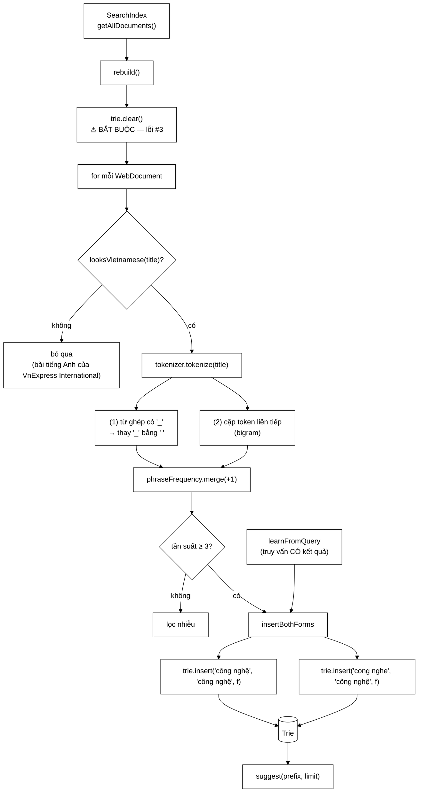

# SuggestionService — ba lỗi đã sửa, ghi lại để không tái phạm

**File nguồn:** `search-engine/src/main/java/com/vnsearch/service/SuggestionService.java` (136 dòng)
**Gói:** `com.vnsearch.service` · **Loại:** `@Component`, trạng thái là một [`Trie`](../datastructure/Trie.md)
**Vị trí trong sơ đồ:** nguồn dữ liệu cho **gợi ý tự động** (autocomplete) ở ô tìm kiếm
**Đọc kèm:** [`../datastructure/Trie.md`](../datastructure/Trie.md) · [`../index/VietnameseTokenizer.md`](../index/VietnameseTokenizer.md) · [`../controller/SuggestController.md`](../controller/SuggestController.md)

---

## 📌 Hiểu trong 30 giây

Gợi ý tự động dựa trên `Trie` từ cài. Điều làm lớp này đáng đọc: Javadoc dòng
22 mở đầu bằng *"**Ba lỗi đã sửa, đều ghi lại ở đây để không tái phạm**"* — và
cả ba đều là lỗi **nhìn thấy được ở giao diện**, không phải lỗi lý thuyết.

| Lỗi | Hậu quả |
|---|---|
| Chèn **nguyên tiêu đề** làm một gợi ý | Gợi ý dài loằng ngoằng, không ai gõ hết |
| Chèn **từng tiếng lẻ** | `cong`, `the`, `kinh` — tiếng lẻ tiếng Việt phần lớn **không phải từ** |
| Chỉ `insert` mà không `clear()` | Tiêu đề của corpus **cũ** vẫn còn sau mỗi lần crawl lại |

Và một kỹ thuật cốt lõi: **mỗi cụm được chèn HAI lần** — dưới khoá có dấu và
khoá không dấu — nhưng cùng trỏ tới **một** chuỗi hiển thị có dấu.



---

## 1. Vì sao tách khỏi `SearchEngineFacade`

Javadoc dòng 18–20 nêu ba lý do — và chúng là ba **loại** lý do khác nhau, đó
là điều làm lập luận này mạnh:

```
   ① VÒNG ĐỜI RIÊNG
        Trie phải dựng lại sau MỖI lần lập chỉ mục lại.
        Chỉ mục thì cập nhật tăng dần được; Trie thì không
        (xem lỗi #3 ở mục 2.3).

   ② NGUỒN DỮ LIỆU RIÊNG
        Chỉ mục:  toàn bộ bodyText của mọi trang
        Trie:     TIÊU ĐỀ + TRUY VẤN NGƯỜI DÙNG
                            ↑↑↑↑↑↑↑↑↑↑↑↑↑↑↑↑↑
                  nguồn này KHÔNG có trong chỉ mục chút nào

   ③ QUY TẮC RIÊNG
        Chỉ mục:  giữ mọi token, kể cả tiếng lẻ (cần cho khớp cụm)
        Trie:     LOẠI tiếng lẻ, lọc theo tần suất, lọc ngôn ngữ
```

```
   ┌──────────────────────────────────────────────────────────────┐
   │  TIÊU CHÍ TÁCH LỚP ĐÁNG NHỚ                                  │
   │                                                              │
   │  Không phải "mã dài quá thì tách", mà là:                    │
   │     - vòng đời khác nhau?                                    │
   │     - nguồn dữ liệu khác nhau?                               │
   │     - quy tắc nghiệp vụ khác nhau?                           │
   │                                                              │
   │  Đủ ba thì chắc chắn nên tách. Ở đây đủ cả ba.               │
   │                                                              │
   │  Cùng tiêu chí "vòng đời khác nhau" đã dùng để tách tệp ảnh   │
   │  khỏi corpus — xem ImageStorage.md mục 2.2.                  │
   └──────────────────────────────────────────────────────────────┘
```

---

## 2. Ba lỗi đã sửa

### 2.1 Lỗi #1 — chèn nguyên tiêu đề

```
   CÁCH SAI:
        trie.insert(doc.getTitle(), ...)

   Gõ "công" → gợi ý:
        "công nghệ mới giúp Việt Nam tiết kiệm 30% điện năng trong sản xuất"
        "công an Hà Nội triệt phá đường dây..."
        "công ty Vinfast công bố kết quả kinh doanh quý III năm 2024"

   ┌──────────────────────────────────────────────────────────┐
   │  VÌ SAO VÔ DỤNG:                                         │
   │                                                          │
   │  ① KHÔNG AI GÕ HẾT một câu 15 từ vào ô tìm kiếm          │
   │  ② mỗi tiêu đề chỉ xuất hiện MỘT lần ⇒ tần suất = 1       │
   │     ⇒ không có tín hiệu nào để xếp hạng gợi ý            │
   │  ③ danh sách gợi ý tràn màn hình, mất tác dụng            │
   └──────────────────────────────────────────────────────────┘

   Gợi ý tự động phục vụ việc GÕ NHANH MỘT CỤM TỪ,
   không phải việc chọn một bài viết.
```

### 2.2 Lỗi #2 — chèn từng tiếng lẻ

Đây là lỗi **đặc thù tiếng Việt** và là phần đáng nói nhất khi bảo vệ đồ án:

```
   CÁCH SAI:
        cho mỗi token: trie.insert(token, ...)

   Kết quả: cong, the, kinh, hoc, gia, viec, ...

   ┌──────────────────────────────────────────────────────────────┐
   │  TIẾNG VIỆT: TIẾNG LẺ PHẦN LỚN KHÔNG PHẢI TỪ                 │
   │                                                              │
   │     "công"   → không có nghĩa độc lập rõ ràng                │
   │     "nghệ"   → cũng vậy                                      │
   │     "công nghệ" → MỚI là một TỪ                              │
   │                                                              │
   │  Khác hẳn tiếng Anh, nơi khoảng trắng = ranh giới từ:        │
   │     "technology" là một từ hoàn chỉnh                        │
   │                                                              │
   │  ⇒ Gợi ý "cong" là gợi ý một MẢNH VỠ, không phải một từ.     │
   │  ⇒ Người dùng gõ "cong" rồi bấm gợi ý "cong" → không tiến    │
   │    thêm được bước nào.                                      │
   └──────────────────────────────────────────────────────────────┘
```

Đây chính là bài toán trung tâm của cả dự án — xem
[`VietnameseTokenizer`](../index/VietnameseTokenizer.md) và
[`MaxWeightSegmenter`](../index/MaxWeightSegmenter.md). Ở đây nó xuất hiện lại
dưới một hình thức mới: **cùng một đặc điểm ngôn ngữ, một tính năng khác, cùng
một cách hỏng.**

### 2.3 Lỗi #3 — quên `clear()`

```java
public void rebuild(SearchIndex index) {
    trie.clear();          // ← dòng cứu cả tính năng
    ...
}
```

```
   THIẾU DÒNG NÀY:

        Phiên crawl 1:  corpus vnexpress  →  trie có "bóng đá Việt Nam"
        Xoá corpus, crawl lại site khác
        Phiên crawl 2:  corpus tuoitre    →  trie CÓ CẢ hai bộ

        Người dùng gõ "bóng" → thấy gợi ý "bóng đá Việt Nam"
        → bấm vào → 0 KẾT QUẢ

   ┌──────────────────────────────────────────────────────────────┐
   │  TRIỆU CHỨNG: "gợi ý dẫn tới trang trống"                    │
   │                                                              │
   │  Và nó KHÓ TRUY vì:                                          │
   │    - API /suggest trả 200, có dữ liệu                        │
   │    - API /search trả 200, mảng rỗng                          │
   │    - không có exception, không có log                        │
   │    - và chỉ xảy ra SAU khi crawl lại — tức là ở môi trường   │
   │      thật, không phải trong test                            │
   └──────────────────────────────────────────────────────────────┘

   Đây là cùng lớp vấn đề với Supplier<UrlFilter> ở
   UrlExtractorService mục 4: TRẠNG THÁI SỐNG LÂU HƠN
   NGỮ CẢNH SINH RA NÓ.
```

Ba lỗi này có một điểm chung: **cả ba đều không gây exception**, và cả ba chỉ
lộ ra khi có người nhìn vào giao diện. Ghi lại chúng trong Javadoc là biện pháp
bảo vệ duy nhất — không có test nào bắt được lỗi #1 và #2 nếu không biết chúng
từng xảy ra.

---

## 3. Cách làm hiện tại — hai nguồn cụm từ

Javadoc dòng 34–37.

```java
for (int i = 0; i < tokens.size(); i++) {
    String term = tokens.get(i).term();

    // (1) TỪ GHÉP mà tokenizer nhận ra
    if (term.indexOf('_') >= 0) {
        phraseFrequency.merge(term.replace('_', ' '), 1, Integer::sum);
    }

    // (2) CẶP TOKEN LIÊN TIẾP
    if (i + 1 < tokens.size()) {
        String bigram = (term + " " + tokens.get(i + 1).term()).replace('_', ' ');
        phraseFrequency.merge(bigram, 1, Integer::sum);
    }
}
```

### 3.1 Nguồn (1) — từ ghép từ tokenizer

```
   VietnameseTokenizer nối từ ghép bằng dấu gạch dưới:

        "công nghệ thông tin"  →  token "công_nghệ_thông_tin"

   ⇒ Có '_' nghĩa là tokenizer đã KẾT LUẬN đây là một từ hoàn chỉnh.
   ⇒ Thay '_' bằng ' ' để hiển thị đúng cho người dùng.

   ĐỘ TIN CẬY: cao — dựa trên từ điển từ ghép.
   ĐỘ PHỦ:     thấp — từ điển chỉ có 154 mục.
```

### 3.2 Nguồn (2) — bigram, bù cho độ phủ thấp

```
   ┌──────────────────────────────────────────────────────────────┐
   │  Javadoc dòng 35-37 nêu rõ vì sao cần nguồn (2):             │
   │                                                              │
   │  "Nguồn (2) bù cho việc từ điển từ ghép CHỈ CÓ 154 MỤC:      │
   │   dù `bóng đá` không có trong từ điển, cặp token liên tiếp    │
   │   vẫn được ghi nhận."                                        │
   └──────────────────────────────────────────────────────────────┘

   154 mục là RẤT ÍT so với số từ ghép thật của tiếng Việt (hàng chục nghìn).

   ⇒ Nếu CHỈ dùng nguồn (1), gợi ý sẽ nghèo nàn: chỉ 154 cụm khả dĩ.
   ⇒ Bigram cho ĐỘ PHỦ, từ điển cho ĐỘ CHÍNH XÁC.
     Hai nguồn bù nhau đúng chỗ yếu của nhau.
```

### 3.3 Vì sao bigram không tạo ra rác

```
   Bigram sinh ra RẤT NHIỀU cụm vô nghĩa:
        "trong sản", "của một", "đã được", "tại Hà"

   Cái gì lọc chúng?  →  MIN_SUGGESTION_FREQUENCY = 3

        Cụm CÓ NGHĨA ("bóng đá", "công nghệ", "kinh doanh")
             → xuất hiện trong hàng chục, hàng trăm tiêu đề
             → tần suất cao, qua được ngưỡng

        Cụm NGẪU NHIÊN ("trong sản", "tại Hà")
             → cũng có thể lặp lại...
             → và ĐÂY LÀ ĐIỂM YẾU THẬT: các cặp chứa hư từ
               phổ biến VẪN qua được ngưỡng

   ⇒ Ngưỡng 3 lọc được phần LỚN rác, nhưng không lọc hết.
     Xem đề xuất 2 ở mục 7.
```

---

## 4. Chèn hai khoá, một chuỗi hiển thị

Javadoc dòng 39–41 và phương thức `insertBothForms` dòng 113–127. Đây là kỹ
thuật cốt lõi của lớp.

```java
private void insertBothForms(String phrase, int frequency) {
    trie.insert(phrase, phrase, frequency);
    String withoutDiacritics = VietnameseTokenizer.stripDiacritics(phrase);
    if (!withoutDiacritics.equals(phrase)) {
        trie.insert(withoutDiacritics, phrase, frequency);
    }
}
//           ↑ khoá tra cứu      ↑ chuỗi HIỂN THỊ
```

### 4.1 Vấn đề

```
   Trie khớp tiền tố theo TỪNG KÝ TỰ CHÍNH XÁC.

        Đường đi  c-o-n-g   KHÔNG BAO GIỜ tới được nhánh  c-ô-n-g

   Mà người Việt gõ tiếng Việt thường KHÔNG BỎ DẤU khi tìm kiếm:
        gõ "cong nghe"  →  muốn tìm "công nghệ"
        gõ "bong da"    →  muốn tìm "bóng đá"

   ⇒ Chỉ chèn dạng có dấu ⇒ gợi ý gần như KHÔNG BAO GIỜ hiện ra
     cho người gõ không dấu — tức là ĐA SỐ người dùng.
```

### 4.2 Lời giải

```
   ┌──────────────────────────────────────────────────────────────┐
   │           TRIE                                               │
   │                                                              │
   │   c─ô─n─g─␣─n─g─h─ệ  ──▶ hiển thị: "công nghệ"               │
   │   c─o─n─g─␣─n─g─h─e  ──▶ hiển thị: "công nghệ"               │
   │                              ↑↑↑↑↑↑↑↑↑↑↑                     │
   │                        CÙNG MỘT chuỗi hiển thị               │
   └──────────────────────────────────────────────────────────────┘

   KẾT QUẢ:
        người gõ "cong ng"  →  nhận gợi ý "công nghệ"  ĐÚNG CHÍNH TẢ
        người gõ "công ng"  →  cũng nhận "công nghệ"

   ⇒ Đây không chỉ là "tìm được" — nó còn SỬA CHÍNH TẢ giúp
     người dùng: họ gõ không dấu, hệ thống đưa lại bản có dấu,
     và truy vấn gửi đi là bản có dấu (khớp tốt hơn với chỉ mục).
```

Đây là ứng dụng đẹp của việc **tách khoá tra cứu khỏi giá trị hiển thị** — cấu
trúc `Trie` của dự án hỗ trợ điều này bằng cách lưu một `value` riêng ở nút cuối.
Xem [`Trie.md`](../datastructure/Trie.md).

### 4.3 Điều kiện `if` tránh chèn trùng

```java
if (!withoutDiacritics.equals(phrase)) {
```

```
   Với cụm vốn KHÔNG CÓ DẤU ("web", "robot", "email"):
        stripDiacritics("web")  ==  "web"

   Không có điều kiện if:
        trie.insert("web", "web", f);   ← lần 1
        trie.insert("web", "web", f);   ← lần 2, TRÙNG

   Hậu quả tuỳ cài đặt Trie:
        - nếu insert cộng dồn tần suất → "web" được thổi phồng GẤP ĐÔI
          ⇒ nó leo lên đầu danh sách gợi ý một cách giả tạo
        - nếu insert ghi đè → vô hại, chỉ tốn một lời gọi

   ⇒ Một dòng if bảo vệ chống một sai lệch xếp hạng tinh vi.
```

---

## 5. Hướng dẫn về code

### 5.1 Lọc ngôn ngữ — chú thích dòng 69–71

```java
if (title == null || title.isBlank() || !LanguageDetector.looksVietnamese(title)) {
    continue;
}
```

```
   VÌ SAO CẦN:
        "corpus có lẫn bài tiếng Anh của VnExpress International,
         trước đây làm gợi ý hiện ra
         'the city that helped vietnam...'"

   ⇒ Lại là một lỗi NHÌN THẤY ĐƯỢC, được ghi lại kèm ví dụ cụ thể.

   VÀ nó liên quan tới lỗi #2: bigram của tiêu đề tiếng Anh
   ("the city", "that helped") sẽ có tần suất cao vì "the" xuất hiện
   khắp nơi ⇒ chúng dễ dàng qua ngưỡng 3.
```

Chú ý: đây là **`SuggestionService` tự lọc**, không dựa vào
[`LanguageFilter`](../crawler/LanguageFilter.md) của crawler. Lý do: crawler
lọc theo **nội dung trang**, còn ở đây cần lọc theo **tiêu đề** — một trang
tiếng Việt vẫn có thể có tiêu đề tiếng Anh, và ngược lại.

### 5.2 `learnFromQuery` — vòng phản hồi tự cải thiện, dòng 99–111

```java
public void learnFromQuery(String query) {
    if (query == null || query.isBlank()) return;
    insertBothForms(query.trim().toLowerCase(Locale.ROOT), 1);
}
```

Javadoc dòng 102–104:

> Chỉ gọi khi truy vấn **CÓ kết quả** — tránh học từ truy vấn gõ sai chính tả.
> Đây là vòng phản hồi tự cải thiện: càng nhiều người dùng, gợi ý càng khớp thói
> quen gõ thật.

```
   ĐIỀU KIỆN "CÓ KẾT QUẢ" LÀ THIẾT YẾU:

        Học MỌI truy vấn:
             "công nghê" (thiếu dấu nặng) → vào trie
             → gợi ý cho người sau một cụm SAI CHÍNH TẢ
             → người đó bấm vào → 0 kết quả
             → và cụm sai đó lại được học tiếp?  (không, vì 0 kết quả)

        Học truy vấn CÓ kết quả:
             chỉ những cụm THỰC SỰ tìm được gì mới vào trie
             → gợi ý luôn dẫn tới kết quả

   ⇒ "Có kết quả" là một BỘ LỌC CHẤT LƯỢNG miễn phí.
```

**Hai điểm yếu thật của cơ chế này:**

```
   ① KHÔNG QUA NGƯỠNG TẦN SUẤT
        rebuild() lọc cụm xuất hiện < 3 lần.
        learnFromQuery chèn NGAY với frequency = 1.
        ⇒ MỘT người gõ một lần là cụm đó thành gợi ý cho mọi người.

   ② MẤT SAU MỖI rebuild()
        trie.clear() ở đầu rebuild() xoá SẠCH, kể cả truy vấn đã học.
        ⇒ "vòng phản hồi tự cải thiện" bị RESET sau mỗi lần crawl lại.
        ⇒ Toàn bộ dữ liệu học được từ người dùng biến mất.

   Xem đề xuất 1 và 3.
```

### 5.3 `MIN_SUGGESTION_FREQUENCY = 3`

```
   Ngưỡng lọc nhiễu cho nguồn rebuild().

   f = 1:  mọi bigram ngẫu nhiên đều vào  →  trie khổng lồ, đầy rác
   f = 3:  cân bằng hiện tại
   f = 10: chỉ giữ cụm rất phổ biến  →  gợi ý nghèo, mất chủ đề ngách

   Với corpus 31.030 trang, ngưỡng 3 là THẤP —
   một cụm chỉ cần xuất hiện trong 3 tiêu đề (0,01% corpus).

   ⇒ Ngưỡng này hợp lý cho corpus NHỎ, nhưng nên tỷ lệ theo
     kích thước corpus khi corpus lớn lên. Xem đề xuất 2.
```

### 5.4 `Locale.ROOT` — lại xuất hiện

```java
query.trim().toLowerCase(Locale.ROOT)
prefix.trim().toLowerCase(Locale.ROOT)
```

Cùng lý do như ở [`UrlCanonicalizer`](../crawler/UrlCanonicalizer.md),
[`ContentSeenFilter`](../crawler/ContentSeenFilter.md) và
[`ImageDownloadService`](../crawler/modular/ImageDownloadService.md): phép hạ
chữ thường **không được phụ thuộc locale của máy chạy**.

```
   Locale Thổ Nhĩ Kỳ:  "I".toLowerCase()  →  "ı"  (không phải "i")

   ⇒ Cùng một truy vấn, hai máy khác locale cho hai khoá tra cứu khác nhau
   ⇒ gợi ý hoạt động ở máy này, không hoạt động ở máy kia
   ⇒ và không ai đoán ra nguyên nhân

   Sự nhất quán của quy ước này khắp dự án là điểm đáng ghi nhận.
```

### 5.5 Cạm bẫy khi sửa lớp này

| Ý định | Hậu quả |
|---|---|
| Bỏ `trie.clear()` trong `rebuild` | Gợi ý dẫn tới trang trống sau mỗi lần crawl lại |
| Chèn nguyên tiêu đề | Gợi ý dài loằng ngoằng, tần suất luôn = 1 |
| Chèn từng token lẻ | Gợi ý toàn mảnh vỡ: `cong`, `the`, `kinh` |
| Chỉ chèn dạng có dấu | Gợi ý không hiện cho đa số người dùng (gõ không dấu) |
| Bỏ điều kiện `if` trong `insertBothForms` | Cụm không dấu bị thổi phồng tần suất gấp đôi |
| Bỏ `looksVietnamese` | Gợi ý tiếng Anh chen vào, và bigram chứa `the` dễ qua ngưỡng |
| Gọi `learnFromQuery` cho **mọi** truy vấn | Học cả truy vấn sai chính tả |
| Dùng `toLowerCase()` không có `Locale.ROOT` | Hành vi khác nhau giữa các máy |
| Chỉ dùng nguồn (1) — từ ghép | Chỉ 154 cụm khả dĩ, gợi ý nghèo nàn |

---

## 6. Độ phức tạp & chi phí

| Thao tác | Độ phức tạp | Ghi chú |
|---|---|---|
| `rebuild(index)` | O(D × T) | D = số tài liệu, T = số token/tiêu đề |
| `insertBothForms` | O(L) × 2 | L = độ dài cụm |
| `learnFromQuery` | O(L) | |
| `suggest(prefix, limit)` | **O(L + m log k)** | L = độ dài tiền tố, m = số ứng viên, k = limit |

```
   CHI PHÍ rebuild() TRÊN CORPUS 31.030 TRANG

        31.030 tiêu đề × ~10 token = ~310.000 token
        → mỗi token sinh tối đa 2 mục (từ ghép + bigram)
        → ~600.000 lượt merge vào HashMap
        → rồi lọc còn (ước lượng) vài chục nghìn cụm qua ngưỡng
        → mỗi cụm chèn 2 lần vào Trie

        THỜI GIAN: ~1-3 giây
        ⇒ Chấp nhận được, vì rebuild chỉ chạy SAU MỖI LẦN LẬP CHỈ MỤC LẠI,
          không phải trên đường nóng.

   BỘ NHỚ TRIE

        ~50.000 cụm × 2 dạng × ~15 ký tự
        → nhưng Trie CHIA SẺ tiền tố, nên thực tế ít hơn nhiều
        → ước tính vài MB

   suggest() là O(L + m log k):
        L      = đi xuống theo tiền tố
        m log k = chọn top-k bằng MinHeap
   ⇒ Đây là đường NÓNG (gọi mỗi lần người dùng gõ một ký tự),
     và độ phức tạp này là lý do dùng Trie thay vì quét danh sách.
```

Chi tiết đáng chú ý: `rebuild` dựng một `HashMap` trung gian
(`phraseFrequency`) chứa **mọi** cụm trước khi lọc — kể cả hàng trăm nghìn
bigram rác. Đó là điểm tốn bộ nhớ nhất, và nó là bộ nhớ **tạm thời**.

---

## 7. Kiểm thử liên quan

| Bộ test | Kiểm gì |
|---|---|
| [`TrieTest`](../../../../test/java/com/vnsearch/datastructure/TrieTest.md) | Cấu trúc bên dưới |
| [`VietnameseTokenizerTest`](../../../../test/java/com/vnsearch/index/VietnameseTokenizerTest.md) | Nguồn token |
| [`SuggestController`](../controller/SuggestController.md) | Bên phơi ra API |

**Lớp này hiện không có bộ test riêng** — đó là khoảng trống đáng chú ý nhất,
vì cả ba lỗi ở mục 2 đều không có gì canh giữ.

```
   ĐẦU VÀO                                        KẾT QUẢ MONG ĐỢI
   ────────────────────────────────────────────   ─────────────────────────
   tiêu đề "Công nghệ mới ở Việt Nam" × 3 lần     "công nghệ" vào trie
   cùng tiêu đề × 2 lần                           KHÔNG vào (dưới ngưỡng 3)
   suggest("cong")                                chứa "công nghệ" (CÓ DẤU)
   suggest("công")                                cũng chứa "công nghệ"
   suggest("")                                    List.of()
   suggest(null)                                  List.of()
   rebuild lần 2 với corpus khác                  cụm của corpus 1 BIẾN MẤT
   tiêu đề tiếng Anh                              bị bỏ qua
   tiêu đề null / rỗng                            bị bỏ qua
   learnFromQuery("bóng đá")                      vào trie ngay
   learnFromQuery(null)                           không ném
   cụm "web" (không dấu)                          chèn ĐÚNG MỘT lần
```

Bốn bài test còn thiếu, và cả bốn bảo vệ trực tiếp các lỗi ở mục 2:

```java
// 1. LỖI #3 — rebuild phải xoá sạch corpus cũ
@Test
void rebuildXoaSachCorpusCu() {
    service.rebuild(chiMucVoi("Bóng đá Việt Nam", 3));
    assertFalse(service.suggest("bong", 10).isEmpty());

    service.rebuild(chiMucVoi("Kinh doanh Hà Nội", 3));
    assertTrue(service.suggest("bong", 10).isEmpty(),
            "cụm của corpus CŨ vẫn còn ⇒ gợi ý sẽ dẫn tới 0 kết quả");
}

// 2. LỖI #2 — không được gợi ý tiếng lẻ
@Test
void khongGoiYTiengLe() {
    service.rebuild(chiMucVoi("Công nghệ thông tin Việt Nam", 5));
    assertThat(service.suggest("cong", 10))
            .noneMatch(s -> s.equals("công") || s.equals("cong"));
}

// 3. Chèn hai dạng — người gõ không dấu nhận gợi ý CÓ dấu
@Test
void goKhongDauNhanGoiYCoDau() {
    service.rebuild(chiMucVoi("Công nghệ mới", 3));
    assertTrue(service.suggest("cong ng", 10).contains("công nghệ"));
}

// 4. Cụm không dấu chỉ chèn một lần (không thổi phồng tần suất)
@Test
void cumKhongDauChenMotLan() {
    service.rebuild(chiMucVoi("Web robot email", 3));
    // "web" không được xếp hạng cao hơn cụm có dấu cùng tần suất
}
```

---

## 8. Chấm theo chuẩn doanh nghiệp

| Tiêu chí | Điểm | Nhận xét |
|---|---|---|
| Ghi chép lỗi lịch sử | 10/10 | Ba lỗi + một lỗi lọc ngôn ngữ, đều kèm **hậu quả cụ thể nhìn thấy được** |
| Hiểu bài toán ngôn ngữ | 10/10 | Nhận ra tiếng lẻ tiếng Việt không phải từ, và giải bằng hai nguồn bù nhau |
| Kỹ thuật hai khoá | 10/10 | Tách khoá tra cứu khỏi chuỗi hiển thị — vừa tìm được vừa sửa chính tả giúp người dùng |
| Tách trách nhiệm | 10/10 | Ba lý do thuộc ba loại khác nhau (vòng đời, nguồn, quy tắc) |
| Nhất quán quy ước | 10/10 | `Locale.ROOT` khắp nơi, cùng chuẩn với phần còn lại của dự án |
| Chống nhiễu | 8/10 | Ngưỡng 3 lọc phần lớn rác; nhưng bigram chứa hư từ vẫn qua được |
| Vòng phản hồi | 5/10 | `learnFromQuery` **mất sạch sau mỗi `rebuild()`**, và không qua ngưỡng tần suất |
| Khả năng kiểm thử | 4/10 | **Không có bộ test riêng** — ba lỗi đã sửa không có gì canh giữ, có thể tái phạm |

**Năm đề xuất nâng lên mức sản phẩm:**

1. **Lưu bền truy vấn đã học, và nạp lại sau `rebuild()`.** Đây là khoảng trống
   nghiêm trọng nhất: Javadoc gọi `learnFromQuery` là *"vòng phản hồi tự cải
   thiện"*, nhưng `trie.clear()` xoá sạch nó sau mỗi lần lập chỉ mục lại. Nghĩa
   là **toàn bộ dữ liệu học được từ người dùng biến mất** mỗi lần crawl lại — và
   không ai nhận ra, vì gợi ý từ tiêu đề vẫn hoạt động. Cách sửa: một tệp
   `queries.json` (cùng khuôn với [`ImageStorage`](../crawler/modular/ImageStorage.md)),
   nạp lại ở cuối `rebuild()`.

2. **Ngưỡng tần suất theo tỷ lệ corpus.** `MIN_SUGGESTION_FREQUENCY = 3` là hằng
   số tuyệt đối. Với corpus 31.030 trang nó tương đương 0,01% — quá thấp, nên
   nhiều bigram chứa hư từ lọt qua. Với corpus 1.000 trang nó lại là 0,3% — hợp
   lý. Công thức `max(3, soTaiLieu / 2000)` thích nghi được cả hai. **Và** nên
   thêm một danh sách hư từ (`của`, `và`, `trong`, `đã`, `được`, `tại`) để loại
   bigram chứa chúng — đây là cách rẻ nhất nâng chất lượng gợi ý.

3. **Cho `learnFromQuery` một ngưỡng riêng.** Hiện một người gõ một lần là cụm
   đó thành gợi ý cho **mọi** người dùng. Đây vừa là vấn đề chất lượng vừa là
   vấn đề an toàn nội dung: một truy vấn tục tĩu có kết quả sẽ trở thành gợi ý
   công khai. Cần đếm tần suất truy vấn riêng và chỉ đưa vào trie khi đạt ngưỡng
   (ví dụ 5 lượt từ các phiên khác nhau).

4. **Bộ test riêng cho ba lỗi lịch sử** (mã ở mục 7). Ba lỗi ở mục 2 hiện chỉ
   được bảo vệ bởi Javadoc. Javadoc bảo vệ được người **đọc** mã; test bảo vệ
   được cả người không đọc. Bài test #1 (`rebuild` xoá sạch) đặc biệt quan trọng
   vì lỗi đó chỉ lộ ra ở môi trường thật sau lần crawl thứ hai.

5. **Đo và phơi chất lượng gợi ý.** Hiện không có số nào cho biết gợi ý tốt hay
   xấu: bao nhiêu cụm trong trie, tỷ lệ người dùng bấm vào gợi ý, tỷ lệ gợi ý
   dẫn tới 0 kết quả. Con số cuối cùng đặc biệt hữu ích — nó là **phép kiểm tính
   đúng chạy trong sản phẩm** cho lỗi #3, đúng tinh thần mà
   [`ImageStore`](../crawler/modular/ImageStore.md) mục 4.7 đã làm với bộ đếm
   `rejected`.

---

## 9. Liên kết

- Cấu trúc dữ liệu bên dưới: [`../datastructure/Trie.md`](../datastructure/Trie.md)
- Nguồn token và `stripDiacritics`: [`../index/VietnameseTokenizer.md`](../index/VietnameseTokenizer.md)
- Bài toán tách từ tiếng Việt: [`../index/MaxWeightSegmenter.md`](../index/MaxWeightSegmenter.md) · [`../index/VietnameseWordDictionary.md`](../index/VietnameseWordDictionary.md)
- Bên phơi ra API: [`../controller/SuggestController.md`](../controller/SuggestController.md)
- Phép nhận diện tiếng Việt: [`./LanguageDetector.md`](./LanguageDetector.md)
- Nguồn tài liệu: [`../index/SearchIndex.md`](../index/SearchIndex.md)
- Nơi `rebuild` được gọi: [`./IndexBuilder.md`](./IndexBuilder.md) · [`./SearchEngineFacade.md`](./SearchEngineFacade.md)
- Cùng lớp vấn đề "trạng thái sống lâu hơn ngữ cảnh": [`../crawler/modular/UrlExtractorService.md`](../crawler/modular/UrlExtractorService.md) mục 4
- Tổng quan: `docs/ARCHITECTURE.md`
