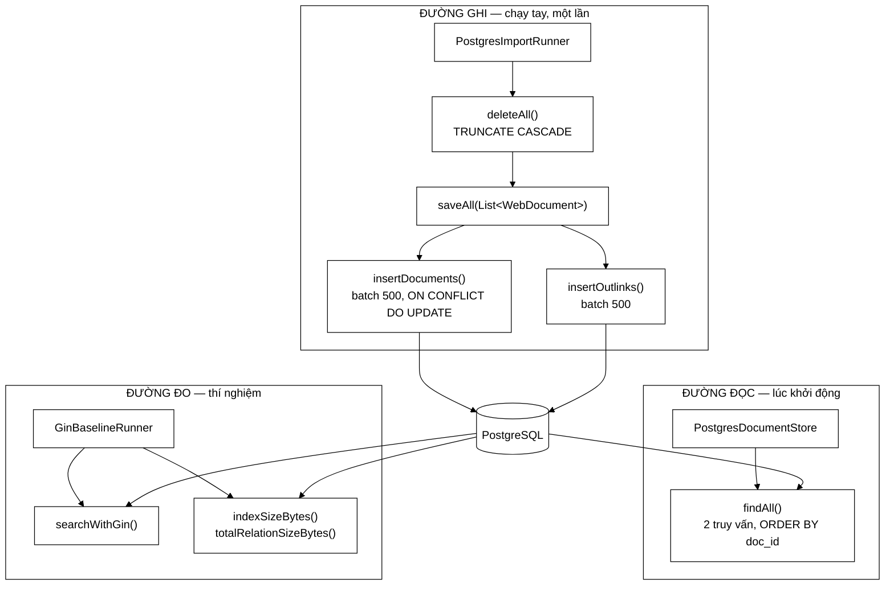

# DocumentRepository — 256 dòng JDBC thuần, và bốn quyết định kỹ thuật đáng bảo vệ trước hội đồng

**File nguồn:** `search-engine/src/main/java/com/vnsearch/storage/DocumentRepository.java` (256 dòng)
**Gói:** `com.vnsearch.storage` · **Loại:** `class implements AutoCloseable`, giữ **một** `Connection` suốt vòng đời
**Vị trí trong sơ đồ:** tầng thấp nhất của gói `storage` — mọi thứ chạm tới PostgreSQL đều đi qua đây
**Đọc kèm:** [`PostgresDocumentStore.md`](./PostgresDocumentStore.md) · [`PostgresImportRunner.md`](./PostgresImportRunner.md) · [`GinBaselineRunner.md`](./GinBaselineRunner.md) · [`DocumentStore.md`](./DocumentStore.md)

---

## 📌 Hiểu trong 30 giây

Đây là lớp duy nhất trong toàn bộ dự án viết SQL. Nó **không** dùng JPA,
**không** dùng Spring Data, **không** dùng `JdbcTemplate` — chỉ `java.sql.*`
thuần. Đó là một lựa chọn có chủ đích, và Javadoc dòng 26–33 nói rõ ba lý do.

Bốn quyết định kỹ thuật trong lớp này đáng được hỏi tới khi bảo vệ, và cả bốn
đều có câu trả lời tốt:

```
   ① Ghi theo lô 500 bản ghi     → không thì 400.000 vòng khứ hồi mạng
   ② Một giao dịch cho saveAll   → không thì corpus dở dang, chỉ mục sai âm thầm
   ③ findAll() dùng ĐÚNG 2 truy vấn → tránh lỗi N+1 kinh điển
   ④ ORDER BY doc_id             → giữ bất biến của posting list, không phải thẩm mỹ
```

Quyết định ④ là quyết định tinh tế nhất, vì nó là chỗ **CSDL phải phục vụ ràng
buộc của một cấu trúc dữ liệu nằm ngoài CSDL**. Bỏ `ORDER BY` đi, chương trình
vẫn chạy, test vẫn xanh trên corpus nhỏ, và kết quả tìm kiếm vẫn *trông* đúng —
cho tới khi giao hai posting list dài bằng two-pointer cho ra kết quả thiếu.



```
   BA NHÓM PHƯƠNG THỨC, BA NGƯỜI DÙNG KHÁC NHAU

   ┌────────────────────────────────────────────────────────────────────────┐
   │ GHI      deleteAll, saveAll                → PostgresImportRunner      │
   │ ĐỌC      findAll, countDocuments           → PostgresDocumentStore     │
   │ ĐO       searchWithGin, indexSizeBytes,    → GinBaselineRunner         │
   │          totalRelationSizeBytes, countOutlinks                          │
   │ HẠ TẦNG  now, close                        → tất cả                    │
   └────────────────────────────────────────────────────────────────────────┘

   Không người dùng nào cần cả ba nhóm.
   Đó chính là lý do PostgresDocumentStore tồn tại: nó cắt bề mặt
   rộng này xuống còn ba phương thức cho SearchEngineFacade.
```

---

## Mục lục

1. [Vì sao JDBC thuần chứ không phải JPA](#1-vì-sao-jdbc-thuần-chứ-không-phải-jpa)
2. [Hàm dựng và ba hằng số mặc định](#2-hàm-dựng-và-ba-hằng-số-mặc-định)
3. [`saveAll()` — một giao dịch, và vì sao](#3-saveall--một-giao-dịch-và-vì-sao)
4. [Ghi theo lô 500: con số này từ đâu ra](#4-ghi-theo-lô-500-con-số-này-từ-đâu-ra)
5. [`ON CONFLICT DO UPDATE` — upsert và cái bẫy của nó](#5-on-conflict-do-update--upsert-và-cái-bẫy-của-nó)
6. [`findAll()` — hai truy vấn và lỗi N+1](#6-findall--hai-truy-vấn-và-lỗi-n1)
7. [`ORDER BY doc_id` — ràng buộc đến từ ngoài CSDL](#7-order-by-doc_id--ràng-buộc-đến-từ-ngoài-csdl)
8. [Nhóm phương thức đo đạc](#8-nhóm-phương-thức-đo-đạc)
9. [`searchWithGin()` — đối chứng, không phải đường phục vụ](#9-searchwithgin--đối-chứng-không-phải-đường-phục-vụ)
10. [Hướng dẫn về code](#10-hướng-dẫn-về-code)
11. [Độ phức tạp & chi phí](#11-độ-phức-tạp--chi-phí)
12. [Kiểm thử liên quan](#12-kiểm-thử-liên-quan)
13. [Chấm theo chuẩn doanh nghiệp](#13-chấm-theo-chuẩn-doanh-nghiệp)
14. [Liên kết](#14-liên-kết)

---

## 1. Vì sao JDBC thuần chứ không phải JPA

Đây là câu hỏi gần như chắc chắn sẽ được hỏi, vì trong một dự án Spring Boot,
việc **không** dùng Spring Data JPA là điều bất thường. Javadoc đưa ra ba lý do,
và cả ba đều đứng vững — nhưng chúng không ngang giá trị nhau.

```
   BA LÝ DO, XẾP THEO SỨC NẶNG THẬT

   ┌────────────────────────────────────────────────────────────────────────┐
   │ ③ Tránh tự động cấu hình DataSource        ★★★  LÝ DO MẠNH NHẤT      │
   │    Nếu có spring-boot-starter-data-jpa trên classpath, Spring Boot     │
   │    sẽ cố dựng DataSource lúc khởi động. Không có PostgreSQL đang       │
   │    chạy ⇒ ứng dụng CHẾT ngay khi khởi động.                            │
   │    ⇒ Toàn bộ chuỗi dự phòng bốn tầng của SearchEngineFacade sẽ vô      │
   │      nghĩa, vì nó không bao giờ chạy tới.                              │
   │    ⇒ Và 63 file test sẽ cần một CSDL để chạy.                          │
   │                                                                        │
   │ ② Ghi hàng loạt nhanh hơn                  ★★☆  ĐO ĐƯỢC              │
   │    JDBC batch đẩy 500 câu lệnh trong một gói. Hibernate mặc định       │
   │    KHÔNG bật batch, và kể cả bật thì vẫn phải quản lý persistence      │
   │    context cho 31.030 entity — dễ tràn heap.                           │
   │                                                                        │
   │ ① SQL hiện nguyên văn trong mã              ★☆☆  LỢI THẾ VĂN BẢN     │
   │    Đưa được vào báo cáo. Đúng, nhưng bật hibernate.show_sql cũng ra    │
   │    SQL. Đây là lợi ích thật nhưng nhẹ nhất trong ba lý do.             │
   └────────────────────────────────────────────────────────────────────────┘
```

Nếu chỉ được giữ lại một câu trả lời khi bị hỏi, hãy giữ lý do ③: **dự án phải
chạy được trên một máy trắng không có Docker**. Đây không phải sự lười biếng mà
là một yêu cầu phi chức năng thật — người chấm mở máy, `mvn spring-boot:run`, và
hệ thống phải lên.

```
   HỆ QUẢ CỦA LÝ DO ③, NHÌN THEO CHUỖI DỰ PHÒNG

   PostgresDocumentStore  ─── không có CSDL ──> isAvailable() = false
            ↓
   JsonDocumentStore(corpus)  ─── không có file ──> false
            ↓
   JsonDocumentStore(seed)    ─── có sẵn trong repo ──> TRUE  ✔
            ↓
   corpus rỗng (chạy được, tìm không ra gì)

   Nếu dùng JPA: chết ở bước 0, không tới được bước 1.
```

Cái giá phải trả cũng cần nói thẳng: **không có connection pool**. Mỗi
`new DocumentRepository(...)` là một `DriverManager.getConnection` mới, tốn
60–220 ms. Với một hệ thống chỉ mở kết nối vài lần trong đời (nạp corpus lúc
khởi động, chạy thí nghiệm), đây là đánh đổi đúng. Với một API phục vụ hàng
nghìn yêu cầu mỗi giây thì nó sẽ là một sai lầm nghiêm trọng.

---

## 2. Hàm dựng và ba hằng số mặc định

```java
public static final String DEFAULT_URL = "jdbc:postgresql://localhost:5432/vnsearch";
public static final String DEFAULT_USER = "vnsearch";
public static final String DEFAULT_PASSWORD = "vnsearch";

public DocumentRepository(String jdbcUrl, String user, String password) throws SQLException {
    this.connection = DriverManager.getConnection(jdbcUrl, user, password);
}

public static DocumentRepository connectDefault() throws SQLException {
    return new DocumentRepository(DEFAULT_URL, DEFAULT_USER, DEFAULT_PASSWORD);
}
```

Ba điểm đáng nói.

**Hàm dựng mở kết nối ngay.** Khác với `PostgresDocumentStore` (hàm dựng chỉ gán
ba chuỗi, không chạm mạng), lớp này **kết nối trong hàm dựng**. Hệ quả: mọi lỗi
hạ tầng nổ ra tại `new`, không phải tại phương thức nghiệp vụ đầu tiên. Đó là
hành vi đúng cho một lớp `AutoCloseable` — nếu đối tượng tồn tại thì tài nguyên
của nó đã sẵn sàng.

```
   HAI KIỂU KHỞI TẠO, HAI TRIẾT LÝ

   DocumentRepository            PostgresDocumentStore
   ─────────────────────         ─────────────────────
   new → mở kết nối NGAY         new → chỉ gán 3 String
   new có thể ném SQLException   new KHÔNG BAO GIỜ ném
   phải try-with-resources       không cần đóng gì

   ⇒ Lớp dưới nắm tài nguyên thật.
     Lớp trên là adapter không trạng thái, an toàn để tạo hàng loạt
     rồi vứt đi — đúng thứ chuỗi dự phòng cần.
```

**Mật khẩu mặc định nằm trong mã nguồn.** `"vnsearch"/"vnsearch"` được viết cứng
và là `public static final`. Với một dự án học thuật khớp `docker-compose.yml`
thì chấp nhận được, nhưng đây là chỗ trừ điểm rõ ràng theo chuẩn doanh nghiệp —
xem [phần 13](#13-chấm-theo-chuẩn-doanh-nghiệp).

**`connectDefault()` là điểm sửa duy nhất.** Ba lớp gọi nó
(`PostgresImportRunner`, `GinBaselineRunner`, và các bài test tích hợp), nên đọc
cấu hình từ biến môi trường chỉ cần sửa **một** chỗ:

```java
public static DocumentRepository connectDefault() throws SQLException {
    return new DocumentRepository(
            System.getenv().getOrDefault("VNSEARCH_DB_URL", DEFAULT_URL),
            System.getenv().getOrDefault("VNSEARCH_DB_USER", DEFAULT_USER),
            System.getenv().getOrDefault("VNSEARCH_DB_PASSWORD", DEFAULT_PASSWORD));
}
```

---

## 3. `saveAll()` — một giao dịch, và vì sao

```java
public void saveAll(List<WebDocument> documents) throws SQLException {
    boolean previousAutoCommit = connection.getAutoCommit();
    connection.setAutoCommit(false);
    try {
        insertDocuments(documents);
        insertOutlinks(documents);
        connection.commit();
    } catch (SQLException e) {
        connection.rollback();
        throw e;
    } finally {
        connection.setAutoCommit(previousAutoCommit);
    }
}
```

Đoạn 13 dòng này là mã giao dịch JDBC viết **đúng chuẩn**, và đúng ở ba chi tiết
mà rất nhiều mã sản phẩm làm sai.

```
   BA CHI TIẾT ĐÚNG

   ① LƯU LẠI autoCommit CŨ, KHÔI PHỤC TRONG finally
      Không phải setAutoCommit(true) mù quáng ở cuối.
      Nếu người gọi đang chạy trong một giao dịch lớn hơn, việc bật lại
      autoCommit = true sẽ COMMIT NGẦM giao dịch của họ.
      ⇒ Lỗi này rất khó truy, vì nó chỉ hiện khi có lồng giao dịch.

   ② rollback() TRƯỚC KHI ném lại
      Không rollback ⇒ kết nối bị kẹt ở trạng thái "aborted"; mọi câu
      lệnh sau đều lỗi "current transaction is aborted".

   ③ throw e — KHÔNG nuốt, KHÔNG bọc
      Người gọi (PostgresImportRunner) cần biết chính xác lỗi gì.
```

**Vì sao phải nguyên tử?** Javadoc trả lời rất gọn và rất đúng: nếu đứt giữa
chừng thì để lại một corpus dở dang, và **chỉ mục dựng trên corpus đó sẽ sai một
cách âm thầm**.

```
   KỊCH BẢN KHÔNG CÓ GIAO DỊCH

   nạp 31.030 tài liệu → đứt mạng ở tài liệu thứ 18.400
        ↓
   CSDL còn: 18.400 documents, ~350.000 outlinks (một phần)
        ↓
   khởi động lại ứng dụng → isAvailable() thấy count > 0 → TRUE
        ↓
   dựng InvertedIndex trên 18.400 tài liệu
        ↓
   TÌM KIẾM VẪN CHẠY, VẪN TRẢ KẾT QUẢ, VẪN TRÔNG ĐÚNG
   nhưng IDF sai (N sai), PageRank sai (thiếu 40% cạnh),
   và 12.630 trang biến mất mà không có dòng log nào

   ⇒ Đây là loại hỏng TỆ NHẤT: hệ thống không báo lỗi, chỉ trả lời sai.
```

Một điểm cần thành thật: giao dịch này bảo vệ *tính nguyên tử của lần ghi*,
nhưng `deleteAll()` **nằm ngoài** giao dịch đó. `PostgresImportRunner` gọi
`deleteAll()` rồi mới `saveAll()`, nên vẫn có một cửa sổ mà CSDL rỗng hoàn toàn.
Xem [phần 13, đề xuất 1](#13-chấm-theo-chuẩn-doanh-nghiệp).

---

## 4. Ghi theo lô 500: con số này từ đâu ra

```java
private static final int BATCH_SIZE = 500;
...
statement.addBatch();
if (++pending % BATCH_SIZE == 0) {
    statement.executeBatch();
}
...
statement.executeBatch();   // phần dư cuối cùng
```

```
   VÌ SAO PHẢI GOM LÔ

   Không gom lô — mỗi execute() là một vòng khứ hồi:
        31.030 documents  ×  ~0,5 ms  =  ~15 giây
        1.241.200 outlinks ×  ~0,5 ms  =  ~10 phút        ⚠
        ─────────────────────────────────────────
        tổng                            ~10,5 phút

   Gom lô 500 — 1 vòng khứ hồi cho 500 câu lệnh:
        31.030 / 500   =     63 vòng
        1.241.200 / 500 =  2.483 vòng
        ─────────────────────────────────────────
        tổng            =  2.546 vòng  ≈  vài chục giây

   ⇒ Nhanh hơn khoảng 500 lần trên đúng phần chi phối.
```

**Vì sao là 500 chứ không phải 5.000 hay 50?**

```
   ĐÁNH ĐỔI KHI CHỌN BATCH_SIZE

   nhỏ quá (50)        → nhiều vòng khứ hồi, mất phần lớn lợi ích
   500                 → gói mạng vài trăm KB, RAM driver ổn định
   lớn quá (50.000)    → driver PostgreSQL gom toàn bộ tham số trong
                         bộ nhớ trước khi gửi; body_text trung bình
                         ~2,8 KB ⇒ 50.000 × 2,8 KB ≈ 140 MB chỉ riêng
                         phần đệm của driver, chưa kể bản sao chuỗi

   ⇒ 500 nằm ở vùng bằng phẳng của đường cong lợi ích: tăng lên 2.000
     cải thiện thêm rất ít, còn rủi ro bộ nhớ thì tăng tuyến tính.
```

Chi tiết `++pending % BATCH_SIZE == 0` dùng **tiền tố** `++` chứ không phải hậu
tố — đúng, vì với hậu tố `pending++` thì lô đầu tiên sẽ được đẩy sau **501** bản
ghi (khi `pending` = 500 nhưng phép so sánh dùng giá trị cũ 499... thực tế là
lệch một nhịp). Đây là loại lỗi off-by-one vô hại về mặt kết quả nhưng cho thấy
mã được viết cẩn thận.

Và dòng `statement.executeBatch()` **cuối cùng, ngoài vòng lặp** là bắt buộc:
31.030 không chia hết cho 500, phần dư 30 bản ghi chỉ được ghi nhờ dòng này. Bỏ
nó đi là mất dữ liệu âm thầm — một lỗi kinh điển của mã batch JDBC.

---

## 5. `ON CONFLICT DO UPDATE` — upsert và cái bẫy của nó

```sql
INSERT INTO documents (doc_id, url, title, meta_description, body_text, crawled_at)
VALUES (?, ?, ?, ?, ?, ?)
ON CONFLICT (doc_id) DO UPDATE SET
    url = EXCLUDED.url,
    title = EXCLUDED.title,
    ...
```

Mệnh đề này khiến `saveAll()` **idempotent theo `doc_id`**: chạy hai lần cho ra
đúng một kết quả, không nhân đôi bảng `documents`.

```
   NHƯNG — VÀ ĐÂY LÀ CÁI BẪY THẬT

   documents  →  ON CONFLICT (doc_id) DO UPDATE   ⇒ idempotent  ✔
   outlinks   →  INSERT thuần, KHÔNG khoá chính   ⇒ KHÔNG idempotent  ✘

   Chạy saveAll() hai lần mà quên deleteAll():
        documents:  31.030 dòng   (đúng)
        outlinks:   2.482.400 dòng (GẤP ĐÔI)   ⚠

   Hệ quả không phải "thừa dữ liệu" mà là SAI KẾT QUẢ:
        PageRank chia đều điểm cho các liên kết ra.
        Mỗi cạnh bị nhân đôi ⇒ trọng số vẫn đúng tỉ lệ, nhưng
        findAll() trả về outlinks có phần tử LẶP, và mọi chỗ
        đếm bậc ra (out-degree) đều gấp đôi.
```

Bảng `outlinks` cố ý **không** có khoá chính (xem `schema.sql` dòng 27–30), vì
một trang hoàn toàn có thể trỏ tới cùng một URL hai lần một cách hợp lệ. Nghĩa
là không thể chữa bằng `ON CONFLICT` mà phải giữ kỷ luật gọi `deleteAll()`
trước — hoặc gộp cả hai vào một phương thức, xem
[phần 13](#13-chấm-theo-chuẩn-doanh-nghiệp).

`TRUNCATE TABLE documents CASCADE` xoá luôn `outlinks` nhờ ràng buộc
`ON DELETE CASCADE`, nên `deleteAll()` một dòng là đủ. `TRUNCATE` cũng nhanh hơn
`DELETE` rất nhiều vì nó không sinh bản ghi undo cho từng dòng.

---

## 6. `findAll()` — hai truy vấn và lỗi N+1

```java
Map<Integer, WebDocument> byId = new LinkedHashMap<>();
// ① SELECT ... FROM documents ORDER BY doc_id
// ② SELECT from_doc_id, to_url FROM outlinks ORDER BY from_doc_id
```

```
   LỖI N+1 TRÔNG NHƯ THẾ NÀO NẾU MẮC PHẢI

   for (WebDocument doc : documents) {
       doc.setOutlinks(queryOutlinks(doc.getDocId()));   // ⚠ 1 truy vấn/tài liệu
   }

        31.030 tài liệu  ⇒  1 + 31.030 = 31.031 vòng khứ hồi
        × 0,5 ms          ⇒  ~15,5 giây CHỈ để chờ mạng

   CÁCH LÀM Ở ĐÂY

        2 truy vấn, ghép trong RAM bằng LinkedHashMap
        ⇒ 2 vòng khứ hồi, phần còn lại là O(1) tra bảng băm

   ⇒ Đây là bài toán mà JPA thường làm sai (lazy loading), và là
     một trong ba lý do Javadoc đưa ra để chọn JDBC thuần.
```

**Vì sao `LinkedHashMap` chứ không phải `HashMap`?** Vì `findAll()` kết thúc
bằng `new ArrayList<>(byId.values())` — thứ tự duyệt của map trở thành thứ tự
của danh sách trả về. `LinkedHashMap` giữ nguyên thứ tự chèn, mà thứ tự chèn
chính là thứ tự `ORDER BY doc_id` của truy vấn ①.

```
   HAI THỨ PHẢI ĐỒNG THỜI ĐÚNG THÌ BẤT BIẾN MỚI GIỮ

        ORDER BY doc_id   (phía SQL)
              +
        LinkedHashMap     (phía Java)
        ─────────────────────────────
        = danh sách trả về sắp theo docId tăng dần

   Bỏ MỘT trong hai ⇒ mất bất biến.
   Đổi LinkedHashMap thành HashMap là một "dọn dẹp" trông vô hại
   và sẽ phá vỡ mọi thứ. Đây là ứng viên số một cho một dòng
   chú thích cảnh báo.
```

Chi tiết phòng thủ ở dòng 171–174:

```java
WebDocument doc = byId.get(rs.getInt("from_doc_id"));
if (doc != null) {
    doc.getOutlinks().add(rs.getString("to_url"));
}
```

Kiểm `null` này về lý thuyết là thừa — khoá ngoại đảm bảo mọi `from_doc_id` đều
tồn tại trong `documents`. Nhưng nó rẻ và bảo vệ trước trường hợp ai đó tắt ràng
buộc hoặc nạp dữ liệu bằng đường khác. Giữ lại là hợp lý; điều đáng làm thêm là
đếm số dòng bị bỏ và ghi log nếu khác 0, vì hiện tại nó **im lặng nuốt** dữ liệu
bất thường.

---

## 7. `ORDER BY doc_id` — ràng buộc đến từ ngoài CSDL

Đây là phần quan trọng nhất của tài liệu này.

```
   CHUỖI PHỤ THUỘC

   InvertedIndex giao hai posting list bằng two-pointer O(m+n)
        ↑ chỉ đúng khi
   posting list sắp xếp theo docId tăng dần
        ↑ chỉ đúng khi
   tài liệu được addDocument() theo thứ tự docId tăng dần
        ↑ chỉ đúng khi
   findAll() trả về danh sách sắp theo docId
        ↑ chỉ đúng khi
   SQL có ORDER BY doc_id  ←──── DÒNG NÀY

   ⇒ Một mệnh đề SQL đang gánh độ phức tạp thuật toán
     của một cấu trúc dữ liệu cách nó bốn tầng.
```

```
   ĐIỀU GÌ XẢY RA NẾU BỎ ORDER BY

   PostgreSQL KHÔNG đảm bảo thứ tự khi không có ORDER BY.
   Trên bảng nhỏ, mới nạp, quét tuần tự → thứ tự NGẪU NHIÊN TRÙNG với
   thứ tự chèn ⇒ mọi thứ trông vẫn đúng.

   Thứ tự bắt đầu lệch khi:
        - bảng đủ lớn để PostgreSQL quét song song
        - có UPDATE (dòng được ghi lại ở cuối heap)
        - sau VACUUM FULL / autovacuum dọn dẹp

   Lúc đó two-pointer đọc [5, 2, 9, 1] và [2, 5] sẽ kết luận
   "không giao nhau" — và truy vấn hai từ khoá trả về RỖNG
   thay vì trả về đúng kết quả.

   ⇒ Lỗi xuất hiện MUỘN, KHÔNG ổn định, và KHÔNG có thông báo lỗi.
     Đây là hạng lỗi tốn nhiều ngày nhất để truy.
```

Bài học kỹ thuật đáng ghi vào báo cáo: **bất biến của một cấu trúc dữ liệu trong
RAM có thể phụ thuộc vào một mệnh đề SQL ở tầng lưu trữ**. Javadoc của
`findAll()` (dòng 134–141) có nói điều này, và đó là một trong những đoạn
Javadoc giá trị nhất của cả dự án — nó ghi lại một phụ thuộc mà **trình biên
dịch không kiểm được, test trên dữ liệu nhỏ không phát hiện được**.

Cách gia cố bằng test, chạy được ngay:

```java
@Test
void findAllPhaiTraVeThuTuDocIdTangDan() throws Exception {
    List<WebDocument> docs = repo.findAll();

    for (int i = 1; i < docs.size(); i++) {
        assertTrue(docs.get(i - 1).getDocId() < docs.get(i).getDocId(),
                "docId phải tăng nghiêm ngặt tại vị trí " + i
                + " — bất biến posting list của InvertedIndex phụ thuộc vào đây");
    }
}
```

---

## 8. Nhóm phương thức đo đạc

Bốn phương thức không phục vụ chức năng nào của ứng dụng, mà phục vụ **thí
nghiệm**:

| Phương thức | Trả về | Dùng để |
|---|---|---|
| `countDocuments()` | `int` | `isAvailable()` phân biệt "rỗng" với "không có" |
| `countOutlinks()` | `long` | Báo cáo số cạnh của đồ thị web |
| `totalRelationSizeBytes(rel)` | `long` | Kích thước bảng **kèm** mọi chỉ mục |
| `indexSizeBytes(idx)` | `long` | Kích thước **riêng** một chỉ mục |

Cặp cuối là cặp quan trọng, vì chúng cho phép câu so sánh mạnh nhất của đồ án:

```
   SO SÁNH SÒNG PHẲNG TRÊN CÙNG MỘT CORPUS

   indexSizeBytes("idx_documents_tsv")   → chỉ mục GIN của PostgreSQL
              vs
   kích thước InvertedIndex tự cài (đo bằng MemoryBreakdown)

   ⇒ Không phải "tôi cài được chỉ mục đảo"
     mà là "chỉ mục của tôi tốn X MB, của PostgreSQL tốn Y MB,
             trên đúng 31.030 tài liệu đó"

   Đây là khác biệt giữa đồ án môn học và đồ án tốt nghiệp.
```

Chi tiết kỹ thuật: `pg_total_relation_size` gồm bảng + TOAST + **tất cả** chỉ
mục, còn `pg_relation_size` chỉ tính riêng quan hệ được nêu. Dùng nhầm hai hàm
này sẽ cho ra con số lệch vài lần — và vì cả hai đều trả về `long` byte trông
rất giống nhau, sai lầm đó không tự lộ ra.

Cả hai đều dùng `PreparedStatement` với tham số `?` cho tên quan hệ. Đây là chỗ
tinh tế: PostgreSQL chấp nhận vì `pg_relation_size` nhận kiểu `regclass`, và
chuỗi được ép kiểu tự động. Nhờ vậy **không có nối chuỗi SQL** ở đây — đúng
nguyên tắc, dù đầu vào là hằng số trong mã.

---

## 9. `searchWithGin()` — đối chứng, không phải đường phục vụ

```sql
SELECT url, ts_rank(tsv, plainto_tsquery('simple', ?)) AS rank
FROM documents
WHERE tsv @@ plainto_tsquery('simple', ?)
ORDER BY rank DESC
LIMIT ?
```

```
   ĐÂY LÀ PHƯƠNG THỨC NGUY HIỂM NHẤT CỦA CẢ LỚP

   Không nguy hiểm về kỹ thuật — nó viết đúng.
   Nguy hiểm vì nếu ai đó gọi nó từ SearchController, toàn bộ đồ án
   sụp đổ về mặt học thuật: máy tìm kiếm biến thành một câu SQL.

   Ba lớp bảo vệ hiện có:
        ① Javadoc nói thẳng "ĐỐI CHỨNG, không phải đường đi phục vụ"
        ② Nó nằm ở DocumentRepository, mà SearchEngineFacade chỉ
          nhìn thấy DocumentStore (3 phương thức) — không có nó
        ③ Chỉ GinBaselineRunner (chạy tay) gọi tới

   Lớp ② là lớp bảo vệ thật, vì nó do KIỂU DỮ LIỆU cưỡng chế,
   không dựa vào việc người ta có đọc chú thích hay không.
```

Chi tiết `'simple'` chứ không phải `'english'` (schema.sql dòng 44–45) rất đáng
nói: bộ stemmer tiếng Anh sẽ cắt gốc từ tiếng Việt sai hoàn toàn — `"nghiên"` bị
xử lý như một từ tiếng Anh. Dùng `'simple'` nghĩa là PostgreSQL chỉ tách theo
khoảng trắng và hạ chữ thường, **không** tách từ ghép tiếng Việt.

```
   ĐIỀU NÀY LÀM ĐỐI CHỨNG CÔNG BẰNG HAY KHÔNG CÔNG BẰNG?

   PostgreSQL 'simple'        : "công nghệ thông tin" → 3 token rời
   VietnameseTokenizer tự cài : → "công_nghệ", "thông_tin" (2 từ ghép)

   ⇒ Chỉ mục tự cài có LỢI THẾ về chất lượng, vì nó hiểu tiếng Việt.
     Nhưng đây là lợi thế THẬT và đáng nêu: đó chính là lý do
     tồn tại của MaxWeightSegmenter.

   ⇒ Khi báo cáo, phải nói rõ điều này thay vì để nó ngầm.
     "Chúng tôi thắng PostgreSQL về nDCG" mà không nói vì sao
     sẽ bị hỏi ngay, và câu trả lời lại rất mạnh: vì tách từ.
```

---

## 10. Hướng dẫn về code

### 10.1 Muốn đổi thông tin kết nối mà không sửa mã

Sửa `connectDefault()` như ở [phần 2](#2-hàm-dựng-và-ba-hằng-số-mặc-định), rồi:

```bash
export VNSEARCH_DB_URL="jdbc:postgresql://db.noi-bo:5432/vnsearch"
export VNSEARCH_DB_PASSWORD="$(cat /run/secrets/db_pass)"
```

### 10.2 Muốn thêm một cột vào bảng `documents`

Phải sửa **bốn** chỗ, thiếu một là hỏng:

```
   ① schema.sql                → ALTER TABLE documents ADD COLUMN lang TEXT;
   ② insertDocuments()         → thêm vào danh sách cột, thêm dấu ?,
                                 thêm dòng ON CONFLICT ... = EXCLUDED.lang,
                                 thêm statement.setString(7, doc.getLang())
   ③ findAll() — docSql        → thêm cột vào SELECT
   ④ findAll() — vòng đọc      → doc.setLang(rs.getString("lang"))
```

```
   CẠM BẪY: chỉ số tham số PreparedStatement bắt đầu từ 1, không phải 0.
   Thêm cột vào GIỮA danh sách ⇒ mọi setXxx phía sau lệch một bậc,
   và JDBC KHÔNG báo lỗi nếu kiểu vẫn khớp (setString vào cột TEXT
   khác). Luôn thêm cột mới ở CUỐI.
```

### 10.3 Muốn thêm connection pool (khi nào thì đáng)

Chỉ đáng khi có mã gọi CSDL **trên đường phục vụ yêu cầu**. Hiện tại không có, và
thêm HikariCP bây giờ sẽ kéo theo đúng vấn đề mà [phần 1](#1-vì-sao-jdbc-thuần-chứ-không-phải-jpa)
đang tránh. Nếu vẫn cần, giữ nguyên `DocumentRepository` và bọc thêm một lớp
nhận `DataSource`:

```java
public DocumentRepository(DataSource dataSource) throws SQLException {
    this.connection = dataSource.getConnection();
}
```

Hàm dựng cũ giữ nguyên ⇒ không phá mã hiện có, và pool là tuỳ chọn.

### 10.4 Ba cạm bẫy khi sửa lớp này

```
   ① ĐỔI LinkedHashMap → HashMap trong findAll()
      Trông như dọn dẹp. Phá vỡ bất biến posting list. KHÔNG LÀM.

   ② BỎ statement.executeBatch() cuối vòng lặp
      Mất tối đa 499 bản ghi cuối. Im lặng. KHÔNG LÀM.

   ③ GỌI saveAll() HAI LẦN KHÔNG deleteAll()
      documents đúng, outlinks GẤP ĐÔI. Xem phần 5.
```

---

## 11. Độ phức tạp & chi phí

| Thao tác | Độ phức tạp | Vòng khứ hồi | Chi phí thực tế |
|---|---|---|---|
| Hàm dựng | O(1) | 1 (bắt tay) | 60–220 ms |
| `deleteAll()` | O(1) | 1 | ~50 ms (TRUNCATE không quét dòng) |
| `saveAll()` | O(D + L) | (D+L)/500 | ~40–90 s |
| `findAll()` | O(D + L) | **2** | ~20–45 s |
| `countDocuments()` | O(D) quét | 1 | ~80 ms |
| `indexSizeBytes()` | O(1) | 1 | ~5 ms |
| `searchWithGin()` | O(log n + k) | 1 | ~10–60 ms |
| `close()` | O(1) | 1 | ~2 ms |

```
   CHI PHÍ BỘ NHỚ CỦA findAll() — ĐIỂM YẾU LỚN NHẤT

   ┌──────────────────────────────────────────────────────────────────────┐
   │  findAll() dựng TOÀN BỘ corpus trong RAM trước khi trả về:           │
   │                                                                      │
   │      LinkedHashMap 31.030 mục          ~ 2,5 MB (khung)              │
   │      31.030 WebDocument                ~ 87 MB (chủ yếu body_text)   │
   │      1.241.200 String URL              ~ 90 MB                       │
   │      ArrayList sao chép ở dòng cuối    ~ 0,25 MB (chỉ tham chiếu)    │
   │      ────────────────────────────────────────────                    │
   │      đỉnh                              ~ 180 MB                      │
   │                                                                      │
   │  Với heap mặc định 512 MB: chạy được nhưng sát.                      │
   │  Với 100.000 tài liệu: ~580 MB ⇒ OutOfMemoryError.                   │
   └──────────────────────────────────────────────────────────────────────┘

   ⇒ Trớ trêu: schema.sql dòng 9–12 nêu lý do dùng CSDL là "JSON 62MB
     không nạp nổi ở quy mô lớn, CSDL cho phép ĐỌC THEO LÔ" — nhưng
     findAll() lại nạp tất cả một lần, đúng thứ nó định tránh.

   ⇒ Đây không phải mâu thuẫn về thiết kế CSDL mà là hạn chế của
     HỢP ĐỒNG DocumentStore.loadAll() (trả về List). Chữa được bằng
     cách thêm findAllStreaming(Consumer<WebDocument>) — xem phần 13.
```

---

## 12. Kiểm thử liên quan

| Bộ test | Kiểm gì |
|---|---|
| [`DocumentRepositoryTest`](../../../../test/java/com/vnsearch/storage/DocumentRepositoryTest.md) | Ghi/đọc vòng tròn, cần CSDL |
| [`PostgresDocumentStoreTest`](../../../../test/java/com/vnsearch/storage/PostgresDocumentStoreTest.md) | Lớp bọc phía trên |
| [`EmptyCorpusFallbackTest`](../../../../test/java/com/vnsearch/service/EmptyCorpusFallbackTest.md) | Ứng dụng chạy khi **không** có CSDL |

```
   ĐẦU VÀO                                      KẾT QUẢ MONG ĐỢI
   ──────────────────────────────────────────   ─────────────────────────────
   saveAll(danh sách rỗng)                      không ném, 0 dòng
   saveAll rồi findAll                          bằng nhau về nội dung
   saveAll gọi hai lần liên tiếp                documents không đổi
                                                outlinks GẤP ĐÔI  ← ghi nhận
   docId chèn lộn xộn 5,1,3                     findAll trả 1,3,5
   crawledAt == null                            đọc lại vẫn null, không NPE
   body_text 5 MB (TOAST)                       đọc lại nguyên vẹn
   saveAll đứt giữa chừng                       rollback, CSDL không đổi
   1.000 tài liệu (2 lô + dư 0)                 đủ 1.000
   1.001 tài liệu (2 lô + dư 1)                 đủ 1.001  ← ca biên batch
   outlinks trùng URL trong cùng tài liệu       giữ nguyên cả hai
```

Ba bài test đáng bổ sung nhất:

```java
// 1. Ca biên của gom lô — phần dư cuối cùng có bị mất không
@Test
void ghiSoLuongKhongChiaHetChoLoVanDuBanGhi() throws Exception {
    List<WebDocument> docs = taoTaiLieuGia(1001);   // 2 lô đầy + dư 1

    repo.deleteAll();
    repo.saveAll(docs);

    assertEquals(1001, repo.countDocuments(),
            "thiếu executeBatch() cuối vòng lặp sẽ mất bản ghi thứ 1001");
}

// 2. Bất biến thứ tự — bảo vệ two-pointer của InvertedIndex
@Test
void findAllPhaiSapXepTheoDocIdDuChenLonXon() throws Exception {
    repo.deleteAll();
    repo.saveAll(List.of(taoTaiLieu(9), taoTaiLieu(2), taoTaiLieu(7)));

    List<Integer> ids = repo.findAll().stream().map(WebDocument::getDocId).toList();

    assertEquals(List.of(2, 7, 9), ids,
            "bỏ ORDER BY doc_id sẽ phá bất biến posting list của InvertedIndex");
}

// 3. Giao dịch phải nguyên tử — corpus dở dang là hỏng tệ nhất
@Test
void ghiThatBaiThiKhongDeLaiCorpusDoDang() throws Exception {
    repo.deleteAll();
    repo.saveAll(List.of(taoTaiLieu(1)));

    List<WebDocument> loi = new ArrayList<>(taoTaiLieuGia(100));
    loi.add(taoTaiLieuVoiUrlTrungLap(1));   // vi phạm UNIQUE(url)

    assertThrows(SQLException.class, () -> repo.saveAll(loi));
    assertEquals(1, repo.countDocuments(),
            "rollback thất bại sẽ để lại corpus dở dang, và chỉ mục dựng "
            + "trên đó sẽ sai một cách âm thầm");
}
```

Bài 1 và 2 là hai bài **quan trọng nhất** vì chúng bảo vệ hai bất biến mà trình
biên dịch không giữ được. Cả ba đều cần một CSDL — nên đúng ra chúng thuộc về
một lớp `...IT` chạy bằng Testcontainers, xem đề xuất 5 dưới đây.

---

## 13. Chấm theo chuẩn doanh nghiệp

| Tiêu chí | Điểm | Nhận xét |
|---|---|---|
| Đúng đắn của mã giao dịch | 10/10 | Lưu và khôi phục `autoCommit` cũ, `rollback` trước khi ném lại, không nuốt ngoại lệ — viết đúng cả ba chi tiết hay bị làm sai |
| Hiệu năng ghi | 10/10 | Gom lô 500 giảm ~500 lần số vòng khứ hồi trên đúng phần chi phối; kích thước lô nằm ở vùng hợp lý |
| Tránh N+1 | 10/10 | `findAll()` dùng đúng **hai** truy vấn cho toàn corpus, ghép trong RAM bằng bảng băm |
| Quản lý tài nguyên | 9/10 | `try-with-resources` ở **mọi** `Statement`/`ResultSet`; `AutoCloseable` đúng chuẩn. Trừ vì `Connection` sống suốt vòng đời đối tượng nên phụ thuộc hoàn toàn vào người gọi |
| Phòng chống SQL injection | 10/10 | Không có một phép nối chuỗi SQL nào; kể cả tên quan hệ cũng đi qua `PreparedStatement` |
| Chất lượng tài liệu trong mã | 10/10 | Javadoc giải thích **vì sao** chứ không mô tả **cái gì**; đoạn về `ORDER BY doc_id` ghi lại một phụ thuộc mà không công cụ nào kiểm được |
| Khả năng mở rộng theo dữ liệu | **5/10** | `findAll()` giữ ~180 MB ở đỉnh và tăng tuyến tính; mâu thuẫn với chính lý do dùng CSDL nêu ở `schema.sql` |
| Bảo mật thông tin xác thực | **4/10** | Mật khẩu viết cứng và là `public static final` — lộ ra toàn bộ classpath, và vào cả file `.class` đã biên dịch |
| An toàn khi gọi lặp | **5/10** | `saveAll()` idempotent với `documents` nhưng **không** với `outlinks`; kỷ luật gọi `deleteAll()` trước không được mã cưỡng chế |
| Độ bao phủ kiểm thử | **4/10** | Không có test nào cho ca biên gom lô, cho bất biến thứ tự, hay cho rollback — ba thứ dễ hỏng nhất |
| Khả năng vận hành | **5/10** | Không `loginTimeout`, không log tiến độ khi ghi 1,24 triệu dòng, không đếm số outlink bị bỏ ở `findAll()` |

**Năm đề xuất nâng lên mức sản phẩm:**

1. **Gộp `deleteAll()` và `saveAll()` thành một `replaceAll()` nằm trong cùng
   một giao dịch.** Hiện tại tính nguyên tử chỉ bảo vệ được nửa sau của thao
   tác: `PostgresImportRunner` xoá sạch, rồi mới mở giao dịch để ghi, nên tồn tại
   một cửa sổ hàng chục giây mà CSDL rỗng hoàn toàn — nếu tiến trình chết trong
   cửa sổ đó, corpus mất trắng chứ không phải "giữ nguyên bản cũ". Đồng thời,
   một `replaceAll()` duy nhất **cưỡng chế bằng kiểu dữ liệu** cái kỷ luật hiện
   đang chỉ tồn tại trong chú thích, và do đó xoá luôn cái bẫy nhân đôi
   `outlinks` ở [phần 5](#5-on-conflict-do-update--upsert-và-cái-bẫy-của-nó).
   Chi phí: một phương thức mới khoảng mười dòng, giữ nguyên hai phương thức cũ.

2. **Bổ sung `findAllStreaming(Consumer<WebDocument>)` bên cạnh `findAll()`.**
   Đây là đề xuất có ảnh hưởng kiến trúc lớn nhất, vì nó gỡ đúng mâu thuẫn giữa
   lý do tồn tại của CSDL (đọc theo lô, nêu ở `schema.sql`) và cách nó đang được
   dùng (nạp tất cả một lần). Cần ba thay đổi đi kèm: `setFetchSize(1000)`,
   `setAutoCommit(false)` (PostgreSQL chỉ bật con trỏ phía máy chủ khi không ở
   autocommit — thiếu điều này, driver vẫn kéo toàn bộ về RAM và cải tiến trở
   thành vô nghĩa), và đọc `outlinks` theo cùng thứ tự `from_doc_id` để ghép
   kiểu merge-join. Đổi lại, corpus 100.000 trang chạy được trên heap 512 MB.
   Chưa cần làm ngay ở quy mô 31.030 trang, nhưng nên làm trước khi corpus tăng
   gấp ba.

3. **Đưa thông tin xác thực ra khỏi mã nguồn.** `public static final String
   DEFAULT_PASSWORD = "vnsearch"` là hằng số biên dịch: nó bị nội tuyến vào mọi
   file `.class` gọi tới, nên kể cả sửa sau này cũng còn sót trong các bản build
   cũ. Cách chữa gọn nhất giữ nguyên API: để `connectDefault()` đọc biến môi
   trường với giá trị mặc định như hiện tại, và hạ ba hằng số xuống `private`.
   Với một đồ án chạy cùng `docker-compose.yml` công khai thì rủi ro thực tế
   thấp, nhưng đây là loại chi tiết mà người review chuyên nghiệp chú ý ngay, và
   chi phí sửa gần như bằng không.

4. **Ghi log tiến độ và đặt `loginTimeout`.** `saveAll()` chạy 40–90 giây mà
   không in một dòng nào — người vận hành không phân biệt được "đang chạy" với
   "đã treo", và phản xạ tự nhiên là Ctrl-C, đúng thứ tệ nhất có thể làm giữa
   một lần nạp. Một dòng log mỗi 10 lô là đủ. Song song, `DriverManager
   .setLoginTimeout(3)` chặn được ca một host tồn tại nhưng không phản hồi khiến
   khởi động treo tới 75 giây theo timeout mặc định của hệ điều hành.

5. **Chuyển các bài test cần CSDL sang Testcontainers.** Ba bài test ở
   [phần 12](#12-kiểm-thử-liên-quan) bảo vệ đúng ba bất biến dễ hỏng nhất của
   lớp này, nhưng hiện không viết được vì chúng cần một PostgreSQL đang chạy — và
   quy ước "test phải chạy trên máy trắng" (chính là lý do chọn JDBC thuần) khiến
   không ai muốn thêm chúng. Testcontainers giải quyết trọn vẹn mâu thuẫn đó:
   test tự dựng CSDL trong Docker, đặt tên lớp kết thúc bằng `IT` để tách khỏi
   `mvn test` nhanh, và chạy trong CI nơi Docker luôn có. Đây là đề xuất duy nhất
   trong năm đề xuất mở khoá được tất cả các đề xuất còn lại — vì sau khi có nó,
   mọi thay đổi ở trên đều kiểm chứng được thay vì phải tin.

---

## 14. Liên kết

- Lớp bọc để vào chuỗi dự phòng: [`PostgresDocumentStore.md`](./PostgresDocumentStore.md)
- Hợp đồng ba phương thức: [`DocumentStore.md`](./DocumentStore.md)
- Công cụ nạp corpus vào CSDL: [`PostgresImportRunner.md`](./PostgresImportRunner.md)
- Thí nghiệm đối chứng GIN: [`GinBaselineRunner.md`](./GinBaselineRunner.md)
- Nguồn dự phòng dạng file: [`JsonDocumentStore.md`](./JsonDocumentStore.md)
- Kiểu dữ liệu được đọc/ghi: [`../model/WebDocument.md`](../model/WebDocument.md)
- Nơi corpus được dựng thành chỉ mục: [`../index/InvertedIndex.md`](../index/InvertedIndex.md)
- Bất biến two-pointer phụ thuộc thứ tự: [`../index/PostingCursor.md`](../index/PostingCursor.md)
- Đồ thị liên kết được dùng ở: [`../ranking/PageRankService.md`](../ranking/PageRankService.md)
- Test của lớp này: [`../../../../test/java/com/vnsearch/storage/DocumentRepositoryTest.md`](../../../../test/java/com/vnsearch/storage/DocumentRepositoryTest.md)
- Lược đồ CSDL: `search-engine/src/main/resources/db/schema.sql`
- Tổng quan kiến trúc: `docs/ARCHITECTURE.md`
