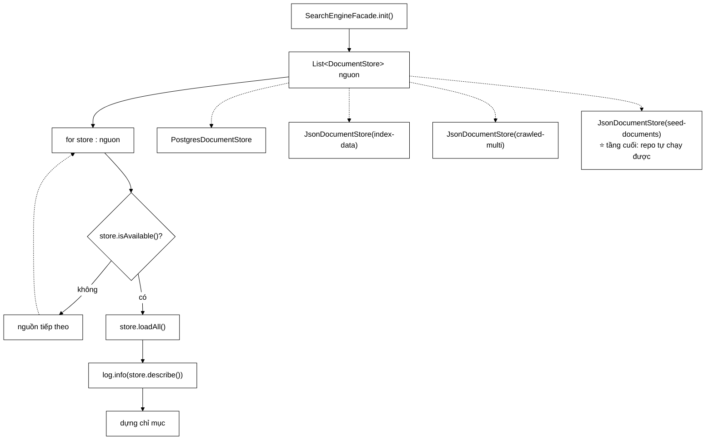

# DocumentStore — biến một chuỗi `else if` thành dữ liệu

**File nguồn:** `search-engine/src/main/java/com/vnsearch/storage/DocumentStore.java` (42 dòng)
**Gói:** `com.vnsearch.storage` · **Loại:** `interface extends AutoCloseable`, 3 phương thức + 1 mặc định
**Vị trí trong sơ đồ:** nguồn **corpus** cho `SearchEngineFacade` lúc khởi động
**Đọc kèm:** [`JsonDocumentStore.md`](./JsonDocumentStore.md) · [`PostgresDocumentStore.md`](./PostgresDocumentStore.md) · [`../service/SearchEngineFacade.md`](../service/SearchEngineFacade.md)

---

## 📌 Hiểu trong 30 giây

**Strategy pattern** cho nguồn dữ liệu. Ba phương thức, và toàn bộ giá trị nằm ở
một câu trong Javadoc dòng 24–26:

> Chuỗi dự phòng trở thành **dữ liệu** (một `List<DocumentStore>`) thay vì **cấu
> trúc điều khiển** (chuỗi `else if`). Thêm nguồn = thêm một lớp, không sửa
> `init()`.



```
   TRƯỚC — CẤU TRÚC ĐIỀU KHIỂN

        if      (postgresEnabled && loadFromPostgres()) { ... }
        else if (Files.exists(indexDataPath))           { ... }
        else if (Files.exists(crawledDataPath))         { ... }
        else if (Files.exists(seedDataPath))            { ... }

   SAU — DỮ LIỆU

        List.of(
            new PostgresDocumentStore(url, user, pass),
            new JsonDocumentStore(indexDataPath,   "Chỉ mục đã lưu"),
            new JsonDocumentStore(crawledDataPath, "Corpus đã crawl"),
            new JsonDocumentStore(seedDataPath,    "Mẫu đi kèm repo"))

   Cùng một thứ tự ưu tiên. Nhưng một bên SỬA ĐƯỢC bằng cách thêm phần tử,
   bên kia phải sửa mã.
```

---

## 1. Ba vấn đề của chuỗi `else if`

Javadoc dòng 12–22.

### 1.1 Thêm nguồn thứ năm là thêm một nhánh

```
   Muốn thêm S3, MongoDB, hay Redis:

        else if (s3Enabled && loadFromS3()) { ... }     ← nhánh thứ 5
        else if (mongoEnabled && ...)       { ... }     ← nhánh thứ 6

   ⇒ init() dài dần, và MỌI nguồn mới đều đụng vào MỘT phương thức
     mà mọi nguồn cũ cũng nằm trong đó.
   ⇒ Mỗi lần sửa là một cơ hội làm hỏng ba nguồn kia.

   Với danh sách:
        thêm một lớp cài DocumentStore
        thêm một phần tử vào danh sách
        init() KHÔNG SỬA MỘT DÒNG NÀO
```

### 1.2 Test không thay bằng nguồn giả lập được

```
   ┌──────────────────────────────────────────────────────────────┐
   │  Với chuỗi else if, muốn test SearchEngineFacade:            │
   │                                                              │
   │    - phải TẠO THẬT một tệp ở đúng đường dẫn                  │
   │    - hoặc phải DỰNG THẬT một PostgreSQL                      │
   │    - hoặc phải mock Files.exists() (tĩnh — rất khó)          │
   │                                                              │
   │  ⇒ Test chậm, dễ vỡ, phụ thuộc hệ tệp                        │
   └──────────────────────────────────────────────────────────────┘

   Với interface:

        var giaLap = new DocumentStore() {
            public boolean isAvailable() { return true; }
            public List<WebDocument> loadAll() { return mauTaiLieu(); }
            public String describe() { return "giả lập"; }
        };
        var facade = new SearchEngineFacade(List.of(giaLap));

   → 5 dòng, 0 giây, không chạm đĩa.
```

Đây là cùng lợi ích mà [`CrawlEventBus`](../crawler/bus/CrawlEventBus.md) mang
lại cho tầng bus: **tách trừu tượng ra thì test không cần hạ tầng nữa.**

### 1.3 `DocumentRepository` chỉ là lớp cụ thể, không cài đặt gì

```
   TRƯỚC: DocumentRepository là một lớp độc lập, không cài interface nào.
          → nó KHÔNG THAY THẾ ĐƯỢC cho nguồn JSON
          → và nguồn JSON cũng không thay thế được cho nó
          → hai thứ làm CÙNG MỘT VIỆC (nạp corpus) nhưng không có
            kiểu chung nào

   SAU:   PostgresDocumentStore bọc DocumentRepository và cài DocumentStore
          → giờ CÙNG MỘT KIỂU với JsonDocumentStore
          → xếp chung một danh sách được
```

Chú ý cách làm: **không sửa `DocumentRepository`**, mà **bọc** nó bằng một lớp
mỏng. Đó là Adapter pattern, và nó giữ cho `DocumentRepository` tiếp tục dùng
được ở nơi khác (`PostgresImportRunner`, `GinBaselineRunner`) mà không kéo theo
phụ thuộc vào `DocumentStore`.

---

## 2. Ba phương thức, và vì sao tách `isAvailable` khỏi `loadAll`

```java
boolean isAvailable();
List<WebDocument> loadAll() throws IOException;
String describe();
```

### 2.1 Vì sao không gộp thành `Optional<List<WebDocument>> tryLoad()`

```
   PHƯƠNG ÁN GỘP:
        Optional<List<WebDocument>> tryLoad();
        → rỗng nghĩa là không có nguồn

   VẤN ĐỀ:
        Không phân biệt được HAI CA hoàn toàn khác nhau:

        ① "Nguồn này KHÔNG CÓ"          → thử nguồn tiếp theo  ✓
        ② "Nguồn CÓ nhưng nạp HỎNG"      → đây là LỖI THẬT,
                                            cần báo, không nên
                                            lặng lẽ lùi về nguồn khác

        Gộp lại ⇒ một tệp corpus 87 MB bị hỏng sẽ âm thầm khiến hệ thống
        chạy bằng 40 tài liệu mẫu, và KHÔNG AI BIẾT.
```

```
   TÁCH RA:
        isAvailable() == false     → ca ①, chuyển nguồn, bình thường
        loadAll() ném IOException  → ca ②, LỖI, phải lộ ra

   ⇒ Cùng nguyên tắc "phân biệt rỗng với không có" đã thấy ở:
        ImageStorage.md mục 4.3   (tệp [] vs không có tệp)
        ImageFound.md mục 4.3     (-1 vs 0)
        OutlinksExtracted.md mục 3.3 (rỗng là dữ liệu vs rỗng là lỗi)
```

### 2.2 `describe()` — thay cho `System.out.println` rải rác

Javadoc dòng 36 nói rõ mục đích:

```
   TRƯỚC: mỗi nhánh else if tự in ra một dòng khác nhau
        System.out.println("Nap tu PostgreSQL...");
        System.out.println("Doc file " + indexDataPath);
        ...
        → định dạng không nhất quán
        → và một nhánh QUÊN in thì không ai biết dữ liệu đến từ đâu

   SAU:  init() in MỘT dòng duy nhất:
        log.info("Nạp corpus từ: {}", store.describe());

   ⇒ Định dạng nhất quán, và KHÔNG THỂ quên —
     vì nó nằm ở vòng lặp chung, không nằm trong từng nhánh.
```

Câu hỏi *"dữ liệu đang đến từ đâu?"* là câu hỏi đầu tiên khi chẩn đoán một hệ
thống trả kết quả lạ. Bắt mỗi nguồn tự mô tả mình là cách rẻ nhất để câu trả lời
luôn có sẵn.

### 2.3 `extends AutoCloseable` với `close()` mặc định rỗng

```java
public interface DocumentStore extends AutoCloseable {
    ...
    @Override
    default void close() { }
}
```

```
   VÌ SAO KẾ THỪA AutoCloseable:
        PostgresDocumentStore giữ kết nối CSDL — CẦN đóng.
        JsonDocumentStore chỉ đọc tệp rồi thôi — KHÔNG có gì để đóng.

   VÌ SAO close() LÀ default RỖNG:
        ✔ JsonDocumentStore không phải viết một phương thức rỗng vô nghĩa
        ✔ chỗ gọi vẫn dùng try-with-resources thống nhất cho MỌI nguồn
        ✔ thêm nguồn mới cần đóng thì chỉ việc ghi đè

   ⇒ Cùng khuôn với handlerName() ở PageEventHandler mục 4.3:
     default method cho chi phí BẰNG 0 ở ca thường,
     và có đường thoát cho ca đặc biệt.
```

**Lưu ý một điểm tinh tế:** `AutoCloseable.close()` khai báo
`throws Exception`, nhưng bản `default` ở đây **không** khai báo — nên chỗ gọi
`try (DocumentStore s = ...)` chỉ phải bắt những gì bản cài thực sự ném. Đó là
kỹ thuật thu hẹp chữ ký (covariant throws) và nó làm mã gọi sạch hơn hẳn.

---

## 3. Hướng dẫn về code

### 3.1 Hợp đồng: `loadAll()` chỉ gọi khi `isAvailable()` là `true`

```java
/** Nap toan bo corpus. Chi goi khi {@link #isAvailable()} tra ve true. */
List<WebDocument> loadAll() throws IOException;
```

```
   Đây là một TIỀN ĐIỀU KIỆN, và nó cho phép bản cài đơn giản đi:

        JsonDocumentStore.loadAll() KHÔNG kiểm tệp có tồn tại không —
        vì hợp đồng đã bảo đảm isAvailable() đã trả true.

   ⚠ NHƯNG: hợp đồng này KHÔNG ĐƯỢC ÉP BUỘC.
        Không có gì ngăn ai đó gọi thẳng loadAll().
        Và giữa isAvailable() và loadAll() có một CỬA SỔ:
        tệp có thể bị xoá, CSDL có thể mất kết nối.

   ⇒ Đây là TOCTOU (time-of-check to time-of-use), và ở đây nó
     được xử lý đúng: loadAll() ném IOException, chỗ gọi bắt được.
     Nhưng cần biết rằng isAvailable()==true KHÔNG BẢO ĐẢM loadAll()
     sẽ thành công.
```

### 3.2 Cách viết vòng lặp dự phòng ở chỗ gọi

```java
// Mẫu chuẩn ở SearchEngineFacade.init()
for (DocumentStore store : nguonTheoUuTien) {
    if (!store.isAvailable()) {
        continue;
    }
    try (store) {                                   // try-with-resources
        List<WebDocument> docs = store.loadAll();
        log.info("Nạp {} tài liệu từ: {}", docs.size(), store.describe());
        return docs;
    } catch (IOException e) {
        // Nguồn CÓ nhưng HỎNG — đây là lỗi thật, phải ghi WARN
        log.warn("Nguồn {} có sẵn nhưng nạp thất bại, thử nguồn tiếp theo",
                store.describe(), e);
    }
}
log.error("KHÔNG nguồn nào nạp được corpus");
return List.of();
```

```
   HAI MỨC LOG KHÁC NHAU LÀ CỐ Ý:

        isAvailable() == false  →  KHÔNG log gì (bình thường)
        loadAll() ném           →  WARN (bất thường, cần biết)
        hết nguồn               →  ERROR

   ⇒ Người vận hành nhìn log biết ngay hệ thống đang chạy ở
     tầng dự phòng thứ mấy, và vì sao.
```

### 3.3 Cạm bẫy khi sửa interface này

| Ý định | Hậu quả |
|---|---|
| Gộp `isAvailable` + `loadAll` | Không phân biệt "không có nguồn" với "nguồn hỏng" |
| Cho `isAvailable()` ném | Phá vòng lặp dự phòng — một nguồn hỏng chặn mọi nguồn sau |
| Bỏ `describe()` | Mất câu trả lời cho *"dữ liệu đến từ đâu"* |
| Đổi `close()` thành abstract | Mọi bản cài JSON phải viết phương thức rỗng |
| Thêm `save(List<WebDocument>)` | Trộn hai trách nhiệm; xem 4.1 |
| Trả `Stream<WebDocument>` thay `List` | Đáng cân nhắc cho corpus lớn, nhưng phá tương thích — xem đề xuất 3 |

---

## 4. Những gì interface này **cố ý không** làm

### 4.1 Không có `save()`

```
   DocumentStore chỉ ĐỌC.

   Việc GHI corpus do ContentStorage lo (phía crawler),
   và ghi vào PostgreSQL do PostgresImportRunner lo.

   VÌ SAO TÁCH:
        - đọc xảy ra MỘT LẦN lúc khởi động
        - ghi xảy ra trong lúc crawl, từ nhiều luồng
        - và ba trong bốn nguồn (index-data, crawled-multi, seed)
          KHÔNG BAO GIỜ được ghi bởi tầng này

   ⇒ Thêm save() sẽ buộc ba bản cài phải ném
     UnsupportedOperationException — dấu hiệu kinh điển của
     một interface làm quá nhiều việc.
```

### 4.2 Không có `loadPage(int offset, int limit)`

```
   Corpus được nạp TOÀN BỘ vào bộ nhớ để dựng chỉ mục.
   Phân trang ở tầng này sẽ vô nghĩa — chỉ mục cần tất cả.

   ⚠ NHƯNG đây là giới hạn thật: corpus 87 MB nạp hết vào RAM
     một lúc. Với corpus 10× thì phải đổi mô hình.
     Xem đề xuất 3.
```

---

## 5. Độ phức tạp & chi phí

| Đại lượng | Giá trị |
|---|---|
| Interface tự nó | 0 — chỉ là hợp đồng |
| Chi phí gián tiếp | Một lời gọi ảo cho mỗi nguồn, **một lần** lúc khởi động |
| Số nguồn được thử | Tối đa 4 |
| `isAvailable()` của JSON | `Files.exists` — vài µs |
| `isAvailable()` của Postgres | **Mở kết nối + `COUNT(*)`** — vài trăm ms |

```
   ĐIỂM CẦN BIẾT: isAvailable() KHÔNG PHẢI LÚC NÀO CŨNG RẺ.

        JsonDocumentStore.isAvailable()      →  ~10 µs
        PostgresDocumentStore.isAvailable()  →  ~200-2000 ms
             (mở kết nối JDBC + đếm bản ghi;
              và nếu CSDL không có, phải chờ TIMEOUT)

   ⇒ Thứ tự trong danh sách quyết định thời gian khởi động.
     Postgres đứng đầu ⇒ mọi lần khởi động không có CSDL
     đều phải chờ timeout trước khi lùi về JSON.

   ⇒ Đây là cái giá của việc ưu tiên CSDL. Chấp nhận được
     vì nó chỉ xảy ra một lần lúc khởi động — nhưng nó làm
     `mvn test` chậm nếu test cũng đi qua đường này.
```

---

## 6. Kiểm thử liên quan

| Bộ test | Kiểm gì |
|---|---|
| [`EmptyCorpusFallbackTest`](../../../../test/java/com/vnsearch/service/EmptyCorpusFallbackTest.md) | Hành vi khi **không** nguồn nào có dữ liệu |
| [`SearchEngineFacadeApiTest`](../../../../test/java/com/vnsearch/service/SearchEngineFacadeApiTest.md) | Bên tiêu thụ |

```
   ĐẦU VÀO                                       KẾT QUẢ MONG ĐỢI
   ───────────────────────────────────────────   ────────────────────────
   nguồn 1 không có, nguồn 2 có                  dùng nguồn 2
   nguồn 1 có nhưng loadAll ném                  WARN + thử nguồn 2
   mọi nguồn đều không có                        ERROR + corpus rỗng
   danh sách nguồn rỗng                          ERROR, không ném NPE
   describe() của nguồn được chọn                xuất hiện trong log
   close() được gọi cho nguồn đã dùng            (try-with-resources)
```

Hai bài test còn thiếu, và bài đầu bảo vệ đúng phân biệt ở mục 2.1:

```java
// 1. Nguồn CÓ nhưng HỎNG phải được ghi WARN, không lùi im lặng
@Test
void nguonHongDuocGhiWarnChuKhongLuiImLang() {
    var hong = nguonGiaLap(true, () -> { throw new IOException("tệp hỏng"); });
    var duPhong = nguonGiaLap(true, () -> mauTaiLieu(40));

    var docs = facade.nap(List.of(hong, duPhong));

    assertEquals(40, docs.size());
    assertThat(logDaGhi()).anyMatch(d -> d.contains("WARN") && d.contains("nạp thất bại"));
}

// 2. close() được gọi cho MỌI nguồn đã mở, kể cả nguồn bị bỏ qua
@Test
void moiNguonDeuDuocDong() {
    // quan trọng với PostgresDocumentStore — kết nối phải được trả lại
}
```

---

## 7. Chấm theo chuẩn doanh nghiệp

| Tiêu chí | Điểm | Nhận xét |
|---|---|---|
| Chọn mẫu thiết kế | 10/10 | Strategy đúng chỗ; câu "chuỗi dự phòng thành **dữ liệu** thay vì **cấu trúc điều khiển**" là cách diễn đạt chính xác |
| Thiết kế hợp đồng | 10/10 | Tách `isAvailable` khỏi `loadAll` phân biệt được "không có" với "hỏng" |
| Khả năng kiểm thử | 10/10 | Nguồn giả lập 5 dòng, không chạm đĩa, không cần CSDL |
| Khả năng mở rộng | 10/10 | Thêm nguồn = thêm lớp + thêm phần tử; `init()` không sửa |
| Quan sát được | 10/10 | `describe()` bắt buộc mỗi nguồn tự mô tả — không thể quên |
| Tối giản | 10/10 | Ba phương thức, không có `save()` hay phân trang thừa |
| Quản lý tài nguyên | 9/10 | `AutoCloseable` + `default close()` rỗng; nhưng hợp đồng "ai đóng" không được ghi rõ |
| Hiệu năng | 7/10 | `isAvailable()` của Postgres tốn hàng trăm ms và có thể chờ timeout — **không được cảnh báo trong Javadoc** |

**Bốn đề xuất nâng lên mức sản phẩm:**

1. **Ghi vào Javadoc rằng `isAvailable()` có thể tốn kém.** Hiện hợp đồng không
   nói gì về chi phí, nên người viết vòng lặp dự phòng dễ tưởng nó rẻ như
   `Files.exists`. Thực tế `PostgresDocumentStore.isAvailable()` mở kết nối JDBC
   và có thể **chờ timeout hàng giây** khi không có CSDL. Một câu
   *"bản cài có thể thực hiện I/O; gọi một lần lúc khởi động, không gọi lặp"* đủ
   để ngăn ai đó gọi nó trong một vòng lặp.

2. **Ghi rõ ai chịu trách nhiệm `close()`.** Interface kế thừa `AutoCloseable`
   nhưng không nói người gọi phải đóng **mọi** nguồn hay chỉ nguồn đã dùng. Với
   `PostgresDocumentStore`, `isAvailable()` tự mở và tự đóng kết nối riêng (xem
   lớp đó), nên thực tế không rò rỉ — nhưng điều đó là **may mắn từ cài đặt**,
   không phải bảo đảm từ hợp đồng.

3. **Cân nhắc `Stream<WebDocument> stream()` cho corpus lớn.** Hiện `loadAll()`
   nạp **toàn bộ** vào RAM — corpus 87 MB đã là 367 MB đối tượng trong bộ nhớ
   (xem [`CrawlJobManager`](../service/CrawlJobManager.md) mục 5). Với corpus
   10× thì mô hình này không còn dùng được. Thêm một
   `default Stream<WebDocument> stream() { return loadAll().stream(); }` cho
   phép bản cài nào làm được thì đọc theo dòng, mà không phá bản cài cũ — đúng
   khuôn `default` mà interface này đã dùng cho `close()`.

4. **Test `close()` cho mọi nguồn** (mã ở mục 6). Đây là loại rò rỉ chỉ lộ ra sau
   nhiều lần khởi động lại — và với kết nối CSDL thì nó dẫn tới cạn pool kết nối
   ở phía server, một triệu chứng rất khó truy về đúng nguyên nhân.

---

## 8. Liên kết

- Bản cài đọc tệp JSON: [`JsonDocumentStore.md`](./JsonDocumentStore.md)
- Bản cài đọc PostgreSQL: [`PostgresDocumentStore.md`](./PostgresDocumentStore.md)
- Lớp được bọc bên dưới: [`DocumentRepository.md`](./DocumentRepository.md)
- Bên tiêu thụ, nơi có vòng lặp dự phòng: [`../service/SearchEngineFacade.md`](../service/SearchEngineFacade.md)
- Nơi corpus được **ghi** ra: [`../crawler/ContentStorage.md`](../crawler/ContentStorage.md)
- Nạp corpus vào PostgreSQL: [`PostgresImportRunner.md`](./PostgresImportRunner.md)
- Đối chứng ngoài bằng chỉ mục GIN: [`GinBaselineRunner.md`](./GinBaselineRunner.md)
- Cùng lợi ích tách trừu tượng khỏi hạ tầng: [`../crawler/bus/CrawlEventBus.md`](../crawler/bus/CrawlEventBus.md)
- Tổng quan: `docs/ARCHITECTURE.md`
