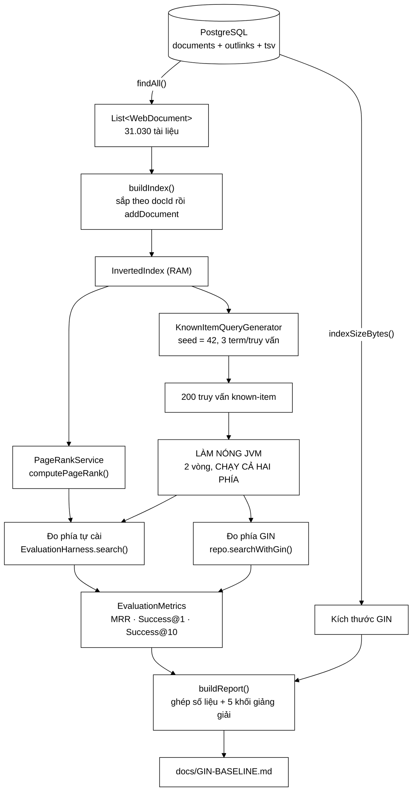

# GinBaselineRunner — 353 dòng biến câu "chỉ mục của tôi nhanh" từ lời tự khẳng định thành một phép đo có đối chứng

**File nguồn:** `search-engine/src/main/java/com/vnsearch/storage/GinBaselineRunner.java` (353 dòng)
**Gói:** `com.vnsearch.storage` · **Loại:** `class` chỉ có `main()` và ba phương thức `private static` — **không** phải thành phần Spring, **không** ai `new` nó bao giờ
**Vị trí trong sơ đồ:** nằm ngoài mọi đường phục vụ người dùng; là **công cụ thí nghiệm** chạy tay, đọc từ `DocumentRepository` và ghi ra `docs/GIN-BASELINE.md`
**Đọc kèm:** [`DocumentRepository.md`](./DocumentRepository.md) · [`PostgresDocumentStore.md`](./PostgresDocumentStore.md) · [`PostgresImportRunner.md`](./PostgresImportRunner.md) · [`../eval/EvaluationHarness.md`](../eval/EvaluationHarness.md) · [`../eval/KnownItemQueryGenerator.md`](../eval/KnownItemQueryGenerator.md)

---

## 📌 Hiểu trong 30 giây

Toàn bộ đồ án này dựng trên một luận điểm: **chỉ mục đảo tự cài đặt là thứ đáng
làm**. Nhưng luận điểm đó chỉ có giá trị nếu đo được. Và đo thì phải đo **so với
cái gì**.

Lớp này chính là nơi phép so sánh ấy được thực hiện. Nó lấy đúng một corpus, đúng
một bộ truy vấn, chạy song song qua **hai** cỗ máy tìm kiếm — một do đồ án tự
viết, một là chỉ mục **GIN** của PostgreSQL — rồi in ra bảng số liệu và tự sinh
một báo cáo Markdown hoàn chỉnh.

```
   VÌ SAO ĐÂY LÀ LỚP QUAN TRỌNG NHẤT VỀ MẶT HỌC THUẬT

   Không có lớp này:
        "Chỉ mục đảo tự cài chạy 6 ms mỗi truy vấn."
        → Nhanh so với cái gì?  6 ms là nhanh hay chậm?
        → Người chấm không có cách nào kiểm chứng ⇒ câu này VÔ NGHĨA.

   Có lớp này:
        "Trên cùng 31.030 tài liệu và cùng 200 truy vấn known-item,
         chỉ mục tự cài đạt 6,4 ms/truy vấn còn PostgreSQL GIN đạt
         1,4 ms/truy vấn — GIN NHANH HƠN dù phải qua mạng và SQL.
         Về chất lượng thì ngược lại, vì tách từ tiếng Việt."
        → Có thể kiểm chứng, có thể bác bỏ ⇒ đây mới là KHOA HỌC.
```

Điều làm lớp này khác biệt so với một script benchmark thông thường: nó **đo cả
phần mình thua**, và nó viết sẵn trong mã cả hai kịch bản diễn giải — thắng và
thua. Ba khối `String` hằng số ở cuối file (`NOT_EQUIVALENT`,
`WHAT_IT_DOES_NOT_PROVE`) tồn tại chỉ để nói rõ những gì phép so sánh này
**không** chứng minh.



```
   MỘT LẦN CHẠY, NHÌN THEO TRỤC THỜI GIAN

   ┌──────────────────────────────────────────────────────────────────────┐
   │ ① NẠP     findAll()                              ~20–45 giây        │
   │ ② DỰNG    buildIndex() + PageRank                ~30–60 giây        │
   │ ③ SINH    200 truy vấn known-item, seed 42       < 1 giây           │
   │ ④ NÓNG    2 × 200 × 2 phía = 800 lượt tìm kiếm   ~10 giây   ⚠ BẮT   │
   │           KHÔNG ĐO — chỉ để JIT biên dịch                    BUỘC   │
   │ ⑤ ĐO      200 lượt phía tự cài  (bấm giờ)        ~1,3 giây         │
   │ ⑥ ĐO      200 lượt phía GIN     (bấm giờ)        ~0,3 giây         │
   │ ⑦ VIẾT    buildReport() → Files.writeString      < 10 ms           │
   └──────────────────────────────────────────────────────────────────────┘

   Chú ý tỉ lệ: bước ④ TỐN NHIỀU THỜI GIAN HƠN cả hai bước đo cộng lại.
   Đó không phải lãng phí — đó là cái giá của một phép đo trung thực.
```

---

## Mục lục

1. [Vì sao đồ án bắt buộc phải có một baseline bên ngoài](#1-vì-sao-đồ-án-bắt-buộc-phải-có-một-baseline-bên-ngoài)
2. [Giải phẫu 353 dòng: ba phần rất khác nhau](#2-giải-phẫu-353-dòng-ba-phần-rất-khác-nhau)
3. [Hai dòng đọc tham số và bốn giả định ngầm](#3-hai-dòng-đọc-tham-số-và-bốn-giả-định-ngầm)
4. [`buildIndex()` — vì sao phải sắp xếp lại dù CSDL đã `ORDER BY`](#4-buildindex--vì-sao-phải-sắp-xếp-lại-dù-csdl-đã-order-by)
5. [Bộ truy vấn known-item và seed 42 — trục tái lập của cả đồ án](#5-bộ-truy-vấn-known-item-và-seed-42--trục-tái-lập-của-cả-đồ-án)
6. [Làm nóng JVM — phần kỹ thuật đáng giá nhất của lớp này](#6-làm-nóng-jvm--phần-kỹ-thuật-đáng-giá-nhất-của-lớp-này)
7. [Hai vòng đo: điều làm đúng và điều còn nhiễu](#7-hai-vòng-đo-điều-làm-đúng-và-điều-còn-nhiễu)
8. [Bộ chỉ số được chọn, và cái bẫy `TOP_N = 10`](#8-bộ-chỉ-số-được-chọn-và-cái-bẫy-top_n--10)
9. [Đo kích thước chỉ mục: hai con số không cùng đơn vị](#9-đo-kích-thước-chỉ-mục-hai-con-số-không-cùng-đơn-vị)
10. [Báo cáo tự sinh: vì sao văn giảng giải nằm trong hằng số Java](#10-báo-cáo-tự-sinh-vì-sao-văn-giảng-giải-nằm-trong-hằng-số-java)
11. [Hai nhánh `if` ở mục nhận xét — trung thực được cưỡng chế bằng mã](#11-hai-nhánh-if-ở-mục-nhận-xét--trung-thực-được-cưỡng-chế-bằng-mã)
12. [Điều phép so sánh này KHÔNG chứng minh](#12-điều-phép-so-sánh-này-không-chứng-minh)
13. [Hướng dẫn về code](#13-hướng-dẫn-về-code)
14. [Độ phức tạp & chi phí](#14-độ-phức-tạp--chi-phí)
15. [Kiểm thử liên quan](#15-kiểm-thử-liên-quan)
16. [Liên kết](#16-liên-kết)

---

## 1. Vì sao đồ án bắt buộc phải có một baseline bên ngoài

`schema.sql` dòng 3–7 tuyên bố nguyên tắc nền của cả dự án: **PostgreSQL chỉ là
KHO**, việc tìm kiếm vẫn do chỉ mục đảo tự cài đảm nhiệm. Nếu đẩy tìm kiếm sang
full-text search của PostgreSQL thì phần cấu trúc dữ liệu tự cài — nội dung chính
của đồ án — trở nên vô nghĩa.

Nhưng tuyên bố ấy sinh ra ngay một câu hỏi phản biện, và đó là câu hỏi khó nhất
mà hội đồng có thể đặt ra:

> *"Nếu PostgreSQL đã có sẵn chỉ mục GIN — cũng là một chỉ mục đảo, được tối ưu
> hàng chục năm — thì việc tự cài lại một cái có ý nghĩa gì?"*

```
   BA CÁCH TRẢ LỜI, CHỈ MỘT CÁCH ĐỨNG VỮNG

   ┌────────────────────────────────────────────────────────────────────────┐
   │ ✘ "Vì đề bài yêu cầu tự cài."                                          │
   │    → Đúng nhưng vô giá trị học thuật. Trả lời như không trả lời.       │
   │                                                                        │
   │ ✘ "Vì chỉ mục tự cài nhanh hơn."                                       │
   │    → Tự khẳng định. Nhanh so với cái gì? Đo thế nào? Trên máy nào?     │
   │       Bị hỏi tiếp một câu là đổ.                                       │
   │                                                                        │
   │ ✔ "Trên cùng corpus và cùng bộ truy vấn, hai bên cho ra CÁC CON SỐ     │
   │    SAU. Chỗ chúng tôi hơn là chất lượng tiếng Việt, và lý do là tách   │
   │    từ chứ không phải cấu trúc dữ liệu. Chỗ chúng tôi thua là bền       │
   │    vững, đồng thời, và cập nhật tăng dần. Đây là mã sinh ra số đó."    │
   │    → Kiểm chứng được, bác bỏ được, và KHIÊM TỐN.                       │
   └────────────────────────────────────────────────────────────────────────┘
```

Javadoc của lớp (dòng 18–35) chọn đúng cách thứ ba, và còn đi xa hơn: nó gọi
PostgreSQL là mốc so sánh **"sòng phẳng và khiêm tốn"**. Từ *khiêm tốn* ở đây rất
đúng chỗ — không phải sự nhún nhường xã giao mà là một phát biểu kỹ thuật: chỉ
mục GIN cùng **họ** với chỉ mục tự cài (đều là chỉ mục đảo), nên so sánh không
phải kiểu so táo với cam.

```
   VÌ SAO GIN LÀ ĐỐI CHỨNG ĐÚNG CHỨ KHÔNG PHẢI LUCENE/ELASTICSEARCH

   Lucene / Elasticsearch      GIN của PostgreSQL
   ──────────────────────      ──────────────────────────────────────────
   Cũng là chỉ mục đảo         Cũng là chỉ mục đảo
   Có BM25 sẵn                 Chỉ ts_rank
   Có analyzer tiếng Việt      Chỉ 'simple'
   Phải cài thêm hạ tầng       ĐÃ CÓ SẴN vì dự án dùng làm kho

   ⇒ Chọn GIN vì nó ĐÃ Ở ĐÓ: cùng tiến trình lưu trữ, cùng dữ liệu,
     không thêm một biến số hạ tầng nào vào phép đo.
     Cột `tsv` là cột GENERATED ALWAYS ⇒ nó luôn đồng bộ với body_text,
     không có cách nào để hai bên đọc dữ liệu khác nhau.
```

Chính chi tiết cuối là điều tinh tế nhất về mặt thiết kế thí nghiệm: cột `tsv`
được khai báo `GENERATED ALWAYS AS (...) STORED` trong `schema.sql` dòng 47–54.
Nghĩa là **không tồn tại** kịch bản "quên cập nhật chỉ mục GIN sau khi nạp dữ
liệu mới". Hai bên bắt buộc nhìn cùng một corpus, và điều đó do CSDL cưỡng chế
chứ không do kỷ luật của người chạy thí nghiệm.

---

## 2. Giải phẫu 353 dòng: ba phần rất khác nhau

Đọc lướt qua thì file này trông như một script. Nhìn kỹ thì nó có ba phần với
bản chất hoàn toàn khác nhau, và tỉ lệ giữa chúng là điều đáng nói.

```
   353 DÒNG, CHIA THEO BẢN CHẤT

   ┌──────────────────────────────────────────────────────────────────────┐
   │ ① 18–35     Javadoc lớp                          18 dòng   ( 5%)    │
   │ ② 38–143    Mã điều phối thí nghiệm             106 dòng   (30%)    │
   │ ③ 145–208   buildReport() — ghép số vào bảng     64 dòng   (18%)    │
   │ ④ 218–352   NĂM hằng số String chứa văn giảng   135 dòng   (38%)    │
   │              giải KHÔNG phụ thuộc số liệu                            │
   │ ⑤ còn lại   import, dấu ngoặc, dòng trắng        30 dòng   ( 9%)    │
   └──────────────────────────────────────────────────────────────────────┘

   ⇒ 38% mã nguồn của lớp này là VĂN BẢN TIẾNG VIỆT.
     Đây không phải sự thừa thãi. Đọc tiếp phần 10 để hiểu vì sao
     nó BẮT BUỘC phải nằm trong .java chứ không phải trong .md.
```

Phần ② tự chia thành sáu giai đoạn nối tiếp, và không giai đoạn nào bỏ được: nạp
corpus → dựng lại chỉ mục (phải dựng **lại**, không nạp từ `index.json`, xem
[phần 4](#4-buildindex--vì-sao-phải-sắp-xếp-lại-dù-csdl-đã-order-by)) → tính
PageRank (vì cấu hình xếp hạng dùng trọng số 0,3 cho nó; bỏ đi là đo một hệ thống
**khác** hệ thống thật) → sinh truy vấn với seed 42 → làm nóng JVM (bỏ đi thì sai
số ~40%, xem [phần 6](#6-làm-nóng-jvm--phần-kỹ-thuật-đáng-giá-nhất-của-lớp-này))
→ đo hai phía, chỗ duy nhất có `System.nanoTime()`.

---

## 3. Hai dòng đọc tham số và bốn giả định ngầm

```java
public static void main(String[] args) throws Exception {
    int numQueries = args.length > 0 ? Integer.parseInt(args[0]) : 200;
    String reportPath = args.length > 1 ? args[1] : "../docs/GIN-BASELINE.md";
```

Hai dòng này gọn, nhưng chúng gói bốn giả định ngầm mà không dòng mã nào kiểm
tra.

```
   BỐN GIẢ ĐỊNH NGẦM, XẾP THEO MỨC ĐỘ DỄ VI PHẠM

   ① CWD phải là search-engine/                              ★★★ DỄ SAI
      "../docs/GIN-BASELINE.md" là đường dẫn TƯƠNG ĐỐI. Chạy từ thư mục
      gốc repo ⇒ ghi ra ../docs/ NGOÀI repo. Không lỗi, không cảnh báo —
      file chỉ đơn giản nằm sai chỗ. May là dòng cuối in ra
      toAbsolutePath().normalize() nên còn NHÌN ra được.

   ② args[0] phải là số nguyên                               ★★☆
      Integer.parseInt("abc") ném NumberFormatException với thông điệp
      'For input string: "abc"' — không nói được là tham số nào.

   ③ numQueries phải > 0                                     ★☆☆
      Truyền 0 ⇒ n = 0 ⇒ ownNanos/1e6/0 = NaN ⇒ báo cáo in "NaN ms",
      không ném ngoại lệ, và được ghi ra đĩa như một kết quả thật.

   ④ Có PostgreSQL đang chạy                                 ★★☆
      connectDefault() ném SQLException; main() khai báo throws Exception
      ⇒ stack trace thô. Người chạy lần đầu thấy "Connection refused"
      mà không được gợi ý "docker compose up -d".
```

Riêng giả định ④ có một điểm sáng đáng ghi nhận: ngay sau khi nạp, mã kiểm tra
corpus rỗng và **đưa ra hướng dẫn cụ thể** thay vì để chương trình chạy tiếp và
sinh ra một báo cáo vô nghĩa:

```java
if (docs.isEmpty()) {
    System.err.println("CSDL rong - chay PostgresImportRunner truoc.");
    return;
}
```

```
   VÌ SAO DÒNG NÀY QUAN TRỌNG HƠN VẺ NGOÀI CỦA NÓ

   Không có nó: docs rỗng → InvertedIndex rỗng → sinh 0 truy vấn →
   n = 0 → mọi phép chia cho n ra NaN → báo cáo VẪN ĐƯỢC GHI RA với
   MRR = NaN, thời gian = NaN, và không một thông báo lỗi nào.
   ⇒ Hỏng IM LẶNG — hạng lỗi tệ nhất. Một dòng if + return chặn hết.

   ⇒ Nhưng chú ý: nó chặn được ca "CSDL rỗng", KHÔNG chặn được ca
     "numQueries = 0" ở giả định ③. Cùng triệu chứng NaN, chỉ một
     trong hai đường dẫn tới nó được rào.
```

Chi tiết đáng khen nữa: thông điệp lỗi đi ra `System.err` chứ không phải
`System.out`, nên khi ai đó chuyển hướng đầu ra vào file thì lỗi vẫn hiện trên
màn hình — loại chi tiết nhỏ mà mã script thường bỏ qua.

---

## 4. `buildIndex()` — vì sao phải sắp xếp lại dù CSDL đã `ORDER BY`

```java
private static InvertedIndex buildIndex(List<WebDocument> docs) {
    List<WebDocument> sorted = new ArrayList<>(docs);
    sorted.sort(Comparator.comparingInt(WebDocument::getDocId));
    InvertedIndex index = new InvertedIndex();
    for (WebDocument doc : sorted) {
        index.addDocument(doc);
    }
    return index;
}
```

Bảy dòng, và hai quyết định đáng bảo vệ.

**Quyết định thứ nhất: sắp xếp lại, dù `findAll()` đã `ORDER BY doc_id`.**

Nhìn thoáng qua thì đây là mã thừa. `DocumentRepository.findAll()` đã có
`ORDER BY doc_id` và dùng `LinkedHashMap` để giữ thứ tự (xem
[`DocumentRepository.md` phần 7](./DocumentRepository.md#7-order-by-doc_id--ràng-buộc-đến-từ-ngoài-csdl)).
Vậy vì sao còn sắp lại?

```
   PHÒNG THỦ THEO CHIỀU SÂU, KHÔNG PHẢI MÃ THỪA

   Bất biến cần: posting list sắp theo docId tăng dần — điều kiện đúng
   của phép giao two-pointer O(m+n). Nó đang được giữ bởi HAI thứ ở HAI
   TẦNG khác nhau:
        tầng SQL   : ORDER BY doc_id trong findAll()
        tầng Java  : sorted.sort(...) ở ĐÂY

   Chi phí lớp phòng thủ thứ hai: 31.030 phần tử, TimSort trên dữ liệu
   ĐÃ SẮP ⇒ O(n) (TimSort phát hiện dãy tăng và thoát sớm) ⇒ ~3 ms,
   cộng ~250 KB cho bản sao mảng tham chiếu.

   ⇒ 3 ms để miễn nhiễm với việc ai đó xoá ORDER BY, và để buildIndex()
     dùng lại được với một nguồn KHÔNG sắp xếp (ví dụ đọc từ JSON).
```

**Quyết định thứ hai: sao chép trước khi sắp, thay vì sắp tại chỗ.**

`new ArrayList<>(docs)` tạo một danh sách mới. Nếu gọi thẳng `docs.sort(...)` thì
phương thức sẽ **thay đổi danh sách của người gọi** — một tác dụng phụ mà chữ ký
`buildIndex(List<WebDocument>)` không hề gợi ý. Trong lớp này thì vô hại (`docs`
không dùng lại sau đó), nhưng `buildIndex()` là một hàm **thuần** nếu sao chép và
là hàm **có tác dụng phụ** nếu không. Cái giá để nó thuần: một mảng 31.030 con
trỏ ≈ 250 KB, chưa tới 0,15% dung lượng mà chính các `WebDocument` đang chiếm
(~87 MB) — rẻ đến mức không cần cân nhắc.

**Điều đáng chú ý hơn cả: vì sao KHÔNG nạp chỉ mục từ `data/index.json`?**

Dự án có sẵn `IndexPersistence` cho phép ghi/đọc chỉ mục đã dựng, và file
`data/index.json` được chính lớp này tham chiếu ở dòng 117 để đo kích thước. Nạp
lại từ đó sẽ tiết kiệm 30–60 giây mỗi lần chạy thí nghiệm.

```
   NHƯNG NẠP LẠI SẼ PHÁ PHÉP ĐO

   Nếu nạp từ index.json:
     - Chỉ mục có thể đã được dựng từ MỘT corpus KHÁC corpus trong CSDL.
       File JSON không mang theo bằng chứng nào về nguồn gốc của nó.
     - Hai phía tìm trên hai tập tài liệu khác nhau ⇒ so sánh SAI mà
       KHÔNG có triệu chứng nào lộ ra.
     - Chỉ số "thời gian dựng chỉ mục" không đo được nữa.

   Dựng lại từ chính CSDL:
     - Cưỡng chế "hai phía nhìn cùng corpus" bằng CẤU TRÚC CHƯƠNG TRÌNH
       chứ không bằng kỷ luật của người chạy.
     - Trả giá 30–60 giây, cho một thí nghiệm chạy tay vài lần cả đời.

   ⇒ Cùng triết lý với cột tsv GENERATED ALWAYS: mọi thứ đảm bảo "hai bên
     nhìn cùng dữ liệu" đều được đẩy về chỗ người dùng KHÔNG THỂ làm sai.
```

---

## 5. Bộ truy vấn known-item và seed 42 — trục tái lập của cả đồ án

```java
List<KnownItemQueryGenerator.KnownItemQuery> queries =
        new KnownItemQueryGenerator().generate(index, numQueries, 3, 42L);
```

Bốn tham số, và mỗi tham số là một quyết định thí nghiệm.

| Tham số | Giá trị | Vì sao |
|---|---|---|
| `index` | chỉ mục vừa dựng | Truy vấn được sinh **từ** corpus, nên chắc chắn có đáp án đúng |
| `numQueries` | 200 (mặc định) | Đủ để trung bình ổn định, đủ nhỏ để chạy trong vài giây |
| `termsPerQuery` | 3 | Mô phỏng truy vấn thật; 1 term thì quá dễ, 6 term thì quá hiếm gặp |
| `seed` | **42L** | Tái lập chính xác giữa các lần chạy và giữa các máy |

```
   VÌ SAO KNOWN-ITEM CHỨ KHÔNG PHẢI QRELS THỦ CÔNG

   ① QRELS (gán nhãn tay)  + độ liên quan THẬT, nhiều mức, tính được nDCG/MAP
                           − 200 truy vấn × 30 tài liệu = 6.000 phán xét
                           → dự án CÓ: QrelsEvaluationRunner + PoolBuilder

   ② KNOWN-ITEM            + sinh tự động, tái lập tuyệt đối nhờ seed
      (rút 3 term từ tài   − chỉ đo "tìm lại được bài đã biết", KHÔNG đo
       liệu D, đáp án = D)    được độ liên quan chủ đề

   ⇒ Lớp này chọn ②, và đúng cho mục đích của nó: phép đo cần CÙNG một
     bộ truy vấn chạy qua hai hệ thống, không cần thang liên quan tinh vi.
```

**Vì sao seed 42 quan trọng hơn vẻ ngoài của nó.** Bình luận trong mã ghi rõ đây
là *"đúng bộ truy vấn mà `docs/EVALUATION.md` dùng"*. Nghĩa là con số 42 không
phải một trò đùa văn hoá mà là một **khoá liên kết giữa hai tài liệu độc lập**.

```
   SEED 42 NỐI BA THỨ LẠI VỚI NHAU

        EvaluationRunner  ──seed 42──┐
                                     ├──> CÙNG 200 truy vấn
        GinBaselineRunner ──seed 42──┘

   ⇒ MRR trong docs/EVALUATION.md và MRR trong docs/GIN-BASELINE.md
     SO SÁNH ĐƯỢC TRỰC TIẾP với nhau.

   Đổi seed ở MỘT chỗ mà quên chỗ kia:
        hai báo cáo vẫn sinh ra bình thường
        hai con số MRR vẫn trông hợp lý
        nhưng chúng không còn nói về cùng một thứ    ⚠

   ⇒ Con số 42 đang bị chép cứng ở HAI file. Đây là chỗ đáng
     rút thành một hằng số chung — xem phần 16, đề xuất 4.
```

---

## 6. Làm nóng JVM — phần kỹ thuật đáng giá nhất của lớp này

Đây là phần mà nếu chỉ được trình bày **một** điểm kỹ thuật từ lớp này trước hội
đồng, thì nên trình bày phần này.

```java
System.out.println("Lam nong JVM ...");
for (int round = 0; round < 2; round++) {
    for (KnownItemQueryGenerator.KnownItemQuery q : queries) {
        harness.search(q.queryText(), config, TOP_N);
        repo.searchWithGin(q.queryText(), TOP_N);
    }
}
```

Chín dòng, không bấm giờ, không lưu kết quả — kết quả trả về bị **vứt đi ngay**.
Một người đọc mã không hiểu JVM sẽ coi đây là mã chết và xoá nó.

```
   VÌ SAO KHÔNG LÀM NÓNG THÌ PHÉP ĐO SAI

   JVM thực thi bytecode theo BA giai đoạn, nhanh dần:

   ① THÔNG DỊCH   lượt 1 → ~1.500     diễn giải từng bytecode, ~20–50× chậm
   ② C1 client    ~1.500 → ~10.000    sinh mã máy, tối ưu mức nhẹ
   ③ C2 server    sau ~10.000 lượt    nội tuyến hàm, khử biên kiểm mảng,
                                      escape analysis — nhanh nhất

   200 truy vấn × 2 vòng = 400 lượt search() ở mức ngoài, nhưng MỖI lượt
   kéo theo hàng nghìn lượt gọi bên trong (tách từ, tra bảng băm, cộng
   điểm) ⇒ đủ để đẩy các vòng lặp nóng lên tầng C2.
```

**Nhưng lý do sâu hơn nằm ở chỗ khác — và bình luận trong mã (dòng 69–76) nói
đúng nó:**

```
   VẤN ĐỀ KHÔNG PHẢI "ĐO CHẬM", MÀ LÀ "ĐO THIÊN VỊ THEO THỨ TỰ"

   Không làm nóng, đo phía tự cài TRƯỚC rồi GIN SAU:

        phía tự cài:  gánh toàn bộ chi phí thông dịch + biên dịch JIT
        phía GIN   :  chạy trên JVM ĐÃ NÓNG sẵn nhờ 200 lượt trước đó
        ────────────────────────────────────────────────────────────
        ⇒ chênh lệch đo được phản ánh THỨ TỰ CHẠY, không phản ánh
          chất lượng cài đặt

   Đảo ngược thứ tự sẽ ra kết quả ngược lại. Nghĩa là con số phụ thuộc
   vào một thứ HOÀN TOÀN KHÔNG LIÊN QUAN đến câu hỏi nghiên cứu.

   ⇒ Đây là định nghĩa của một phép đo KHÔNG HỢP LỆ.
```

**Và điều đáng khen nhất: vòng làm nóng chạy CẢ HAI phía.** Chỉ làm nóng phía tự
cài thì phía GIN vẫn phải trả chi phí khởi động của driver JDBC, của
`PreparedStatement` lần đầu, và của việc PostgreSQL nạp trang chỉ mục GIN từ đĩa
vào `shared_buffers`.

```
   MỖI PHÍA CÓ CHI PHÍ KHỞI ĐỘNG RIÊNG, KHÁC BẢN CHẤT

   PHÍA TỰ CÀI                     PHÍA GIN
   ───────────────────────────     ───────────────────────────────────────
   JIT thông dịch → C1 → C2        JIT cho mã driver pgjdbc
   Bảng băm chưa vào cache CPU     PreparedStatement lần đầu: parse + plan
   Chưa có profile nhánh           Trang chỉ mục GIN còn ở ĐĨA, chưa vào
                                   shared_buffers; OS page cache còn lạnh

   ⇒ Bỏ làm nóng cho MỘT phía thôi cũng đủ hỏng phép đo. Vòng lặp ở đây
     gọi XEN KẼ cả hai trong cùng một vòng — đúng cách.
```

**Con số trung thực nhất trong cả tài liệu này** nằm ở hằng số `SETUP_DETAILS`,
dòng 272–276, và nó tự tố cáo phiên bản trước của chính mình:

```
   BẢN ĐẦU (KHÔNG LÀM NÓNG)      BẢN HIỆN TẠI (CÓ LÀM NÓNG)
   ──────────────────────────    ────────────────────────────
   tự cài : 10,83 ms             tự cài : ~6,4 ms
   GIN    :  1,42 ms             GIN    :  ~1,4 ms

   ⇒ ~40% con số 10,83 ms BAN ĐẦU chỉ là chi phí khởi động JVM.
   ⇒ Kết luận định tính KHÔNG ĐỔI (GIN vẫn nhanh hơn), nhưng
     mức chênh lệch báo cáo sai lệch đáng kể.

   Việc GIỮ LẠI con số cũ trong báo cáo, thay vì lặng lẽ thay số mới,
   là điều làm nên khác biệt giữa một báo cáo và một bài quảng cáo.
```

---

## 7. Hai vòng đo: điều làm đúng và điều còn nhiễu

```java
for (KnownItemQueryGenerator.KnownItemQuery q : queries) {
    long s = System.nanoTime();
    List<String> ranked = harness.search(q.queryText(), config, TOP_N);
    ownNanos += System.nanoTime() - s;
    ownRr.add(EvaluationMetrics.reciprocalRank(ranked, q.targetUrl()));
    ownHit1 += (int) EvaluationMetrics.successAtK(ranked, q.targetUrl(), 1);
    ownHit10 += (int) EvaluationMetrics.successAtK(ranked, q.targetUrl(), 10);
}
```

**Ba điều làm đúng:**

```
   ① System.nanoTime() CHỨ KHÔNG PHẢI currentTimeMillis()
      nanoTime là đồng hồ ĐƠN ĐIỆU, không bị nhảy khi hệ điều hành
      đồng bộ NTP. currentTimeMillis có thể chạy LÙI ⇒ ownNanos âm.
      Với truy vấn ~1,4 ms, độ phân giải milli-giây cũng quá thô:
      sai số làm tròn ±0,5 ms trên giá trị 1,4 ms là ±36%.

   ② BẤM GIỜ CHỈ QUANH search(), KHÔNG BAO GỒM TÍNH ĐIỂM
      reciprocalRank / successAtK nằm NGOÀI cặp nanoTime.
      Đúng: chúng là chi phí của phép ĐO, không phải của hệ thống
      được đo. Đưa vào sẽ cộng thêm ~0,05 ms nhiễu cho cả hai phía.

   ③ CỘNG DỒN RỒI CHIA CUỐI, KHÔNG CỘNG TRUNG BÌNH TỪNG BƯỚC
      ownNanos là long, cộng 200 giá trị ~1,4e6 ns ⇒ ~2,8e8, xa
      giới hạn long. Không mất chính xác dấu phẩy động do cộng dồn.
```

**Và hai điều còn nhiễu — đây là phần cần thành thật:**

```
   ⚠ NHIỄU ①  ĐO TUẦN TỰ, KHÔNG XEN KẼ

   Vòng làm nóng gọi XEN KẼ hai phía (đúng).
   Nhưng hai vòng ĐO thì chạy TÁCH BIỆT:

        [200 lượt tự cài]  rồi mới  [200 lượt GIN]

   Hệ quả: mọi thứ trôi theo thời gian đều rơi hết vào một phía
        - một lần GC dừng thế giới 80 ms
        - CPU hạ xung do nóng sau vài giây tải nặng
        - một tiến trình khác trên máy giành CPU

   Cách chữa: xen kẽ ngay trong vòng đo, hoặc chạy nhiều vòng rồi
   lấy TRUNG VỊ của các vòng. Chi phí sửa: khoảng 10 dòng.

   ⚠ NHIỄU ②  CHỈ BÁO CÁO TRUNG BÌNH, KHÔNG CÓ PHÂN VỊ

        ownMs = ownNanos / 1_000_000.0 / n

   Trung bình là chỉ số TỆ NHẤT cho độ trễ, vì nó bị một ca ngoại lai
   kéo lệch hoàn toàn:

        199 truy vấn × 1,0 ms  +  1 truy vấn × 80 ms (GC)
        ⇒ trung bình = 1,4 ms — nghe rất đẹp
        ⇒ nhưng p99 = 80 ms, và NGƯỜI DÙNG CẢM NHẬN p99

   Chuẩn công nghiệp là báo cáo p50 / p95 / p99. Ở đây chỉ cần giữ
   lại List<Long> thay vì một biến cộng dồn — xem phần 13.2.
```

Một chi tiết đáng nói thêm về phía GIN: `repo.searchWithGin()` khai báo
`throws SQLException`, và ngoại lệ đó **truyền thẳng ra `main()`**. Nghĩa là một
truy vấn hỏng (ví dụ chuỗi truy vấn khiến `plainto_tsquery` từ chối) sẽ **giết cả
thí nghiệm** sau khi đã tốn vài phút nạp và dựng chỉ mục. Đây là đánh đổi có thể
bảo vệ được — thà chết to còn hơn âm thầm bỏ qua vài truy vấn rồi báo cáo trên
`n` sai — nhưng nó cần được nói rõ chứ không nên là hệ quả tình cờ.

---

## 8. Bộ chỉ số được chọn, và cái bẫy `TOP_N = 10`

```java
private static final int TOP_N = 10;
```

Một hằng số duy nhất của cả lớp, và nó ảnh hưởng tới **ba** con số trong bảng kết
quả theo những cách rất khác nhau.

| Chỉ số | Trả lời câu hỏi | Bị `TOP_N = 10` ảnh hưởng thế nào |
|---|---|---|
| MRR | "Đáp án đúng nằm ở vị trí thứ mấy?" | Bị **chặn dưới**: nếu đáp án ở vị trí 15 thì RR = 0 chứ không phải 1/15 |
| Success@1 | "Có đúng ngay lần đầu không?" | Không ảnh hưởng — `k = 1 ≤ 10` |
| Success@10 | "Có nằm trong 10 kết quả đầu không?" | **Trùng khít** với `TOP_N` ⇒ trở thành "có tìm thấy hay không" |

```
   CÁI BẪY: Success@10 KHÔNG CÒN LÀ Success@10

   ranked = harness.search(..., TOP_N=10)   ⇒ danh sách CÓ ĐÚNG ≤ 10 phần tử
   successAtK(ranked, target, 10)           ⇒ duyệt 10 phần tử đầu của
                                               một danh sách dài tối đa 10

   ⇒ Về mặt toán học, Success@10 ở đây ≡ "target CÓ trong ranked"
     ≡ RECALL của tập 10 kết quả trả về.

   Điều này KHÔNG SAI — nhưng nó có nghĩa là con số Success@10 và
   con số "tỉ lệ MRR khác 0" là MỘT. Hai dòng trong bảng kết quả
   đang mang cùng một thông tin dưới hai cái tên.

   Muốn Success@10 mang thông tin riêng, phải lấy nhiều hơn 10 kết quả:

        List<String> ranked = harness.search(q.queryText(), config, 100);
        hit1  += successAtK(ranked, target, 1);
        hit10 += successAtK(ranked, target, 10);
        mrr    = reciprocalRank(ranked, target);   // giờ tới được 1/100
```

**Vì sao dù vậy `TOP_N = 10` vẫn là lựa chọn hợp lý ở đây.** Vì mục tiêu của lớp
này không phải đo chất lượng tuyệt đối (việc đó thuộc về `EvaluationRunner` và
`QrelsEvaluationRunner`) mà là **so sánh hai hệ thống trên cùng điều kiện**. Cả
hai phía đều bị chặn ở 10, nên phép so sánh vẫn công bằng — chỉ là cả hai cùng bị
đánh giá thấp hơn thực tế.

```
   BÀN VỀ TÍNH CÔNG BẰNG CỦA VIỆC CHẶN Ở 10

   Cắt ở top-10 làm THIỆT phía có nhiều đáp án rơi vào hạng 11–100 hơn,
   tức phía YẾU hơn về xếp hạng ⇒ ngưỡng cắt LÀM PHÓNG ĐẠI khoảng cách
   chất lượng giữa hai bên.

   ⇒ Nếu báo cáo kết luận "chúng tôi hơn GIN về MRR", con số chênh lệch
     đó đang bị thổi lên bởi chính ngưỡng cắt. Đây là hạn chế THẬT và
     hiện KHÔNG được nêu trong mục "Điều so sánh này KHÔNG chứng minh".
```

---

## 9. Đo kích thước chỉ mục: hai con số không cùng đơn vị

```java
long ginBytes = repo.indexSizeBytes("idx_documents_tsv");
long jsonBytes = Files.exists(Path.of("data/index.json"))
        ? Files.size(Path.of("data/index.json")) : 0;
```

Hai dòng này sinh ra dòng **"Kích thước chỉ mục"** trong bảng kết quả, và đây là
dòng đáng ngờ nhất của cả báo cáo.

```
   HAI CON SỐ ĐANG ĐƯỢC ĐẶT CẠNH NHAU

   ┌────────────────────────────────────────────────────────────────────────┐
   │ ginBytes                                                               │
   │   = pg_relation_size('idx_documents_tsv')                              │
   │   = kích thước THẬT của cấu trúc B-tree/posting của GIN trên đĩa      │
   │   = định dạng NHỊ PHÂN, đã nén, do PostgreSQL tối ưu                  │
   │                                                                        │
   │ jsonBytes                                                              │
   │   = kích thước file data/index.json                                    │
   │   = biểu diễn VĂN BẢN JSON của chỉ mục đảo tự cài                     │
   │   = mỗi docId là chuỗi thập phân, mỗi term có dấu ngoặc kép,          │
   │     dấu phẩy, khoảng trắng...                                          │
   └────────────────────────────────────────────────────────────────────────┘

   ⇒ Đây là so kích thước một bức ảnh PNG với kích thước bản mô tả
     bức ảnh đó viết bằng chữ. Cùng đơn vị byte, KHÁC bản chất.

   Ước lượng mức phồng của JSON so với nhị phân:
        docId 12345 dạng nhị phân   : 4 byte (int) hoặc 2–3 byte (VByte)
        docId 12345 dạng JSON       : "12345," = 6 byte
        ⇒ phồng khoảng 2–3 lần chỉ riêng ở phần posting

   ⇒ Cách so đúng: dùng eval/MemoryBreakdown (heap thật của InvertedIndex)
     hoặc index/CompressedPostings + VByteCodec (nhị phân đã nén) để đặt
     cạnh pg_relation_size. Chỉ hai đại lượng NHỊ PHÂN mới so được với nhau.
```

**Điều đáng khen:** mã có xử lý ca file không tồn tại và in `"n/a"` thay vì `0,0
MB`. Con số 0 sẽ là một lời nói dối (chỉ mục không tốn 0 byte), còn `"n/a"` là
một lời thú nhận đúng.

```java
jsonBytes > 0 ? String.format(Locale.US, "%.1f MB (JSON)", jsonBytes / 1048576.0) : "n/a"
```

Chuỗi hậu tố `" (JSON)"` cũng là một chi tiết trung thực nhỏ nhưng quan trọng: nó
báo cho người đọc bảng biết rằng con số này **không cùng loại** với con số bên
cạnh. Không có nó, người đọc sẽ tự nhiên kết luận sai.

Ngoài ra, `Path.of("data/index.json")` lại là một đường dẫn tương đối nữa, phụ
thuộc thư mục làm việc (xem [phần 3](#3-hai-dòng-đọc-tham-số-và-bốn-giả-định-ngầm)).
Chạy từ nơi khác thì `Files.exists` trả `false`, ô trong bảng thành `"n/a"`, và
người đọc tưởng dự án không đo được kích thước chỉ mục — trong khi thực ra chỉ là
chạy sai thư mục.

---

## 10. Báo cáo tự sinh: vì sao văn giảng giải nằm trong hằng số Java

Năm hằng số ở cuối file chiếm **135 dòng, tức 38%** toàn bộ lớp:

| Hằng số | Nội dung | Phụ thuộc số liệu |
|---|---|---|
| `WHY_BASELINE` | Vì sao cần đối chứng bên ngoài | Không |
| `SETUP_DETAILS` | Bảng so sánh hai bên + giải thích làm nóng JVM | Không |
| `NOT_EQUIVALENT` | Hai bảng "bên nào có gì mà bên kia không có" | Không |
| `WHAT_IT_DOES_NOT_PROVE` | Ba điều phép so sánh không chứng minh | Không |
| `HOW_TO_RERUN` | Ba lệnh shell để chạy lại | Không |

Bình luận ở dòng 210–216 giải thích lý do, và lý do đó đúng:

```
   VÌ SAO KHÔNG ĐỂ VĂN NÀY TRONG FILE .md CHO TIỆN?

   ┌────────────────────────────────────────────────────────────────────────┐
   │ Nếu văn giảng giải nằm trong docs/GIN-BASELINE.md và chỉ phần số       │
   │ được sinh tự động, thì phải có một cơ chế GHÉP:                        │
   │     - hoặc dùng chỗ giữ chỗ ({{MRR}}) rồi thay thế                     │
   │     - hoặc chỉ ghi đè một đoạn giữa hai dấu mốc                        │
   │                                                                        │
   │ Cả hai đều mong manh: sửa tay một dấu ngoặc là hỏng, và người sửa      │
   │ file .md không biết là mình vừa phá một cơ chế sinh mã.                │
   │                                                                        │
   │ Cách hiện tại: file .md được GHI ĐÈ HOÀN TOÀN mỗi lần chạy.            │
   │     Files.writeString(out, report)   ← không có tuỳ chọn APPEND        │
   │                                                                        │
   │ ⇒ Không tồn tại khái niệm "sửa tay file .md".                          │
   │   Hai dòng đầu của báo cáo nói thẳng điều đó:                          │
   │       "> **Đừng sửa tay file này** — hãy sửa phần sinh báo cáo trong   │
   │        > `storage/GinBaselineRunner.java` rồi chạy lại."               │
   └────────────────────────────────────────────────────────────────────────┘
```

```
   ĐÁNH ĐỔI THẬT SỰ CỦA LỰA CHỌN NÀY

   ĐƯỢC                                  MẤT
   ─────────────────────────────────     ────────────────────────────────
   Báo cáo LUÔN nhất quán với số liệu    Sửa một lỗi chính tả cũng phải
   Một nguồn sự thật duy nhất             biên dịch + CHẠY LẠI thí nghiệm
   Mọi thay đổi diễn giải đi qua          (~2 phút) mới thấy kết quả
   git diff của .java ⇒ có lịch sử        Text block Java: mọi \ phải escape
                                          thành \\ (thấy ở dòng 339, 344)
```

Chi tiết cuối cùng đáng nhìn kỹ, vì nó là một cạm bẫy thật:

```java
sb.append(String.format(Locale.US, "| MRR | %.4f | %.4f |%n", ownMrr, ginMrr));
```

`Locale.US` xuất hiện ở **mọi** lời gọi `String.format` có số thực. Bỏ nó đi trên
một máy đặt ngôn ngữ tiếng Việt hoặc tiếng Đức, `%.4f` sẽ in `0,7391` thay vì
`0.7391` — và bảng Markdown vẫn hiển thị bình thường, chỉ là con số **không parse
được** bằng bất kỳ công cụ nào đọc lại báo cáo.

```
   LỖI ĐỊA PHƯƠNG HOÁ TRONG BÁO CÁO KỸ THUẬT

   Không có Locale.US, chạy trên máy vi:  | MRR | 0,7391 | 0,4210 |
   Trông vẫn đẹp. Nhưng float("0,7391") trong Python ⇒ ValueError, và
   hai báo cáo chạy trên hai máy khác locale không còn cùng định dạng.

   ⇒ Locale.US ở đây KHÔNG phải thiên vị tiếng Anh mà là chọn một ĐỊNH
     DẠNG MÁY ĐỌC ĐƯỢC, độc lập với máy chạy. Đúng nguyên tắc: locale
     của NGƯỜI cho giao diện, locale bất biến cho DỮ LIỆU.
```

Ngược lại, `%n` (chứ không phải `\n`) trong `String.format` sinh ra dấu xuống
dòng **theo hệ điều hành** — tức `\r\n` trên Windows. Trộn lẫn với các `\n` cứng
ở các dòng `sb.append("...\n")` khác, file `docs/GIN-BASELINE.md` sinh ra trên
Windows sẽ có **dấu xuống dòng lẫn lộn**. Với Markdown thì vô hại, nhưng nó tạo
ra `git diff` nhiễu khi hai người chạy trên hai hệ điều hành khác nhau.

---

## 11. Hai nhánh `if` ở mục nhận xét — trung thực được cưỡng chế bằng mã

```java
sb.append(ownMrr > ginMrr
        ? String.format(Locale.US,
            "**Về chất lượng**, chỉ mục tự cài đạt MRR cao hơn (%.4f so với %.4f, hơn %.1f%%). "
            + "Nguyên nhân chính không nằm ở cấu trúc dữ liệu mà ở khâu XỬ LÝ NGÔN NGỮ: ..."
        : String.format(Locale.US,
            "**Về chất lượng**, PostgreSQL GIN đạt MRR cao hơn (%.4f so với %.4f). "
            + "Cần phân tích thêm nguyên nhân.%n%n", ginMrr, ownMrr));
```

Đây là một ý tưởng thiết kế hiếm gặp và đáng nói riêng: **báo cáo có hai kịch bản
diễn giải, và kịch bản "chúng tôi thua" được viết sẵn trong mã**.

```
   VÌ SAO ĐIỀU NÀY QUAN TRỌNG VỀ MẶT PHƯƠNG PHÁP

   Cách thông thường (và cách sai):
        chạy thí nghiệm → nhìn kết quả → viết văn diễn giải
        ⇒ văn diễn giải được viết SAU KHI đã biết kết quả
        ⇒ dễ rơi vào HARKing: đưa ra giả thuyết sau khi biết đáp án
        ⇒ và gần như chắc chắn: nếu thua thì... không viết mục đó nữa

   Cách ở đây:
        viết CẢ HAI kịch bản diễn giải TRƯỚC → chạy → mã tự chọn nhánh
        ⇒ người viết cam kết trước với cách diễn giải cho cả hai chiều
        ⇒ không thể lặng lẽ giấu kết quả bất lợi, vì nhánh else
          ĐÃ NẰM TRONG GIT và người chấm đọc được

   ⇒ Đây là bản rút gọn của "tiền đăng ký nghiên cứu" (pre-registration)
     trong khoa học thực nghiệm, cài đặt bằng một toán tử ba ngôi.
```

Nhánh tốc độ cũng làm tương tự, và nhánh "GIN nhanh hơn" viết rất thẳng:

> *"một kết quả đáng chú ý cho thấy chỉ mục tự cài còn nhiều dư địa tối ưu."*

**Nhưng hai nhánh không cân xứng về chất lượng, và đó là điểm trừ thật:**

```
   SO SÁNH ĐỘ SÂU CỦA HAI NHÁNH

   ┌──────────────────────────┬─────────────────────────────────────────────┐
   │ NHÁNH "TA THẮNG"         │ 6 dòng, giải thích nguyên nhân cụ thể:      │
   │ (ownMrr > ginMrr)        │ Longest Matching, bản không dấu, từ dừng,   │
   │                          │ ví dụ "máy tính" bị tách đôi                │
   ├──────────────────────────┼─────────────────────────────────────────────┤
   │ NHÁNH "TA THUA"          │ 2 dòng: "Cần phân tích thêm nguyên nhân."   │
   │ (else)                   │ ← CHỖ GIỮ CHỖ, không phải phân tích         │
   └──────────────────────────┴─────────────────────────────────────────────┘

   ⇒ Ý tưởng đúng, thực thi chưa đối xứng.
     Nếu GIN thắng về MRR, báo cáo sinh ra sẽ CÓ một câu thừa nhận
     nhưng KHÔNG có nội dung — đúng thứ mà cơ chế này định tránh.

   ⇒ Các giả thuyết đáng viết sẵn cho nhánh else:
       - QuerySyllables tách truy vấn khác cách tách tài liệu
       - trọng số PageRank 0,3 quá cao, đẩy trang phổ biến lên trên
         đúng trang cần tìm
       - từ dừng tiếng Việt lọc nhầm một term mang thông tin
       - ngưỡng TOP_N=10 cắt mất đáp án ở hạng 11–15
```

Chi tiết phòng thủ nhỏ đáng ghi nhận ở dòng 187: `ginMrr == 0 ? 0 : (ownMrr -
ginMrr) / ginMrr * 100` — chặn phép chia cho 0. Ca `ginMrr == 0` là ca có thật:
nếu cột `tsv` chưa được tạo hoặc corpus không khớp, GIN trả rỗng cho mọi truy vấn
và MRR bằng 0. Không có phép chặn này, báo cáo sẽ in `Infinity%`.

---

## 12. Điều phép so sánh này KHÔNG chứng minh

Hằng số `WHAT_IT_DOES_NOT_PROVE` (dòng 310–328) là đoạn văn có giá trị học thuật
cao nhất trong cả file, vì nó tự tay tháo gỡ ba cách hiểu sai mà một người đọc
thiện chí rất dễ mắc phải.

```
   BA LỜI PHỦ ĐỊNH, VÀ VÌ SAO MỖI LỜI ĐỀU CẦN THIẾT

   ① "KHÔNG chứng minh cài đặt tự viết tốt hơn PostgreSQL."
      Bảng NOT_EQUIVALENT liệt kê năm thứ GIN có mà chỉ mục tự cài không:
      đa người dùng · ACID · bền vững sau sự cố · cập nhật tăng dần · nén.
      Đó là năm thuộc tính một hệ thống THẬT bắt buộc phải có; chỉ mục tự
      cài mất TOÀN BỘ khi tắt tiến trình.
      ⇒ So sánh chỉ hợp lệ trên bài toán hẹp: một tiến trình, corpus tĩnh,
        tất cả trong RAM.

   ② "KHÔNG chứng minh chỉ mục tự cài đã được tối ưu tốt."
      Và nêu luôn ba hướng còn bỏ ngỏ, rất cụ thể: nén posting list (delta
      + variable-byte), tránh boxing Integer trong phép giao, chuyển ma
      trận thưa sang CSR sau khi dựng xong.
      ⇒ Nêu điểm yếu CỤ THỂ mạnh hơn nhiều câu "còn nhiều chỗ cải thiện".

   ③ "KHÔNG chứng minh chất lượng tiếng Việt đã tốt."
      MRR cao chỉ nói "tìm lại được bài đã biết" — đúng định nghĩa
      known-item. Từ điển tách từ chỉ có 154 mục, độ chính xác tách từ
      CHƯA ĐƯỢC ĐO.
      ⇒ Lời tự phê nghiêm khắc nhất và cũng đúng nhất: toàn bộ lợi thế
        chất lượng đến từ tách từ, mà chính khâu đó lại chưa có số đo nào.
```

Một điều đáng bổ sung mà hằng số này **chưa** nêu: `WHAT_IT_DOES_NOT_PROVE` nói
về chức năng và về tối ưu, nhưng không nói về **tính có ý nghĩa thống kê**.

```
   LỜI PHỦ ĐỊNH THỨ TƯ CÒN THIẾU

   "Chênh lệch MRR giữa hai bên CHƯA được kiểm định thống kê."

   Với n = 200 truy vấn, một chênh lệch MRR 0,02 hoàn toàn có thể là
   nhiễu lấy mẫu. Không có khoảng tin cậy, không có p-value, thì phát
   biểu "cao hơn 5%" không phân biệt được với "trông có vẻ cao hơn".

   ⇒ Trớ trêu: repo ĐÃ CÓ eval/SignificanceTest.java (kiểm định
     hoán vị theo cặp) và đã dùng nó ở nơi khác — nhưng
     GinBaselineRunner KHÔNG gọi tới.
     Hai danh sách ownRr và ginRr đã ghép cặp sẵn theo truy vấn,
     tức đầu vào cho kiểm định ĐÃ NẰM SẴN TRONG TAY.
     Xem phần 16, đề xuất 1.
```

---

## 13. Hướng dẫn về code

### 13.1 Muốn chạy lại thí nghiệm

```bash
# Từ thư mục gốc của repo
docker compose up -d

cd search-engine   # ← BẮT BUỘC: đường dẫn báo cáo là tương đối

# Nạp corpus (bỏ qua nếu CSDL đã có dữ liệu)
MAVEN_OPTS=-Xmx4g ./mvnw.cmd compile exec:java \
  -Dexec.mainClass=com.vnsearch.storage.PostgresImportRunner \
  -Dexec.args="data/crawled-multi.json"

# Chạy đối chứng — 200 truy vấn, ghi ra ../docs/GIN-BASELINE.md
MAVEN_OPTS=-Xmx4g ./mvnw.cmd compile exec:java \
  -Dexec.mainClass=com.vnsearch.storage.GinBaselineRunner -Dexec.args="200"
```

```
   CẠM BẪY TRÊN WINDOWS: MOJIBAKE Ở CONSOLE

   Dòng 130: System.out.println(report);
   Báo cáo chứa tiếng Việt CÓ DẤU. Console Windows mặc định dùng
   codepage 437/1258, không phải UTF-8 ⇒ đầu ra hiện thành ký tự rác.

   File GHI RA VẪN ĐÚNG (Files.writeString dùng UTF-8 từ Java 18,
   và UTF-8 luôn với java.nio từ Java 17 trở đi). Chỉ phần in ra
   màn hình bị hỏng.

   Chữa: chcp 65001 trước khi chạy, hoặc thêm
         -Dfile.encoding=UTF-8 -Dstdout.encoding=UTF-8
```

### 13.2 Muốn báo cáo p50 / p95 / p99 thay vì chỉ trung bình

Thay biến cộng dồn bằng một danh sách, rồi tính phân vị:

```java
// Thay: long ownNanos = 0;
List<Long> ownNanosList = new ArrayList<>(queries.size());

for (KnownItemQueryGenerator.KnownItemQuery q : queries) {
    long s = System.nanoTime();
    List<String> ranked = harness.search(q.queryText(), config, TOP_N);
    ownNanosList.add(System.nanoTime() - s);
    // ... phần tính chỉ số giữ nguyên
}

/** Phân vị theo phương pháp nearest-rank; p trong [0,1]. */
private static double percentileMs(List<Long> nanos, double p) {
    List<Long> sorted = new ArrayList<>(nanos);
    java.util.Collections.sort(sorted);
    int idx = (int) Math.ceil(p * sorted.size()) - 1;
    return sorted.get(Math.max(0, Math.min(idx, sorted.size() - 1))) / 1_000_000.0;
}
```

Rồi thêm ba dòng vào bảng kết quả:

```java
sb.append(String.format(Locale.US, "| Độ trễ p50 | %.2f ms | %.2f ms |%n",
        percentileMs(ownNanosList, 0.50), percentileMs(ginNanosList, 0.50)));
sb.append(String.format(Locale.US, "| Độ trễ p95 | %.2f ms | %.2f ms |%n",
        percentileMs(ownNanosList, 0.95), percentileMs(ginNanosList, 0.95)));
sb.append(String.format(Locale.US, "| Độ trễ p99 | %.2f ms | %.2f ms |%n",
        percentileMs(ownNanosList, 0.99), percentileMs(ginNanosList, 0.99)));
```

### 13.3 Muốn đo xen kẽ để loại nhiễu trôi theo thời gian

Gộp hai vòng đo thành một, đảo thứ tự theo chỉ số truy vấn:

```java
int i = 0;
for (KnownItemQueryGenerator.KnownItemQuery q : queries) {
    if ((i++ & 1) == 0) {           // chẵn: tự cài trước
        doMotLuotTuCai(q);
        doMotLuotGin(q);
    } else {                        // lẻ: GIN trước
        doMotLuotGin(q);
        doMotLuotTuCai(q);
    }
}
```

Vì sao phải **đảo** thứ tự chứ không chỉ xen kẽ: xen kẽ cố định (luôn tự cài
trước) vẫn còn một thiên vị nhỏ — phía chạy trước trong mỗi cặp phải "đánh thức"
cache CPU, phía chạy sau hưởng cache đã nóng. Đảo theo chẵn/lẻ cho mỗi phía đứng
trước đúng 100 lần, tức **triệt tiêu** thiên vị vị trí thay vì chỉ làm nó nhỏ đi.

### 13.4 Muốn thêm một baseline thứ ba (ví dụ BM25 tự cài)

Không cần sửa cấu trúc, chỉ cần thêm một `RankingConfig` và một cặp vòng lặp:

```java
EvaluationHarness.RankingConfig bm25 = EvaluationHarness.RankingConfig.of(
        "bm25 tu cai", new BM25Scorer(), pageRank.scores(), 0.3, 0.1);
```

Nhưng phải nhớ đưa nó vào **cả** vòng làm nóng, nếu không cấu hình mới sẽ bị đo
trên JVM chưa tối ưu cho đúng nhánh mã của nó:

```java
for (int round = 0; round < 2; round++) {
    for (KnownItemQueryGenerator.KnownItemQuery q : queries) {
        harness.search(q.queryText(), config, TOP_N);
        harness.search(q.queryText(), bm25, TOP_N);     // ← ĐỪNG QUÊN DÒNG NÀY
        repo.searchWithGin(q.queryText(), TOP_N);
    }
}
```

### 13.5 Cạm bẫy khi sửa lớp này

```
   ① XOÁ VÒNG LÀM NÓNG VÌ TƯỞNG LÀ MÃ CHẾT
      Kết quả trả về bị vứt đi, không có assert, không có log.
      Trông đúng như mã thừa. Xoá đi ⇒ sai số ~40%, và KHÔNG có
      dấu hiệu nào cho thấy phép đo đã hỏng.
      ⇒ Cạm bẫy nguy hiểm nhất của cả lớp.

   ② ĐỔI SEED 42 MÀ QUÊN docs/EVALUATION.md
      Hai báo cáo vẫn sinh ra, hai con số vẫn hợp lý, nhưng không
      còn so sánh được với nhau. Hỏng im lặng.

   ③ THÊM PHÉP TÍNH VÀO GIỮA CẶP nanoTime
      Mọi dòng nằm giữa `long s = System.nanoTime()` và
      `ownNanos += System.nanoTime() - s` đều bị tính vào thời gian
      của hệ thống được đo. Thêm một dòng log ở đó ⇒ cộng ~0,3 ms
      cho MỘT phía, gấp rưỡi con số thật của phía GIN.

   ④ NẠP CHỈ MỤC TỪ index.json ĐỂ CHẠY NHANH HƠN
      Mất bảo đảm "hai phía cùng corpus". Xem phần 4.

   ⑤ BỎ Locale.US KHI THÊM MỘT DÒNG %f MỚI
      Bảng vẫn đẹp, số vẫn đúng, nhưng dấu phẩy thập phân đổi theo
      máy chạy ⇒ báo cáo không còn máy đọc được. Xem phần 10.

   ⑥ SỬA TAY docs/GIN-BASELINE.md
      Bị ghi đè hoàn toàn ở lần chạy kế tiếp. Sửa hằng số String
      trong .java thay vì sửa file .md.
```

---

## 14. Độ phức tạp & chi phí

Ký hiệu: `D` = 31.030 tài liệu, `L` ≈ 1.241.200 outlink, `Q` = 200 truy vấn,
`T` = số term phân biệt, `t` = số term trung bình mỗi tài liệu.

| Giai đoạn | Độ phức tạp | Vòng khứ hồi CSDL | Chi phí thực tế |
|---|---|---|---|
| `connectDefault()` | O(1) | 1 (bắt tay) | 60–220 ms |
| `repo.findAll()` | O(D + L) | **2** | ~20–45 s |
| `buildIndex()` — sao chép | O(D) | 0 | ~1 ms, +250 KB |
| `buildIndex()` — `sort` | O(D) (TimSort trên dãy đã sắp) | 0 | ~3 ms |
| `buildIndex()` — `addDocument` | O(D · t) | 0 | ~25–50 s |
| `computePageRank()` | O(k · (D + L)), k ≈ 30 vòng lặp | 0 | ~5–15 s |
| `generate(...)` | O(Q · t) | 0 | < 1 s |
| Làm nóng JVM | O(2 · Q · (chi phí 1 truy vấn hai phía)) | **400** | ~10 s |
| Vòng đo phía tự cài | O(Q · (m + n) log k) | 0 | ~1,3 s |
| Vòng đo phía GIN | O(Q · (log T + k)) | **200** | ~0,3 s |
| `indexSizeBytes()` | O(1) | 1 | ~5 ms |
| `buildReport()` | O(độ dài chuỗi) | 0 | < 5 ms |
| `Files.writeString()` | O(độ dài chuỗi) | 0 | < 10 ms |

```
   PHÂN BỔ THỜI GIAN MỘT LẦN CHẠY ĐẦY ĐỦ (~100 giây)

   ┌──────────────────────────────────────────────────────────────────────┐
   │ findAll()          ████████████████                    ~35 s   35%  │
   │ addDocument()      ██████████████████                  ~40 s   40%  │
   │ PageRank           █████                               ~10 s   10%  │
   │ làm nóng JVM       █████                               ~10 s   10%  │
   │ ĐO THẬT SỰ         █                                   ~1,6 s   2%  │
   │ ghi báo cáo        ▏                                   <0,1 s   0%  │
   └──────────────────────────────────────────────────────────────────────┘

   ⇒ 98% thời gian là CHUẨN BỊ, 2% là ĐO.
     Đó là tỉ lệ bình thường và đúng của một phép đo nghiêm túc.
     Ai muốn "tối ưu" bằng cách cắt phần chuẩn bị đều đang
     tối ưu nhầm chỗ và phá phép đo.
```

```
   BỘ NHỚ ĐỈNH — VÌ SAO CẦN -Xmx4g

   ┌──────────────────────────────────────────────────────────────────────┐
   │ List<WebDocument> docs (từ findAll)          ~180 MB                 │
   │   ├─ 31.030 WebDocument, chủ yếu body_text    ~87 MB                 │
   │   └─ 1.241.200 String URL trong outlinks      ~90 MB                 │
   │                                                                      │
   │ sorted = new ArrayList<>(docs)               ~0,25 MB (chỉ con trỏ)  │
   │                                                                      │
   │ InvertedIndex                                ~250–400 MB            │
   │   ├─ TermDictionary                           ~40 MB                 │
   │   └─ posting list (docId + tf + vị trí)      ~250 MB                 │
   │                                                                      │
   │ PageRankResult: Map<Integer,Double> 31.030    ~2,5 MB                │
   │ 200 KnownItemQuery                            ~0,1 MB                │
   │ Chuỗi báo cáo                                 ~0,02 MB               │
   │ ─────────────────────────────────────────────────────────           │
   │ ĐỈNH (docs và index CÙNG TỒN TẠI)            ~450–600 MB            │
   └──────────────────────────────────────────────────────────────────────┘

   ⚠ docs KHÔNG được giải phóng sau buildIndex(): biến vẫn nằm trong
     phạm vi của khối try-with-resources tới cuối main(). GC không thu
     hồi được dù không còn ai dùng.

   ⇒ Chữa được bằng một dòng: gán docs = null sau khi lấy docs.size()
     và dựng xong chỉ mục. Tiết kiệm ~180 MB, tức khoảng 30% đỉnh.
     Đây là một trong số rất ít chỗ mà việc gán null tường minh
     THẬT SỰ có ích, vì đối tượng sống rất lâu và rất lớn.
```

---

## 15. Kiểm thử liên quan

Lớp này **không có bài test nào**, và đó là điều dễ hiểu nhưng không hoàn toàn
bào chữa được: nó là một `main()` cần một CSDL đang chạy. Tuy vậy, ba phương thức
`private static` bên trong hoàn toàn kiểm được nếu tách ra.

| Bộ test | Kiểm gì | Trạng thái |
|---|---|---|
| [`EvaluationMetricsTest`](../../../../test/java/com/vnsearch/eval/EvaluationMetricsTest.md) | MRR, Success@k — nền tảng của mọi con số ở đây | Có |
| [`RankingQualityTest`](../../../../test/java/com/vnsearch/eval/RankingQualityTest.md) | Chất lượng xếp hạng phía tự cài | Có |
| [`SignificanceTestTest`](../../../../test/java/com/vnsearch/eval/SignificanceTestTest.md) | Kiểm định hoán vị — công cụ mà lớp này **chưa** dùng | Có |
| `GinBaselineRunnerTest` | `buildIndex`, `buildReport` | **Chưa có** |

```
   ĐẦU VÀO                                       KẾT QUẢ MONG ĐỢI
   ───────────────────────────────────────────   ────────────────────────────
   docs rỗng                                     in ra stderr, thoát, KHÔNG
                                                 ghi file báo cáo
   docs xáo trộn thứ tự [9, 2, 7]                buildIndex nạp theo 2, 7, 9
   docs đã sắp xếp sẵn                           danh sách gốc KHÔNG bị đổi
                                                 (buildIndex là hàm thuần)
   args = []                                     numQueries = 200, đường dẫn
                                                 mặc định ../docs/...
   args = ["50"]                                 50 truy vấn, đường dẫn mặc định
   args = ["50", "/tmp/x.md"]                    ghi vào /tmp/x.md
   args = ["abc"]                                NumberFormatException  ← chưa
                                                 có thông điệp hữu ích
   args = ["0"]                                  n = 0 ⇒ báo cáo toàn NaN  ⚠
   ownMrr > ginMrr                               báo cáo chứa "chỉ mục tự cài
                                                 đạt MRR cao hơn"
   ownMrr < ginMrr                               báo cáo chứa "PostgreSQL GIN
                                                 đạt MRR cao hơn"  ← nhánh này
                                                 gần như chưa từng chạy
   ginMrr == 0                                   KHÔNG in "Infinity%"
   thư mục cha của reportPath chưa tồn tại       được tạo, không ném ngoại lệ
   máy chạy locale vi-VN                         số trong báo cáo dùng dấu CHẤM
```

Ba bài test đáng bổ sung nhất — cả ba đều **không** cần CSDL, vì chúng nhắm vào
các phương thức thuần:

```java
// 1. buildIndex phải là hàm thuần: không được đổi danh sách của người gọi
@Test
void dungChiMucKhongDuocDoiThuTuDanhSachGoc() {
    List<WebDocument> goc = new ArrayList<>(
            List.of(taoTaiLieu(9), taoTaiLieu(2), taoTaiLieu(7)));
    List<Integer> truoc = goc.stream().map(WebDocument::getDocId).toList();

    goiBuildIndexQuaReflection(goc);

    assertEquals(truoc, goc.stream().map(WebDocument::getDocId).toList(),
            "buildIndex phải sao chép trước khi sắp xếp — sửa tại chỗ sẽ "
            + "âm thầm đổi dữ liệu của người gọi, và mọi thống kê tính "
            + "sau đó trên cùng danh sách sẽ nói về một thứ tự khác");
}

// 2. Nhánh 'ta thua' phải sinh ra báo cáo thừa nhận đúng, không được rỗng
@Test
void baoCaoPhaiThuaNhanKhiGinThangVeChatLuong() {
    String report = goiBuildReport(
            /* ownMrr = */ 0.31, /* ginMrr = */ 0.62);

    assertTrue(report.contains("PostgreSQL GIN đạt MRR cao hơn"),
            "nhánh else của phần nhận xét là cam kết trung thực của đồ án: "
            + "nếu nó không sinh ra văn bản, báo cáo sẽ im lặng về kết quả "
            + "bất lợi — đúng thứ mà cơ chế hai nhánh được dựng lên để tránh");
}

// 3. Chia cho 0 khi GIN không tìm được gì — không được in Infinity
@Test
void ginKhongTimDuocGiThiKhongDuocInPhanTramVoCuc() {
    String report = goiBuildReport(/* ownMrr = */ 0.74, /* ginMrr = */ 0.0);

    assertFalse(report.contains("Infinity"),
            "ginMrr = 0 là ca có thật khi cột tsv chưa được tạo; phép chia "
            + "(own-gin)/gin sẽ ra vô cực và làm hỏng cả bảng kết quả");
    assertFalse(report.contains("NaN"),
            "NaN trong báo cáo trông giống một kết quả thật và sẽ bị đọc nhầm");
}
```

```
   VÌ SAO BA BÀI NÀY LÀ BA BÀI ĐÚNG

   Chúng KHÔNG kiểm "chỉ mục nhanh bao nhiêu" — con số đó phụ thuộc máy
   chạy và không assert được. Chúng kiểm ba thứ ĐỀU TẤT ĐỊNH: ① tính chất
   của hàm (thuần hay không), ② một cam kết về nội dung báo cáo, ③ một ca
   biên số học.

   ⇒ Nguyên tắc khi test mã đo hiệu năng: ĐỪNG assert thời gian, hãy
     assert tính đúng đắn của CƠ CHẾ ĐO và của báo cáo sinh ra.
   ⇒ Điều kiện tiên quyết: buildReport() hiện nhận 13 tham số vị trí —
     phải gom thành một record trước, xem đề xuất 3.
```

---

## 16. Liên kết

- Nguồn dữ liệu và `searchWithGin()`: [`DocumentRepository.md`](./DocumentRepository.md)
- Lớp bọc chứng minh CSDL chỉ là kho: [`PostgresDocumentStore.md`](./PostgresDocumentStore.md)
- Công cụ nạp corpus trước khi chạy: [`PostgresImportRunner.md`](./PostgresImportRunner.md)
- Hợp đồng ba phương thức của tầng kho: [`DocumentStore.md`](./DocumentStore.md)
- Bộ máy tìm kiếm được đem đi đo: [`../eval/EvaluationHarness.md`](../eval/EvaluationHarness.md)
- Sinh bộ truy vấn với seed 42: [`../eval/KnownItemQueryGenerator.md`](../eval/KnownItemQueryGenerator.md)
- Định nghĩa MRR và Success@k: [`../eval/EvaluationMetrics.md`](../eval/EvaluationMetrics.md)
- Kiểm định hoán vị chưa được dùng ở đây: [`../eval/SignificanceTest.md`](../eval/SignificanceTest.md)
- Đo dung lượng heap của chỉ mục: [`../eval/MemoryBreakdown.md`](../eval/MemoryBreakdown.md)
- Đánh giá bằng qrels thủ công: [`../eval/QrelsEvaluationRunner.md`](../eval/QrelsEvaluationRunner.md)
- Cấu trúc dữ liệu được đem so với GIN: [`../index/InvertedIndex.md`](../index/InvertedIndex.md)
- Nén posting list — hướng tối ưu còn bỏ ngỏ: [`../index/CompressedPostings.md`](../index/CompressedPostings.md)
- Nguồn lợi thế chất lượng của phía tự cài: [`../index/VietnameseTokenizer.md`](../index/VietnameseTokenizer.md)
- Thuật toán tách từ Longest Matching: [`../index/MaxWeightSegmenter.md`](../index/MaxWeightSegmenter.md)
- Tín hiệu xếp hạng bổ sung, trọng số 0,3: [`../ranking/PageRankService.md`](../ranking/PageRankService.md)
- Bộ chấm điểm cơ sở: [`../ranking/TfIdfScorer.md`](../ranking/TfIdfScorer.md)
- Lược đồ CSDL và cột `tsv`: `search-engine/src/main/resources/db/schema.sql`
- Báo cáo do lớp này sinh ra: `docs/GIN-BASELINE.md`
- Báo cáo đánh giá dùng cùng seed 42: `docs/EVALUATION.md`
- Tổng quan kiến trúc: `docs/ARCHITECTURE.md`
