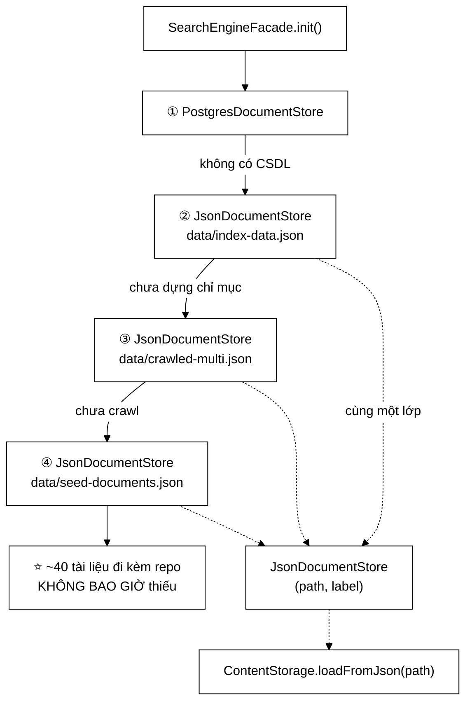

# JsonDocumentStore — 28 dòng mã giữ cho người chấm không bao giờ nhìn thấy màn hình trắng

**File nguồn:** `search-engine/src/main/java/com/vnsearch/storage/JsonDocumentStore.java` (52 dòng)
**Gói:** `com.vnsearch.storage` · **Loại:** `final class implements DocumentStore`, 2 trường bất biến, 3 phương thức, **0 trạng thái thay đổi được**
**Vị trí trong sơ đồ:** ba trong bốn phần tử của **chuỗi dự phòng** mà `SearchEngineFacade.init()` duyệt
**Đọc kèm:** [`DocumentStore.md`](./DocumentStore.md) · [`PostgresDocumentStore.md`](./PostgresDocumentStore.md) · [`../crawler/ContentStorage.md`](../crawler/ContentStorage.md) · [`../service/SearchEngineFacade.md`](../service/SearchEngineFacade.md)

---

## 📌 Hiểu trong 30 giây

Lớp này **không đọc JSON**. Việc đọc do
[`ContentStorage.loadFromJson`](../crawler/ContentStorage.md) làm — `loadAll()`
chỉ có đúng một dòng uỷ thác. Vậy lớp này tồn tại để làm gì?

Nó tồn tại để **một đường dẫn tệp trở thành một phần tử trong danh sách nguồn**.
Đó là toàn bộ giá trị: `Path` không cài `DocumentStore`, nên không xếp chung
danh sách với `PostgresDocumentStore` được. `JsonDocumentStore` là lớp mỏng nhất
có thể để biến một chuỗi đường dẫn thành một đối tượng có cùng kiểu với nguồn
CSDL.

Và vì nó mỏng như vậy, nó **dùng lại được ba lần** với ba đường dẫn khác nhau —
đó là lý do chuỗi dự phòng có bốn tầng mà repo chỉ có hai lớp cài `DocumentStore`.



```
   BA LẦN DÙNG LẠI, MỘT LỚP

   ┌────────────────────────────────────────────────────────────────────┐
   │  new JsonDocumentStore("data/index-data.json",   "Chỉ mục đã lưu") │
   │  new JsonDocumentStore("data/crawled-multi.json","Corpus đã crawl")│
   │  new JsonDocumentStore("data/seed-documents.json","Mẫu đi kèm")    │
   └────────────────────────────────────────────────────────────────────┘

   Ba TẦNG DỰ PHÒNG khác nhau về ngữ nghĩa,
   nhưng GIỐNG HỆT nhau về cơ chế: "có tệp ở đường dẫn này không?"

   ⇒ Nếu ba tầng này được viết thành ba lớp riêng, chúng sẽ là
     ba bản sao của cùng 28 dòng mã.
   ⇒ Tham số hoá bằng (path, label) là cách đúng: cái KHÁC NHAU
     giữa ba tầng là DỮ LIỆU, không phải HÀNH VI.
```

---

## 1. Vì sao có tới hai hàm dựng

```java
public JsonDocumentStore(String path) {
    this(path, "JSON");
}

public JsonDocumentStore(String path, String label) {
    this.path = path;
    this.label = label;
}
```

Dòng 29–36. Bản một tham số uỷ thác cho bản hai tham số bằng `this(...)` — mẫu
**telescoping constructor** ở dạng nhỏ nhất và đúng nhất.

```
   VÌ SAO KHÔNG CHỈ GIỮ MỘT HÀM DỰNG HAI THAM SỐ:

        Trong test, nhãn không quan trọng:
             new JsonDocumentStore(tệpTạm.toString())
        thay vì
             new JsonDocumentStore(tệpTạm.toString(), "gì cũng được")

        ⇒ Bớt một tham số vô nghĩa ở chỗ gọi = bớt nhiễu khi đọc test.

   VÌ SAO KHÔNG SAO CHÉP THÂN HÀM:

        this(path, "JSON")  ← MỘT điểm gán duy nhất

        Nếu sau này thêm trường thứ ba (ví dụ charset), chỉ hàm dựng
        đầy đủ phải sửa. Bản rút gọn tự động đúng theo.
        Sao chép thân hàm thì phải nhớ sửa cả hai — và người ta luôn quên.
```

**Một nhận xét thẳng thắn:** nhãn mặc định `"JSON"` là một giá trị **kém thông
tin**. Toàn bộ điểm mạnh của `describe()` (xem [`DocumentStore.md`](./DocumentStore.md)
mục 2.2) là trả lời câu hỏi *"dữ liệu đến từ đâu?"*. Một dòng log ghi
`JSON @ data/x.json` vẫn cho biết đường dẫn, nên chưa mất thông tin — nhưng nó
mất **ngữ nghĩa tầng**: người đọc log không biết đây là tầng dự phòng thứ mấy.
Trong `SearchEngineFacade` mọi lời gọi đều truyền nhãn tường minh, nên vấn đề này
không bao giờ lộ ra trong sản phẩm; nó chỉ là một cái bẫy chờ sẵn cho người thêm
nguồn thứ năm mà quên truyền nhãn.

---

## 2. `isAvailable()` — ba điều kiện, và vì sao cả ba đều cần

```java
@Override
public boolean isAvailable() {
    return path != null && !path.isBlank() && Files.exists(Path.of(path));
}
```

Dòng 38–41. Một biểu thức, ba toán hạng, và thứ tự của chúng **không hoán đổi
được**.

```
   ┌──────────────────────────────────────────────────────────────────────┐
   │  ①  path != null                                                     │
   │      Nếu bỏ: Path.of(null) ném NullPointerException                  │
   │      Ai truyền null? → cấu hình đọc từ application.properties        │
   │        khi khoá không tồn tại → @Value trả null                      │
   │                                                                      │
   │  ②  !path.isBlank()                                                  │
   │      Nếu bỏ: Path.of("") trả về một Path RỖNG hợp lệ,                │
   │        và Files.exists(Path.of("")) trả TRUE trên nhiều hệ điều      │
   │        hành (nó phân giải thành thư mục làm việc hiện tại!)          │
   │      ⇒ Đây là điều kiện QUAN TRỌNG NHẤT trong ba điều kiện,          │
   │        vì bỏ nó gây LỖI IM LẶNG chứ không phải ngoại lệ ồn ào.       │
   │                                                                      │
   │  ③  Files.exists(...)                                                │
   │      Câu hỏi thật sự của phương thức.                                │
   └──────────────────────────────────────────────────────────────────────┘

   Toán tử && ĐOẢN MẠCH ⇒ ① bảo vệ ②, ② bảo vệ ③.
   Đây không phải "viết cho chắc" — mỗi vế chặn đúng một chế độ hỏng.
```

### 2.1 Ca hỏng mà điều kiện ② chặn, mô phỏng cụ thể

```
   application.properties:
        vnsearch.corpus.crawled=          ← người sửa xoá giá trị, quên xoá khoá

   KHÔNG CÓ điều kiện ②:
        path            = ""
        Path.of("")     = một Path rỗng
        Files.exists()  = true            ← thư mục làm việc tồn tại
        isAvailable()   = true            ← ✗ SAI

        ⇒ Chuỗi dự phòng DỪNG ở tầng này
        ⇒ loadAll() gọi ContentStorage.loadFromJson("")
        ⇒ ném IOException "Is a directory" hoặc NoSuchFileException
        ⇒ SearchEngineFacade ghi WARN rồi lùi tầng tiếp theo

   ⇒ Kết cục vẫn "đúng" nhờ xử lý ngoại lệ ở tầng trên, NHƯNG:
        - có một dòng WARN kèm stack trace gây hoang mang
        - và trên hệ thống mà "" phân giải thành một tệp thật thì
          hành vi không đoán trước được.
```

### 2.2 `Files.exists` trả `false` cho ba lý do khác nhau — và lớp này gộp cả ba

Đây là một điểm yếu thật, cần nói thẳng:

| Tình huống | `Files.exists` | Lẽ ra nên | Thực tế |
|---|---|---|---|
| Tệp không tồn tại | `false` | lùi tầng sau, im lặng | ✔ đúng |
| Tệp tồn tại nhưng **không có quyền đọc** | `false` | **cảnh báo** — đây là lỗi cấu hình | ✗ im lặng lùi |
| Đường dẫn trỏ vào **thư mục** | `true` | coi như không có | ✗ nhận nhầm là có |
| Lỗi I/O khi kiểm tra | `false` | cảnh báo | ✗ im lặng lùi |

```
   Javadoc của java.nio.file.Files.exists nói rõ:

   > ... hoặc không xác định được có tồn tại hay không thì trả về false.

   ⇒ Files.exists KHÔNG phải "tệp không tồn tại".
     Nó là "tôi không xác nhận được là tệp có tồn tại".

   Cách đúng hơn:
        Path p = Path.of(path);
        return Files.isRegularFile(p) && Files.isReadable(p);

   - isRegularFile loại được ca thư mục (bảng trên dòng 3)
   - isReadable loại được ca thiếu quyền TRƯỚC khi loadAll() ném
```

Đây chính là biểu hiện của **TOCTOU** đã nêu ở [`DocumentStore.md`](./DocumentStore.md)
mục 3.1, nhưng ở dạng nhẹ hơn: không phải cửa sổ thời gian, mà là **thông tin bị
mất khi thu về một `boolean`**.

---

## 3. `loadAll()` — một dòng, và vì sao một dòng là đúng

```java
@Override
public List<WebDocument> loadAll() throws IOException {
    return ContentStorage.loadFromJson(path);
}
```

Dòng 43–46.

```
   LỚP NÀY KHÔNG:
        ✗ tự mở InputStream
        ✗ tự gọi ObjectMapper
        ✗ tự kiểm tệp có tồn tại không (hợp đồng đã bảo đảm)
        ✗ tự bắt IOException rồi trả danh sách rỗng

   LỚP NÀY CHỈ:
        ✔ nhớ ĐƯỜNG DẪN
        ✔ trả lời "có sẵn không"
        ✔ uỷ thác việc đọc

   ⇒ ĐÚNG một trách nhiệm: THÍCH ỨNG (adapt) một đường dẫn
     thành một DocumentStore.

   Nếu lớp này tự phân tích JSON, nó sẽ TRÙNG với ContentStorage —
   và hai bản phân tích JSON độc lập là cách chắc chắn nhất để có
   hai định dạng corpus không tương thích sau sáu tháng.
```

### 3.1 `throws IOException` được **truyền thẳng**, không bọc

Đối lập rõ rệt với [`PostgresDocumentStore`](./PostgresDocumentStore.md), nơi
`SQLException` **phải** được bọc thành `IOException`:

```
   JsonDocumentStore:
        ContentStorage.loadFromJson ném IOException
        → chữ ký loadAll() đã là throws IOException
        → KHÔNG cần làm gì, để nó bay lên

   PostgresDocumentStore:
        DocumentRepository ném SQLException
        → SQLException KHÔNG phải con của IOException
        → PHẢI bọc: throw new IOException(..., e)

   ⇒ Interface chọn IOException làm loại lỗi chung là một quyết định
     THIÊN VỊ cho nguồn tệp: nguồn tệp được miễn phí, nguồn CSDL
     phải trả giá bằng một lớp bọc.

   Đây là đánh đổi HỢP LÝ, vì ba trong bốn nguồn là tệp.
   Nhưng cần biết rằng nó là một lựa chọn, không phải tất yếu.
```

Một phương án trung lập hơn là định nghĩa `DocumentStoreException` riêng của gói.
Nó sẽ công bằng với mọi nguồn, nhưng buộc **cả bốn** nguồn phải bọc, và buộc chỗ
gọi học thêm một loại ngoại lệ. Với bốn nguồn thì `IOException` rẻ hơn; với hai
mươi nguồn thuộc nhiều loại hạ tầng thì lựa chọn sẽ đảo chiều.

---

## 4. Tầng dự phòng cuối — `seed-documents.json` và vì sao nó đáng khen

Javadoc dòng 21–22 nói thẳng ra điều mà rất ít đồ án nghĩ tới:

> Tầng dự phòng cuối cùng này là chi tiết đáng khen về trải nghiệm: nhiều đồ án
> bỏ qua nó và người chấm không chạy nổi.

```
   ┌───────────────────────────────────────────────────────────────────────┐
   │  KỊCH BẢN THẬT: người chấm mở repo lúc 23h trước ngày bảo vệ         │
   │                                                                       │
   │    git clone ...                                                      │
   │    cd search-engine                                                   │
   │    ./mvnw spring-boot:run                                             │
   │    → mở http://localhost:8080                                         │
   │    → gõ "máy tính"                                                    │
   │                                                                       │
   │  KHÔNG có tầng seed:                                                  │
   │    - không có Docker → không có PostgreSQL                            │
   │    - data/ trong .gitignore → không có crawled-multi.json             │
   │    - ⇒ 0 kết quả, màn hình trắng                                      │
   │    - ⇒ người chấm kết luận: "chạy không được"                         │
   │    - để chạy được phải: cài Docker, chạy crawler ~8,6 giờ             │
   │                                                                       │
   │  CÓ tầng seed:                                                        │
   │    - ~40 tài liệu nằm SẴN trong repo, kích thước vài chục KB          │
   │    - ⇒ có kết quả, có gợi ý, có phân trang, có PageRank               │
   │    - ⇒ MỌI tính năng biểu diễn được ngay trong 30 giây                │
   └───────────────────────────────────────────────────────────────────────┘
```

### 4.1 Vì sao đúng ~40 tài liệu, không phải 5 và không phải 500

```
   5 tài liệu:
        - PageRank trên 5 đỉnh cho ra đồ thị quá thưa, điểm gần như đều nhau
        - IDF vô nghĩa: gần như term nào cũng xuất hiện trong 1/5 tài liệu
        - phân trang không bao giờ hiện trang thứ hai
        ⇒ nhiều tính năng KHÔNG QUAN SÁT ĐƯỢC

   500 tài liệu:
        - vài MB JSON trong repo git
        - mỗi lần sửa mẫu là một diff khổng lồ
        - clone chậm hơn
        ⇒ trả giá bằng sức khoẻ của repo

   ~40 tài liệu:
        - đủ để đồ thị liên kết có cấu trúc → PageRank phân hoá được
        - đủ để IDF phân biệt term hiếm/phổ biến
        - đủ để top-10 và phân trang có ý nghĩa
        - vài chục KB → git không bận tâm
        ⇒ ĐIỂM CÂN BẰNG ĐÚNG
```

### 4.2 Hệ quả kiến trúc: bộ test không cần hạ tầng

```
   Tầng seed không chỉ phục vụ người chấm. Nó làm cho:

        mvn test        chạy được trên máy trắng
        CI              chạy được không cần service container
        demo            chạy được trên máy không có mạng

   ⇒ Đây là cùng một lợi ích mà Javadoc của DocumentRepository nêu khi
     giải thích vì sao KHÔNG dùng Spring Data JPA:
     "ứng dụng vẫn chạy được bình thường khi không có CSDL".

   Hai quyết định ở hai lớp khác nhau, cùng phục vụ MỘT nguyên tắc:
        HỆ THỐNG PHẢI KHỞI ĐỘNG ĐƯỢC KHI KHÔNG CÓ GÌ CẢ.
```

### 4.3 Một điểm chưa nhất quán trong tài liệu

Javadoc dòng 16 ghi `crawled-multi.json` là *"corpus thật 5.011 trang"*, trong
khi các mốc tham chiếu khác của đồ án nói về **corpus 31.030 trang, 87 MB JSON**
(phiên crawl ~8,6 giờ). Hai con số này thuộc hai phiên crawl khác nhau và Javadoc
chưa được cập nhật.

```
   ⚠ Con số cứng trong Javadoc là NỢ TÀI LIỆU.

     Nó đúng vào ngày viết, sai vào ngày crawl lại,
     và KHÔNG CÓ TEST NÀO phát hiện được.

     Cách chữa: viết "corpus đầy đủ đã crawl" thay vì "5.011 trang",
     và để con số thật nằm ở chỗ nó được SINH RA
     (báo cáo của PostgresImportRunner, docs/GIN-BASELINE.md).
```

Đây không phải lỗi nghiêm trọng, nhưng trong một đồ án tốt nghiệp thì mọi con số
xuất hiện hai lần với hai giá trị khác nhau đều là một câu hỏi chờ sẵn ở buổi bảo
vệ.

---

## 5. `final class` và bất biến

```java
public final class JsonDocumentStore implements DocumentStore {
    private final String path;
    private final String label;
```

```
   MỌI TRƯỜNG final + LỚP final ⇒ BẤT BIẾN HOÀN TOÀN

   Hệ quả thực tế:
        ✔ an toàn luồng miễn phí — chia sẻ giữa các luồng không cần đồng bộ
        ✔ dùng lại được nhiều lần: gọi loadAll() hai lần cho hai kết quả
          độc lập, không có trạng thái nào bị "tiêu thụ"
        ✔ không có phương thức nào có thể bị ghi đè để phá bất biến

   VÌ SAO ĐIỀU NÀY QUAN TRỌNG Ở ĐÂY:
        Danh sách nguồn là một hằng cấu hình được duyệt lúc khởi động.
        Nếu JsonDocumentStore có trạng thái (ví dụ cache corpus đã nạp),
        thì một đối tượng dùng chung giữa hai lần khởi động lại sẽ
        trả về dữ liệu cũ — một lỗi rất khó truy.

   ⇒ KHÔNG CACHE là quyết định đúng, dù nghe có vẻ bỏ lỡ tối ưu.
     Xem mục 7 để biết vì sao cache ở đây sẽ phản tác dụng.
```

`close()` không được ghi đè — lớp dùng bản `default` rỗng của interface. Đúng, vì
`ContentStorage.loadFromJson` tự đóng luồng của nó; `JsonDocumentStore` không giữ
tài nguyên nào giữa các lời gọi.

---

## 6. Hướng dẫn về code

### 6.1 Đọc `isAvailable()` cho đúng

```java
return path != null && !path.isBlank() && Files.exists(Path.of(path));
```

| Nếu viết thành | Hậu quả |
|---|---|
| `Files.exists(Path.of(path))` | `NPE` khi `path == null`; nhận nhầm thư mục làm việc khi `path == ""` |
| `path != null && Files.exists(...)` | Chặn được `NPE`, **vẫn dính** bẫy chuỗi rỗng |
| `!path.isEmpty()` thay `isBlank()` | Chuỗi `"   "` (khoảng trắng từ tệp properties) lọt qua |
| `new File(path).exists()` | Tương đương, nhưng lệch API với phần còn lại của repo (dùng NIO) |
| `Files.isRegularFile(p) && Files.isReadable(p)` | **Tốt hơn bản hiện tại** — xem đề xuất 1 |

### 6.2 Viết một nguồn giả lập trong test

```java
// KHÔNG cần mock, KHÔNG cần Mockito — chỉ cần một tệp tạm
@TempDir Path thuMucTam;

@Test
void nguonJsonDocDuocCorpusThat() throws Exception {
    Path tep = thuMucTam.resolve("mau.json");
    Files.writeString(tep, mauJsonBaTaiLieu());

    var nguon = new JsonDocumentStore(tep.toString(), "test");

    assertTrue(nguon.isAvailable(), "tệp vừa ghi phải được coi là có sẵn");
    assertEquals(3, nguon.loadAll().size(), "phải đọc đủ ba tài liệu");
    assertTrue(nguon.describe().contains("test"), "describe phải chứa nhãn");
}
```

```
   ⇒ Ba dòng assert phủ hết ba phương thức công khai của lớp.
     Lớp mỏng có cái lợi này: TOÀN BỘ hành vi kiểm được trong một bài test.
```

### 6.3 Cạm bẫy khi sửa lớp này

| Ý định | Hậu quả |
|---|---|
| Thêm cache `List<WebDocument>` vào trường | Phá bất biến; giữ 367 MB đối tượng sống suốt vòng đời ứng dụng dù chỉ dùng một lần |
| Cho `isAvailable()` đọc thử tệp để kiểm tính hợp lệ | Đọc tệp 87 MB **hai lần**; và biến một phép kiểm µs thành phép kiểm chục giây |
| Bắt `IOException` trong `loadAll()` rồi trả `List.of()` | Xoá mất phân biệt "không có nguồn" / "nguồn hỏng" — phá đúng thiết kế của interface |
| Bỏ hàm dựng một tham số | Test phải truyền nhãn giả ở mọi chỗ gọi |
| Đổi `String path` thành `Path` | Sạch hơn thật, nhưng `@Value` của Spring bơm `String`; sẽ phải chuyển đổi ở chỗ khác |
| Ghi đè `close()` để xoá tệp tạm | Nhầm vai: lớp này **đọc**, không sở hữu vòng đời tệp |
| Cho hàm dựng ném khi tệp không tồn tại | Phá chuỗi dự phòng: không tạo được đối tượng thì không xếp vào danh sách được |

Dòng cuối bảng đáng nhấn mạnh. **Kiểm tra sớm (fail-fast) là sai ở đây.** Danh
sách nguồn được **dựng toàn bộ** trước khi duyệt; nếu hàm dựng của tầng 4 ném vì
tầng 4 chưa có tệp, thì tầng 1 (đang có dữ liệu) cũng không bao giờ được thử. Chỗ
duy nhất được phép quyết định "có dùng nguồn này không" là `isAvailable()`.

---

## 7. Độ phức tạp & chi phí

| Thao tác | Độ phức tạp | Chi phí thực tế |
|---|---|---|
| Hàm dựng | O(1) | Hai phép gán tham chiếu, ~vài ns |
| `isAvailable()` | O(1) + 1 lần `stat` | ~10–50 µs (đĩa nóng), ~1 ms (đĩa lạnh) |
| `loadAll()` | O(kích thước tệp) | Xem khối dưới |
| `describe()` | O(độ dài chuỗi) | Nối 3 chuỗi, ~100 ns |
| Bộ nhớ của đối tượng | O(1) | 2 tham chiếu + header ≈ 32 byte |

```
   CHI PHÍ loadAll() TRÊN CORPUS THẬT

   ┌──────────────────────────────────────────────────────────────────┐
   │  Tệp     : data/crawled-multi.json      87 MB                    │
   │  Tài liệu: 31.030 trang                                          │
   │  Trong RAM sau khi phân tích: ~367 MB đối tượng                  │
   │            (hệ số phồng ≈ 4,2× so với JSON trên đĩa)             │
   └──────────────────────────────────────────────────────────────────┘

   VÌ SAO PHỒNG 4,2 LẦN:
        - String trong Java: 2 đối tượng (String + byte[]), header 16 byte mỗi cái
        - mỗi WebDocument: ~6 trường String + 1 List<String> outlinks
        - ~40 liên kết/trang × 31.030 trang ≈ 1,24 triệu chuỗi URL riêng lẻ
        - ArrayList mặc định cấp phát dư chỗ

   ⇒ Nạp corpus ĐẦY ĐỦ cần -Xmx4g. Đây là lý do lệnh chạy trong
     docs/GIN-BASELINE.md ghi rõ MAVEN_OPTS=-Xmx4g.

   ⇒ Nạp corpus SEED (~40 tài liệu, vài chục KB) cần vài MB.
     Chạy được trên heap mặc định. ĐÓ LÀ ĐIỂM CỦA TẦNG SEED.
```

```
   VÌ SAO KHÔNG CACHE KẾT QUẢ loadAll()

        loadAll() được gọi ĐÚNG MỘT LẦN trong vòng đời ứng dụng.

        Cache một danh sách 367 MB để phục vụ 0 lời gọi tiếp theo
        = giữ 367 MB sống mãi mà không ai đọc.

        Tệ hơn: sau khi InvertedIndex đã được dựng, danh sách
        WebDocument gốc lẽ ra nên được thu hồi. Cache sẽ CHẶN
        bộ thu gom rác làm việc đó.

   ⇒ "Không tối ưu" ở đây chính là tối ưu.
```

```
   CHI PHÍ CỦA CẢ CHUỖI DỰ PHÒNG KHI KHÔNG CÓ GÌ

        ① PostgresDocumentStore.isAvailable()  ~200–2000 ms (chờ timeout JDBC)
        ② JsonDocumentStore.isAvailable()      ~20 µs
        ③ JsonDocumentStore.isAvailable()      ~20 µs
        ④ JsonDocumentStore.isAvailable()      ~20 µs  → true

        Tổng: gần như TOÀN BỘ thời gian nằm ở tầng ①.

   ⇒ Ba tầng JSON gộp lại rẻ hơn tầng CSDL khoảng 10.000 lần.
     Đặt chúng ở đâu trong danh sách cũng không ảnh hưởng thời gian
     khởi động — thứ tự của chúng thuần tuý là thứ tự ƯU TIÊN DỮ LIỆU.
```

---

## 8. Kiểm thử liên quan

| Bộ test | Kiểm gì |
|---|---|
| [`JsonDocumentStoreTest`](../../../../test/java/com/vnsearch/storage/JsonDocumentStoreTest.md) | Ba phương thức của chính lớp này |
| [`EmptyCorpusFallbackTest`](../../../../test/java/com/vnsearch/service/EmptyCorpusFallbackTest.md) | Hành vi khi mọi tầng đều rỗng |
| [`ContentStorageTest`](../../../../test/java/com/vnsearch/crawler/ContentStorageTest.md) | Việc đọc JSON thật sự (lớp được uỷ thác) |
| [`SearchEngineFacadeApiTest`](../../../../test/java/com/vnsearch/service/SearchEngineFacadeApiTest.md) | Bên tiêu thụ chuỗi dự phòng |

```
   ĐẦU VÀO                                     KẾT QUẢ MONG ĐỢI
   ─────────────────────────────────────────   ──────────────────────────────
   path = null                                 isAvailable() == false
   path = ""                                   isAvailable() == false  ⚠ dễ sai
   path = "   "                                isAvailable() == false
   path trỏ tới tệp có thật                    isAvailable() == true
   path trỏ tới THƯ MỤC                        isAvailable() == false  ⚠ hiện SAI
   path trỏ tới tệp không có quyền đọc         isAvailable() == false
   tệp tồn tại, nội dung JSON hỏng             loadAll() ném IOException
   tệp tồn tại, nội dung "[]"                  loadAll() trả danh sách rỗng
   hàm dựng 1 tham số                          describe() bắt đầu bằng "JSON @"
   hàm dựng 2 tham số                          describe() chứa nhãn đã truyền
   gọi loadAll() hai lần                       hai danh sách độc lập, cùng nội dung
```

Bốn bài test còn thiếu. Bài 1 và 2 bảo vệ đúng hai chế độ hỏng đã phân tích ở mục
2.1 và 2.2:

```java
// 1. Chuỗi rỗng KHÔNG được coi là nguồn có sẵn
@Test
void duongDanRongKhongDuocCoiLaCoSan() {
    assertFalse(new JsonDocumentStore("").isAvailable(),
            "chuỗi rỗng phân giải thành thư mục làm việc — không phải corpus");
    assertFalse(new JsonDocumentStore("   ").isAvailable(),
            "chuỗi toàn khoảng trắng đến từ tệp properties bị bỏ trống");
    assertFalse(new JsonDocumentStore(null).isAvailable(),
            "null đến từ @Value khi khoá cấu hình không tồn tại");
}

// 2. Thư mục KHÔNG phải corpus — bài này HIỆN ĐANG ĐỎ
@Test
void thuMucKhongDuocCoiLaCorpus(@TempDir Path tam) throws Exception {
    Path thuMucCon = Files.createDirectory(tam.resolve("data"));

    assertFalse(new JsonDocumentStore(thuMucCon.toString()).isAvailable(),
            "Files.exists trả true cho thư mục — cần isRegularFile");
}

// 3. Tệp JSON hỏng phải NÉM, không được trả rỗng
@Test
void jsonHongPhaiNemChuKhongTraRong(@TempDir Path tam) throws Exception {
    Path tep = Files.writeString(tam.resolve("hong.json"), "{ khong phai json hop le");

    var nguon = new JsonDocumentStore(tep.toString());

    assertTrue(nguon.isAvailable(), "tệp có thật nên phải báo có sẵn");
    assertThrows(IOException.class, nguon::loadAll,
            "nguồn CÓ nhưng HỎNG là lỗi thật, không được lặng lẽ trả rỗng");
}

// 4. Tầng seed đi kèm repo phải luôn nạp được — bảo vệ trải nghiệm người chấm
@Test
void tangSeedDiKemRepoLuonNapDuoc() throws Exception {
    var seed = new JsonDocumentStore("data/seed-documents.json", "Mẫu đi kèm repo");

    assertTrue(seed.isAvailable(),
            "seed-documents.json PHẢI nằm trong repo, không được vào .gitignore");
    assertTrue(seed.loadAll().size() >= 30,
            "cần đủ tài liệu để PageRank và IDF phân hoá được");
}
```

Bài test số 4 là bài **quan trọng nhất** trong bốn bài, và cũng là bài dễ bị bỏ
quên nhất. Nó không kiểm một thuật toán nào cả — nó kiểm rằng **một tệp không bị
lọt vào `.gitignore`**. Đó đúng là loại hỏng hóc mà không ai phát hiện cho tới
đúng lúc người chấm clone repo.

---

## 9. Liên kết

- Hợp đồng mà lớp này cài đặt: [`DocumentStore.md`](./DocumentStore.md)
- Nguồn còn lại trong chuỗi dự phòng: [`PostgresDocumentStore.md`](./PostgresDocumentStore.md)
- Lớp thực sự đọc JSON: [`../crawler/ContentStorage.md`](../crawler/ContentStorage.md)
- Kiểu dữ liệu được nạp: [`../model/WebDocument.md`](../model/WebDocument.md)
- Nơi chuỗi dự phòng được duyệt: [`../service/SearchEngineFacade.md`](../service/SearchEngineFacade.md)
- Nơi corpus JSON được **nạp vào CSDL**: [`PostgresImportRunner.md`](./PostgresImportRunner.md)
- Đích đến của corpus — chỉ mục đảo: [`../index/InvertedIndex.md`](../index/InvertedIndex.md)
- Đối chứng ngoài bằng chỉ mục GIN: [`GinBaselineRunner.md`](./GinBaselineRunner.md)
- Test của chính lớp này: [`../../../../test/java/com/vnsearch/storage/JsonDocumentStoreTest.md`](../../../../test/java/com/vnsearch/storage/JsonDocumentStoreTest.md)
- Tổng quan kiến trúc: `docs/ARCHITECTURE.md`
