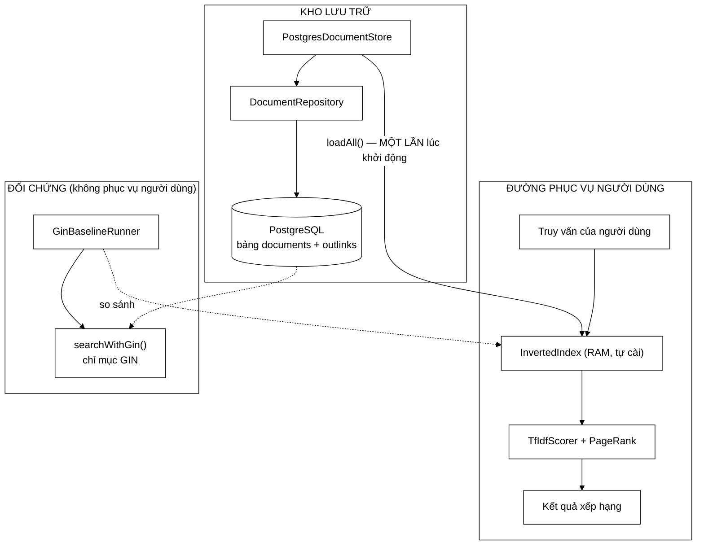

# PostgresDocumentStore — lớp bọc 40 dòng chứng minh rằng CSDL chỉ là kho, không phải máy tìm kiếm

**File nguồn:** `search-engine/src/main/java/com/vnsearch/storage/PostgresDocumentStore.java` (63 dòng)
**Gói:** `com.vnsearch.storage` · **Loại:** `final class implements DocumentStore`, 3 trường bất biến, **không giữ kết nối nào giữa các lời gọi**
**Vị trí trong sơ đồ:** phần tử **đầu tiên** (ưu tiên cao nhất) trong chuỗi dự phòng của `SearchEngineFacade.init()`
**Đọc kèm:** [`DocumentStore.md`](./DocumentStore.md) · [`DocumentRepository.md`](./DocumentRepository.md) · [`JsonDocumentStore.md`](./JsonDocumentStore.md) · [`GinBaselineRunner.md`](./GinBaselineRunner.md)

---

## 📌 Hiểu trong 30 giây

Đây là một **Adapter** theo đúng nghĩa sách giáo khoa: `DocumentRepository` đã
tồn tại, đã làm đúng việc, nhưng **không cài `DocumentStore`** nên không xếp chung
danh sách nguồn với `JsonDocumentStore` được. Lớp này bọc nó lại, và không sửa
một dòng nào của lớp bị bọc.

Nhưng giá trị tài liệu lớn nhất của lớp này nằm ở Javadoc dòng 14–17, một câu
nói thẳng điều mà người chấm chắc chắn sẽ hỏi:

> CSDL chỉ đóng vai trò **KHO LƯU TRỮ**: việc tìm kiếm vẫn do chỉ mục đảo tự cài
> đảm nhiệm. (Chỉ mục GIN của PostgreSQL được dùng riêng làm *đối chứng bên
> ngoài*, không phải đường phục vụ người dùng.)

Không có câu này, việc dự án có một CSDL PostgreSQL sẽ đặt ra một nghi ngờ chí
mạng: *"vậy máy tìm kiếm này thực chất chỉ là `SELECT ... WHERE tsv @@ ...` phải
không?"* Câu Javadoc đó, cộng với [`GinBaselineRunner`](./GinBaselineRunner.md),
là bằng chứng ngược lại.



```
   BA ĐƯỜNG ĐI, ĐỪNG LẪN LỘN

   ┌──────────────────────────────────────────────────────────────────────┐
   │ ① KHỞI ĐỘNG   PostgreSQL ──loadAll()──> RAM ──> dựng InvertedIndex  │
   │               chạy MỘT LẦN, CSDL là KHO                             │
   ├──────────────────────────────────────────────────────────────────────┤
   │ ② TRUY VẤN    người dùng ──> InvertedIndex (RAM) ──> kết quả        │
   │               KHÔNG CHẠM tới PostgreSQL, dù chỉ một lần             │
   ├──────────────────────────────────────────────────────────────────────┤
   │ ③ ĐỐI CHỨNG   GinBaselineRunner ──> searchWithGin() ──> so sánh     │
   │               chạy TAY khi làm thí nghiệm, không nằm trong web app  │
   └──────────────────────────────────────────────────────────────────────┘

   Lớp này chỉ tham gia đường ①.
   Đường ② hoàn toàn không có PostgreSQL trong đó.
```

---

## 1. Vì sao phải bọc thay vì sửa `DocumentRepository`

`DocumentRepository` hoàn toàn có thể được sửa để `implements DocumentStore` —
nó đã có `findAll()` và `close()`, chỉ thiếu `isAvailable()` và `describe()`. Vậy
vì sao lại tốn thêm một lớp?

```
   NẾU SỬA TRỰC TIẾP DocumentRepository:

        DocumentRepository implements DocumentStore
             ├── findAll()          → phải đổi tên thành loadAll()
             ├── saveAll()          → KHÔNG thuộc hợp đồng DocumentStore
             ├── deleteAll()        → KHÔNG thuộc
             ├── searchWithGin()    → KHÔNG thuộc, và là ĐỐI CHỨNG
             ├── indexSizeBytes()   → KHÔNG thuộc, là đo đạc
             └── now()              → KHÔNG thuộc

        ⇒ Một lớp cài DocumentStore nhưng mang theo 6 phương thức
          không liên quan gì tới việc "nạp corpus".
        ⇒ Và PostgresImportRunner / GinBaselineRunner — hai chỗ dùng
          DocumentRepository — bỗng phụ thuộc vào com.vnsearch.storage
          .DocumentStore mà chúng không cần.
```

```
   BỌC LẠI:

        PostgresDocumentStore  →  chỉ lộ ra 3 phương thức của hợp đồng
        DocumentRepository     →  giữ nguyên toàn bộ API rộng của nó

   ⇒ Mỗi bên có ĐÚNG bề mặt mà người dùng của nó cần:
        - SearchEngineFacade thấy 3 phương thức
        - PostgresImportRunner thấy saveAll/deleteAll/count...
        - GinBaselineRunner thấy searchWithGin/indexSizeBytes...

   ⇒ Đây là Interface Segregation Principle được áp dụng bằng cách
     THÊM MỘT LỚP thay vì THÊM MỘT INTERFACE.
```

Một hệ quả kín đáo nhưng quan trọng: `DocumentRepository` **không biết**
`DocumentStore` tồn tại. Chiều phụ thuộc chỉ đi một hướng, nên có thể xoá toàn bộ
tầng `DocumentStore` mà `DocumentRepository` vẫn biên dịch được.

---

## 2. `isAvailable()` — vì sao trả `false` thay vì ném

```java
@Override
public boolean isAvailable() {
    try (DocumentRepository repo = new DocumentRepository(jdbcUrl, user, password)) {
        return repo.countDocuments() > 0;
    } catch (Exception e) {
        log.info("PostgreSQL khong san sang ({}), se dung nguon du phong", e.getMessage());
        return false;
    }
}
```

Dòng 38–46. Javadoc dòng 19–22 giải thích chính xác lý do:

> `isAvailable()` trả về `false` thay vì ném ngoại lệ khi không kết nối được, để
> chuỗi dự phòng tự động lùi về nguồn JSON — ứng dụng vẫn khởi động bình thường
> khi không có CSDL, điều quan trọng cho test và cho demo nhanh.

```
   ┌──────────────────────────────────────────────────────────────────────┐
   │  NẾU isAvailable() NÉM:                                              │
   │                                                                      │
   │    for (DocumentStore s : nguon) {                                   │
   │        if (!s.isAvailable()) continue;   ← NÉM Ở ĐÂY                 │
   │        ...                                                           │
   │    }                                                                 │
   │                                                                      │
   │    → vòng lặp vỡ ngay ở phần tử ĐẦU TIÊN                            │
   │    → ba tầng JSON phía sau KHÔNG BAO GIỜ được thử                   │
   │    → ứng dụng không khởi động được trên máy không có Docker          │
   │    → mvn test đỏ toàn bộ trên CI không có service container          │
   │                                                                      │
   │  ⇒ MỘT nguồn không có sẽ chặn MỌI nguồn còn lại.                    │
   │    Đó là phá đúng thứ mà chuỗi dự phòng sinh ra để làm.              │
   └──────────────────────────────────────────────────────────────────────┘
```

Đây chính là dòng *"Cho `isAvailable()` ném → phá vòng lặp dự phòng"* trong bảng
cạm bẫy của [`DocumentStore.md`](./DocumentStore.md) mục 3.3, nhìn từ phía bản
cài đặt.

### 2.1 `catch (Exception e)` — bắt rộng, và ở đây là **đúng**

Bắt `Exception` trần thường là mùi mã xấu. Ở đây thì không, vì hai lý do:

```
   LÝ DO 1 — Phương thức trả về boolean, không có "lỗi" nào để phân loại.

        Hợp đồng chỉ có hai câu trả lời: có sẵn / không có sẵn.
        Mọi thứ hỏng đều quy về "không có sẵn".
        Phân biệt SQLException với ClassNotFoundException ở đây
        KHÔNG dẫn tới hành động khác nhau.

   LÝ DO 2 — Danh sách ngoại lệ thật sự rất rộng:

        SQLException                 — CSDL từ chối, sai mật khẩu, timeout
        SQLTransientConnectionException — mạng chập chờn
        ClassNotFoundException       — thiếu driver JDBC trên classpath
        SecurityException            — chính sách bảo mật chặn kết nối mạng
        NoClassDefFoundError         — (Error, KHÔNG bị bắt ở đây)

   ⇒ Liệt kê từng loại sẽ dài và VẪN BỎ SÓT.
```

Cần lưu ý: `catch (Exception)` **không** bắt `Error`. Một `OutOfMemoryError` hay
`NoClassDefFoundError` vẫn bay lên và làm ứng dụng không khởi động — đúng như nên
thế, vì đó là những hỏng hóc không thể "lùi tầng" để chữa được.

### 2.2 `countDocuments() > 0` — nhiều hơn một phép kiểm kết nối

Điểm tinh tế: phương thức không dừng ở "kết nối được". Nó hỏi *"có dữ liệu
không"*.

```
   BA TRẠNG THÁI CỦA CSDL

   ┌───────────────────────────────┬──────────────┬────────────────────────┐
   │ Trạng thái                    │ isAvailable  │ Đúng chưa?             │
   ├───────────────────────────────┼──────────────┼────────────────────────┤
   │ không có CSDL / không kết nối │ false        │ ✔ lùi tầng JSON        │
   │ CSDL có, bảng RỖNG            │ false        │ ✔ lùi tầng JSON        │
   │ CSDL có, có N > 0 tài liệu    │ true         │ ✔ dùng CSDL            │
   └───────────────────────────────┴──────────────┴────────────────────────┘

   VÌ SAO "BẢNG RỖNG ⇒ false" LÀ QUYẾT ĐỊNH ĐÚNG:

        Kịch bản rất thật: người dùng chạy `docker compose up -d`
        (CSDL lên, schema được tạo, bảng rỗng) nhưng CHƯA chạy
        PostgresImportRunner.

        Nếu isAvailable() chỉ kiểm kết nối:
             → true
             → loadAll() trả danh sách RỖNG
             → chỉ mục dựng trên 0 tài liệu
             → mọi truy vấn trả 0 kết quả
             → và ba tầng JSON có sẵn dữ liệu KHÔNG BAO GIỜ được dùng

        ⇒ Người dùng "làm đúng hơn" (có dựng Docker) lại nhận kết
          quả TỆ HƠN người không dựng gì. Nghịch lý này chính là
          thứ countDocuments() > 0 loại bỏ.
```

Đây cùng một nguyên tắc *"phân biệt rỗng với không có"* mà
[`DocumentStore.md`](./DocumentStore.md) mục 2.1 nêu, nhưng áp ngược chiều: ở
tầng này, **rỗng được cố ý quy về không có**, vì rỗng không phải một corpus dùng
được.

### 2.3 Cái giá: hai kết nối cho một lần khởi động

Đây là điểm yếu thật của lớp, và cần nói thẳng:

```
   SearchEngineFacade.init() thực hiện:

        store.isAvailable()   →  mở kết nối #1, SELECT count(*), ĐÓNG
        store.loadAll()       →  mở kết nối #2, SELECT ..., ĐÓNG

   ⇒ HAI lần bắt tay TCP + xác thực + thương lượng giao thức JDBC.

   Chi phí thực tế (localhost):
        mở kết nối JDBC        ~50–200 ms
        SELECT count(*) trên 31.030 dòng   ~5–20 ms
        ────────────────────────────────────────────
        isAvailable() tổng     ~60–220 ms
        loadAll() tổng         ~60 ms + thời gian đọc corpus

   Chi phí khi KHÔNG có CSDL:
        DriverManager.getConnection chờ TIMEOUT
        mặc định của driver PostgreSQL: KHÔNG GIỚI HẠN cho socket connect
        thực tế phụ thuộc hệ điều hành: ~2 giây (connection refused)
                                        ~75 giây (host không phản hồi!)

   ⚠ ĐÂY LÀ VẤN ĐỀ THẬT: nếu jdbcUrl trỏ tới một host không tồn tại
     (chứ không phải localhost bị từ chối), khởi động ứng dụng có thể
     TREO hàng chục giây trước khi lùi về tầng JSON.
     Xem đề xuất 2.
```

Đổi lại, lớp có một ưu điểm đắt giá: **không giữ kết nối nào giữa các lời gọi**.
Hệ quả trực tiếp là `close()` không cần ghi đè — bản `default` rỗng của interface
là đúng, và **không thể rò rỉ kết nối** dù chỗ gọi quên `try-with-resources`.

```
   ĐÁNH ĐỔI RÕ RÀNG:

        Giữ kết nối trong trường     →  nhanh hơn, nhưng PHẢI close()
                                        và ai quên close() thì rò rỉ
        Mở/đóng mỗi lời gọi          →  chậm hơn ~100 ms MỘT LẦN
                                        lúc khởi động, KHÔNG THỂ rò rỉ

   Với một phương thức được gọi ĐÚNG MỘT LẦN trong vòng đời ứng dụng,
   100 ms là cái giá gần như bằng 0 để mua lấy sự an toàn tuyệt đối.

   ⇒ LỰA CHỌN ĐÚNG. Nhưng đúng vì HOÀN CẢNH, không phải vì nguyên tắc.
     Nếu isAvailable() được gọi trong một health check mỗi 10 giây,
     lựa chọn này lập tức sai.
```

---

## 3. `loadAll()` — vì sao bọc `SQLException` thành `IOException`

```java
@Override
public List<WebDocument> loadAll() throws IOException {
    try (DocumentRepository repo = new DocumentRepository(jdbcUrl, user, password)) {
        return repo.findAll();
    } catch (Exception e) {
        // Bọc SQLException thành IOException để người gọi chỉ phải xử lý
        // MỘT loại lỗi cho mọi nguồn dữ liệu (Strategy đồng nhất).
        throw new IOException("Khong nap duoc corpus tu PostgreSQL: " + e.getMessage(), e);
    }
}
```

Dòng 48–57.

```
   VẤN ĐỀ CỦA CHỮ KÝ:

        interface DocumentStore {
            List<WebDocument> loadAll() throws IOException;
        }

        SQLException KHÔNG phải con của IOException.
        (SQLException extends Exception, không qua IOException)

   ⇒ Bản cài BẮT BUỘC phải bọc. Không có lựa chọn nào khác
     ngoài việc đổi chữ ký của interface.
```

### 3.1 Vì sao lựa chọn này đúng, dù nghe như "gò cho vừa khuôn"

```
   ┌──────────────────────────────────────────────────────────────────────┐
   │  Ở CHỖ GỌI (SearchEngineFacade.init()):                              │
   │                                                                      │
   │    NẾU KHÔNG BỌC — chữ ký phải là throws Exception:                  │
   │        try { store.loadAll(); }                                      │
   │        catch (Exception e) { ... }   ← bắt cả RuntimeException,      │
   │                                        cả NullPointerException,      │
   │                                        cả lỗi lập trình              │
   │        ⇒ nuốt mất lỗi logic, biến bug thành "lùi tầng im lặng"      │
   │                                                                      │
   │    CÓ BỌC:                                                           │
   │        catch (IOException e) { ... } ← bắt ĐÚNG lỗi hạ tầng          │
   │        ⇒ NullPointerException vẫn bay lên và làm ứng dụng chết       │
   │          — đúng như nên thế với một lỗi lập trình                    │
   └──────────────────────────────────────────────────────────────────────┘
```

Đây là lý do quan trọng nhất và bình luận trong mã chưa nêu ra: bọc không chỉ để
"đồng nhất", mà để **giữ cho `catch` ở chỗ gọi đủ hẹp**.

### 3.2 Nguyên nhân gốc được giữ nguyên — chi tiết dễ làm sai

```java
throw new IOException("Khong nap duoc corpus tu PostgreSQL: " + e.getMessage(), e);
//                                                                             ↑
//                                                        THAM SỐ NÀY QUYẾT ĐỊNH TẤT CẢ
```

```
   NẾU VIẾT THIẾU tham số cause:

        throw new IOException("Khong nap duoc corpus: " + e.getMessage());

        → stack trace chỉ tới ĐÚNG DÒNG NÀY
        → không biết SQL nào hỏng, không biết lỗi ở findAll hay ở
          getConnection, không có mã lỗi SQLState
        → chẩn đoán từ "xem stack trace là biết" thành "đoán mò"

   CÓ tham số cause:

        java.io.IOException: Khong nap duoc corpus tu PostgreSQL: ...
            at PostgresDocumentStore.loadAll(PostgresDocumentStore.java:55)
            ...
        Caused by: org.postgresql.util.PSQLException: ERROR: relation
                   "documents" does not exist
            at DocumentRepository.findAll(DocumentRepository.java:149)
            ...

        ⇒ "Caused by" cho biết CHÍNH XÁC schema chưa được tạo.
```

Việc **đồng thời** ghép `e.getMessage()` vào thông điệp là hơi thừa (nó sẽ xuất
hiện lại ở dòng `Caused by`), nhưng có ích thật: nhiều hệ thống ghi log chỉ in
dòng thông điệp đầu tiên mà cắt mất phần `Caused by`. Trong trường hợp đó, ghép
sẵn nguyên nhân vào thông điệp là khác biệt giữa một dòng log dùng được và một
dòng log vô nghĩa.

### 3.3 Ba lỗi rất khác nhau cùng ra một `IOException`

Đây là một điểm yếu cần ghi nhận:

| Nguyên nhân thật | Hành động đúng của người vận hành |
|---|---|
| CSDL biến mất giữa `isAvailable()` và `loadAll()` | Kiểm tra Docker, khởi động lại |
| Bảng `documents` không tồn tại (chưa chạy migration) | Chạy `PostgresImportRunner` |
| Hết bộ nhớ khi dựng danh sách 31.030 tài liệu | Tăng `-Xmx` |

```
   Cả ba đều thành: IOException("Khong nap duoc corpus tu PostgreSQL: ...")

   ⇒ Chỗ gọi KHÔNG phân biệt được, nên ghi WARN rồi lùi tầng JSON
     cho cả ba ca.
   ⇒ Ca số 3 đặc biệt khó chịu: hệ thống lặng lẽ chạy bằng 40 tài liệu
     seed trong khi nguyên nhân thật chỉ là thiếu tham số -Xmx.

   Chữa được không? Có, nhưng cần đọc SQLState (xem đề xuất 4).
   Chữa có đáng không? Ở tầm đồ án thì việc ghi WARN kèm nguyên nhân
   gốc đã đủ — miễn là ai đó ĐỌC log.
```

---

## 4. `describe()` và một vấn đề bảo mật kín đáo

```java
@Override
public String describe() {
    return "PostgreSQL @ " + jdbcUrl;
}
```

Dòng 59–62. Lớp **cố ý không** đưa `user` và `password` vào chuỗi mô tả — đúng.
Nhưng an toàn đó chỉ đúng một nửa:

```
   ⚠ jdbcUrl CÓ THỂ CHỨA MẬT KHẨU.

     JDBC của PostgreSQL cho phép:
        jdbc:postgresql://localhost:5432/vnsearch?user=admin&password=bimat

     Cấu hình mặc định trong repo KHÔNG dùng dạng này
     (DocumentRepository.DEFAULT_URL sạch, mật khẩu truyền riêng),
     nên hiện tại KHÔNG rò rỉ.

     Nhưng describe() được GHI VÀO LOG ở SearchEngineFacade.
     Nếu ai đó triển khai bằng một URL có tham số password —
     một cách cấu hình hoàn toàn hợp lệ và khá phổ biến —
     thì mật khẩu sản phẩm sẽ nằm trong log, có thể là log
     tập trung, có thể được nhiều người đọc.

   ⇒ Đây KHÔNG phải lỗi hiện tại, mà là một CÁI BẪY ĐANG CHỜ.
     Chi phí phòng: một hàm che tham số nhạy cảm, ~5 dòng.
     Xem đề xuất 3.
```

Một điểm nhỏ khác: `describe()` không cho biết **có bao nhiêu tài liệu** trong
CSDL, dù `isAvailable()` vừa đếm xong. Con số đó bị vứt đi. Với một dòng log kiểu
`PostgreSQL @ jdbc:... (31.030 tài liệu)`, người vận hành biết ngay corpus đang
dùng là bản đầy đủ hay bản thử nghiệm — thông tin có giá trị chẩn đoán rất cao
với chi phí gần bằng 0.

---

## 5. Ba trường `String` và câu hỏi về cấu hình

```java
private final String jdbcUrl;
private final String user;
private final String password;
```

```
   ƯU ĐIỂM:
        ✔ không phụ thuộc Spring — lớp này dựng được bằng `new` trong test
        ✔ bất biến hoàn toàn, an toàn luồng
        ✔ không có DataSource, không có pool → không có gì để rò rỉ

   NHƯỢC ĐIỂM:
        ✗ mật khẩu nằm trong một String, sống trong heap suốt vòng đời
          đối tượng, và String KHÔNG XOÁ ĐƯỢC (bất biến)
          → xuất hiện trong heap dump, trong core dump
          → khuyến nghị cổ điển là dùng char[] và xoá sau khi dùng

        ✗ ba tham số String liền nhau CÙNG KIỂU
          → new PostgresDocumentStore(url, password, user) biên dịch
            được và chỉ hỏng lúc chạy
          → đây là lỗi kinh điển mà kiểu dữ liệu lẽ ra phải chặn được
```

Cả hai nhược điểm đều thuộc loại "đúng về lý thuyết, hiếm gây hại ở tầm đồ án".
Với mật khẩu mặc định là `vnsearch` trong một CSDL chạy trên `localhost` bằng
Docker, mức độ rủi ro thực tế bằng 0. Nhưng khi báo cáo tốt nghiệp có một mục về
bảo mật, việc **nêu ra và giải thích vì sao chấp nhận được** có giá trị hơn hẳn
việc im lặng.

---

## 6. Hướng dẫn về code

### 6.1 Vì sao `try (DocumentRepository repo = ...)` bắt buộc phải là try-with-resources

```java
try (DocumentRepository repo = new DocumentRepository(jdbcUrl, user, password)) {
    return repo.countDocuments() > 0;
}
```

```
   NẾU VIẾT THÀNH:

        DocumentRepository repo = new DocumentRepository(...);
        boolean co = repo.countDocuments() > 0;
        repo.close();
        return co;

   → countDocuments() ném ⇒ close() KHÔNG BAO GIỜ chạy
   → kết nối JDBC bị bỏ rơi, phía server giữ một backend process
   → mỗi lần khởi động thất bại rò một kết nối
   → PostgreSQL mặc định max_connections = 100
   → sau 100 lần khởi động lỗi: "too many clients already"
     và KHÔNG AI kết nối được nữa, kể cả psql của quản trị viên

   ⇒ Triệu chứng xuất hiện HÀNG GIỜ sau nguyên nhân, ở một tiến trình
     KHÁC. Đây là loại lỗi tốn nhiều ngày công nhất để truy.
```

Điểm đáng khen của cách viết hiện tại: `return` nằm **bên trong** khối `try`, nên
`close()` vẫn chạy trước khi giá trị được trả về. Java bảo đảm điều này (giá trị
trả về được tính trước, tài nguyên đóng sau, rồi mới thoát).

### 6.2 Cạm bẫy khi sửa lớp này

| Ý định | Hậu quả |
|---|---|
| Giữ `DocumentRepository` trong một trường để tránh mở kết nối hai lần | Phải ghi đè `close()`; và ai quên `try-with-resources` thì rò rỉ kết nối vĩnh viễn |
| Cho `isAvailable()` ném thay vì trả `false` | Phá toàn bộ chuỗi dự phòng — ứng dụng không khởi động được khi không có Docker |
| Đổi `countDocuments() > 0` thành `>= 0` | CSDL rỗng chiếm quyền, hệ thống chạy với 0 tài liệu trong khi JSON có sẵn dữ liệu |
| Bỏ `catch` trong `loadAll()`, đổi chữ ký thành `throws Exception` | Chỗ gọi phải bắt `Exception` trần, nuốt luôn cả lỗi lập trình |
| Bỏ tham số `e` trong `new IOException(msg, e)` | Mất `Caused by` — chẩn đoán từ 10 giây thành nửa giờ |
| Thêm `password` vào `describe()` | Mật khẩu vào log |
| Bắt `Throwable` thay vì `Exception` | Nuốt `OutOfMemoryError`, hệ thống chạy tiếp trong trạng thái hỏng |
| Dùng `log.warn` thay `log.info` ở `isAvailable()` | Sai mức: "không có CSDL" là **tình huống bình thường** trong đồ án này |

Dòng cuối đáng bàn thêm. Mức `info` được chọn đúng: với một hệ thống mà chạy
không có CSDL là kịch bản **được thiết kế để hỗ trợ**, ghi `warn` sẽ tạo cảnh báo
giả ở mọi lần chạy test — và cảnh báo giả lặp lại là cách nhanh nhất để người ta
ngừng đọc cảnh báo thật.

---

## 7. Độ phức tạp & chi phí

| Thao tác | Độ phức tạp | Chi phí thực tế (localhost, Docker) |
|---|---|---|
| Hàm dựng | O(1) | ~vài ns, **không** mở kết nối |
| `isAvailable()` — có CSDL | O(1) truy vấn | ~60–220 ms (mở kết nối chi phối) |
| `isAvailable()` — không có CSDL | — | ~2 s (từ chối) đến ~75 s (host chết) |
| `loadAll()` | O(D + L) | Xem khối dưới |
| `describe()` | O(1) | Nối chuỗi |

```
   CHI PHÍ loadAll() TRÊN CORPUS THẬT

   ┌─────────────────────────────────────────────────────────────────────┐
   │  D = 31.030 tài liệu                                                │
   │  L ≈ 40 liên kết/trang × 31.030 ≈ 1.241.200 liên kết                │
   │                                                                     │
   │  DocumentRepository.findAll() thực hiện ĐÚNG HAI truy vấn:          │
   │      ① SELECT ... FROM documents ORDER BY doc_id      → D dòng      │
   │      ② SELECT ... FROM outlinks ORDER BY from_doc_id  → L dòng      │
   │                                                                     │
   │  Không phải D+1 truy vấn (tránh N+1) — xem DocumentRepository.md    │
   └─────────────────────────────────────────────────────────────────────┘

   Ước lượng thời gian:
        mở kết nối                    ~100 ms
        truy vấn ①, truyền ~87 MB     ~8–20 s
        truy vấn ②, 1,24 triệu dòng   ~5–15 s
        dựng 1,24 triệu String URL    ~3–8 s
        ─────────────────────────────────────
        tổng                          ~20–45 s

   So với JsonDocumentStore trên cùng corpus: ~15–30 s.

   ⇒ CSDL KHÔNG nhanh hơn JSON cho việc nạp toàn bộ.
     Nó được ưu tiên vì lý do KHÁC: dữ liệu có cấu trúc, truy vấn
     phụ trợ được, và là nền cho phép đối chứng GIN.
```

```
   ĐIỀU NÀY DẪN TỚI MỘT KẾT LUẬN THÀNH THẬT:

        Với riêng bài toán "nạp corpus rồi dựng chỉ mục trong RAM",
        PostgreSQL KHÔNG mang lại lợi ích hiệu năng nào.

        Giá trị thật của nó trong đồ án là:
          ① làm KHO có cấu trúc, truy vấn thống kê được
          ② làm nền cho ĐỐI CHỨNG GIN — thứ nâng đồ án từ
            "tôi cài được chỉ mục đảo" lên "tôi đo chỉ mục của tôi
            với một hệ thống công nghiệp"

   ⇒ Và ② mới là lý do đáng giá. Xem GinBaselineRunner.md.
```

---

## 8. Kiểm thử liên quan

| Bộ test | Kiểm gì |
|---|---|
| [`PostgresDocumentStoreTest`](../../../../test/java/com/vnsearch/storage/PostgresDocumentStoreTest.md) | Ba phương thức của chính lớp này |
| [`DocumentRepositoryTest`](../../../../test/java/com/vnsearch/storage/DocumentRepositoryTest.md) | Lớp bị bọc |
| [`EmptyCorpusFallbackTest`](../../../../test/java/com/vnsearch/service/EmptyCorpusFallbackTest.md) | Chuỗi dự phòng khi mọi tầng rỗng |
| [`SearchEngineFacadeApiTest`](../../../../test/java/com/vnsearch/service/SearchEngineFacadeApiTest.md) | Bên tiêu thụ |

```
   ĐẦU VÀO                                      KẾT QUẢ MONG ĐỢI
   ──────────────────────────────────────────   ─────────────────────────────
   không có CSDL ở jdbcUrl                      isAvailable() == false
                                                KHÔNG ném, ghi log mức INFO
   CSDL có, bảng documents rỗng                 isAvailable() == false
   CSDL có, N > 0 tài liệu                      isAvailable() == true
   sai mật khẩu                                 isAvailable() == false
   jdbcUrl sai cú pháp                          isAvailable() == false
   CSDL biến mất trước loadAll()                loadAll() ném IOException
   IOException từ loadAll()                     getCause() là SQLException
   gọi isAvailable() 10 lần liên tiếp           không rò rỉ kết nối nào
   describe()                                   chứa jdbcUrl, KHÔNG chứa mật khẩu
```

Ba bài test còn thiếu:

```java
// 1. Không có CSDL PHẢI trả false, KHÔNG được ném — bảo vệ chuỗi dự phòng
@Test
void khongCoCsdlThiTraFalseChuKhongNem() {
    var nguon = new PostgresDocumentStore(
            "jdbc:postgresql://localhost:1/khong_ton_tai", "u", "p");

    assertDoesNotThrow(() -> nguon.isAvailable(),
            "isAvailable() ném sẽ chặn mọi nguồn dự phòng phía sau");
    assertFalse(nguon.isAvailable(),
            "không kết nối được phải quy về 'không có sẵn'");
}

// 2. IOException phải GIỮ nguyên nhân gốc, nếu không thì không chẩn đoán được
@Test
void ngoaiLeBocPhaiGiuNguyenNhanGoc() {
    var nguon = new PostgresDocumentStore(
            "jdbc:postgresql://localhost:1/khong_ton_tai", "u", "p");

    IOException loi = assertThrows(IOException.class, nguon::loadAll);

    assertNotNull(loi.getCause(),
            "thiếu cause thì stack trace chỉ tới đúng dòng throw, vô dụng");
    assertTrue(loi.getMessage().contains("PostgreSQL"),
            "thông điệp phải nói rõ nguồn nào hỏng");
}

// 3. Mật khẩu KHÔNG được xuất hiện trong describe()
@Test
void moTaKhongDuocLoMatKhau() {
    var nguon = new PostgresDocumentStore(
            "jdbc:postgresql://localhost:5432/vnsearch", "vnsearch", "matkhau_bi_mat");

    assertFalse(nguon.describe().contains("matkhau_bi_mat"),
            "describe() được ghi vào log — không được chứa thông tin xác thực");
}
```

Bài 1 nên chạy được **mà không cần CSDL nào** — đó chính là điểm của nó. Bài 3
hiện đang xanh nhưng sẽ đỏ ngay khi ai đó chuyển sang truyền mật khẩu qua tham số
URL, nên nó là một bài test **canh gác** đúng nghĩa.

---

## 9. Liên kết

- Hợp đồng mà lớp này cài đặt: [`DocumentStore.md`](./DocumentStore.md)
- Lớp được bọc bên dưới: [`DocumentRepository.md`](./DocumentRepository.md)
- Nguồn dự phòng phía sau: [`JsonDocumentStore.md`](./JsonDocumentStore.md)
- Công cụ nạp corpus vào CSDL: [`PostgresImportRunner.md`](./PostgresImportRunner.md)
- Đối chứng ngoài dùng chỉ mục GIN: [`GinBaselineRunner.md`](./GinBaselineRunner.md)
- Nơi chuỗi dự phòng được duyệt: [`../service/SearchEngineFacade.md`](../service/SearchEngineFacade.md)
- Nơi corpus thật sự được dùng: [`../index/InvertedIndex.md`](../index/InvertedIndex.md)
- Đồ thị liên kết được tính điểm ở: [`../ranking/PageRankService.md`](../ranking/PageRankService.md)
- Test của chính lớp này: [`../../../../test/java/com/vnsearch/storage/PostgresDocumentStoreTest.md`](../../../../test/java/com/vnsearch/storage/PostgresDocumentStoreTest.md)
- Tổng quan kiến trúc: `docs/ARCHITECTURE.md`
