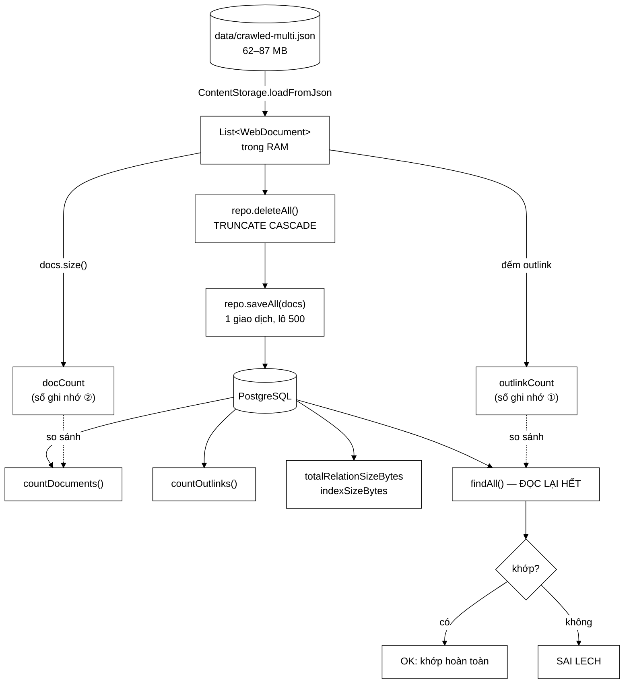

# PostgresImportRunner — 69 dòng, và bài học rằng "ghi xong" chưa phải là "ghi đúng"

**File nguồn:** `search-engine/src/main/java/com/vnsearch/storage/PostgresImportRunner.java` (69 dòng)
**Gói:** `com.vnsearch.storage` · **Loại:** lớp chỉ có `main`, chạy **tay**, không phải thành phần Spring
**Vị trí trong sơ đồ:** cây cầu **một chiều** đưa dữ liệu từ file JSON của trình thu thập sang PostgreSQL
**Đọc kèm:** [`DocumentRepository.md`](./DocumentRepository.md) · [`PostgresDocumentStore.md`](./PostgresDocumentStore.md) · [`GinBaselineRunner.md`](./GinBaselineRunner.md)

---

## 📌 Hiểu trong 30 giây

Lớp này chạy **một lần** sau khi crawl xong, và nó là mắt xích duy nhất nối hai
thế giới của dự án: thế giới file JSON của trình thu thập, và thế giới CSDL của
tầng lưu trữ.

Điểm đáng học không nằm ở việc nó gọi `deleteAll()` rồi `saveAll()` — mười dòng
ai cũng viết được. Điểm đáng học nằm ở **26 dòng cuối**: sau khi ghi xong, nó
**đọc lại toàn bộ** và so từng con số.

```
   MỘT SCRIPT NẠP DỮ LIỆU BÌNH THƯỜNG DỪNG Ở ĐÂY:
        repo.deleteAll();
        repo.saveAll(docs);
        System.out.println("Xong!");        ← và tin là xong

   SCRIPT NÀY ĐI TIẾP:
        savedDocs   = repo.countDocuments();      ← CSDL nói nó có bao nhiêu
        reloaded    = repo.findAll();             ← đọc lại HẾT
        so sánh reloaded.size() với docs.size()
        so sánh reloadedLinks với outlinkCount    ← và cả số cạnh

   ⇒ Khác biệt giữa "lệnh không ném ngoại lệ" và "dữ liệu đọc lại
     khớp với dữ liệu ghi vào". Hai điều đó KHÔNG giống nhau.
```

Vì sao khác biệt đó quan trọng đến vậy ở đúng dự án này? Vì corpus trong
PostgreSQL sẽ được dùng để **dựng lại chỉ mục đảo trong RAM**. Nếu nó thiếu
2.000 tài liệu, hệ thống vẫn khởi động, vẫn tìm kiếm, vẫn trả kết quả — chỉ là
IDF sai, PageRank thiếu cạnh, và 2.000 trang biến mất không dấu vết.



```
   BỐN GIAI ĐOẠN, ĐỌC TỪ TRÊN XUỐNG

   ┌────────────────────────────────────────────────────────────────────────┐
   │ ① ĐỌC   JSON → RAM, và GHI NHỚ hai con số: số tài liệu, số liên kết   │
   │ ② XOÁ   TRUNCATE CASCADE — dọn sạch để lần chạy này idempotent        │
   │ ③ GHI   saveAll trong một giao dịch, đo thời gian                     │
   │ ④ KIỂM  đọc lại toàn bộ, so với hai con số ở ①                        │
   └────────────────────────────────────────────────────────────────────────┘

   Giai đoạn ④ tốn thêm ~20–45 giây và không tạo ra dữ liệu gì mới.
   Nó tồn tại chỉ để trả lời một câu: "có thật là đúng không?"
```

---

## Mục lục

1. [Vì sao lớp này chạy tay, không phải một bean Spring](#1-vì-sao-lớp-này-chạy-tay-không-phải-một-bean-spring)
2. [Giai đoạn ①: đọc JSON và hai con số ghi nhớ](#2-giai-đoạn--đọc-json-và-hai-con-số-ghi-nhớ)
3. [Giai đoạn ②: `deleteAll()` và cửa sổ nguy hiểm](#3-giai-đoạn--deleteall-và-cửa-sổ-nguy-hiểm)
4. [Giai đoạn ③: ghi và đo thông lượng](#4-giai-đoạn--ghi-và-đo-thông-lượng)
5. [Giai đoạn ④: kiểm chứng đọc lại — phần đáng giá nhất](#5-giai-đoạn--kiểm-chứng-đọc-lại--phần-đáng-giá-nhất)
6. [Hai con số kích thước, và vì sao chúng nằm ở đây](#6-hai-con-số-kích-thước-và-vì-sao-chúng-nằm-ở-đây)
7. [Cảnh báo mà không dừng — một lựa chọn đáng bàn](#7-cảnh-báo-mà-không-dừng--một-lựa-chọn-đáng-bàn)
8. [Hướng dẫn về code](#8-hướng-dẫn-về-code)
9. [Độ phức tạp & chi phí](#9-độ-phức-tạp--chi-phí)
10. [Kiểm thử liên quan](#10-kiểm-thử-liên-quan)
11. [Chấm theo chuẩn doanh nghiệp](#11-chấm-theo-chuẩn-doanh-nghiệp)
12. [Liên kết](#12-liên-kết)

---

## 1. Vì sao lớp này chạy tay, không phải một bean Spring

Cách viết "tự nhiên" trong một dự án Spring Boot là một `CommandLineRunner` hoặc
một endpoint `POST /admin/import`. Lớp này chọn `main()` trần. Đó là lựa chọn
đúng, vì ba lý do có sức nặng khác nhau.

```
   BA LÝ DO CHỌN main() TRẦN

   ① THAO TÁC PHÁ HUỶ, KHÔNG ĐƯỢC CHẠY NGẦM               ★★★
      Dòng đầu tiên của nó là TRUNCATE TABLE documents CASCADE.
      Một CommandLineRunner sẽ chạy MỖI LẦN ứng dụng khởi động.
      ⇒ Khởi động lại web app = xoá sạch corpus. Không thể chấp nhận.

   ② VÒNG ĐỜI KHÁC HẲN ỨNG DỤNG                            ★★☆
      Chạy 60–140 giây, một lần trong đời, rồi thoát.
      Web app chạy hàng tháng. Nhét chung là gộp hai vòng đời
      không liên quan vào một tiến trình.

   ③ KHÔNG CẦN GÌ CỦA SPRING                               ★☆☆
      Không tiêm phụ thuộc, không cấu hình, không AOP.
      Thêm Spring vào chỉ để chạy 40 dòng là chi phí thuần.
```

Lý do ① là lý do quyết định, và nó minh hoạ một nguyên tắc chung: **thao tác phá
huỷ dữ liệu phải yêu cầu một hành động có chủ đích của con người**. Ở đây, hành
động đó là gõ một dòng lệnh dài với tên lớp đầy đủ — đủ dài để không ai gõ nhầm.

```
   SO SÁNH VỚI HAI LỚP main() KHÁC TRONG DỰ ÁN

   PostgresImportRunner   → GHI, phá huỷ, chạy một lần sau khi crawl
   GinBaselineRunner      → ĐỌC, thí nghiệm đối chứng, chạy nhiều lần
   MultiDomainCrawlRunner → GHI ra file JSON, chạy hàng giờ

   Cả ba đều là "công cụ vận hành", không phải "thành phần hệ thống".
   Chúng đứng ngoài cây phụ thuộc của SearchEngineFacade,
   và đó là chỗ đúng cho chúng.
```

---

## 2. Giai đoạn ①: đọc JSON và hai con số ghi nhớ

```java
String corpusPath = args.length > 0 ? args[0] : "data/crawled-multi.json";

List<WebDocument> docs = ContentStorage.loadFromJson(corpusPath);
long outlinkCount = docs.stream().mapToInt(d -> d.getOutlinks().size()).sum();
System.out.printf("  %d tai lieu, %d lien ket%n", docs.size(), outlinkCount);
```

Bốn dòng, nhưng dòng thứ ba là dòng quan trọng nhất của cả lớp về mặt thiết kế:
nó **tính trước** số liên kết, **trước khi** chạm vào CSDL.

```
   VÌ SAO PHẢI TÍNH TRƯỚC MÀ KHÔNG TÍNH SAU

   Nếu đợi tới cuối rồi mới đếm outlink từ `docs`:
        vẫn được — `docs` còn trong RAM.

   Nhưng đặt phép đếm Ở ĐÂY biến nó thành một GIÁ TRỊ NIÊM PHONG:
   nó được chốt trước khi bất kỳ thao tác CSDL nào diễn ra, nên
   không cách nào bị chính quá trình ghi làm nhiễu.

   ⇒ Đây là nguyên tắc của mọi phép kiểm tra tính toàn vẹn:
     tính checksum ở NGUỒN, so ở ĐÍCH.
     Tính cả hai ở đích thì phép so sánh vô nghĩa.
```

`mapToInt(...).sum()` trả về `int` rồi mới gán vào `long outlinkCount`. Với
1.241.200 liên kết thì không sao, nhưng đây là một chỗ tràn tiềm tàng: `IntStream
.sum()` trả `int`, ngưỡng tràn là 2,147 tỉ. Corpus phải lớn gấp ~1.700 lần mới
chạm tới, nên đây là ghi chú chứ không phải lỗi — nhưng `mapToLong` sẽ là dạng
đúng và không tốn gì.

**Tham số dòng lệnh có mặc định.** `args.length > 0 ? args[0] : "data/crawled-multi.json"`
cho phép gõ lệnh ngắn trong trường hợp thường gặp, mà vẫn nạp được file khác khi
cần. Không có kiểm tra file tồn tại — `loadFromJson` sẽ ném, và với một công cụ
chạy tay thì stack trace là thông báo lỗi chấp nhận được.

---

## 3. Giai đoạn ②: `deleteAll()` và cửa sổ nguy hiểm

```java
try (DocumentRepository repo = DocumentRepository.connectDefault()) {
    System.out.println("Xoa du lieu cu ...");
    repo.deleteAll();
    ...
```

`try-with-resources` ở đây là bắt buộc và được viết đúng: `DocumentRepository`
mở kết nối trong hàm dựng, nên bất kỳ đường thoát nào — kể cả ngoại lệ giữa lúc
ghi — cũng phải đóng nó lại.

Nhưng có một vấn đề thật, và nó không nằm ở lớp này mà lộ ra **vì** lớp này:

```
   CỬA SỔ CSDL RỖNG

   t=0s     deleteAll()      → CSDL RỖNG HOÀN TOÀN
   t=0..90s saveAll()        → đang ghi, giao dịch chưa commit
                              → với mọi truy vấn từ ngoài, CSDL VẪN RỖNG
   t=90s    commit           → dữ liệu xuất hiện

   TRONG 90 GIÂY ĐÓ:
        - nếu tiến trình bị giết  → corpus MẤT TRẮNG
        - nếu web app khởi động   → isAvailable() = false
                                    → tụt xuống JsonDocumentStore
                                    → chạy được, nhưng dùng nguồn khác
                                      mà không ai biết

   ⇒ deleteAll() nằm NGOÀI giao dịch của saveAll().
     Tính nguyên tử chỉ bảo vệ nửa sau của thao tác.
```

Điều an ủi: vì `saveAll()` dùng `ON CONFLICT (doc_id) DO UPDATE`, ca "mất trắng"
chỉ mất **dữ liệu trong CSDL**, còn file JSON nguồn vẫn nguyên. Chạy lại lệnh là
xong. Nên đây là vấn đề về vận hành, không phải mất mát không hồi phục — nhưng
nó vẫn đáng chữa, xem [phần 11, đề xuất 1](#11-chấm-theo-chuẩn-doanh-nghiệp).

---

## 4. Giai đoạn ③: ghi và đo thông lượng

```java
long start = System.currentTimeMillis();
repo.saveAll(docs);
long elapsedMs = System.currentTimeMillis() - start;
...
System.out.printf("Thoi gian : %.1f giay (%.0f tai lieu/giay)%n",
        elapsedMs / 1000.0, docs.size() / (elapsedMs / 1000.0));
```

Phép đo này là dữ liệu thật để đưa vào báo cáo, và nó đo **đúng thứ cần đo**:
chỉ bao quanh `saveAll()`, không tính thời gian đọc JSON (đã xong ở giai đoạn ①)
và không tính thời gian kiểm chứng (chưa tới).

```
   MỘT CHIA CHO KHÔNG ĐANG NẤP Ở ĐÂY

   docs.size() / (elapsedMs / 1000.0)

   Nếu elapsedMs == 0 (corpus rỗng, hoặc máy quá nhanh với dữ liệu
   nhỏ), mẫu số là 0.0 kiểu double ⇒ KHÔNG ném ArithmeticException
   mà cho ra Infinity ⇒ in ra "Infinity tai lieu/giay".

   ⇒ Không sập, chỉ xấu. Với công cụ chạy tay thì chấp nhận được,
     nhưng đây đúng là loại chi tiết mà một bài test corpus rỗng
     sẽ phát hiện ngay.
```

`System.currentTimeMillis()` chứ không phải `System.nanoTime()`: với thang đo
hàng chục giây thì sai số của đồng hồ tường (bị điều chỉnh bởi NTP) không đáng
kể. Với phép đo mili giây — như trong `GinBaselineRunner` — thì lựa chọn sẽ khác.

---

## 5. Giai đoạn ④: kiểm chứng đọc lại — phần đáng giá nhất

```java
List<WebDocument> reloaded = repo.findAll();
long reloadedLinks = reloaded.stream().mapToInt(d -> d.getOutlinks().size()).sum();
System.out.println(reloaded.size() == docs.size() && reloadedLinks == outlinkCount
        ? "  OK: du lieu doc lai khop hoan toan voi du lieu ghi vao"
        : "  SAI LECH: du lieu doc lai KHONG khop");
```

Chú thích trong mã (dòng 54–55) nói rõ động cơ: *"quan trọng vì chính dữ liệu
này sẽ được dùng để dựng lại chỉ mục đảo trong bộ nhớ"*.

```
   PHÉP KIỂM NÀY BẮT ĐƯỢC NHỮNG LỖI GÌ

   ┌──────────────────────────────────────────────────────────────────────┐
   │ ✔ Thiếu executeBatch() cuối vòng lặp    → thiếu tối đa 499 bản ghi   │
   │ ✔ Trùng doc_id trong file JSON          → ON CONFLICT ghi đè, mất    │
   │                                            tài liệu mà không báo     │
   │ ✔ outlinks bị nhân đôi do chạy hai lần  → reloadedLinks GẤP ĐÔI      │
   │ ✔ TOAST hỏng, body_text quá lớn         → đọc lại thiếu              │
   │ ✔ Ràng buộc CASCADE xoá nhầm            → thiếu cạnh                 │
   └──────────────────────────────────────────────────────────────────────┘

   NHỮNG LỖI NÓ KHÔNG BẮT ĐƯỢC
   ┌──────────────────────────────────────────────────────────────────────┐
   │ ✘ Nội dung sai (title bị cắt, body_text mất ký tự Unicode)          │
   │ ✘ Thứ tự sai (bỏ ORDER BY doc_id)  ← và đây là lỗi NGUY HIỂM NHẤT   │
   │ ✘ Ghép nhầm outlink sang tài liệu khác — tổng vẫn đúng               │
   └──────────────────────────────────────────────────────────────────────┘

   ⇒ Đây là kiểm tra ĐẾM, không phải kiểm tra NỘI DUNG.
     Nó bắt được nhóm lỗi "mất dữ liệu", không bắt được nhóm
     "dữ liệu sai chỗ". Xem đề xuất 2 ở phần 11.
```

Chi tiết đáng khen: phép so sánh dùng **cả hai** con số. Chỉ so `size()` sẽ bỏ
lọt toàn bộ nhóm lỗi liên quan tới bảng `outlinks` — mà đó lại là bảng đông dòng
gấp 40 lần và là bảng dễ nhân đôi nhất.

Chi phí của giai đoạn này là ~20–45 giây và ~180 MB RAM đỉnh (vì `findAll()` nạp
tất cả). Với một công cụ chạy một lần, đây là cái giá rất rẻ cho việc biết chắc
corpus đúng trước khi mọi thứ phía sau dựng lên trên nó.

---

## 6. Hai con số kích thước, và vì sao chúng nằm ở đây

```java
long tableBytes = repo.totalRelationSizeBytes("documents");
long ginBytes   = repo.indexSizeBytes("idx_documents_tsv");
```

Hai dòng này không phục vụ việc nạp dữ liệu chút nào. Chúng ở đây vì đây là
**thời điểm duy nhất và tự nhiên** để đo: ngay sau khi CSDL vừa được ghi đầy, ở
trạng thái sạch, chưa có phân mảnh do cập nhật.

```
   CON SỐ ginBytes SẼ ĐI ĐÂU

   "Rieng chi muc GIN : 41,3 MB"
              ↓
   đối chiếu với kích thước InvertedIndex tự cài (MemoryBreakdown)
              ↓
   một dòng trong bảng so sánh của báo cáo:

   ┌─────────────────────────────┬────────────┬────────────┐
   │                             │ Kích thước │ Truy vấn   │
   ├─────────────────────────────┼────────────┼────────────┤
   │ Chỉ mục GIN (PostgreSQL)    │  X MB      │  Y ms      │
   │ InvertedIndex (tự cài)      │  Z MB      │  W ms      │
   └─────────────────────────────┴────────────┴────────────┘

   ⇒ Không có hai dòng này, đồ án chỉ có thể nói "tôi cài được".
     Có chúng, đồ án nói được "tôi cài được, và đây là số đo
     so với một hệ công nghiệp, trên cùng corpus".
```

Lưu ý dễ sai: `totalRelationSizeBytes("documents")` **đã bao gồm** `ginBytes`
bên trong nó, cộng thêm TOAST của `body_text` và chỉ mục khoá chính. Nhãn in ra
có ghi rõ *"(ke ca moi chi muc)"* — chính xác, và cần thiết, vì nếu không người
đọc sẽ cộng nhầm hai con số.

Một con số đáng lẽ nên có mà chưa có: kích thước bảng `outlinks`. Nó có 1,24
triệu dòng và hai chỉ mục, hoàn toàn có thể lớn hơn cả bảng `documents`, mà
`totalRelationSizeBytes("outlinks")` chỉ là một dòng nữa.

---

## 7. Cảnh báo mà không dừng — một lựa chọn đáng bàn

```java
if (savedDocs != docs.size()) {
    System.out.printf("CANH BAO: ghi thieu %d tai lieu%n", docs.size() - savedDocs);
}
```

```
   BA LỰA CHỌN KHI PHÁT HIỆN SAI LỆCH

   ① in cảnh báo, chạy tiếp        ← lớp này chọn cái này
   ② in cảnh báo, System.exit(1)
   ③ ném ngoại lệ

   LẬP LUẬN CHO ①:
      - vẫn muốn thấy phần kiểm chứng đọc lại ở dưới, vì nó cho
        biết THÊM thông tin về bản chất sai lệch
      - người vận hành đang ngồi trước màn hình, sẽ đọc thấy

   LẬP LUẬN CHỐNG LẠI ①:
      - mã thoát vẫn là 0 ⇒ với mọi công cụ tự động (CI, Makefile,
        script shell có `set -e`), lần chạy này là THÀNH CÔNG
      - dòng "SAI LECH" ở cuối cũng vậy: in ra rồi thoát 0
      - và corpus hỏng đó sẽ lặng lẽ trở thành nguồn dữ liệu
        cho toàn bộ hệ thống
```

Đây là điểm yếu thật của lớp. Việc *phát hiện* sai lệch đã được làm rất tốt —
tốt hơn hẳn mức trung bình — nhưng việc *báo* sai lệch lại dừng ở mức in chữ ra
màn hình. Cách chữa là hai dòng, xem [đề xuất 3](#11-chấm-theo-chuẩn-doanh-nghiệp).

---

## 8. Hướng dẫn về code

### 8.1 Chạy đầy đủ từ đầu

```bash
# ① dựng CSDL
docker compose up -d
# ② tạo lược đồ (nếu chưa có)
docker compose exec -T postgres psql -U vnsearch -d vnsearch \
    < search-engine/src/main/resources/db/schema.sql
# ③ nạp corpus
cd search-engine
./mvnw compile exec:java \
    -Dexec.mainClass=com.vnsearch.storage.PostgresImportRunner \
    -Dexec.args="data/crawled-multi.json"
```

Kết quả mong đợi kết thúc bằng dòng `OK: du lieu doc lai khop hoan toan`. Nếu
thấy `SAI LECH`, **đừng chạy tiếp** phần còn lại của hệ thống — chạy lại lệnh
nạp, vì corpus trong CSDL đang không đáng tin.

### 8.2 Muốn nạp thêm mà không xoá dữ liệu cũ

```java
// bỏ dòng repo.deleteAll();
```

An toàn với bảng `documents` (nhờ `ON CONFLICT DO UPDATE`), **không** an toàn
với `outlinks` — mọi liên kết của tài liệu trùng `doc_id` sẽ bị chèn thêm một
lần nữa. Nếu thật sự cần nạp bổ sung, phải xoá liên kết của các `doc_id` sắp ghi
trước:

```java
// thêm vào DocumentRepository
public void deleteOutlinksOf(List<Integer> docIds) throws SQLException {
    try (PreparedStatement st = connection.prepareStatement(
            "DELETE FROM outlinks WHERE from_doc_id = ANY(?)")) {
        st.setArray(1, connection.createArrayOf("integer", docIds.toArray()));
        st.executeUpdate();
    }
}
```

### 8.3 Muốn thêm kiểm chứng nội dung, không chỉ đếm

Thay phép so sánh hai số bằng một phép so nội dung có lấy mẫu:

```java
Map<Integer, WebDocument> goc = docs.stream()
        .collect(Collectors.toMap(WebDocument::getDocId, d -> d));

long lech = reloaded.stream().filter(d -> {
    WebDocument g = goc.get(d.getDocId());
    return g == null
            || !Objects.equals(g.getUrl(), d.getUrl())
            || !Objects.equals(g.getTitle(), d.getTitle())
            || g.getBodyText().length() != d.getBodyText().length();
}).count();

System.out.printf("Tai lieu lech noi dung: %d%n", lech);
```

So `length()` thay vì so cả chuỗi giữ chi phí ở mức chấp nhận được mà vẫn bắt
được ca cắt cụt — ca hay gặp nhất khi có vấn đề về mã hoá hoặc TOAST.

### 8.4 Cạm bẫy khi sửa lớp này

```
   ① BIẾN NÓ THÀNH CommandLineRunner / endpoint HTTP
      Dòng đầu là TRUNCATE. Đừng.

   ② BỎ PHẦN KIỂM CHỨNG ĐỌC LẠI ĐỂ "CHẠY NHANH HƠN"
      Tiết kiệm 30 giây, đổi lấy việc không biết corpus có đúng không.
      Đây là phần đáng giá nhất của lớp.

   ③ ĐỔI ĐƯỜNG DẪN MẶC ĐỊNH SANG FILE SEED
      data/crawled-multi.json là corpus thật.
      Nạp nhầm file seed 40 tài liệu vào CSDL rồi khởi động web app
      ⇒ isAvailable() = true (vì count > 0) ⇒ hệ thống chạy với
        40 tài liệu và KHÔNG BÁO GÌ.
```

---

## 9. Độ phức tạp & chi phí

| Giai đoạn | Độ phức tạp | Thời gian (corpus 31.030) | RAM đỉnh |
|---|---|---|---|
| ① đọc JSON | O(kích thước file) | ~15–30 s | ~180 MB |
| ① đếm outlink | O(D) | < 50 ms | 0 |
| ② `deleteAll()` | O(1) | ~50 ms | 0 |
| ③ `saveAll()` | O(D + L) | ~40–90 s | ~10 MB (đệm lô) |
| ③ bốn truy vấn thống kê | O(D) | ~200 ms | 0 |
| ④ `findAll()` | O(D + L) | ~20–45 s | **+180 MB** |
| **Tổng** | | **~75–165 s** | **~360 MB** |

```
   ĐỈNH BỘ NHỚ LÀ ĐIỂM CẦN CHÚ Ý

   Ở giai đoạn ④, HAI bản corpus cùng nằm trong RAM:
        docs      (từ JSON, vẫn còn tham chiếu vì cần so sánh)
        reloaded  (từ CSDL)
        ─────────────────────────────
        ~180 MB + ~180 MB = ~360 MB

   Với heap mặc định (1/4 RAM máy): máy 8 GB → 2 GB heap → ổn.
   Với corpus gấp đôi: ~720 MB → bắt đầu rủi ro.

   Chạy an toàn:
        ./mvnw compile exec:java -Dexec.args="..." \
            -Dexec.jvmArgs="-Xmx2g"
```

---

## 10. Kiểm thử liên quan

Lớp này **không có test**, và điều đó là hợp lý một phần: nó là script vận hành,
mọi logic thật đều nằm ở `DocumentRepository` và `ContentStorage`, cả hai đều đã
được kiểm riêng.

| Bộ test | Kiểm phần nào của quy trình này |
|---|---|
| [`DocumentRepositoryTest`](../../../../test/java/com/vnsearch/storage/DocumentRepositoryTest.md) | `deleteAll` / `saveAll` / `findAll` |
| [`ContentStorageTest`](../../../../test/java/com/vnsearch/crawler/ContentStorageTest.md) | `loadFromJson` |

Nhưng có đúng **một** thứ ở lớp này chưa được ai kiểm, và nó là thứ quan trọng
nhất: **bất biến vòng tròn ghi–đọc**.

```
   ĐẦU VÀO                                      KẾT QUẢ MONG ĐỢI
   ──────────────────────────────────────────   ─────────────────────────────
   corpus 1.001 tài liệu (2 lô + dư 1)          đọc lại đủ 1.001
   tài liệu có 0 outlink                        đọc lại vẫn 0, không null
   tài liệu có 5.000 outlink                    đọc lại đủ 5.000
   body_text 5 MB (kích hoạt TOAST)             đọc lại đúng độ dài
   title chứa emoji và dấu tiếng Việt           đọc lại nguyên vẹn
   crawledAt == null                            đọc lại vẫn null
   chạy hai lần liên tiếp                       kết quả lần 2 == lần 1
   corpus rỗng                                  không chia cho 0
```

Bài test đáng viết nhất, tách phần logic kiểm chứng ra khỏi `main`:

```java
// Tách được nhờ đưa phần so sánh vào một phương thức tĩnh thuần
@Test
void vongTronGhiDocPhaiKhopCaHaiConSo() throws Exception {
    List<WebDocument> goc = taoTaiLieuGia(1001);   // ca biên gom lô

    repo.deleteAll();
    repo.saveAll(goc);
    List<WebDocument> docLai = repo.findAll();

    assertEquals(goc.size(), docLai.size(),
            "thiếu tài liệu — thường do executeBatch() cuối bị bỏ");
    assertEquals(demOutlink(goc), demOutlink(docLai),
            "lệch số liên kết — thường do saveAll() chạy hai lần "
            + "mà không deleteAll(), làm outlinks nhân đôi");
}
```

---

## 11. Chấm theo chuẩn doanh nghiệp

| Tiêu chí | Điểm | Nhận xét |
|---|---|---|
| Thiết kế vòng đời | 10/10 | `main()` trần là lựa chọn đúng cho thao tác phá huỷ; không thể bị kích hoạt ngoài ý muốn |
| Kiểm chứng tính toàn vẹn | 9/10 | Đọc lại toàn bộ và so **hai** con số — vượt hẳn mức thường thấy ở script nạp dữ liệu. Trừ vì chỉ kiểm đếm, không kiểm nội dung |
| Chất lượng thông tin xuất ra | 9/10 | Thông lượng, kích thước bảng, kích thước chỉ mục GIN — đúng những số liệu báo cáo cần, đo đúng thời điểm |
| Quản lý tài nguyên | 10/10 | `try-with-resources` bao trọn mọi đường thoát |
| Đo lường | 8/10 | Đo đúng phạm vi (chỉ bao `saveAll`). Trừ vì `docs.size() / 0.0` cho `Infinity` khi corpus rỗng |
| **Mã thoát khi thất bại** | **3/10** | Phát hiện sai lệch rất tốt rồi **thoát 0**; mọi tự động hoá sẽ coi lần chạy hỏng là thành công |
| Tính nguyên tử đầu–cuối | **5/10** | `deleteAll()` nằm ngoài giao dịch của `saveAll()`, để lại cửa sổ 90 giây CSDL rỗng |
| Khả năng quan sát tiến trình | **4/10** | Im lặng 40–90 giây giữa lúc ghi; người vận hành không phân biệt được "đang chạy" với "đã treo" |
| Bộ nhớ | **5/10** | Đỉnh ~360 MB do giữ đồng thời hai bản corpus; tăng tuyến tính theo dữ liệu |
| Kiểm thử | **3/10** | Bất biến vòng tròn ghi–đọc chưa được bài test nào bảo vệ, dù logic kiểm chứng đã có sẵn trong `main` |

**Năm đề xuất nâng lên mức sản phẩm:**

1. **Đưa `deleteAll()` vào cùng giao dịch với `saveAll()` bằng một
   `repo.replaceAll(docs)` mới.** Hiện tại có một cửa sổ 40–90 giây mà CSDL rỗng
   hoàn toàn: nếu tiến trình bị giết trong khoảng đó, corpus mất trắng, và nếu
   web app tình cờ khởi động trong khoảng đó, nó âm thầm tụt xuống nguồn dự phòng
   JSON mà không ai biết mình đang chạy trên dữ liệu khác. Vì `TRUNCATE` trong
   PostgreSQL có tính giao dịch (khác MySQL), phép gộp này khả thi và chỉ tốn
   khoảng mười dòng ở `DocumentRepository`. Lợi ích kèm theo: người gọi không còn
   cách nào quên `deleteAll()` và tạo ra bảng `outlinks` nhân đôi.

2. **Nâng phép kiểm chứng từ đếm lên đối chiếu nội dung có lấy mẫu.** Phép kiểm
   hiện tại bắt rất tốt nhóm lỗi "mất dữ liệu" nhưng mù hoàn toàn với nhóm "dữ
   liệu sai chỗ" — và trong nhóm thứ hai có đúng cái lỗi nguy hiểm nhất của tầng
   này: mất thứ tự `ORDER BY doc_id`, thứ sẽ phá bất biến posting list của
   `InvertedIndex` mà không phát ra tín hiệu nào. Chỉ cần thêm hai phép kiểm rẻ
   — `docId` tăng nghiêm ngặt trên toàn danh sách đọc lại, và so `length()` của
   `bodyText` trên 100 tài liệu lấy mẫu — là phủ được cả hai nhóm lỗi với chi phí
   dưới một giây.

3. **Trả mã thoát khác 0 khi phát hiện sai lệch.** Đây là đề xuất rẻ nhất và
   đáng làm nhất: thêm một biến `boolean ok`, và `System.exit(ok ? 0 : 1)` ở
   cuối. Hiện tại, công sức bỏ ra để xây dựng cả một cơ chế kiểm chứng bị vô hiệu
   hoá bởi một chi tiết duy nhất — dòng chữ `SAI LECH` in ra rồi tiến trình thoát
   0, nên một `Makefile`, một bước CI, hay một script `set -e` đều kết luận lần
   nạp đã thành công. Một cơ chế phát hiện lỗi mà không ai ở phía dưới nhận được
   tín hiệu thì chỉ có giá trị khi có người đang ngồi đọc màn hình.

4. **In tiến độ trong lúc ghi.** Truyền một `IntConsumer` vào `saveAll()` để nó
   gọi lại sau mỗi 10 lô, rồi in `"da ghi 5.000/31.030 (16%)"`. Bốn mươi tới chín
   mươi giây im lặng tuyệt đối là khoảng thời gian đủ dài để người vận hành nghi
   ngờ chương trình đã treo, và phản xạ tự nhiên khi đó — Ctrl-C — lại đúng là
   hành động tệ nhất có thể làm giữa một lần nạp. Một dòng tiến độ vừa loại bỏ
   nghi ngờ đó, vừa cho ước lượng thời gian còn lại.

5. **Giải phóng `docs` trước khi gọi `findAll()`.** Đỉnh bộ nhớ ~360 MB đến từ
   việc giữ đồng thời hai bản corpus, trong khi phần kiểm chứng thực ra chỉ cần
   **hai con số** đã được chốt từ giai đoạn ① chứ không cần cả danh sách. Lưu
   `docs.size()` và `outlinkCount` vào biến, gán `docs = null` trước khi đọc lại,
   và đỉnh bộ nhớ giảm một nửa ngay lập tức. Đây là thay đổi ba dòng, và nó nâng
   trần corpus mà công cụ này xử lý được lên gấp đôi mà không cần chỉnh `-Xmx`.

---

## 12. Liên kết

- Lớp thực hiện mọi thao tác CSDL: [`DocumentRepository.md`](./DocumentRepository.md)
- Nguồn đọc file JSON: [`../crawler/ContentStorage.md`](../crawler/ContentStorage.md)
- Kiểu dữ liệu được nạp: [`../model/WebDocument.md`](../model/WebDocument.md)
- Lớp bọc để web app dùng CSDL: [`PostgresDocumentStore.md`](./PostgresDocumentStore.md)
- Thí nghiệm chạy sau khi nạp xong: [`GinBaselineRunner.md`](./GinBaselineRunner.md)
- Nơi sinh ra file JSON đầu vào: [`../crawler/MultiDomainCrawlRunner.md`](../crawler/MultiDomainCrawlRunner.md)
- Nơi corpus được dựng thành chỉ mục: [`../index/InvertedIndex.md`](../index/InvertedIndex.md)
- Đo bộ nhớ chỉ mục tự cài để so với GIN: [`../eval/MemoryBreakdown.md`](../eval/MemoryBreakdown.md)
- Lược đồ CSDL: `search-engine/src/main/resources/db/schema.sql`
- Tổng quan kiến trúc: `docs/ARCHITECTURE.md`
