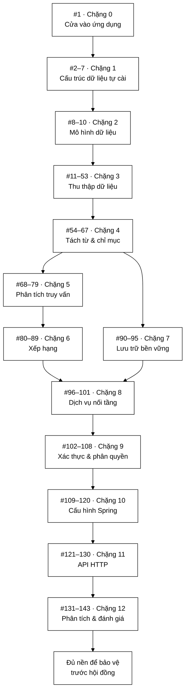

# Lộ trình đọc `docs2/main` — 143 tài liệu, đọc theo đúng thứ tự 1 → 143

**Phạm vi:** toàn bộ `docs2/main/java/com/vnsearch/` — **143 tài liệu**, tương ứng **143 file `.java`** trong `search-engine/src/main/java/com/vnsearch/` (khớp 1:1, không thừa không thiếu)
**Tổng dung lượng:** **90.062 dòng** tài liệu (đếm bằng lệnh, không ước lượng)
**Loại:** tài liệu điều hướng — bản thân nó không giải thích mã, mà **quyết định bạn đọc cái nào trước**
**Đọc kèm:** [`VnSearchApplication.md`](java/com/vnsearch/VnSearchApplication.md) — điểm số 1 của lộ trình này

---

## 📌 Hiểu trong 30 giây

143 tài liệu xếp theo thư mục là xếp theo **cấu trúc gói Java**, chứ không phải
theo **thứ tự hiểu được**. Nếu mở thư mục rồi đọc từ trên xuống theo bảng chữ
cái, bạn sẽ gặp `analytics/AdminDashboard.md` đầu tiên — một lớp bảng điều khiển
quản trị đọc số liệu từ năm lớp khác mà bạn chưa biết lớp nào cả.

Tài liệu này xếp lại 143 file đó theo **thứ tự phụ thuộc**: mỗi tài liệu ở vị
trí thứ `n` chỉ dùng đến khái niệm đã được giải thích ở các vị trí `< n`. Đọc
đúng thứ tự 1 → 143 thì **không bao giờ phải tra ngược**.

```
   HAI CÁCH DUYỆT 143 TÀI LIỆU

   ┌─ CÁCH SAI: theo bảng chữ cái / theo cây thư mục ──────────────┐
   │                                                              │
   │  1. analytics/AdminDashboard   ← gộp số từ 5 lớp chưa biết   │
   │  2. analytics/CorpusStats      ← đọc từ InvertedIndex (#57)   │
   │  3. auth/JsonUserStore         ← cài đặt của UserStore (#111) │
   │  4. config/ApiKeyAuthFilter    ← chặn request chưa hiểu       │
   │  …                                                           │
   │  ⇒ Mỗi file mở ra 3 file khác. Đọc 20 file, hiểu 0 tầng.     │
   └──────────────────────────────────────────────────────────────┘

   ┌─ CÁCH ĐÚNG: theo thứ tự phụ thuộc (tài liệu này) ────────────┐
   │                                                              │
   │    #1        cửa vào ứng dụng                                │
   │    #2–7      cấu trúc dữ liệu tự cài — KHÔNG phụ thuộc gì    │
   │    #8–10     ba bản ghi dữ liệu chảy khắp hệ thống           │
   │    #11–53    thu thập: URL → HTML → tài liệu sạch            │
   │    #54–67    chỉ mục: tài liệu sạch → chỉ mục ngược          │
   │    #68–79    truy vấn: chuỗi người dùng → cây → tập ứng viên │
   │    #80–89    xếp hạng: tập ứng viên → 10 kết quả có thứ tự   │
   │    #90–95    lưu trữ bền vững                                │
   │    #96–101   dịch vụ nối các tầng lại                        │
   │    #102–108  xác thực & phân quyền                           │
   │    #109–120  cấu hình Spring & bộ lọc HTTP                   │
   │    #121–130  API HTTP và bảng quản trị                       │
   │    #131–143  phân tích & đánh giá — kết luận của đồ án       │
   │                                                              │
   │  ⇒ Mỗi file chỉ dùng thứ đã đọc. Không tra ngược lần nào.   │
   └──────────────────────────────────────────────────────────────┘

   MẸO: dữ liệu chảy một chiều, và lộ trình đi CÙNG CHIỀU với dữ liệu

     hạt giống URL ──▶ trang HTML ──▶ tài liệu sạch ──▶ chỉ mục
                                                          │
     người dùng gõ ──▶ cây truy vấn ──▶ tập ứng viên ◀────┘
                                              │
                                              ▼
                                     điểm số ──▶ 10 kết quả ──▶ JSON
```



<details><summary>Xem bản chữ (ASCII)</summary>

```
  #1        Chặng 0 — Cửa vào ứng dụng
    │
    ▼
  #2–7      Chặng 1 — Cấu trúc dữ liệu tự cài
    │
    ▼
  #8–10     Chặng 2 — Mô hình dữ liệu
    │
    ▼
  #11–53    Chặng 3 — Thu thập dữ liệu
    │
    ▼
  #54–67    Chặng 4 — Tách từ & chỉ mục
    │
    ├───────────────────────────────┐
    ▼                               ▼
  #68–79    Chặng 5              #90–95   Chặng 7
  Phân tích truy vấn             Lưu trữ bền vững
    │                               │
    ▼                               │
  #80–89    Chặng 6                 │
  Xếp hạng                          │
    │                               │
    └───────────────┬───────────────┘
                    ▼
              #96–101   Chặng 8 — Dịch vụ nối tầng
                    │
                    ▼
              #102–108  Chặng 9 — Xác thực & phân quyền
                    │
                    ▼
              #109–120  Chặng 10 — Cấu hình Spring
                    │
                    ▼
              #121–130  Chặng 11 — API HTTP
                    │
                    ▼
              #131–143  Chặng 12 — Phân tích & đánh giá
                    │
                    ▼
              Đủ nền để bảo vệ trước hội đồng
```

</details>

---

## Mục lục

- [Ba quy tắc của lộ trình này](#ba-quy-tắc-của-lộ-trình-này)
- [Bảng tổng quan 13 chặng](#bảng-tổng-quan-13-chặng)
- [Chặng 0 — Cửa vào ứng dụng (#1)](#chặng-0--cửa-vào-ứng-dụng-1)
- [Chặng 1 — Cấu trúc dữ liệu tự cài (#2–#7)](#chặng-1--cấu-trúc-dữ-liệu-tự-cài-27)
- [Chặng 2 — Mô hình dữ liệu (#8–#10)](#chặng-2--mô-hình-dữ-liệu-810)
- [Chặng 3 — Thu thập dữ liệu (#11–#53)](#chặng-3--thu-thập-dữ-liệu-1153)
- [Chặng 4 — Tách từ và chỉ mục (#54–#67)](#chặng-4--tách-từ-và-chỉ-mục-5467)
- [Chặng 5 — Phân tích truy vấn (#68–#79)](#chặng-5--phân-tích-truy-vấn-6879)
- [Chặng 6 — Xếp hạng (#80–#89)](#chặng-6--xếp-hạng-8089)
- [Chặng 7 — Lưu trữ bền vững (#90–#95)](#chặng-7--lưu-trữ-bền-vững-9095)
- [Chặng 8 — Dịch vụ nối tầng (#96–#101)](#chặng-8--dịch-vụ-nối-tầng-96101)
- [Chặng 9 — Xác thực và phân quyền (#102–#108)](#chặng-9--xác-thực-và-phân-quyền-102108)
- [Chặng 10 — Cấu hình Spring (#109–#120)](#chặng-10--cấu-hình-spring-109120)
- [Chặng 11 — API HTTP (#121–#130)](#chặng-11--api-http-121130)
- [Chặng 12 — Phân tích và đánh giá chất lượng (#131–#143)](#chặng-12--phân-tích-và-đánh-giá-chất-lượng-131143)
- [Bốn lộ trình rút gọn khi không đủ thời gian](#bốn-lộ-trình-rút-gọn-khi-không-đủ-thời-gian)
- [Cách tự kiểm tra sau mỗi chặng](#cách-tự-kiểm-tra-sau-mỗi-chặng)
- [Bảng tra ngược: từ tên file về số thứ tự](#bảng-tra-ngược-từ-tên-file-về-số-thứ-tự)

---

## Ba quy tắc của lộ trình này

**Quy tắc 1 — Không nhảy cóc trong cùng một chặng.** Giữa các chặng có thể đổi
thứ tự (chặng 7 lưu trữ độc lập với chặng 5–6), nhưng **bên trong một chặng thì
thứ tự là bắt buộc**: các tài liệu trong một chặng được xếp theo đúng chiều phụ
thuộc, đọc ngược sẽ gặp khái niệm chưa định nghĩa.

**Quy tắc 2 — Đọc tài liệu kèm mã nguồn mở song song.** Mỗi tài liệu đều ghi
đường dẫn file `.java` ở dòng thứ hai. Mở file đó ở cửa sổ bên cạnh. Tài liệu
viết theo lối "giải thích vì sao mã lại như vậy", nên không có mã bên cạnh thì
mất một nửa giá trị.

**Quy tắc 3 — Mỗi tài liệu đều có mục "Chấm theo chuẩn doanh nghiệp" ở gần
cuối.** Nếu chỉ có 15 phút cho một lớp, đọc mục "📌 Hiểu trong 30 giây" ở đầu và
mục chấm điểm ở cuối. Hai mục đó là phần cô đọng nhất.

---

## Bảng tổng quan 13 chặng

| Chặng | Số thứ tự | Số tài liệu | Số dòng | Thời gian đọc kỹ¹ | Trả lời câu hỏi |
|---|---|---|---|---|---|
| 0 | #1 | 1 | 1.570 | ~2 giờ | Ứng dụng khởi động thế nào? |
| 1 | #2–#7 | 6 | 3.932 | ~5,5 giờ | Những cấu trúc dữ liệu nào được tự cài, và vì sao không dùng thư viện? |
| 2 | #8–#10 | 3 | 1.437 | ~2 giờ | Dữ liệu chảy trong hệ thống có hình dạng gì? |
| 3 | #11–#53 | 43 | 24.975 | ~35 giờ | Làm sao biến Internet thành một tập tài liệu sạch? |
| 4 | #54–#67 | 14 | 8.726 | ~12 giờ | Làm sao tra một từ ra hàng nghìn tài liệu trong vài mili-giây? |
| 5 | #68–#79 | 12 | 6.809 | ~9,5 giờ | Chuỗi người dùng gõ vào biến thành phép toán tập hợp ra sao? |
| 6 | #80–#89 | 10 | 5.756 | ~8 giờ | Vì sao kết quả này đứng trên kết quả kia? |
| 7 | #90–#95 | 6 | 4.602 | ~6,5 giờ | Dữ liệu sống sót qua lần khởi động lại bằng cách nào? |
| 8 | #96–#101 | 6 | 3.728 | ~5 giờ | Ai là người ra lệnh cho các tầng? |
| 9 | #102–#108 | 7 | 2.750 | ~4 giờ | Ai được làm gì? |
| 10 | #109–#120 | 12 | 7.801 | ~11 giờ | Spring lắp các mảnh lại với nhau thế nào? |
| 11 | #121–#130 | 10 | 6.079 | ~8,5 giờ | Thế giới bên ngoài gọi vào bằng đường nào? |
| 12 | #131–#143 | 13 | 11.897 | ~16,5 giờ | Hệ thống này **tốt đến đâu**, và bằng chứng nào? |
| **Tổng** | **#1–#143** | **143** | **90.062** | **~125 giờ** | — |

¹ Ước theo nhịp ~12 dòng/phút — nhịp đọc có dừng lại đối chiếu mã nguồn, không
phải nhịp đọc lướt. Tổng toàn bộ: **khoảng 125 giờ**. Chia đều 3 giờ mỗi ngày
thì hết **khoảng 6 tuần**.

---

## Chặng 0 — Cửa vào ứng dụng (#1)

Bắt đầu ở đây vì đây là **hàm `main`**: mọi thứ còn lại đều được Spring dựng lên
từ một dòng lệnh trong file này. Đọc nó trước để có bản đồ toàn cảnh, rồi mới đi
xuống từng tầng.

| # | Tài liệu | Dòng | Vì sao đọc ở vị trí này |
|---|---|---|---|
| 1 | [`VnSearchApplication.md`](java/com/vnsearch/VnSearchApplication.md) | 1.570 | Điểm khởi động duy nhất. Tài liệu này chứa bản đồ toàn bộ gói và trình tự khởi động Spring Boot — coi như mục lục sống của 142 tài liệu còn lại. |

---

## Chặng 1 — Cấu trúc dữ liệu tự cài (#2–#7)

Đây là tầng **không phụ thuộc gì cả** — sáu lớp này chỉ dùng mảng và tham chiếu
Java thuần. Đọc đầu tiên vì bốn tầng sau đều gọi xuống chúng: `MinHeap` giữ
top-K kết quả, `Trie` phục vụ gợi ý, `BloomFilter` chặn URL trùng, `LRUCache`
đỡ tải cho tầng lưu trữ. Nếu bỏ qua chặng này, đến `#96 ResultRanker` bạn sẽ
không hiểu vì sao lấy top-10 lại là `O(n log 10)` chứ không phải `O(n log n)`.

Thứ tự trong chặng đi từ **cấu trúc đơn giản nhất đến cấu trúc nhiều biến thể
nhất**.

| # | Tài liệu | Dòng | Vì sao đọc ở vị trí này |
|---|---|---|---|
| 2 | [`datastructure/MinHeap.md`](java/com/vnsearch/datastructure/MinHeap.md) | 641 | Cấu trúc dễ hình dung nhất (mảng + hai phép sift). Là nền cho mọi bài toán top-K về sau. |
| 3 | [`datastructure/LRUCache.md`](java/com/vnsearch/datastructure/LRUCache.md) | 604 | Ghép hai cấu trúc đã biết (bảng băm + danh sách liên kết đôi) để đạt `O(1)`. Bước đầu tiên của tư duy "kết hợp cấu trúc". |
| 4 | [`datastructure/BloomFilter.md`](java/com/vnsearch/datastructure/BloomFilter.md) | 618 | Cấu trúc **xác suất** đầu tiên — đổi độ chính xác lấy bộ nhớ. Đây là ý tưởng cốt lõi để hiểu `#40 UrlSeenFilter`. |
| 5 | [`datastructure/Trie.md`](java/com/vnsearch/datastructure/Trie.md) | 691 | Cây tiền tố tổng quát. Nền cho gợi ý tìm kiếm và cho từ điển tiếng Việt. |
| 6 | [`datastructure/SyllableTrie.md`](java/com/vnsearch/datastructure/SyllableTrie.md) | 747 | Biến thể của `Trie` cho **âm tiết tiếng Việt** thay vì ký tự. Phải đọc ngay sau `Trie` để thấy rõ chỗ khác biệt. |
| 7 | [`datastructure/SparseMatrix.md`](java/com/vnsearch/datastructure/SparseMatrix.md) | 631 | Ma trận thưa cho đồ thị liên kết web. Chỉ dùng ở `#97 PageRankService`, nên đọc cuối chặng. |

---

## Chặng 2 — Mô hình dữ liệu (#8–#10)

Ba bản ghi này là **danh từ chung của cả hệ thống**. Chúng xuất hiện ở chữ ký
hàm của gần như mọi lớp phía sau. Đọc sớm và đọc kỹ — chỉ mất 2 giờ nhưng tiết
kiệm hàng chục lần tra ngược.

Thứ tự: từ vật được lưu trữ → vật được trả về cho một kết quả → vật được trả về
cho cả phản hồi.

| # | Tài liệu | Dòng | Vì sao đọc ở vị trí này |
|---|---|---|---|
| 8 | [`model/WebDocument.md`](java/com/vnsearch/model/WebDocument.md) | 502 | Đơn vị dữ liệu trung tâm: một trang web sau khi đã làm sạch. Chặng 3 sinh ra nó, chặng 4 lập chỉ mục cho nó, chặng 7 lưu nó. |
| 9 | [`model/SearchResult.md`](java/com/vnsearch/model/SearchResult.md) | 463 | Một dòng kết quả trả về người dùng — là `WebDocument` cộng thêm điểm số và đoạn trích. |
| 10 | [`model/SearchResponse.md`](java/com/vnsearch/model/SearchResponse.md) | 472 | Bao ngoài của cả trang kết quả (danh sách + tổng số + thời gian). Là thứ `#132 SearchController` tuần tự hoá thành JSON. |

---

## Chặng 3 — Thu thập dữ liệu (#11–#53)

**Chặng dài nhất: 43 tài liệu, gần 25.000 dòng, khoảng 35 giờ.** Đây cũng là
chặng có nhiều điểm chấm nhất trước hội đồng, vì nó chứa toàn bộ phần "hệ thống
phân tán" của đồ án: hàng đợi ưu tiên, lịch sự với máy chủ, chống trùng lặp,
hàng đợi sự kiện Kafka.

Chặng này chia làm bốn nhóm nhỏ, đọc lần lượt.

### 3A — Đơn vị xử lý một URL (#11–#24)

Đọc trước tiên vì đây là các **hàm thuần** dễ kiểm chứng: đưa vào một URL hoặc
một chuỗi HTML, nhận ra một kết quả. Chưa có luồng, chưa có hàng đợi.

| # | Tài liệu | Dòng | Vì sao đọc ở vị trí này |
|---|---|---|---|
| 11 | [`crawler/CrawlConfig.md`](java/com/vnsearch/crawler/CrawlConfig.md) | 456 | Tập tham số điều khiển toàn bộ chặng 3. Đọc trước để về sau gặp tên tham số nào cũng biết nó ở đâu ra. |
| 12 | [`crawler/UrlCanonicalizer.md`](java/com/vnsearch/crawler/UrlCanonicalizer.md) | 403 | Chuẩn hoá URL. Phải hiểu trước mọi thứ liên quan đến "trùng lặp", vì hai URL chỉ trùng nhau **sau khi** chuẩn hoá. |
| 13 | [`crawler/UrlFilter.md`](java/com/vnsearch/crawler/UrlFilter.md) | 580 | Quyết định URL nào đáng thu thập. Bộ lọc rẻ nhất, nên đứng sớm nhất trong đường ống. |
| 14 | [`crawler/SeedUrlValidator.md`](java/com/vnsearch/crawler/SeedUrlValidator.md) | 583 | Kiểm tra URL hạt giống và chống SSRF. Đọc ngay sau `UrlFilter` để thấy hai tầng kiểm tra khác mục đích thế nào. |
| 15 | [`crawler/DnsResolver.md`](java/com/vnsearch/crawler/DnsResolver.md) | 443 | Phân giải tên miền có bộ nhớ đệm — lần đầu tiên `#3 LRUCache` được dùng thật. |
| 16 | [`crawler/RobotsTxtParser.md`](java/com/vnsearch/crawler/RobotsTxtParser.md) | 540 | Giao ước lịch sự với máy chủ. Là phần đạo đức kỹ thuật mà hội đồng hay hỏi. |
| 17 | [`crawler/HtmlDownloader.md`](java/com/vnsearch/crawler/HtmlDownloader.md) | 550 | Chỗ duy nhất chạm vào mạng thật. Sau tài liệu này, mọi thứ còn lại đều là xử lý chuỗi trong bộ nhớ. |
| 18 | [`crawler/ContentParser.md`](java/com/vnsearch/crawler/ContentParser.md) | 446 | HTML thô → văn bản sạch + tiêu đề. Đây là nơi `#8 WebDocument` thật sự được sinh ra. |
| 19 | [`crawler/LinkExtractor.md`](java/com/vnsearch/crawler/LinkExtractor.md) | 425 | Rút liên kết ra khỏi trang — chính là thứ khiến vòng lặp thu thập tự nuôi được mình. |
| 20 | [`crawler/LanguageFilter.md`](java/com/vnsearch/crawler/LanguageFilter.md) | 625 | Giữ lại trang tiếng Việt. Quyết định phạm vi của cả kho dữ liệu. |
| 21 | [`crawler/UrlSeenFilter.md`](java/com/vnsearch/crawler/UrlSeenFilter.md) | 510 | Chống thăm lại một URL — ứng dụng thật của `#4 BloomFilter`. |
| 22 | [`crawler/ContentSeenFilter.md`](java/com/vnsearch/crawler/ContentSeenFilter.md) | 478 | Chống trùng **nội dung** dù URL khác nhau. Đọc ngay sau để so sánh hai kiểu chống trùng. |
| 23 | [`crawler/UrlStorage.md`](java/com/vnsearch/crawler/UrlStorage.md) | 470 | Ghi trạng thái URL xuống đĩa, để lần chạy sau tiếp tục được. |
| 24 | [`crawler/ContentStorage.md`](java/com/vnsearch/crawler/ContentStorage.md) | 529 | Ghi nội dung trang xuống đĩa. Cặp đôi với tài liệu trên. |

### 3B — Hàng đợi biên giới (#25–#33)

Nhóm khó nhất của chặng 3 và là **điểm cộng lớn nhất trước hội đồng**: đây là
kiến trúc hàng đợi hai tầng theo mô hình Mercator. Bắt buộc đọc đúng thứ tự dưới
đây, vì `UrlFrontier` ở cuối là lớp lắp ráp tám lớp trước nó.

| # | Tài liệu | Dòng | Vì sao đọc ở vị trí này |
|---|---|---|---|
| 25 | [`crawler/frontier/CrawlTask.md`](java/com/vnsearch/crawler/frontier/CrawlTask.md) | 404 | Đơn vị công việc đi qua hàng đợi. Phải biết hình dạng của nó trước khi bàn về hàng đợi chứa nó. |
| 26 | [`crawler/frontier/Prioritizer.md`](java/com/vnsearch/crawler/frontier/Prioritizer.md) | 397 | Giao diện chấm độ ưu tiên. Đọc giao diện trước cài đặt. |
| 27 | [`crawler/frontier/DefaultPrioritizer.md`](java/com/vnsearch/crawler/frontier/DefaultPrioritizer.md) | 474 | Cài đặt cụ thể — cho thấy tiêu chí ưu tiên thật sự là gì. |
| 28 | [`crawler/frontier/FrontQueues.md`](java/com/vnsearch/crawler/frontier/FrontQueues.md) | 401 | Tầng hàng đợi thứ nhất: sắp theo **độ ưu tiên**. |
| 29 | [`crawler/frontier/BackQueues.md`](java/com/vnsearch/crawler/frontier/BackQueues.md) | 601 | Tầng hàng đợi thứ hai: sắp theo **máy chủ**, để giữ lịch sự. Đây là chỗ hai mục tiêu mâu thuẫn nhau được hoà giải. |
| 30 | [`crawler/frontier/FrontQueueSelector.md`](java/com/vnsearch/crawler/frontier/FrontQueueSelector.md) | 501 | Giao diện chọn hàng đợi nào để lấy việc tiếp theo. |
| 31 | [`crawler/frontier/StrictPrioritySelector.md`](java/com/vnsearch/crawler/frontier/StrictPrioritySelector.md) | 374 | Chiến lược chọn đơn giản — và vấn đề đói tài nguyên mà nó gây ra. |
| 32 | [`crawler/frontier/WeightedRandomSelector.md`](java/com/vnsearch/crawler/frontier/WeightedRandomSelector.md) | 596 | Chiến lược sửa được vấn đề trên. Đọc liền sau để thấy đánh đổi. |
| 33 | [`crawler/frontier/UrlFrontier.md`](java/com/vnsearch/crawler/frontier/UrlFrontier.md) | 609 | Lớp lắp ráp toàn bộ #25–#32. Chỉ đọc được sau khi đã có tám mảnh trên. |

### 3C — Vòng lặp thu thập và quan sát (#34–#39)

| # | Tài liệu | Dòng | Vì sao đọc ở vị trí này |
|---|---|---|---|
| 34 | [`crawler/CrawlListener.md`](java/com/vnsearch/crawler/CrawlListener.md) | 434 | Giao diện quan sát tiến trình. Đọc trước ba cài đặt của nó. |
| 35 | [`crawler/ConsoleCrawlListener.md`](java/com/vnsearch/crawler/ConsoleCrawlListener.md) | 355 | Cài đặt đơn giản nhất — in ra màn hình. |
| 36 | [`crawler/ProgressBarCrawlListener.md`](java/com/vnsearch/crawler/ProgressBarCrawlListener.md) | 566 | Cài đặt có trạng thái — thanh tiến độ. |
| 37 | [`crawler/CheckpointCrawlListener.md`](java/com/vnsearch/crawler/CheckpointCrawlListener.md) | 592 | Cài đặt có hệ quả lên độ bền — lưu điểm kiểm tra để chạy tiếp sau khi dừng. |
| 38 | [`crawler/CrawlerService.md`](java/com/vnsearch/crawler/CrawlerService.md) | **1.583** | **Trái tim của chặng 3.** Vòng lặp đa luồng gọi tất cả 27 lớp phía trên. Tài liệu dài thứ nhì của cả bộ — dành hẳn một buổi. |
| 39 | [`crawler/MultiDomainCrawlRunner.md`](java/com/vnsearch/crawler/MultiDomainCrawlRunner.md) | **1.620** | **Tài liệu dài nhất cả bộ.** Điều phối thu thập nhiều tên miền song song. Đọc ngay sau `CrawlerService` khi bối cảnh còn nóng. |

### 3D — Kiến trúc sự kiện và các dịch vụ tách rời (#40–#53)

Nhóm này là bước tiến kiến trúc: thay vì `CrawlerService` tự làm mọi thứ, nó
**phát sự kiện** và các dịch vụ khác tự tiêu thụ. Đọc sau #38–#39 để thấy rõ
"trước và sau khi tách".

| # | Tài liệu | Dòng | Vì sao đọc ở vị trí này |
|---|---|---|---|
| 40 | [`crawler/bus/PageEvent.md`](java/com/vnsearch/crawler/bus/PageEvent.md) | 588 | Sự kiện gốc — hình dạng chung của mọi thông điệp trên tuyến. |
| 41 | [`crawler/bus/DiscoveredUrl.md`](java/com/vnsearch/crawler/bus/DiscoveredUrl.md) | 519 | Sự kiện "tìm thấy URL mới". |
| 42 | [`crawler/bus/OutlinksExtracted.md`](java/com/vnsearch/crawler/bus/OutlinksExtracted.md) | 505 | Sự kiện "đã rút xong liên kết ra" — nguyên liệu cho `#97 PageRankService`. |
| 43 | [`crawler/bus/ImageFound.md`](java/com/vnsearch/crawler/bus/ImageFound.md) | 553 | Sự kiện "tìm thấy ảnh" — nguyên liệu cho nhánh tìm kiếm ảnh. |
| 44 | [`crawler/bus/PageEventHandler.md`](java/com/vnsearch/crawler/bus/PageEventHandler.md) | 572 | Giao diện bên tiêu thụ. Đọc sau khi biết đủ bốn loại sự kiện. |
| 45 | [`crawler/bus/CrawlEventBus.md`](java/com/vnsearch/crawler/bus/CrawlEventBus.md) | 541 | Giao diện tuyến sự kiện — trừu tượng cho phép đổi Kafka lấy bộ nhớ trong. |
| 46 | [`crawler/bus/InProcessCrawlEventBus.md`](java/com/vnsearch/crawler/bus/InProcessCrawlEventBus.md) | 623 | Cài đặt trong tiến trình — mặc định khi chạy máy cá nhân. |
| 47 | [`crawler/bus/KafkaCrawlEventBus.md`](java/com/vnsearch/crawler/bus/KafkaCrawlEventBus.md) | 530 | Cài đặt Kafka — cùng giao diện, khác hoàn toàn về đảm bảo. Đọc liền sau để so sánh. |
| 48 | [`crawler/modular/UrlExtractorService.md`](java/com/vnsearch/crawler/modular/UrlExtractorService.md) | 646 | Bên tiêu thụ đầu tiên: rút URL thành một dịch vụ riêng. |
| 49 | [`crawler/modular/ImageQuality.md`](java/com/vnsearch/crawler/modular/ImageQuality.md) | 672 | Chấm chất lượng ảnh — hàm thuần, đọc trước các lớp lưu ảnh. |
| 50 | [`crawler/modular/ImageStorage.md`](java/com/vnsearch/crawler/modular/ImageStorage.md) | 602 | Giao diện lưu ảnh. |
| 51 | [`crawler/modular/ImageStore.md`](java/com/vnsearch/crawler/modular/ImageStore.md) | 682 | Kho ảnh trong bộ nhớ, có chỉ mục để tìm. |
| 52 | [`crawler/modular/ImageDownloadService.md`](java/com/vnsearch/crawler/modular/ImageDownloadService.md) | 697 | Dịch vụ tải ảnh — lắp #49–#51 lại. |
| 53 | [`crawler/modular/CrawlAnalyticsService.md`](java/com/vnsearch/crawler/modular/CrawlAnalyticsService.md) | 700 | Bên tiêu thụ cuối: gom thống kê thu thập. Khép lại chặng 3. |

---

## Chặng 4 — Tách từ và chỉ mục (#54–#67)

Từ đây trở đi là **phần lõi thuật toán tìm kiếm**. Chặng 3 đã cho ra một tập
`WebDocument` sạch; chặng này biến chúng thành cấu trúc tra cứu được.

Thứ tự: tách từ trước (vì chỉ mục lưu **token**, không lưu chữ), rồi đến đơn vị
posting, rồi đến chỉ mục, rồi đến nén và lưu.

| # | Tài liệu | Dòng | Vì sao đọc ở vị trí này |
|---|---|---|---|
| 54 | [`index/Tokenizer.md`](java/com/vnsearch/index/Tokenizer.md) | 563 | Giao diện tách từ. Cửa vào của cả tầng chỉ mục. |
| 55 | [`index/VietnameseWordDictionary.md`](java/com/vnsearch/index/VietnameseWordDictionary.md) | 763 | Từ điển từ ghép tiếng Việt — dữ liệu mà bộ tách từ dựa vào. Đọc trước bộ tách từ. |
| 56 | [`index/VietnameseTokenizer.md`](java/com/vnsearch/index/VietnameseTokenizer.md) | 744 | Bộ tách từ tiếng Việt. Đây là chỗ đồ án khác biệt so với một công cụ tìm kiếm tiếng Anh. |
| 57 | [`index/MaxWeightSegmenter.md`](java/com/vnsearch/index/MaxWeightSegmenter.md) | 642 | Thuật toán phân đoạn trọng số cực đại — quy hoạch động trên `#6 SyllableTrie`. Điểm cộng thuật toán rõ nhất của tầng này. |
| 58 | [`index/Posting.md`](java/com/vnsearch/index/Posting.md) | 530 | Đơn vị nhỏ nhất của chỉ mục ngược: một cặp (tài liệu, tần suất). |
| 59 | [`index/PostingCursor.md`](java/com/vnsearch/index/PostingCursor.md) | 560 | Giao diện con trỏ duyệt danh sách posting — nền cho phép hợp/giao ở chặng 5. |
| 60 | [`index/ArrayPostingCursor.md`](java/com/vnsearch/index/ArrayPostingCursor.md) | 545 | Cài đặt con trỏ trên mảng. |
| 61 | [`index/TermDictionary.md`](java/com/vnsearch/index/TermDictionary.md) | 544 | Từ điển thuật ngữ: ánh xạ từ → vị trí danh sách posting. |
| 62 | [`index/SearchIndex.md`](java/com/vnsearch/index/SearchIndex.md) | 535 | Giao diện chỉ mục. Đọc trước cài đặt. |
| 63 | [`index/InvertedIndex.md`](java/com/vnsearch/index/InvertedIndex.md) | 879 | **Chỉ mục ngược — cấu trúc quan trọng nhất của cả đồ án.** Dành trọn một buổi. |
| 64 | [`index/VByteCodec.md`](java/com/vnsearch/index/VByteCodec.md) | 605 | Mã hoá số nguyên biến độ dài. Kỹ thuật nền của nén chỉ mục. |
| 65 | [`index/CompressedPostings.md`](java/com/vnsearch/index/CompressedPostings.md) | 628 | Nén danh sách posting bằng delta + VByte. Đọc ngay sau `VByteCodec`. |
| 66 | [`index/CompressedText.md`](java/com/vnsearch/index/CompressedText.md) | 553 | Nén văn bản gốc để dựng đoạn trích mà không tốn RAM. |
| 67 | [`index/IndexPersistence.md`](java/com/vnsearch/index/IndexPersistence.md) | 635 | Ghi và đọc chỉ mục xuống đĩa. Khép lại chặng 4. |

---

## Chặng 5 — Phân tích truy vấn (#68–#79)

Chặng này đi **ngược chiều** với chặng 4: người dùng gõ một chuỗi, hệ thống phải
biến nó thành phép toán trên các danh sách posting đã dựng ở #63.

Thứ tự: cây cú pháp trước (kiểu dữ liệu), rồi bộ phân tích cú pháp (sinh ra
cây), rồi bộ lọc, rồi lớp thực thi cây.

| # | Tài liệu | Dòng | Vì sao đọc ở vị trí này |
|---|---|---|---|
| 68 | [`query/ast/QueryNode.md`](java/com/vnsearch/query/ast/QueryNode.md) | 498 | Nút gốc của cây truy vấn — giao diện chung của năm loại nút dưới. |
| 69 | [`query/ast/TermNode.md`](java/com/vnsearch/query/ast/TermNode.md) | 429 | Nút lá: một từ đơn. Đơn giản nhất, đọc trước. |
| 70 | [`query/ast/PhraseNode.md`](java/com/vnsearch/query/ast/PhraseNode.md) | 494 | Nút cụm từ trong ngoặc kép — cần thông tin vị trí, phức tạp hơn nút lá. |
| 71 | [`query/ast/AndNode.md`](java/com/vnsearch/query/ast/AndNode.md) | 543 | Nút giao. Toán tử tổ hợp đầu tiên. |
| 72 | [`query/ast/OrNode.md`](java/com/vnsearch/query/ast/OrNode.md) | 468 | Nút hợp. Đọc liền sau để so sánh chi phí với nút giao. |
| 73 | [`query/ast/NotNode.md`](java/com/vnsearch/query/ast/NotNode.md) | 508 | Nút loại trừ — và lý do vì sao nó không thể đứng một mình. |
| 74 | [`query/QueryParser.md`](java/com/vnsearch/query/QueryParser.md) | 794 | Bộ phân tích cú pháp dựng ra cây từ sáu loại nút trên. Chỉ đọc được sau khi đã biết cả sáu. |
| 75 | [`query/filter/CandidateFilter.md`](java/com/vnsearch/query/filter/CandidateFilter.md) | 527 | Giao diện lọc ứng viên. |
| 76 | [`query/filter/DomainFilter.md`](java/com/vnsearch/query/filter/DomainFilter.md) | 474 | Lọc theo tên miền — bộ lọc theo ngữ nghĩa. |
| 77 | [`query/filter/MaxCandidatesFilter.md`](java/com/vnsearch/query/filter/MaxCandidatesFilter.md) | 458 | Cắt số ứng viên — bộ lọc theo hiệu năng. Đọc cùng cặp với trên để thấy hai động cơ khác nhau. |
| 78 | [`query/PostingListMerger.md`](java/com/vnsearch/query/PostingListMerger.md) | 751 | Thuật toán hợp/giao danh sách posting. Đây là nơi `#59 PostingCursor` phát huy tác dụng. |
| 79 | [`query/CandidateResolver.md`](java/com/vnsearch/query/CandidateResolver.md) | 865 | Lớp duyệt cây và gọi bộ hợp nhất để ra tập ứng viên cuối. Khép lại chặng 5. |

---

## Chặng 6 — Xếp hạng (#80–#89)

Chặng 5 cho ra **một tập** ứng viên, không có thứ tự. Chặng này quyết định thứ
tự. Đây là chặng mà hội đồng sẽ hỏi "vì sao kết quả này đứng trên kết quả kia" —
câu trả lời nằm trọn trong mười tài liệu dưới.

Thứ tự: giao diện chấm điểm → hai công thức cơ bản → các lớp trang trí → tín
hiệu ngoài văn bản → lắp ráp.

| # | Tài liệu | Dòng | Vì sao đọc ở vị trí này |
|---|---|---|---|
| 80 | [`ranking/RelevanceScorer.md`](java/com/vnsearch/ranking/RelevanceScorer.md) | 543 | Giao diện chấm điểm — trục của toàn bộ chặng 6. |
| 81 | [`ranking/TfIdfScorer.md`](java/com/vnsearch/ranking/TfIdfScorer.md) | 657 | Công thức kinh điển, dễ hiểu nhất. Đọc trước BM25 để thấy BM25 sửa gì. |
| 82 | [`ranking/BM25Scorer.md`](java/com/vnsearch/ranking/BM25Scorer.md) | 637 | Công thức mặc định của hệ thống. Chỉ hiểu được vì sao có `k1`, `b` nếu đã đọc TF-IDF trước. |
| 83 | [`ranking/QuerySyllables.md`](java/com/vnsearch/ranking/QuerySyllables.md) | 576 | Xử lý âm tiết ở phía truy vấn — nối chặng 6 về lại `#56 VietnameseTokenizer`. |
| 84 | [`ranking/ScorerFactory.md`](java/com/vnsearch/ranking/ScorerFactory.md) | 526 | Nhà máy chọn bộ chấm điểm. Đọc sau khi đã biết hai bộ chấm điểm để hiểu nó chọn giữa cái gì. |
| 85 | [`ranking/decorator/TitleBoostScorer.md`](java/com/vnsearch/ranking/decorator/TitleBoostScorer.md) | 479 | Lớp trang trí đầu tiên — cộng điểm khi khớp tiêu đề. Mẫu Decorator lần đầu xuất hiện. |
| 86 | [`ranking/decorator/PageRankBoostScorer.md`](java/com/vnsearch/ranking/decorator/PageRankBoostScorer.md) | 551 | Lớp trang trí thứ hai — chồng lên lớp thứ nhất. Cho thấy vì sao chọn Decorator thay vì kế thừa. |
| 87 | [`ranking/PageRankService.md`](java/com/vnsearch/ranking/PageRankService.md) | 646 | Thuật toán PageRank trên `#7 SparseMatrix`, dùng `#42 OutlinksExtracted` làm dữ liệu vào. Nơi ba chặng gặp nhau. |
| 88 | [`ranking/SnippetBuilder.md`](java/com/vnsearch/ranking/SnippetBuilder.md) | 581 | Dựng đoạn trích có tô đậm từ khoá — dùng `#66 CompressedText`. |
| 89 | [`ranking/ResultRanker.md`](java/com/vnsearch/ranking/ResultRanker.md) | 560 | Lắp tất cả lại và lấy top-K bằng `#2 MinHeap`. Khép lại chặng 6 — và khép luôn vòng về chặng 1. |

---

## Chặng 7 — Lưu trữ bền vững (#90–#95)

Chặng này **độc lập với chặng 5–6**: có thể đọc ngay sau chặng 4 nếu muốn. Đặt ở
đây vì nó là nền cho chặng 8.

Thứ tự: giao diện → cài đặt tệp JSON → tầng kho → cài đặt PostgreSQL → hai công
cụ chạy một lần.

| # | Tài liệu | Dòng | Vì sao đọc ở vị trí này |
|---|---|---|---|
| 90 | [`storage/DocumentStore.md`](java/com/vnsearch/storage/DocumentStore.md) | 452 | Giao diện kho tài liệu. |
| 91 | [`storage/JsonDocumentStore.md`](java/com/vnsearch/storage/JsonDocumentStore.md) | 657 | Cài đặt bằng tệp JSON — mặc định khi chạy máy cá nhân. |
| 92 | [`storage/DocumentRepository.md`](java/com/vnsearch/storage/DocumentRepository.md) | 850 | Tầng kho trừu tượng phía trên. Đọc trước cài đặt PostgreSQL. |
| 93 | [`storage/PostgresDocumentStore.md`](java/com/vnsearch/storage/PostgresDocumentStore.md) | 722 | Cài đặt PostgreSQL — cùng giao diện #90, khác hoàn toàn về đảm bảo và chi phí. |
| 94 | [`storage/PostgresImportRunner.md`](java/com/vnsearch/storage/PostgresImportRunner.md) | 614 | Công cụ nạp dữ liệu vào PostgreSQL. |
| 95 | [`storage/GinBaselineRunner.md`](java/com/vnsearch/storage/GinBaselineRunner.md) | **1.307** | **Rất quan trọng khi bảo vệ.** So sánh chỉ mục tự cài với chỉ mục GIN sẵn có của PostgreSQL — đây là bằng chứng "tự cài có đáng không". Đọc kỹ. |

---

## Chặng 8 — Dịch vụ nối tầng (#96–#101)

Đến đây bạn đã biết mọi tầng riêng lẻ. Chặng này là các lớp **điều phối**: chúng
không tự tính gì cả, chỉ gọi các tầng theo đúng thứ tự.

| # | Tài liệu | Dòng | Vì sao đọc ở vị trí này |
|---|---|---|---|
| 96 | [`service/LanguageDetector.md`](java/com/vnsearch/service/LanguageDetector.md) | 517 | Nhận diện ngôn ngữ — dịch vụ nhỏ và độc lập, khởi động nhẹ nhàng cho chặng. |
| 97 | [`service/IndexBuilder.md`](java/com/vnsearch/service/IndexBuilder.md) | 558 | Nối chặng 3 (tài liệu) sang chặng 4 (chỉ mục). |
| 98 | [`service/SearchEngineFacade.md`](java/com/vnsearch/service/SearchEngineFacade.md) | 721 | **Mặt tiền của cả hệ thống** — một hàm gọi qua chặng 5, 6, 7. Nếu chỉ được đọc một tài liệu duy nhất của cả bộ, đọc cái này. |
| 99 | [`service/SuggestionService.md`](java/com/vnsearch/service/SuggestionService.md) | 651 | Gợi ý tìm kiếm — ứng dụng thật của `#5 Trie`. |
| 100 | [`service/CrawlStatus.md`](java/com/vnsearch/service/CrawlStatus.md) | 537 | Bản ghi trạng thái tiến trình thu thập. |
| 101 | [`service/CrawlJobManager.md`](java/com/vnsearch/service/CrawlJobManager.md) | 744 | Quản lý phiên thu thập chạy nền, phục vụ nút bấm trên giao diện quản trị. |

---

## Chặng 9 — Xác thực và phân quyền (#102–#108)

Từ chặng này trở đi là **phần ứng dụng web**, không còn thuật toán tìm kiếm. Đọc
theo chiều: kiểu dữ liệu → kho → dịch vụ → bộ lọc HTTP.

| # | Tài liệu | Dòng | Vì sao đọc ở vị trí này |
|---|---|---|---|
| 102 | [`auth/Role.md`](java/com/vnsearch/auth/Role.md) | 248 | Kiểu liệt kê vai trò. Tài liệu ngắn nhất cả bộ — khởi động nhẹ. |
| 103 | [`auth/User.md`](java/com/vnsearch/auth/User.md) | 323 | Bản ghi người dùng. |
| 104 | [`auth/UserStore.md`](java/com/vnsearch/auth/UserStore.md) | 296 | Giao diện kho người dùng. |
| 105 | [`auth/JsonUserStore.md`](java/com/vnsearch/auth/JsonUserStore.md) | 438 | Cài đặt kho bằng tệp JSON. |
| 106 | [`auth/SessionStore.md`](java/com/vnsearch/auth/SessionStore.md) | 487 | Kho phiên đăng nhập — nơi token sống. |
| 107 | [`auth/UserService.md`](java/com/vnsearch/auth/UserService.md) | 605 | Dịch vụ đăng ký/đăng nhập, băm mật khẩu. Đọc sau khi đã có kho người dùng và kho phiên. |
| 108 | [`auth/TokenAuthFilter.md`](java/com/vnsearch/auth/TokenAuthFilter.md) | 353 | Bộ lọc HTTP kiểm token mỗi request. Cầu nối sang chặng 10. |

---

## Chặng 10 — Cấu hình Spring (#109–#120)

Chặng này giải thích **Spring lắp các mảnh lại thế nào**. Đọc sau tất cả các
tầng nghiệp vụ, vì mỗi lớp cấu hình đều nhắc tên một lớp bạn đã đọc.

Thứ tự: cấu hình lõi tìm kiếm → an ninh → bộ lọc HTTP → quan trắc → Kafka và
các bộ nghe.

| # | Tài liệu | Dòng | Vì sao đọc ở vị trí này |
|---|---|---|---|
| 109 | [`config/SearchConfig.md`](java/com/vnsearch/config/SearchConfig.md) | 518 | Dựng các bean của tầng tìm kiếm. Bản đồ trực tiếp về chặng 4–6. |
| 110 | [`config/SecurityConfig.md`](java/com/vnsearch/config/SecurityConfig.md) | 715 | Chuỗi bộ lọc an ninh — nơi `#108 TokenAuthFilter` được cắm vào. |
| 111 | [`config/AuthConfig.md`](java/com/vnsearch/config/AuthConfig.md) | 598 | Bean của tầng xác thực (chặng 9). |
| 112 | [`config/CorsConfig.md`](java/com/vnsearch/config/CorsConfig.md) | 615 | CORS — điều kiện để giao diện web ở cổng khác gọi được API. |
| 113 | [`config/ApiKeyAuthFilter.md`](java/com/vnsearch/config/ApiKeyAuthFilter.md) | 545 | Bộ lọc khoá API cho đường dẫn quản trị. |
| 114 | [`config/RateLimitFilter.md`](java/com/vnsearch/config/RateLimitFilter.md) | 757 | Giới hạn tần suất — dùng `#3 LRUCache`. Điểm cộng về vận hành thật. |
| 115 | [`config/GlobalExceptionHandler.md`](java/com/vnsearch/config/GlobalExceptionHandler.md) | 685 | Biến ngoại lệ thành phản hồi JSON nhất quán. Đọc trước chặng controller. |
| 116 | [`config/MetricsConfig.md`](java/com/vnsearch/config/MetricsConfig.md) | 595 | Chỉ số quan trắc — nền cho phần vận hành của báo cáo. |
| 117 | [`config/KafkaCrawlConfig.md`](java/com/vnsearch/config/KafkaCrawlConfig.md) | **900** | Cấu hình Kafka đầy đủ. Tài liệu dài nhất của chặng 10, nối thẳng về `#47 KafkaCrawlEventBus`. |
| 118 | [`config/CrawlKafkaListeners.md`](java/com/vnsearch/config/CrawlKafkaListeners.md) | 678 | Các bộ nghe Kafka phía tiêu thụ. |
| 119 | [`config/ImageStoreListener.md`](java/com/vnsearch/config/ImageStoreListener.md) | 572 | Bộ nghe sự kiện ảnh — nối về `#43 ImageFound`. |
| 120 | [`config/ImageStorePreloader.md`](java/com/vnsearch/config/ImageStorePreloader.md) | 623 | Nạp sẵn kho ảnh lúc khởi động. Khép lại chặng 10. |

---

## Chặng 11 — API HTTP (#121–#130)

Đây là **bề mặt mà thế giới bên ngoài nhìn thấy**. Đọc gần cuối vì mỗi controller
chỉ là vài dòng gọi xuống dịch vụ — giá trị nằm ở chỗ bạn đã biết dịch vụ đó làm
gì.

Thứ tự: từ điểm cuối đơn giản nhất đến điểm cuối nhiều quyền nhất.

| # | Tài liệu | Dòng | Vì sao đọc ở vị trí này |
|---|---|---|---|
| 121 | [`controller/HealthController.md`](java/com/vnsearch/controller/HealthController.md) | 578 | Điểm cuối đơn giản nhất — hình mẫu chung của một controller. |
| 122 | [`controller/SearchController.md`](java/com/vnsearch/controller/SearchController.md) | 540 | Điểm cuối chính của cả sản phẩm. Gọi thẳng `#98 SearchEngineFacade`. |
| 123 | [`controller/SuggestController.md`](java/com/vnsearch/controller/SuggestController.md) | 523 | Gợi ý gõ — điểm cuối nhạy cảm nhất về độ trễ. |
| 124 | [`controller/ImageSearchController.md`](java/com/vnsearch/controller/ImageSearchController.md) | 623 | Tìm kiếm ảnh — thu hoạch của nhánh #49–#52. |
| 125 | [`controller/FeedController.md`](java/com/vnsearch/controller/FeedController.md) | 645 | Dòng nội dung. |
| 126 | [`controller/EventController.md`](java/com/vnsearch/controller/EventController.md) | 579 | Nhận sự kiện người dùng — nguyên liệu cho chặng phân tích. |
| 127 | [`controller/AuthController.md`](java/com/vnsearch/controller/AuthController.md) | 740 | Đăng ký/đăng nhập — bề mặt của chặng 9. |
| 128 | [`controller/AdminController.md`](java/com/vnsearch/controller/AdminController.md) | 606 | Quản trị hệ thống, bấm nút chạy thu thập qua `#101 CrawlJobManager`. |
| 129 | [`controller/AdminUserController.md`](java/com/vnsearch/controller/AdminUserController.md) | 664 | Quản trị người dùng. |
| 130 | [`controller/AdminAnalyticsController.md`](java/com/vnsearch/controller/AdminAnalyticsController.md) | 581 | Quản trị số liệu — dẫn thẳng sang chặng 12. |

---

## Chặng 12 — Phân tích và đánh giá chất lượng (#131–#143)

**Chặng quan trọng nhất khi bảo vệ.** Mười ba tài liệu này trả lời câu hỏi mà
hội đồng chắc chắn hỏi: *"Hệ thống của em tốt đến mức nào, và bằng chứng đâu?"*

Bốn tài liệu đầu là phân tích sử dụng; chín tài liệu sau là bộ máy đánh giá chất
lượng tìm kiếm theo chuẩn nghiên cứu truy hồi thông tin.

| # | Tài liệu | Dòng | Vì sao đọc ở vị trí này |
|---|---|---|---|
| 131 | [`analytics/UsageSnapshot.md`](java/com/vnsearch/analytics/UsageSnapshot.md) | 300 | Bản ghi ảnh chụp số liệu sử dụng. |
| 132 | [`analytics/CorpusStats.md`](java/com/vnsearch/analytics/CorpusStats.md) | 346 | Thống kê kho tài liệu — đọc từ `#63 InvertedIndex`. |
| 133 | [`analytics/UsageAnalyticsService.md`](java/com/vnsearch/analytics/UsageAnalyticsService.md) | 431 | Dịch vụ gom số liệu từ `#126 EventController`. |
| 134 | [`analytics/AdminDashboard.md`](java/com/vnsearch/analytics/AdminDashboard.md) | 258 | Bảng điều khiển gộp cả ba nguồn trên. **Đây chính là file mà lối đọc theo bảng chữ cái đặt ở vị trí số 1** — giờ thì nó dễ hiểu, vì mọi thứ nó gộp đều đã đọc rồi. |
| 135 | [`eval/KnownItemQueryGenerator.md`](java/com/vnsearch/eval/KnownItemQueryGenerator.md) | **1.912** | Sinh truy vấn đánh giá tự động. Đọc đầu tiên trong nhánh đánh giá vì nó tạo ra **dữ liệu vào** cho tất cả phần còn lại. |
| 136 | [`eval/PoolBuilder.md`](java/com/vnsearch/eval/PoolBuilder.md) | 645 | Dựng bể tài liệu ứng viên để gán nhãn — kỹ thuật pooling chuẩn TREC. |
| 137 | [`eval/EvaluationMetrics.md`](java/com/vnsearch/eval/EvaluationMetrics.md) | 702 | Các độ đo: MRR, P@k, nDCG. Phải hiểu độ đo trước khi chạy thí nghiệm. |
| 138 | [`eval/EvaluationHarness.md`](java/com/vnsearch/eval/EvaluationHarness.md) | 694 | Khung chạy thí nghiệm. |
| 139 | [`eval/EvaluationRunner.md`](java/com/vnsearch/eval/EvaluationRunner.md) | **1.190** | Chạy bảng ablation — bật/tắt từng thành phần để đo đóng góp của nó. Đây là bằng chứng mạnh nhất cho mọi lựa chọn thiết kế trong đồ án. |
| 140 | [`eval/QrelsEvaluationRunner.md`](java/com/vnsearch/eval/QrelsEvaluationRunner.md) | 592 | Chạy đánh giá trên nhãn do người gán — nghiêm ngặt hơn nhãn tự sinh. |
| 141 | [`eval/SignificanceTest.md`](java/com/vnsearch/eval/SignificanceTest.md) | **1.470** | Kiểm định ý nghĩa thống kê. Trả lời "chênh lệch này là thật hay chỉ là may rủi". Không có tài liệu này, mọi con số ở #139 chỉ là khẳng định chưa chứng minh. |
| 142 | [`eval/MemoryBreakdown.md`](java/com/vnsearch/eval/MemoryBreakdown.md) | 959 | Phân rã bộ nhớ theo từng cấu trúc — bằng chứng cho các lựa chọn nén ở #64–#66. |
| 143 | [`eval/TokenizerBenchmark.md`](java/com/vnsearch/eval/TokenizerBenchmark.md) | **2.398** | Đo tốc độ tách từ. Đọc cuối cùng vì nó đo lại đúng thứ bạn đã đọc đầu tiên ở chặng 4 — khép kín vòng tròn. |

---

## Bốn lộ trình rút gọn khi không đủ thời gian

Không phải lúc nào cũng có 120 giờ. Bốn lộ trình dưới đây chọn ra tập con nhỏ
nhất **vẫn giữ được mạch hiểu**.

### Lộ trình A — "Một buổi tối, hiểu hệ thống làm gì" (7 tài liệu, ~5 giờ)

```
#1 VnSearchApplication → #8 WebDocument → #38 CrawlerService
→ #63 InvertedIndex → #74 QueryParser → #89 ResultRanker
→ #98 SearchEngineFacade
```

Đi đúng một lần theo chiều dữ liệu, mỗi tầng một tài liệu đại diện. Đủ để mô tả
hệ thống trong 10 phút thuyết trình.

### Lộ trình B — "Chuẩn bị bảo vệ, phần thuật toán" (16 tài liệu, ~15 giờ)

```
Chặng 1 đầy đủ (#2–#7)
→ #56 VietnameseTokenizer → #57 MaxWeightSegmenter
→ #63 InvertedIndex → #64 VByteCodec → #65 CompressedPostings
→ #78 PostingListMerger → #82 BM25Scorer → #87 PageRankService
→ #89 ResultRanker → #139 EvaluationRunner → #141 SignificanceTest
```

Đây là tập tài liệu bao trọn các câu hỏi thuật toán mà hội đồng hay hỏi, cộng
thêm bằng chứng đo đạc để chống lại câu "sao em biết nó tốt".

### Lộ trình C — "Người mới nhận bàn giao mã nguồn" (theo thứ tự gốc, bỏ chặng 12)

Đọc #1 → #130 theo đúng thứ tự, bỏ chặng 12. Khoảng 105 giờ. Đây là lộ trình
cho người sẽ **sửa mã**, không chỉ hiểu mã.

### Lộ trình D — "Chỉ quan tâm phần web/Spring" (29 tài liệu, ~25 giờ)

```
#1 → #8–#10 (mô hình) → chặng 9 đầy đủ (#102–#108)
→ chặng 10 đầy đủ (#109–#120) → chặng 11 đầy đủ (#121–#130)
```

Bỏ hoàn toàn thuật toán tìm kiếm, chỉ đọc phần ứng dụng web. Hợp với người làm
phần triển khai và vận hành.

---

## Cách tự kiểm tra sau mỗi chặng

Đọc xong mà không kiểm tra thì rất dễ có ảo giác đã hiểu. Sau mỗi chặng, tự trả
lời **không mở tài liệu**:

| Sau chặng | Câu hỏi tự kiểm tra |
|---|---|
| 1 | Vì sao `BloomFilter` được phép trả lời sai, và sai theo hướng nào thì chấp nhận được? |
| 2 | Một `WebDocument` đi qua bao nhiêu tầng trước khi thành một dòng trong `SearchResponse`? |
| 3A | Nếu bỏ `UrlCanonicalizer`, con số nào trong báo cáo thu thập sẽ sai, và sai theo hướng nào? |
| 3B | Vì sao cần **hai** tầng hàng đợi thay vì một hàng đợi ưu tiên duy nhất? |
| 3D | Chuyển từ `InProcessCrawlEventBus` sang `KafkaCrawlEventBus` thì **mất** đảm bảo gì và **được** đảm bảo gì? |
| 4 | Nếu tăng số tài liệu gấp 10, kích thước chỉ mục tăng bao nhiêu lần, và vì sao không phải đúng 10? |
| 5 | Truy vấn `"máy tính" AND lập trình NOT game` sinh ra cây có mấy nút, và duyệt theo thứ tự nào là rẻ nhất? |
| 6 | Hai tài liệu cùng chứa từ khoá 3 lần, vì sao BM25 chấm khác nhau? |
| 7 | Chỉ mục tự cài thắng GIN ở điểm nào và thua ở điểm nào? |
| 8 | Một request `/search` đi qua đúng bao nhiêu lớp, kể tên theo thứ tự. |
| 9–11 | Một request thiếu token bị chặn ở bộ lọc nào, và trả về mã HTTP gì? |
| 12 | Nếu MRR của cấu hình A cao hơn B 0,03 điểm, khi nào được phép viết "A tốt hơn B" vào báo cáo? |

Trả lời trôi chảy được 12 câu này thì coi như đã nắm cả 143 tài liệu.

---

## Bảng tra ngược: từ tên file về số thứ tự

Khi đang đọc mã và muốn nhảy tới đúng tài liệu, tra theo bảng chữ cái dưới đây.

| Tài liệu | # | Tài liệu | # | Tài liệu | # |
|---|---|---|---|---|---|
| AdminAnalyticsController | 130 | HealthController | 121 | QueryNode | 68 |
| AdminController | 128 | HtmlDownloader | 17 | QueryParser | 74 |
| AdminDashboard | 134 | ImageDownloadService | 52 | QuerySyllables | 83 |
| AdminUserController | 129 | ImageFound | 43 | QrelsEvaluationRunner | 140 |
| ApiKeyAuthFilter | 113 | ImageQuality | 49 | RateLimitFilter | 114 |
| ArrayPostingCursor | 60 | ImageSearchController | 124 | RelevanceScorer | 80 |
| AndNode | 71 | ImageStorage | 50 | ResultRanker | 89 |
| AuthConfig | 111 | ImageStore | 51 | RobotsTxtParser | 16 |
| AuthController | 127 | ImageStoreListener | 119 | Role | 102 |
| BackQueues | 29 | ImageStorePreloader | 120 | ScorerFactory | 84 |
| BloomFilter | 4 | IndexBuilder | 97 | SearchConfig | 109 |
| BM25Scorer | 82 | IndexPersistence | 67 | SearchController | 122 |
| CandidateFilter | 75 | InProcessCrawlEventBus | 46 | SearchEngineFacade | 98 |
| CandidateResolver | 79 | InvertedIndex | 63 | SearchIndex | 62 |
| CheckpointCrawlListener | 37 | JsonDocumentStore | 91 | SearchResponse | 10 |
| CompressedPostings | 65 | JsonUserStore | 105 | SearchResult | 9 |
| CompressedText | 66 | KafkaCrawlConfig | 117 | SecurityConfig | 110 |
| ConsoleCrawlListener | 35 | KafkaCrawlEventBus | 47 | SeedUrlValidator | 14 |
| ContentParser | 18 | KnownItemQueryGenerator | 135 | SessionStore | 106 |
| ContentSeenFilter | 22 | LanguageDetector | 96 | SignificanceTest | 141 |
| ContentStorage | 24 | LanguageFilter | 20 | SnippetBuilder | 88 |
| CorpusStats | 132 | LinkExtractor | 19 | SparseMatrix | 7 |
| CorsConfig | 112 | LRUCache | 3 | StrictPrioritySelector | 31 |
| CrawlAnalyticsService | 53 | MaxCandidatesFilter | 77 | SuggestController | 123 |
| CrawlConfig | 11 | MaxWeightSegmenter | 57 | SuggestionService | 99 |
| CrawlerService | 38 | MemoryBreakdown | 142 | SyllableTrie | 6 |
| CrawlEventBus | 45 | MetricsConfig | 116 | TermDictionary | 61 |
| CrawlJobManager | 101 | MinHeap | 2 | TermNode | 69 |
| CrawlKafkaListeners | 118 | model/WebDocument | 8 | TfIdfScorer | 81 |
| CrawlListener | 34 | MultiDomainCrawlRunner | 39 | TitleBoostScorer | 85 |
| CrawlStatus | 100 | NotNode | 73 | TokenAuthFilter | 108 |
| CrawlTask | 25 | OrNode | 72 | Tokenizer | 54 |
| DefaultPrioritizer | 27 | OutlinksExtracted | 42 | TokenizerBenchmark | 143 |
| DiscoveredUrl | 41 | PageEvent | 40 | Trie | 5 |
| DnsResolver | 15 | PageEventHandler | 44 | UrlCanonicalizer | 12 |
| DocumentRepository | 92 | PageRankBoostScorer | 86 | UrlExtractorService | 48 |
| DocumentStore | 90 | PageRankService | 87 | UrlFilter | 13 |
| DomainFilter | 76 | PhraseNode | 70 | UrlFrontier | 33 |
| EvaluationHarness | 138 | PoolBuilder | 136 | UrlSeenFilter | 21 |
| EvaluationMetrics | 137 | Posting | 58 | UrlStorage | 23 |
| EvaluationRunner | 139 | PostingCursor | 59 | UsageAnalyticsService | 133 |
| EventController | 126 | PostingListMerger | 78 | UsageSnapshot | 131 |
| FeedController | 125 | PostgresDocumentStore | 93 | User | 103 |
| FrontQueues | 28 | PostgresImportRunner | 94 | UserService | 107 |
| FrontQueueSelector | 30 | Prioritizer | 26 | UserStore | 104 |
| GinBaselineRunner | 95 | ProgressBarCrawlListener | 36 | VByteCodec | 64 |
| GlobalExceptionHandler | 115 | — | — | VietnameseTokenizer | 56 |
| — | — | — | — | VietnameseWordDictionary | 55 |
| — | — | — | — | VnSearchApplication | 1 |
| — | — | — | — | WeightedRandomSelector | 32 |

---

## Liên kết

- Tài liệu đầu lộ trình: [`VnSearchApplication.md`](java/com/vnsearch/VnSearchApplication.md) (#1)
- Tài liệu trung tâm nếu chỉ đọc một: [`SearchEngineFacade.md`](java/com/vnsearch/service/SearchEngineFacade.md) (#98)
- Tài liệu cuối lộ trình: [`TokenizerBenchmark.md`](java/com/vnsearch/eval/TokenizerBenchmark.md) (#143)
- Ba tài liệu dài nhất: [`TokenizerBenchmark.md`](java/com/vnsearch/eval/TokenizerBenchmark.md) (2.398 dòng, #143), [`KnownItemQueryGenerator.md`](java/com/vnsearch/eval/KnownItemQueryGenerator.md) (1.912 dòng, #135) và [`MultiDomainCrawlRunner.md`](java/com/vnsearch/crawler/MultiDomainCrawlRunner.md) (1.620 dòng, #39)
- Tài liệu quyết định sức nặng của báo cáo: [`SignificanceTest.md`](java/com/vnsearch/eval/SignificanceTest.md) (#141)
