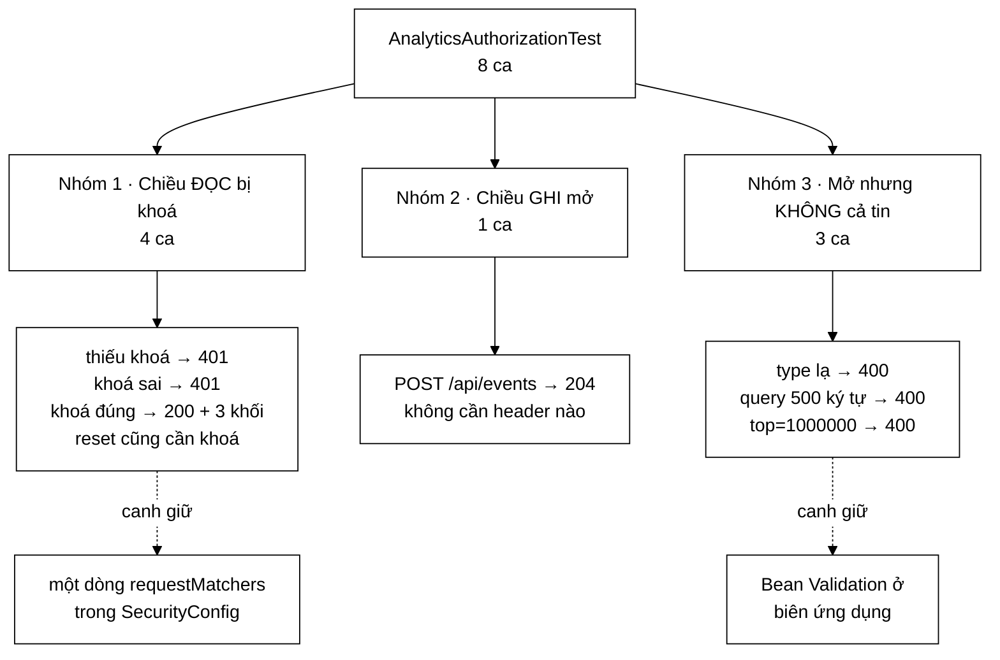

# AnalyticsAuthorizationTest — bộ test duy nhất chứng minh chiều ĐỌC bị khoá còn chiều GHI thì mở, và cả hai đều là cố ý

**File nguồn:** `search-engine/src/test/java/com/vnsearch/analytics/AnalyticsAuthorizationTest.java` (139 dòng)
**Gói:** `com.vnsearch.analytics` · **Khung:** JUnit 5 + Spring Boot Test (MockMvc) · **Số ca:** 8
**Lớp được kiểm:** [`SecurityConfig.md`](../../../../../main/java/com/vnsearch/config/SecurityConfig.md) · [`EventController.md`](../../../../../main/java/com/vnsearch/controller/EventController.md) · [`AdminAnalyticsController.md`](../../../../../main/java/com/vnsearch/controller/AdminAnalyticsController.md)
**Đọc kèm:** [`UsageAnalyticsServiceTest.md`](./UsageAnalyticsServiceTest.md) · [`../auth/AccountAuthorizationTest.md`](../auth/AccountAuthorizationTest.md) · [`../service/SearchEngineFacadeApiTest.md`](../service/SearchEngineFacadeApiTest.md)

---

## 📌 Hiểu trong 30 giây

Bộ test này không kiểm một con số nào. Nó kiểm **ai được đọc con số nào** — và
nơi câu trả lời thật sự nằm không phải trong controller mà trong đúng một dòng
của `SecurityConfig`. Một dòng như vậy không có test đơn vị nào canh được, vì
nó chỉ có hiệu lực khi cả chuỗi filter HTTP chạy thật.

```
   HAI CHIỀU DỮ LIỆU, HAI MỨC QUYỀN — VÀ ĐÓ LÀ CHỦ ĐỀ CỦA CẢ BÀI

   GHI  POST /api/events            →  CÔNG KHAI, 204
        vì nếu bắt xác thực thì chỉ quản trị viên đóng góp
        được số liệu, tức không còn số liệu nào đáng đọc.

   ĐỌC  GET  /api/admin/analytics   →  CẦN X-API-Key, 401 nếu thiếu
        vì số liệu tổng hợp phơi bày người dùng đang tìm gì.

   ⇒ Ranh giới đúng nằm GIỮA hai chiều, không nằm ở một trong hai.
     Bộ test chốt cả hai phía, nên không ai "siết chặt" hay "nới
     lỏng" một nửa mà không làm đỏ một ca.
```

Và hai chú thích trong file ghi lại hai quyết định hạ tầng đã tốn tiền thật:
tắt rate limit để test không xanh vì lý do sai, và `@DirtiesContext` để bộ test
không chết vì `OutOfMemoryError`.



---

## 1. Bố cục: 8 ca chia ba nhóm

```
   ┌─ NHÓM 1 · CHIỀU ĐỌC PHẢI ĐÓNG (4 ca) ─────────────────────┐
   │  khongCoKhoaThiKhongDocDuocSoLieu          → 401           │
   │  khoaSaiCungKhongDocDuoc                   → 401           │
   │  khoaDungThiTraVeDuBaKhoiSoLieu            → 200 + cấu trúc│
   │  datLaiSoLieuCungCanKhoa                   → 401 rồi 204   │
   └────────────────────────────────────────────────────────────┘
   ┌─ NHÓM 2 · CHIỀU GHI PHẢI MỞ (1 ca) ───────────────────────┐
   │  aiCungGuiDuocSuKienSuDung                 → 204           │
   └────────────────────────────────────────────────────────────┘
   ┌─ NHÓM 3 · MỞ KHÔNG CÓ NGHĨA LÀ CẢ TIN (3 ca) ─────────────┐
   │  suKienLaKieuKhongBiTuChoiChuKhongAmThamBoQua → 400        │
   │  truyVanQuaDaiBiTuChoiNgayTaiBienUngDung      → 400        │
   │  thamSoTopBiChanTren                          → 400        │
   └────────────────────────────────────────────────────────────┘
```

Thứ tự này đọc như một lập luận: *đóng cái phải đóng → mở cái phải mở → chứng
minh cái mở vẫn có hàng rào*. Nhóm 3 tồn tại chính vì nhóm 2: mỗi khi mở một
cửa, phải nói được cửa đó chịu tải kiểu gì.

---

## 2. Vì sao bài này không thể là một bài kiểm thử đơn vị

Đây là điểm cần hiểu trước khi đọc bất kỳ ca nào. Javadoc của lớp nói thẳng:

```
   "UsageAnalyticsServiceTest chung minh cac con so dung; no khong noi
    duoc gi ve chuyen AI doc duoc chung."
```

```
   PHÂN QUYỀN NẰM Ở ĐÂU

   AdminAnalyticsController.java   →  KHÔNG có một dòng kiểm quyền nào
                                      (cố ý — xem Javadoc của lớp đó)
   UsageAnalyticsService.java      →  KHÔNG biết gì về HTTP

   SecurityConfig.java             →  ĐÂY:
       .requestMatchers("/api/admin/**", "/actuator/**").hasRole("ADMIN")

   ⇒ Mọi bài test dựng đối tượng bằng `new` đều KHÔNG chạm tới dòng đó.
     Chỉ một request đi qua trọn chuỗi filter mới chạm được.
```

Bốn cách làm hỏng dòng đó mà **trình biên dịch không thấy và mọi test đơn vị
vẫn xanh**, đều được Javadoc của bài liệt kê:

| Thao tác vô hại trông thế nào | Hậu quả |
|---|---|
| Thêm `/api/admin/analytics` vào danh sách `permitAll()` "cho tiện lúc dev" | Toàn bộ truy vấn của mọi người dùng thành công khai |
| Đảo thứ tự hai `requestMatchers` | Luật khớp trước thắng — luật `hasRole` không bao giờ được xét |
| Đổi `@RequestMapping` của controller sang đường dẫn khác | Không còn nằm dưới `/api/admin/**`, rơi vào `anyRequest().denyAll()` hoặc tệ hơn |
| Đổi `hasRole("ADMIN")` thành `authenticated()` | Người dùng thường đọc được bảng quản trị |

Ba trong bốn thao tác trên khiến bảng điều khiển thành công khai **mà không có
bất kỳ dấu hiệu nào**: không ngoại lệ, không log, giao diện vẫn chạy đúng. Đây
là loại lỗi chỉ lộ ra khi đã lộ.

---

## 3. Nhóm 1 — bốn ca dựng một hàng rào có ba mặt

### 3.1 Vì sao cần cả `khongCoKhoa` **và** `khoaSai`

```java
@Test
void khongCoKhoaThiKhongDocDuocSoLieu() throws Exception {
    mockMvc.perform(get("/api/admin/analytics"))
            .andExpect(status().isUnauthorized());
}

@Test
void khoaSaiCungKhongDocDuoc() throws Exception {
    mockMvc.perform(get("/api/admin/analytics").header(KEY_HEADER, "khoa-sai-hoan-toan"))
            .andExpect(status().isUnauthorized());
}
```

Trông như một ca bị chẻ đôi vô ích. Không phải:

```
   HAI CA BẮT HAI LỖI Ở HAI LỚP KHÁC NHAU

   khongCoKhoa  → kiểm SecurityConfig: đường dẫn có nằm trong
                  nhóm hasRole("ADMIN") không.
                  Hỏng khi: ai đó thêm đường dẫn vào permitAll().

   khoaSai      → kiểm ApiKeyAuthFilter: nó có SO SÁNH khoá không,
                  hay chỉ kiểm "header có mặt".
                  Hỏng khi: filter viết
                      if (request.getHeader(HEADER) != null) grantAdmin();
                  ← một cài đặt sai rất tự nhiên, và ca đầu
                    KHÔNG bắt được nó (vì không header thì vẫn 401).
```

Bỏ ca thứ hai đi thì một filter "cứ có header là cho qua" vẫn xanh toàn tập —
và đó chính là mức bảo mật bằng không, chỉ khoác vẻ ngoài của xác thực.

Chi tiết đáng chú ý: khoá sai được chọn là `"khoa-sai-hoan-toan"` — **18 ký tự,
dài hơn `MIN_KEY_LENGTH = 16`**. Nếu chọn một chuỗi ngắn (`"abc"`), ca vẫn xanh
nhưng có thể xanh vì lý do khác (bị loại do quá ngắn) chứ không vì so sánh
đúng. Đây là kiểu chi tiết dễ chọn sai và không ai phát hiện.

### 3.2 `khoaDungThiTraVeDuBaKhoiSoLieu` — ca duy nhất kiểm chiều "phải mở được"

```java
mockMvc.perform(get("/api/admin/analytics").header(KEY_HEADER, VALID_KEY))
        .andExpect(status().isOk())
        .andExpect(jsonPath("$.generatedAt").exists())
        .andExpect(jsonPath("$.traffic.searches").exists())
        .andExpect(jsonPath("$.crawl.documents").exists())
        .andExpect(jsonPath("$.index.terms").exists());
```

Nếu chỉ có hai ca 401, một `SecurityConfig` viết `.anyRequest().denyAll()` cho
mọi thứ vẫn xanh — và bảng điều khiển chết hoàn toàn. Ca này là **nửa còn lại
của ranh giới**.

Bốn phép `jsonPath` không phải trang trí. Chúng chốt rằng phản hồi có đủ **ba
khối độc lập**, mỗi khối đến từ một nguồn khác nhau:

```
   AdminDashboard
   ├─ generatedAt          Instant.now() — dấu hiệu phản hồi được dựng thật
   ├─ traffic.searches     ← UsageAnalyticsService.snapshot()   (bộ nhớ, RAM)
   ├─ crawl.documents      ← SearchEngineFacade.getCorpusStats() (trạng thái dẫn xuất)
   └─ index.terms          ← SearchEngineFacade.getTermCount()   (chỉ mục)

   Một khối null vì bean không được tiêm, một tên trường bị đổi khi
   tái cấu trúc record — giao diện sẽ hiện ô trống, KHÔNG có lỗi nào
   được ném. jsonPath(...).exists() là thứ duy nhất bắt được.
```

Đáng nói: bài dùng `.exists()` chứ không so giá trị. Đó là lựa chọn đúng ở đây
— giá trị thật phụ thuộc corpus và các bài chạy trước, còn *cấu trúc* thì là
hợp đồng với browser-app. Kiểm giá trị ở đây sẽ tạo một bài test chập chờn.

### 3.3 `datLaiSoLieuCungCanKhoa` — ca duy nhất trong nhóm gọi hai lần

```java
mockMvc.perform(post("/api/admin/analytics/reset"))
        .andExpect(status().isUnauthorized());

mockMvc.perform(post("/api/admin/analytics/reset").header(KEY_HEADER, VALID_KEY))
        .andExpect(status().isNoContent());
```

`reset` là một endpoint **có hậu quả**: nó xoá sạch mọi số liệu sử dụng. Nếu
`/api/admin/analytics` (GET) được bảo vệ mà `/api/admin/analytics/reset` thì
không, bất kỳ ai cũng xoá được bảng điều khiển bằng một dòng `curl`.

Ca này chốt rằng bảo vệ đến từ **mẫu đường dẫn `/api/admin/**`** chứ không phải
từ một luật viết riêng cho từng endpoint — nên endpoint quản trị thứ chín thêm
vào mai này cũng được bảo vệ mà không ai phải nhớ gì.

---

## 4. Nhóm 2 và 3 — mở cửa, rồi chứng minh cửa đó có bản lề

### 4.1 `aiCungGuiDuocSuKienSuDung`

```java
mockMvc.perform(post("/api/events")
                .contentType(MediaType.APPLICATION_JSON)
                .content("""
                        {"type":"search","sessionId":"phien-1","query":"ha noi",
                         "resultCount":12,"tookMs":18}"""))
        .andExpect(status().isNoContent());
```

Javadoc của ca nói rõ vì sao nó tồn tại: *"nếu đóng lại thì chỉ quản trị viên
mới góp được số liệu, tức không còn số liệu nào đáng đọc."*

Điều ca này canh giữ không hiển nhiên: `SecurityConfig` mở `/api/events` theo
**phương thức**, không theo đường dẫn.

```java
.requestMatchers(HttpMethod.POST, "/api/events").permitAll()
```

```
   VÌ SAO RÀNG THEO PHƯƠNG THỨC LẠI QUAN TRỌNG

   Nếu viết .requestMatchers("/api/events").permitAll()  (không nêu POST)
   thì một GET /api/events thêm vào sau này — ví dụ một endpoint
   "xem lại sự kiện gần đây" cho tiện gỡ lỗi — sẽ TỰ ĐỘNG thừa kế
   quyền công khai, và phơi bày đúng thứ mà chiều ĐỌC đang che.

   Ca test hiện tại KHÔNG bắt được sai lệch đó (nó chỉ gửi POST).
   Nhưng nó khoá được vế còn lại: POST phải luôn mở.
```

### 4.2 `suKienLaKieuKhongBiTuChoiChuKhongAmThamBoQua` — cái tên là toàn bộ lập luận

```java
mockMvc.perform(post("/api/events")
                .contentType(MediaType.APPLICATION_JSON)
                .content("{\"type\":\"khong-ton-tai\",\"sessionId\":\"phien-1\"}"))
        .andExpect(status().isBadRequest());
```

`EventController` xử lý `type` bằng `switch`, và nhánh `default` trả `400`. Một
nhánh `default -> { }` (bỏ qua trong im lặng) trông "an toàn" hơn và là lựa chọn
mặc định của rất nhiều người viết:

```
   HAI CÁCH XỬ LÝ type LẠ, VÀ HAI TRIỆU CHỨNG KHÁC NHAU

   default -> {}                 default -> 400
   ───────────────────────       ─────────────────────────────
   Giao diện gửi "SEARCH"        Lập trình viên frontend thấy
   thay vì "search".             400 ngay ở lần thử đầu tiên.
   Máy chủ trả 204 "OK".
   Không log gì.                 Sửa mất 30 giây.
   Bảng điều khiển trống.

   Ba tuần sau có người hỏi
   "sao dashboard không có số?"
   và không ai nối được nó với
   một lần đổi tên sự kiện.
```

Ca này là ví dụ rõ nhất trong repo cho nguyên tắc *hỏng to còn hơn hỏng âm
thầm* — cùng nguyên tắc mà `SecurityConfig.requireAdminApiKey()` áp dụng ở tầng
khởi động.

### 4.3 Hai ca chặn kích thước — hai tầng bảo vệ khác nhau

```java
// query 500 ký tự, trong khi @Size(max = 200)
.content("{\"type\":\"search\",\"sessionId\":\"phien-1\",\"query\":\""
        + "x".repeat(500) + "\"}")
// → 400

// top vượt @Max(50)
get("/api/admin/analytics").param("top", "1000000")
// → 400
```

Hai ca này kiểm hai thứ nghe giống nhau nhưng bảo vệ hai tài nguyên khác nhau:

| Ca | Chặn ở đâu | Bảo vệ khỏi cái gì |
|---|---|---|
| `truyVanQuaDaiBiTuChoiNgayTaiBienUngDung` | `@Size(max = 200)` trên `EventRequest.query` | Chuỗi rác do bên ngoài gửi lan vào bảng `queryCounts` trong heap |
| `thamSoTopBiChanTren` | `@Max(50)` trên tham số `top` | `?top=1000000` biến một endpoint hiển thị thành một phép cấp phát lớn |

```
   VÌ SAO "TỪ CHỐI NGAY TẠI BIÊN" CHỨ KHÔNG "CẮT NGẦM"

   UsageAnalyticsService CŨNG cắt chuỗi (MAX_QUERY_CHARS = 120)
   — lớp dịch vụ không tin lớp gọi nó. Vậy vì sao còn cần @Size?

   Vì hai lớp trả lời hai câu khác nhau:
     @Size ở controller     : "yêu cầu này KHÔNG HỢP LỆ"  → 400, người gửi biết
     trimTo ở service       : "dù sao tôi cũng không nổ"  → phòng thủ chiều sâu

   Bỏ @Size đi: máy chủ trả 204, và truy vấn 500 ký tự lặng lẽ bị
   cắt còn 120 rồi vào bảng xếp hạng. Không ai sai, không ai biết.
```

Chú ý ca `thamSoTopBiChanTren` **có gửi khoá đúng**. Đó là chi tiết cố ý: nếu
không gửi, request dừng ở 401 và ca sẽ xanh mà không hề chạm tới Bean Validation
— xanh vì lý do sai. Đây là cùng loại bẫy mà chú thích về rate limit ở đầu file
đang nói tới.

---

## 5. Hai chú thích hạ tầng — phần quý nhất của file

### 5.1 `rate-limit.enabled=false` — chống "xanh vì lý do khác"

```java
// Tat gioi han tan suat: bai nay do PHAN QUYEN, va mot bo gioi han bat
// len co the tra 429 truoc khi request cham toi lop xac thuc — khi do
// bai kiem thu se "xanh" vi mot ly do khac han dieu no dinh kiem.
"app.security.rate-limit.enabled=false"
```

```
   THỨ TỰ FILTER LÀ NGUYÊN NHÂN

   SecurityConfig đăng ký RateLimitFilter với
       registration.setOrder(Integer.MIN_VALUE)   ← TRƯỚC mọi filter khác

   nên đường đi thật là:

       request → RateLimitFilter → ApiKeyAuthFilter → authorizeHttpRequests

   Nếu gáo token cạn (các bài test dùng CHUNG một gáo, tính theo địa
   chỉ, và mọi bài đều gọi từ 127.0.0.1):

       khongCoKhoa...  kỳ vọng 401, nhận 429  → ĐỎ, dễ nhận ra
       nhưng ca nào kỳ vọng "không 200" thì
       429 cũng thoả  → XANH, và không kiểm gì cả

   Đây là loại lỗi chập chờn tốn nhiều giờ nhất để truy, vì nó phụ
   thuộc vào SỐ LƯỢNG và THỨ TỰ các bài chạy trước.
```

`pom.xml` đã tắt rate limit cho toàn bộ surefire; dòng ở đây lặp lại điều đó
**tại chỗ**, để bài không phụ thuộc vào một cấu hình ở tệp khác. Trùng lặp có
chủ đích.

### 5.2 `@DirtiesContext` — chú thích ghi lại một `OutOfMemoryError` có thật

```java
@DirtiesContext(classMode = DirtiesContext.ClassMode.AFTER_CLASS)
```

Chú thích đi kèm là bản ghi sự cố, không phải diễn giải mã:

```
   VÌ SAO KHÔNG DÙNG CHUNG CONTEXT

   Spring GIỮ LẠI mọi ApplicationContext để tái sử dụng, khoá theo
   TỔ HỢP CẤU HÌNH. Mỗi @SpringBootTest có properties khác nhau tạo
   một context riêng — và mỗi context nạp cả chỉ mục 31.030 tài liệu.

       context #1  ~400 MB
       context #2  ~400 MB     ← vẫn còn sống, chờ tái dùng
       context #3  ~400 MB     ← OutOfMemoryError

   Sự cố này gặp NGAY khi thêm lớp kiểm thử tích hợp thứ hai.
   Nó cũng chính là lý do CorpusStats bỏ HashSet để dùng
   BloomFilter — xem CorpusStatsTest mục về đếm đích liên kết.

   ĐÁNH ĐỔI: lớp này chậm hơn vài giây vì không chia sẻ context.
   Đổi lại bộ test chạy được.

   Và nó còn ĐÚNG VỀ NGỮ NGHĨA: các ca ở đây GHI vào bộ đếm số liệu
   (POST /api/events) và gọi reset(). Context thật sự "bẩn" sau khi
   chạy — một bài sau dùng lại nó sẽ thấy số liệu không như mong đợi.
```

Đây là điểm hiếm: một chú thích tối ưu hoá hạ tầng lại **trùng khớp** với một
lập luận về tính đúng đắn. Thường thì hai thứ đó kéo về hai hướng.

### 5.3 Khoá test đặt trong `properties` của chính lớp

```java
@SpringBootTest(properties = {
        "app.security.admin-api-key=khoa-kiem-thu-du-dai-32-ky-tu-000",
        ...
})
```

Chú thích nói: *"SecurityConfig khong cho khoi dong neu thieu, nen bai nay cung
dong thoi chung minh dieu do van dung."* Một ràng buộc phụ: nếu ai đó gỡ
`requireAdminApiKey()` đi, bài này vẫn xanh — nên vế "không có khoá thì không
khởi động" thực ra **không** được bài này canh. Vế đó do
[`VnSearchApplicationTests.md`](../VnSearchApplicationTests.md) gánh, vì nó nạp
context với khoá lấy từ `pom.xml`.

---

## 6. Kỹ thuật đáng học lại từ bộ test này

```
   ① KIỂM RANH GIỚI Ở CẢ HAI CHIỀU
      401 khi thiếu khoá  ✓
      200 khi có khoá     ✓   ← thiếu vế này thì denyAll() vẫn xanh
      204 cho endpoint công khai ✓

   ② TÁCH "KHÔNG CÓ KHOÁ" KHỎI "KHOÁ SAI"
      Hai ca bắt hai lỗi ở hai lớp khác nhau.
      Gộp lại thì một filter "cứ có header là cho qua" vẫn xanh.

   ③ CHỌN DỮ LIỆU SAI CHO ĐÚNG LÝ DO
      "khoa-sai-hoan-toan" dài 18 ký tự > MIN_KEY_LENGTH = 16
      → ca xanh vì SO SÁNH đúng, không vì bị loại do quá ngắn.

   ④ TẮT MỌI THỨ CÓ THỂ TRẢ VỀ MÃ LỖI KHÁC
      rate-limit.enabled=false, kèm chú thích nói rõ vì sao.
      Một bài test xanh vì 429 là một bài test không tồn tại.

   ⑤ NHỚ GỬI KHOÁ Ở CA KHÔNG NÓI VỀ KHOÁ
      thamSoTopBiChanTren gửi VALID_KEY, nếu không nó dừng ở 401
      và không bao giờ chạm tới @Max(50).

   ⑥ jsonPath(...).exists() CHO CẤU TRÚC, KHÔNG PHẢI GIÁ TRỊ
      Cấu trúc là hợp đồng với giao diện; giá trị phụ thuộc corpus
      và các bài chạy trước — kiểm giá trị sẽ tạo bài chập chờn.

   ⑦ CHÚ THÍCH LÀ BẢN GHI SỰ CỐ
      @DirtiesContext đi kèm cả nguyên nhân (3 context × 400 MB),
      cả đánh đổi (chậm vài giây), cả lý do ngữ nghĩa.
```

---

## 7. Hướng dẫn thực hành

### 7.1 Chạy

```powershell
cd search-engine
.\mvnw.cmd test "-Dtest=AnalyticsAuthorizationTest"
.\mvnw.cmd test "-Dtest=AnalyticsAuthorizationTest#khoaSaiCungKhongDocDuoc"
```

(Lưu ý: trên PowerShell phải bọc `-Dtest=...` trong nháy kép, nếu không dấu `=`
bị nuốt và Maven chạy toàn bộ bộ test.)

Bài này khởi động cả `ApplicationContext`, nên nó chậm hơn hẳn các bài đơn vị —
đó là cái giá phải trả để chạm được tới chuỗi filter thật.

### 7.2 Đọc kết quả

```
[INFO] Running com.vnsearch.analytics.AnalyticsAuthorizationTest
[INFO] Tests run: 8, Failures: 0, Errors: 0, Skipped: 0
```

Báo cáo chi tiết:
`search-engine/target/surefire-reports/com.vnsearch.analytics.AnalyticsAuthorizationTest.txt`

Khi đỏ, MockMvc in cả request lẫn response — đọc dòng `Status = ` trước tiên.
Thấy `429` nghĩa là rate limit đã bật lại ở đâu đó, không phải lỗi phân quyền.

### 7.3 Tự kiểm chứng — cố tình làm hỏng để xem ca nào đỏ

| Sửa gì trong mã nguồn | Ca dự kiến đỏ |
|---|---|
| Thêm `/api/admin/analytics` vào danh sách `permitAll()` của `SecurityConfig` | `khongCoKhoaThiKhongDocDuocSoLieu` **và** `khoaSaiCungKhongDocDuoc` |
| Trong `ApiKeyAuthFilter`, cấp quyền khi header **có mặt** thay vì khi **khớp** | Chỉ `khoaSaiCungKhongDocDuoc` |
| Đổi `hasRole("ADMIN")` thành `denyAll()` | `khoaDungThiTraVeDuBaKhoiSoLieu`, `datLaiSoLieuCungCanKhoa` (nửa sau) |
| Bỏ dòng `.requestMatchers(HttpMethod.POST, "/api/events").permitAll()` | `aiCungGuiDuocSuKienSuDung` và cả hai ca ở nhóm 3 dùng `/api/events` |
| Đổi `default -> return badRequest()` thành `default -> { }` trong `EventController` | `suKienLaKieuKhongBiTuChoiChuKhongAmThamBoQua` |
| Bỏ `@Size(max = 200)` khỏi `EventRequest.query` | `truyVanQuaDaiBiTuChoiNgayTaiBienUngDung` |
| Bỏ `@Max(50)` khỏi tham số `top` của `AdminAnalyticsController` | `thamSoTopBiChanTren` |
| Bỏ `@Validated` trên `AdminAnalyticsController` | `thamSoTopBiChanTren` (annotation trên tham số không có hiệu lực nếu thiếu nó) |
| Đổi tên trường `terms` trong `AdminDashboard.IndexStats` | `khoaDungThiTraVeDuBaKhoiSoLieu` |
| Xoá `@DirtiesContext` | Không ca nào đỏ ngay — nhưng bộ test đầy đủ có thể chết vì `OutOfMemoryError`. Đây là một khoảng trống thật, xem mục 9. |

### 7.4 Cạm bẫy khi viết thêm ca cho lớp này

```
   ✗ Đừng quên gửi khoá ở ca không nói về khoá.
     Mọi ca chạm /api/admin/** mà không có header sẽ dừng ở 401,
     và ca sẽ "xanh" mà không chạm tới thứ nó định kiểm.

   ✗ Đừng assert giá trị số trong phản hồi analytics.
     Bộ đếm là trạng thái chia sẻ trong context. Ca chạy sau thấy
     số của ca chạy trước — trừ khi bạn gọi reset() ngay đầu ca,
     và khi đó bạn lại phụ thuộc thứ tự chạy.

   ✗ Đừng thêm một @SpringBootTest với properties MỚI mà không cân
     nhắc bộ nhớ. Mỗi tổ hợp properties khác nhau = một context nữa
     × ~400 MB. Ưu tiên dùng lại đúng bộ properties đã có.

   ✗ Đừng bật lại rate limit "cho giống thật".
     Muốn kiểm rate limit thì viết một lớp RIÊNG có properties riêng,
     đừng trộn vào bài phân quyền.

   ✗ Đừng tin MockMvc phản ánh đúng mã trạng thái khi có 403.
     MockMvc mặc định KHÔNG thực hiện lần gửi ERROR của servlet
     container — chính là kịch bản mà SecurityConfig ghi chú dài
     về dispatcherTypeMatchers(DispatcherType.ERROR). Ca 403 phải
     chạy trên máy chủ thật, xem AccountAuthorizationTest.
```

---

## 8. Bảng tổng hợp 8 ca

| # | Ca test | Nhóm | Tính chất được canh giữ |
|---|---|---|---|
| 1 | **`khongCoKhoaThiKhongDocDuocSoLieu`** | 1 | **`/api/admin/**` nằm trong nhóm `hasRole("ADMIN")`** |
| 2 | **`khoaSaiCungKhongDocDuoc`** | 1 | **Filter SO SÁNH khoá, không chỉ kiểm header có mặt** |
| 3 | `khoaDungThiTraVeDuBaKhoiSoLieu` | 1 | Nửa còn lại của ranh giới + cấu trúc ba khối của `AdminDashboard` |
| 4 | `datLaiSoLieuCungCanKhoa` | 1 | Endpoint có hậu quả cũng được mẫu đường dẫn bảo vệ |
| 5 | **`aiCungGuiDuocSuKienSuDung`** | 2 | **Chiều GHI công khai — không có nó thì không còn số liệu** |
| 6 | `suKienLaKieuKhongBiTuChoiChuKhongAmThamBoQua` | 3 | `type` lạ → 400, không im lặng bỏ qua |
| 7 | `truyVanQuaDaiBiTuChoiNgayTaiBienUngDung` | 3 | `@Size(max=200)` chặn tại biên, trước khi vào heap |
| 8 | `thamSoTopBiChanTren` | 3 | `@Max(50)` chặn phép cấp phát do bên gọi điều khiển |

---

## 9. Khoảng trống chưa phủ

```
   ✗ GET /api/events — SecurityConfig mở /api/events theo PHƯƠNG THỨC
     (chỉ POST). Không ca nào chứng minh ràng buộc đó: mọi ca đều gửi
     POST. Nếu ai đó đổi thành .requestMatchers("/api/events") không
     nêu HttpMethod, cả 8 ca vẫn xanh.

   ✗ Người dùng ĐÃ ĐĂNG NHẬP nhưng KHÔNG phải admin → phải 403.
     Bài này chỉ đi đường X-API-Key. Đường token do
     AccountAuthorizationTest phủ, và đó là bài duy nhất chạm được
     tới lập luận dài về DispatcherType.ERROR trong SecurityConfig.

   ✗ Ứng dụng KHÔNG khởi động khi thiếu app.security.admin-api-key.
     requireAdminApiKey() ném IllegalStateException ở tầng khởi động,
     và không bài nào trong repo khẳng định điều đó — mọi bài đều
     ĐƯỢC CẤP khoá. Gỡ hẳn phép kiểm đi thì toàn bộ bộ test vẫn xanh.

   ✗ Khoá đúng độ dài nhưng < MIN_KEY_LENGTH = 16 ký tự.
     Nhánh thứ hai của requireAdminApiKey() không được ca nào chạm.

   ✗ /actuator/** — cùng nằm trong luật hasRole("ADMIN") với
     /api/admin/**, nhưng /actuator/health/** và /actuator/prometheus
     được mở riêng. Bốn đường dẫn, không ca nào kiểm.

   ✗ Rate limit — bị tắt ở đây (đúng), nhưng không có bài nào bật nó
     lên để kiểm 429. RateLimitFilter hiện không có gì chứng minh.
```

Ca đáng viết trước nhất là ca cho ràng buộc phương thức, vì nó rẻ và bịt một
đường lọt thật:

```java
@Test
void chiPOSTDuocMoTaiApiEvents() throws Exception {
    // GET /api/events không tồn tại như một handler, nhưng nó KHÔNG
    // được rơi vào permitAll(): nó phải bị chặn ở tầng phân quyền,
    // không phải trả 404 sau khi đã đi qua cửa mở.
    mockMvc.perform(get("/api/events"))
            .andExpect(status().isUnauthorized());
}
```

Ca cho "thiếu khoá thì không khởi động" thì đắt hơn (phải dựng một context
riêng và bắt lỗi khởi động), nhưng nó là ca duy nhất canh được một quyết định
mà `SecurityConfig` dành nguyên một đoạn Javadoc để biện minh — hiện là một
quyết định không có gì bảo vệ.

---

## 10. Liên kết

- Nơi luật phân quyền thật sự nằm, kèm lập luận về `DispatcherType.ERROR` và về việc tách `/api/health`: [`SecurityConfig.md`](../../../../../main/java/com/vnsearch/config/SecurityConfig.md)
- Vì sao chiều GHI công khai còn chiều ĐỌC thì không — lập luận gốc, ba lớp chặn: [`EventController.md`](../../../../../main/java/com/vnsearch/controller/EventController.md)
- Nguồn của ba khối số liệu mà ca `khoaDungThiTraVeDuBaKhoiSoLieu` kiểm cấu trúc: [`AdminAnalyticsController.md`](../../../../../main/java/com/vnsearch/controller/AdminAnalyticsController.md)
- Bộ test chứng minh các **con số** đúng — bài này chứng minh **ai đọc được** chúng: [`UsageAnalyticsServiceTest.md`](./UsageAnalyticsServiceTest.md)
- Đường xác thực còn lại (token, tài khoản), nơi ranh giới 401 ↔ 403 được chốt: [`../auth/AccountAuthorizationTest.md`](../auth/AccountAuthorizationTest.md)
- Bài kiểm phân quyền trên **máy chủ thật** (`RANDOM_PORT`) thay vì MockMvc, phủ nốt phía `/api/admin/stats` và `/api/admin/crawl`: [`../service/SearchEngineFacadeApiTest.md`](../service/SearchEngineFacadeApiTest.md)
- Bài chỉ nạp context, nhưng là bài duy nhất chạm gián tiếp tới `requireAdminApiKey()` khi khởi động: [`../VnSearchApplicationTests.md`](../VnSearchApplicationTests.md)
