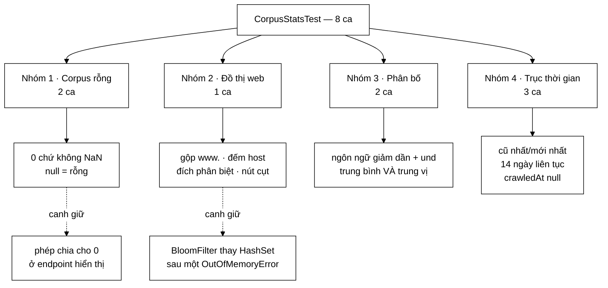

# CorpusStatsTest — bộ test tự cấp một hàm đo độ dài khác hẳn bản chạy thật, và chính điều đó chứng minh vì sao tham số ấy tồn tại

**File nguồn:** `search-engine/src/test/java/com/vnsearch/analytics/CorpusStatsTest.java` (142 dòng)
**Gói:** `com.vnsearch.analytics` · **Khung:** JUnit 5 · **Số ca:** 8
**Lớp được kiểm:** [`CorpusStats.md`](../../../../../main/java/com/vnsearch/analytics/CorpusStats.md)
**Đọc kèm:** [`UsageAnalyticsServiceTest.md`](./UsageAnalyticsServiceTest.md) · [`../datastructure/BloomFilterTest.md`](../datastructure/BloomFilterTest.md) · [`../datastructure/MinHeapTest.md`](../datastructure/MinHeapTest.md)

---

## 📌 Hiểu trong 30 giây

`CorpusStats.from(...)` tính mười ba con số trong **một lượt duyệt** corpus.
Bộ test này gọi nó tám lần với tám corpus tí hon dựng bằng tay, mỗi lần chốt
một nhóm con số.

Điều đáng chú ý nhất nằm ở dòng thứ tư của file, trước cả ca test đầu tiên:

```
   private static final ToIntFunction<WebDocument> BODY_CHARS =
           document -> document.getBodyText() == null ? 0
                     : document.getBodyText().length();

   ĐO KÝ TỰ THÂN BÀI — trong khi bản chạy thật truyền vào
   SearchIndex::getDocLength (SỐ TOKEN).

   Hai hàm khác nhau hoàn toàn. Và đó KHÔNG phải là gian lận:
   nó là lý do tồn tại của tham số docLength.
```

```
   VÌ SAO ĐỘ DÀI PHẢI NHẬN TỪ NGOÀI VÀO

   ① Bản chạy thật: WebDocument lấy từ chỉ mục KHÔNG mang thân bài
     (thân bài nằm ở dạng nén). getBodyText().length() ở đó cho ra
     0 cho MỌI tài liệu — một con số TRÔNG NHƯ THẬT mà sai hoàn toàn.

   ② Bài kiểm thử: nếu lớp tự đọc độ dài từ chỉ mục, thì để kiểm
     một phép chia trung bình phải dựng cả một InvertedIndex.

   ⇒ Cùng một quyết định thiết kế phục vụ cả hai. Bộ test là BẰNG
     CHỨNG SỐNG cho điều đó, không phải một lời khẳng định suông.
```



---

## 1. Bố cục: 8 ca chia bốn nhóm

Bộ test không dùng `@Nested`, nhưng đọc theo thứ tự trong file thì bốn nhóm
hiện ra rõ:

```
   ┌─ NHÓM 1 · CORPUS RỖNG (2 ca) ─────────────────────────────┐
   │  corpusRongTraVeSoKhongChuKhongPhaiNaN     ← quan trọng   │
   │  danhSachNullDuocDoiXuNhuCorpusRong                       │
   └───────────────────────────────────────────────────────────┘
   ┌─ NHÓM 2 · ĐỒ THỊ WEB (1 ca, nhưng 7 phép khẳng định) ────┐
   │  demTrangHostVaLienKet                     ← ca dày nhất  │
   └───────────────────────────────────────────────────────────┘
   ┌─ NHÓM 3 · PHÂN BỐ (2 ca) ─────────────────────────────────┐
   │  phanBoNgonNguSapXepGiamDan                               │
   │  baoCaTrungBinhVaTrungViDoDaiThanBai                      │
   └───────────────────────────────────────────────────────────┘
   ┌─ NHÓM 4 · TRỤC THỜI GIAN (3 ca) ──────────────────────────┐
   │  mocThoiGianCuNhatVaMoiNhat                               │
   │  chuoiNgayLienTucVaDuDoDai                                │
   │  trangKhongCoMocThoiGianKhongLamNgaGiCa                   │
   └───────────────────────────────────────────────────────────┘
```

Toàn bộ dữ liệu vào đi qua đúng một hàm dựng:

```java
private static WebDocument doc(String url, String language, List<String> outlinks,
                                String body, Instant crawledAt) {
    WebDocument document = new WebDocument(0, url, "Tieu de", "mo ta",
            body, outlinks, crawledAt);
    document.setLanguage(language);
    return document;
}
```

Năm tham số, và **đúng năm thứ mà `CorpusStats` đọc**. Tiêu đề và mô tả bị đóng
cứng thành `"Tieu de"`/`"mo ta"` — chúng không ảnh hưởng con số nào, nên để
chúng thay đổi giữa các ca chỉ làm người đọc phải kiểm chứng lại rằng chúng
không quan trọng. Hàm dựng này là một bản liệt kê ngầm: *đây là bề mặt đầu vào
thật của lớp*.

---

## 2. Nhóm 1 — hai ca chặn `NaN` khỏi mặt bảng điều khiển

```java
@Test
void corpusRongTraVeSoKhongChuKhongPhaiNaN() {
    CorpusStats stats = CorpusStats.from(List.of(), BODY_CHARS, ZONE);

    assertEquals(0, stats.documents());
    assertEquals(0.0, stats.avgOutlinks());
    assertEquals(0.0, stats.avgDocLength());
    assertNull(stats.oldestCrawledAt());
    assertTrue(stats.topHosts().isEmpty());
    assertTrue(stats.languages().isEmpty());
}
```

Tên ca nói đúng thứ nó canh: **không phải "trả về rỗng", mà "trả về số 0 chứ
không phải `NaN`"**.

```
   VÌ SAO NaN LÀ THỨ ĐÁNG SỢ Ở ĐÂY

   Thân hàm from() có:
       (double) totalOutlinks / size
       (double) totalTokens   / size
       lengths[size / 2]

   Với size == 0:
       0.0 / 0        →  NaN     (KHÔNG ném ngoại lệ!)
       lengths[0]     →  ArrayIndexOutOfBoundsException

   Phép chia số thực cho 0 trong Java KHÔNG nổ. Nó cho NaN,
   và NaN đi tiếp một cách lặng lẽ:

       Jackson tuần tự hoá NaN  →  JSON KHÔNG HỢP LỆ
       (JSON không có ký hiệu NaN)
       →  browser-app nhận JSON hỏng, JSON.parse ném lỗi
       →  TOÀN BỘ bảng điều khiển trắng, không chỉ một ô

   Triệu chứng thật: bảng điều khiển chạy hoàn hảo trên máy có
   corpus, và trắng trơn với người vừa clone repo về chưa crawl.
```

Chốt chặn thật nằm ở ba dòng đầu `from()`:

```java
if (documents == null || documents.isEmpty()) {
    return empty();
}
```

Hai ca của nhóm 1 canh **hai vế của điều kiện đó**, và đây là lý do
`danhSachNullDuocDoiXuNhuCorpusRong` không thừa dù chỉ có một phép khẳng định:

```
   documents == null  ←  danhSachNullDuocDoiXuNhuCorpusRong
   documents.isEmpty() ←  corpusRongTraVeSoKhongChuKhongPhaiNaN

   Bỏ vế null đi: NullPointerException ngay tại vòng lặp for.
   Đường đi này CÓ THẬT — SearchEngineFacade gọi
   current.getAllDocuments().values(), và một chỉ mục chưa dựng
   xong có thể trả về null tuỳ cài đặt.
```

---

## 3. Nhóm 2 — một ca, bảy phép khẳng định, và bốn quyết định thiết kế

```java
CorpusStats stats = CorpusStats.from(List.of(
        doc("https://vnexpress.net/a", "vi",
                List.of("https://vnexpress.net/b", "https://tuoitre.vn/x"),
                "noi dung", Instant.parse("2026-08-09T08:00:00Z")),
        doc("https://www.vnexpress.net/b", "vi",
                List.of("https://tuoitre.vn/x"),
                "noi dung dai hon", Instant.parse("2026-08-10T08:00:00Z")),
        doc("https://tuoitre.vn/x", "en", List.of(),
                "content", Instant.parse("2026-08-10T09:00:00Z"))), BODY_CHARS, ZONE);

assertEquals(3, stats.documents());
assertEquals(2, stats.distinctHosts());
assertEquals(3, stats.totalOutlinks());
assertEquals(2, stats.distinctLinkTargets());
assertEquals(1.0, stats.avgOutlinks(), 1e-9);
assertEquals(1, stats.danglingDocuments());
assertEquals("vnexpress.net", stats.topHosts().get(0).label());
assertEquals(2, stats.topHosts().get(0).count());
```

Ba tài liệu trông đơn giản, nhưng chúng được dựng để mỗi con số ra một giá trị
**khác nhau** — đó là điểm cốt lõi.

```
   ĐỒ THỊ MÀ BA TÀI LIỆU NÀY TẠO RA

        vnexpress.net/a ──┬──→ vnexpress.net/b
                          └──→ tuoitre.vn/x
                                    ↑
    www.vnexpress.net/b ────────────┘

        tuoitre.vn/x  (không có liên kết ra)  ← NÚT CỤT

   documents            = 3
   distinctHosts        = 2   (www. bị bỏ ⇒ hai trang vnexpress gộp một host)
   totalOutlinks        = 3   (2 + 1 + 0, TÍNH CẢ TRÙNG)
   distinctLinkTargets  = 2   (/b và /x — /x lặp lại nên chỉ đếm một)
   avgOutlinks          = 1.0 (3 / 3)
   danglingDocuments    = 1
   topHosts[0]          = ("vnexpress.net", 2)
```

Bảy giá trị, và **không giá trị nào trùng giá trị nào ngoài `distinctHosts` với
`distinctLinkTargets`** (cùng bằng 2). Đó là kỷ luật dựng dữ liệu quan trọng
nhất của kiểu ca test này:

```
   NẾU DỰNG CORPUS "TRÒN TRỊA" HƠN — ví dụ 3 trang, mỗi trang
   2 liên kết, tất cả khác host — thì:

       documents = 3, distinctHosts = 3, totalOutlinks = 6,
       distinctTargets = 6, avgOutlinks = 2.0, dangling = 0

   Một cài đặt trả về documents.size() cho CẢ distinctHosts
   vẫn xanh. Một cài đặt quên bỏ tiền tố "www." vẫn xanh.
   Một cài đặt nhầm distinctTargets với totalOutlinks vẫn xanh.

   Corpus lệch, không đối xứng, mới phân biệt được các cài đặt sai.
```

### 3.1 `distinctHosts = 2` — quyết định "bỏ tiền tố `www.`"

Chú thích ngay trong ca:

```java
// www. bi bo nen hai trang vnexpress gop lam mot host.
```

`hostOf()` cắt `"www."` khỏi đầu tên miền. Không cắt thì `vnexpress.net` và
`www.vnexpress.net` thành hai dòng riêng trên bảng "tên miền nhiều trang nhất"
— và với một corpus tin tức thật, gần như mọi tên miền sẽ bị chẻ đôi, khiến
bảng xếp hạng vô dụng.

Chú ý: cùng logic `hostOf()` được lặp lại trong `UsageAnalyticsService` (một
bản `static` riêng, gần như giống hệt). Hai lớp, hai bản sao — một chỗ yếu thật
sự của mã nguồn, và cũng là lý do
[`UsageAnalyticsServiceTest`](./UsageAnalyticsServiceTest.md) phải có một ca
`gopLienKetTheoTenMien` riêng cho đúng hành vi này.

### 3.2 `distinctLinkTargets = 2` — con số **xấp xỉ** duy nhất trong lớp

Đây là phép khẳng định thú vị nhất của cả file, vì nó là phép khẳng định **chính
xác** trên một đại lượng **được thiết kế để không chính xác**.

```
   PHÍA SAU distinctLinkTargets LÀ MỘT BLOOM FILTER

   Bản đầu: HashSet<String> mọi đích liên kết.
   Trên corpus thật — 31.030 trang × ~69 liên kết —
   đó là 2,1 TRIỆU chuỗi URL trong heap, chỉ để hiện một con số.

   Nó đã gây OutOfMemoryError khi hai ApplicationContext cùng sống
   trong một JVM lúc chạy kiểm thử. (Cùng sự cố khiến
   AnalyticsAuthorizationTest phải mang @DirtiesContext.)

   Bloom Filter: ~9,6 bit / phần tử ở FPR 1% ⇒ vài MB thay vì vài trăm.

   SAI SỐ ĐI VỀ MỘT PHÍA:
       chỉ có dương tính giả ("đã gặp rồi" cho URL chưa gặp)
       ⇒ distinctLinkTargets chỉ có thể ĐẾM THIẾU, không bao giờ THỪA.
```

Vì sao ca vẫn `assertEquals(2, ...)` được, dù đại lượng là xấp xỉ:

```
   newTargetFilter(3) → capacity = max(3 × 64, 1000) = 1000
   Số phần tử thật đưa vào: 3 URL.

   Với 3 phần tử trong một bộ lọc định cỡ cho 1000, xác suất dương
   tính giả gần như bằng 0 — thấp hơn nhiều so với mức 1% danh nghĩa.

   ⇒ Ở quy mô này, ca test TẤT ĐỊNH. Nhưng nó KHÔNG chứng minh gì
     về hành vi ở quy mô thật. Xem mục 8.
```

### 3.3 `totalOutlinks` với `distinctLinkTargets` — hai con số kể hai câu chuyện

| Con số | Đếm gì | Nói lên điều gì |
|---|---|---|
| `totalOutlinks = 3` | Mọi liên kết, **tính cả trùng** | Mật độ liên kết của corpus |
| `distinctLinkTargets = 2` | Đích **phân biệt** | Phần web đã *nhìn thấy* nhưng có thể chưa crawl tới |

Chênh lệch giữa `distinctLinkTargets` và `documents` chính là hàng đợi tiềm
năng của crawler. Kiểm gộp hai con số thành một thì mất hẳn tầng ý nghĩa đó.

### 3.4 `danglingDocuments = 1` — con số duy nhất ở đây có hậu quả lên xếp hạng

Nút cụt không phải thống kê vui. PageRank phải xử lý riêng chúng (phân phối lại
điểm cho toàn đồ thị), nếu không tổng điểm rò rỉ dần về 0. Tỉ lệ nút cụt cao là
dấu hiệu crawler dừng ở độ sâu tối đa chứ chưa đi hết — một chẩn đoán vận hành,
không phải một ô hiển thị.

Chú ý nhánh mã: `dangling++` nằm ở **cùng một `if`** với việc cộng
`totalOutlinks`:

```java
if (outlinks == null || outlinks.isEmpty()) {
    dangling++;
} else {
    totalOutlinks += outlinks.size();
    distinctTargets += countDistinctTargets(outlinks, seenTargets);
}
```

Nên `tuoitre.vn/x` với `List.of()` vừa làm `dangling = 1` vừa đảm bảo
`totalOutlinks` không bị cộng thêm. Một tài liệu, hai phép khẳng định — đó là lý
do corpus chỉ cần ba trang.

---

## 4. Nhóm 3 — hai ca cho hai thứ dễ hiển thị sai

### 4.1 `phanBoNgonNguSapXepGiamDan` — và chuỗi `"und"`

```java
List<UsageSnapshot.Counted> languages = stats.languages();

assertEquals("vi", languages.get(0).label());
assertEquals(2, languages.get(0).count());
// Ngon ngu rong duoc chuan hoa thanh "und", khong de nhan rong.
assertTrue(languages.stream().anyMatch(entry -> entry.label().equals("und")));
```

Corpus gồm 2 trang `"vi"`, 1 trang `"en"`, 1 trang `""` (chuỗi rỗng). Hai điều
được chốt:

```
   ① THỨ TỰ: "vi" phải đứng ĐẦU.
     languages dùng sortedDesc() — sắp giảm dần theo số đếm.
     Nếu ai đó đổi sang MinHeap.topK như topHosts, THỨ TỰ vẫn giữ,
     nhưng danh sách bị CẮT còn k phần tử — và ca này bắt được
     nếu k < 3 (phép anyMatch("und") sẽ đỏ).

   ② NHÃN RỖNG: "" → "und"
     ISO 639-2 dùng "und" cho "undetermined".
     Không chuẩn hoá thì bảng có một dòng NHÃN TRỐNG:

        vi   2
        en   1
             1     ← ô trống, trông như lỗi hiển thị

     Người xem không phân biệt được "không xác định được ngôn ngữ"
     với "bảng bị hỏng".
```

Chi tiết đáng học: ca dùng `anyMatch` cho `"und"` chứ không `get(2)`. Đó là cố
ý — `"en"` và `"und"` đều có count = 1, và **thứ tự khi hoà điểm không được lớp
bảo đảm** (`sortedDesc` dùng `List.sort`, ổn định theo thứ tự duyệt `HashMap`,
tức không tất định giữa các lần chạy JVM). Khẳng định theo chỉ số ở đây sẽ tạo
một ca chập chờn.

### 4.2 `baoCaTrungBinhVaTrungViDoDaiThanBai` — ca giải thích một quyết định sản phẩm

```java
CorpusStats stats = CorpusStats.from(List.of(
        doc(..., "x".repeat(10),    Instant.EPOCH),
        doc(..., "x".repeat(20),    Instant.EPOCH),
        doc(..., "x".repeat(3_000), Instant.EPOCH)), BODY_CHARS, ZONE);

assertEquals(1_010.0, stats.avgDocLength(), 1e-9);
assertEquals(20, stats.medianDocLength());
```

```
   VÌ SAO PHẢI BÁO CẢ HAI, VÀ VÌ SAO CA NÀY CHỌN 10/20/3000

   độ dài:  10   20   3000
   trung bình = 3030 / 3 = 1010    ← không mô tả trang nào cả
   trung vị   = 20                 ← mô tả đúng phần lớn corpus

   Chênh 50 lần. Một trang khổng lồ kéo trung bình đi xa hẳn.

   Nếu bảng chỉ hiện trung bình: người vận hành kết luận "corpus
   toàn bài dài" trong khi 2/3 corpus là trang ngắn.
   Nếu chỉ hiện trung vị: không phát hiện được có trang khổng lồ.

   Hai số cạnh nhau, lệch nhau nhiều ⇒ tín hiệu "corpus lệch".
   Đó là thứ mà một con số không nói được.
```

Con số `1_010.0` được viết với dấu gạch dưới và so bằng dung sai `1e-9` — đúng
cách so hai số thực. Còn `medianDocLength` là `int` nên so bằng thẳng.

Cần nói rõ một điểm mà ca này **không** làm lộ ra: `medianDocLength` được tính
bằng `lengths[size / 2]` sau khi sắp xếp. Với số tài liệu **chẵn**, đó là phần
tử trên của cặp giữa, không phải trung bình của hai phần tử giữa — tức không
phải trung vị theo định nghĩa toán học. Corpus của ca này có 3 phần tử (lẻ) nên
sai lệch không hiện ra. Xem mục 8.

---

## 5. Nhóm 4 — trục thời gian, nơi biểu đồ dễ nói dối nhất

### 5.1 `chuoiNgayLienTucVaDuDoDai` — ca đắt giá nhất nhóm

```java
CorpusStats stats = CorpusStats.from(List.of(
        doc("https://a.vn/1", "vi", List.of(), "x", Instant.now())), BODY_CHARS, ZONE);

List<CorpusStats.DayCount> days = stats.crawledPerDay();

assertEquals(CorpusStats.DAYS_TRACKED, days.size());
assertEquals(1, days.get(days.size() - 1).count()); // hom nay
assertEquals(0, days.get(0).count());
```

Ba phép khẳng định, ba tính chất khác nhau:

```
   ① days.size() == DAYS_TRACKED (14)
      Chuỗi LUÔN đủ 14 điểm, kể cả khi chỉ có 1 tài liệu.

   ② days.get(cuối) == 1
      Điểm CUỐI là HÔM NAY. Chiều của mảng — dễ đảo ngược nhất
      khi ai đó "dọn dẹp" vòng lặp lastDays().

   ③ days.get(0) == 0
      Ngày KHÔNG CÓ DỮ LIỆU vẫn có mặt với giá trị 0.

   VÌ SAO ③ QUAN TRỌNG NHẤT:

   Bỏ ngày rỗng đi (chỉ trả về các ngày có dữ liệu) thì biểu đồ cột
   CO LẠI, và hai ngày cách nhau một tuần đứng CẠNH NHAU:

     có ngày rỗng:  ▁▁▁█▁▁▁▁▁▁▁▁▁█   ← thấy rõ hai đợt crawl rời rạc
     bỏ ngày rỗng:  ██               ← trông như crawl liên tục hai ngày

   TRỤC THỜI GIAN NÓI DỐI. Và không có gì báo lỗi.
```

Hằng số được viết là `CorpusStats.DAYS_TRACKED` chứ không phải số `14` viết tay
— nên đổi cửa sổ từ 14 sang 30 ngày không làm ca đỏ giả. Đây là kỹ thuật đúng,
và bộ test dùng nó nhất quán (`UsageAnalyticsServiceTest` cũng tham chiếu
`HOURS_TRACKED`, `MAX_TRACKED_QUERIES`, `ACTIVE_WINDOW_MINUTES` theo cùng cách).

Một điểm yếu nhỏ, cần ghi lại: đây là ca duy nhất trong file dùng `Instant.now()`
thay vì một mốc cố định. `lastDays()` gọi `LocalDate.now(zone)` một lần nữa ở
bên trong. Nếu hai lời gọi rơi vào hai phía của nửa đêm UTC, `days.get(cuối)`
sẽ bằng 0 và ca đỏ. Xác suất cực nhỏ nhưng khác 0 — và đó chính là loại lỗi
chập chờn mà `UsageAnalyticsServiceTest` đã giải quyết triệt để bằng
`MovableClock`. Ở đây `ZoneId` đã được tiêm vào nhưng `Clock` thì chưa.

### 5.2 `mocThoiGianCuNhatVaMoiNhat` — ca cố ý đảo thứ tự đầu vào

```java
Instant older = Instant.parse("2026-08-01T00:00:00Z");
Instant newer = Instant.parse("2026-08-10T00:00:00Z");

CorpusStats stats = CorpusStats.from(List.of(
        doc("https://a.vn/1", "vi", List.of(), "x", newer),   // MỚI trước
        doc("https://a.vn/2", "vi", List.of(), "x", older)),  // CŨ sau
        BODY_CHARS, ZONE);

assertEquals(older, stats.oldestCrawledAt());
assertEquals(newer, stats.newestCrawledAt());
```

Thứ tự **`newer` trước, `older` sau** là chi tiết cố ý duy nhất làm ca này có
giá trị:

```
   MÃ NGUỒN:
       oldest = oldest == null || crawledAt.isBefore(oldest) ? crawledAt : oldest;
       newest = oldest == null || crawledAt.isAfter(newest)  ? crawledAt : newest;
                ^^^^^^^^^^^^^^ — một lỗi sao chép rất dễ xảy ra ở dòng thứ hai

   Với đầu vào ĐÃ SẮP TĂNG DẦN (older trước, newer sau):
       một cài đặt "gán oldest = phần tử đầu, newest = phần tử cuối"
       — tức không so sánh gì cả — VẪN XANH.

   Với đầu vào ĐẢO NGƯỢC:
       cài đặt đó cho oldest = newer  →  ĐỎ.

   Corpus thật KHÔNG được sắp theo thời gian (nó đến từ HashMap của
   chỉ mục), nên ca test phải phản ánh điều đó.
```

### 5.3 `trangKhongCoMocThoiGianKhongLamNgaGiCa`

```java
CorpusStats stats = CorpusStats.from(List.of(
        doc("https://a.vn/1", "vi", List.of(), "x", null)), BODY_CHARS, ZONE);

assertEquals(1, stats.documents());
assertNull(stats.oldestCrawledAt());
```

`crawledAt == null` xảy ra thật: tài liệu nạp từ một corpus JSON viết bởi phiên
bản cũ, hoặc từ PostgreSQL với cột `crawled_at` chưa có giá trị.

Ca chốt **hai** điều, và điều thứ nhất mới là điều quan trọng:

```
   ① documents == 1   ← trang vẫn ĐƯỢC ĐẾM
      Một cài đặt "bỏ qua tài liệu không có mốc thời gian" sẽ làm
      tổng số trang trên bảng điều khiển KHÁC với tổng số trang
      trong chỉ mục — hai con số cạnh nhau, lệch nhau, không ai
      giải thích được.

   ② oldestCrawledAt == null   ← và mốc thời gian thì bỏ trống
      Chứ không phải Instant.EPOCH (1970) — thứ sẽ kéo biểu đồ
      "crawl theo ngày" về một khoảng 56 năm.
```

Toàn bộ hành vi này đến từ đúng một chữ `if`:

```java
Instant crawledAt = document.getCrawledAt();
if (crawledAt != null) {   // ← không có nó: NullPointerException tại isBefore()
    ...
}
```

---

## 6. Kỹ thuật đáng học lại từ bộ test này

```
   ① TIÊM PHỤ THUỘC ĐỂ TEST KHÔNG PHẢI DỰNG CẢ HỆ THỐNG
      BODY_CHARS thay cho SearchIndex::getDocLength.
      Muốn kiểm một phép chia trung bình mà phải dựng InvertedIndex
      thì bài test đó sẽ không bao giờ được viết.

   ② DỰNG CORPUS LỆCH, KHÔNG DỰNG CORPUS ĐẸP
      3 trang với 2/1/0 liên kết, 2 host, 1 nút cụt.
      Bảy con số ra bảy giá trị khác nhau ⇒ phân biệt được
      các cài đặt sai. Corpus "tròn trịa" thì không.

   ③ ĐẢO THỨ TỰ ĐẦU VÀO CÓ CHỦ ĐÍCH
      newer trước, older sau — để loại cài đặt "lấy phần tử đầu/cuối".

   ④ THAM CHIẾU HẰNG SỐ, KHÔNG VIẾT SỐ
      CorpusStats.DAYS_TRACKED thay vì 14.
      Đổi cửa sổ không làm ca đỏ giả.

   ⑤ anyMatch KHI THỨ TỰ KHÔNG ĐƯỢC BẢO ĐẢM
      "en" và "und" cùng count = 1 ⇒ get(2) là canh bạc.

   ⑥ MỘT HÀM DỰNG DUY NHẤT VỚI ĐÚNG CÁC THAM SỐ CÓ Ý NGHĨA
      doc(url, language, outlinks, body, crawledAt) — 5 tham số,
      đúng 5 thứ CorpusStats đọc. Tiêu đề/mô tả đóng cứng vì chúng
      không ảnh hưởng gì, và để chúng thay đổi chỉ gây nhiễu.

   ⑦ ĐẶT TÊN CA THEO ĐIỀU CANH GIỮ, KHÔNG THEO HÀM ĐƯỢC GỌI
      corpusRongTraVeSoKhongChuKhongPhaiNaN
      ≠ testFromEmptyList
```

---

## 7. Hướng dẫn thực hành

### 7.1 Chạy

```powershell
cd search-engine
.\mvnw.cmd test "-Dtest=CorpusStatsTest"
.\mvnw.cmd test "-Dtest=CorpusStatsTest#baoCaTrungBinhVaTrungViDoDaiThanBai"
```

(Lưu ý: trên PowerShell phải bọc `-Dtest=...` trong nháy kép.)

Đây là bài kiểm thử **đơn vị thuần** — không `@SpringBootTest`, không đụng đĩa,
không đụng mạng. Nó chạy trong vài chục mili giây, khác hẳn
`AnalyticsAuthorizationTest` cùng gói.

### 7.2 Đọc kết quả

```
[INFO] Running com.vnsearch.analytics.CorpusStatsTest
[INFO] Tests run: 8, Failures: 0, Errors: 0, Skipped: 0
```

Báo cáo chi tiết:
`search-engine/target/surefire-reports/com.vnsearch.analytics.CorpusStatsTest.txt`

### 7.3 Tự kiểm chứng — cố tình làm hỏng để xem ca nào đỏ

| Sửa gì trong `CorpusStats.java` | Ca dự kiến đỏ |
|---|---|
| Bỏ nhánh `if (documents == null \|\| documents.isEmpty()) return empty();` | `corpusRongTraVeSoKhongChuKhongPhaiNaN` (`NaN` + `ArrayIndexOutOfBoundsException`) và `danhSachNullDuocDoiXuNhuCorpusRong` (`NullPointerException`) |
| Bỏ riêng vế `documents == null` | Chỉ `danhSachNullDuocDoiXuNhuCorpusRong` |
| Trong `hostOf()`, bỏ đoạn cắt tiền tố `"www."` | `demTrangHostVaLienKet` (`distinctHosts` thành 3, `topHosts[0].count` thành 1) |
| Đổi `totalOutlinks += outlinks.size()` thành `+= 1` | `demTrangHostVaLienKet` (`totalOutlinks` và `avgOutlinks`) |
| Trong `countDistinctTargets`, bỏ phép kiểm `seen.mightContain` (luôn đếm) | `demTrangHostVaLienKet` (`distinctLinkTargets` thành 3) |
| Đảo `dangling++` sang nhánh `else` | `demTrangHostVaLienKet` (`danglingDocuments` thành 2) |
| Đổi `"und"` thành giữ nguyên chuỗi rỗng | `phanBoNgonNguSapXepGiamDan` |
| Bỏ `.reversed()` trong `sortedDesc` | `phanBoNgonNguSapXepGiamDan` (`languages[0]` không còn là `"vi"`) |
| Đổi `lengths[size / 2]` thành `lengths[0]` | `baoCaTrungBinhVaTrungViDoDaiThanBai` (trung vị thành 10) |
| Bỏ `Arrays.sort(lengths)` | `baoCaTrungBinhVaTrungViDoDaiThanBai` (thứ tự chèn cho ra 20 — **may mắn vẫn đúng!** Xem ghi chú dưới bảng) |
| Đổi `crawledAt.isAfter(newest)` thành `isBefore` | `mocThoiGianCuNhatVaMoiNhat` |
| Bỏ `if (crawledAt != null)` | `trangKhongCoMocThoiGianKhongLamNgaGiCa` (`NullPointerException`) |
| Trong `lastDays()`, chỉ thêm ngày có dữ liệu | `chuoiNgayLienTucVaDuDoDai` (`size()` thành 1) |
| Trong `lastDays()`, đảo chiều vòng `for` | `chuoiNgayLienTucVaDuDoDai` (`days.get(cuối)` thành 0) |

> **Dòng "bỏ `Arrays.sort`" là kết quả đáng chú ý nhất của bài tập này.** Corpus
> của ca đã được viết theo thứ tự tăng dần (10, 20, 3000), nên `lengths[1]` vẫn
> ra 20 dù không sắp xếp. Đây là **một khoảng trống thật**, và cách sửa rẻ nhất
> là đảo thứ tự ba tài liệu trong ca — đúng kỹ thuật mà
> `mocThoiGianCuNhatVaMoiNhat` đã dùng nhưng ca này quên áp dụng.

### 7.4 Cạm bẫy khi viết thêm ca cho lớp này

```
   ✗ Đừng assert THEO CHỈ SỐ trên languages/topHosts khi các mục
     hoà điểm. sortedDesc dùng List.sort trên một danh sách dựng từ
     HashMap — thứ tự khi bằng điểm không tất định giữa các lần chạy.

   ✗ Đừng assert chính xác distinctLinkTargets ở quy mô lớn.
     Nó là ước lượng Bloom Filter. Ở quy mô nhỏ (vài chục URL trong
     bộ lọc 1000 chỗ) thì tất định; ở quy mô nghìn thì không.
     Ca đúng cho quy mô lớn là assertTrue(d <= thật && d >= thật*0.98).

   ✗ Đừng dùng Instant.now() trong ca mới.
     Ca chuoiNgayLienTucVaDuDoDai đã dùng và mang theo một khe hở
     nửa đêm UTC. Dùng mốc cố định + ZoneId cố định.

   ✗ Đừng dựng corpus có số chẵn tài liệu rồi assert medianDocLength
     theo định nghĩa toán học. Lớp trả về lengths[size/2] — phần tử
     TRÊN của cặp giữa, không phải trung bình của hai phần tử giữa.

   ✗ Đừng đo độ dài bằng getBodyText() trong mã CHẠY THẬT.
     BODY_CHARS chỉ hợp lệ vì ở đây tài liệu được dựng bằng tay và
     CÓ mang thân bài. Tài liệu lấy từ chỉ mục thì không.
```

---

## 8. Bảng tổng hợp 8 ca

| # | Ca test | Nhóm | Tính chất được canh giữ |
|---|---|---|---|
| 1 | **`corpusRongTraVeSoKhongChuKhongPhaiNaN`** | 1 | **`0.0/0 = NaN` → JSON không hợp lệ → bảng điều khiển trắng** |
| 2 | `danhSachNullDuocDoiXuNhuCorpusRong` | 1 | Vế `documents == null` của cùng phép kiểm |
| 3 | **`demTrangHostVaLienKet`** | 2 | **Bảy đại lượng đồ thị web: gộp `www.`, trùng ≠ phân biệt, nút cụt** |
| 4 | `phanBoNgonNguSapXepGiamDan` | 3 | Sắp giảm dần + chuẩn hoá nhãn rỗng thành `"und"` |
| 5 | **`baoCaTrungBinhVaTrungViDoDaiThanBai`** | 3 | **Trung bình 1010 vs trung vị 20 — corpus lệch** |
| 6 | `mocThoiGianCuNhatVaMoiNhat` | 4 | So sánh thật, không lấy phần tử đầu/cuối (đầu vào đảo thứ tự) |
| 7 | **`chuoiNgayLienTucVaDuDoDai`** | 4 | **14 điểm liên tục — trục thời gian không được co lại** |
| 8 | `trangKhongCoMocThoiGianKhongLamNgaGiCa` | 4 | `crawledAt == null` vẫn được đếm, nhưng không sinh mốc giả |

---

## 9. Khoảng trống chưa phủ

```
   ✗ Arrays.sort(lengths) KHÔNG được canh.
     Ca trung vị dựng dữ liệu đã sắp sẵn (10, 20, 3000), nên bỏ hẳn
     phép sắp xếp đi mà ca vẫn xanh. Đây là khoảng trống rẻ nhất
     để bịt và cũng lộ liễu nhất.

   ✗ medianDocLength với SỐ CHẴN tài liệu.
     lengths[size/2] là phần tử TRÊN của cặp giữa. Với [10, 20] nó
     trả 20 chứ không phải 15. Ngữ nghĩa này chưa được ca nào chốt
     — nên không ai biết đó là quyết định hay là lỗi.

   ✗ Sai số Bloom Filter ở QUY MÔ THẬT.
     distinctLinkTargets được thiết kế để đếm thiếu tới 1%. Không ca
     nào chạy ở quy mô đủ lớn để sai số xuất hiện, nên tính chất
     "chỉ thiếu, không bao giờ thừa" — điều biện minh cho cả quyết
     định dùng BloomFilter — hoàn toàn không có gì bảo vệ.

   ✗ MAX_FILTER_ITEMS = 5.000.000 — chặn trên cỡ bộ lọc.
     Nhánh Math.min() không được ca nào chạm. Đây chính là thứ giữ
     cho bộ nhớ KHÔNG phụ thuộc kích thước corpus, tức là lời hứa
     trung tâm của cả thiết kế.

   ✗ hostOf() với URL không phân giải được → "(không rõ)".
     Ba đường: url == null, host == null/blank, IllegalArgumentException.
     Không đường nào có ca. Corpus thật CÓ chứa URL hỏng.

   ✗ TOP_HOSTS = 10 — phép cắt của MinHeap.topK.
     Mọi ca đều dùng ≤ 3 host, nên phép cắt không bao giờ chạy.

   ✗ Corpus có TRÙNG URL, và outlink chứa null.
     countDistinctTargets có nhánh `if (target == null) continue;`
     không được ca nào chạm.
```

Ca đáng viết trước nhất là ca cho `Arrays.sort`, vì nó chỉ là một phép hoán vị
dữ liệu của ca đã có:

```java
@Test
void trungViDungCaKhiCorpusKhongDuocSapTheoDoDai() {
    // Corpus THẬT đến từ HashMap của chỉ mục — không có thứ tự nào.
    CorpusStats stats = CorpusStats.from(List.of(
            doc("https://a.vn/1", "vi", List.of(), "x".repeat(3_000), Instant.EPOCH),
            doc("https://a.vn/2", "vi", List.of(), "x".repeat(10), Instant.EPOCH),
            doc("https://a.vn/3", "vi", List.of(), "x".repeat(20), Instant.EPOCH)),
            BODY_CHARS, ZONE);

    assertEquals(20, stats.medianDocLength(),
            "Trung vi phai doc tu mang DA SAP, khong phai theo thu tu duyet");
}
```

Ca cho `hostOf()` cũng đáng viết và cũng rẻ: một tài liệu với `url = null` và
một với `url = "khong-phai-url"`, khẳng định cả hai rơi vào nhãn `"(không rõ)"`
— đúng như `UsageAnalyticsServiceTest.duLieuRacKhongLamHongGiGiaCa` đã làm cho
bản `hostOf()` song sinh ở lớp bên kia.

---

## 10. Liên kết

- Lớp được kiểm, kèm lập luận đầy đủ về "tính một lượt", về `danglingDocuments` và về việc đổi `HashSet` sang `BloomFilter`: [`CorpusStats.md`](../../../../../main/java/com/vnsearch/analytics/CorpusStats.md)
- Cấu trúc đứng sau `distinctLinkTargets`, nơi tính chất "chỉ dương tính giả" được kiểm thật: [`../datastructure/BloomFilterTest.md`](../datastructure/BloomFilterTest.md)
- Cấu trúc `topHosts()` dùng để lấy top-K thay vì sắp cả bảng: [`../datastructure/MinHeapTest.md`](../datastructure/MinHeapTest.md)
- Lớp song sinh có bản `hostOf()` gần như giống hệt, và có ca cho URL hỏng mà bài này còn thiếu: [`UsageAnalyticsServiceTest.md`](./UsageAnalyticsServiceTest.md)
- Nơi `CorpusStats.from(...)` được gọi thật, với `SearchIndex::getDocLength` thay cho `BODY_CHARS`: [`SearchEngineFacade.md`](../../../../../main/java/com/vnsearch/service/SearchEngineFacade.md)
- Bài chốt rằng khối `crawl.documents` — tức chính `CorpusStats` — có mặt trong phản hồi API và chỉ quản trị viên đọc được: [`AnalyticsAuthorizationTest.md`](./AnalyticsAuthorizationTest.md)
