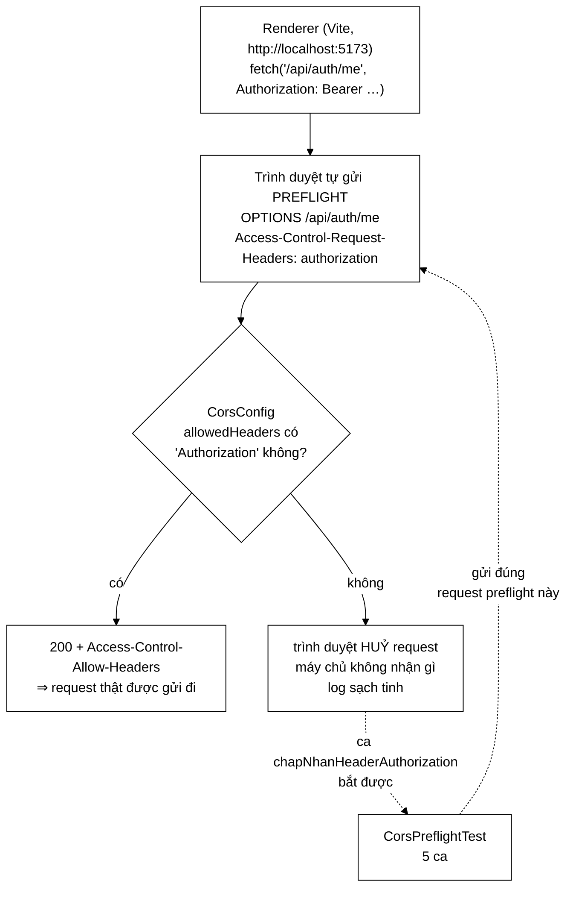

# CorsPreflightTest — bộ test canh giữ một lỗi mà `curl` không bao giờ nhìn thấy

**File nguồn:** `search-engine/src/test/java/com/vnsearch/config/CorsPreflightTest.java` (121 dòng)
**Gói:** `com.vnsearch.config` · **Khung:** JUnit 5 + `@SpringBootTest` + MockMvc · **Số ca:** 5
**Lớp được kiểm:** [`CorsConfig.md`](../../../../../main/java/com/vnsearch/config/CorsConfig.md)
**Đọc kèm:** [`../auth/AccountAuthorizationTest.md`](../auth/AccountAuthorizationTest.md) · [`../auth/SessionStoreTest.md`](../auth/SessionStoreTest.md) · [`../analytics/AnalyticsAuthorizationTest.md`](../analytics/AnalyticsAuthorizationTest.md)

---

## 📌 Hiểu trong 30 giây

Năm ca kiểm thử gửi **request preflight** (`OPTIONS` kèm `Origin` và
`Access-Control-Request-*`) vào đúng bộ lọc CORS mà trình duyệt sẽ gặp. Chúng
tồn tại vì một sự cố có thật: danh sách `allowedHeaders` thiếu `Authorization`,
và **toàn bộ tầng đăng nhập bằng token ngừng hoạt động trong trình duyệt** —
trong khi mọi phép thử bằng dòng lệnh vẫn xanh.

```
   VÌ SAO LỖI ĐÓ SỐNG LÂU ĐƯỢC ĐẾN THẾ

   ① Trình duyệt chặn ở bước PREFLIGHT.
      Request không bao giờ tới máy chủ ⇒ LOG HOÀN TOÀN SẠCH.
      Không có stack trace, không có dòng 4xx nào để tìm.

   ② curl KHÔNG bị CORS ràng buộc.
      curl -H "Authorization: Bearer ..." → 200.
      Mọi phép thử tay bằng dòng lệnh đều nói "máy chủ ổn".

   ③ Đăng nhập VẪN chạy.
      POST /api/auth/login chỉ gửi Content-Type — header đó CÓ
      trong danh sách. Chỉ những request MANG token mới hỏng.

   ⇒ Triệu chứng người dùng thấy: "đăng nhập thành công rồi bảng
     điều khiển báo không kết nối được máy chủ".
     Ba dữ kiện đó chỉ về ba hướng khác nhau, không hướng nào đúng.
```



---

## 1. Bố cục: 5 ca chia hai nhóm

```
   ┌─ NHÓM 1 · NHỮNG THỨ PHẢI ĐƯỢC CHO QUA (4 ca) ────────────────┐
   │  chapNhanHeaderAuthorization   ← sự cố gốc, ca quan trọng nhất │
   │  chapNhanHeaderXApiKey         ← đường của công cụ             │
   │  chapNhanPhuongThucDelete      ← cùng loại bẫy, khác trục      │
   │  chapNhanPostDangNhap          ← ca duy nhất kiểm Allow-Origin │
   └───────────────────────────────────────────────────────────────┘
   ┌─ NHÓM 2 · THỨ PHẢI BỊ TỪ CHỐI (1 ca) ────────────────────────┐
   │  khongChoGuiCookieKemTheo      ← chặn CORS-rộng thành lỗ hổng  │
   └───────────────────────────────────────────────────────────────┘
```

Tỉ lệ 4-1 nói lên bản chất của bộ test này: nó chủ yếu canh **quyền đã cấp**,
chứ không canh **quyền chưa cấp**. Mục 8 nói về chỗ yếu đó.

Một hằng số dùng chung cho cả năm ca, và nó cố ý:

```java
/** Goc cua dev server Vite — dung goc ma renderer gui khi chay `npm run dev`. */
private static final String ORIGIN = "http://localhost:5173";
```

Đây không phải một chuỗi tuỳ ý cho có. Nó là **đúng giá trị mặc định của
`app.cors.allowed-origins`** trong `src/main/resources/application.properties`:

```properties
app.cors.allowed-origins=${APP_CORS_ALLOWED_ORIGINS:http://localhost:5173}
```

Nếu ai đó đổi cổng dev server mà quên đổi cấu hình, bộ test này đỏ ngay — nó
ghim luôn cả sợi dây giữa hai tệp đó.

---

## 2. Bộ test này chỉ chạy được nhờ một quyết định trong `pom.xml`

Đây là phần đáng đào sâu nhất, vì nó là **một lỗi đã gặp thật**, được ghi lại
ngay trong cấu hình surefire:

```xml
<!-- Vi sao dat o day chu khong phai src/test/resources/application.properties:
     tep do se CHE HAN tep cung ten trong src/main/resources (Spring chi
     lay tep dau tien tim thay tren classpath, khong hop nhat hai tep),
     nen moi khoa khong duoc chep lai deu bien mat. Da thu, va hau qua la
     CorsConfig khong tim thay app.cors.allowed-origins. -->
```

```
   CƠ CHẾ CỦA CÁI BẪY

   Khi chạy test, classpath có HAI thư mục tài nguyên:

       target/test-classes/     ← từ src/test/resources
       target/classes/          ← từ src/main/resources
       └── thứ tự: test-classes ĐỨNG TRƯỚC

   Spring tìm `application.properties` trên classpath và lấy
   TỆP ĐẦU TIÊN. Nó KHÔNG hợp nhất hai tệp cùng tên.

   ⇒ Tạo src/test/resources/application.properties chỉ để thêm
     HAI dòng cấu hình test sẽ làm biến mất TOÀN BỘ hơn 40 khoá
     của tệp thật.

   TRIỆU CHỨNG QUAN SÁT ĐƯỢC:
     CorsConfig có @Value("${app.cors.allowed-origins}") KHÔNG
     kèm giá trị mặc định ⇒ context không dựng được ⇒ mọi bài
     @SpringBootTest chết ở bước khởi động với một thông báo
     "Could not resolve placeholder" — nghe như lỗi của CorsConfig,
     trong khi CorsConfig không hề bị đụng tới.
```

Cách sửa đúng là đặt cấu hình test vào `systemPropertyVariables` của surefire,
tức là **thêm** vào chứ không **thay** cấu hình thật:

```xml
<systemPropertyVariables>
  <ADMIN_API_KEY>test-only-key-0123456789abcdef</ADMIN_API_KEY>
  <app.security.rate-limit.enabled>false</app.security.rate-limit.enabled>
</systemPropertyVariables>
```

| Cách đặt cấu hình test | Hệ quả |
|---|---|
| `src/test/resources/application.properties` | **Che hẳn** tệp thật; mọi khoá không chép lại đều mất |
| `systemPropertyVariables` trong surefire | Tệp thật vẫn là nguồn sự thật; chỉ thêm đúng hai giá trị |
| `@SpringBootTest(properties = {...})` trên từng lớp | Chỉ ảnh hưởng lớp đó; dùng cho thứ riêng của một bài |

Bộ test này dùng **cả cách hai lẫn cách ba**: hai giá trị dùng chung nằm ở
surefire, còn ba giá trị riêng của lớp nằm trên chú giải:

```java
@SpringBootTest(properties = {
        "app.security.admin-api-key=khoa-kiem-thu-du-dai-32-ky-tu-000",
        "app.security.rate-limit.enabled=false",
        "app.auth.bootstrap-admin.password="
})
```

> **Vì sao vẫn khai lại `admin-api-key` dù surefire đã đặt.** `SecurityConfig`
> cố ý **không cho ứng dụng khởi động** khi thiếu khoá quản trị (`throw new
> IllegalStateException` trong `requireAdminApiKey()`). Khai lại ngay trên lớp
> làm bài test tự đứng được: đọc tệp là thấy điều kiện tiên quyết, không phải
> mở `pom.xml` mới hiểu vì sao nó chạy. Chi tiết ở
> [`SecurityConfig.md`](../../../../../main/java/com/vnsearch/config/SecurityConfig.md).

> **Vì sao `rate-limit.enabled=false` là bắt buộc.** Chú thích trong `pom.xml`
> gọi loại lỗi này là "loại lỗi chập chờn tốn nhiều giờ nhất để truy": mọi bài
> test dùng chung một gáo token của `RateLimitFilter`, nên khi bộ test lớn dần,
> một bài ở cuối danh sách bắt đầu nhận **429 thay vì kết quả thật**. Với bộ
> test CORS thì triệu chứng còn khó chịu hơn: `.andExpect(status().isOk())` đỏ
> với thông báo "expected 200 but was 429", và người đọc sẽ đi tìm lỗi trong
> `CorsConfig` — nơi không có lỗi nào.

---

## 3. Nhóm 1 — ba ca "cho qua" và ba cái bẫy khác nhau

### 3.1 `chapNhanHeaderAuthorization` — ca sinh ra sự cố gốc

```java
@Test
void chapNhanHeaderAuthorization() throws Exception {
    mockMvc.perform(options("/api/admin/analytics")
                    .header("Origin", ORIGIN)
                    .header("Access-Control-Request-Method", "GET")
                    .header("Access-Control-Request-Headers", "authorization"))
            .andExpect(status().isOk())
            .andExpect(header().string("Access-Control-Allow-Headers",
                    Matchers.containsStringIgnoringCase("Authorization")));
}
```

Ba chi tiết trong bốn dòng này đều là quyết định, không phải ngẫu nhiên:

```
   ① GỬI "authorization" VIẾT THƯỜNG
     Trình duyệt hạ chữ thường mọi tên header trong
     Access-Control-Request-Headers. Viết "Authorization" ở đây
     thì bài test mô phỏng SAI thứ mà trình duyệt thật gửi.

   ② KIỂM BẰNG containsStringIgnoringCase, KHÔNG PHẢI equals
     Spring nối cả danh sách header vào một chuỗi và không hứa
     thứ tự hay cách viết hoa. equals() sẽ đỏ ngay lần đầu ai đó
     thêm một header thứ tư — một ca test giòn không kiểm gì thêm.

   ③ NHẮM VÀO /api/admin/analytics
     Đường dẫn CẦN token. Nếu preflight ở đây hỏng thì bảng điều
     khiển quản trị chết — đúng kịch bản của sự cố.
```

Một cài đặt sai trông sẽ như thế nào? Chỉ cần bỏ một chuỗi trong `CorsConfig`:

```java
.allowedHeaders("Accept", "Content-Type", ApiKeyAuthFilter.HEADER)
//                                        ↑ thiếu "Authorization"
```

Và đây là bảng những gì **vẫn xanh** sau phép sửa đó:

| Phép kiểm | Kết quả khi thiếu `Authorization` |
|---|---|
| `curl -H "Authorization: ..." /api/auth/me` | **200** — curl không bị CORS ràng buộc |
| Mọi bài `@SpringBootTest` gọi thẳng controller | **xanh** — không có preflight nào |
| `POST /api/auth/login` từ trình duyệt | **chạy được** — chỉ gửi `Content-Type` |
| Log máy chủ | **sạch tinh** — request bị huỷ trước khi tới |
| `chapNhanHeaderAuthorization` | **ĐỎ** ← ca duy nhất bắt được |

### 3.2 `chapNhanHeaderXApiKey` — đường của công cụ, không phải đường thừa

Ca này trông như bản sao của ca trên với một chuỗi khác. Nó không thừa, vì hai
header đi qua **hai bộ lọc khác nhau** và phục vụ hai loại chủ thể khác nhau:

```
   HAI ĐƯỜNG XÁC THỰC, HAI HEADER

   Authorization: Bearer <token>   →  TokenAuthFilter
     con người · có danh tính · thu hồi được · hết hạn 12 giờ

   X-API-Key: <khoá tĩnh>          →  ApiKeyAuthFilter
     công cụ · không danh tính · không hết hạn
     · lối vào dự phòng khi kho tài khoản hỏng

   Bỏ sót một trong hai ở allowedHeaders thì MẤT HẲN một loại
   chủ thể — nhưng chỉ trong trình duyệt, nên không ai thấy ngay.
```

Chú ý: `CorsConfig` không viết chuỗi `"X-API-Key"` bằng tay mà tham chiếu
`ApiKeyAuthFilter.HEADER`. Bài test thì viết chuỗi thật (`"x-api-key"`), và đó
là **cố ý đúng chiều**: bài test phải nói ngôn ngữ của trình duyệt, không phải
ngôn ngữ của mã nguồn. Nếu bài test cũng dùng hằng số, thì đổi hằng số đó thành
một giá trị sai vẫn giữ được màu xanh.

### 3.3 `chapNhanPhuongThucDelete` — cùng cái bẫy, trục khác

```java
mockMvc.perform(options("/api/admin/users/ai-do")
                .header("Origin", ORIGIN)
                .header("Access-Control-Request-Method", "DELETE")
                .header("Access-Control-Request-Headers", "authorization"))
        .andExpect(status().isOk())
        .andExpect(header().string("Access-Control-Allow-Methods",
                Matchers.containsStringIgnoringCase("DELETE")));
```

Preflight kiểm **hai trục độc lập**: header và phương thức. `DELETE` được thêm
vào `allowedMethods` cùng lúc với `DELETE /api/admin/users/{ten}`, và chú thích
trong `CorsConfig` ghi rõ bài học:

> `// Them endpoint moi ma quen dong nay = endpoint do khong dung duoc tu giao`
> `// dien, va rat kho lan ra vi sao.`

```
   VÌ SAO PHẢI CÓ CA RIÊNG CHO TRỤC PHƯƠNG THỨC

   allowedHeaders  và  allowedMethods  hỏng ĐỘC LẬP.

     • Thiếu "Authorization"  → 3 ca header đỏ, ca DELETE cũng đỏ
     • Thiếu "DELETE"         → CHỈ ca DELETE đỏ

   Bỏ ca DELETE đi thì phép xoá tài khoản trở thành nút bấm
   không có tác dụng trong giao diện, và bộ test vẫn xanh toàn bộ.
```

Đường dẫn `/api/admin/users/ai-do` trỏ tới một tài khoản **không tồn tại**, và
điều đó không sao: preflight không bao giờ chạm tới controller. Đây là chi tiết
đáng học — ca test không cần dựng dữ liệu gì cả.

### 3.4 `chapNhanPostDangNhap` — ca duy nhất kiểm `Allow-Origin`

```java
mockMvc.perform(options("/api/auth/login")
                .header("Origin", ORIGIN)
                .header("Access-Control-Request-Method", "POST")
                .header("Access-Control-Request-Headers", "content-type"))
        .andExpect(status().isOk())
        .andExpect(header().string("Access-Control-Allow-Origin", ORIGIN));
```

Ba ca trên kiểm `Allow-Headers` và `Allow-Methods`; ca này là ca duy nhất kiểm
**`Allow-Origin`** — tức là kiểm rằng `allowedOriginPatterns(allowedOrigins,
...)` thật sự nhận giá trị từ `app.cors.allowed-origins`.

Và nó dùng `header().string(..., ORIGIN)` — so **bằng đúng**, không phải
`containsString`. Đúng chiều: `Allow-Origin` chỉ được phép chứa **một** gốc cụ
thể (hoặc `*`), nên so bằng đúng ở đây chặt hơn và không giòn.

Đây cũng là ca gián tiếp chứng minh rằng vấn đề ở mục 2 đã được xử lý: nếu
`application.properties` thật bị che, `${app.cors.allowed-origins}` không phân
giải được và **cả năm ca chết ở bước dựng context**, chứ không đỏ ở phép khẳng
định.

---

## 4. `khongChoGuiCookieKemTheo` — ca duy nhất canh chiều "từ chối"

```java
@Test
void khongChoGuiCookieKemTheo() throws Exception {
    mockMvc.perform(options("/api/search")
                    .header("Origin", ORIGIN)
                    .header("Access-Control-Request-Method", "GET"))
            .andExpect(status().isOk())
            .andExpect(header().doesNotExist("Access-Control-Allow-Credentials"));
}
```

Đây là ca có giá trị bảo mật cao nhất trong tệp, và cũng là ca dễ bị coi là
thừa nhất — vì `allowCredentials(false)` **vốn đã là mặc định của Spring**.

```
   VÌ SAO CANH MỘT GIÁ TRỊ MẶC ĐỊNH LẠI ĐÁNG

   Danh sách gốc của CorsConfig có ba mục rất rộng:

       allowedOriginPatterns(allowedOrigins, "file://*", "null")
                                              ↑          ↑
                            bản đóng gói     iframe sandbox,
                            chạy qua file://  trang data:

   Gốc "null" được gửi bởi BẤT KỲ iframe sandbox nào — tức là
   gần như "cho phép mọi nơi".

   Một cấu hình rộng như vậy CHƯA phải lỗ hổng, vì trình duyệt
   không đính kèm gì cả. Nó THÀNH lỗ hổng đúng vào lúc ai đó
   thêm `.allowCredentials(true)`:

       trang bất kỳ → iframe sandbox → gọi API của ta
       → trình duyệt TỰ ĐỘNG kèm cookie của nạn nhân
       → đọc được phản hồi

   Dòng `.allowCredentials(false)` được viết TƯỜNG MINH dù thừa,
   và ca test này ghim nó lại. Thiếu ca này, một dòng
   `.allowCredentials(true)` thêm vào "cho tiện" sẽ đi qua
   review mà không có gì đỏ.
```

Cặp "dòng cấu hình tường minh dù thừa + một ca test canh nó" là mẫu đáng học
lại: nó biến một mặc định im lặng thành một **quyết định được ghi lại và được
bảo vệ**.

Ca này cũng cố ý gửi preflight vào `/api/search` — một đường **công khai**.
Không có header xác thực nào trong request, nên nó chứng minh rằng chính sách
credentials áp cho mọi đường, không chỉ đường quản trị.

---

## 5. Vì sao bài này phải là `@SpringBootTest`, không phải unit test

Đây là điểm mấu chốt: `CorsConfig` là một `WebMvcConfigurer`. Gọi thẳng
`addCorsMappings()` trong một unit test thì chỉ chứng minh **các chuỗi được
truyền vào đúng** — nó không chứng minh Spring đã nối cấu hình đó vào chuỗi
filter, không chứng minh `SecurityConfig` cho `OPTIONS` đi qua, và không sinh ra
một header `Access-Control-Allow-*` nào để mà kiểm.

```
   ĐƯỜNG ĐI THẬT CỦA MỘT REQUEST PREFLIGHT

   OPTIONS /api/admin/analytics
      │
      ├─ RateLimitFilter          (tắt trong test — xem mục 2)
      │
      ├─ Spring Security chain
      │    .requestMatchers(HttpMethod.OPTIONS, "/**").permitAll()
      │       ↑ THIẾU DÒNG NÀY thì preflight nhận 401,
      │         và trình duyệt cũng huỷ request y hệt
      │
      ├─ CorsFilter  ← đọc cấu hình của CorsConfig
      │
      └─ 200 + Access-Control-Allow-*   (không tới controller)

   Bài @SpringBootTest đi qua ĐÚNG chuỗi này.
   Một unit test gọi addCorsMappings() thì không đi qua chỗ nào cả.
```

Nói cách khác: bộ test này không kiểm `CorsConfig`, nó kiểm **sự phối hợp giữa
`CorsConfig` và `SecurityConfig`** — thứ duy nhất mà trình duyệt thật quan tâm.
Đó là lý do cái giá của một `ApplicationContext` riêng ở đây xứng đáng.

`@DirtiesContext(classMode = AFTER_CLASS)` đóng context ngay sau lớp này. Lý do
được ghi kỹ ở
[`AccountAuthorizationTest.md`](../auth/AccountAuthorizationTest.md) mục 3: mỗi
context nạp cả chỉ mục vào heap, và ba context cùng sống trong một JVM từng làm
bộ test chết vì `OutOfMemoryError`.

---

## 6. Kỹ thuật đáng học lại từ bộ test này

```
   ① MÔ PHỎNG ĐÚNG THỨ TRÌNH DUYỆT GỬI, KHÔNG PHẢI THỨ MÃ NGUỒN DÙNG
      .header("Access-Control-Request-Headers", "authorization")
                                                 ↑ viết thường
      Bài test dùng hằng số của mã nguồn thì đổi hằng số sai
      vẫn giữ được màu xanh.

   ② CHỌN ĐỘ CHẶT THEO NGỮ NGHĨA CỦA TỪNG HEADER
      Allow-Headers / Allow-Methods → containsStringIgnoringCase
        (là danh sách, không hứa thứ tự)
      Allow-Origin                  → so bằng ĐÚNG
        (chỉ được có một giá trị)

   ③ CANH CẢ NHỮNG DÒNG "THỪA" TRONG CẤU HÌNH
      .allowCredentials(false) là mặc định của Spring.
      Viết tường minh + có ca test = một quyết định được bảo vệ,
      thay vì một mặc định im lặng dễ bị lật.

   ④ MỘT TRỤC HỎNG ĐỘC LẬP = MỘT CA RIÊNG
      headers và methods là hai danh sách khác nhau ⇒ hai ca.

   ⑤ ĐẶT CẤU HÌNH TEST Ở SUREFIRE, KHÔNG Ở src/test/resources
      application.properties trong test-classes CHE HẲN tệp thật.
      (Xem mục 2 — đây là lỗi đã gặp, không phải lý thuyết.)

   ⑥ JAVADOC CỦA LỚP TEST GHI LẠI SỰ CỐ, KHÔNG DIỄN GIẢI MÃ
      Ba gạch đầu dòng "vì sao lỗi này khó lần" trong Javadoc
      đáng giá hơn cả năm ca test cộng lại đối với người đọc sau.
```

---

## 7. Hướng dẫn thực hành

### 7.1 Chạy

```powershell
cd search-engine
.\mvnw.cmd test "-Dtest=CorsPreflightTest"
.\mvnw.cmd test "-Dtest=CorsPreflightTest#chapNhanHeaderAuthorization"
```

Trên PowerShell **phải bọc `-Dtest=...` trong nháy kép**, nếu không dấu `=` bị
nuốt và Maven chạy toàn bộ bộ test.

Lớp này dựng một `ApplicationContext` đầy đủ, nên phần lớn thời gian chạy là
khởi động Spring chứ không phải năm ca test.

### 7.2 Đọc kết quả

```
[INFO] Running com.vnsearch.config.CorsPreflightTest
[INFO] Tests run: 5, Failures: 0, Errors: 0, Skipped: 0
```

Báo cáo chi tiết: `search-engine/target/surefire-reports/com.vnsearch.config.CorsPreflightTest.txt`

Nếu thấy `Tests run: 5, Errors: 5` kèm `IllegalStateException: Failed to load
ApplicationContext`, lỗi **không nằm trong năm ca** mà ở bước khởi động — đọc
nguyên nhân gốc ở cuối stack trace. Hai nguyên nhân hay gặp nhất:

| Thông báo trong stack trace | Nguyên nhân |
|---|---|
| `Could not resolve placeholder 'app.cors.allowed-origins'` | Có ai đó tạo `src/test/resources/application.properties` — xem mục 2 |
| `Thieu app.security.admin-api-key` | Thuộc tính trên `@SpringBootTest` bị xoá, và surefire cũng không đặt `ADMIN_API_KEY` |

### 7.3 Tự kiểm chứng — cố tình làm hỏng để xem ca nào đỏ

| Sửa gì | Ca dự kiến đỏ |
|---|---|
| Bỏ `"Authorization"` khỏi `allowedHeaders` trong `CorsConfig` | `chapNhanHeaderAuthorization` (và `chapNhanPhuongThucDelete`, vì nó cũng xin header đó) |
| Bỏ `ApiKeyAuthFilter.HEADER` khỏi `allowedHeaders` | `chapNhanHeaderXApiKey` |
| Bỏ `"DELETE"` khỏi `allowedMethods` | `chapNhanPhuongThucDelete` |
| Đổi `.allowCredentials(false)` thành `true` | `khongChoGuiCookieKemTheo` |
| Đổi `allowedOriginPatterns(allowedOrigins, ...)` thành `"http://vi-du.vn"` | `chapNhanPostDangNhap` |
| Xoá `.requestMatchers(HttpMethod.OPTIONS, "/**").permitAll()` trong `SecurityConfig` | **Cả năm ca** — preflight nhận 401 |
| Tạo `src/test/resources/application.properties` chỉ chứa một dòng | **Cả năm ca** đỏ ở bước dựng context, không phải ở phép khẳng định |

Hai dòng cuối đáng thử nhất: chúng cho thấy bộ test này canh giữ nhiều hơn
phạm vi cái tên của nó.

### 7.4 Cạm bẫy khi viết thêm ca cho lớp này

```
   ✗ Đừng viết ca CORS bằng cách gọi thẳng controller.
     MockMvc gọi GET /api/... không sinh ra header CORS nào.
     Phải là OPTIONS + Origin + Access-Control-Request-Method,
     đủ cả ba, mới là một request preflight.

   ✗ Đừng quên header "Origin".
     Thiếu nó thì Spring không coi đây là request CORS, trả 200
     rỗng, và assertion trên Allow-* sẽ đỏ với lý do gây hiểu lầm.

   ✗ Đừng dùng `curl` để xác minh một phép sửa CORS.
     Toàn bộ tệp này tồn tại vì curl KHÔNG BAO GIỜ thấy lỗi CORS.
     Xác minh bằng trình duyệt thật, hoặc bằng chính bộ test này.

   ✗ Đừng viết tên header theo cách viết của mã nguồn.
     Trình duyệt hạ chữ thường mọi tên trong
     Access-Control-Request-Headers. Bài test phải làm y hệt.

   ✗ Đừng thêm ca vào lớp @SpringBootTest này nếu ca đó không cần
     preflight. Mỗi lớp @SpringBootTest có cấu hình riêng là thêm
     một ApplicationContext, và bộ nhớ là ràng buộc thật ở đây.
```

---

## 8. Bảng tổng hợp 5 ca

| # | Ca test | Nhóm | Tính chất được canh giữ |
|---|---|---|---|
| 1 | **`chapNhanHeaderAuthorization`** | 1 | **`Authorization` qua được preflight — sự cố gốc, cả tầng đăng nhập token phụ thuộc vào nó** |
| 2 | `chapNhanHeaderXApiKey` | 1 | `X-API-Key` qua được preflight — đường của công cụ |
| 3 | `chapNhanPhuongThucDelete` | 1 | `DELETE` nằm trong `allowedMethods` — trục hỏng độc lập với header |
| 4 | `chapNhanPostDangNhap` | 1 | `Allow-Origin` trả đúng gốc từ `app.cors.allowed-origins` |
| 5 | **`khongChoGuiCookieKemTheo`** | 2 | **Không có `Allow-Credentials` — thứ giữ cho một cấu hình CORS rộng không thành lỗ hổng** |

---

## 9. Khoảng trống chưa phủ

```
   ✗ KHÔNG CÓ CA NÀO KIỂM CHIỀU TỪ CHỐI GỐC.
     Bốn trên năm ca chứng minh "cái này được cho qua". Không ca
     nào chứng minh "gốc lạ bị chặn".

     Hậu quả: đổi allowedOriginPatterns thành "*" — phép nới lỏng
     nguy hiểm nhất có thể làm với tệp này — KHÔNG làm đỏ ca nào.
     Đây là khoảng trống lớn nhất của bộ test.

   ✗ Gốc "null" và "file://*" không có ca nào.
     Javadoc của CorsConfig dành hẳn một đoạn giải thích vì sao
     phải giữ gốc "null" (bản đóng gói của browser-app nạp qua
     file:// và Chromium gửi Origin: null). Đó là mục dễ bị xoá
     nhất trong cả tệp — trông như một chỗ bị bỏ sót — và không
     có gì bảo vệ nó.

     Xoá "null" đi ⇒ bản đóng gói ngừng hoạt động, bộ test xanh.

   ✗ maxAge(3600) không được kiểm.
     Không nguy hiểm, nhưng nó là một quyết định về hiệu năng
     (đỡ một preflight trước mỗi POST) và hiện không ai canh.

   ✗ PUT/PATCH bị chặn — cũng không có ca.
     Đây là một quyết định có chủ ý ("quyen thua khong dung den
     van la quyen thua"), nhưng nó chỉ tồn tại trong chú thích.
```

Hai ca đáng viết trước nhất, và ca đầu là ca quan trọng nhất còn thiếu trong cả
tệp:

```java
/** Goc la KHONG duoc phep — chieu tu choi, hien khong ca nao canh. */
@Test
void gocLaKhongDuocPhep() throws Exception {
    mockMvc.perform(options("/api/search")
                    .header("Origin", "http://ke-tan-cong.example")
                    .header("Access-Control-Request-Method", "GET"))
            .andExpect(header().doesNotExist("Access-Control-Allow-Origin"));
}

/** Goc "null" PHAI duoc phep: ban dong goi nap qua file:// gui dung goc nay. */
@Test
void gocNullVanDuocPhepVaBanDongGoiPhuThuocVaoNo() throws Exception {
    mockMvc.perform(options("/api/search")
                    .header("Origin", "null")
                    .header("Access-Control-Request-Method", "GET"))
            .andExpect(status().isOk())
            .andExpect(header().string("Access-Control-Allow-Origin", "null"));
}
```

Ca thứ nhất kiểm bằng `header().doesNotExist(...)` chứ không kiểm mã trạng
thái: Spring vẫn có thể trả 200 cho một preflight bị từ chối, và **thứ quyết
định là sự vắng mặt của header** — đúng thứ trình duyệt đọc.

---

## 10. Liên kết

- Lớp được kiểm, kèm giải thích vì sao gốc `"null"` vẫn phải nằm trong danh sách và vì sao `allowCredentials(false)` được viết tường minh: [`CorsConfig.md`](../../../../../main/java/com/vnsearch/config/CorsConfig.md)
- Nơi `OPTIONS /**` được cho qua — thiếu dòng đó thì cả năm ca ở đây đỏ mà không liên quan gì tới CORS: [`SecurityConfig.md`](../../../../../main/java/com/vnsearch/config/SecurityConfig.md)
- Bộ lọc giới hạn tần suất mà bài này phải tắt để không nhận 429: [`RateLimitFilter.md`](../../../../../main/java/com/vnsearch/config/RateLimitFilter.md)
- Bộ test phân quyền chạy trên cùng kiểu `@SpringBootTest` + MockMvc, và là nơi giải thích kỹ `@DirtiesContext`: [`../auth/AccountAuthorizationTest.md`](../auth/AccountAuthorizationTest.md)
- Chủ thể đứng sau header `Authorization` mà bài này canh cho qua: [`../auth/SessionStoreTest.md`](../auth/SessionStoreTest.md)
- Bộ lọc đứng sau header `X-API-Key`: [`ApiKeyAuthFilter.md`](../../../../../main/java/com/vnsearch/config/ApiKeyAuthFilter.md)
- Endpoint mà ba trên năm ca dùng làm đích preflight: [`AdminAnalyticsController.md`](../../../../../main/java/com/vnsearch/controller/AdminAnalyticsController.md)
