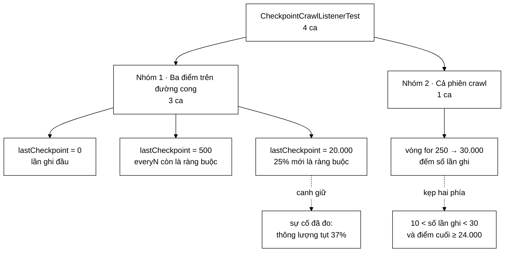

# CheckpointCrawlListenerTest — bốn ca test canh giữ một tính chất về **hiệu năng**, không phải về tính đúng đắn

**File nguồn:** `search-engine/src/test/java/com/vnsearch/crawler/CheckpointCrawlListenerTest.java` (73 dòng)
**Gói:** `com.vnsearch.crawler` · **Khung:** JUnit 5 · **Số ca:** 4
**Lớp được kiểm:** [`CheckpointCrawlListener.md`](../../../../../main/java/com/vnsearch/crawler/CheckpointCrawlListener.md)
**Đọc kèm:** [`CrawlConfigTest.md`](./CrawlConfigTest.md) · [`CrawlerServiceBusWiringTest.md`](./CrawlerServiceBusWiringTest.md) · [`../datastructure/LRUCacheTest.md`](../datastructure/LRUCacheTest.md)

---

## 📌 Hiểu trong 30 giây

Bộ test này không hỏi "ghi điểm kiểm tra có ra đúng tệp không". Nó hỏi **"ghi
bao nhiêu lần"** — và câu trả lời sai không làm hỏng dữ liệu, nó chỉ làm crawler
chậm dần đi cho tới lúc gần như đứng yên. Javadoc của lớp ghi lại con số đã đo
được: thông lượng **tụt 37%** giữa phiên (38 → 24 trang/s).

```
   BA ĐIỀU BỘ TEST NÀY LÀM KHÁC BÌNH THƯỜNG
   ────────────────────────────────────────────────────────────
   ① Kiểm một HÀM TĨNH THUẦN, không dựng listener, không chạm đĩa
      → isDueForCheckpoint(pages, lastCheckpoint, everyN)

   ② Ca cuối MÔ PHỎNG CẢ PHIÊN 30.000 trang bằng một vòng for,
      rồi khẳng định trên SỐ LẦN GHI — thứ không phải giá trị
      trả về của bất cứ lời gọi nào

   ③ Kẹp HAI PHÍA: quá nhiều lần ghi thì chậm, quá ít lần ghi thì
      lưới an toàn vô dụng. Một phía thôi là chưa canh giữ được gì.
```



---

## 1. Bố cục: 4 ca chia hai nhóm

```
   ┌─ NHÓM 1 · BA ĐIỂM TRÊN ĐƯỜNG CONG NGƯỠNG ────────────────┐
   │  firstCheckpointIsAlwaysAllowed      lastCheckpoint = 0   │
   │  writesEveryNWhileCorpusIsSmall      lastCheckpoint = 500 │
   │  thresholdGrowsWithCorpusSize        lastCheckpoint = 20k │
   └───────────────────────────────────────────────────────────┘
   ┌─ NHÓM 2 · HỆ QUẢ TÍCH LUỸ CẢ PHIÊN ──────────────────────┐
   │  wholeSessionWritesFarFewerTimes                          │
   │      ← ca duy nhất nói được điều mà lớp SINH RA để làm    │
   └───────────────────────────────────────────────────────────┘
```

Cách chia này đáng học lại: ba ca đầu kiểm **quy tắc**, ca cuối kiểm **hệ quả
của việc áp dụng quy tắc đó hàng trăm lần**. Hai thứ khác nhau, và ba ca đầu
không thay được ca cuối — sẽ nói ở mục 4.

Toàn bộ hàm được kiểm chỉ có hai dòng:

```java
static boolean isDueForCheckpoint(int pages, int lastCheckpoint, int everyN) {
    int grown = pages - lastCheckpoint;
    return grown >= Math.max(everyN, (int) (lastCheckpoint * GROWTH_RATIO));
}
```

`Math.max` ở đây là chỗ chứa toàn bộ ý tưởng: **hai ràng buộc song song**, cái
nào lớn hơn thì cái đó có hiệu lực. `everyN` chặn dưới lúc corpus còn nhỏ, tỉ lệ
25% chặn dưới lúc corpus đã lớn. Ba ca đầu chính là ba lát cắt qua hai chế độ
đó và qua điểm giao.

---

## 2. Nhóm 1 — vì sao phải là **ba** điểm chứ không phải một

| Ca | `lastCheckpoint` | `max(everyN, 25%)` bằng | Vế nào thắng |
|---|---|---|---|
| `firstCheckpointIsAlwaysAllowed` | 0 | `max(250, 0) = 250` | `everyN`, trường hợp suy biến |
| `writesEveryNWhileCorpusIsSmall` | 500 | `max(250, 125) = 250` | `everyN` |
| `thresholdGrowsWithCorpusSize` | 20.000 | `max(250, 5.000) = 5.000` | tỉ lệ 25% |

```
   BA LÁT CẮT, BA CÁCH HỎNG KHÁC NHAU

   lastCheckpoint = 0        ← cài đặt quên trường hợp corpus rỗng
                               (ví dụ đổi >= thành >, hoặc bỏ hẳn
                                Math.max và lấy thẳng 0 làm ngưỡng)
   ─────────────────────────────────────────────────────────────
   lastCheckpoint = 500      ← cài đặt bỏ vế everyN, chỉ giữ 25%
                               ⇒ ngưỡng còn 125, ghi dày gấp đôi
                                 ở giai đoạn đầu phiên
   ─────────────────────────────────────────────────────────────
   lastCheckpoint = 20.000   ← cài đặt bỏ vế 25%, chỉ giữ everyN
                               ⇒ đúng lỗi cũ quay lại y nguyên
```

### 2.1 `firstCheckpointIsAlwaysAllowed` — một dòng, và là dòng chặn được lỗi tệ nhất

```java
assertTrue(CheckpointCrawlListener.isDueForCheckpoint(250, 0, EVERY_N));
```

Chú thích trong ca nêu rõ hậu quả: *"Neu quy tac gian chu ky chan ca lan dau thi
phien crawl ngan se khong co luoi an toan nao."*

```
   VÌ SAO ĐÂY LÀ LỖI TỆ NHẤT TRONG BA LOẠI

   Một phiên thử nghiệm 300 trang chỉ đi qua đúng MỘT mốc
   kiểm tra: pages = 250, lastCheckpoint = 0.

   Nếu điều kiện là `grown > ngưỡng` thay vì `>=`:
       250 > 250  →  false
   ⇒ phiên 300 trang KHÔNG ghi lần nào.
   ⇒ Ctrl+C ở trang 290 làm mất trắng.

   Và triệu chứng gần như không quan sát được: crawler chạy
   bình thường, không log lỗi, chỉ là tệp checkpoint không
   bao giờ xuất hiện — mà người chạy cũng không đi tìm nó khi
   mọi thứ đang chạy tốt.
```

Chi tiết đáng chú ý: điều kiện `>=` này **không được viết ra như một trường hợp
riêng** trong mã nguồn. Nó rơi ra như một hệ quả của `Math.max(everyN, 0) =
everyN`. Loại tính chất "đúng do tình cờ cấu trúc" là loại dễ mất nhất khi ai đó
viết lại hàm — nên cần một ca test đứng riêng để cắm mốc.

### 2.2 `writesEveryNWhileCorpusIsSmall` — ca duy nhất có cả `assertTrue` lẫn `assertFalse`

```java
assertTrue(CheckpointCrawlListener.isDueForCheckpoint(750, 500, EVERY_N));
assertFalse(CheckpointCrawlListener.isDueForCheckpoint(700, 500, EVERY_N));
```

Hai phép này kẹp đúng **ranh giới** ở 750: đạt thì `true`, thiếu 50 trang thì
`false`.

```
   VÌ SAO CHỈ assertTrue LÀ VÔ NGHĨA

   Một cài đặt `return true;` — cứ ghi mọi lần —
   sẽ qua được MỌI phép assertTrue trong cả bộ test.

   Chỉ có phép assertFalse mới nói được rằng hàm này
   thực sự TỪ CHỐI một cái gì đó.

       750, last=500  →  grown 250 ≥ 250   ✔ ghi
       700, last=500  →  grown 200 < 250   ✘ chưa
                          ↑
                    ranh giới nằm giữa hai con số này
```

Chú thích của ca ghi *"dung nhu truoc day"* — tức là ca này canh giữ tính **tương
thích ngược**: quy tắc giãn chu kỳ mới không được đổi hành vi ở giai đoạn corpus
còn nhỏ, nơi hành vi cũ vốn đã đúng. Đây là dạng khẳng định mà bộ test dễ bỏ
quên nhất khi thêm một tối ưu: người ta kiểm rất kỹ chỗ mới và quên mất chỗ cũ
phải giữ nguyên.

### 2.3 `thresholdGrowsWithCorpusSize` — ba con số, hai `false` rồi một `true`

```java
assertFalse(CheckpointCrawlListener.isDueForCheckpoint(20_250, 20_000, EVERY_N));
assertFalse(CheckpointCrawlListener.isDueForCheckpoint(24_000, 20_000, EVERY_N));
assertTrue (CheckpointCrawlListener.isDueForCheckpoint(25_000, 20_000, EVERY_N));
```

Ba điểm này không chọn ngẫu nhiên — chúng vẽ ra hình dạng của ngưỡng:

```
   lastCheckpoint = 20.000  ⇒  ngưỡng = max(250, 5.000) = 5.000

   20.000        20.250          24.000        25.000
     │             │                │             │
     ├─────────────┼────────────────┼─────────────┤
     │   grown=250 │   grown=4.000  │  grown=5.000│
     │   ✘ chưa    │   ✘ chưa       │  ✔ ghi      │
                   ↑                ↑
        "đủ everyN rồi"    "gần tới nhưng chưa đủ"
        ← điểm mà quy tắc CŨ đã ghi

   Điểm 20.250 bắt lỗi "bỏ vế 25%".
   Điểm 24.000 bắt lỗi "để tỉ lệ quá nhỏ", ví dụ 0,20 —
     khi đó ngưỡng còn 4.000 và phép này chuyển thành true.
```

Chú thích trong ca nói thẳng cái giá của việc ghi ở mốc 20.250: *"o quy mo nay,
ghi moi 250 trang la ghi lai 20.000 tai lieu cu chi de them 250 tai lieu moi"*.
Đó là tỉ lệ 80:1 giữa công vô ích và công hữu ích — và nó **tăng tuyến tính**
theo kích thước corpus.

---

## 3. `wholeSessionWritesFarFewerTimes` — ca đắt giá nhất, và ca duy nhất kiểm được thứ lớp này sinh ra để làm

```java
int lastCheckpoint = 0;
int writes = 0;

// Mo phong dung cach CrawlerService goi: chi xet o cac boi so cua everyN.
for (int pages = EVERY_N; pages <= 30_000; pages += EVERY_N) {
    if (CheckpointCrawlListener.isDueForCheckpoint(pages, lastCheckpoint, EVERY_N)) {
        lastCheckpoint = pages;
        writes++;
    }
}
```

Điều làm ca này khác hẳn ba ca trên: nó không kiểm giá trị trả về của một lời
gọi, mà kiểm **hành vi tích luỹ của hàng trăm lời gọi nối tiếp nhau, mỗi lời gọi
lấy đầu vào từ kết quả lời gọi trước**.

```
   VÌ SAO BA CA ĐẦU KHÔNG THAY ĐƯỢC CA NÀY

   isDueForCheckpoint là hàm thuần, nhưng CÁCH DÙNG nó là một
   vòng phản hồi: mỗi lần ghi lại đẩy lastCheckpoint lên, và
   lastCheckpoint mới lại quyết định ngưỡng kế tiếp.

       pages ──► isDue? ──yes──► lastCheckpoint := pages
                   ▲                      │
                   └──────────────────────┘

   Ba ca đầu chụp ba tấm ảnh tĩnh của vòng lặp này.
   Ca thứ tư chạy nó.

   Một quy tắc có thể ĐÚNG ở cả ba tấm ảnh mà vẫn cho ra
   một chuỗi tệ — ví dụ chuỗi hội tụ quá nhanh và ngừng
   ghi hẳn ở nửa sau phiên.
```

Chi tiết cố ý và đáng học: vòng lặp **chỉ xét các bội số của `everyN`**, đúng
như `onPageCrawled` làm trong lớp gốc:

```java
if (e.pageNumber() % everyN != 0
        || !isDueForCheckpoint(e.pageNumber(), lastCheckpointPages, everyN)) {
    return;
}
```

Nếu ca test duyệt từng trang một (`pages++`) thì nó sẽ mô phỏng một hệ thống
**không tồn tại** và cho ra một dãy số khác — bộ lọc `% everyN` bị bỏ mất. Đây là
cạm bẫy kinh điển của test mô phỏng: mô hình trong test trôi dần khỏi mã thật, và
test vẫn xanh trong khi nó đang canh giữ một thứ khác.

### 3.1 Ba phép khẳng định, mỗi phép chặn một hướng hỏng riêng

```java
assertTrue(writes < 30,  "Phai it hon 30 lan ghi, thuc te: " + writes);
assertTrue(writes > 10,  "Phai nhieu hon 10 lan ghi, thuc te: " + writes);
assertTrue(lastCheckpoint >= 24_000,
        "Diem kiem tra cuoi qua xa cuoi phien: " + lastCheckpoint);
```

```
   ┌──────────────────┬─────────────────────────────────────┐
   │ writes < 30      │ Chặn phía CHẬM.                     │
   │                  │ Chu kỳ cố định cho 30.000/250 = 120 │
   │                  │ lần ghi — đúng cấu hình đã đo được  │
   │                  │ tụt 37% thông lượng.                │
   ├──────────────────┼─────────────────────────────────────┤
   │ writes > 10      │ Chặn phía MẤT DỮ LIỆU.              │
   │                  │ Một quy tắc "ghi khi corpus gấp     │
   │                  │ đôi" cho ~7 lần ghi cả phiên —      │
   │                  │ nhanh, nhưng không còn là lưới      │
   │                  │ an toàn nữa.                        │
   ├──────────────────┼─────────────────────────────────────┤
   │ last ≥ 24.000    │ Chặn phía ĐUÔI PHIÊN.               │
   │                  │ Hai phép trên vẫn xanh nếu 18 lần   │
   │                  │ ghi dồn hết vào 5.000 trang đầu rồi │
   │                  │ im lặng suốt 25.000 trang cuối.     │
   └──────────────────┴─────────────────────────────────────┘
```

Phép thứ ba là phép tinh tế nhất và dễ bị bỏ sót nhất khi viết bộ test kiểu này.
Đếm số lần ghi cho biết **tần suất trung bình**, không cho biết **phân bố**. Với
một quy tắc giãn theo cấp số nhân, chỗ nguy hiểm luôn là cuối phiên — nơi khoảng
cách giữa hai lần ghi lớn nhất, và cũng là nơi có nhiều dữ liệu nhất để mất.

### 3.2 Chạy tay vòng lặp: con số thật là bao nhiêu

Với `GROWTH_RATIO = 0,25` và `everyN = 250`, dãy điểm ghi là:

```
   250, 500, 750, 1.000, 1.250, 1.750, 2.250, 3.000, 3.750,
   4.750, 6.000, 7.500, 9.500, 12.000, 15.000, 18.750,
   23.500, 29.500
                    → writes = 18,  lastCheckpoint = 29.500
```

Đặt cạnh ba ngưỡng của ca test: `18 < 30` ✔, `18 > 10` ✔, `29.500 ≥ 24.000` ✔.
Nhìn khoảng cách tới ngưỡng thì thấy bộ test có **biên khá rộng** — nó không khoá
chặt vào con số 18, mà chỉ khoanh một dải chấp nhận được. Đó là lựa chọn đúng cho
một khẳng định về hiệu năng: khoá chặt vào 18 sẽ biến mọi lần chỉnh `GROWTH_RATIO`
thành một lần sửa test, kể cả khi chỉnh đúng.

Dải mà ba phép khẳng định thực sự cho phép, tính bằng cách quét `GROWTH_RATIO`
qua chính vòng lặp của ca test:

| `GROWTH_RATIO` | `writes` | `lastCheckpoint` | Ca test |
|---|---|---|---|
| 0,10 | 32 | 28.750 | ✘ đỏ ở `writes < 30` |
| 0,15 | 24 | 27.500 | ✔ xanh |
| 0,20 | 20 | 25.250 | ✔ xanh |
| **0,25** | **18** | **29.500** | ✔ **giá trị hiện tại** |
| 0,30 | 15 | 25.250 | ✔ xanh |
| 0,35 | 13 | 22.750 | ✘ đỏ ở `lastCheckpoint ≥ 24.000` |
| 0,50 | 11 | 23.250 | ✘ đỏ ở `lastCheckpoint ≥ 24.000` |
| 0,55 | 10 | 26.750 | ✘ đỏ ở `writes > 10` |

Bảng này cũng phơi ra **chỗ yếu thật** của ca test: cột `lastCheckpoint` **không
đơn điệu** theo tỉ lệ (0,35 cho 22.750 nhưng 0,40 cho 27.750). Nó phụ thuộc vào
việc dãy điểm ghi rơi trúng chỗ nào so với mốc 30.000 — tức là một phần may rủi
số học, không phải một tính chất. Khẳng định `lastCheckpoint >= 24_000` vì thế
canh giữ đúng ý định nhưng bằng một phép đo hơi giòn: đổi giới hạn vòng lặp từ
30.000 sang 28.000 có thể làm ca đỏ mà không có gì trong lớp gốc thay đổi.

> Thông điệp của cả ba phép đều nối kèm giá trị thật (`"thuc te: " + writes`).
> Đây là bắt buộc với ca kiểu này: khi nó đỏ, câu hỏi đầu tiên luôn là "đỏ nhiều
> hay đỏ ít" — 31 lần ghi là chỉnh tham số, 120 lần ghi là quy tắc giãn đã biến
> mất hoàn toàn.

---

## 4. Vì sao hàm được kiểm là `static` và *package-private*

Javadoc của `isDueForCheckpoint` nói thẳng lý do:

> *Viết thành hàm **tĩnh, thuần** (chỉ phụ thuộc tham số, không đọc trạng thái
> nào) để kiểm thử được trực tiếp. Kiểm thử qua `onPageCrawled` thì phải dựng
> luồng nền và tệp tạm — nhiều công sức cho một phép so sánh số học.*

```
   NẾU QUY TẮC NẰM THẲNG TRONG onPageCrawled

   Muốn kiểm "phiên 30.000 trang ghi bao nhiêu lần", ca test phải:
     • dựng một Supplier<List<WebDocument>> giả
     • trỏ path vào @TempDir
     • gọi onPageCrawled 30.000 lần
     • ...và mỗi lần ghi thật sự serial hoá JSON ra đĩa
     • rồi chờ luồng nền daemon xong để đếm
     • và writing.compareAndSet có thể BỎ QUA vài lần ghi,
       làm con số đếm được dao động giữa các lần chạy

   ⇒ Ca test chạy hàng chục giây, và không tất định.

   Tách hàm thuần ra: cả bốn ca chạy trong vài mili giây,
   không I/O, không luồng, kết quả tất định tuyệt đối.
```

Đây là lập luận **thiết kế để kiểm thử được** ở dạng thuần khiết nhất — và điều
đáng học không phải là "hãy tách hàm ra", mà là **tách đúng chỗ nào**: tách phần
*quyết định* (số học thuần) khỏi phần *tác động* (luồng nền, đĩa). Phần quyết
định là phần có logic đáng sai; phần tác động thì hầu như không có nhánh nào.

Cái giá phải trả cũng có thật: hàm để *package-private* nên nó là một phần API
"nội bộ nhưng lộ ra" — bất kỳ lớp nào trong `com.vnsearch.crawler` cũng gọi được.
So với việc phơi ra một phương thức `public`, đây là cái giá rẻ.

---

## 5. Kỹ thuật đáng học lại từ bộ test này

```
   ① TÁCH QUYẾT ĐỊNH KHỎI TÁC ĐỘNG RỒI CHỈ KIỂM QUYẾT ĐỊNH
      isDueForCheckpoint (thuần)  vs  onPageCrawled (luồng + đĩa)
      → 4 ca chạy mili giây, tất định, không @TempDir

   ② KẸP HAI PHÍA CHO MỌI KHẲNG ĐỊNH VỀ HIỆU NĂNG
      writes < 30  ← chặn phía chậm
      writes > 10  ← chặn phía mất dữ liệu
      Chỉ một phía thì `return true;` hoặc `return false;`
      đều có thể qua được.

   ③ KIỂM CẢ PHÂN BỐ, KHÔNG CHỈ TỔNG SỐ
      lastCheckpoint >= 24_000
      → chặn kịch bản "ghi dồn đầu phiên rồi im bặt"

   ④ MÔ PHỎNG PHẢI GIỐNG CÁCH GỌI THẬT
      vòng lặp bước 250 vì onPageCrawled cũng lọc % everyN
      → chú thích ghi rõ điều này, để lần sửa sau không trôi

   ⑤ KIỂM MỘT assertFalse Ở NGAY CẠNH assertTrue
      750 → true, 700 → false
      Cặp này định vị RANH GIỚI, không chỉ định vị hành vi.

   ⑥ THÔNG ĐIỆP NỐI KÈM GIÁ TRỊ THẬT
      "Phai it hon 30 lan ghi, thuc te: " + writes
      → phân biệt được "lệch chút" với "quy tắc biến mất"
```

---

## 6. Hướng dẫn thực hành

### 6.1 Chạy

```powershell
cd search-engine

# Cả 4 ca
.\mvnw.cmd test "-Dtest=CheckpointCrawlListenerTest"

# Một ca
.\mvnw.cmd test "-Dtest=CheckpointCrawlListenerTest#wholeSessionWritesFarFewerTimes"

# Cả gói crawler
.\mvnw.cmd test "-Dtest=com.vnsearch.crawler.*Test"
```

Trên PowerShell **phải bọc `-Dtest=...` trong nháy kép**, nếu không dấu `=` bị
nuốt và Maven chạy toàn bộ bộ test.

### 6.2 Đọc kết quả

```
[INFO] Running com.vnsearch.crawler.CheckpointCrawlListenerTest
[INFO] Tests run: 4, Failures: 0, Errors: 0, Skipped: 0
```

Vì các ca có `@DisplayName` tiếng Việt, báo cáo lỗi hiện tên mô tả chứ không hiện
tên phương thức:

```
[ERROR] Ca phien 30.000 trang chi ghi khoang 20 lan, khong phai 120 lan
        org.opentest4j.AssertionFailedError: Phai it hon 30 lan ghi, thuc te: 120
```

Báo cáo chi tiết: `search-engine/target/surefire-reports/com.vnsearch.crawler.CheckpointCrawlListenerTest.txt`

### 6.3 Tự kiểm chứng — cố tình làm hỏng để xem ca nào đỏ

Sửa lần lượt trong `CheckpointCrawlListener.java` rồi chạy lại bộ test:

| Sửa gì trong `CheckpointCrawlListener.java` | Ca dự kiến đỏ |
|---|---|
| Bỏ vế tỉ lệ: `return grown >= everyN;` | `thresholdGrowsWithCorpusSize` (phép đầu) **và** `wholeSessionWritesFarFewerTimes` ở `writes < 30` (writes = 120) |
| Bỏ vế `everyN`: `return grown >= (int)(lastCheckpoint * GROWTH_RATIO);` | `writesEveryNWhileCorpusIsSmall` (phép `assertFalse`, vì ngưỡng còn 125) |
| Đổi `>=` thành `>` | `firstCheckpointIsAlwaysAllowed` **và** `writesEveryNWhileCorpusIsSmall` (phép `assertTrue`) |
| `GROWTH_RATIO = 0.10` | `wholeSessionWritesFarFewerTimes` ở `writes < 30` (32 lần ghi) |
| `GROWTH_RATIO = 0.35` | `wholeSessionWritesFarFewerTimes` ở `lastCheckpoint >= 24_000` (22.750) |
| `GROWTH_RATIO = 0.55` | `wholeSessionWritesFarFewerTimes` ở `writes > 10` (đúng 10 lần ghi) |
| Đổi `Math.max` thành `Math.min` | `thresholdGrowsWithCorpusSize` (ngưỡng tụt về 250 ở corpus lớn) |
| Bỏ `% everyN` trong `onPageCrawled` | **Không ca nào đỏ** — xem mục 7 |

Dòng cuối là phát hiện đáng chú ý nhất của bảng này: bộ test **không chạm vào
`onPageCrawled`**, nên mọi thứ trong đó — bộ lọc `% everyN`, `compareAndSet`, việc
`lastCheckpointPages` chỉ được cập nhật khi ghi *thành công* — đều không có ca
nào canh giữ.

### 6.4 Cạm bẫy khi viết thêm ca cho lớp này

```
   ✗ Đừng viết ca chạy onPageCrawled rồi đếm số tệp/lần ghi.
     writing.compareAndSet CỐ Ý bỏ qua lần ghi khi lần trước
     chưa xong, nên số lần ghi thật KHÔNG tất định. Ca kiểu đó
     sẽ đỏ ngẫu nhiên trên máy CI chậm.

   ✗ Đừng mô phỏng vòng lặp bằng pages++ cho "chính xác hơn".
     onPageCrawled lọc % everyN trước, nên pages++ mô phỏng một
     hệ thống không tồn tại và cho dãy điểm ghi khác hẳn.

   ✗ Đừng thay ba khẳng định của ca cuối bằng assertEquals(18, writes).
     Nó biến mọi lần chỉnh GROWTH_RATIO — kể cả chỉnh đúng —
     thành một lần sửa test, và không nói được VÌ SAO 18 là tốt.

   ✗ Đừng đặt everyN = 0 hay số âm trong ca test mà không đọc
     hàm dựng: nó đã kẹp bằng Math.max(1, everyN), nên tham số
     everyN truyền THẲNG vào isDueForCheckpoint không đi qua
     phép kẹp đó — hai đường khác nhau.
```

---

## 7. Khoảng trống chưa phủ

```
   ✗ onPageCrawled — KHÔNG có ca nào. Cả ba cơ chế trong đó
     đều không được canh giữ:
        • bộ lọc `pageNumber % everyN != 0`
        • writing.compareAndSet chặn hai lần ghi chồng nhau
        • lastCheckpointPages chỉ nhích khi write() XONG,
          nên một lần ghi hỏng sẽ được thử lại ở mốc sau

   ✗ onFinished — lần ghi chốt phiên và awaitTermination(2 phút).
     Đây là đường mà Javadoc gọi là "đúng thứ lớp này sinh ra
     để ngăn", nhưng không ca nào đi qua nó.

   ✗ Hàm dựng: Math.max(1, everyN) khi truyền everyN = 0.
     Không có phép kẹp này thì `pageNumber % 0` ném
     ArithmeticException ngay ở trang đầu tiên.

   ✗ Nhánh ghi kèm kho ảnh (imageSnapshot != null) và thứ tự
     "ảnh ghi SAU corpus" — thứ tự này được Javadoc giải thích
     rất kỹ nhưng không có gì canh giữ.

   ✗ write() nuốt mọi ngoại lệ thay vì ném lên worker.
     Tính chất này quan trọng (hỏng lưới an toàn không được
     làm hỏng phiên crawl) và hoàn toàn chưa được kiểm.
```

Ca đáng viết trước nhất — rẻ, tất định, và bịt khoảng trống lớn nhất:

```java
@Test
void everyNBangKhongVanChayDuoc() {
    // Math.max(1, everyN) trong ham dung: khong co no thi
    // pageNumber % 0 nem ArithmeticException o trang dau tien.
    CheckpointCrawlListener listener =
            new CheckpointCrawlListener(List::of, "target/test-checkpoint.json", 0);
    assertDoesNotThrow(() -> listener.onPageCrawled(
            new CrawlEvent(/* ... trang so 1 ... */)));
}
```

Ca thứ hai đáng viết là ca cho `write()` nuốt ngoại lệ: truyền một `path` không
ghi được (ví dụ một thư mục đã tồn tại), rồi khẳng định `onPageCrawled` không ném
gì và phiên crawl vẫn đi tiếp.

---

## 8. Bảng tổng hợp 4 ca

| # | Ca test | Nhóm | Tính chất được canh giữ |
|---|---|---|---|
| 1 | **`firstCheckpointIsAlwaysAllowed`** | 1 | **`lastCheckpoint = 0` không bị quy tắc giãn chặn — phiên ngắn vẫn có lưới an toàn** |
| 2 | `writesEveryNWhileCorpusIsSmall` | 1 | Vế `everyN` còn hiệu lực khi corpus nhỏ; ranh giới ở đúng 750 |
| 3 | **`thresholdGrowsWithCorpusSize`** | 1 | **Ngưỡng giãn theo 25% corpus — chính là sửa lỗi tụt 37% thông lượng** |
| 4 | **`wholeSessionWritesFarFewerTimes`** | 2 | **Hệ quả tích luỹ cả phiên: kẹp hai phía số lần ghi + vị trí điểm kiểm tra cuối** |

---

## 9. Liên kết

- Lớp được kiểm, kèm con số đo được (38 → 24 trang/s) và lập luận chọn tỉ lệ 25%: [`CheckpointCrawlListener.md`](../../../../../main/java/com/vnsearch/crawler/CheckpointCrawlListener.md)
- Nơi listener được đăng ký và `onPageCrawled` được gọi từ mọi worker thread — ngữ cảnh đồng thời mà bộ test này cố ý tránh: [`CrawlerService.md`](../../../../../main/java/com/vnsearch/crawler/CrawlerService.md)
- Lớp thực hiện việc ghi mà mỗi điểm kiểm tra kích hoạt, và là nguồn gốc của chi phí `O(n²)`: [`ContentStorage.md`](../../../../../main/java/com/vnsearch/crawler/ContentStorage.md)
- Giao diện `CrawlListener` mà lớp này cài, để hiểu vì sao chỉ có `onPageCrawled` và `onFinished`: [`CrawlListener.md`](../../../../../main/java/com/vnsearch/crawler/CrawlListener.md)
- Một bộ test khác cũng dùng kỹ thuật "tách hàm thuần ra để kiểm", với cấu hình bất biến: [`CrawlConfigTest.md`](./CrawlConfigTest.md)
- Bộ test có ca đa luồng thật — mẫu để viết ca còn thiếu cho `compareAndSet`: [`ContentSeenFilterTest.md`](./ContentSeenFilterTest.md)
