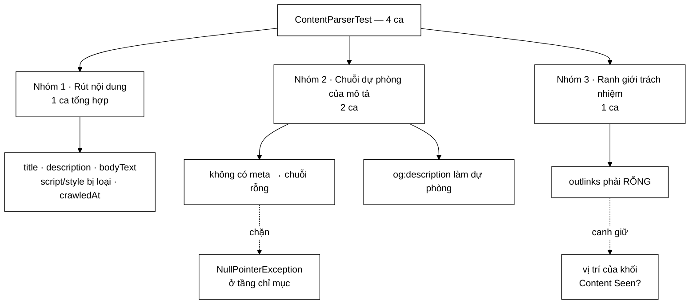

# ContentParserTest — ca test giá trị nhất ở đây khẳng định lớp **KHÔNG** làm một việc

**File nguồn:** `search-engine/src/test/java/com/vnsearch/crawler/ContentParserTest.java` (74 dòng)
**Gói:** `com.vnsearch.crawler` · **Khung:** JUnit 5 · **Số ca:** 4
**Lớp được kiểm:** [`ContentParser.md`](../../../../../main/java/com/vnsearch/crawler/ContentParser.md)
**Đọc kèm:** [`LinkExtractorTest.md`](./LinkExtractorTest.md) · [`ContentSeenFilterTest.md`](./ContentSeenFilterTest.md) · [`LanguageFilterTest.md`](./LanguageFilterTest.md)

---

## 📌 Hiểu trong 30 giây

Bốn ca test cho khối *Content Parser*. Ba ca đầu kiểm những thứ quen thuộc —
tiêu đề, mô tả meta, thân bài. Ca thứ tư mới là ca đáng đọc: nó khẳng định
`ContentParser` **không bóc liên kết**, tức là canh giữ một **ranh giới kiến
trúc** chứ không phải một giá trị trả về.

```
   VÌ SAO "KHÔNG BÓC LIÊN KẾT" LÀ MỘT TÍNH CHẤT ĐÁNG KIỂM

   Sơ đồ kiến trúc crawler đặt khối Content Seen? Ở GIỮA:

     Content Parser ──► Content Seen? ──► Link Extractor
                              │
                              └── Yes (trùng) ──► VỨT trang

   Nếu parser bóc liên kết luôn, phần việc đó chạy cho CẢ những
   trang sắp bị vứt vì trùng nội dung — công vô ích trên đúng
   những trang mà kiến trúc sinh ra để loại bỏ sớm.

   Đây chính là lỗi của lớp HtmlExtractor bản cũ.
```



---

## 1. Bố cục: 4 ca chia ba nhóm

```
   ┌─ NHÓM 1 · MỘT CA TỔNG HỢP, BẢY PHÉP KHẲNG ĐỊNH ──────────┐
   │  extractsTitleDescriptionAndBody                          │
   │      url · title · metaDescription · bodyText có          │
   │      · KHÔNG có script · KHÔNG có style · crawledAt       │
   └───────────────────────────────────────────────────────────┘
   ┌─ NHÓM 2 · CHUỖI DỰ PHÒNG CỦA metaDescription ────────────┐
   │  missingMetaDescriptionFallsBackToEmptyString             │
   │  ogDescriptionUsedWhenNoStandardMetaDescription           │
   └───────────────────────────────────────────────────────────┘
   ┌─ NHÓM 3 · RANH GIỚI TRÁCH NHIỆM ─────────────────────────┐
   │  parserDoesNotExtractLinks              ← ca đáng đọc nhất│
   └───────────────────────────────────────────────────────────┘
```

Cả bốn ca dùng chung **một** thực thể parser khai báo ở mức trường:

```java
private final ContentParser parser = new ContentParser();
```

Chi tiết này hợp lệ ở đây vì `ContentParser` **không có trạng thái** — mọi thứ nó
cần đều nằm trong tham số `parse(url, document)`. JUnit 5 dựng lại thực thể lớp
test cho mỗi ca, nên kể cả có trạng thái thì cũng không rò rỉ; nhưng việc lớp gốc
không giữ trạng thái mới là điều làm cách viết này an toàn thật sự.

---

## 2. `extractsTitleDescriptionAndBody` — ca tổng hợp, và hai phép quan trọng đều là `assertFalse`

```java
String html = """
        <html>
        <head>
            <title>Trang chu VnSearch</title>
            <meta name="description" content="Cong cu tim kiem tu xay">
            <script>var x = 1;</script>
            <style>.a { color: red; }</style>
        </head>
        <body>
            <nav>Menu</nav>
            <p>Noi dung chinh cua trang.</p>
            <footer>Ban quyen</footer>
        </body>
        </html>
        """;
Document doc = Jsoup.parse(html, "https://vnsearch.example/");
WebDocument webDoc = parser.parse("https://vnsearch.example/", doc);
```

Bảy phép khẳng định, nhưng chỉ hai phép nói được điều mà một cài đặt ngây thơ sẽ
làm sai:

```java
assertFalse(webDoc.getBodyText().contains("var x"),      "Khong duoc chua noi dung script");
assertFalse(webDoc.getBodyText().contains("color: red"), "Khong duoc chua noi dung style");
```

```
   VÌ SAO PHẢI LOẠI script VÀ style TRƯỚC KHI LẤY TEXT

   Cài đặt ngây thơ:   document.body().text()
   Jsoup lấy text của MỌI node con, kể cả nội dung <script>
   và <style> nếu chúng nằm trong body — mà trên báo điện tử
   Việt Nam thì <script> nằm rải khắp body chứ không chỉ head.

   Hậu quả nếu lọt:
     • bodyText của mỗi trang lẫn vài KB mã JavaScript
     • VietnameseTokenizer băm mã đó thành "token":
         function · var · googletag · pubads · dataLayer
     • các token này xuất hiện trong GẦN NHƯ MỌI trang
       ⇒ IDF của chúng gần 0, nên chúng không làm hỏng xếp hạng
       ⇒ NHƯNG chúng phình chỉ mục ngược lên nhiều lần
     • và tệ nhất: đoạn trích (snippet) trong trang kết quả
       có thể rơi trúng một đoạn mã JavaScript

   TRIỆU CHỨNG THẬT: kết quả tìm kiếm hiện mô tả kiểu
   "googletag.cmd.push(function() { googletag.display..."
```

Cách lớp gốc làm — và lý do phải `clone()`:

```java
private String extractBodyText(Document document) {
    Document clone = document.clone();
    clone.select("script, style, noscript, nav, footer, header, iframe, svg").remove();
    return clone.body() != null ? clone.body().text().trim() : "";
}
```

```
   VÌ SAO clone() LÀ BẮT BUỘC, VÀ VÌ SAO CA TEST NÀY
   VÔ TÌNH KHÔNG BẮT ĐƯỢC LỖI ĐÓ

   Không clone thì .remove() cắt thẳng vào cây DOM gốc —
   cây mà LinkExtractor sẽ nhận SAU đó.

     document ──► ContentParser cắt <nav>, <footer>, <header>
                        │
                        ▼
              LinkExtractor nhận cây ĐÃ BỊ CẮT
              ⇒ mất toàn bộ liên kết điều hướng và chân trang
              ⇒ crawler đi được vài trang rồi cạn frontier

   Ca test này gọi parse() đúng MỘT lần và không dùng lại
   `doc` sau đó, nên nó KHÔNG phát hiện được việc bỏ clone().
   Đây là khoảng trống thật — xem mục 6.
```

Ba phép còn lại là hàng rào rẻ tiền: `getUrl()` phải là **URL truyền vào chứ
không phải base URI của Jsoup** (hai thứ này trùng nhau trong ca test, nên phép
kiểm hơi yếu), `getTitle()` lấy từ `<title>`, và:

```java
assertNotNull(webDoc.getCrawledAt());
```

Phép cuối trông thừa nhưng không thừa: `crawledAt` là trường duy nhất parser tự
sinh (`Instant.now()`) chứ không rút từ DOM. Quên gọi `setCrawledAt` thì trường
này là `null`, và chỗ vỡ nằm ở tận lúc serial hoá corpus ra JSON hoặc lúc sắp xếp
kết quả theo độ mới — xa hẳn chỗ sai.

> **Chỗ yếu rõ nhất của ca này:** dữ liệu vào có `<nav>Menu</nav>` và
> `<footer>Ban quyen</footer>`, lớp gốc loại cả hai, nhưng **không có phép khẳng
> định nào** kiểm điều đó. Hai thẻ đó ngồi trong HTML mẫu như thể sắp được kiểm
> rồi bị bỏ quên. Bỏ `nav, footer, header` khỏi bộ chọn trong `extractBodyText`
> thì cả bốn ca vẫn xanh.

---

## 3. Nhóm 2 — chuỗi dự phòng của `metaDescription`, kiểm bằng hai ca chứ không một

```java
private String extractMetaDescription(Document document) {
    Element meta = document.selectFirst("meta[name=description]");
    if (meta == null) {
        meta = document.selectFirst("meta[property=og:description]");
    }
    return meta != null ? meta.attr("content").trim() : "";
}
```

Ba nhánh, và bộ test đi qua hai nhánh sau:

```
   meta[name=description] có     →  dùng nó       (ca nhóm 1 đi qua)
   không có, og:description có   →  dùng og       (ca 3)
   không có cả hai               →  ""  RỖNG      (ca 2)
                                      ↑
                              KHÔNG PHẢI null
```

### 3.1 `missingMetaDescriptionFallsBackToEmptyString` — chuỗi rỗng, không phải `null`

```java
Document doc = Jsoup.parse("<html><head><title>T</title></head><body>Noi dung</body></html>");
WebDocument webDoc = parser.parse("https://a.vn/", doc);
assertEquals("", webDoc.getMetaDescription());
```

Tên ca đã nói hết ý định, và ý định đó quan trọng hơn vẻ ngoài:

```
   "" VÀ null KHÁC NHAU Ở CHỖ NÀO TRONG HỆ NÀY

   Phần lớn trang trên web KHÔNG có meta description.
   Trên một phiên crawl 20.000 trang, đây là nhánh chạy
   NHIỀU NHẤT trong ba nhánh — không phải nhánh hiếm.

   Nếu trả về null:
     • ResultRanker gọi metaDescription.length() → NPE
     • Jackson ghi ra JSON là `null`, và trang kết quả
       hiện chữ "null" ngay dưới tiêu đề
     • mọi nơi dùng nó phải tự viết một phép kiểm null

   Trả "" một lần ở đây rẻ hơn kiểm null ở mười chỗ khác.
```

Ca này cũng là ca **duy nhất trong file gọi `Jsoup.parse` không kèm base URI** —
một cách nhắc rằng base URI chỉ cần khi phải phân giải liên kết tương đối, việc
mà lớp này cố ý không làm.

### 3.2 `ogDescriptionUsedWhenNoStandardMetaDescription` — dự phòng theo Open Graph

```java
String html = "<html><head><title>T</title>"
        + "<meta property=\"og:description\" content=\"Mo ta OG\"></head><body>x</body></html>";
```

Vì sao nhánh này tồn tại: nhiều toà soạn Việt Nam sinh thẻ Open Graph cho
Facebook/Zalo nhưng bỏ qua `meta name="description"` cổ điển. Không có nhánh dự
phòng, những trang đó vào chỉ mục với mô tả rỗng — và đoạn trích trong trang kết
quả phải cắt tạm từ `bodyText`, thường rơi đúng vào phần menu hoặc dòng ngày
tháng.

```
   ĐIỀU CA NÀY KHÔNG KIỂM — VÀ ĐÁNG LẼ NÊN KIỂM

   Không có ca nào cho trường hợp CÓ CẢ HAI thẻ.
   Thứ tự ưu tiên (name=description thắng og:description)
   là một quyết định thật, nằm ở thứ tự hai lệnh selectFirst,
   và ĐẢO NGƯỢC hai lệnh đó KHÔNG làm ca nào đỏ.

     <meta name="description" content="Bản chuẩn">
     <meta property="og:description" content="Bản OG">
              ↓
     Cài đặt hiện tại chọn "Bản chuẩn".
     Không có gì canh giữ lựa chọn đó.
```

---

## 4. `parserDoesNotExtractLinks` — ca kiểm một điều **không xảy ra**

```java
/**
 * Bao ve ranh gioi trach nhiem giua Content Parser va Link Extractor:
 * so do dat khoi Content Seen? o GIUA hai khoi nay, nen parser khong
 * duoc phep boc lien ket truoc.
 */
@Test
void parserDoesNotExtractLinks() {
    String html = "<html><body><a href=\"/tin-tuc\">Tin tuc</a></body></html>";
    Document doc = Jsoup.parse(html, "https://a.vn/");
    WebDocument webDoc = parser.parse("https://a.vn/", doc);
    assertTrue(webDoc.getOutlinks().isEmpty(), "Content Parser khong duoc boc lien ket");
}
```

Đây là dạng ca test hiếm gặp và hay bị coi là vô ích ("kiểm gì cái nó không
làm?"). Lập luận bảo vệ nó nằm ở chỗ: **thứ tự các khối trong sơ đồ kiến trúc là
một quyết định có giá, và quyết định đó chỉ tồn tại dưới dạng "lớp này không gọi
LinkExtractor"** — một sự vắng mặt. Sự vắng mặt thì không tự bảo vệ được; ai đó
thấy `Document` đã có sẵn trong tay sẽ thêm ba dòng bóc liên kết vào `parse()`
một cách rất tự nhiên, và không có gì phản đối.

```
   ĐIỀU GÌ XẢY RA NẾU AI ĐÓ "TIỆN TAY" BÓC LIÊN KẾT Ở ĐÂY

   Đường chạy hiện tại của mỗi trang:

     tải  ──► parse nội dung ──► Content Seen? ──┬─ trùng ─► VỨT
                                                 └─ mới  ─► lưu
                                                            └─► bus
                                                                 └─► LinkExtractor

   Nếu parse() bóc liên kết luôn:

     tải  ──► parse nội dung + BÓC LIÊN KẾT ──► Content Seen? ──┬─ trùng ─► VỨT
                                    ↑                            └─ mới ─► lưu
                          công này đã bỏ ra rồi

   Trên báo điện tử Việt Nam, tỉ lệ trùng nội dung KHÔNG nhỏ —
   cùng một bài nằm ở hai chuyên mục, bản AMP, bản in.
   Mỗi bản trùng phải trả giá bóc liên kết vô ích: duyệt lại
   toàn bộ DOM, phân giải từng href tương đối thành tuyệt đối.

   Và có một hậu quả nặng hơn cả chi phí: nếu liên kết của
   bản TRÙNG cũng được đẩy vào frontier, crawler sẽ đi lại
   đúng vùng đồ thị mà bản gốc đã đi — mất công hai lần,
   ở chỗ khó nhìn ra nhất.
```

Chi tiết cố ý trong cách viết ca: `Jsoup.parse(html, "https://a.vn/")` truyền base
URI, và `href="/tin-tuc"` là liên kết **tương đối**. Nghĩa là nếu parser có bóc
liên kết, nó sẽ bóc ra được `https://a.vn/tin-tuc` — ca test dựng đủ điều kiện
để việc bóc *thành công*, rồi khẳng định nó không xảy ra. Nếu dùng liên kết
tuyệt đối hoặc bỏ base URI, ca test sẽ yếu đi: một cài đặt sai vẫn có thể cho ra
danh sách rỗng vì phân giải thất bại, chứ không phải vì lớp cố ý không làm.

> Phép khẳng định dựa vào `WebDocument.outlinks` được khởi tạo sẵn là
> `new ArrayList<>()` chứ không phải `null` — xem
> [`WebDocument.md`](../../../../../main/java/com/vnsearch/model/WebDocument.md).
> Nhờ vậy `getOutlinks().isEmpty()` chạy được mà không cần kiểm `null` trước.

---

## 5. Kỹ thuật đáng học lại từ bộ test này

```
   ① KIỂM CẢ NHỮNG VIỆC LỚP KHÔNG LÀM
      parserDoesNotExtractLinks
      → ranh giới kiến trúc là một sự VẮNG MẶT,
        và sự vắng mặt cần một ca test mới tự bảo vệ được

   ② DỰNG ĐỦ ĐIỀU KIỆN ĐỂ HÀNH VI SAI CÓ THỂ XẢY RA
      href tương đối + base URI
      → nếu parser bóc liên kết thì nó SẼ bóc được;
        danh sách rỗng vì thế là bằng chứng thật

   ③ assertFalse(contains(...)) MẠNH HƠN assertEquals TOÀN VĂN
      assertFalse(bodyText.contains("var x"))
      → không khoá cứng vào cách Jsoup nối khoảng trắng,
        nhưng vẫn bắt được đúng thứ cần bắt

   ④ KHẲNG ĐỊNH "" CHỨ KHÔNG PHẢI notNull
      assertEquals("", webDoc.getMetaDescription())
      → nhánh chạy NHIỀU NHẤT trên web thật,
        và là chỗ NPE hay chui vào nhất

   ⑤ TEXT BLOCK CHO HTML NHIỀU DÒNG
      HTML mẫu đọc được như HTML thật, không phải một
      chuỗi nối bằng dấu + với \" khắp nơi
```

---

## 6. Hướng dẫn thực hành

### 6.1 Chạy

```powershell
cd search-engine

# Cả 4 ca
.\mvnw.cmd test "-Dtest=ContentParserTest"

# Một ca
.\mvnw.cmd test "-Dtest=ContentParserTest#parserDoesNotExtractLinks"

# Cùng với lớp anh em phía sau nó trong sơ đồ
.\mvnw.cmd test "-Dtest=ContentParserTest+LinkExtractorTest"
```

Trên PowerShell **phải bọc `-Dtest=...` trong nháy kép**.

### 6.2 Đọc kết quả

```
[INFO] Running com.vnsearch.crawler.ContentParserTest
[INFO] Tests run: 4, Failures: 0, Errors: 0, Skipped: 0
```

Khi ca `parserDoesNotExtractLinks` đỏ, thông điệp là câu nói thẳng vào ý định
kiến trúc chứ không phải một phép so sánh số:

```
[ERROR] parserDoesNotExtractLinks
        org.opentest4j.AssertionFailedError: Content Parser khong duoc boc lien ket
```

Báo cáo chi tiết: `search-engine/target/surefire-reports/com.vnsearch.crawler.ContentParserTest.txt`

### 6.3 Tự kiểm chứng — cố tình làm hỏng để xem ca nào đỏ

| Sửa gì trong `ContentParser.java` | Ca dự kiến đỏ |
|---|---|
| Bỏ `script, style` khỏi bộ chọn trong `extractBodyText` | `extractsTitleDescriptionAndBody` (hai phép `assertFalse`) |
| Trả `null` thay vì `""` khi không có thẻ meta | `missingMetaDescriptionFallsBackToEmptyString` |
| Bỏ nhánh dự phòng `og:description` | `ogDescriptionUsedWhenNoStandardMetaDescription` |
| Bỏ `setCrawledAt(Instant.now())` | `extractsTitleDescriptionAndBody` (`assertNotNull`) |
| Thêm `doc.setOutlinks(...)` bóc từ `a[href]` | `parserDoesNotExtractLinks` |
| Bỏ `.trim()` trong `extractMetaDescription` | **Không ca nào đỏ** — không dữ liệu mẫu nào có khoảng trắng thừa |
| Bỏ `nav, footer, header` khỏi bộ chọn | **Không ca nào đỏ** — dù HTML mẫu có sẵn cả hai thẻ |
| Bỏ `document.clone()`, cắt thẳng cây gốc | **Không ca nào đỏ** — không ca nào dùng lại `doc` sau `parse()` |
| Đảo thứ tự `name=description` và `og:description` | **Không ca nào đỏ** — không có ca nào cho trường hợp có cả hai |
| Xoá cả `extractDeclaredLanguage`, luôn trả `""` | **Không ca nào đỏ** — cả phương thức không được kiểm ở đây |

Năm dòng cuối là kết quả đáng giá nhất của bài tập này: bộ test bốn ca canh giữ
tốt phần *ý định kiến trúc*, nhưng để hở gần hết phần *chi tiết cài đặt*.

### 6.4 Cạm bẫy khi viết thêm ca cho lớp này

```
   ✗ Đừng assertEquals toàn văn bodyText.
     Jsoup quyết định cách nối khoảng trắng giữa các thẻ khối,
     và cách đó đổi giữa các phiên bản thư viện. Ca test sẽ đỏ
     sau một lần nâng phiên bản, vì một lý do không liên quan
     gì tới ContentParser.

   ✗ Đừng quên base URI khi HTML mẫu có liên kết tương đối.
     Jsoup.parse(html) không base URI thì absUrl("href") trả "",
     và ca test có thể xanh vì lý do sai.

   ✗ Đừng khẳng định giá trị CỤ THỂ của crawledAt.
     Nó là Instant.now(). Chỉ khẳng định được là nó khác null,
     hoặc nằm trong một khoảng quanh thời điểm gọi.

   ✗ Đừng dựng WebDocument bằng tay rồi so sánh cả đối tượng.
     WebDocument không cài equals() theo giá trị, và crawledAt
     thì không tái lập được.
```

---

## 7. Khoảng trống chưa phủ

```
   ✗ document.clone() — tính chất QUAN TRỌNG NHẤT chưa được kiểm.
     Không clone thì ContentParser phá cây DOM mà LinkExtractor
     sẽ nhận ngay sau đó, và crawler cạn frontier sau vài trang.
     Triệu chứng ở xa nguyên nhân hàng chục lớp.

   ✗ Loại nav / footer / header khỏi bodyText.
     HTML mẫu ĐÃ CÓ <nav> và <footer> nhưng không phép khẳng định
     nào chạm tới. Chỉ cần thêm hai dòng.

   ✗ Toàn bộ extractDeclaredLanguage: chuỗi ba mức
     <html lang> → meta[http-equiv=content-language] → og:locale.
     Không ca nào trong file này đi qua.

   ✗ Thứ tự ưu tiên khi có CẢ name=description lẫn og:description.

   ✗ Trang không có <body> — extractBodyText có nhánh
     `clone.body() != null ? ... : ""` mà không ca nào chạm.

   ✗ Trang có <title> rỗng hoặc không có <title>:
     document.title() trả "", và đó là tiêu đề sẽ hiện trong
     trang kết quả tìm kiếm.

   ✗ url truyền vào KHÁC base URI của Document.
     Hai giá trị này trùng nhau trong mọi ca, nên một cài đặt
     dùng nhầm document.baseUri() vẫn xanh — dù ở phiên crawl
     thật, sau chuyển hướng, hai giá trị này lệch nhau.
```

Hai ca đáng viết trước nhất, cả hai đều rẻ:

```java
@Test
void parseKhongDuocPhaCayDomGoc() {
    // Neu bo document.clone(), LinkExtractor se nhan mot cay
    // da bi cat mat <nav>/<footer> va mat gan het lien ket.
    Document doc = Jsoup.parse(
            "<html><body><nav><a href=\"/muc\">Muc</a></nav><p>Than bai</p></body></html>",
            "https://a.vn/");
    parser.parse("https://a.vn/", doc);
    assertEquals(1, doc.select("a[href]").size(),
            "ContentParser khong duoc sua cay DOM ma LinkExtractor se dung");
}

@Test
void metaDescriptionChuanThangOgDescription() {
    Document doc = Jsoup.parse("<html><head>"
            + "<meta name=\"description\" content=\"Ban chuan\">"
            + "<meta property=\"og:description\" content=\"Ban OG\">"
            + "</head><body>x</body></html>");
    assertEquals("Ban chuan", parser.parse("https://a.vn/", doc).getMetaDescription());
}
```

Ca thứ nhất là ca quan trọng hơn hẳn: nó bắt một lỗi có triệu chứng ở rất xa
(crawler dừng sớm không rõ lý do), và một dòng `document.clone()` thì rất dễ bị
coi là thừa rồi bị xoá đi trong một lần "dọn dẹp".

---

## 8. Bảng tổng hợp 4 ca

| # | Ca test | Nhóm | Tính chất được canh giữ |
|---|---|---|---|
| 1 | **`extractsTitleDescriptionAndBody`** | 1 | **`bodyText` không lẫn mã `script`/`style`** + url, title, meta, `crawledAt` khác `null` |
| 2 | `missingMetaDescriptionFallsBackToEmptyString` | 2 | Trả `""` chứ không `null` — nhánh chạy nhiều nhất trên web thật |
| 3 | `ogDescriptionUsedWhenNoStandardMetaDescription` | 2 | Nhánh dự phòng Open Graph |
| 4 | **`parserDoesNotExtractLinks`** | 3 | **Ranh giới với `LinkExtractor` — vị trí của khối `Content Seen?` trong sơ đồ** |

---

## 9. Liên kết

- Lớp được kiểm, kèm lập luận vì sao tách khỏi `HtmlExtractor` bản cũ: [`ContentParser.md`](../../../../../main/java/com/vnsearch/crawler/ContentParser.md)
- Khối đứng **sau** parser trong sơ đồ và là lý do parser không được bóc liên kết sớm: [`ContentSeenFilterTest.md`](./ContentSeenFilterTest.md)
- Lớp thật sự bóc liên kết — nửa còn lại của ranh giới mà ca 4 canh giữ: [`LinkExtractorTest.md`](./LinkExtractorTest.md)
- Lớp ghi đè trường `language` mà `extractDeclaredLanguage` chỉ đưa ra như một gợi ý: [`LanguageFilterTest.md`](./LanguageFilterTest.md)
- Kiểu dữ liệu trả về, nơi `outlinks` được khởi tạo sẵn thành danh sách rỗng: [`WebDocument.md`](../../../../../main/java/com/vnsearch/model/WebDocument.md)
- Nơi `parse()` được gọi trong đường chạy thật của một phiên crawl: [`CrawlerServiceBusWiringTest.md`](./CrawlerServiceBusWiringTest.md)
