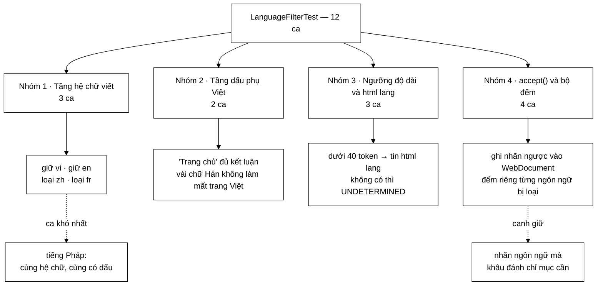

# LanguageFilterTest — bốn đoạn văn hằng số làm nên cả bộ test, và ca khó nhất là tiếng Pháp chứ không phải tiếng Trung

**File nguồn:** `search-engine/src/test/java/com/vnsearch/crawler/LanguageFilterTest.java` (188 dòng)
**Gói:** `com.vnsearch.crawler` · **Khung:** JUnit 5 · **Số ca:** 12
**Lớp được kiểm:** [`LanguageFilter.md`](../../../../../main/java/com/vnsearch/crawler/LanguageFilter.md)
**Đọc kèm:** [`UrlFilterTest.md`](./UrlFilterTest.md) · [`ContentParserTest.md`](./ContentParserTest.md) · [`ContentSeenFilterTest.md`](./ContentSeenFilterTest.md)

---

## 📌 Hiểu trong 30 giây

`LanguageFilter` thi hành chính sách corpus "chỉ giữ tiếng Việt và tiếng Anh"
bằng **ba tầng bằng chứng xếp theo độ tin cậy giảm dần**. 12 ca test không kiểm
ba tầng đó một cách đều tay — chúng tập trung vào đúng **những chỗ hai tầng có
thể cho kết luận trái ngược nhau**.

```
   BA ĐIỂM VA CHẠM MÀ BỘ TEST NHẮM VÀO
   ────────────────────────────────────────────────────────────
   ① Latinh có dấu ≠ tiếng Việt
      rejectsFrenchEvenThoughItIsLatinWithDiacritics
      → é à ô cũng là dấu, nhưng KHÔNG phải dấu tiếng Việt

   ② Nội dung THẮNG <html lang> khi mâu thuẫn
      contentBeatsAWrongHtmlLangAttribute
      → lang="en" mặc định của theme không được gán nhãn sai corpus

   ③ Thiếu bằng chứng thì CHO QUA, không vứt
      shortPagesFallBackToDeclaredLanguageAndAreKeptWhenUnknown
      → trang danh mục ít chữ chính là trang nhiều liên kết nhất
```

Và một chi tiết nằm ngay trong Javadoc của lớp test, đáng đọc trước mọi thứ
khác — nó giải thích vì sao bốn đoạn văn mẫu lại dài đến vậy:

```
   "Văn bản mẫu cố tình dài hơn MIN_TOKENS_FOR_CONTENT_EVIDENCE: đó là
    ngưỡng phân đôi hành vi của bộ lọc, và một mẫu ngắn hơn sẽ đi vào
    nhánh 'tin <html lang>' chứ không kiểm thử thứ mình định kiểm thử."
```



---

## 1. Bố cục: 12 ca chia bốn nhóm

Bộ test không dùng `@Nested`, nhưng đọc theo thứ tự trong file thì bốn nhóm hiện
ra rõ — và thứ tự ấy trùng với thứ tự ba tầng bằng chứng trong lớp gốc:

```
   ┌─ NHÓM 1 · TẦNG 1 — HỆ CHỮ VIẾT ───────────────────────────┐
   │  keepsVietnamese                                           │
   │  keepsEnglish                                              │
   │  rejectsChineseByScript                                    │
   │  rejectsFrenchEvenThoughItIsLatinWithDiacritics ← khó nhất │
   └────────────────────────────────────────────────────────────┘
   ┌─ NHÓM 2 · NGƯỠNG CỦA TẦNG 1 VÀ TẦNG 2 ────────────────────┐
   │  toleratesAFewForeignCharactersInsideAVietnamesePage       │
   │  vietnameseDiacriticsDecideEvenInVeryShortText             │
   └────────────────────────────────────────────────────────────┘
   ┌─ NHÓM 3 · <html lang> VÀ NGƯỠNG ĐỘ DÀI ───────────────────┐
   │  shortPagesFallBackToDeclaredLanguageAndAreKeptWhenUnknown │
   │  contentBeatsAWrongHtmlLangAttribute                       │
   │  normalizeLanguageTagKeepsOnlyThePrimarySubtag             │
   └────────────────────────────────────────────────────────────┘
   ┌─ NHÓM 4 · accept() — NHÁNH QUYẾT ĐỊNH VÀ SỐ LIỆU ─────────┐
   │  acceptTagsTheDocumentAndCountsPerLanguage                 │
   │  acceptWritesDetectedLanguageBackIntoTheDocument           │
   │  titleCountsAsEvidenceWhenTheBodyIsEmpty                   │
   └────────────────────────────────────────────────────────────┘
```

Chín ca đầu gọi thẳng `detect(declaredLang, text)` — hàm thuần, không trạng thái.
Ba ca cuối gọi `accept(WebDocument)` — hàm có tác dụng phụ (ghi nhãn, tăng bộ
đếm). Tách đôi như vậy là cố ý: hỏng ở `detect` và hỏng ở `accept` là hai loại
lỗi khác nhau, và người đọc báo cáo surefire biết ngay mình phải mở hàm nào.

---

## 2. Bốn hằng số văn bản — phần thiết kế quan trọng nhất của bộ test

Trước khi có ca test nào, file đã dành 30 dòng cho bốn đoạn văn. Đây không phải
dữ liệu độn:

| Hằng số | Vai trò | Đặc điểm cố ý |
|---|---|---|
| `VIETNAMESE_ARTICLE` | ca dương tính | Đủ dài (> 40 token) **và** dày dấu `ơ ư ă đ ắ ấ ệ` |
| `ENGLISH_ARTICLE` | ca dương tính | Đủ dài, tỷ lệ từ chức năng cao hơn 12% |
| `CHINESE_ARTICLE` | ca âm tính dễ | Hệ chữ Hán — tầng 1 kết luận, không cần tới tầng 3 |
| `FRENCH_ARTICLE` | **ca âm tính khó** | Latinh, có dấu, đủ dài — cả ba tầng đều phải chạy |

```
   VÌ SAO ĐỘ DÀI CỦA MẪU LÀ MỘT QUYẾT ĐỊNH, KHÔNG PHẢI NGẪU NHIÊN

   detect() rẽ đôi ở đây:

       if (total < MIN_TOKENS_FOR_CONTENT_EVIDENCE)   // 40 token
           return isViOrEn(hint) ? hint : UNDETERMINED;

   Một mẫu chỉ 20 token sẽ KHÔNG BAO GIỜ chạm tới phép đếm từ
   chức năng. Nó rơi thẳng vào nhánh "tin <html lang>".

   Hậu quả nếu người viết test không để ý:
     • Ca "rejectsFrench" vẫn XANH — nhưng vì detect("", short)
       trả về UNDETERMINED, chứ không phải vì bộ lọc nhận ra
       tiếng Pháp.
     • Xoá sạch ENGLISH_FUNCTION_WORDS đi, ca đó vẫn xanh.

   ⇒ Một bộ test xanh mà không canh giữ gì cả. Javadoc của lớp
     test ghi lại đúng cái bẫy này.
```

Chi tiết thứ hai đáng học: cả bốn mẫu đều là **cùng một chủ đề** (một trận đấu
bóng, một phiên họp). Chúng khác nhau ở đúng một biến — ngôn ngữ — nên khi một
ca đỏ thì nguyên nhân không thể là "đoạn tiếng Pháp nói về chủ đề lạ".

---

## 3. Nhóm 1 — tiếng Pháp là ca khó nhất, không phải tiếng Trung

Hai ca âm tính trông đối xứng nhưng đi qua hai đường hoàn toàn khác nhau trong
`detect()`:

```java
@Test
void rejectsChineseByScript() {
    LanguageFilter filter = new LanguageFilter();
    assertEquals("zh", filter.detect("", CHINESE_ARTICLE));
}

@Test
void rejectsFrenchEvenThoughItIsLatinWithDiacritics() {
    LanguageFilter filter = new LanguageFilter();
    assertEquals(LanguageFilter.OTHER_LATIN, filter.detect("", FRENCH_ARTICLE));
}
```

```
   HAI ĐƯỜNG ĐI TRONG detect()

   CHINESE_ARTICLE
     Tầng 1: foreignLetters/letters ≈ 100% > 10%   → DỪNG, trả "zh"
     Tầng 2, tầng 3: KHÔNG CHẠY

   FRENCH_ARTICLE
     Tầng 1: mọi chữ đều là LATIN, foreign = 0%    → đi tiếp
     Tầng 2: vietnameseMarks = 0                    → đi tiếp
             (é à è KHÔNG nằm trong U+1EA0..U+1EF9,
              cũng không thuộc {ơ ư ă đ})
     Tầng 3: total ≥ 40, viHits ≈ 0,
             enHits/total < 12%                     → trả OTHER_LATIN

   ⇒ Ca tiếng Trung kiểm 1 tầng. Ca tiếng Pháp kiểm CẢ BA.
```

Javadoc trên ca tiếng Pháp nói thẳng ra điều mà bộ test canh giữ:

> Bắt được nó là lý do bộ lọc chỉ đếm dấu ĐẶC TRƯNG tiếng Việt (`ơ ư ă đ` và
> khối `U+1EA0..U+1EF9`) chứ không đếm mọi ký tự có dấu — `é à ô` thì tiếng Pháp
> cũng đầy.

```
   MỘT CÀI ĐẶT SAI RẤT TỰ NHIÊN VÀ TRIỆU CHỨNG CỦA NÓ

   "Tiếng Việt là thứ tiếng Latinh nhiều dấu nhất, cứ đếm ký tự
    có dấu là xong."

       if (Character.isLetter(c) && c > 127) vietnameseMarks++;

   Ca keepsVietnamese  → vẫn XANH
   Ca keepsEnglish     → vẫn XANH
   Ca rejectsChinese   → vẫn XANH (tầng 1 chặn trước)
   Ca rejectsFrench    → ĐỎ, và chỉ ca này đỏ

   Triệu chứng thật nếu lọt: mọi bài tiếng Pháp, Bồ Đào Nha, Tây
   Ban Nha vào chỉ mục dưới nhãn "vi". Chúng tách token bình
   thường nên không gây lỗi kỹ thuật nào — chỉ lặng lẽ làm bẩn
   corpus và đội N trong công thức IDF.
```

Hai ca dương tính `keepsVietnamese` / `keepsEnglish` là hàng rào rẻ: chúng bảo
đảm rằng khi ai đó siết ngưỡng để đuổi tiếng Pháp, họ không đuổi luôn cả hai
ngôn ngữ mà corpus cần.

---

## 4. Nhóm 2 — hai ca định nghĩa hai ngưỡng số

Hai ca này không kiểm "đúng/sai" mà kiểm **giá trị của hằng số**. Đó là loại ca
dễ bị coi là thừa, nhưng chính là thứ giữ cho một lần "tinh chỉnh ngưỡng" không
âm thầm phá chính sách.

### 4.1 `toleratesAFewForeignCharactersInsideAVietnamesePage` — ngưỡng 10% chứ không phải 0

```java
String mixed = VIETNAMESE_ARTICLE + " (Trung Quốc: 越南)";
assertEquals(LanguageFilter.VIETNAMESE, filter.detect("", mixed));
```

```
   VÌ SAO KHÔNG THỂ DÙNG NGƯỠNG 0

   Bài tiếng Việt thật thường xuyên trích:
     • tên riêng chữ Hán trong bài về Trung Quốc, Nhật Bản
     • một dòng tiếng Nga trong bài dịch
     • ký hiệu Hy Lạp trong bài khoa học (α, β, Δ)

   Ngưỡng 0 ⇒ mọi bài như vậy bị vứt, VÀ liên kết của chúng
   không được bóc (xem Javadoc LanguageFilter: trang bị loại
   không được bóc liên kết). Mất trang, mất luôn cả nhánh.

   Phép tính trong ca test:
       2 chữ Hán / ~300 chữ cái ≈ 0,7%  <  10%   → GIỮ
```

Điểm yếu của ca này: nó chỉ kiểm **một phía** của ngưỡng. Không có ca nào đứng
ngay trên 10% để chứng minh ngưỡng thật sự là 10 chứ không phải 90. Đổi
`FOREIGN_SCRIPT_THRESHOLD` từ `0.10` thành `0.90` thì **không ca nào đỏ** —
xem mục 10.

### 4.2 `vietnameseDiacriticsDecideEvenInVeryShortText` — vì sao tầng 2 đứng trước phép đếm độ dài

```java
assertEquals(LanguageFilter.VIETNAMESE, filter.detect("", "Trang chủ"));
assertEquals(LanguageFilter.VIETNAMESE, filter.detect("en", "Thể thao"));
```

```
   TRẬT TỰ TRONG detect() LÀ THỨ ĐANG ĐƯỢC CANH GIỮ

   Tầng 2 (dấu phụ)        ← chạy TRƯỚC
   ────────────────────────
   Tầng 3 (đếm từ)         ← có phép kiểm "total < 40 thì bỏ cuộc"

   "Trang chủ" chỉ có 2 token — dưới 40 rất xa.
   Nếu phép kiểm độ dài đứng TRƯỚC tầng 2:
       detect("", "Trang chủ")   → UNDETERMINED   (mất nhãn "vi")
       detect("en", "Thể thao")  → "en"           (SAI NHÃN)

   Ký tự 'ủ' (U+1EE7) và 'ể' (U+1EC3) nằm trong khối
   U+1EA0..U+1EF9 — một ký tự thôi đã là bằng chứng mạnh hơn
   hẳn 40 token tiếng Anh.
```

Phép khẳng định thứ hai — `detect("en", "Thể thao")` — quan trọng hơn phép thứ
nhất: nó cho `<html lang>` một cơ hội nói sai, rồi kiểm rằng nội dung vẫn thắng
ngay cả trong đoạn văn hai chữ.

---

## 5. Nhóm 3 — `<html lang>` là phương án cuối, không phải nguồn sự thật

### 5.1 `contentBeatsAWrongHtmlLangAttribute`

```java
assertEquals(LanguageFilter.VIETNAMESE, filter.detect("en", VIETNAMESE_ARTICLE));
assertEquals(LanguageFilter.ENGLISH, filter.detect("vi", ENGLISH_ARTICLE));
assertEquals("zh", filter.detect("vi", CHINESE_ARTICLE));
```

Ba phép khẳng định = ba tầng, mỗi tầng một lần bị `<html lang>` mâu thuẫn:

| Phép | Tầng nào kết luận | `<html lang>` nói | Kết quả |
|---|---|---|---|
| 1 | tầng 2 (dấu phụ Việt) | `en` | `vi` |
| 2 | tầng 3 (từ chức năng) | `vi` | `en` |
| 3 | tầng 1 (hệ chữ) | `vi` | `zh` |

```
   VÌ SAO PHẢI KIỂM CẢ BA TẦNG THAY VÌ MỘT

   `hint` được dùng ở ba chỗ khác nhau trong detect():
     • nhánh text rỗng           →  isViOrEn(hint) ? hint : UNDETERMINED
     • nhánh letters == 0        →  như trên
     • nhánh total < 40          →  như trên
     • ENGLISH_WORD_THRESHOLD_WITH_HINT (0.05) — NỚI ngưỡng
       khi hint == "en"

   Một cài đặt lỡ đặt `if (isViOrEn(hint)) return hint;` lên ĐẦU
   hàm sẽ hỏng ở CẢ BA phép — nhưng một cài đặt chỉ hỏng ở tầng 3
   thì chỉ phép thứ hai đỏ. Ba phép, ba chẩn đoán khác nhau.

   TRIỆU CHỨNG THẬT NẾU TIN <html lang>:
   Rất nhiều theme WordPress/Ghost để mặc định lang="en" trên
   toàn site. Tin thẻ đó ⇒ phần lớn corpus tiếng Việt bị gán
   nhãn "en" ⇒ khâu đánh chỉ mục chọn nhầm bộ tách từ ⇒
   "Việt Nam" không còn được ghép thành một token.
```

### 5.2 `shortPagesFallBackToDeclaredLanguageAndAreKeptWhenUnknown`

```java
assertEquals(LanguageFilter.ENGLISH,     filter.detect("en-US", "Home page"));
assertEquals(LanguageFilter.VIETNAMESE,  filter.detect("vi", "Trang chu"));
assertEquals(LanguageFilter.UNDETERMINED, filter.detect("", "Trang chu"));
assertEquals(LanguageFilter.UNDETERMINED, filter.detect("fr", "Accueil"));
```

Bốn phép khẳng định vẽ ra đủ bảng chân trị của nhánh dự phòng:

```
   text ngắn (< 40 token, không dấu Việt)
   ┌──────────────┬────────────────────────────┐
   │  hint = "en" │  → "en"     (tin thẻ)      │
   │  hint = "vi" │  → "vi"     (tin thẻ)      │
   │  hint = ""   │  → "und"    (CHO QUA)      │
   │  hint = "fr" │  → "und"    (CHO QUA!)     │
   └──────────────┴────────────────────────────┘

   Phép thứ tư là phép đắt giá nhất: hint="fr" KHÔNG bị dịch
   thành "loại trang này". isViOrEn("fr") == false nên rơi về
   UNDETERMINED, và UNDETERMINED là nhãn ĐƯỢC GIỮ.

   Vì sao không loại: "Accueil" hai chữ không đủ để kết luận
   đây là một trang tiếng Pháp thật hay chỉ là một trang danh
   mục có thẻ lang khai sai. Trang danh mục lại chính là nơi
   có nhiều liên kết nhất — vứt nó là cắt cụt một nhánh crawl.
```

Chú ý `"Trang chu"` viết **không dấu** ở phép 2 và 3 — cố ý. Viết `"Trang chủ"`
thì tầng 2 chộp ngay và ca test không còn chạm tới nhánh dự phòng nữa. Đây là
cùng một cái bẫy mà Javadoc của lớp test cảnh báo, chỉ ở chiều ngược lại.

### 5.3 `normalizeLanguageTagKeepsOnlyThePrimarySubtag`

```java
assertEquals("en", LanguageFilter.normalizeLanguageTag("en-US"));
assertEquals("vi", LanguageFilter.normalizeLanguageTag("  VI  "));
assertEquals("zh", LanguageFilter.normalizeLanguageTag("zh_CN"));
assertEquals("",   LanguageFilter.normalizeLanguageTag(null));
assertEquals("",   LanguageFilter.normalizeLanguageTag(""));
```

Năm dòng cho một hàm tĩnh năm dòng — nhưng mỗi dòng là một dạng rác có thật
trong HTML ngoài đời: `en-US` (đúng chuẩn BCP 47), `  VI  ` (khoảng trắng và
chữ hoa), `zh_CN` (**gạch dưới** — sai chuẩn, nhưng vẫn gặp vì nhiều CMS lấy
thẳng `Locale.toString()` của Java đặt vào thẻ), `null` và rỗng.

```
   NẾU KHÔNG CẮT SUBTAG VÙNG

   detect() so sánh hint bằng VIETNAMESE.equals(code), tức "vi".
   Chuỗi "vi-VN" không bằng "vi".
   ⇒ Mọi trang khai lang="vi-VN" — cách khai ĐÚNG CHUẨN nhất —
     sẽ bị coi là không có hint.
   ⇒ Trang danh mục tiếng Việt ngắn rơi về UNDETERMINED thay vì "vi".

   Không hỏng to, nhưng làm số liệu báo cáo lệch: cột "und" phình
   ra bằng đúng số trang khai chuẩn.
```

---

## 6. Nhóm 4 — `accept()` có ba tác dụng phụ, và cả ba đều được kiểm

`detect()` là hàm thuần. `accept()` thì không: nó **ghi nhãn ngược vào tài
liệu**, **tăng bộ đếm**, và **quyết định vứt hay giữ**. Ba ca cuối chia nhau ba
việc đó.

### 6.1 `acceptTagsTheDocumentAndCountsPerLanguage` — bộ đếm là số liệu báo cáo

```java
assertTrue(filter.accept(docWith(VIETNAMESE_ARTICLE)));
assertTrue(filter.accept(docWith(ENGLISH_ARTICLE)));
assertFalse(filter.accept(docWith(CHINESE_ARTICLE)));
assertFalse(filter.accept(docWith(FRENCH_ARTICLE)));

assertEquals(1, filter.getAcceptedVietnameseCount());
assertEquals(1, filter.getAcceptedEnglishCount());
assertEquals(2, filter.getRejectedCount());
assertEquals(1L, filter.getRejectedByLanguage().get("zh"));
assertEquals(1L, filter.getRejectedByLanguage().get(LanguageFilter.OTHER_LATIN));
```

```
   VÌ SAO ĐẾM RIÊNG TỪNG NGÔN NGỮ CHỨ KHÔNG CHỈ ĐẾM TỔNG

   Bảng "ngôn ngữ bị loại → số trang" là thứ duy nhất cho biết
   bộ lọc đang làm ĐÚNG hay đang làm QUÁ TAY:

       zh    2.533   ← đúng mục tiêu chính sách
       other    17   ← vài trang Pháp/Đức, hợp lý
       ─────────────
       other 8.400   ← BÁO ĐỘNG: đang vứt nhầm trang tiếng Việt
                       (ngưỡng dấu phụ bị siết quá chặt?)

   Không tách theo ngôn ngữ thì cả hai tình huống trên trông
   giống hệt nhau trong báo cáo: "đã loại N trang".
```

Chi tiết `docWith()` đáng chú ý: nó đặt URL bằng `Math.abs(bodyText.hashCode())`
— mỗi tài liệu một URL khác nhau. Ở ca này URL không được dùng vào việc gì,
nhưng thói quen "mỗi tài liệu một danh tính" giữ cho ca test không hỏng nếu sau
này ai đó thêm khử trùng theo URL vào `accept`.

### 6.2 `acceptWritesDetectedLanguageBackIntoTheDocument`

```java
WebDocument doc = docWith(ENGLISH_ARTICLE);
doc.setLanguage("vi"); // <html lang> khai sai

assertTrue(filter.accept(doc));
assertEquals(LanguageFilter.ENGLISH, doc.getLanguage());
```

Ca này canh giữ một thứ mà không ca `detect()` nào chạm tới: **giá trị bị ghi
đè**. `accept` đọc `doc.getLanguage()` làm hint, rồi ghi kết quả ngược vào cùng
trường đó.

```
   HAI CÁCH CÀI SAI, HAI TRIỆU CHỨNG KHÁC NHAU

   ① Quên gọi doc.setLanguage(language)
      → tài liệu giữ nguyên nhãn "vi" sai của <html lang>
      → khâu đánh chỉ mục chọn bộ tách từ tiếng Việt cho bài
        tiếng Anh; "United States" bị ghép thành token lạ

   ② Ghi nhãn TRƯỚC khi detect
      → hint bị thay bằng chính kết quả trước đó; hàm mất
        tính bất biến khi gọi lại lần hai trên cùng tài liệu

   Ca này bắt được ①. KHÔNG bắt được ② — xem mục 10.
```

### 6.3 `titleCountsAsEvidenceWhenTheBodyIsEmpty`

```java
WebDocument doc = new WebDocument();
doc.setUrl("https://cn.example.vn/x");
doc.setTitle(CHINESE_ARTICLE);
doc.setBodyText("");

assertFalse(filter.accept(doc));
assertEquals("zh", doc.getLanguage());
```

```
   accept() GHÉP TIÊU ĐỀ VÀO TRƯỚC THÂN BÀI

       text = (title == null ? "" : title + " ")
            + (bodyText == null ? "" : bodyText);

   Không ghép ⇒ text rỗng ⇒ detect trả về UNDETERMINED
   ⇒ trang được GIỮ, và tệ hơn: liên kết của nó được bóc.

   Vì sao chi tiết này quan trọng ở quy mô thật:
   trang danh mục và trang phân trang gần như KHÔNG CÓ thân bài
   — ContentParser chỉ moi ra vài chục ký tự. Nhưng chúng là
   nguồn liên kết chính. Bỏ qua tiêu đề ở đây nghĩa là bộ lọc
   ngôn ngữ mù hoàn toàn với đúng loại trang dẫn crawler đi sâu
   vào vùng ngoại ngữ.
```

URL `https://cn.example.vn/x` trong ca này là một lời nhắc chéo: tiền tố `cn.`
lẽ ra đã bị [`UrlFilter`](../../../../../main/java/com/vnsearch/crawler/UrlFilter.md)
chặn từ trước khi tải. `LanguageFilter` là **tuyến hai**, tồn tại vì tuyến một
chỉ bắt được subdomain có quy ước.

---

## 7. Kỹ thuật đáng học lại từ bộ test này

```
   ① DỮ LIỆU MẪU PHẢI VƯỢT NGƯỠNG CỦA CHÍNH LỚP ĐANG KIỂM
      Javadoc lớp test ghi thẳng lý do mẫu phải dài hơn 40 token.
      Không có dòng đó, người sửa sau sẽ rút gọn mẫu cho "gọn"
      và cả bộ test lặng lẽ mất tác dụng.

   ② BỐN MẪU KHÁC NHAU ĐÚNG MỘT BIẾN
      Cùng chủ đề, cùng độ dài, chỉ khác ngôn ngữ.
      Ca đỏ ⇒ nguyên nhân chỉ có thể là ngôn ngữ.

   ③ CA ÂM TÍNH KHÓ QUAN TRỌNG HƠN CA ÂM TÍNH DỄ
      rejectsChinese kiểm 1 tầng.
      rejectsFrench  kiểm cả 3 — và là ca duy nhất phân biệt được
      "đếm dấu tiếng Việt" với "đếm mọi ký tự có dấu".

   ④ MỘT CA = MỘT BẢNG CHÂN TRỊ ĐẦY ĐỦ
      shortPagesFallBack... liệt kê cả bốn ô: en / vi / rỗng / fr.
      Bỏ ô "fr" đi thì chính sách "thiếu bằng chứng thì cho qua"
      không còn được canh giữ ở đâu cả.

   ⑤ VIẾT DỮ LIỆU KHÔNG DẤU KHI MUỐN TRÁNH MỘT NHÁNH
      "Trang chu" (không dấu) để ép rơi vào nhánh dự phòng.
      "Trang chủ" (có dấu) để ép chộp ở tầng 2.
      Cùng hai chữ, hai đường đi — và ca test chọn đúng đường.

   ⑥ TÁCH HÀM THUẦN KHỎI HÀM CÓ TÁC DỤNG PHỤ
      9 ca cho detect(), 3 ca cho accept().
      Đọc tên ca đỏ là biết ngay phải mở hàm nào.
```

---

## 8. Hướng dẫn thực hành

### 8.1 Chạy

```powershell
cd search-engine

# Cả 12 ca
.\mvnw.cmd test "-Dtest=LanguageFilterTest"

# Một ca
.\mvnw.cmd test "-Dtest=LanguageFilterTest#rejectsFrenchEvenThoughItIsLatinWithDiacritics"

# Cả gói crawler
.\mvnw.cmd test "-Dtest=com.vnsearch.crawler.*Test"
```

Trên PowerShell **phải bọc `-Dtest=...` trong nháy kép**, nếu không dấu `=` bị
nuốt và Maven chạy toàn bộ bộ test.

Lớp gốc còn có `main()` để xem nhanh hành vi mà không cần chạy test:

```powershell
.\mvnw.cmd -q exec:java "-Dexec.mainClass=com.vnsearch.crawler.LanguageFilter"
```

### 8.2 Đọc kết quả

```
[INFO] Running com.vnsearch.crawler.LanguageFilterTest
[INFO] Tests run: 12, Failures: 0, Errors: 0, Skipped: 0
```

Báo cáo chi tiết: `search-engine/target/surefire-reports/com.vnsearch.crawler.LanguageFilterTest.txt`

### 8.3 Tự kiểm chứng — cố tình làm hỏng để xem ca nào đỏ

| Sửa gì trong `LanguageFilter.java` | Ca dự kiến đỏ |
|---|---|
| Đếm mọi ký tự `c > 127` là `vietnameseMarks` | `rejectsFrenchEvenThoughItIsLatinWithDiacritics` |
| Đổi `FOREIGN_SCRIPT_THRESHOLD` từ `0.10` xuống `0.0` | `toleratesAFewForeignCharactersInsideAVietnamesePage` |
| Chuyển phép kiểm `total < 40` lên **trước** tầng 2 | `vietnameseDiacriticsDecideEvenInVeryShortText` |
| Đặt `if (isViOrEn(hint)) return hint;` ở đầu `detect` | `contentBeatsAWrongHtmlLangAttribute` (cả 3 phép) |
| Trả về `OTHER_LATIN` thay vì `UNDETERMINED` khi `total < 40` | `shortPagesFallBackToDeclaredLanguageAndAreKeptWhenUnknown` (2 phép cuối) |
| Bỏ `doc.setLanguage(language)` trong `accept` | `acceptWritesDetectedLanguageBackIntoTheDocument` + `titleCountsAsEvidenceWhenTheBodyIsEmpty` |
| Bỏ phần ghép `title` vào `text` trong `accept` | `titleCountsAsEvidenceWhenTheBodyIsEmpty` |
| Không cắt subtag ở `normalizeLanguageTag` (`"en-US"` giữ nguyên) | `normalizeLanguageTagKeepsOnlyThePrimarySubtag` |
| Bỏ `rejectedByLanguage.computeIfAbsent(...)` | `acceptTagsTheDocumentAndCountsPerLanguage` |
| Thêm `"a"`, `"an"`, `"de"` vào `ENGLISH_FUNCTION_WORDS` | *không ca nào đỏ* — xem mục 10 |

Dòng cuối bảng là điều đáng suy nghĩ nhất: Javadoc của lớp gốc nói rõ vì sao cố
ý loại `a`, `an`, `no`, `en`, `de` khỏi bảng từ tiếng Anh, nhưng **không ca test
nào canh giữ quyết định đó**. Đoạn tiếng Pháp mẫu không đủ dày `de`/`des` để
vượt ngưỡng 12%.

### 8.4 Cạm bẫy khi viết thêm ca cho lớp này

```
   ✗ Đừng viết mẫu ngắn rồi kỳ vọng kiểm được tầng 3.
     Dưới 40 token là detect() bỏ cuộc và trả về theo <html lang>.
     Ca vẫn xanh, nhưng xanh vì lý do khác hẳn thứ bạn định kiểm.

   ✗ Đừng dùng chuỗi tiếng Việt CÓ DẤU cho ca kiểm nhánh dự phòng.
     Một chữ 'ủ' là tầng 2 kết luận ngay, không bao giờ tới nhánh
     bạn muốn chạm.

   ✗ Đừng dùng chung một instance LanguageFilter cho nhiều ca.
     Bộ đếm là trạng thái tích luỹ. Mỗi ca trong file này đều tự
     new LanguageFilter() — đó là lý do thứ tự chạy không ảnh
     hưởng kết quả.

   ✗ Đừng assert vào getRejectedByLanguage() bằng equals trên cả Map.
     Map được sắp giảm dần theo số lượng; hai ngôn ngữ bằng điểm
     thì thứ tự không được lớp bảo đảm. Luôn .get(khoá).

   ✗ Đừng quên rằng UNDETERMINED là nhãn ĐƯỢC GIỮ, không phải nhãn
     bị loại. assertFalse(accept(...)) cho một trang "und" sẽ đỏ.
```

---

## 9. Bảng tổng hợp 12 ca

| # | Ca test | Nhóm | Tính chất được canh giữ |
|---|---|---|---|
| 1 | `keepsVietnamese` | 1 | Ca dương tính — đừng siết ngưỡng tới mức đuổi cả tiếng Việt |
| 2 | `keepsEnglish` | 1 | Ca dương tính — ngưỡng từ chức năng 12% không quá cao |
| 3 | `rejectsChineseByScript` | 1 | Tầng 1 — hệ chữ Hán, `SCRIPT_LANGUAGE` ánh xạ đúng "zh" |
| 4 | **`rejectsFrenchEvenThoughItIsLatinWithDiacritics`** | 1 | **Chỉ đếm dấu ĐẶC TRƯNG Việt, không đếm mọi dấu** |
| 5 | `toleratesAFewForeignCharactersInsideAVietnamesePage` | 2 | `FOREIGN_SCRIPT_THRESHOLD` là 10%, không phải 0 |
| 6 | **`vietnameseDiacriticsDecideEvenInVeryShortText`** | 2 | **Tầng 2 chạy TRƯỚC phép kiểm độ dài của tầng 3** |
| 7 | **`shortPagesFallBackToDeclaredLanguageAndAreKeptWhenUnknown`** | 3 | **Thiếu bằng chứng thì CHO QUA — cả 4 ô bảng chân trị** |
| 8 | **`contentBeatsAWrongHtmlLangAttribute`** | 3 | **Nội dung thắng `<html lang>` ở cả ba tầng** |
| 9 | `normalizeLanguageTagKeepsOnlyThePrimarySubtag` | 3 | `en-US`, `zh_CN`, khoảng trắng, `null` |
| 10 | `acceptTagsTheDocumentAndCountsPerLanguage` | 4 | Bốn bộ đếm + bảng "ngôn ngữ bị loại → số trang" |
| 11 | `acceptWritesDetectedLanguageBackIntoTheDocument` | 4 | Nhãn ghi ngược vào `WebDocument` cho khâu đánh chỉ mục |
| 12 | **`titleCountsAsEvidenceWhenTheBodyIsEmpty`** | 4 | **Tiêu đề được ghép vào — trang danh mục không có thân bài** |

---

## 10. Khoảng trống chưa phủ

```
   ✗ NGƯỠNG CHỈ ĐƯỢC KIỂM MỘT PHÍA.
     Không ca nào đứng NGAY TRÊN ngưỡng. Hệ quả cụ thể:
       FOREIGN_SCRIPT_THRESHOLD  0.10 → 0.90   : không ca nào đỏ
       VIETNAMESE_WORD_THRESHOLD 0.05 → 0.50   : không ca nào đỏ
       ENGLISH_WORD_THRESHOLD    0.12 → 0.30   : không ca nào đỏ
     Bốn hằng số ngưỡng, chỉ một cái (10%) có ca chạm tới.

   ✗ ENGLISH_WORD_THRESHOLD_WITH_HINT (0.05) KHÔNG CÓ CA NÀO.
     Đây là nhánh duy nhất mà <html lang> được phép ẢNH HƯỞNG tới
     kết luận của tầng 3 — tức là ngoại lệ của chính sách "nội dung
     thắng thẻ lang". Xoá hẳn nhánh này đi, bộ test vẫn xanh 12/12.

   ✗ ENGLISH_FUNCTION_WORDS cố ý loại a/an/no/en/de.
     Javadoc giải thích kỹ vì sao. Không ca nào canh giữ.

   ✗ accept(null) → false. Không ca nào gọi.

   ✗ getAcceptedUndeterminedCount() không xuất hiện trong bộ test.
     Đó lại là bộ đếm quan trọng nhất để phát hiện bộ lọc "cho qua
     quá nhiều" ở môi trường thật.

   ✗ SAMPLE_LIMIT = 20.000 ký tự. Không ca nào dựng văn bản dài
     hơn để chứng minh phần thừa bị cắt.

   ✗ Gọi accept() HAI LẦN trên cùng một WebDocument.
     Lần hai đọc lại nhãn do lần một ghi làm hint. Ngữ nghĩa hiện
     không được định nghĩa ở đâu, và không ca nào chạm tới.

   ✗ Hoà điểm ở tầng 1: văn bản nửa Hàn nửa Nga.
     foreignByLanguage.max() khi hai giá trị bằng nhau — thứ tự
     không tất định, kết quả không được lớp bảo đảm.
```

Ca đáng viết trước nhất là ca canh giữ ngưỡng nới cho tiếng Anh — nhánh duy nhất
chưa được chạm tới:

```java
@Test
void htmlLangEnNoiNguongTuChucNangChoTiengAnh() {
    LanguageFilter filter = new LanguageFilter();
    // Văn bản tiếng Anh "khô": đủ dài, nhưng tỷ lệ từ chức năng
    // nằm giữa 5% và 12% — dạng bản tin liệt kê số liệu.
    String kho = ENGLISH_ARTICLE.replace(" the ", " ").replace(" of ", " ")
            .replace(" and ", " ").replace(" that ", " ");

    assertEquals(LanguageFilter.OTHER_LATIN, filter.detect("", kho),
            "Khong co hint thi nguong van la 12%");
    assertEquals(LanguageFilter.ENGLISH, filter.detect("en", kho),
            "Co hint 'en' thi nguong noi xuong 5% — hai bang chung yeu cong lai");
}
```

Ca này bắt được đúng thứ mà 12 ca hiện tại bỏ sót: hằng số
`ENGLISH_WORD_THRESHOLD_WITH_HINT` và nhánh `if` dùng nó.

---

## 11. Liên kết

- Lớp được kiểm, kèm bảng đo token của từng ngôn ngữ và lý do chọn từng ngưỡng: [`LanguageFilter.md`](../../../../../main/java/com/vnsearch/crawler/LanguageFilter.md)
- **Tuyến phòng thủ thứ nhất** cho cùng chính sách corpus vi/en — chặn theo tiền tố host trước khi tải, rẻ hơn nhiều nhưng chỉ bắt được subdomain có quy ước: [`UrlFilterTest.md`](./UrlFilterTest.md)
- Khối đứng ngay trước trong sơ đồ, nơi sinh ra `title` và `bodyText` mà bộ lọc này đọc: [`ContentParserTest.md`](./ContentParserTest.md)
- Khối đứng ngay sau; hiểu vì sao "trang bị loại không được bóc liên kết" lại quan trọng đến vậy: [`ContentSeenFilterTest.md`](./ContentSeenFilterTest.md)
- Bộ tách từ mà nhãn ngôn ngữ được ghi ra ở đây quyết định cách gọi — và là nơi bài tiếng Trung "hỏng" thành một token 19 ký tự: [`../index/VietnameseTokenizerTest.md`](../index/VietnameseTokenizerTest.md)
