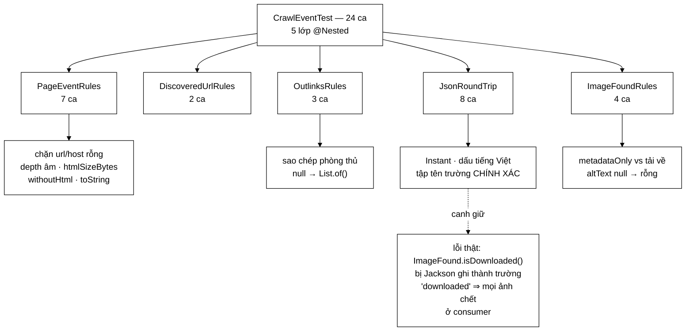

# CrawlEventTest — bộ test kéo một lỗi chỉ có Docker mới bắt được về chạy trong vài mili-giây

**File nguồn:** `search-engine/src/test/java/com/vnsearch/crawler/bus/CrawlEventTest.java` (335 dòng)
**Gói:** `com.vnsearch.crawler.bus` · **Khung:** JUnit 5 (`@Nested`) · **Số ca:** 24
**Lớp được kiểm:** [`PageEvent.md`](../../../../../../main/java/com/vnsearch/crawler/bus/PageEvent.md) · [`DiscoveredUrl.md`](../../../../../../main/java/com/vnsearch/crawler/bus/DiscoveredUrl.md) · [`OutlinksExtracted.md`](../../../../../../main/java/com/vnsearch/crawler/bus/OutlinksExtracted.md) · [`ImageFound.md`](../../../../../../main/java/com/vnsearch/crawler/bus/ImageFound.md)
**Đọc kèm:** [`InProcessCrawlEventBusTest.md`](./InProcessCrawlEventBusTest.md) · [`KafkaCrawlBusIT.md`](./KafkaCrawlBusIT.md) · [`../CrawlerServiceBusWiringTest.md`](../CrawlerServiceBusWiringTest.md)

---

## 📌 Hiểu trong 30 giây

24 ca cho **bốn record** — bốn thông điệp chạy trên bus sự kiện crawl. Viết
test cho một `record` nghe như thừa: record tự sinh `equals`, `hashCode`,
accessor. Nhưng phần đáng kiểm không phải phần được sinh ra, mà là **phần
người viết thêm vào**: khối kiểm tra trong constructor compact, `@JsonIgnore`
trên các accessor dẫn xuất, và `toString` được viết đè.

```
   BA THỨ TEST NÀY CANH GIỮ MÀ RECORD KHÔNG TỰ LO

   ① Constructor compact — chặn thông điệp HỎNG lọt lên bus
      host rỗng ⇒ Kafka không có khoá phân hoạch ⇒ không định tuyến được

   ② @JsonIgnore trên accessor dẫn xuất — chặn TRƯỜNG THỪA vào JSON
      thiếu nó ⇒ UnrecognizedPropertyException ở phía consumer

   ③ toString viết đè — chặn 80 KB HTML đổ vào tệp log MỖI trang
```

Điểm quan trọng nhất của cả file nằm ở Javadoc của nhóm `JsonRoundTrip`: nó ghi
lại một lỗi **đã xảy ra thật**, lọt qua toàn bộ bộ test in-process, và chỉ bị
`KafkaCrawlBusIT` — bài cần Docker, chạy ở job CI riêng — bắt được. Nhóm này
tồn tại để kéo phép kiểm ấy **về bộ test nhanh**.



---

## 1. Bố cục: 24 ca chia năm lớp `@Nested`

Khác `TrieTest` (nhóm ngầm theo thứ tự), file này khai báo nhóm **tường minh**
bằng `@Nested`. Có lý do: bốn record là bốn chủ thể độc lập, và nhóm thứ năm
(`JsonRoundTrip`) cắt ngang cả bốn.

```
   ┌─ PageEventRules · 7 ca ───────────────────────────────────┐
   │  rejectsBlankUrl                                          │
   │  rejectsBlankHost                      ← khoá phân hoạch  │
   │  rejectsNegativeDepth                                     │
   │  htmlSizeIsCountedInUtf8Bytes                             │
   │  htmlSizeIsZeroWhenHtmlAbsent                             │
   │  withoutHtmlKeepsEveryOtherField                          │
   │  toStringNeverLeaksHtml                ← chống đầy ổ đĩa  │
   └───────────────────────────────────────────────────────────┘
   ┌─ DiscoveredUrlRules · 2 ca ───────────────────────────────┐
   │  rejectsBlankUrlOrHost · rejectsNegativeDepth             │
   └───────────────────────────────────────────────────────────┘
   ┌─ OutlinksRules · 3 ca ────────────────────────────────────┐
   │  copiesTheListDefensively              ← bất biến thật sự │
   │  nullListBecomesEmpty · rejectsBlankSourceUrl             │
   └───────────────────────────────────────────────────────────┘
   ┌─ JsonRoundTrip · 8 ca (NHÓM QUAN TRỌNG NHẤT) ─────────────┐
   │  pageEventRoundTripsUnchanged                             │
   │  instantSurvivesTheRoundTrip           ← JavaTimeModule   │
   │  vietnameseDiacriticsSurviveTheRoundTrip                  │
   │  imageFoundRoundTripsUnchanged         ← LỖI ĐÃ XẢY RA    │
   │  downloadedImageRoundTripsUnchanged                       │
   │  discoveredUrlRoundTripsUnchanged                         │
   │  outlinksRoundTripUnchanged                               │
   │  noDerivedFieldLeaksIntoTheJson        ← hàng rào tổng    │
   └───────────────────────────────────────────────────────────┘
   ┌─ ImageFoundRules · 4 ca ──────────────────────────────────┐
   │  metadataOnlyIsNotMarkedAsDownloaded                      │
   │  nullAltBecomesEmptyAndCountsAsMissing                    │
   │  downloadedImageCarriesHash · rejectsBlankUrls            │
   └───────────────────────────────────────────────────────────┘
```

Javadoc mở đầu file nêu thẳng lý do tồn tại của cả bộ:

```
   "Vi sao dang test cho mot record: cac phep kiem tra trong constructor
    chinh la thu chan mot thong diep hong LOT LEN bus. Mot PageEvent thieu
    host khong dinh tuyen duoc, va neu khong chan tai cho tao thi loi chi
    lo ra o phia consumer — xa cho sinh loi, thuong la luc dang chay that."
```

Đây là lập luận **fail fast**: chi phí của một lỗi tỉ lệ với khoảng cách giữa
nơi nó sinh ra và nơi nó lộ ra.

---

## 2. `PageEventRules` — `rejectsBlankHost` là ca có hậu quả xa nhất

```java
/** Host la KHOA PHAN HOACH — thieu no thi Kafka khong dinh tuyen duoc. */
@Test
void rejectsBlankHost() {
    assertThrows(IllegalArgumentException.class,
            () -> page("https://a.com/x", ""));
    assertThrows(IllegalArgumentException.class,
            () -> page("https://a.com/x", null));
}
```

Ba dòng chú thích đó là cả câu chuyện. `host` không phải một trường mô tả — nó
là **khoá Kafka**, thứ quyết định thông điệp rơi vào phân hoạch nào.

```
   CHUỖI HẬU QUẢ KHI host RỖNG LỌT QUA

   KafkaCrawlEventBus.send(topic, key=host, payload)
                                 ↑
                            key = null

   Kafka: key null ⇒ chọn phân hoạch theo lối xoay vòng / dính-phân-hoạch
   ⇒ hai URL của CÙNG một host rơi vào HAI phân hoạch khác nhau
   ⇒ hai tiến trình consumer khác nhau xử lý cùng một host

   Cái vỡ theo:
     • Bộ lọc Bloom chống trùng theo host không còn ĐẦY ĐỦ
       (mỗi tiến trình chỉ thấy một nửa URL của host đó)
     • Chính sách lịch sự 1 giây/host thành 2 request/giây
       ⇒ bị chặn IP, và người vận hành không hiểu vì sao

   TRIỆU CHỨNG: crawl vẫn chạy, không có ngoại lệ nào, chỉ có
   một trang web bắt đầu trả 429 — cách nguyên nhân rất xa.
```

Ca này kiểm **cả `""` lẫn `null`**. Đó không phải sự dư thừa: `null.isBlank()`
ném `NullPointerException`, nên một khối kiểm chỉ viết `host.isBlank()` sẽ ném
đúng loại ngoại lệ **sai** — và `assertThrows(IllegalArgumentException.class)`
bắt được sự khác biệt đó.

### 2.1 `htmlSizeIsCountedInUtf8Bytes` — ký tự không phải byte

```java
PageEvent event = new PageEvent("https://a.com", "a.com", 0, "t", "b", "vi",
        "Đường", "h", Instant.EPOCH, "job-1");
// 6 ky tu nhung 9 byte UTF-8: Đ = 2 byte, ơ = 3 byte, còn lại 1 byte.
assertEquals("Đường".getBytes(java.nio.charset.StandardCharsets.UTF_8).length,
        event.htmlSizeBytes());
```

| Nếu cài đặt dùng | Với `"Đường"` cho ra | Hậu quả |
|---|---|---|
| `html.length()` | 5 | Ước lượng dung lượng thông điệp **thiếu tới ~40 %** cho nội dung tiếng Việt |
| `html.getBytes(UTF_8).length` | 9 | Đúng con số Kafka thực sự phải chở |

Đây là chỗ chi tiết "tiếng Việt" có hậu quả kỹ thuật thật: một trang tiếng Anh
1 MB ký tự là 1 MB byte, một trang tiếng Việt 1 MB ký tự có thể là 2–3 MB byte
— và trần `max.request.size` tính theo **byte**. Xem ca
`largePageWithinTheRaisedLimitIsAccepted` trong
[`KafkaCrawlBusIT.md`](./KafkaCrawlBusIT.md).

Chú ý cách viết phép khẳng định: nó **không** viết thẳng số `9`, mà tính lại
bằng `getBytes(UTF_8).length`. Hơi vòng vo, nhưng nó nêu rõ *quy tắc* thay vì
một *hằng số ma* mà người đọc sau phải tự đoán từ đâu ra.

### 2.2 `withoutHtmlKeepsEveryOtherField` — chín phép khẳng định, không thừa cái nào

```java
PageEvent full = page("https://a.com/x", "a.com");
PageEvent slim = full.withoutHtml();

assertNull(slim.html());
assertEquals(full.url(), slim.url());
... // và bảy trường còn lại
assertEquals(full.jobId(), slim.jobId());
```

`withoutHtml()` được cài bằng cách gọi lại constructor với **mười tham số viết
tay** — kiểu mã dễ sai nhất trong Java: một dòng chép nhầm thứ tự, hoặc thêm
một component mới vào record mà quên cập nhật, đều biên dịch được.

```
   VÌ SAO KIỂM ĐỦ CHÍN TRƯỜNG, KHÔNG PHẢI "KIỂM VÀI CÁI TIÊU BIỂU"

   return new PageEvent(url, host, depth, title, bodyText, language, null,
                        contentHash, crawledAt, jobId);
                                                 ↑
              Đổi chỗ contentHash ↔ crawledAt? — KHÔNG biên dịch được
              (khác kiểu). Nhưng title ↔ bodyText thì CÓ: cùng String.

   Javadoc của ca chỉ đích danh trường nguy hiểm nhất:
     "dac biet la jobId — mat no thi su kien khong tim duoc duong ve
      phien crawl cua minh"
```

Mất `jobId` không làm hỏng gì ngay: thông điệp vẫn đi, vẫn được xử lý. Nó chỉ
làm mọi thống kê theo phiên crawl **im lặng sai** — loại lỗi tốn nhiều giờ nhất.

### 2.3 `toStringNeverLeaksHtml` — ca test bảo vệ ổ đĩa

```java
PageEvent event = page("https://a.com/x", "a.com");
assertFalse(event.toString().contains("xin chao"));
assertTrue(event.toString().contains("https://a.com/x"));
assertTrue(event.toString().contains("htmlBytes="));
```

Record **tự sinh** một `toString()` in ra mọi component. Với `PageEvent` thì
component `html` là cả trang web.

```
   MỘT DÒNG LOG VÔ TÌNH

   log.debug("Đang xử lý {}", event);
                              ↑
              toString mặc định ⇒ in cả 80 KB HTML

   Crawl 100.000 trang × 80 KB  =  8 GB tệp log
   ⇒ đầy ổ đĩa giữa phiên crawl
   ⇒ tiến trình chết vì không ghi được nữa, KHÔNG phải vì crawl sai

   Ba phép khẳng định = ba nửa của một hợp đồng:
     ✗ không được có nội dung          (assertFalse contains "xin chao")
     ✓ phải còn nhận dạng được         (assertTrue  contains url)
     ✓ phải còn biết kích thước        (assertTrue  contains "htmlBytes=")
```

Phép thứ ba mới là phần tinh: một cài đặt "an toàn" kiểu `return "PageEvent"`
qua được hai phép đầu, và biến mọi dòng log thành vô dụng. Test buộc `toString`
vừa **im lặng về nội dung** vừa **hữu ích để gỡ lỗi**.

---

## 3. `OutlinksRules` — `copiesTheListDefensively`, ca duy nhất kiểm tính bất biến *thật*

```java
@Test
void copiesTheListDefensively() {
    List<String> mutable = new ArrayList<>(List.of("https://a.com/1"));
    OutlinksExtracted event =
            new OutlinksExtracted("https://a.com", "a.com", mutable, "job");

    mutable.add("https://a.com/2");

    assertEquals(1, event.size(), "Sua danh sach goc khong duoc anh huong thong diep");
    assertThrows(UnsupportedOperationException.class,
            () -> event.outlinks().add("https://a.com/3"));
}
```

Record cho ta bất biến **của tham chiếu**, không phải bất biến của thứ được
tham chiếu tới. Một `List` truyền vào vẫn là danh sách của người gọi.

```
   HAI LỖ RÒ, HAI PHÉP KHẲNG ĐỊNH

   ┌─ LỖ VÀO ────────────────────────────────────────┐
   │  người gọi giữ tham chiếu và sửa SAU khi tạo    │
   │  mutable.add(...)  ⇒  event đổi theo            │
   │  chặn bằng: List.copyOf(outlinks)               │
   │  kiểm bằng: assertEquals(1, event.size())       │
   └──────────────────────────────────────────────────┘
   ┌─ LỖ RA ─────────────────────────────────────────┐
   │  bên nhận lấy event.outlinks() rồi sửa          │
   │  ⇒ mọi bên nhận KHÁC thấy dữ liệu đã bị đổi     │
   │  chặn bằng: List.copyOf trả danh sách bất biến  │
   │  kiểm bằng: assertThrows(UnsupportedOperation…) │
   └──────────────────────────────────────────────────┘

   Chỉ một dòng cài đặt bịt cả hai lỗ:
       outlinks = outlinks == null ? List.of() : List.copyOf(outlinks);

   Nhưng phải có HAI phép khẳng định, vì `new ArrayList<>(outlinks)`
   bịt lỗ VÀO mà để hở lỗ RA — và nó là cách viết phổ biến hơn.
```

Vì sao chuyện này nghiêm trọng hơn ở đây so với một POJO thường: bus **phát tán
một-tới-nhiều**. Cùng một đối tượng `OutlinksExtracted` được trao cho ba service
lần lượt. Service thứ nhất sửa danh sách thì service thứ hai và ba nhận dữ liệu
khác — mà không có bất kỳ dấu vết nào trong log. Xem
[`InProcessCrawlEventBusTest.md`](./InProcessCrawlEventBusTest.md) mục về phát
tán.

`nullListBecomesEmpty` là nửa còn lại của cùng một dòng cài đặt: `null` thành
`List.of()` chứ không thành `NullPointerException` ở bên nhận.

---

## 4. `JsonRoundTrip` — nhóm sinh ra từ một lỗi có thật

Đây là phần đáng đọc nhất của file. Javadoc của lớp `@Nested` này dài hơn cả
phần mã bên trong, và nó không giải thích mã — nó **ghi lại một sự cố**:

```
   LỖI ĐÃ XẢY RA

   ImageFound.isDownloaded() là một accessor DẪN XUẤT:
       public boolean isDownloaded() { return contentHash != null; }

   Jackson coi MỌI phương thức isXxx() là một thuộc tính.
   ⇒ khi ghi ra JSON nó thêm:  "downloaded": false

   Trường "downloaded" không ứng với component nào của record.
   ⇒ khi ĐỌC LẠI:
       UnrecognizedPropertyException: Unrecognized field "downloaded"

   HẬU QUẢ Ở MÔI TRƯỜNG THẬT:
     MỌI thông điệp ảnh chết ở consumer rồi rơi vào dead-letter topic.
     Producer không thấy gì bất thường — nó gửi thành công.
     Ảnh biến mất, và log ở phía gửi hoàn toàn sạch.
```

Điều bất đối xứng làm lỗi này khó: **ghi ra thì được, đọc lại mới hỏng**. Bộ
test in-process không bao giờ đi qua Jackson — đối tượng đi thẳng từ tay này
sang tay kia — nên nó xanh hoàn toàn. Chỉ `KafkaCrawlBusIT`, bài cần một broker
Docker thật, bắt được.

Javadoc nêu bài học rất thẳng, và không phải bài học ta hay nghe:

> **Bài học không phải "đã sửa xong". Bài học là bộ test tích hợp phát hiện
> muộn** — nó cần Docker và chạy ở một job riêng. Nhóm test này đưa phép kiểm ấy
> về bộ test nhanh, nơi nó chạy trong vài mili-giây mỗi lần `mvnw test`.

```
   DI CHUYỂN PHÉP KIỂM XUỐNG TẦNG RẺ HƠN

   TRƯỚC                          SAU
   ─────────────────────────      ─────────────────────────
   mvnw test        → xanh        mvnw test        → ĐỎ ngay
   (không kiểm gì)                (~3 ms cho 8 ca)

   verify -Pkafka-it → đỏ         verify -Pkafka-it → vẫn có,
   (~15 s khởi động broker         nhưng không còn là lưới
    + cần Docker + job CI riêng)   duy nhất

   Phép kiểm KHÔNG bị xoá khỏi tầng tích hợp — nó được
   NHÂN BẢN xuống tầng nhanh. Tầng trên vẫn bắt những thứ
   Jackson-đơn-thuần không thấy (trần kích thước, phân hoạch).
```

### 4.1 `noDerivedFieldLeaksIntoTheJson` — hàng rào tổng, không chỉ vá một lỗ

Sáu ca vòng tròn kia kiểm "ghi rồi đọc lại vẫn bằng nhau". Ca này kiểm chặt
hơn hẳn: **tập tên trường trong JSON phải bằng ĐÚNG tập component của record**.

```java
assertEquals(
        Set.of("url", "host", "depth", "title", "bodyText", "language",
                "html", "contentHash", "crawledAt", "jobId"),
        fieldNames(page("https://a.vn/x", "a.vn")));

assertEquals(
        Set.of("pageUrl", "host", "imageUrl", "altText", "declaredWidth",
                "declaredHeight", "sizeBytes", "contentHash"),
        fieldNames(ImageFound.metadataOnly(...)));
// … và cho DiscoveredUrl, OutlinksExtracted
```

```
   VÌ SAO VÒNG TRÒN KHÔNG ĐỦ

   Thêm accessor dẫn xuất mới, quên @JsonIgnore:
       public int outlinkDensity() { ... }

   Vòng tròn (ghi → đọc):
       Jackson ghi thêm "outlinkDensity": 7
       Jackson đọc lại: FAIL_ON_UNKNOWN_PROPERTIES mặc định là true
       ⇒ ca vòng tròn ĐỎ.        ✓ bắt được

   Nhưng nếu ai đó "sửa" bằng cách tắt FAIL_ON_UNKNOWN_PROPERTIES
   (cách sửa được gợi ý nhiều nhất trên mạng):
       ⇒ mọi ca vòng tròn XANH TRỞ LẠI
       ⇒ trường thừa vẫn bay trên dây, vẫn làm hỏng consumer
         phiên bản cũ hơn — chỉ là ta không thấy nữa

       ⇒ noDerivedFieldLeaksIntoTheJson vẫn ĐỎ.

   Đây là ca duy nhất KHÔNG thể bị vô hiệu bằng một tuỳ chọn Jackson.
```

Bốn accessor hiện đang mang `@JsonIgnore` và được ca này canh: `htmlSizeBytes()`
của `PageEvent`, `isDownloaded()` và `missingAlt()` của `ImageFound`, `size()`
của `OutlinksExtracted`.

Hàm phụ `fieldNames` chỉ đọc **tầng trên cùng** của cây JSON:

```java
private Set<String> fieldNames(Object thongDiep) throws Exception {
    JsonNode node = mapper.readTree(mapper.writeValueAsString(thongDiep));
    Set<String> ten = new HashSet<>();
    node.fieldNames().forEachRemaining(ten::add);
    return ten;
}
```

Đó là một giới hạn có thật — một trường lồng bên trong sẽ không bị phát hiện —
nhưng với bốn record phẳng thì nó phủ đủ.

### 4.2 `instantSurvivesTheRoundTrip` — một dòng cấu hình, hỏng ngay thông điệp đầu tiên

```java
Instant luc = Instant.parse("2026-08-08T10:15:30Z");
...
assertEquals(luc,
        mapper.readValue(mapper.writeValueAsString(goc), PageEvent.class).crawledAt());
```

`ObjectMapper` của lớp `@Nested` này được dựng đúng như bản chạy thật:

```java
private final ObjectMapper mapper = new ObjectMapper()
        .registerModule(new JavaTimeModule())
        .disable(SerializationFeature.WRITE_DATES_AS_TIMESTAMPS);
```

```
   THIẾU JavaTimeModule

   InvalidDefinitionException: Java 8 date/time type
   `java.time.Instant` not supported by default

   Ném ở THÔNG ĐIỆP ĐẦU TIÊN khi chạy thật.
   Không có gì xanh dần rồi đỏ — hỏng từ trang số 1.

   THIẾU .disable(WRITE_DATES_AS_TIMESTAMPS)

   crawledAt ghi ra thành số:  1786249530.000000000
   Đọc lại vẫn ĐÚNG (Jackson đọc được cả hai dạng)
   ⇒ ca này VẪN XANH.
   Cái hỏng là con người: đọc log Kafka bằng mắt thấy một số thực
   thay vì "2026-08-08T10:15:30Z".

   ⇒ Đây là khoảng trống: bộ test cố định dòng registerModule
     nhưng KHÔNG cố định dòng disable(...).
```

`vietnameseDiacriticsSurviveTheRoundTrip` là ca song song ở tầng chuỗi: nếu
`ObjectMapper` ở đâu đó bị cấu hình bảng mã nền hệ thống thay vì UTF-8, chuỗi
`"Đội tuyển Việt Nam thắng 2-0"` quay về thành dấu hỏi.

---

## 5. `ImageFoundRules` — hai trạng thái của một record duy nhất

`ImageFound` mang **hai trạng thái vòng đời** trong cùng một kiểu: mới phát hiện
(chỉ có metadata) và đã tải về (có `sizeBytes` và `contentHash`).

```
   metadataOnly(...)                    new ImageFound(..., 2048L, "abc123")
   ────────────────────────             ───────────────────────────────────
   sizeBytes   = -1L                    sizeBytes   = 2048L
   contentHash = null                   contentHash = "abc123"
   isDownloaded() = false               isDownloaded() = true

   Cờ trạng thái KHÔNG được lưu — nó được SUY RA:
       return contentHash != null;

   ⇒ không thể có trạng thái mâu thuẫn kiểu
     "downloaded=true nhưng contentHash=null"
   ⇒ và cũng chính vì thế mà nó cần @JsonIgnore (mục 4)
```

| Ca | Neo giữ điều gì |
|---|---|
| `metadataOnlyIsNotMarkedAsDownloaded` | Bốn phép khẳng định cùng lúc: `isDownloaded()` false, `sizeBytes()` **đúng `-1L`**, `contentHash()` null, `missingAlt()` false |
| `downloadedImageCarriesHash` | Chiều ngược lại của cùng một phép suy ra |
| `nullAltBecomesEmptyAndCountsAsMissing` | `altText = null` được chuẩn hoá thành `""`, và `missingAlt()` là true |
| `rejectsBlankUrls` | Cả `pageUrl` lẫn `imageUrl` — hai lần `assertThrows` riêng |

Chi tiết đáng chú ý ở ca đầu: nó kiểm `sizeBytes() == -1L`, không phải
`sizeBytes() <= 0`. `-1` là **giá trị canh** cố ý ("chưa biết"), phân biệt được
với `0` ("ảnh rỗng, 0 byte"). Kiểm bằng `<= 0` sẽ để lọt một cài đặt đổi giá trị
canh thành `0` và làm mất khả năng phân biệt đó.

`nullAltBecomesEmptyAndCountsAsMissing` có ý nghĩa nghiệp vụ thật: `missingAlt()`
là tín hiệu dùng cho tìm kiếm ảnh (ảnh không có mô tả thì gần như không xếp hạng
được). Nếu `altText` giữ nguyên `null`, thì `altText.isBlank()` trong
`missingAlt()` ném `NullPointerException` — nghĩa là toàn bộ nhánh xử lý ảnh
chết vì một thẻ `` thiếu thuộc tính `alt`, thứ có mặt trên hầu hết trang
web.

---

## 6. Kỹ thuật đáng học lại từ bộ test này

```
   ① @Nested KHI CÁC CHỦ THỂ ĐỘC LẬP NHAU
      Bốn record + một nhóm cắt ngang (JsonRoundTrip).
      Surefire in ra theo cây, đọc kết quả biết ngay record nào hỏng.

   ② HÀM PHỤ DỰNG ĐỐI TƯỢNG HỢP LỆ, CA TEST CHỈ ĐỔI THỨ ĐANG KIỂM
      private static PageEvent page(String url, String host) { ... }
      → 10 tham số chỉ viết MỘT lần; ca test đọc ra được ý định.

   ③ KIỂM CẢ "" LẪN null
      null.isBlank() ném NPE ⇒ SAI LOẠI ngoại lệ.
      assertThrows(IllegalArgumentException.class) bắt được khác biệt đó.

   ④ KIỂM TẬP TÊN TRƯỜNG, KHÔNG CHỈ KIỂM VÒNG TRÒN
      Vòng tròn bị vô hiệu bằng một tuỳ chọn Jackson.
      assertEquals(Set.of(...), fieldNames(...)) thì không.

   ⑤ TÍNH LẠI GIÁ TRỊ MONG ĐỢI THEO QUY TẮC, KHÔNG VIẾT HẰNG SỐ MA
      assertEquals("Đường".getBytes(UTF_8).length, event.htmlSizeBytes())
      thay vì assertEquals(9, ...)

   ⑥ KÉO PHÉP KIỂM XUỐNG TẦNG RẺ NHẤT CÒN BẮT ĐƯỢC LỖI
      Lỗi bị bắt ở tầng tích hợp (Docker, ~15 s) được nhân bản
      xuống tầng đơn vị (~3 ms). Tầng trên KHÔNG bị xoá.

   ⑦ CHÚ THÍCH GHI HẬU QUẢ, KHÔNG GHI CƠ CHẾ
      "Mot dong log vo tinh in ca su kien se do 80 KB vao tep log
       cho MOI trang — du de lam day o dia trong mot phien crawl."
```

---

## 7. Hướng dẫn thực hành

### 7.1 Chạy

```powershell
cd search-engine

# Cả 24 ca
.\mvnw.cmd test "-Dtest=CrawlEventTest"

# Một lớp @Nested — chú ý dấu $ ngăn cách lớp trong với lớp ngoài
.\mvnw.cmd test "-Dtest=CrawlEventTest`$JsonRoundTrip"

# Một ca cụ thể
.\mvnw.cmd test "-Dtest=CrawlEventTest#*noDerivedFieldLeaksIntoTheJson"

# Cả gói bus (không gồm KafkaCrawlBusIT — bài đó bị loại theo thẻ)
.\mvnw.cmd test "-Dtest=com.vnsearch.crawler.bus.*Test"
```

Trên PowerShell **phải bọc `-Dtest=...` trong nháy kép**, và `$` trong tên lớp
`@Nested` phải được thoát bằng backtick — nếu không PowerShell hiểu nó là tên
biến và truyền vào một chuỗi rỗng.

### 7.2 Đọc kết quả

```
[INFO] Running com.vnsearch.crawler.bus.CrawlEventTest
[INFO] Tests run: 24, Failures: 0, Errors: 0, Skipped: 0
```

Báo cáo chi tiết:
`search-engine/target/surefire-reports/com.vnsearch.crawler.bus.CrawlEventTest.txt`

Với `@Nested`, tên ca trong báo cáo có dạng
`CrawlEventTest$JsonRoundTrip.imageFoundRoundTripsUnchanged` — đọc là "lớp
ngoài `$` lớp trong `.` phương thức".

### 7.3 Tự kiểm chứng — cố tình làm hỏng để xem ca nào đỏ

| Sửa gì trong `src/main/.../bus/` | Ca dự kiến đỏ |
|---|---|
| Bỏ `@JsonIgnore` trên `ImageFound.isDownloaded()` | `imageFoundRoundTripsUnchanged`, `downloadedImageRoundTripsUnchanged`, `noDerivedFieldLeaksIntoTheJson` — **đây là tái hiện lỗi thật** |
| Bỏ `@JsonIgnore` trên `PageEvent.htmlSizeBytes()` | `pageEventRoundTripsUnchanged` và 3 ca vòng tròn khác, `noDerivedFieldLeaksIntoTheJson` |
| Bỏ `@JsonIgnore` trên `OutlinksExtracted.size()` | `outlinksRoundTripUnchanged`, `noDerivedFieldLeaksIntoTheJson` |
| Đổi `List.copyOf(outlinks)` thành `new ArrayList<>(outlinks)` | `copiesTheListDefensively` — chỉ ở phép khẳng định **thứ hai** (`UnsupportedOperationException`) |
| Bỏ hẳn dòng sao chép, gán thẳng `outlinks` | `copiesTheListDefensively` ở **cả hai** phép, `nullListBecomesEmpty` với `NullPointerException` |
| Bỏ khối kiểm `host` trong `PageEvent` | `rejectsBlankHost` |
| Bỏ `toString()` viết đè của `PageEvent` | `toStringNeverLeaksHtml` ở phép **thứ nhất** và **thứ ba** |
| Viết `toString()` thành `return "PageEvent";` | `toStringNeverLeaksHtml` ở phép **thứ hai** và **thứ ba** |
| Đổi `html.getBytes(UTF_8).length` thành `html.length()` | `htmlSizeIsCountedInUtf8Bytes` |
| Trong `withoutHtml()`, đổi chỗ `title` và `bodyText` | `withoutHtmlKeepsEveryOtherField` |
| Trong `withoutHtml()`, truyền `null` thay cho `jobId` | `withoutHtmlKeepsEveryOtherField` |
| Bỏ `altText = altText == null ? "" : altText` | `nullAltBecomesEmptyAndCountsAsMissing` với `NullPointerException` |
| Đổi `metadataOnly` để truyền `0L` thay vì `-1L` | `metadataOnlyIsNotMarkedAsDownloaded` |
| Trong `ObjectMapper` của test, bỏ `registerModule(new JavaTimeModule())` | `instantSurvivesTheRoundTrip` và 4 ca vòng tròn có `PageEvent` |

Một dòng sửa đáng thử riêng, vì nó **không** làm đỏ ca nào: bỏ
`.disable(SerializationFeature.WRITE_DATES_AS_TIMESTAMPS)`. Xem mục 4.2 — đó là
một khoảng trống thật.

### 7.4 Cạm bẫy khi viết thêm ca cho lớp này

```
   ✗ Đừng thêm accessor dẫn xuất mà không thêm @JsonIgnore VÀ
     không cập nhật noDerivedFieldLeaksIntoTheJson.
     Ca đó là danh sách trắng viết tay — thêm component thật vào
     record mà quên sửa danh sách thì nó đỏ, và đó là ĐÚNG:
     nó bắt bạn xác nhận rằng trường mới CÓ Ý ĐỊNH lên dây.

   ✗ Đừng "sửa" một ca vòng tròn đỏ bằng
     FAIL_ON_UNKNOWN_PROPERTIES = false.
     Nó làm ca test xanh mà không sửa gì ở phía consumer thật.

   ✗ Đừng dùng ObjectMapper mặc định trong ca mới.
     mapper trong JsonRoundTrip được dựng GIỐNG bản chạy thật.
     Một mapper khác cấu hình thì ca test đang kiểm một hệ thống
     không tồn tại.

   ✗ Đừng viết assertEquals(9, htmlSizeBytes()) cho chuỗi tiếng Việt.
     Số byte phụ thuộc dạng chuẩn hoá Unicode của chuỗi trong tệp
     nguồn (NFC hay NFD). Tính lại bằng getBytes(UTF_8).length.

   ✗ Đừng giả định OutlinksExtracted kiểm tra `host`.
     Nó KHÔNG kiểm — chỉ `sourceUrl` được kiểm. Xem mục 8.
```

---

## 8. Bảng tổng hợp 24 ca

| # | Ca test | Nhóm | Tính chất được canh giữ |
|---|---|---|---|
| 1 | `rejectsBlankUrl` | PageEvent | `""` và `null` đều bị chặn tại chỗ tạo |
| 2 | **`rejectsBlankHost`** | PageEvent | **Khoá phân hoạch Kafka — hậu quả xa nhất trong file** |
| 3 | `rejectsNegativeDepth` | PageEvent | Độ sâu âm không lọt vào thang ưu tiên |
| 4 | `htmlSizeIsCountedInUtf8Bytes` | PageEvent | Byte ≠ ký tự cho nội dung tiếng Việt |
| 5 | `htmlSizeIsZeroWhenHtmlAbsent` | PageEvent | `html == null` cho 0, không ném NPE |
| 6 | **`withoutHtmlKeepsEveryOtherField`** | PageEvent | **Chín trường chép tay, đặc biệt `jobId`** |
| 7 | **`toStringNeverLeaksHtml`** | PageEvent | **Không đổ HTML vào log, nhưng vẫn gỡ lỗi được** |
| 8 | `rejectsBlankUrlOrHost` | DiscoveredUrl | Kiểm cả `""` lẫn `" "` (chỉ khoảng trắng) |
| 9 | `rejectsNegativeDepth` | DiscoveredUrl | Đối xứng với `PageEvent` |
| 10 | **`copiesTheListDefensively`** | Outlinks | **Bất biến thật sự — cả lỗ vào lẫn lỗ ra** |
| 11 | `nullListBecomesEmpty` | Outlinks | `null` → `List.of()`, không NPE ở bên nhận |
| 12 | `rejectsBlankSourceUrl` | Outlinks | Nguồn của cụm liên kết phải xác định được |
| 13 | `pageEventRoundTripsUnchanged` | JSON | Vòng tròn Jackson cho thông điệp lớn nhất |
| 14 | **`instantSurvivesTheRoundTrip`** | JSON | **`JavaTimeModule` — thiếu thì hỏng ở thông điệp đầu** |
| 15 | `vietnameseDiacriticsSurviveTheRoundTrip` | JSON | UTF-8 xuyên suốt |
| 16 | **`imageFoundRoundTripsUnchanged`** | JSON | **Tái hiện lỗi thật `"downloaded"`** |
| 17 | `downloadedImageRoundTripsUnchanged` | JSON | Nhánh trạng thái thứ hai của `ImageFound` |
| 18 | `discoveredUrlRoundTripsUnchanged` | JSON | Thông điệp có lưu lượng lớn nhất |
| 19 | `outlinksRoundTripUnchanged` | JSON | Danh sách lồng, kèm kiểm `size()` sau khi đọc lại |
| 20 | **`noDerivedFieldLeaksIntoTheJson`** | JSON | **Tập tên trường CHÍNH XÁC — không vô hiệu hoá được** |
| 21 | `metadataOnlyIsNotMarkedAsDownloaded` | ImageFound | Giá trị canh `-1L`, không phải `0` |
| 22 | `nullAltBecomesEmptyAndCountsAsMissing` | ImageFound | `` thiếu `alt` không giết nhánh xử lý ảnh |
| 23 | `downloadedImageCarriesHash` | ImageFound | Trạng thái suy ra từ `contentHash` |
| 24 | `rejectsBlankUrls` | ImageFound | Cả `pageUrl` lẫn `imageUrl` |

---

## 9. Khoảng trống chưa phủ

```
   ✗ OutlinksExtracted KHÔNG kiểm `host`, và không ca nào để ý.

     PageEvent      → kiểm host  ✓ (ca 2)
     DiscoveredUrl  → kiểm host  ✓ (ca 8)
     ImageFound     → KHÔNG kiểm host
     Outlinks       → KHÔNG kiểm host

     Nhưng KafkaCrawlEventBus dùng host làm khoá cho CẢ BỐN kênh:
         send(outlinksTopic, outlinks.host(), ...)
         send(imagesTopic,   image.host(),    ...)

     ⇒ Một OutlinksExtracted với host null đi qua constructor
       trót lọt, rồi lên Kafka với khoá null — đúng cái mà ca 2
       tồn tại để chặn. Bất đối xứng này không được ghi lại ở đâu:
       không rõ là quyết định hay là sót.

   ✗ .disable(WRITE_DATES_AS_TIMESTAMPS) không được ca nào cố định.
     Bỏ dòng đó đi thì 24/24 ca vẫn xanh, mà log Kafka thành
     một dãy số thực không đọc được bằng mắt.

   ✗ Không có ca nào kiểm chiều TƯƠNG THÍCH NGƯỢC:
     đọc một chuỗi JSON viết tay (mô phỏng thông điệp do một
     phiên bản CŨ HƠN gửi) thành đối tượng. Mọi ca hiện tại đều
     ghi rồi đọc bằng CÙNG một phiên bản mã — đúng cái tình huống
     mà lỗi tương thích không bao giờ xuất hiện.

   ✗ fieldNames() chỉ soi tầng trên cùng của cây JSON.
     Hiện đủ vì bốn record đều phẳng; sẽ mù ngay khi có
     một component là kiểu phức hợp.

   ✗ PageEvent với html = null đi qua vòng tròn Jackson —
     không ca nào kiểm. Đây là dạng THẬT được gửi đi sau
     withoutHtml(), tức là dạng phổ biến trên bus.
```

Ca đáng viết trước nhất — cố định chiều tương thích ngược, thứ mà mọi ca hiện
tại đều mù:

```java
@Test
void docDuocJsonDoMotPhienBanCuGui() throws Exception {
    // Chuỗi này KHÔNG do mã hiện tại sinh ra — nó là bản ghi của
    // định dạng trên dây, viết tay và cố định.
    String tren_day = """
            {"pageUrl":"https://a.vn/bai","host":"a.vn",
             "imageUrl":"https://a.vn/anh.jpg","altText":"mô tả",
             "declaredWidth":800,"declaredHeight":600,
             "sizeBytes":-1,"contentHash":null}
            """;
    ImageFound doc = mapper.readValue(tren_day, ImageFound.class);
    assertEquals("https://a.vn/anh.jpg", doc.imageUrl());
    assertFalse(doc.isDownloaded());
}
```

Vì sao ca này bắt được thứ mà tám ca vòng tròn không bắt: vòng tròn dùng cùng
một phiên bản mã cho cả hai chiều, nên **đổi tên một component** (ví dụ
`altText` → `alt`) vẫn xanh tuyệt đối — trong khi ở môi trường thật, nó làm mọi
thông điệp do phiên bản cũ gửi chết ở consumer mới, đúng kiểu lỗi mà nhóm
`JsonRoundTrip` sinh ra để chặn.

---

## 10. Liên kết

- Bốn lớp thông điệp được kiểm, kèm giải thích từng quyết định: [`PageEvent.md`](../../../../../../main/java/com/vnsearch/crawler/bus/PageEvent.md) · [`ImageFound.md`](../../../../../../main/java/com/vnsearch/crawler/bus/ImageFound.md) · [`DiscoveredUrl.md`](../../../../../../main/java/com/vnsearch/crawler/bus/DiscoveredUrl.md) · [`OutlinksExtracted.md`](../../../../../../main/java/com/vnsearch/crawler/bus/OutlinksExtracted.md)
- Bài test đã bắt được lỗi `"downloaded"` đầu tiên, và ba thứ chỉ broker thật mới kiểm được: [`KafkaCrawlBusIT.md`](./KafkaCrawlBusIT.md)
- Nơi tính bất biến của `OutlinksExtracted` thực sự có giá trị — bus phát tán cùng một đối tượng cho nhiều bên nhận: [`InProcessCrawlEventBusTest.md`](./InProcessCrawlEventBusTest.md)
- Lớp gắn `host` làm khoá cho cả bốn kênh, tức là bên tiêu thụ trực tiếp mọi bất biến ở đây: [`KafkaCrawlEventBus.md`](../../../../../../main/java/com/vnsearch/crawler/bus/KafkaCrawlEventBus.md)
- Nơi bốn thông điệp này được sinh ra trong luồng crawl thật: [`../CrawlerServiceBusWiringTest.md`](../CrawlerServiceBusWiringTest.md)
- Bên nhận `ImageFound` — nơi `isDownloaded()` và `missingAlt()` được dùng thật: [`../modular/ImageDownloadServiceTest.md`](../modular/ImageDownloadServiceTest.md)
- Bên nhận `DiscoveredUrl`, nơi bất biến "cùng host cùng phân hoạch" được tiêu thụ: [`../modular/UrlExtractorServiceTest.md`](../modular/UrlExtractorServiceTest.md)
