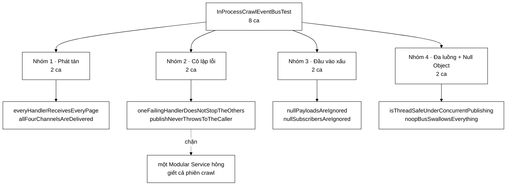

# InProcessCrawlEventBusTest — tám ca chứng minh rằng một service phụ hỏng không được quyền giết cả phiên crawl

**File nguồn:** `search-engine/src/test/java/com/vnsearch/crawler/bus/InProcessCrawlEventBusTest.java` (193 dòng)
**Gói:** `com.vnsearch.crawler.bus` · **Khung:** JUnit 5 · **Số ca:** 8
**Lớp được kiểm:** [`InProcessCrawlEventBus.md`](../../../../../../main/java/com/vnsearch/crawler/bus/InProcessCrawlEventBus.md) · [`CrawlEventBus.md`](../../../../../../main/java/com/vnsearch/crawler/bus/CrawlEventBus.md)
**Đọc kèm:** [`CrawlEventTest.md`](./CrawlEventTest.md) · [`KafkaCrawlBusIT.md`](./KafkaCrawlBusIT.md) · [`../CrawlerServiceBusWiringTest.md`](../CrawlerServiceBusWiringTest.md)

---

## 📌 Hiểu trong 30 giây

`InProcessCrawlEventBus` là bản chạy-một-tiến-trình của bus sự kiện, dùng khi
không có Kafka. Javadoc mở đầu file gọi tên đúng hai tính chất mà nó phải mô
phỏng: **PHÁT TÁN** tới mọi service, và **CÔ LẬP** lỗi giữa chúng.

```
   HAI TÍNH CHẤT, HAI HẬU QUẢ NẾU THIẾU

   ① PHÁT TÁN một-tới-nhiều
      Mỗi service nhận TOÀN BỘ luồng, không phải chia nhau.
      Thiếu ⇒ chỉ một service nhận được mỗi trang; các service
             khác lặng lẽ bỏ sót một phần dữ liệu.

   ② CÔ LẬP lỗi
      Một handler ném ngoại lệ thì các handler khác vẫn chạy,
      và ngoại lệ KHÔNG bay ngược về phía crawler.
      Thiếu ⇒ một service phụ hỏng làm chết cả phiên crawl.
```

Tính chất ① là thứ Kafka cho không, bằng cơ chế consumer group. Bản in-process
phải **tự làm được đúng như thế**, nếu không thì đổi cấu hình từ in-process sang
Kafka sẽ đổi luôn hành vi hệ thống — đúng loại khác biệt mà không ai phát hiện
cho tới khi chạy thật.



---

## 1. Bố cục: 8 ca chia bốn nhóm

Bộ test không dùng `@Nested`; nhóm hiện ra theo thứ tự trong file.

```
   ┌─ NHÓM 1 · PHÁT TÁN ──────────────────────────────────────┐
   │  everyHandlerReceivesEveryPage         ← tính chất ①      │
   │  allFourChannelsAreDelivered                              │
   └───────────────────────────────────────────────────────────┘
   ┌─ NHÓM 2 · CÔ LẬP LỖI ────────────────────────────────────┐
   │  oneFailingHandlerDoesNotStopTheOthers ← tính chất ②      │
   │  publishNeverThrowsToTheCaller                            │
   └───────────────────────────────────────────────────────────┘
   ┌─ NHÓM 3 · ĐẦU VÀO XẤU (không nổ, không đếm nhầm) ────────┐
   │  nullPayloadsAreIgnored                                   │
   │  nullSubscribersAreIgnored                                │
   └───────────────────────────────────────────────────────────┘
   ┌─ NHÓM 4 · ĐA LUỒNG VÀ NULL OBJECT ───────────────────────┐
   │  isThreadSafeUnderConcurrentPublishing                    │
   │  noopBusSwallowsEverything                                │
   └───────────────────────────────────────────────────────────┘
```

Mọi ca đều dựng một `InProcessCrawlEventBus` **mới** trong thân ca, không dùng
`@BeforeEach`. Với một lớp mang **bốn bộ đếm nội bộ** (`pagesPublished`,
`urlsPublished`, `imagesPublished`, `publishFailures`), đó là lựa chọn đúng: các
phép khẳng định trên bộ đếm chỉ đọc được nếu bus bắt đầu từ số không, và nhìn
thấy `new InProcessCrawlEventBus()` ngay trên dòng đầu ca test làm điều đó hiển
nhiên.

---

## 2. `everyHandlerReceivesEveryPage` — phân biệt phát tán với chia tải

```java
InProcessCrawlEventBus bus = new InProcessCrawlEventBus();
List<String> a = new ArrayList<>();
List<String> b = new ArrayList<>();
List<String> c = new ArrayList<>();

bus.subscribePages(e -> a.add(e.url()))
        .subscribePages(e -> b.add(e.url()))
        .subscribePages(e -> c.add(e.url()));

bus.publishPage(page("https://a.com/1"));
bus.publishPage(page("https://a.com/2"));

assertEquals(List.of("https://a.com/1", "https://a.com/2"), a);
assertEquals(a, b);
assertEquals(a, c);
assertEquals(3, bus.pageHandlerCount());
assertEquals(2, bus.getPagesPublishedCount());
```

```
   HAI KIỂU BUS TRÔNG GIỐNG NHAU TỪ PHÍA NGƯỜI GỬI

   PHÁT TÁN (đúng)              CHIA TẢI (sai)
   ─────────────────────        ─────────────────────
   trang 1 → a, b, c            trang 1 → a
   trang 2 → a, b, c            trang 2 → b
                                trang 3 → c
   a = [1, 2]                   a = [1]
   b = [1, 2]                   b = [2]
   c = [1, 2]                   c = [3]

   Cả hai đều "hoạt động". Cả hai đều không ném gì.
   Khác biệt chỉ lộ ra khi ta so sánh a với b.
```

Vì sao chi tiết này quan trọng ở đây chứ không phải chỗ khác: ba Modular Service
đang lắng nghe kênh trang là **ba việc khác nhau** trên cùng một dữ liệu —
trích URL cho frontier, thống kê, xử lý ảnh. Nếu bus chia tải thay vì phát tán,
frontier chỉ được nạp một phần ba số URL, thống kê chỉ đếm một phần ba số
trang, và không có ngoại lệ nào cả. Crawl vẫn kết thúc "thành công" với một
phần ba dữ liệu.

Ba chi tiết cố ý trong cách viết:

| Chi tiết | Vì sao |
|---|---|
| So `assertEquals(a, b)` chứ không `assertEquals(2, b.size())` | Kiểm cả **nội dung** lẫn **thứ tự**, không chỉ số lượng |
| Xuất bản **hai** trang, không phải một | Một trang thì phát-tán và chia-tải-với-một-mục cho kết quả giống nhau |
| Kiểm luôn `pageHandlerCount()` và `getPagesPublishedCount()` | Neo bộ đếm ngay trong ca đường-đi-thuận, để chúng không âm thầm lệch |

Chuỗi `subscribePages(...).subscribePages(...)` dùng được vì mọi hàm
`subscribeXxx` trả về `this`. Đây là kiểu viết trôi chảy, và nó có ích thật ở
chỗ nối dây: một khối duy nhất mô tả toàn bộ cấu hình bus.

---

## 3. `oneFailingHandlerDoesNotStopTheOthers` — ca quan trọng nhất file

```java
AtomicInteger before = new AtomicInteger();
AtomicInteger after = new AtomicInteger();

bus.subscribePages(e -> before.incrementAndGet())
        .subscribePages(e -> {
            throw new IllegalStateException("service nay hong");
        })
        .subscribePages(e -> after.incrementAndGet());

bus.publishPage(page("https://a.com/1"));

assertEquals(1, before.get());
assertEquals(1, after.get(), "Service dang ky SAU cai hong van phai chay");
assertEquals(1, bus.getPublishFailureCount());
```

Bố cục ba handler ở đây không ngẫu nhiên: **một trước, một hỏng, một sau**.

```
   VỊ TRÍ CỦA HANDLER HỎNG QUYẾT ĐỊNH CA TEST BẮT ĐƯỢC GÌ

   Nếu chỉ có [hỏng, sau]:
       vòng lặp không bắt ngoại lệ ⇒ after = 0 ⇒ ca ĐỎ.  ✓ bắt được

   Nếu chỉ có [trước, hỏng]:
       vòng lặp không bắt ngoại lệ ⇒ before = 1 ⇒ ca XANH. ✗ LỌT

   ⇒ Chỉ handler đăng ký SAU cái hỏng mới chứng minh được điều gì.
     `before` có mặt để chắc chắn ngoại lệ thật sự đã xảy ra
     ở giữa, chứ không phải handler hỏng bị bỏ qua từ đầu.

   Thông điệp khẳng định viết rõ điều này:
       "Service dang ky SAU cai hong van phai chay"
```

Javadoc của ca nêu hậu quả thật, không nêu cơ chế:

```
   "Neu thieu co lap: UrlExtractorService dang ky sau se khong bao gio
    chay, frontier ngung duoc nap, va ca phien crawl chet dung — mot
    service phu giet ca crawler."
```

```
   CHUỖI CHẾT KHI THIẾU try/catch TRONG VÒNG LẶP HANDLER

   Trang được tải  →  publishPage
                          ↓
              handler 1 (thống kê)  → chạy
              handler 2 (ảnh)       → ném IllegalStateException
                          ↓
              handler 3 (trích URL) → KHÔNG BAO GIỜ ĐƯỢC GỌI
                          ↓
              frontier không được nạp URL mới
                          ↓
              frontier cạn  →  nextUrl() trả null  →  crawler DỪNG

   TRIỆU CHỨNG: phiên crawl kết thúc "bình thường" sau vài trang.
   Không có ngoại lệ nào trong log ở tầng crawler — nó bị nuốt
   ở đâu đó phía trên hoặc chỉ hiện ra như một stack trace lẻ.
   Người vận hành thấy: "crawl xong rồi, chỉ có 12 trang".
```

Phép khẳng định thứ ba, `getPublishFailureCount() == 1`, là nửa còn lại của hợp
đồng. Nuốt ngoại lệ **im lặng hoàn toàn** cũng là một cách hỏng: lỗi biến mất,
không ai biết service ảnh đã chết. Bus phải vừa *cô lập* vừa *đếm*.

`publishNeverThrowsToTheCaller` là ca song sinh, kiểm chiều còn lại: ngoại lệ
không bay ngược về phía **người gọi** `publishPage`. Với một handler duy nhất và
handler đó ném, một cài đặt "bắt ngoại lệ rồi ném lại" vẫn qua được ca số 3 ở
trên nhưng đỏ ở đây.

---

## 4. `allFourChannelsAreDelivered` — bốn kênh, và một bộ đếm bị bỏ quên

```java
bus.subscribePages(e -> pages.incrementAndGet())
        .subscribeDiscoveredUrls(u -> urls.incrementAndGet())
        .subscribeOutlinks(o -> outlinks.incrementAndGet())
        .subscribeImages(i -> images.incrementAndGet());
// … xuất bản đúng một thông điệp lên mỗi kênh …
assertEquals(1, pages.get());
assertEquals(1, urls.get());
assertEquals(1, outlinks.get());
assertEquals(1, images.get());
assertEquals(1, bus.getUrlsPublishedCount());
assertEquals(1, bus.getImagesPublishedCount());
```

Ca này chống một lỗi rất tầm thường mà rất dễ mắc: **dán nhầm dây**. Bốn kênh
được cài bằng bốn danh sách handler gần như giống hệt nhau, và bốn hàm
`publishXxx` gọi cùng một hàm `dispatch`. Một dòng chép nhầm — `publishImage`
duyệt `outlinkHandlers` — biên dịch được, chạy được, và làm mất toàn bộ dữ liệu
ảnh.

```
   VÌ SAO PHẢI DÙNG BỐN BỘ ĐẾM RIÊNG, KHÔNG DÙNG MỘT

   Nếu cả bốn lambda cùng tăng MỘT AtomicInteger:
       assertEquals(4, calls.get())

   Kênh ảnh đi nhầm sang danh sách handler outlinks:
       outlinks nhận 2, images nhận 0
       tổng vẫn = 4  ⇒  ca XANH, lỗi LỌT.

   Bốn bộ đếm riêng ⇒ 1/1/1/1 ⇒ mọi hoán vị nhầm đều bị bắt.
```

Đáng chú ý: ca kiểm `getUrlsPublishedCount()` và `getImagesPublishedCount()`
nhưng **không** kiểm bộ đếm cho outlinks — vì lớp nguồn không có bộ đếm nào cho
kênh đó. `publishOutlinks` là hàm `publishXxx` duy nhất không tăng một bộ đếm
"đã xuất bản" nào:

```java
@Override
public void publishOutlinks(OutlinksExtracted outlinks) {
    if (outlinks == null) {
        return;
    }
    dispatch(outlinkHandlers, outlinks, "OutlinksExtracted", outlinks.sourceUrl());
}
```

So với ba hàm kia, thiếu đúng một dòng `xxxPublished.incrementAndGet()`. Không
có gì trong mã hay tài liệu nói đây là cố ý. Bộ test không thể phát hiện ra vì
nó chỉ kiểm những bộ đếm **đang tồn tại** — một khoảng trống mà không ca test
nào bịt được, chỉ có mắt người đọc.

---

## 5. Nhóm 3 — hai ca `null` không phải thủ tục

```java
@Test
void nullPayloadsAreIgnored() {
    // … đăng ký handler cho cả bốn kênh, mọi handler tăng cùng một bộ đếm …
    bus.publishPage(null);
    bus.publishDiscoveredUrl(null);
    bus.publishOutlinks(null);
    bus.publishImage(null);

    assertEquals(0, calls.get());
    assertEquals(0, bus.getPublishFailureCount());
}
```

Ở đây dùng **một** bộ đếm chung là đúng, ngược với mục 4: điều đang kiểm là
"không handler nào được gọi", nên tổng bằng 0 đã nói hết.

```
   BA CÁCH XỬ LÝ null, VÀ VÌ SAO CHỌN CÁCH THỨ BA

   ① Ném NullPointerException
      ⇒ crawler đang chạy tốt bị giết vì một trang không phân tích được.
      Trái thẳng với tính chất ② (cô lập lỗi).

   ② Cho lọt xuống handler
      ⇒ NPE nổ ở TỪNG handler, được đếm là lỗi gửi.
      publishFailureCount tăng ⇒ báo động giả về một service khoẻ mạnh.

   ③ Trả về ngay, không đếm là lỗi        ← lớp này chọn cách này
      if (event == null) return;
      ⇒ phép khẳng định THỨ HAI của ca chính là chỗ phân biệt
        cách ③ với cách ②.
```

Phép `assertEquals(0, bus.getPublishFailureCount())` mới là phần có giá trị. Bỏ
nó đi thì cách ② cũng qua được ca test, và `publishFailureCount` — con số mà
người vận hành nhìn để biết hệ thống có khoẻ không — trở thành nhiễu.

`nullSubscribersAreIgnored` bảo vệ chiều đăng ký. Nó gọi bốn hàm `subscribeXxx`
với `null` nối chuỗi liền nhau, và điều đó tự nó đã kiểm một thứ: mọi hàm
`subscribeXxx` phải trả về `this` **kể cả trên nhánh bỏ qua**. Một cài đặt trả
`null` khi tham số là `null` sẽ làm chính dòng test đó ném `NullPointerException`
trước cả khi tới `assertEquals`.

---

## 6. `isThreadSafeUnderConcurrentPublishing` — 8 luồng, 2000 lần xuất bản

```java
bus.subscribePages(e -> received.incrementAndGet());

int threads = 8;
int perThread = 250;
ExecutorService pool = Executors.newFixedThreadPool(threads);
CountDownLatch done = new CountDownLatch(threads);

for (int t = 0; t < threads; t++) {
    pool.submit(() -> {
        try {
            for (int i = 0; i < perThread; i++) {
                bus.publishPage(page("https://a.com/" + i));
            }
        } finally {
            done.countDown();
        }
    });
}

assertTrue(done.await(30, TimeUnit.SECONDS), "Cac luong phai ket thuc trong 30 giay");
pool.shutdownNow();

assertEquals(threads * perThread, received.get());
assertEquals(threads * perThread, bus.getPagesPublishedCount());
```

Kịch bản này có thật: crawler chạy nhiều worker thread, và **mọi worker gọi
`publishPage` trên cùng một đối tượng bus**.

```
   HAI THỨ CÓ THỂ HỎNG, VÀ CA NÀY BẮT CẢ HAI

   ① BỘ ĐẾM MẤT MÁT
      pagesPublished là AtomicLong. Nếu đổi thành `long` thường:
          pagesPublished++    ⇒ đọc-sửa-ghi, KHÔNG nguyên tử
      2000 lần tăng từ 8 luồng cho ra một con số < 2000,
      khác nhau mỗi lần chạy.
      ⇒ assertEquals(2000, getPagesPublishedCount()) ĐỎ.

   ② DANH SÁCH HANDLER BỊ HỎNG KHI VỪA DUYỆT VỪA SỬA
      pageHandlers là CopyOnWriteArrayList.
      Nếu đổi thành ArrayList và có ai đăng ký handler giữa chừng:
          ConcurrentModificationException khi đang duyệt
      Ca này KHÔNG đăng ký thêm handler giữa chừng, nên nó
      không kiểm được ②. Xem mục 9.

   `received` cũng là AtomicInteger — nếu không, chính CA TEST
   sẽ chập chờn và ta đổ lỗi nhầm cho lớp nguồn.
```

Chi tiết đáng học nhất ở đây là `assertTrue(done.await(30, SECONDS), ...)` —
**kiểm giá trị trả về của `await`**, không gọi `await` rồi bỏ qua kết quả. Triệu
chứng của một cấu trúc đồng thời hỏng thường là **treo**, không phải ngoại lệ:
một luồng kẹt trong vòng lặp vô hạn trên một danh sách đã hỏng. Không kiểm
`await` thì test chạy tiếp sau 30 giây và ném ra một thông báo "expected 2000
but was 1750" — đúng nhưng lạc hướng, người đọc sẽ đi tìm lỗi ở bộ đếm.

`pool.shutdownNow()` đặt **sau** `await` chứ không trong `finally`: ở đây đó là
lựa chọn đúng, vì nếu `await` hết hạn ta muốn các luồng còn sống để bản kết xuất
luồng (thread dump) còn đọc được.

`noopBusSwallowsEverything` khép file bằng một hàng rào cho `CrawlEventBus.noop()`
— bản Null Object dùng khi chạy crawler mà không bật bus. Bốn lời gọi, không
handler nào, và `getPublishFailureCount()` phải là 0. Ca rẻ tiền nhưng cần:
`noop()` là đường đi mặc định trong các bài test khác và trong chế độ chạy đơn
giản, nên nó phải tuyệt đối im lặng.

---

## 7. Kỹ thuật đáng học lại từ bộ test này

```
   ① SO HAI BỘ THU VỚI NHAU, KHÔNG SO VỚI SỐ ĐẾM
      assertEquals(a, b)  bắt được "chia tải thay vì phát tán".
      assertEquals(2, b.size())  thì không.

   ② ĐẶT HANDLER HỎNG Ở GIỮA, KHÔNG Ở CUỐI
      Chỉ handler đăng ký SAU cái hỏng mới chứng minh được cô lập.

   ③ MỘT BỘ ĐẾM RIÊNG CHO MỖI THỨ CÓ THỂ ĐI NHẦM CHỖ
      Bốn kênh ⇒ bốn AtomicInteger. Tổng gộp che mất hoán vị nhầm.

   ④ KIỂM CẢ "KHÔNG XẢY RA GÌ" LẪN "KHÔNG BỊ ĐẾM LÀ LỖI"
      assertEquals(0, calls) + assertEquals(0, publishFailureCount)
      là hai phép khác nhau, phân biệt "bỏ qua" với "nuốt lỗi".

   ⑤ LUÔN assertTrue TRÊN GIÁ TRỊ TRẢ VỀ CỦA CountDownLatch.await
      Treo là triệu chứng phổ biến nhất của lỗi đồng thời, và
      nó KHÔNG ném ngoại lệ.

   ⑥ DÙNG AtomicInteger CHO CẢ BỘ ĐẾM CỦA CHÍNH CA TEST
      Một int thường trong lambda đa luồng làm ca test chập chờn,
      và ta sẽ đi sửa nhầm lớp nguồn.

   ⑦ DỰNG ĐỐI TƯỢNG MỚI TRONG THÂN CA, KHÔNG DÙNG @BeforeEach
      Lớp mang bộ đếm tích luỹ ⇒ mọi phép khẳng định trên bộ đếm
      chỉ đọc được khi thấy rõ bus bắt đầu từ số không.
```

---

## 8. Hướng dẫn thực hành

### 8.1 Chạy

```powershell
cd search-engine

# Cả 8 ca
.\mvnw.cmd test "-Dtest=InProcessCrawlEventBusTest"

# Một ca
.\mvnw.cmd test "-Dtest=InProcessCrawlEventBusTest#oneFailingHandlerDoesNotStopTheOthers"

# Ca đa luồng, chạy lặp để soi tính chập chờn
.\mvnw.cmd test "-Dtest=InProcessCrawlEventBusTest#isThreadSafeUnderConcurrentPublishing"
```

Trên PowerShell **phải bọc `-Dtest=...` trong nháy kép**, nếu không dấu `=` bị
nuốt và Maven chạy toàn bộ bộ test.

### 8.2 Đọc kết quả

```
[INFO] Running com.vnsearch.crawler.bus.InProcessCrawlEventBusTest
[INFO] Tests run: 8, Failures: 0, Errors: 0, Skipped: 0
```

Khi `oneFailingHandlerDoesNotStopTheOthers` chạy, log của bộ test sẽ có một dòng
`WARN` kèm stack trace của `IllegalStateException("service nay hong")` — **đó là
điều mong đợi**, không phải dấu hiệu hỏng. Lớp nguồn ghi log ở mức `warn` cho
mỗi handler ném ngoại lệ:

```
WARN  InProcessCrawlEventBus - Modular Service ... ném ngoại lệ khi xử lý
      https://a.com/1 — bỏ qua trang này, các service khác vẫn chạy
```

Báo cáo chi tiết:
`search-engine/target/surefire-reports/com.vnsearch.crawler.bus.InProcessCrawlEventBusTest.txt`

### 8.3 Tự kiểm chứng — cố tình làm hỏng để xem ca nào đỏ

| Sửa gì trong `InProcessCrawlEventBus.java` | Ca dự kiến đỏ |
|---|---|
| Bỏ `try/catch` quanh `handler.onPage(event)` | `oneFailingHandlerDoesNotStopTheOthers` (ở `after`) **và** `publishNeverThrowsToTheCaller` |
| Giữ `catch` nhưng thêm `throw e;` ở cuối | Chỉ `publishNeverThrowsToTheCaller` — ca kia vẫn xanh |
| Trong `catch`, bỏ `publishFailures.incrementAndGet()` | `oneFailingHandlerDoesNotStopTheOthers` (phép thứ ba), `publishNeverThrowsToTheCaller` |
| Trong `publishPage`, `break` sau handler đầu tiên | `everyHandlerReceivesEveryPage` (`b` và `c` rỗng) |
| Trong `publishPage`, duyệt handler theo chỉ số lẻ/chẵn xoay vòng | `everyHandlerReceivesEveryPage` (`a ≠ b`) |
| Trong `publishImage`, đổi `imageHandlers` thành `outlinkHandlers` | `allFourChannelsAreDelivered` (`images = 0`, `outlinks = 2`) |
| Bỏ `if (event == null) return;` trong `publishPage` | `nullPayloadsAreIgnored` — với NPE hoặc với `publishFailureCount = 1` |
| Bỏ `if (handler != null)` trong `subscribePages` | `nullSubscribersAreIgnored` (`pageHandlerCount = 1`) |
| Cho `subscribePages` trả `null` khi tham số null | `nullSubscribersAreIgnored` với NPE ngay trên dòng nối chuỗi |
| Đổi `AtomicLong pagesPublished` thành `long` | `isThreadSafeUnderConcurrentPublishing` (chập chờn, đếm thiếu) |
| Đổi `CopyOnWriteArrayList` thành `ArrayList` | **Không ca nào đỏ** — xem mục 9 |
| Trong `CrawlEventBus.noop()`, cho `publishPage` ném | `noopBusSwallowsEverything` |

Dòng áp chót là phát hiện đáng giá nhất từ bài tập này: `CopyOnWriteArrayList`
— lựa chọn cấu trúc dữ liệu tốn kém nhất trong lớp — **không có ca test nào
chứng minh là cần thiết**.

### 8.4 Cạm bẫy khi viết thêm ca cho lớp này

```
   ✗ Đừng dùng biến int thường trong lambda handler ở ca đa luồng.
     Java bắt biến phải hiệu-lực-cuối-cùng, nên bạn sẽ bị đẩy sang
     mảng một phần tử `int[] dem = new int[1]` — thứ KHÔNG nguyên tử.
     Ca test sẽ chập chờn và bạn sẽ đi sửa nhầm lớp nguồn.

   ✗ Đừng đặt handler hỏng ở CUỐI danh sách.
     Ca test sẽ xanh với một cài đặt hoàn toàn không cô lập lỗi.

   ✗ Đừng dùng chung một bus giữa nhiều ca qua @BeforeAll.
     Bộ đếm tích luỹ, và mọi phép khẳng định trên chúng
     phụ thuộc thứ tự chạy ca — thứ JUnit KHÔNG bảo đảm.

   ✗ Đừng khẳng định thứ tự GỌI giữa các handler khác nhau.
     Lớp hiện duyệt danh sách theo thứ tự đăng ký, nhưng không có
     tài liệu nào cam kết điều đó, và bản Kafka chắc chắn không
     giữ được nó.

   ✗ Đừng quên rằng bus phát tán CÙNG MỘT đối tượng cho mọi handler.
     Một ca test có handler sửa payload sẽ ảnh hưởng các handler sau.
     Tính bất biến của bốn record là thứ chặn điều đó — xem
     copiesTheListDefensively trong CrawlEventTest.
```

---

## 9. Bảng tổng hợp 8 ca

| # | Ca test | Nhóm | Tính chất được canh giữ |
|---|---|---|---|
| 1 | **`everyHandlerReceivesEveryPage`** | 1 | **Phát tán một-tới-nhiều, không phải chia tải** |
| 2 | `allFourChannelsAreDelivered` | 1 | Bốn kênh không dán nhầm dây sang nhau |
| 3 | **`oneFailingHandlerDoesNotStopTheOthers`** | 2 | **Handler đăng ký SAU cái hỏng vẫn chạy, và lỗi được đếm** |
| 4 | `publishNeverThrowsToTheCaller` | 2 | Ngoại lệ không bay ngược về phía crawler |
| 5 | `nullPayloadsAreIgnored` | 3 | `null` bị bỏ qua **và không bị đếm là lỗi gửi** |
| 6 | `nullSubscribersAreIgnored` | 3 | Đăng ký `null` không làm hỏng danh sách, vẫn trả `this` |
| 7 | **`isThreadSafeUnderConcurrentPublishing`** | 4 | **8 luồng × 250 lần, không mất mát khi đếm** |
| 8 | `noopBusSwallowsEverything` | 4 | Null Object nhận mọi thứ, không ném, không đếm lỗi |

---

## 10. Khoảng trống chưa phủ

```
   ✗ ĐĂNG KÝ HANDLER TRONG LÚC ĐANG XUẤT BẢN — khoảng trống lớn nhất.

     Lớp dùng CopyOnWriteArrayList cho cả bốn danh sách handler.
     Đó là cấu trúc TỐN KÉM: mỗi lần subscribe sao chép cả mảng.
     Cái giá đó chỉ đáng nếu có kịch bản vừa-duyệt-vừa-sửa.

     Không ca nào dựng kịch bản đó.
     ⇒ Đổi sang ArrayList thì 8/8 ca vẫn XANH.
     ⇒ Lựa chọn thiết kế đắt nhất của lớp không được canh giữ.

   ✗ CÔ LẬP LỖI CHỈ ĐƯỢC KIỂM TRÊN KÊNH TRANG.
     publishPage có vòng lặp try/catch RIÊNG (để gọi được
     handler.handlerName() trong thông điệp log).
     Ba kênh kia đi qua hàm dispatch() dùng chung.
     ⇒ Hai đường mã khác nhau, chỉ MỘT được kiểm cô lập.
     Bỏ try/catch trong dispatch() thì không ca nào đỏ.

   ✗ publishOutlinks KHÔNG tăng bộ đếm "đã xuất bản" nào,
     khác ba hàm còn lại. Không rõ cố ý hay sót — và bộ test
     không thể phát hiện, vì nó chỉ kiểm bộ đếm đang tồn tại.

   ✗ Không có ca nào kiểm rằng publishPage(null) KHÔNG tăng
     getPagesPublishedCount(). Ca 5 chỉ kiểm calls và
     publishFailureCount.

   ✗ Một handler chạy RẤT LÂU chặn mọi handler sau nó.
     Bus gọi handler đồng bộ, tuần tự. Đây là một tính chất
     có thật và có hậu quả (một service chậm làm chậm cả crawler),
     nhưng không được ghi lại ở đâu, cũng không được kiểm.
```

Ca đáng viết trước nhất — nó chứng minh `CopyOnWriteArrayList` thật sự cần
thiết, và hiện là ca duy nhất trong bảng ở mục 8.3 mà **không** ca nào bắt được:

```java
@Test
void dangKyHandlerTrongLucDangXuatBanKhongLamHongDanhSach() throws Exception {
    InProcessCrawlEventBus bus = new InProcessCrawlEventBus();
    AtomicInteger nhan = new AtomicInteger();
    bus.subscribePages(e -> nhan.incrementAndGet());

    ExecutorService pool = Executors.newFixedThreadPool(4);
    CountDownLatch xong = new CountDownLatch(4);
    for (int t = 0; t < 2; t++) {
        pool.submit(() -> {
            try {
                for (int i = 0; i < 2000; i++) bus.publishPage(page("https://a.com/" + i));
            } finally { xong.countDown(); }
        });
        pool.submit(() -> {
            try {
                for (int i = 0; i < 2000; i++) bus.subscribePages(e -> { });
            } finally { xong.countDown(); }
        });
    }

    assertTrue(xong.await(30, TimeUnit.SECONDS),
            "Có luồng bị TREO hoặc chết vì ConcurrentModificationException");
    pool.shutdownNow();
    assertEquals(0, bus.getPublishFailureCount(),
            "Một ConcurrentModificationException sẽ bị catch trong vòng lặp "
                    + "và hiện ra ở ĐÂY, không phải ở phép khẳng định trên");
}
```

Phép khẳng định cuối là phần tinh tế nhất và cũng là lý do ca này khó viết
đúng: vòng lặp handler đã có `try/catch (Exception e)`, nên một
`ConcurrentModificationException` sẽ **bị chính lớp đó nuốt** và biến thành một
lần tăng `publishFailures`. Không kiểm bộ đếm ấy thì ca test xanh dù lớp đang
hỏng — đúng cái bẫy mà cơ chế cô lập lỗi ở mục 3 vô tình tạo ra.

---

## 11. Liên kết

- Lớp được kiểm, kèm giải thích vì sao mỗi kênh có một danh sách handler riêng: [`InProcessCrawlEventBus.md`](../../../../../../main/java/com/vnsearch/crawler/bus/InProcessCrawlEventBus.md)
- Giao diện chung và bản Null Object `noop()` mà ca 8 canh giữ: [`CrawlEventBus.md`](../../../../../../main/java/com/vnsearch/crawler/bus/CrawlEventBus.md)
- Bất biến của bốn thông điệp chạy trên bus này — đặc biệt là sao chép phòng thủ, thứ giữ cho phát tán an toàn: [`CrawlEventTest.md`](./CrawlEventTest.md)
- Bản Kafka của cùng giao diện, và ba thứ chỉ broker thật mới kiểm được: [`KafkaCrawlBusIT.md`](./KafkaCrawlBusIT.md)
- Nơi bus được nối vào luồng crawl thật, tức là nơi tính chất cô lập lỗi có giá trị: [`../CrawlerServiceBusWiringTest.md`](../CrawlerServiceBusWiringTest.md)
- Một trong ba Modular Service lắng nghe kênh trang — bên "đăng ký sau" trong kịch bản của ca 3: [`../modular/UrlExtractorServiceTest.md`](../modular/UrlExtractorServiceTest.md)
