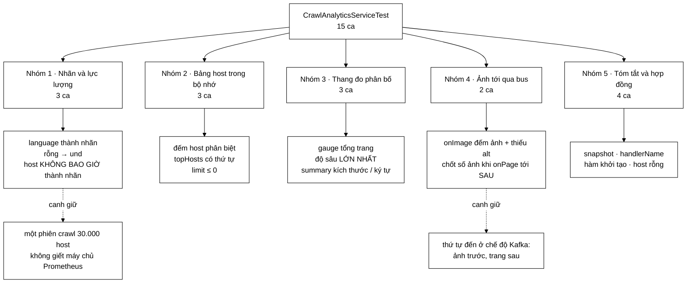

# CrawlAnalyticsServiceTest — có một ca test không kiểm nhãn nào cả, mà kiểm rằng một nhãn KHÔNG tồn tại

**File nguồn:** `search-engine/src/test/java/com/vnsearch/crawler/modular/CrawlAnalyticsServiceTest.java` (206 dòng)
**Gói:** `com.vnsearch.crawler.modular` · **Khung:** JUnit 5 · **Số ca:** 15
**Lớp được kiểm:** [`CrawlAnalyticsService.md`](../../../../../../main/java/com/vnsearch/crawler/modular/CrawlAnalyticsService.md)
**Đọc kèm:** [`ImageDownloadServiceTest.md`](./ImageDownloadServiceTest.md) · [`UrlExtractorServiceTest.md`](./UrlExtractorServiceTest.md) · [`CorpusStatsTest.md`](../../analytics/CorpusStatsTest.md) · [`CrawlEventTest.md`](../bus/CrawlEventTest.md)

---

## 📌 Hiểu trong 30 giây

15 ca cho khối biến bộ đếm rời rạc thành thang đo Prometheus. Phần lớn là kiểm
số học tầm thường — đếm trang, giữ độ sâu lớn nhất. Nhưng ca đáng nhớ nhất lại
**không khẳng định một giá trị nào**, mà quét toàn bộ registry để chứng minh một
nhãn *không có mặt*:

```
   hostIsNeverUsedAsAPrometheusLabel

   boolean anyHostTag = registry.getMeters().stream()
           .flatMap(meter -> meter.getId().getTags().stream())
           .anyMatch(tag -> "host".equals(tag.getKey()));
   assertTrue(!anyHostTag, "Khong thang do nao duoc gan nhan host");

   ⇒ Nó không kiểm một thang đo cụ thể. Nó kiểm MỌI thang đo,
     kể cả thang đo chưa được viết ra.
   ⇒ Đây là hàng rào cho một quyết định kiến trúc, không phải
     cho một hàm.
```

Và một cặp ca canh giữ **thứ tự đến** giữa hai Modular Service gặp nhau qua bus:
ảnh của một trang tới **trước** trang, vì `ImageDownloadService` chạy nhanh hơn.



---

## 1. Bố cục: 15 ca chia năm nhóm

```
   ┌─ NHÓM 1 · NHÃN PROMETHEUS VÀ LỰC LƯỢNG ──────────────────────┐
   │  languageBecomesAPrometheusLabel                              │
   │  blankLanguageBecomesUnd                                      │
   │  hostIsNeverUsedAsAPrometheusLabel            ← quan trọng    │
   └───────────────────────────────────────────────────────────────┘
   ┌─ NHÓM 2 · BẢNG HOST TRONG BỘ NHỚ ────────────────────────────┐
   │  tracksDistinctHostsAndTopHosts                               │
   │  topHostsRespectsTheLimit                                     │
   │  blankHostIsNotTracked                        ← xem mục 6     │
   └───────────────────────────────────────────────────────────────┘
   ┌─ NHÓM 3 · GAUGE VÀ DISTRIBUTION SUMMARY ─────────────────────┐
   │  countsPagesAndExposesThemAsGauge                             │
   │  tracksMaximumDepthSeen                                       │
   │  recordsPageSizeDistribution · recordsBodyTextLength          │
   └───────────────────────────────────────────────────────────────┘
   ┌─ NHÓM 4 · GẶP ImageDownloadService QUA BUS ──────────────────┐
   │  aggregatesImagesFromTheImageService                          │
   │  recordsImagesPerPageWhenThePageArrives       ← quan trọng    │
   └───────────────────────────────────────────────────────────────┘
   ┌─ NHÓM 5 · TÓM TẮT VÀ HỢP ĐỒNG ───────────────────────────────┐
   │  snapshotContainsTheHeadlineNumbers                           │
   │  handlerNameIsReadableInLogs                                  │
   │  constructorRequiresARegistry                                 │
   └───────────────────────────────────────────────────────────────┘
```

Nền của cả bộ test là hai dòng trong `setUp`:

```java
registry = new SimpleMeterRegistry();
service = new CrawlAnalyticsService(registry);
```

`SimpleMeterRegistry` là bản cài đặt trong bộ nhớ của Micrometer — không có
Prometheus, không có endpoint, không có tiến trình nào khác. Nhưng nó có đủ API
truy vấn (`registry.get(name).gauge()`, `.counter()`, `.summary()`,
`.getMeters()`) để **đọc lại đúng thứ mà Prometheus sẽ đọc**. Đó là lý do 15 ca
này kiểm được thang đo mà không cần Docker.

Hàm dựng dữ liệu cũng đáng chú ý:

```java
private static PageEvent page(String url, String host, String language, int depth) {
    return new PageEvent(url, host, depth, "Tieu de", "Than bai", language,
            "<html><body>noi dung</body></html>", "hash", Instant.EPOCH, "job-1");
}
```

Bốn tham số thay đổi được là **đúng bốn chiều mà lớp này quan tâm**: url, host,
ngôn ngữ, độ sâu. Sáu trường còn lại bị đóng băng. Đọc một lời gọi `page(...)`
là biết ngay ca test đang xoay chiều nào — nếu hàm nhận cả mười tham số thì mỗi
lời gọi thành một hàng rào chữ và không ai đọc được.

---

## 2. Nhóm 1 — bài học lớn nhất là một phép khẳng định phủ định

### 2.1 `hostIsNeverUsedAsAPrometheusLabel`

```java
@Test
void hostIsNeverUsedAsAPrometheusLabel() {
    service.onPage(page("https://vnexpress.net/1", "vnexpress.net", "vi", 0));
    service.onPage(page("https://tuoitre.vn/1", "tuoitre.vn", "vi", 0));

    boolean anyHostTag = registry.getMeters().stream()
            .flatMap(meter -> meter.getId().getTags().stream())
            .anyMatch(tag -> "host".equals(tag.getKey()));

    assertTrue(!anyHostTag, "Khong thang do nao duoc gan nhan host");
    // Nhung so lieu theo host van co, o bang trong bo nho
    assertEquals(2, service.getDistinctHostCount());
}
```

```
   VÌ SAO PHẢI CÓ MỘT CA TEST CHO ĐIỀU KHÔNG XẢY RA

   Prometheus tạo MỘT CHUỖI THỜI GIAN cho mỗi tổ hợp nhãn.
   Mỗi chuỗi tốn ~1–3 KB bộ nhớ thường trú trên máy chủ Prometheus.

   Counter.builder("crawl.pages").tag("host", host)
          └─ trông rất tự nhiên, một dòng, ai cũng viết được

   Một phiên crawl chạm 30.000 host phân biệt:
       30.000 chuỗi × 1–3 KB = 30–90 MB
       … từ MỘT thang đo.

   Và host là dữ liệu do BÊN NGOÀI quyết định: crawler không biết
   trước nó sẽ gặp bao nhiêu host. Đây là nhãn có lực lượng
   KHÔNG CHẶN TRÊN ĐƯỢC — cách kinh điển để giết Prometheus.

   TRIỆU CHỨNG THẬT: không phải crawler chậm. Là máy chủ Prometheus
   ngốn RAM rồi bị OOM-kill, kéo theo mất toàn bộ bảng điều khiển.
   Không ai nghĩ tới crawler khi đọc log của Prometheus.
```

Điều làm ca này khác mọi ca khác trong repo: nó không nhắm vào một hàm, mà nhắm
vào **mọi thang đo trong registry, kể cả thang đo sẽ được thêm sau này**. Ai đó
sáu tháng nữa thêm

```java
Counter.builder("vnsearch.crawl.robots.blocked")
       .tag("host", host)   // ← tiện tay
```

sẽ làm ca này đỏ ngay, dù ca test được viết trước khi thang đo đó tồn tại. Rất ít
ca test có tính chất đó.

Hai phép khẳng định lại đứng cạnh nhau có chủ đích: `anyHostTag` sai **nhưng**
`getDistinctHostCount() == 2`. Chúng nói rõ quyết định không phải là "bỏ số liệu
theo host", mà là "để số liệu theo host ở chỗ khác":

| Chiều | Lực lượng | Đi đâu |
|---|---|---|
| ngôn ngữ | 3 (`vi`, `en`, `und`) | Nhãn Prometheus |
| host | không chặn trên | Bảng trong bộ nhớ, có trần, phơi qua API quản trị |

Một chi tiết nhỏ đáng sửa: `assertTrue(!anyHostTag, ...)` nên là
`assertFalse(anyHostTag, ...)`. Cùng kết quả, nhưng `assertFalse` in ra thông
điệp lỗi rõ hơn và không bắt người đọc xử lý dấu phủ định trong đầu.

### 2.2 `blankLanguageBecomesUnd` — chặn một nhãn rỗng

```java
service.onPage(page("https://a.com/1", "a.com", "", 0));
service.onPage(page("https://a.com/2", "a.com", null, 0));

assertEquals(List.of("und"), service.languagesSeen());
assertEquals(2.0, registry.get("vnsearch.crawl.pages.by.language.total")
        .tag("language", "und").counter().count());
```

Ca này kiểm **cả `""` lẫn `null`** trong một ca — hợp lý ở đây, vì cả hai đi vào
đúng một nhánh mã (`language == null || language.isBlank()`), và điều đáng khẳng
định là chúng gộp vào **một** nhãn duy nhất chứ không thành hai.

```
   NẾU KHÔNG CHUẨN HOÁ

   nhãn language=""     ← từ chuỗi rỗng
   nhãn language=null   ← Micrometer sẽ ném, hoặc biến thành "null"

   Trên bảng điều khiển Grafana, một nhãn rỗng hiện ra như một
   khoảng trắng trong chú giải. Người đọc không phân biệt được
   "trang không xác định được ngôn ngữ" với "một lỗi hiển thị".

   "und" là mã ISO 639-2 cho "undetermined" — nó tự nói ra ý nghĩa.
```

`languagesSeen()` sắp xếp trước khi trả về, nên `assertEquals(List.of("en", "vi"), ...)`
ở ca `languageBecomesAPrometheusLabel` là tất định — nếu không sắp xếp thì ca đó
sẽ đỏ ngẫu nhiên theo thứ tự băm của `ConcurrentHashMap`.

---

## 3. Nhóm 3 — `tracksMaximumDepthSeen` và một phép so sánh dễ viết sai

```java
service.onPage(page("https://a.com/1", "a.com", "vi", 0));
service.onPage(page("https://a.com/2", "a.com", "vi", 4));
service.onPage(page("https://a.com/3", "a.com", "vi", 2));

assertEquals(4, service.getMaxDepthSeen(), "Phai giu gia tri LON NHAT, khong phai cuoi cung");
assertEquals(4.0, registry.get("vnsearch.crawl.depth.max").gauge().value());
```

Thứ tự `0 → 4 → 2` là thứ tự **cố ý**: giá trị lớn nhất nằm ở giữa.

```
   BA CÁCH CÀI ĐẶT, BA KẾT QUẢ

   maxDepth = depth                  → 2   (giá trị CUỐI)
   if (depth > max) max = depth      → 4   (đúng, nhưng KHÔNG an toàn luồng)
   max.updateAndGet(c -> max(c,d))   → 4   (đúng và nguyên tử)

   Nếu ca test cho vào 0 → 2 → 4 (tăng dần) thì CẢ BA cách đều ra 4
   và ca test không phân biệt được gì. Đặt giá trị lớn nhất ở giữa
   là thứ khiến cách thứ nhất lộ ra.
```

Phép khẳng định thứ hai — trên `gauge().value()` — canh một bài học riêng, ghi
trong lớp nguồn:

```java
Gauge.builder("vnsearch.crawl.depth.max", maxDepthSeen, AtomicLong::get)
```

`Gauge` nhận **hàm** lấy giá trị chứ không nhận giá trị. Đẩy một con số vào lúc
khởi tạo thì thang đo đóng băng ở 0 mãi mãi. Triệu chứng: bảng điều khiển vẽ một
đường thẳng tắp ở 0 trong khi crawler đang chạy — trông như crawler chết, nhưng
thực ra chỉ có thang đo chết. Ba ca `countsPagesAndExposesThemAsGauge`,
`tracksMaximumDepthSeen` đều khẳng định **cả getter Java lẫn giá trị gauge**,
đúng để bắt lỗi đó.

`recordsPageSizeDistribution` và `recordsBodyTextLength` là hai hàng rào rẻ hơn:
chúng chỉ kiểm `summary.count() == 1` và `totalAmount() > 0` — tức là "thang đo
có được ghi vào không", chứ không kiểm giá trị. Đủ để bắt một dòng `record` bị
xoá, không đủ để bắt một phép quy đổi đơn vị sai. Đó là đánh đổi hợp lý: kích
thước HTML thô đến từ `PageEvent.htmlSizeBytes()`, và giá trị của nó là hợp đồng
của bản ghi chứ không của lớp này.

---

## 4. Nhóm 4 — hai ca ghi lại một sự thật về thứ tự đến

### 4.1 `recordsImagesPerPageWhenThePageArrives`

```java
service.onImage(ImageFound.metadataOnly("https://a.com/1", "a.com",
        "https://a.com/x.jpg", "a", 1, 1));
service.onImage(ImageFound.metadataOnly("https://a.com/1", "a.com",
        "https://a.com/y.jpg", "b", 1, 1));

service.onPage(page("https://a.com/1", "a.com", "vi", 0));

var summary = registry.get("vnsearch.crawl.page.images").summary();
assertEquals(1, summary.count());
assertEquals(2.0, summary.totalAmount());
```

Chú thích của ca nói rõ vì sao thứ tự lại là ảnh trước, trang sau:

> *"So anh cua mot trang duoc chot khi trang do di qua onPage. Thu tu that o che
> do Kafka la anh toi truoc (Image Download nhanh hon), nen bai test dung dung
> thu tu do."*

```
   VÌ SAO ẢNH TỚI TRƯỚC TRANG

   Cả hai service cùng nhận PageEvent từ topic pages.

   ImageDownloadService: phân tích DOM, chọn , phát ImageFound
                         → ở chế độ mặc định KHÔNG tải gì, rất nhanh
   CrawlAnalyticsService: cũng nhận PageEvent, nhưng nó ở một
                         consumer group KHÁC, luồng khác, nhịp khác

   Không có gì bảo đảm thứ tự GIỮA hai luồng đó. Quan sát thực tế
   là ảnh thường tới trước.

   Cài đặt phải chịu được cả hai thứ tự:
       imagesOfPage.computeIfAbsent(url, …).increment()   ← onImage, gom
       imagesOfPage.remove(url) → summary.record(sum)     ← onPage, chốt

   Ca test dựng ĐÚNG thứ tự khó (ảnh trước), không dựng thứ tự dễ.
```

Điều đáng học: khi một lớp phải chịu hai thứ tự đến, ca test nên dựng **thứ tự
mà cài đặt ngây thơ sẽ hỏng**. Một cài đặt "đọc số ảnh của trang trong `onPage`
rồi cộng thêm ở `onImage`" sẽ chạy đúng với thứ tự trang-trước-ảnh-sau và hỏng
với thứ tự này.

### 4.2 `aggregatesImagesFromTheImageService`

```java
service.onImage(ImageFound.metadataOnly("https://a.com/1", "a.com",
        "https://a.com/x.jpg", "co alt", 10, 10));
service.onImage(ImageFound.metadataOnly("https://a.com/1", "a.com",
        "https://a.com/y.jpg", "", 10, 10));

assertEquals(2.0, registry.get("vnsearch.crawl.images.total").counter().count());
assertEquals(1.0,
        registry.get("vnsearch.crawl.images.missing.alt.total").counter().count());
```

Hai ảnh, một có `alt`, một `alt` rỗng — tỷ lệ thiếu `alt` là chỉ số tiếp cận, và
lớp này lấy nó từ `image.missingAlt()`, tức là **không tự đọc `altText`**. Ca
test khẳng định qua đúng đường đó, nên nếu ai đó đổi ngữ nghĩa `missingAlt()`
trong `ImageFound` (ví dụ coi `"  "` là có alt), ca này sẽ đi theo chứ không mâu
thuẫn — hợp lý, vì định nghĩa thuộc về bản ghi.

Chú thích của ca ghi lại điểm kiến trúc: hai Modular Service **gặp nhau qua bus**
chứ không gọi thẳng nhau, nên tắt Image Download đi thì Analytics vẫn chạy, chỉ
thiếu mấy con số về ảnh. Ca test chứng minh điều đó bằng cách gọi `onImage` mà
**không** cần một `ImageDownloadService` nào tồn tại trong ca.

---

## 5. Nhóm 2 — `topHosts` và tham số âm

```java
@Test
void topHostsRespectsTheLimit() {
    for (int i = 0; i < 5; i++) {
        service.onPage(page("https://h" + i + ".com/1", "h" + i + ".com", "vi", 0));
    }
    assertEquals(2, service.topHosts(2).size());
    assertEquals(0, service.topHosts(0).size());
    assertEquals(0, service.topHosts(-1).size());
}
```

Ba giá trị: bình thường, biên, âm. Giá trị âm là giá trị đáng nói:

```
   .limit(n)  với n < 0  →  IllegalArgumentException

   Lớp nguồn viết  .limit(Math.max(0, n))  chính vì thế.

   n âm đến từ đâu ở môi trường thật? Từ query string của
   API quản trị: /api/admin/stats?topHosts=-1
   Một người gõ nhầm làm endpoint trả 500.

   Ba dòng khẳng định, dòng thứ ba là dòng canh giữ Math.max.
```

`tracksDistinctHostsAndTopHosts` bổ sung phần thứ tự:

```java
Map<String, Long> top = service.topHosts(10);
assertEquals(List.of("a.com", "b.com"), List.copyOf(top.keySet()));
```

Khẳng định trên **`keySet()` đã đổi thành `List`** chứ không trên `Map` — đó là
cách duy nhất để kiểm thứ tự, vì `assertEquals` giữa hai `Map` bỏ qua thứ tự
hoàn toàn. Lớp nguồn thu vào `LinkedHashMap` chính để giữ thứ tự sắp xếp; một
lần "dọn dẹp" đổi sang `HashMap` sẽ làm `topHosts` trả về đúng dữ liệu nhưng sai
thứ tự, và chỉ ca này bắt được.

---

## 6. `blankHostIsNotTracked` — một ca test không kiểm điều mà tên nó nói

Đây là chỗ yếu rõ nhất của bộ test, và đáng nêu ra vì nó rất dễ đọc lướt qua.

```java
@Test
void blankHostIsNotTracked() {
    service.onPage(new PageEvent("https://a.com/1", "a.com", 0, "t", "b", "vi",
            "<html></html>", "h", Instant.EPOCH, "job"));
    assertEquals(1, service.getDistinctHostCount());
}
```

```
   TÊN NÓI:   host rỗng thì không được theo dõi
   MÃ LÀM:    truyền host = "a.com"  ← KHÔNG rỗng
              rồi khẳng định đếm được 1 host

   ⇒ Ca này kiểm đúng cái mà tracksDistinctHostsAndTopHosts
     đã kiểm rồi, chỉ ít host hơn.
   ⇒ Nhánh `if (host == null || host.isBlank()) return;` trong
     trackHost() KHÔNG được ca nào chạm tới.

   VÌ SAO NÓ VIẾT RA THẾ NÀY: PageEvent nhiều khả năng từ chối host
   rỗng ngay ở hàm khởi tạo, nên không dựng được một PageEvent
   host rỗng để đưa vào. Người viết đổi sang host hợp lệ nhưng
   GIỮ NGUYÊN TÊN CA.
```

Hệ quả thực tế thì nhẹ: nếu `PageEvent` đã chặn host rỗng ở tầng bản ghi thì
nhánh phòng thủ trong `trackHost` là dư thừa chứ không nguy hiểm. Nhưng cái tên
gây hại thật — người đọc danh sách 15 ca sẽ tưởng nhánh đó đã được phủ, và sẽ
không viết ca cho nó. Cách sửa đúng là một trong hai:

1. Đổi tên ca thành đúng điều nó kiểm (`singlePageTracksOneHost`), rồi ghi ở
   `CrawlEventTest` rằng host rỗng bị chặn ở tầng bản ghi.
2. Hoặc gọi thẳng `trackHost` qua một `PageEvent` dựng bằng phản chiếu — không
   đáng, vì đó là kiểm một nhánh không tới được.

Lựa chọn 1 là lựa chọn đúng. Đây là ví dụ tốt cho nguyên tắc: **tên ca test là
một lời tuyên bố về độ phủ**, và một tên sai còn tệ hơn không có ca.

---

## 7. Kỹ thuật đáng học lại từ bộ test này

```
   ① KHẲNG ĐỊNH PHỦ ĐỊNH TRÊN TOÀN BỘ REGISTRY
      registry.getMeters().stream()... anyMatch(tag -> "host".equals(...))
      → phủ cả thang đo CHƯA ĐƯỢC VIẾT
      → hàng rào cho một quyết định kiến trúc, không cho một hàm

   ② HÀM DỰNG DỮ LIỆU CHỈ MỞ RA CÁC CHIỀU CÓ Ý NGHĨA
      page(url, host, language, depth) — 4 tham số, 6 trường đóng băng
      → đọc lời gọi là biết ca đang xoay chiều nào

   ③ ĐẶT GIÁ TRỊ CỰC TRỊ Ở GIỮA, KHÔNG Ở CUỐI
      depth 0 → 4 → 2
      → phân biệt được "giữ lớn nhất" với "giữ cuối cùng"

   ④ KIỂM CẢ GETTER JAVA LẪN GIÁ TRỊ THANG ĐO
      assertEquals(2, service.getPagesTotal());
      assertEquals(2.0, registry.get(...).gauge().value());
      → bắt được Gauge bị đóng băng lúc khởi tạo

   ⑤ DỰNG THỨ TỰ ĐẾN KHÓ, KHÔNG DỰNG THỨ TỰ DỄ
      onImage, onImage, RỒI MỚI onPage
      → đúng thứ tự quan sát được ở chế độ Kafka

   ⑥ KIỂM THAM SỐ ÂM, KHÔNG CHỈ 0
      topHosts(2), topHosts(0), topHosts(-1)
      → canh Math.max(0, n) trước .limit()

   ⑦ ĐỔI keySet() THÀNH List ĐỂ KIỂM THỨ TỰ
      assertEquals(List.of("a.com","b.com"), List.copyOf(top.keySet()))
      → assertEquals giữa hai Map KHÔNG kiểm thứ tự
```

---

## 8. Hướng dẫn thực hành

### 8.1 Chạy

```powershell
cd search-engine

# Cả 15 ca
.\mvnw.cmd test "-Dtest=CrawlAnalyticsServiceTest"

# Một ca
.\mvnw.cmd test "-Dtest=CrawlAnalyticsServiceTest#hostIsNeverUsedAsAPrometheusLabel"

# Cả gói modular
.\mvnw.cmd test "-Dtest=com.vnsearch.crawler.modular.*Test"
```

Trên PowerShell **phải bọc `-Dtest=...` trong nháy kép**.

### 8.2 Đọc kết quả

```
[INFO] Running com.vnsearch.crawler.modular.CrawlAnalyticsServiceTest
[INFO] Tests run: 15, Failures: 0, Errors: 0, Skipped: 0
```

Khi một ca đỏ vì thang đo không tồn tại, Micrometer ném
`MeterNotFoundException` chứ không phải `AssertionError` — nên trong báo cáo
surefire nó xếp ở cột **Errors**, không phải **Failures**. Đọc nhầm cột này rất
dễ dẫn tới kết luận "hạ tầng test hỏng" trong khi thực ra là một tên thang đo bị
gõ sai.

Báo cáo chi tiết:
`search-engine/target/surefire-reports/com.vnsearch.crawler.modular.CrawlAnalyticsServiceTest.txt`

### 8.3 Tự kiểm chứng — cố tình làm hỏng để xem ca nào đỏ

| Sửa gì trong `CrawlAnalyticsService.java` | Ca dự kiến đỏ |
|---|---|
| Thêm `.tag("host", event.host())` vào bất kỳ builder nào | `hostIsNeverUsedAsAPrometheusLabel` |
| Bỏ chuẩn hoá `"und"`, dùng thẳng `event.language()` | `blankLanguageBecomesUnd` (ném `MeterNotFoundException`) |
| `maxDepthSeen.set(event.depth())` thay `updateAndGet(max)` | `tracksMaximumDepthSeen` |
| `Gauge.builder("...depth.max", maxDepthSeen.get(), v -> v)` — đẩy giá trị thay vì hàm | `tracksMaximumDepthSeen`, `countsPagesAndExposesThemAsGauge` (nửa gauge) |
| Đổi `LinkedHashMap::new` thành `HashMap::new` trong `topHosts` | `tracksDistinctHostsAndTopHosts` (chỉ nửa thứ tự) |
| Bỏ `Math.max(0, n)` trong `topHosts` | `topHostsRespectsTheLimit` (ném `IllegalArgumentException`) |
| Chốt `imagesPerPage` trong `onImage` thay vì `onPage` | `recordsImagesPerPageWhenThePageArrives` |
| Bỏ `imagesOfPage.remove(...)`, chỉ `get(...)` | không ca nào đỏ — **khoảng trống rò bộ nhớ**, xem mục 10 |
| Bỏ phép kiểm `registry == null` ở hàm khởi tạo | `constructorRequiresARegistry` |
| Đổi `handlerName()` thành tên khác | `handlerNameIsReadableInLogs` |
| Bỏ `imagesMissingAlt.increment()` | `aggregatesImagesFromTheImageService` |
| Sửa `trackHost` để **không** chặn host rỗng | **không ca nào đỏ** — xem mục 6 |

Hai dòng cuối bảng là hai khoảng trống thật, tìm ra bằng đúng phương pháp này.

### 8.4 Cạm bẫy khi viết thêm ca cho lớp này

```
   ✗ Đừng dùng lại `registry` giữa các ca. @BeforeEach đang tạo
     SimpleMeterRegistry mới mỗi lần — Counter là cộng dồn, dùng
     chung thì ca chạy sau thấy số của ca chạy trước, và kết quả
     phụ thuộc THỨ TỰ CHẠY (JUnit 5 không bảo đảm thứ tự đó).

   ✗ Đừng thêm nhãn nào lấy từ dữ liệu ngoài vào một thang đo mới.
     hostIsNeverUsedAsAPrometheusLabel chỉ chặn nhãn tên "host";
     một nhãn tên "domain" hay "url" cũng nổ Prometheus y hệt mà
     không ca nào bắt.

   ✗ Đừng khẳng định giá trị chính xác của summary kích thước trang.
     Nó đến từ PageEvent.htmlSizeBytes(), tức là phụ thuộc chuỗi
     HTML trong hàm dựng dữ liệu — đổi một ký tự trong đó là ca đỏ.
     Bộ test hiện chỉ kiểm count() và totalAmount() > 0; giữ vậy.

   ✗ Đừng viết ca chạm trần MAX_TRACKED_HOSTS bằng cách nạp đủ
     10.000 host. Ca sẽ chạy hàng giây. Nếu cần, hãy làm trần thành
     tham số hàm khởi tạo trước.
```

---

## 9. Bảng tổng hợp 15 ca

| # | Ca test | Nhóm | Tính chất được canh giữ |
|---|---|---|---|
| 1 | `countsPagesAndExposesThemAsGauge` | 3 | Bộ đếm trang **và** gauge tương ứng khớp nhau |
| 2 | `languageBecomesAPrometheusLabel` | 1 | Ngôn ngữ là chiều duy nhất được làm nhãn |
| 3 | `blankLanguageBecomesUnd` | 1 | `""` và `null` gộp thành **một** nhãn `und` |
| 4 | **`hostIsNeverUsedAsAPrometheusLabel`** | 1 | **Không thang đo nào — kể cả tương lai — mang nhãn `host`** |
| 5 | `tracksDistinctHostsAndTopHosts` | 2 | Đếm host phân biệt + **thứ tự** của `topHosts` |
| 6 | `topHostsRespectsTheLimit` | 2 | `limit` với 2, 0, và **âm** |
| 7 | **`tracksMaximumDepthSeen`** | 3 | **Giữ giá trị LỚN NHẤT, không phải cuối cùng** |
| 8 | `recordsPageSizeDistribution` | 3 | Summary kích thước HTML có được ghi |
| 9 | `recordsBodyTextLength` | 3 | Summary số ký tự thân bài có được ghi |
| 10 | `aggregatesImagesFromTheImageService` | 4 | Hai service gặp nhau qua bus; đếm ảnh và ảnh thiếu `alt` |
| 11 | **`recordsImagesPerPageWhenThePageArrives`** | 4 | **Ảnh tới TRƯỚC trang — thứ tự thật ở chế độ Kafka** |
| 12 | `snapshotContainsTheHeadlineNumbers` | 5 | Khoá và kiểu của `/api/admin/stats` |
| 13 | `blankHostIsNotTracked` | 2 | **Tên sai — thực tế chỉ kiểm một host hợp lệ, xem mục 6** |
| 14 | `handlerNameIsReadableInLogs` | 5 | `"Analytics Service"` — tên khối trong sơ đồ |
| 15 | `constructorRequiresARegistry` | 5 | Nổ sớm khi thiếu `MeterRegistry` |

Chú ý `snapshotContainsTheHeadlineNumbers` kiểm cả **kiểu** chứ không chỉ giá
trị:

```java
assertEquals(1L, snapshot.get("pagesTotal"));      // Long
assertEquals(1,  snapshot.get("distinctHosts"));   // Integer
assertEquals(3L, snapshot.get("maxDepth"));        // Long
```

`assertEquals(Object, Object)` gọi `equals`, và `Long.valueOf(1).equals(Integer.valueOf(1))`
là **false**. Nên bảng này vô tình chốt luôn kiểu của từng khoá trong JSON trả
về — có ích, vì một client JavaScript so `=== 1` sẽ không phân biệt được, còn
một client Java thì có.

---

## 10. Khoảng trống chưa phủ

```
   ✗ imagesOfPage KHÔNG BAO GIỜ ĐƯỢC DỌN cho trang không tới.

     Cơ chế: onImage gom vào imagesOfPage, onPage remove() và chốt.
     Nhưng nếu một trang có ảnh mà PageEvent của nó KHÔNG bao giờ
     tới Analytics (lỗi tiêu thụ, phân hoạch lệch, service khởi
     động lại giữa chừng), mục đó nằm lại vĩnh viễn.

     Đây là RÒ BỘ NHỚ có thật ở chế độ Kafka, không bị chặn trên
     bởi bất kỳ trần nào — khác với pagesByHost đã có
     MAX_TRACKED_HOSTS.

     Không ca nào chạm tới, và bảng "tự kiểm chứng" ở mục 8.3 xác
     nhận: bỏ remove() thì không ca nào đỏ.

   ✗ MAX_TRACKED_HOSTS và getHostsDroppedCount().
     snapshot chỉ khẳng định hostsDropped == 0. Nhánh chạm trần
     hoàn toàn không được chạy. Muốn phủ thì phải đưa trần thành
     tham số hàm khởi tạo.

   ✗ ĐA LUỒNG. Javadoc lớp giải thích khá dài vì sao dùng LongAdder
     thay AtomicLong (ghi rất nhiều, đọc rất hiếm) — nhưng không ca
     nào có hai luồng. Toàn bộ lập luận đó hiện không có gì chứng
     minh.

     Đối chiếu: ImageStoreTest CÓ ca isThreadSafeUnderConcurrentWrites.
     Bất đối xứng này giữa hai lớp cùng gói là đáng chú ý.

   ✗ languagesSeen() với nhiều hơn ba ngôn ngữ — nhánh
     computeIfAbsent tạo Counter mới cho mã ngôn ngữ chưa gặp chỉ
     được chạy với vi/en/und.

   ✗ getPagesTotal() khi onImage được gọi mà chưa có onPage nào.
     Đường này có thật (ảnh tới trước) nhưng chỉ được kiểm gián
     tiếp.
```

Ca đáng viết trước nhất là ca rò bộ nhớ, vì nó chạm đúng nhánh mà bảng kiểm
chứng đột biến chỉ ra là trống:

```java
@Test
void anhCuaTrangKhongBaoGioToiKhongDuocNamLaiVinhVien() {
    for (int i = 0; i < 1000; i++) {
        service.onImage(ImageFound.metadataOnly(
                "https://a.com/mat-tich-" + i, "a.com",
                "https://a.com/" + i + ".jpg", "x", 1, 1));
    }
    // Không onPage nào cho 1000 trang đó.
    // Hiện tại KHÔNG có API nào đọc được kích thước imagesOfPage,
    // nên ca này chỉ viết được sau khi lớp phơi ra một bộ đếm —
    // và chính việc "không đo được" đã là một phát hiện.
    assertEquals(0, service.getPagesTotal());
}
```

Ca ở dạng này còn chưa canh được gì; giá trị của nó là chỉ ra rằng lớp cần thêm
một trần và một bộ đếm cho `imagesOfPage` trước khi khoảng trống này khép lại
được.

---

## 11. Liên kết

- Lớp được kiểm, kèm bảng "chiều nào đi đâu" và lập luận về `LongAdder`: [`CrawlAnalyticsService.md`](../../../../../../main/java/com/vnsearch/crawler/modular/CrawlAnalyticsService.md)
- Bên phát `ImageFound` mà hai ca nhóm 4 nhận — đọc để hiểu vì sao ảnh tới trước trang: [`ImageDownloadServiceTest.md`](./ImageDownloadServiceTest.md)
- Modular Service còn lại nhận cùng luồng `PageEvent`, để so hai cách tiêu thụ khác nhau của cùng một sự kiện: [`UrlExtractorServiceTest.md`](./UrlExtractorServiceTest.md)
- Hình dạng của `PageEvent` và `ImageFound`, kể cả chuyện host rỗng bị chặn ở tầng nào — liên quan trực tiếp tới mục 6: [`CrawlEventTest.md`](../bus/CrawlEventTest.md)
- Bộ thống kê corpus đọc số liệu **ngoài tiến trình**, đối lập với thang đo trong tiến trình ở đây: [`CorpusStatsTest.md`](../../analytics/CorpusStatsTest.md)
- Bộ test **có** ca đa luồng, mẫu để lấp khoảng trống ở mục 10: [`ImageStoreTest.md`](./ImageStoreTest.md)
- Nơi thang đo này được phơi ra và ai được phép đọc: [`AnalyticsAuthorizationTest.md`](../../analytics/AnalyticsAuthorizationTest.md)
