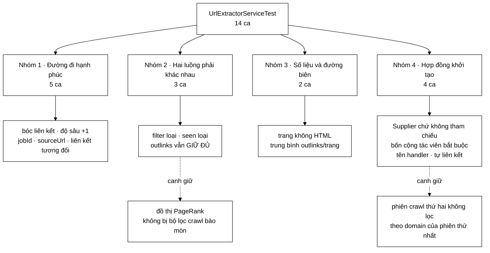

# UrlExtractorServiceTest — bộ test canh giữ một bất biến mà trình biên dịch không thấy: hai tập URL đi ra khỏi service KHÔNG được bằng nhau

**File nguồn:** `search-engine/src/test/java/com/vnsearch/crawler/modular/UrlExtractorServiceTest.java` (229 dòng)
**Gói:** `com.vnsearch.crawler.modular` · **Khung:** JUnit 5 · **Số ca:** 14
**Lớp được kiểm:** [`UrlExtractorService.md`](../../../../../../main/java/com/vnsearch/crawler/modular/UrlExtractorService.md)
**Đọc kèm:** [`LinkExtractorTest.md`](../LinkExtractorTest.md) · [`UrlFilterTest.md`](../UrlFilterTest.md) · [`UrlSeenFilterTest.md`](../UrlSeenFilterTest.md) · [`InProcessCrawlEventBusTest.md`](../bus/InProcessCrawlEventBusTest.md)

---

## 📌 Hiểu trong 30 giây

`UrlExtractorService` nhận một trang, bóc liên kết, rồi phát ra **hai luồng sự
kiện khác nhau** trên cùng một bus. Bộ test này tồn tại chủ yếu vì hai luồng đó
rất dễ bị ai đó "dọn dẹp" cho gộp làm một — và khi gộp xong thì hệ thống vẫn
chạy trót lọt, chỉ có PageRank là biến thành một cột số vô nghĩa.

```
   MỘT TRANG VÀO → HAI TẬP RA, VÀ CHÚNG PHẢI KHÁC NHAU

   outlinks  (OutlinksExtracted)  =  MỌI liên kết, chưa lọc  → PageRank
   discovered(DiscoveredUrl)      =  liên kết ĐÃ lọc + chưa gặp → Frontier

   Gộp làm một:  đồ thị liên kết mất gần hết cạnh
                 PageRank vẫn chạy, vẫn ra số, số đó vô nghĩa
                 KHÔNG có ngoại lệ nào, KHÔNG có log nào

   Ca canh giữ:  outlinksKeepEverythingEvenWhatTheFilterRejects
                 alreadySeenUrlIsNotQueuedButStaysInOutlinks
```

Điểm thứ hai đáng chú ý: cả 14 ca chạy **không cần broker nào**. Service không
biết Kafka tồn tại — nó chỉ nói chuyện với `CrawlEventBus`, và bộ test cắm vào
bản in-process. Đó chính là thứ mà giao diện `PageEventHandler` mua được.



---

## 1. Bố cục: 14 ca chia bốn nhóm

Bộ test không dùng `@Nested`, nhưng đọc theo thứ tự trong file thì bốn nhóm hiện
ra khá rõ:

```
   ┌─ NHÓM 1 · ĐƯỜNG ĐI HẠNH PHÚC, KIỂM TỪNG TRƯỜNG MỘT ──────────┐
   │  extractsLinksAndPublishesThemBothWays                        │
   │  childDepthIsParentPlusOne                                    │
   │  jobIdIsPropagatedToEveryDownstreamEvent                      │
   │  sourceUrlPointsBackToThePage                                 │
   │  resolvesRelativeLinksAgainstThePageUrl                       │
   └───────────────────────────────────────────────────────────────┘
   ┌─ NHÓM 2 · HAI LUỒNG KHÔNG ĐƯỢC GỘP ──────────────────────────┐
   │  urlFilterRejectionIsCountedAndNotPublished                   │
   │  alreadySeenUrlIsNotQueuedButStaysInOutlinks   ← quan trọng   │
   │  outlinksKeepEverythingEvenWhatTheFilterRejects ← quan trọng  │
   └───────────────────────────────────────────────────────────────┘
   ┌─ NHÓM 3 · SỐ LIỆU VÀ ĐƯỜNG BIÊN ─────────────────────────────┐
   │  pageWithoutHtmlIsSkippedAndCounted                           │
   │  countsAverageOutlinksPerPage                                 │
   └───────────────────────────────────────────────────────────────┘
   ┌─ NHÓM 4 · HỢP ĐỒNG KHỞI TẠO VÀ VÒNG ĐỜI ─────────────────────┐
   │  seesTheCurrentFilterNotTheOneAtConstructionTime ← quan trọng │
   │  constructorRejectsMissingCollaborators                       │
   │  handlerNameIsReadableInLogs                                  │
   │  selfLinkIsNotQueued                                          │
   └───────────────────────────────────────────────────────────────┘
```

Chi tiết đáng học ở phần dựng cảnh: `setUp` **không** tạo service.

```java
private UrlExtractorService service() {
    return new UrlExtractorService(new LinkExtractor(), () -> filter, () -> seen, bus);
}
```

`filter` và `seen` là trường của lớp test, còn service nhận `Supplier` đọc chúng
tại thời điểm gọi. Nhờ vậy một ca test có thể **đổi bộ lọc giữa chừng** mà không
phải dựng lại service — đó chính là ca `seesTheCurrentFilterNotTheOneAtConstructionTime`
ở mục 5. Cách viết `setUp` này không phải tình cờ; nó được thiết kế để ca đó viết
được.

---

## 2. Nhóm 1 — vì sao mỗi trường lại có một ca riêng

Nhìn qua thì bốn ca `childDepthIsParentPlusOne`, `jobIdIsPropagatedToEveryDownstreamEvent`,
`sourceUrlPointsBackToThePage`, `resolvesRelativeLinksAgainstThePageUrl` trông
như có thể gộp vào `extractsLinksAndPublishesThemBothWays` cho gọn. Chúng không
được gộp, và lý do là **mỗi trường hỏng theo một triệu chứng khác nhau, ở một
khoảng cách khác nhau tính từ chỗ gây lỗi**:

| Trường | Sai thì hỏng ở đâu | Bao lâu sau mới thấy |
|---|---|---|
| `depth` | luật `maxDepth` của `UrlFilter` | sau hàng nghìn trang |
| `jobId` | URL trong frontier không biết mình thuộc phiên nào | khi crawl phiên thứ hai |
| `sourceUrl` | cạnh của đồ thị PageRank mất đầu | khi tính PageRank |
| liên kết tương đối | crawler dừng sau vài trang | ngay, nhưng **không có lỗi** |

```
   childDepthIsParentPlusOne — vì sao lệch MỘT bậc là chí mạng

   Trang cha ở độ sâu 2, maxDepth = 5.

   Đúng:     con ở độ sâu 3  →  còn 2 bậc nữa mới bị chặn
   Lệch +0:  con ở độ sâu 2  →  KHÔNG BAO GIỜ chạm trần
                                crawler chạy tới khi hết đĩa
   Lệch +2:  con ở độ sâu 4  →  chặn sớm một bậc
                                thiếu ~một phần lớn corpus

   Cả hai kiểu lệch đều KHÔNG ném ngoại lệ. Kiểu thứ nhất lộ ra sau
   vài giờ crawl; kiểu thứ hai có thể không bao giờ lộ ra, chỉ là
   corpus nhỏ hơn dự kiến mà không ai biết vì sao.
```

Ca `resolvesRelativeLinksAgainstThePageUrl` là ca rẻ nhất mà đắt giá nhất:

```java
@Test
void resolvesRelativeLinksAgainstThePageUrl() {
    service().onPage(pageWith("<a href='/muc/con'>con</a>"));
    assertEquals("https://a.com/muc/con", discovered.get(0).url());
}
```

Nó canh đúng một dòng trong lớp nguồn — tham số thứ hai của `Jsoup.parse`:

```java
Document document = Jsoup.parse(event.html(), event.url());
```

Bỏ tham số đó đi thì mã **vẫn biên dịch** (`Jsoup.parse(String)` là một nạp chồng
hợp lệ), `absUrl("href")` trả về chuỗi rỗng cho mọi liên kết tương đối, và
crawler coi như mọi trang đều không có liên kết nào. Triệu chứng ở môi trường
thật: crawl xong 5 seed rồi dừng, log sạch bong, không có ngoại lệ nào để lần.
Đây là loại lỗi mà chỉ một ca test mới giữ được.

---

## 3. Nhóm 2 — bất biến trung tâm: hai tập KHÔNG bằng nhau

### 3.1 `outlinksKeepEverythingEvenWhatTheFilterRejects`

```java
@Test
void outlinksKeepEverythingEvenWhatTheFilterRejects() {
    service().onPage(pageWith("""
            <a href="https://a.com/trong">trong</a>
            <a href="https://b.com/ngoai">ngoai</a>
            """));

    assertEquals(2, outlinks.get(0).size(), "Outlinks giu ca lien ket bi loc");
    assertEquals(1, discovered.size(), "Nhung chi 1 URL duoc vao frontier");
}
```

Hai phép khẳng định trên **cùng một lần gọi** — đó là điểm mấu chốt. Tách chúng
ra hai ca thì mỗi ca vẫn xanh với một cài đặt gộp; đặt cạnh nhau thì con số `2`
và `1` mâu thuẫn trực tiếp với bất kỳ cài đặt nào dùng chung một danh sách.

```
   VÌ SAO PHẢI GIỮ CẢ LIÊN KẾT BỊ LOẠI

   Bộ lọc crawl loại theo: domain ngoài phạm vi, độ sâu quá trần,
   đuôi tệp không phải HTML.

   Nhưng PageRank cần ĐỒ THỊ LIÊN KẾT THẬT của web, không phải
   đồ thị của những trang mà crawler tình cờ định đi.

   Dùng tập đã lọc làm đồ thị:

      trang A  ──▶ B (trong phạm vi)     ✓ giữ
      trang A  ──▶ C (ngoài phạm vi)     ✗ mất
      trang A  ──▶ D (đã gặp rồi)        ✗ mất   ← đau nhất

   "Đã gặp rồi" là trường hợp phổ biến NHẤT trên một site thật:
   mọi trang đều trỏ về trang chủ, về chuyên mục, về bài liên quan.
   Loại chúng khỏi đồ thị nghĩa là loại đúng những cạnh
   mà PageRank dựa vào để phân biệt trang quan trọng.

   Kết quả: mọi trang có PageRank gần bằng nhau.
   Không có lỗi. Chỉ là xếp hạng tệ đi một cách không giải thích được.
```

### 3.2 `alreadySeenUrlIsNotQueuedButStaysInOutlinks`

Ca này bổ sung đúng cái nửa mà ca trên không phủ: bộ lọc **Bloom** thay vì bộ lọc
luật.

```java
UrlExtractorService s = service();
String html = "<a href='https://a.com/con'>con</a>";

s.onPage(pageWith(html));
assertEquals(1, discovered.size());

s.onPage(pageWith(html)); // lan hai: URL da gap
assertEquals(1, discovered.size(), "Khong duoc xep hang lai");
assertEquals(1, s.getRejectedAsSeenCount());

// Nhung outlinks van day du — day la du lieu cho PageRank, khong duoc loc
assertEquals(2, outlinks.size());
assertEquals(1, outlinks.get(1).size());
```

```
   HAI PHÉP LỌC, HAI CA TEST, VÌ CHÚNG HỎNG ĐỘC LẬP

              UrlFilter          UrlSeenFilter
              (luật)             (Bloom)
   trạng thái  không có          CÓ — nhớ mọi URL đã gặp
   loại vì     domain/độ sâu     đã xếp hàng rồi
   ca canh     outlinksKeep...   alreadySeenUrl...

   Một cài đặt "gộp hai luồng" có thể vô tình vẫn đúng ở một trong
   hai đường. Ví dụ: gộp SAU khi lọc luật nhưng TRƯỚC khi lọc Bloom
   → outlinksKeepEverything... đỏ, alreadySeen... vẫn xanh.

   Cần cả hai ca mới bịt kín.
```

Chi tiết đáng chú ý: ca này dùng **cùng một instance** `s` cho cả hai lần gọi.
Bắt buộc phải vậy — `UrlSeenFilter` là trạng thái, và một service mới với một bộ
lọc mới sẽ không nhớ gì.

### 3.3 `urlFilterRejectionIsCountedAndNotPublished` — ca viết hơi vụng

```java
@Test
void urlFilterRejectionIsCountedAndNotPublished() {
    // b.com khong nam trong allowedDomains
    service().onPage(pageWith("<a href='https://b.com/ngoai'>ngoai</a>"));

    assertEquals(0, discovered.size());
    UrlExtractorService s = service();
    s.onPage(pageWith("<a href='https://b.com/ngoai'>ngoai</a>"));
    assertEquals(1, s.getRejectedByFilterCount());
}
```

Đây là ca yếu nhất nhóm, và đáng nêu ra thay vì bỏ qua. Nó tạo **hai** service
chỉ vì bộ đếm nằm trên instance: instance thứ nhất dùng để kiểm `discovered`
rỗng, instance thứ hai dùng để đọc bộ đếm. Viết lại bằng một instance duy nhất
thì ngắn hơn và ý định rõ hơn:

```java
UrlExtractorService s = service();
s.onPage(pageWith("<a href='https://b.com/ngoai'>ngoai</a>"));
assertEquals(0, discovered.size());
assertEquals(1, s.getRejectedByFilterCount());
```

Bản hiện tại vẫn đúng vì `discovered` là danh sách dùng chung của lớp test và
`bus` cũng dùng chung — nhưng nó dựa vào điều đó một cách ngầm định, và đó chính
là kiểu phụ thuộc làm một ca test gãy khi ai đó chuyển `setUp` sang tạo bus
riêng cho từng service.

---

## 4. Nhóm 3 — `pageWithoutHtmlIsSkippedAndCounted` phân biệt "bỏ qua" với "xử lý"

```java
UrlExtractorService s = service();
s.onPage(pageWith(null));
s.onPage(pageWith("   "));

assertEquals(2, s.getPagesWithoutHtmlCount());
assertEquals(0, s.getPagesProcessedCount());
assertEquals(0, discovered.size());
```

Ba phép khẳng định, và phép thứ hai là phép ít hiển nhiên nhất:

```
   VÌ SAO pagesProcessed PHẢI Ở 0

   getAverageOutlinksPerPage() = linksExtracted / pagesProcessed

   Nếu một trang không có HTML vẫn được tính vào pagesProcessed:

      100 trang có HTML, 7.880 liên kết
      + 400 PageEvent rút gọn (withoutHtml) từ nhánh Analytics
      ⇒ trung bình = 7880 / 500 = 15,8   thay vì 78,8

   Con số này KHÔNG chỉ để xem: UrlSeenFilter.URLS_SEEN_PER_PAGE
   dùng nó để cấp phát bộ lọc Bloom. Ước lượng thấp gấp 5 lần
   nghĩa là bộ lọc bị cấp thiếu chỗ, tỷ lệ dương tính giả tăng vọt,
   và crawler bắt đầu bỏ qua những URL nó CHƯA từng gặp.

   Một phép chia sai ⇒ một crawler bỏ sót trang. Nối được hai chuyện
   đó với nhau ở môi trường thật thì gần như không thể.
```

Ca dùng cả `null` **và** `"   "` (chuỗi trắng) là cố ý: lớp nguồn kiểm
`html() == null || html().isBlank()`, và một cài đặt chỉ kiểm `null` sẽ đi tiếp
với chuỗi trắng, cho ra một `Document` rỗng và một `OutlinksExtracted` rỗng phát
lên bus mà không ai cần.

`countsAverageOutlinksPerPage` khép nhóm bằng cách kiểm chính phép chia đó, kèm
một chi tiết nhỏ nhưng đúng: nó khẳng định `0.0` **trước khi** xử lý trang nào —
tức là canh nhánh chia cho không.

---

## 5. `seesTheCurrentFilterNotTheOneAtConstructionTime` — ca duy nhất giải thích vì sao chữ ký hàm khởi tạo lại xấu như vậy

```java
@Test
void seesTheCurrentFilterNotTheOneAtConstructionTime() {
    UrlExtractorService s = service();

    s.onPage(pageWith("<a href='https://b.com/x'>x</a>"));
    assertEquals(0, discovered.size(), "b.com bi loai boi bo loc phien 1");

    // "Phien 2": doi bo loc, service phai thay ngay
    filter = new UrlFilter(Set.of("b.com"), 5);
    seen = UrlSeenFilter.forMaxPages(1000);
    s.onPage(pageWith("<a href='https://b.com/x'>x</a>"));

    assertEquals(1, discovered.size(), "Sau khi doi bo loc, b.com phai duoc chap nhan");
}
```

Hàm khởi tạo của `UrlExtractorService` nhận `Supplier<UrlFilter>` và
`Supplier<UrlSeenFilter>` chứ không nhận thẳng hai đối tượng. Nhìn qua thì đó là
một lớp gián tiếp thừa, và là thứ mà một lần "dọn dẹp" rất dễ gỡ bỏ. Ca này là
lời giải thích duy nhất trong bộ test:

```
   VÒNG ĐỜI LỆCH NHAU

   UrlExtractorService   : một bean Spring, sống suốt vòng đời ứng dụng
   UrlFilter / UrlSeenFilter : CrawlerService cấp phát lại cho TỪNG PHIÊN
                               (chúng phụ thuộc allowedDomains, maxDepth, maxPages)

   Giữ tham chiếu cố định:

     Phiên 1: crawl vnexpress.net   → filter(allowed = {vnexpress.net})
     Phiên 2: crawl tuoitre.vn      → service VẪN dùng filter phiên 1
                                    → mọi liên kết tuoitre.vn bị loại
                                    → crawl ra 0 trang

   Và tệ hơn ở phía Bloom: bộ lọc phiên 1 đã đầy URL của phiên 1,
   không bao giờ được làm mới, nên càng chạy càng trả lời "đã gặp"
   cho mọi thứ — kể cả URL hoàn toàn mới.

   Triệu chứng: phiên crawl thứ hai trong cùng một lần chạy backend
   ra rất ít trang, hoặc không ra trang nào. Khởi động lại backend
   thì lại bình thường — nên rất dễ bị quy cho "mạng chậm".
```

Ca test tái hiện đúng kịch bản đó trong bốn dòng: gán lại hai trường của lớp
test, gọi lại `onPage` **trên cùng một service**, và đòi hành vi phải đổi theo.

Ba ca còn lại của nhóm là hàng rào rẻ:

| Ca | Canh giữ |
|---|---|
| `constructorRejectsMissingCollaborators` | Bốn tham số, bốn lời gọi `assertThrows` riêng — thiếu bất kỳ cái nào cũng phải nổ **lúc khởi tạo**, không phải lúc `onPage` với `NullPointerException` |
| `handlerNameIsReadableInLogs` | `"URL Extractor"` — tên khối trong sơ đồ kiến trúc, xuất hiện trong log |
| `selfLinkIsNotQueued` | Liên kết trỏ về chính trang đang xét bị `LinkExtractor` loại — nếu không thì mọi trang có một `<a href>` về chính nó sẽ tự nạp lại mình |

Chú ý `constructorRejectsMissingCollaborators` viết **bốn** lời gọi `assertThrows`
riêng chứ không một vòng lặp. Đó là lựa chọn đúng: khi ca đỏ, dấu vết ngăn xếp
chỉ thẳng vào dòng của tham số bị hỏng.

---

## 6. Kỹ thuật đáng học lại từ bộ test này

```
   ① ĐẶT HAI PHÉP KHẲNG ĐỊNH MÂU THUẪN CẠNH NHAU
      assertEquals(2, outlinks.get(0).size());
      assertEquals(1, discovered.size());
      → không cài đặt "gộp một luồng" nào qua được cả hai

   ② setUp KHÔNG TẠO ĐỐI TƯỢNG ĐANG KIỂM
      Trường `filter`/`seen` + hàm service() dựng theo yêu cầu
      → một ca có thể đổi cộng tác viên GIỮA CHỪNG

   ③ KIỂM CẢ null LẪN CHUỖI TRẮNG
      onPage(pageWith(null)); onPage(pageWith("   "));
      → chặn cài đặt chỉ kiểm null

   ④ KHẲNG ĐỊNH GIÁ TRỊ 0 TRƯỚC KHI CÓ DỮ LIỆU
      assertEquals(0.0, s.getAverageOutlinksPerPage());
      → canh nhánh chia cho không

   ⑤ BỘ ĐẾM ĐI KÈM HÀNH VI, KHÔNG TÁCH RIÊNG
      assertEquals(0, discovered.size());
      assertEquals(1, s.getRejectedByFilterCount());
      → chặn cài đặt "loại nhưng quên đếm" và ngược lại

   ⑥ MỘT assertThrows CHO MỖI THAM SỐ
      bốn dòng thay vì một vòng lặp
      → dấu vết ngăn xếp chỉ đúng tham số hỏng

   ⑦ KHÔNG CẦN BROKER
      InProcessCrawlEventBus + hai List thu sự kiện
      → 14 ca chạy trong mili-giây, chạy được ở CI không có Docker
```

---

## 7. Hướng dẫn thực hành

### 7.1 Chạy

```powershell
cd search-engine

# Cả 14 ca
.\mvnw.cmd test "-Dtest=UrlExtractorServiceTest"

# Một ca
.\mvnw.cmd test "-Dtest=UrlExtractorServiceTest#outlinksKeepEverythingEvenWhatTheFilterRejects"

# Cả gói modular
.\mvnw.cmd test "-Dtest=com.vnsearch.crawler.modular.*Test"
```

Trên PowerShell **phải bọc `-Dtest=...` trong nháy kép**, nếu không dấu `=` bị
nuốt và Maven chạy toàn bộ bộ test.

### 7.2 Đọc kết quả

```
[INFO] Running com.vnsearch.crawler.modular.UrlExtractorServiceTest
[INFO] Tests run: 14, Failures: 0, Errors: 0, Skipped: 0
```

Báo cáo chi tiết:
`search-engine/target/surefire-reports/com.vnsearch.crawler.modular.UrlExtractorServiceTest.txt`

### 7.3 Tự kiểm chứng — cố tình làm hỏng để xem ca nào đỏ

| Sửa gì trong `UrlExtractorService.java` | Ca dự kiến đỏ |
|---|---|
| `Jsoup.parse(event.html())` — bỏ tham số `baseUri` | `resolvesRelativeLinksAgainstThePageUrl` (và cả `extractsLinksAndPublishesThemBothWays` ở liên kết `/hai`) |
| `int childDepth = event.depth();` — bỏ `+ 1` | `childDepthIsParentPlusOne` |
| Phát `OutlinksExtracted` **sau** vòng lọc, dùng danh sách đã lọc | `outlinksKeepEverythingEvenWhatTheFilterRejects`, `alreadySeenUrlIsNotQueuedButStaysInOutlinks` |
| Bỏ `rejectedByFilter.incrementAndGet()` | `urlFilterRejectionIsCountedAndNotPublished` |
| Đổi `Supplier<UrlFilter>` thành `UrlFilter` giữ cố định | `seesTheCurrentFilterNotTheOneAtConstructionTime` |
| Truyền `null` thay `event.jobId()` vào `DiscoveredUrl` | `jobIdIsPropagatedToEveryDownstreamEvent` |
| `pagesProcessed.incrementAndGet()` đặt **trước** phép kiểm HTML rỗng | `pageWithoutHtmlIsSkippedAndCounted` |
| Bỏ phép kiểm `html().isBlank()`, chỉ giữ `== null` | `pageWithoutHtmlIsSkippedAndCounted` |
| `new DiscoveredUrl(link, hostOf(link), childDepth, link, ...)` — `sourceUrl` trỏ vào chính nó | `sourceUrlPointsBackToThePage` |

Nếu một dòng sửa mà **không** ca nào đỏ, đó là một khoảng trống thật. Đây là ý
tưởng của *kiểm thử đột biến* (mutation testing), làm bằng tay.

### 7.4 Cạm bẫy khi viết thêm ca cho lớp này

```
   ✗ Đừng tạo service mới cho mỗi lời gọi onPage khi đang kiểm
     trạng thái. UrlSeenFilter là trạng thái; service mới + bộ lọc
     mới thì "đã gặp" không bao giờ xảy ra và ca test xanh vô nghĩa.

   ✗ Đừng khẳng định thứ tự của `discovered`. Thứ tự hiện tại đến từ
     LinkExtractor, không phải một bảo đảm của lớp này. Bộ test hiện
     dùng anyMatch cho việc đó — hãy giữ nguyên kiểu ấy.

   ✗ Đừng kiểm outlinks bằng cách so với `discovered`. Cả bộ test
     tồn tại để chứng minh hai tập đó KHÁC nhau; viết một ca dựa
     trên chúng bằng nhau là tự mâu thuẫn.

   ✗ Đừng dùng UrlFilter với allowedDomains rỗng để "cho qua tất".
     Ngữ nghĩa của tập rỗng không được ca nào trong UrlFilterTest
     chốt, nên ca của bạn sẽ phụ thuộc vào một hành vi không định
     nghĩa.

   ✗ Đừng thêm ca cần Kafka. Cả bộ test đang chạy được ở CI không
     Docker; ca tích hợp broker nằm ở KafkaCrawlBusIT.
```

---

## 8. Bảng tổng hợp 14 ca

| # | Ca test | Nhóm | Tính chất được canh giữ |
|---|---|---|---|
| 1 | `extractsLinksAndPublishesThemBothWays` | 1 | Một `OutlinksExtracted` cho cả trang + N `DiscoveredUrl` riêng lẻ |
| 2 | **`childDepthIsParentPlusOne`** | 1 | **Độ sâu tăng đúng một bậc — nền của luật `maxDepth`** |
| 3 | `jobIdIsPropagatedToEveryDownstreamEvent` | 1 | `jobId` xuyên suốt trang → liên kết → frontier |
| 4 | `sourceUrlPointsBackToThePage` | 1 | Đầu cạnh của đồ thị PageRank |
| 5 | **`resolvesRelativeLinksAgainstThePageUrl`** | 1 | **`baseUri` của `Jsoup.parse` — bỏ đi thì crawler dừng lặng lẽ** |
| 6 | `urlFilterRejectionIsCountedAndNotPublished` | 2 | Liên kết bị luật loại: không phát, có đếm |
| 7 | **`alreadySeenUrlIsNotQueuedButStaysInOutlinks`** | 2 | **Bloom loại khỏi frontier nhưng KHÔNG khỏi outlinks** |
| 8 | **`outlinksKeepEverythingEvenWhatTheFilterRejects`** | 2 | **Hai tập ra khỏi service không được bằng nhau** |
| 9 | `pageWithoutHtmlIsSkippedAndCounted` | 3 | `PageEvent` rút gọn không làm sai mẫu số của trung bình |
| 10 | `countsAverageOutlinksPerPage` | 3 | Phép chia, kèm nhánh chia cho không |
| 11 | **`seesTheCurrentFilterNotTheOneAtConstructionTime`** | 4 | **`Supplier` chứ không tham chiếu cố định — phiên crawl thứ hai** |
| 12 | `constructorRejectsMissingCollaborators` | 4 | Bốn cộng tác viên bắt buộc, nổ sớm |
| 13 | `handlerNameIsReadableInLogs` | 4 | `"URL Extractor"` — tên khối trong sơ đồ |
| 14 | `selfLinkIsNotQueued` | 4 | Liên kết tự trỏ bị loại |

---

## 9. Khoảng trống chưa phủ

```
   ✗ ĐA LUỒNG. Javadoc lớp khẳng định "Thread-safe: không giữ trạng
     thái nào ngoài các bộ đếm nguyên tử", nhưng không ca nào chứng
     minh. Ở chế độ Kafka, container listener chạy nhiều luồng và
     onPage được gọi song song.

   ✗ HTML DỊ DẠNG. Một trong ba lý do tách service ra (ghi trong
     Javadoc) là "một trang có DOM dị dạng làm Jsoup ném ngoại lệ
     không còn kéo theo vòng lặp tải trang" — nhưng không ca nào
     ném thử một trang như vậy vào onPage.

   ✗ hostOf() VỚI URL DỊ DẠNG. Nhánh lùi về "chính URL làm khoá
     phân hoạch" không được ca nào chạm tới. Đây là đường sống ở
     chế độ Kafka: DiscoveredUrl từ chối host rỗng, nên nhánh này
     là thứ ngăn một ngoại lệ giữa vòng lặp.

   ✗ getLinksAcceptedCount(). Có getter, không ca nào đọc.

   ✗ TRANG CÓ RẤT NHIỀU LIÊN KẾT. Không có trần nào ở service này
     (khác với ImageDownloadService có maxImagesPerPage). Một trang
     sơ đồ site với 50.000 liên kết sẽ phát 50.000 thông điệp.
     Không ca nào ghi lại rằng đó là hành vi có chủ ý.
```

Ca đáng viết trước nhất là ca `hostOf` dị dạng, vì nó rẻ và chạm đúng nhánh chưa
ai đi:

```java
@Test
void urlDiDangVanCoKhoaPhanHoachHopLe() {
    service().onPage(pageWith("<a href='https://a.com/binh-thuong'>ok</a>"));
    assertEquals("a.com", discovered.get(0).host());
    // Không được ném: DiscoveredUrl từ chối host rỗng, nên nhánh lùi
    // phải luôn cho ra một chuỗi khác rỗng.
    assertFalse(discovered.get(0).host().isBlank());
}
```

---

## 10. Liên kết

- Lớp được kiểm, kèm sơ đồ chặng `URL Extractor → URL Filter → URL Seen` và lý do tách tiến trình: [`UrlExtractorService.md`](../../../../../../main/java/com/vnsearch/crawler/modular/UrlExtractorService.md)
- Nơi phép bóc `<a href>` thật sự xảy ra — ca `selfLinkIsNotQueued` ở đây chỉ kiểm rằng service **dùng** nó đúng: [`LinkExtractorTest.md`](../LinkExtractorTest.md)
- Luật lọc mà nhóm 2 dựa vào (domain, độ sâu, đuôi tệp): [`UrlFilterTest.md`](../UrlFilterTest.md)
- Bộ lọc Bloom đứng sau `alreadySeenUrlIsNotQueuedButStaysInOutlinks`, và là nơi giải thích hằng số `URLS_SEEN_PER_PAGE` mà mục 4 nhắc tới: [`UrlSeenFilterTest.md`](../UrlSeenFilterTest.md)
- Bus in-process mà cả 14 ca cắm vào để thu sự kiện: [`InProcessCrawlEventBusTest.md`](../bus/InProcessCrawlEventBusTest.md)
- Hình dạng của `PageEvent`, `DiscoveredUrl`, `OutlinksExtracted` — ba bản ghi mà bộ test này đọc từng trường: [`CrawlEventTest.md`](../bus/CrawlEventTest.md)
- Bên tiêu thụ thứ hai của cùng luồng `PageEvent`, để thấy vì sao service này không được biết Kafka tồn tại: [`CrawlAnalyticsServiceTest.md`](./CrawlAnalyticsServiceTest.md)
- Nơi service này được đấu vào bus lúc ứng dụng khởi động: [`CrawlerServiceBusWiringTest.md`](../CrawlerServiceBusWiringTest.md)
