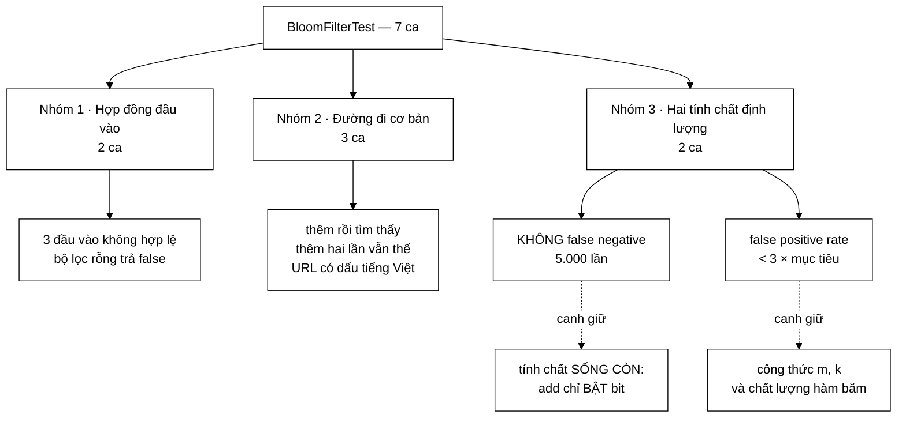

# BloomFilterTest — bộ test canh một cấu trúc được phép sai, và canh đúng CHIỀU nó được phép sai

**File nguồn:** `search-engine/src/test/java/com/vnsearch/datastructure/BloomFilterTest.java` (81 dòng)
**Gói:** `com.vnsearch.datastructure` · **Khung:** JUnit 5 · **Số ca:** 7 · **Thời gian chạy:** ~0,10 s
**Lớp được kiểm:** [`BloomFilter.md`](../../../../../main/java/com/vnsearch/datastructure/BloomFilter.md)
**Đọc kèm:** [`../crawler/UrlSeenFilterTest.md`](../crawler/UrlSeenFilterTest.md) · [`LRUCacheTest.md`](./LRUCacheTest.md) · [`TrieTest.md`](./TrieTest.md)

---

## 📌 Hiểu trong 30 giây

Mọi cấu trúc dữ liệu khác trong gói này đều trả lời **đúng hoặc sai**. Bloom
Filter thì **được phép trả lời sai** — nhưng chỉ theo một chiều. Bộ test 7 ca
này tồn tại để canh đúng cái sự bất đối xứng đó.

```
   HAI KIỂU SAI, HAI SỐ PHẬN HOÀN TOÀN KHÁC NHAU

   FALSE POSITIVE   "có thể đã gặp" nhưng thực ra chưa
                    → crawler bỏ qua vài trang. Tiếc, vô hại.
                    → ĐƯỢC PHÉP. Test chỉ kiểm nó không QUÁ nhiều.

   FALSE NEGATIVE   "chắc chắn chưa gặp" nhưng thực ra đã gặp
                    → crawler tải lại trang cũ → vòng lặp vô hạn
                    → CẤM TUYỆT ĐỐI. Test kiểm 5.000 lần liên tiếp.

   ⇒ neverProducesFalseNegative           dùng assertTrue — nghiêm ngặt
     falsePositiveRateIsApproximatelyAs…  dùng ngưỡng lỏng gấp 3 lần
```

Và một quan sát nghịch lý mà mục 4 của tài liệu này đào sâu: ca test được chú
thích là "chế độ thống kê" **không hề có chút ngẫu nhiên nào** — nó cho ra đúng
con số `0.0104` ở mọi lần chạy trên mọi máy.



---

## 1. Bố cục: 7 ca chia ba nhóm

```
   ┌─ NHÓM 1 · HỢP ĐỒNG ĐẦU VÀO ──────────────────────────────┐
   │  constructorRejectsInvalidArguments                       │
   │  mightContainOnEmptyFilterIsFalse                         │
   └───────────────────────────────────────────────────────────┘
   ┌─ NHÓM 2 · ĐƯỜNG ĐI CƠ BẢN ───────────────────────────────┐
   │  singleItemAddedIsAlwaysFound                             │
   │  addingSameItemTwiceIsIdempotent                          │
   │  vietnameseUrlsWithDiacritics                             │
   └───────────────────────────────────────────────────────────┘
   ┌─ NHÓM 3 · HAI TÍNH CHẤT ĐỊNH LƯỢNG ──────────────────────┐
   │  neverProducesFalseNegative              ← SỐNG CÒN       │
   │  falsePositiveRateIsApproximatelyAsConfigured             │
   └───────────────────────────────────────────────────────────┘
```

Nhóm 1 và 2 tổng cộng 5 ca, chạy trong vài micro giây, và về bản chất chỉ là
hàng rào rẻ tiền. Toàn bộ giá trị của bộ test nằm ở **nhóm 3 — hai ca**. Đây
là một bố cục hiếm gặp: hai ca chiếm gần hết ý nghĩa, và cũng chiếm gần hết
0,10 giây thời gian chạy.

---

## 2. `neverProducesFalseNegative` — tính chất mà cả kiến trúc crawler dựa vào

```java
@Test
void neverProducesFalseNegative() {
    // Them 5000 chuoi, kiem tra TAT CA deu duoc tim thay (khong false negative).
    BloomFilter filter = new BloomFilter(5000, 0.01);
    for (int i = 0; i < 5000; i++) {
        filter.add("https://example.vn/page/" + i);
    }
    for (int i = 0; i < 5000; i++) {
        assertTrue(filter.mightContain("https://example.vn/page/" + i),
                "Bloom Filter khong bao gio duoc co false negative");
    }
}
```

### 2.1 Vì sao tính chất này là điều kiện sống còn, không phải một tính năng

Bloom Filter trong dự án này đứng ở khối **"URL Seen?"** của crawler. Nó là thứ
duy nhất trả lời câu hỏi "URL này đã bóc chưa". Đảo chiều nó ra thì:

```
   NẾU BỘ LỌC BÁO "CHƯA GẶP" CHO MỘT URL ĐÃ GẶP

   1. Worker bóc trang A, lấy được liên kết tới B.
   2. Bộ lọc nói "B chưa gặp"   → B vào hàng đợi.
   3. Worker bóc B, B trỏ ngược về A (mọi trang tin đều có menu về trang chủ).
   4. Bộ lọc nói "A chưa gặp"   → A vào hàng đợi lại.
   5. Quay lại bước 1.

   ⇒ VÒNG LẶP VÔ HẠN. Crawler chạy mãi trên vài chục trang,
     hàng đợi phình ra, không bao giờ tới trang mới nào.

   TRIỆU CHỨNG THẬT: bộ đếm "đã tải" tăng đều đặn, log trông
   hoàn toàn bình thường, nhưng số trang PHÂN BIỆT trong chỉ mục
   đứng yên. Rất khó nhận ra nếu chỉ nhìn tốc độ tải.
```

So sánh với chiều ngược lại — false positive: bộ lọc báo "có thể đã gặp" cho
một URL mới toanh, crawler bỏ qua trang đó. Mất một trang trong hàng triệu.
Với tỷ lệ 1 %, cứ 100 trang thì mất 1. Không ai nhận ra, và cũng không cần
nhận ra.

**Đây là lý do một cấu trúc "có thể sai" lại dùng được cho bài toán này**: bài
toán chỉ nhạy cảm với một chiều sai, và cấu trúc chỉ sai theo chiều còn lại.

### 2.2 Vì sao tính chất đúng — và vì sao vẫn phải test

Chứng minh chỉ có một dòng:

```
   add(x)          →  bật các bit  idx(x,0), idx(x,1), ..., idx(x,k-1)
   mightContain(x) →  đọc đúng các bit đó

   bits[i] |= mask     ← CHỈ CÓ PHÉP OR. Không có chỗ nào TẮT bit.

   ⇒ Bit đã bật thì bật vĩnh viễn.
   ⇒ Sau add(x), mọi bit mà mightContain(x) đọc đều đã bật.
   ⇒ mightContain(x) không thể trả về false.
```

Đã chứng minh được rồi thì test còn để làm gì? Vì phép chứng minh chỉ đúng khi
**`add` và `mightContain` tính ra CÙNG một tập chỉ số**. Cả hai đều gọi
`indexFor(h1, h2, i)`, nhưng chúng là hai phương thức riêng, và một sửa đổi
lệch nhau ở một trong hai chỗ sẽ phá vỡ tính chất mà vẫn giữ nguyên phép OR:

| Sửa đổi | `add` bật bit nào | `mightContain` đọc bit nào | Hậu quả |
|---|---|---|---|
| `add` lặp `i < numHashes - 1` | k−1 bit | k bit | Bit thứ k chưa bao giờ bật → **false negative mọi lúc** |
| `mightContain` dùng `i` khác `add` | tập A | tập B ≠ A | False negative ngẫu nhiên |
| `indexFor` dùng `%` thay `Math.floorMod` | chỉ số **âm** khi `combined < 0` | như trên | `ArrayIndexOutOfBoundsException` |

Ca test này bắt cả ba, và bắt ngay ở lần lặp đầu tiên.

### 2.3 Vì sao 5.000, không phải 5

```
   filter = new BloomFilter(5000, 0.01)  →  m = 47.926 bit, k = 7

   Chèn đúng 5.000 mục = chèn ĐÚNG SỨC CHỨA THIẾT KẾ.
   Tại điểm đó khoảng 50 % số bit đã bật — trạng thái "chật nhất"
   mà bộ lọc được thiết kế để chịu.

   Nếu chỉ chèn 5 mục, bảng bit gần như trắng, mọi lỗi
   chồng lấn bit đều không hiện ra.
```

Đây là chi tiết cố ý đáng học: **cỡ dữ liệu của ca test bằng đúng cỡ thiết kế
của cấu trúc**, không phải một con số tròn tuỳ tiện. Và nó cũng làm cho ca test
kiểm luôn được đường `growEdgeTable`-tương-đương của Bloom Filter, tức là phép
`bits[index / 64]` chạy qua nhiều phần tử mảng chứ không quanh quẩn ở phần tử
số 0.

### 2.4 Vòng lặp kiểm được viết TÁCH khỏi vòng lặp chèn

Chi tiết dễ bỏ qua nhất, và là chi tiết đúng nhất trong ca test này:

```java
for (int i = 0; i < 5000; i++) filter.add(...);      // chèn HẾT
for (int i = 0; i < 5000; i++) assertTrue(...);      // rồi mới kiểm
```

```
   NẾU GỘP LÀM MỘT VÒNG (add rồi kiểm ngay)

   for (i...) { filter.add(url_i); assertTrue(filter.mightContain(url_i)); }

   Mỗi mục được kiểm khi bảng bit CHỈ chứa i mục đầu tiên.
   Mục số 0 được kiểm trên bảng gần như trắng.
   Không mục nào được kiểm ở trạng thái ĐẦY.

   ⇒ Lỗi kiểu "mục cũ bị xoá khi bảng chật" hoàn toàn lọt.

   Tách hai vòng thì MỌI mục đều được kiểm ở trạng thái đầy nhất.
```

---

## 3. `falsePositiveRateIsApproximatelyAsConfigured` — một phép khẳng định thống kê, và cái giá của nó

```java
@Test
void falsePositiveRateIsApproximatelyAsConfigured() {
    int n = 10_000;
    double targetFpr = 0.01;
    BloomFilter filter = new BloomFilter(n, targetFpr);
    for (int i = 0; i < n; i++) {
        filter.add("item-" + i);
    }
    int falsePositives = 0;
    int trials = 10_000;
    for (int i = 0; i < trials; i++) {
        if (filter.mightContain("not-inserted-" + i)) {
            falsePositives++;
        }
    }
    double observedFpr = (double) falsePositives / trials;
    // Cho phep sai so bien dong (che do thong ke), quan trong la khong lech qua xa muc tieu.
    assertTrue(observedFpr < targetFpr * 3,
            "False positive rate quan sat duoc (" + observedFpr + ") lech qua xa muc tieu (" + targetFpr + ")");
}
```

### 3.1 Vì sao một phép khẳng định thống kê **phải** lỏng

Ca test này khác mọi ca khác trong gói ở một điểm nền tảng: **nó không kiểm
một hằng đẳng thức, nó ước lượng một tham số.** Giá trị đúng không phải một
con số mà là một phân phối.

```
   PHÉP ĐO Ở ĐÂY LÀ MỘT PHÉP THỬ NHỊ THỨC

   trials = 10.000 phép thử độc lập, mỗi phép "trúng" với xác suất p ≈ 0,01

   Số lần trúng  X ~ Binomial(10.000; 0,01)
   Kỳ vọng       E[X] = 100
   Độ lệch chuẩn σ = sqrt(10.000 × 0,01 × 0,99) ≈ 9,95

   ⇒ observedFpr = X/10.000 có σ ≈ 0,000995  (khoảng 0,1 điểm phần trăm)

   Một khoảng ±3σ tự nhiên là  [0,0070 ; 0,0130].
```

Viết `assertEquals(0.01, observedFpr)` là sai về nguyên tắc — nó khẳng định một
đại lượng ngẫu nhiên phải rơi đúng vào kỳ vọng. Ngay cả một cài đặt hoàn hảo
cũng trượt. Đó là công thức để tạo ra **ca test chập chờn (flaky)**, và ca test
chập chờn còn tệ hơn không có ca test: sau vài lần đỏ vô cớ, người ta thêm
`@Disabled` và mất luôn cả phần canh giữ thật.

Ngoài dao động nhị thức còn hai nguồn lệch nữa, cả hai đều là lệch **hệ thống**
chứ không phải ngẫu nhiên:

```
   ① Làm tròn khi tính m và k
      m = ceil(...)          → làm tròn LÊN, có lợi
      k = round(6,6438) = 7  → làm tròn LÊN, k tối ưu thật là 6,64

      Với m = 95.851, k = 7, n = 10.000:
      FPR lý thuyết = (1 − e^(−kn/m))^k = 0,010035
      ⇒ đã lệch khỏi 0,01 TRƯỚC KHI chạy dòng nào.

   ② Double hashing không phải k hàm băm độc lập thật
      h_i(x) = h1(x) + i·h2(x)  là tổ hợp tuyến tính của HAI hàm.
      Kirsch & Mitzenmacher chứng minh sai số tiệm cận không đáng kể,
      nhưng "không đáng kể" ≠ "bằng không".
```

Ngưỡng phải rộng hơn tổng của cả ba nguồn lệch. Đó là lý do chính đáng để lỏng.

### 3.2 Cái giá của ngưỡng `targetFpr * 3`

Chính đáng để lỏng, nhưng **lỏng bao nhiêu** lại là một câu hỏi khác — và ở đây
nó lỏng hơn cần thiết rất nhiều.

```
   NGƯỠNG ĐANG DÙNG ĐẶT Ở ĐÂU

   kỳ vọng   0,0100
   σ         0,000995

   ngưỡng 0,03  =  0,01 + 20,1 × σ

   ┌──────────────────────────────────────────────────────────┐
   │ 0,007   0,010   0,013                            0,030   │
   │   |───────●───────|                                 ‖    │
   │      ±3σ tự nhiên                              NGƯỠNG    │
   │                                                          │
   │           khoảng KHÔNG BỊ CANH GIỮ  ──────────────►      │
   └──────────────────────────────────────────────────────────┘
```

Hậu quả cụ thể: **bộ lọc có thể xấu đi gần ba lần mà ca test vẫn xanh.**

| Hỏng gì | FPR thật | `< 0,03` ? | Có bị bắt không |
|---|---|---|---|
| `k = 7` bị đổi thành `k = 4` | ≈ 1,6 % | có | **lọt** |
| `k` bị đổi thành `k = 3` | ≈ 2,4 % | có | **lọt** |
| `m` bị chia đôi | ≈ 8,4 % | không | bị bắt |
| `hash2` trả về hằng số | k hàm băm sụp thành 1 | không | bị bắt |
| Bỏ hẳn bước trộn avalanche trong `hash2` | tuỳ, thường vẫn thấp | có | **có thể lọt** |

Nghĩa là ca test này **chỉ canh được sự cố thảm hoạ, không canh được sự suy
giảm**. Với hệ thống thật, suy giảm mới là thứ hay xảy ra: ai đó "tối ưu"
`numHashes` xuống cho nhanh, FPR tăng gấp đôi, crawler âm thầm bỏ sót gấp đôi
số trang, và không có gì đỏ.

Một ngưỡng bám sát thống kê hơn:

```java
// 5σ ≈ xác suất báo động giả 3e-7 mỗi lần chạy — thực tế là không bao giờ,
// nhưng chỉ dung sai 0,5 điểm phần trăm thay vì 2.
assertTrue(observedFpr < 0.015,
        "FPR quan sát (" + observedFpr + ") vượt xa mục tiêu 0,01");
```

### 3.3 Nghịch lý: ca test "thống kê" này không hề ngẫu nhiên

Chú thích trong mã viết *"Cho phep sai so bien dong (che do thong ke)"*. Câu đó
mô tả một thứ **không tồn tại trong ca test này**.

```
   ĐI TÌM NGUỒN NGẪU NHIÊN TRONG CA TEST

   Chuỗi được chèn:   "item-0" ... "item-9999"          ← cố định
   Chuỗi được thử:    "not-inserted-0" ... "-9999"      ← cố định
   hash1 = FNV-1a     hàm thuần, không seed             ← tất định
   hash2 = rolling    hàm thuần, không seed             ← tất định
   m, k               tính từ (10.000; 0,01)            ← tất định

   ⇒ KHÔNG CÓ Random. KHÔNG CÓ seed hệ thống.
     KHÔNG CÓ thứ tự luồng. KHÔNG CÓ thời gian.
```

Chạy thử ba lần liên tiếp trên cùng máy cho ra:

```
numBits=95851 numHashes=7
run 0 observedFpr=0.0104
run 1 observedFpr=0.0104
run 2 observedFpr=0.0104
```

`0.0104` — không phải "khoảng 0,0104", mà **đúng 104 false positive trên 10.000
lần thử**, và sẽ là 104 trên mọi máy chạy cùng phiên bản mã nguồn. Con số này
lệch khỏi kỳ vọng lý thuyết 0,010035 đúng 0,37σ, tức là một mẫu hoàn toàn bình
thường — nhưng nó là một mẫu **cố định**.

Điều đó đổi hoàn toàn cách nên viết phép khẳng định:

```
   Nếu kết quả TẤT ĐỊNH thì dung sai chỉ cần đủ để chịu
   ① làm tròn m, k   ② sai số double hashing
   — KHÔNG cần chịu dao động lấy mẫu, vì không có lấy mẫu.

   Ngưỡng 0,03 đang trả giá cho một rủi ro không tồn tại.
```

Nói cho công bằng: ngưỡng lỏng vẫn còn một công dụng thật. Nếu ai đó thay
`hash1`/`hash2` bằng cặp hàm khác (điều hoàn toàn hợp lệ), con số tất định
`0.0104` sẽ nhảy sang một con số tất định khác — và ngưỡng chặt quá sẽ làm ca
test đỏ vì một thay đổi đúng đắn. Nhưng 20σ vẫn là quá tay cho mục đích đó;
5σ đã thừa sức.

---

## 4. Nhóm 2 — ba ca rẻ tiền, mỗi ca chặn đúng một cách hỏng

| Ca | Chặn cách hỏng nào |
|---|---|
| `singleItemAddedIsAlwaysFound` | `add` không bật bit nào (ví dụ dùng `&=` thay `\|=`), hoặc `indexFor` cho ra chỉ số khác nhau giữa hai lần gọi cùng đầu vào |
| `addingSameItemTwiceIsIdempotent` | `add` có tác dụng phụ tích luỹ — ví dụ dùng bộ đếm thay vì bit, hoặc `XOR` thay vì `OR` |
| `vietnameseUrlsWithDiacritics` | Băm theo `char` mà không quy về byte UTF-8, hoặc thất bại trên ký tự ngoài ASCII |

### 4.1 `addingSameItemTwiceIsIdempotent` kiểm một thứ tinh tế hơn vẻ ngoài

Ba dòng, và trông như thừa — đã có `singleItemAddedIsAlwaysFound` rồi. Nhưng nó
canh giữ một tính chất riêng: **`add` phải là phép luỹ đẳng.**

```
   CÀI ĐẶT SAI TRÔNG NHƯ THẾ NÀO

   bits[i] ^= mask;     ← XOR thay vì OR

   add("dup") lần 1:  bit tắt → BẬT      ✓
   add("dup") lần 2:  bit bật → TẮT      ✗
   mightContain("dup") → false           ← FALSE NEGATIVE

   Ca singleItemAddedIsAlwaysFound VẪN XANH (chỉ add một lần).
   Ca neverProducesFalseNegative VẪN XANH (mỗi URL cũng chỉ add một lần).
   ⇒ CHỈ ca này bắt được.
```

Và trong crawler thật, thêm cùng một URL hai lần là chuyện xảy ra liên tục —
mọi trang tin đều có menu trỏ về những địa chỉ giống nhau. Nên đây không phải
đường biên lý thuyết.

### 4.2 `vietnameseUrlsWithDiacritics` — và phép khẳng định âm ở cuối

```java
filter.add("https://vnexpress.net/tin-tuc/khoa-hoc");
filter.add("https://example.vn/máy-tính");
assertTrue(filter.mightContain("https://example.vn/máy-tính"));
assertFalse(filter.mightContain("https://example.vn/khong-them"));
```

Dòng `assertFalse` cuối là dòng duy nhất trong **cả bộ test** khẳng định một
chuỗi chưa thêm thì `mightContain` trả về `false`. Nó chặn cách hỏng ngu ngốc
nhất và cũng nguy hiểm nhất:

```
   NẾU mightContain LUÔN TRẢ VỀ true

   ✓ singleItemAddedIsAlwaysFound        xanh
   ✓ addingSameItemTwiceIsIdempotent     xanh
   ✓ neverProducesFalseNegative          xanh (5.000/5.000 đúng!)
   ✗ mightContainOnEmptyFilterIsFalse    ĐỎ
   ✗ falsePositiveRateIsApproximately…   ĐỎ (observed = 1,0)
   ✗ vietnameseUrlsWithDiacritics        ĐỎ

   Ca "sống còn" nhất của bộ test lại là ca DỄ QUA MẶT NHẤT
   bằng một cài đặt vô dụng. Nó cần ba ca âm này đứng cạnh
   mới có ý nghĩa.
```

Đây là bài học chung: **một tính chất dạng "luôn luôn đúng" phải luôn đi kèm
ít nhất một ca chứng minh hàm không tầm thường.** `assertTrue` một mình không
bao giờ đủ.

Chi tiết nhỏ nhưng đúng: URL có dấu được viết thẳng trong mã (`máy-tính`) chứ
không dựng qua `Normalizer`. Ở đây khác `TrieTest`, vì `BloomFilter` không
chuẩn hoá Unicode — nó băm thẳng byte UTF-8. Điều đó cũng có nghĩa NFC và NFD
của cùng một URL là **hai mục khác nhau** trong bộ lọc, và bộ test không nói gì
về chuyện đó (xem mục 8).

---

## 5. Nhóm 1 — `constructorRejectsInvalidArguments` và ba đường biên

```java
assertThrows(IllegalArgumentException.class, () -> new BloomFilter(0, 0.01));
assertThrows(IllegalArgumentException.class, () -> new BloomFilter(100, 0));
assertThrows(IllegalArgumentException.class, () -> new BloomFilter(100, 1));
```

Ba dòng ứng với ba đường biên của công thức, và mỗi dòng chặn một kiểu vô nghĩa
khác nhau:

```
   m = ceil(−n · ln p / (ln 2)^2)
   k = round(m/n · ln 2)

   n = 0   →  phép chia m/n là CHIA CHO 0 → k = Infinity → (int) k không xác định
   p = 0   →  ln(0) = −∞  → m = +∞ → (int) ép kiểu cho Integer.MAX_VALUE
                             → new long[33 triệu] hoặc OutOfMemoryError
   p = 1   →  ln(1) = 0   → m = 0 → bị kẹp lên 64 → k = round(0,44) = 0
                             → Math.max(k,1) = 1, bộ lọc 64 bit, FPR ≈ 100 %
```

Điểm đáng chú ý: **không cái nào trong ba trường hợp này ném ngoại lệ một cách
tự nhiên**. `p = 1` đặc biệt độc: nó tạo ra một bộ lọc chạy được, không nổ,
nhưng báo "đã gặp" cho gần như mọi URL — crawler dừng sau vài trang mà không
có lỗi nào trong log. Chính vì hỏng lặng lẽ như vậy nên phép kiểm phải nằm ở
constructor và phải có ca test canh.

Ca này không kiểm `n < 0` và `p < 0`, nhưng cả hai đi cùng nhánh điều kiện với
`n <= 0` và `p <= 0` nên không phải khoảng trống thật.

`mightContainOnEmptyFilterIsFalse` khép nhóm: mảng `long[]` vừa cấp phát toàn 0,
`getBit` phải trả `false` ngay bit đầu tiên. Ca này bắt lỗi khởi tạo mảng sai
(ví dụ cấp phát bằng `-1L`) và lỗi `getBit` đảo ngược điều kiện.

---

## 6. Kỹ thuật đáng học lại từ bộ test này

```
   ① PHÂN BIỆT "SAI CHIỀU NÀO ĐƯỢC PHÉP"
      neverProducesFalseNegative       → assertTrue nghiêm ngặt, 5.000 lần
      falsePositiveRate…               → ngưỡng lỏng
      Hai ca cùng nói về "sai", nhưng hai mức nghiêm ngặt khác nhau
      vì hậu quả nghiệp vụ khác nhau. Đó là quyết định thiết kế
      của bộ test, không phải sự tuỳ tiện.

   ② CHÈN HẾT RỒI MỚI KIỂM — KHÔNG GỘP HAI VÒNG
      Bảo đảm mọi mục được kiểm ở trạng thái bảng ĐẦY NHẤT.

   ③ CỠ DỮ LIỆU BẰNG CỠ THIẾT KẾ
      new BloomFilter(5000, ...) rồi chèn đúng 5.000 mục.
      Không phải con số tròn tuỳ tiện — là điểm chật nhất
      mà cấu trúc được thiết kế để chịu.

   ④ TÍNH CHẤT "LUÔN ĐÚNG" PHẢI ĐI KÈM CA CHỨNG MINH KHÔNG TẦM THƯỜNG
      assertTrue 5.000 lần vô nghĩa nếu hàm luôn trả true.
      Ba ca assertFalse đứng cạnh mới làm nó có giá trị.

   ⑤ THÔNG ĐIỆP KHẲNG ĐỊNH NỐI KÈM CẢ GIÁ TRỊ ĐO VÀ GIÁ TRỊ MỤC TIÊU
      "FPR quan sat duoc (0.0104) lech qua xa muc tieu (0.01)"
      → lúc đỏ, đọc log là biết lệch bao nhiêu, không cần chạy lại.

   ⑥ (PHẢN VÍ DỤ) ĐỪNG GHI "chế độ thống kê" KHI KHÔNG CÓ NGẪU NHIÊN
      Chú thích sai làm người đọc sau tưởng ngưỡng lỏng là bắt buộc,
      và không ai dám siết nó lại.
```

---

## 7. Hướng dẫn thực hành

### 7.1 Chạy

```powershell
cd search-engine

# Cả 7 ca
.\mvnw.cmd test "-Dtest=BloomFilterTest"

# Riêng ca thống kê — ca chậm nhất, chiếm gần hết 0,1 giây
.\mvnw.cmd test "-Dtest=BloomFilterTest#falsePositiveRateIsApproximatelyAsConfigured"

# Cả gói datastructure (61 ca)
.\mvnw.cmd test "-Dtest=com.vnsearch.datastructure.*Test"
```

Trên PowerShell **phải bọc `-Dtest=...` trong nháy kép**, nếu không dấu `=` bị
nuốt và Maven chạy toàn bộ bộ test.

### 7.2 Đọc kết quả

```
[INFO] Running com.vnsearch.datastructure.BloomFilterTest
[INFO] Tests run: 7, Failures: 0, Errors: 0, Skipped: 0, Time elapsed: 0.103 s
```

Báo cáo chi tiết: `search-engine/target/surefire-reports/com.vnsearch.datastructure.BloomFilterTest.txt`

Muốn nhìn tham số bộ lọc mà không cần test, chạy thẳng `main` của lớp:

```powershell
cd search-engine
.\mvnw.cmd -q compile exec:java "-Dexec.mainClass=com.vnsearch.datastructure.BloomFilter"
```

### 7.3 Tự kiểm chứng — cố tình làm hỏng để xem ca nào đỏ

| Sửa gì trong `BloomFilter.java` | Ca dự kiến đỏ |
|---|---|
| `setBit`: đổi `\|=` thành `^=` | **`addingSameItemTwiceIsIdempotent`** (và chỉ ca đó) |
| `add`: đổi vòng lặp thành `i < numHashes - 1` | `neverProducesFalseNegative` |
| `getBit`: đảo điều kiện thành `== 0` | `mightContainOnEmptyFilterIsFalse`, `singleItemAddedIsAlwaysFound`, `vietnameseUrlsWithDiacritics` |
| `mightContain`: luôn `return true` | `mightContainOnEmptyFilterIsFalse`, `falsePositiveRate…`, `vietnameseUrlsWithDiacritics` — **nhưng `neverProducesFalseNegative` vẫn xanh** |
| `indexFor`: đổi `Math.floorMod` thành `%` | `neverProducesFalseNegative` với `ArrayIndexOutOfBoundsException` (chỉ số âm) |
| Constructor: bỏ `Math.max(k, 1)` | Không ca nào đỏ với `p = 0,01`; đỏ chỉ khi `p` rất gần 1 |
| Constructor: bỏ hẳn ba phép kiểm đầu vào | `constructorRejectsInvalidArguments` |
| `hash2`: `return 0;` | `falsePositiveRateIsApproximatelyAsConfigured` (k hàm băm sụp thành 1, FPR vọt lên) |
| **Đổi `numHashes` từ 7 xuống 4** | **không ca nào đỏ** — FPR lên ~1,6 % vẫn dưới ngưỡng 0,03 |
| **`hash1`: bỏ phép nhân FNV prime** | **có thể không ca nào đỏ** — băm kém đi nhưng chưa chắc vượt 3 % |

Hai dòng cuối in đậm là hai khoảng trống thật, và cả hai đều do ngưỡng ở mục
3.2 gây ra. Đó là bằng chứng cụ thể nhất cho luận điểm "lỏng có cái giá của nó".

### 7.4 Cạm bẫy khi viết thêm ca cho lớp này

```
   ✗ Đừng viết assertEquals(0.01, observedFpr).
     Đại lượng ước lượng không bao giờ bằng đúng kỳ vọng, kể cả
     khi cài đặt hoàn hảo. Với cài đặt hiện tại nó bằng 0,0104.

   ✗ Đừng khẳng định một chuỗi CỤ THỂ là false positive.
     "not-inserted-4271" hôm nay là false positive; đổi hàm băm
     một chút thì không còn. Chỉ được khẳng định trên TỶ LỆ.

   ✗ Đừng dùng constructor gói-riêng BloomFilter(numBits, numHashes, rawConfig)
     cho ca test tính chất chung. Nó bỏ qua toàn bộ công thức m, k —
     tức bỏ qua đúng phần dễ sai nhất. Chỉ dùng nó khi muốn cố ý
     dựng một bộ lọc CHẬT để ép false positive xuất hiện.

   ✗ Đừng viết ca đa luồng cho BloomFilter và mong nó xanh.
     Lớp này KHÔNG thread-safe (xem mục 8). Một ca như vậy sẽ
     đỏ chập chờn — và nó đỏ ĐÚNG, nhưng chỗ để sửa không nằm
     trong lớp này.

   ✗ Đừng chèn ít hơn expectedItems rồi kết luận về FPR.
     Bảng bit thưa thì FPR thấp giả tạo, ca test mất tác dụng
     canh giữ mà vẫn xanh.
```

---

## 8. Bảng tổng hợp 7 ca

| # | Ca test | Nhóm | Tính chất được canh giữ |
|---|---|---|---|
| 1 | `constructorRejectsInvalidArguments` | 1 | Ba đường biên của công thức $m$, $k$ — đều hỏng **lặng lẽ** nếu lọt |
| 2 | `mightContainOnEmptyFilterIsFalse` | 1 | Mảng bit khởi tạo toàn 0, `getBit` đúng chiều |
| 3 | `singleItemAddedIsAlwaysFound` | 2 | `add` và `mightContain` tính cùng tập chỉ số |
| 4 | **`addingSameItemTwiceIsIdempotent`** | 2 | **`add` luỹ đẳng — chỉ ca này bắt được `^=` thay `\|=`** |
| 5 | **`neverProducesFalseNegative`** | 3 | **Không false negative — điều kiện chống vòng lặp vô hạn của crawler** |
| 6 | **`falsePositiveRateIsApproximatelyAsConfigured`** | 3 | **Công thức $m$, $k$ và chất lượng hàm băm — nhưng ngưỡng lỏng 20σ** |
| 7 | `vietnameseUrlsWithDiacritics` | 2 | Ký tự ngoài ASCII, và phép khẳng định **âm** duy nhất kiểu này |

---

## 9. Khoảng trống chưa phủ

```
   ✗ ĐA LUỒNG — và đây là khoảng trống ĐÃ GÂY RA LỖI THẬT.

     BloomFilter không thread-safe: setBit làm
         bits[i] |= mask
     là một phép đọc-sửa-ghi KHÔNG nguyên tử. Hai worker cùng bật
     hai bit khác nhau nằm trong CÙNG một phần tử long[] có thể
     làm mất một trong hai phép ghi.

     Bit bị mất = FALSE NEGATIVE — đúng thứ mà ca test số 5
     khẳng định "không bao giờ xảy ra".

     Lỗi này đã xảy ra thật trong dự án. Javadoc của UrlSeenFilter
     ghi lại nguyên văn: trước đây CrawlerService đọc/ghi thẳng một
     trường `BloomFilter visited` từ vòng lặp worker. Cách sửa là
     bọc mọi truy cập trong khối synchronized của UrlSeenFilter.

     ⇒ Tính chất "không false negative" của lớp này chỉ đúng
       KHI DÙNG MỘT LUỒNG — và bộ test chỉ chạy một luồng, nên
       nó không bao giờ phát hiện được giới hạn đó.

     Đối chiếu: LRUCacheTest CÓ ca concurrentAccessDoesNotCorruptState,
     TrieTest thì KHÔNG có. BloomFilterTest cũng không — nhưng ở đây
     lý do khác hẳn: Trie CÓ khoá mà không có test, còn BloomFilter
     thì cố ý KHÔNG có khoá, và trách nhiệm khoá nằm ở lớp gọi.
     Ca test đúng chỗ phải nằm trong UrlSeenFilterTest, không phải
     trong file này.

   ✗ TÍNH LUỸ ĐẲNG Ở QUY MÔ LỚN.
     addingSameItemTwiceIsIdempotent chỉ thêm 2 lần trên bộ lọc
     gần như trắng. Không ca nào thêm lại 5.000 mục cũ trên một
     bộ lọc đã đầy — chính là kịch bản replayFromStorage() của
     UrlSeenFilter khi tiếp tục một phiên crawl dang dở.

   ✗ NFC / NFD CỦA CÙNG MỘT URL.
     BloomFilter băm thẳng byte UTF-8, không chuẩn hoá. Hai dạng
     mã hoá của "máy-tính" là hai mục KHÁC NHAU. Có thể đó là
     quyết định đúng (URL nên đã được chuẩn hoá trước bởi
     UrlCanonicalizer), nhưng không ca nào ghi lại quyết định đó.

   ✗ CHUỖI RỖNG VÀ CHUỖI RẤT DÀI.
     add("") chạy được (FNV cho ra offset basis), nhưng không ca
     nào ghi nhận ngữ nghĩa. URL dài vài KB cũng chưa được kiểm.

   ✗ getNumBits() / getNumHashes() — hai getter công khai,
     không ca nào khẳng định giá trị chúng trả về. Công thức m, k
     hiện chỉ được kiểm GIÁN TIẾP qua tỷ lệ false positive.
```

Ca đáng viết trước nhất — nó vá cùng lúc khoảng trống cuối và siết được ngưỡng
ở mục 3.2, vì công thức được kiểm trực tiếp thay vì qua một phép đo:

```java
@Test
void congThucKichThuocToiUuChoDungMVaK() {
    // m = ceil(-n·ln p / (ln2)^2), k = round(m/n · ln2)
    BloomFilter filter = new BloomFilter(10_000, 0.01);
    assertEquals(95_851, filter.getNumBits(),
            "Sai m thì FPR lệch mà ca thống kê có thể không bắt được");
    assertEquals(7, filter.getNumHashes(),
            "Sai k thì FPR lệch mà ca thống kê có thể không bắt được");
}
```

Ca này bắt được cả hai dòng in đậm ở bảng mục 7.3 mà ca thống kê để lọt, và nó
chạy trong vài micro giây thay vì gần 0,1 giây.

---

## 10. Liên kết

- Lớp được kiểm, kèm chứng minh không có false negative và cách suy ra công thức $m$, $k$: [`BloomFilter.md`](../../../../../main/java/com/vnsearch/datastructure/BloomFilter.md)
- Nơi lỗi tương tranh ở mục 9 đã xảy ra thật và được sửa bằng `synchronized` — đọc để hiểu vì sao ca đa luồng thuộc về file đó chứ không phải file này: [`../crawler/UrlSeenFilterTest.md`](../crawler/UrlSeenFilterTest.md)
- Bộ test **có** ca đa luồng, mẫu để so sánh cách viết: [`LRUCacheTest.md`](./LRUCacheTest.md)
- Cùng gói, và cùng có một tính chất "được phép sai" cần canh theo chiều — đọc để đối chiếu cách đặt tên ca: [`TrieTest.md`](./TrieTest.md)
- Bộ lọc song sinh, lọc theo **nội dung** thay vì theo URL: [`../crawler/ContentSeenFilterTest.md`](../crawler/ContentSeenFilterTest.md)
- Lớp bọc quyết định kích thước bộ lọc từ `maxPages`, nơi hằng số `URLS_SEEN_PER_PAGE = 200` được giải thích: [`../../../../../main/java/com/vnsearch/crawler/UrlSeenFilter.md`](../../../../../main/java/com/vnsearch/crawler/UrlSeenFilter.md)
