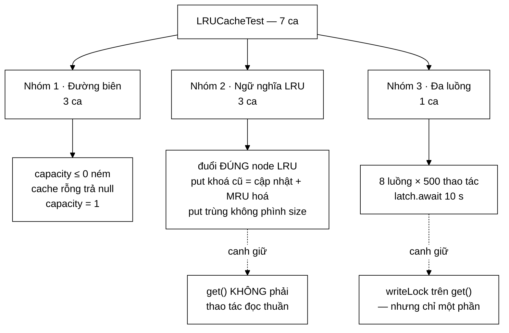

# LRUCacheTest — bộ test DUY NHẤT trong gói có ca đa luồng, và ca đó kiểm ít hơn vẻ ngoài rất nhiều

**File nguồn:** `search-engine/src/test/java/com/vnsearch/datastructure/LRUCacheTest.java` (99 dòng)
**Gói:** `com.vnsearch.datastructure` · **Khung:** JUnit 5 · **Số ca:** 7 · **Thời gian chạy:** ~0,03 s
**Lớp được kiểm:** [`LRUCache.md`](../../../../../main/java/com/vnsearch/datastructure/LRUCache.md)
**Đọc kèm:** [`TrieTest.md`](./TrieTest.md) · [`BloomFilterTest.md`](./BloomFilterTest.md) · [`../service/SearchEngineFacadeApiTest.md`](../service/SearchEngineFacadeApiTest.md)

---

## 📌 Hiểu trong 30 giây

Bảy ca. Sáu ca đầu là bộ test LRU sách giáo khoa, viết gọn và đúng. Ca thứ bảy
là thứ khiến file này đáng đọc: **`concurrentAccessDoesNotCorruptState` là ca
đa luồng duy nhất trong toàn bộ gói `com.vnsearch.datastructure`.**

```
   SỰ BẤT ĐỐI XỨNG TRONG GÓI

   Lớp          Có khoá?                    Có ca đa luồng?
   ────────────────────────────────────────────────────────────
   LRUCache     ReentrantReadWriteLock      CÓ  ← file này
   Trie         ReentrantReadWriteLock      KHÔNG
   BloomFilter  không (cố ý)                KHÔNG
   MinHeap      không (cố ý)                KHÔNG
   SyllableTrie không (chỉ đọc sau nạp)     KHÔNG
   SparseMatrix không (freeze rồi chỉ đọc)  KHÔNG

   ⇒ Trie có đúng cùng cơ chế khoá và có kịch bản tranh chấp
     CỤ THỂ HƠN (facade ghi, /api/suggest đọc) — mà không có ca nào.
     Xem TrieTest.md mục 9.
```

Nhưng bản thân ca đa luồng ở đây lại có ba lỗ hổng nghiêm trọng, và mục 3 của
tài liệu này dành để mổ xẻ chúng.



---

## 1. Bố cục: 7 ca chia ba nhóm

```
   ┌─ NHÓM 1 · ĐƯỜNG BIÊN ────────────────────────────────────┐
   │  constructorRejectsNonPositiveCapacity                    │
   │  getOnEmptyCacheReturnsNull                               │
   │  singleEntryPutAndGet                       (capacity = 1)│
   └───────────────────────────────────────────────────────────┘
   ┌─ NHÓM 2 · NGỮ NGHĨA LRU (lõi của lớp) ───────────────────┐
   │  evictsLeastRecentlyUsedWhenOverCapacity    ← quan trọng  │
   │  puttingExistingKeyUpdatesValueAndRecency   ← quan trọng  │
   │  duplicatePutsDoNotGrowSize                               │
   └───────────────────────────────────────────────────────────┘
   ┌─ NHÓM 4 · ĐA LUỒNG ──────────────────────────────────────┐
   │  concurrentAccessDoesNotCorruptState        ← duy nhất    │
   └───────────────────────────────────────────────────────────┘
```

Ba ca ở nhóm 2 chở gần hết ý nghĩa. Chúng canh giữ một quyết định thiết kế duy
nhất nhưng phản trực giác, được Javadoc của lớp nêu rõ:

> `get()` về bản chất **KHÔNG** phải thao tác đọc thuần tuý vì nó di chuyển node
> lên đầu danh sách (cập nhật recency), nên phải dùng write lock giống như
> `put()`.

---

## 2. Nhóm 2 — ba ca canh giữ "`get` cũng là ghi"

### 2.1 `evictsLeastRecentlyUsedWhenOverCapacity` — ca gốc

```java
@Test
void evictsLeastRecentlyUsedWhenOverCapacity() {
    LRUCache<Integer, String> cache = new LRUCache<>(2);
    cache.put(1, "one");
    cache.put(2, "two");
    cache.get(1); // 1 tro thanh MRU, 2 la LRU
    cache.put(3, "three"); // day 2 ra vi la LRU

    assertNull(cache.get(2));
    assertEquals("one", cache.get(1));
    assertEquals("three", cache.get(3));
}
```

Dòng `cache.get(1)` ở giữa là **toàn bộ ca test**. Bỏ nó đi thì ca này chỉ còn
kiểm "đuổi phần tử chèn sớm nhất" — tức là FIFO, không phải LRU.

```
   TRẠNG THÁI DANH SÁCH LIÊN KẾT QUA TỪNG BƯỚC
   (head là MRU, tail là LRU)

   put(1,"one")     head ⇄ [1] ⇄ tail
   put(2,"two")     head ⇄ [2] ⇄ [1] ⇄ tail
                                  ↑ LRU
   get(1)           head ⇄ [1] ⇄ [2] ⇄ tail      ← ĐỌC mà làm ĐỔI thứ tự
                                  ↑ LRU
   put(3,"three")   map.size()=3 > 2 → đuổi tail.prev = node 2
                    head ⇄ [3] ⇄ [1] ⇄ tail

   ┌────────────────────────────────────────────────────────┐
   │ NẾU get() KHÔNG MRU-HOÁ (tức cài đặt FIFO)             │
   │                                                        │
   │   put(3) sẽ đuổi node 1 thay vì node 2.                │
   │   assertNull(cache.get(2))     → ĐỎ, trả "two"         │
   │   assertEquals("one", get(1))  → ĐỎ, trả null          │
   │                                                        │
   │ Hai phép khẳng định đầu là hai NỬA của cùng một điều:  │
   │ "đuổi đúng node NÀY" và "giữ đúng node KIA".           │
   └────────────────────────────────────────────────────────┘
```

`capacity = 2` là con số nhỏ nhất còn có ý nghĩa: cần ít nhất hai phần tử thì
mới có khái niệm "cái nào gần đây hơn". Với `capacity = 1` (ca
`singleEntryPutAndGet`) mọi cách cài đặt đuổi đều cho cùng kết quả.

Phép khẳng định thứ ba `assertEquals("three", cache.get(3))` chặn một cách hỏng
riêng: `put` đuổi node LRU **rồi quên chèn node mới**, hoặc chèn vào `map` mà
quên `addToFront`.

### 2.2 `puttingExistingKeyUpdatesValueAndRecency` — hai việc trong một lời gọi

```java
cache.put("a", 1);
cache.put("b", 2);
cache.put("a", 100); // cap nhat gia tri, "a" thanh MRU
cache.put("c", 3);   // day "b" ra (LRU)

assertEquals(100, cache.get("a"));
assertNull(cache.get("b"));
assertEquals(3, cache.get("c"));
```

`put` trên khoá đã tồn tại phải làm **hai** việc, và bộ test tách chúng ra bằng
hai phép khẳng định riêng:

| Phép khẳng định | Kiểm việc gì | Cài đặt sai tương ứng |
|---|---|---|
| `assertEquals(100, get("a"))` | Cập nhật **giá trị** | Nhánh `existing != null` `return` sớm mà quên `existing.value = value` — cache trả giá trị cũ mãi mãi |
| `assertNull(get("b"))` | Cập nhật **recency** | Nhánh `existing != null` gán giá trị nhưng quên `moveToFront` — "a" vẫn là LRU nên bị đuổi thay "b" |

```
   VÌ SAO PHẢI TÁCH — HAI LỖI HỎNG ĐỘC LẬP NHAU

   Quên   existing.value = value   → chỉ phép 1 đỏ
   Quên   moveToFront(existing)    → chỉ phép 2 đỏ

   Ghép chung thành một phép khẳng định thì chỉ bắt được một nửa.

   TRIỆU CHỨNG THẬT của lỗi thứ nhất trong SearchEngineFacade:
   người dùng tìm lại đúng truy vấn cũ SAU khi reindex và nhận
   kết quả của corpus CŨ — không bao giờ thấy dữ liệu mới cho
   tới khi khoá đó bị đuổi khỏi cache.
```

Chi tiết cài đặt đáng biết: nhánh cập nhật trong `put` **`return` ngay sau
`moveToFront`**, không đi xuống phần kiểm `map.size() > capacity`. Đúng, vì
không có node mới nào được thêm nên kích thước không đổi. Ca
`duplicatePutsDoNotGrowSize` là ca canh giữ chính xác điều đó.

### 2.3 `duplicatePutsDoNotGrowSize` — chặn rò rỉ node

```java
LRUCache<String, Integer> cache = new LRUCache<>(5);
cache.put("x", 1);
cache.put("x", 2);
cache.put("x", 3);
assertEquals(1, cache.size());
assertEquals(3, cache.get("x"));
```

```
   CÁCH HỎNG MÀ CA NÀY BẮT

   Nếu put bỏ hẳn nhánh kiểm `existing != null` và luôn tạo Node mới:

     map.put("x", nodeMoi)   ← map ghi đè, size vẫn = 1  ✓ (map ổn)
     addToFront(nodeMoi)     ← danh sách giờ có BA node "x"

     head ⇄ [x=3] ⇄ [x=2] ⇄ [x=1] ⇄ tail
              ↑ trong map    ↑ MỒ CÔI  ↑ MỒ CÔI

   map.size() = 1 nên assertEquals(1, cache.size()) VẪN XANH.
   Nhưng danh sách phình ra vô hạn — rò rỉ bộ nhớ thật sự.
   Và khi cache đầy, put sẽ đuổi tail.prev = node mồ côi, rồi
   map.remove("x") — XOÁ NHẦM khoá đang còn dùng.
```

Đây là điểm yếu đầu tiên và cũng dễ nhất của bộ test: **`size()` chỉ đọc
`map.size()`, không bao giờ chạm vào danh sách liên kết.** Nên không ca nào
trong file này thật sự đo được độ dài danh sách. Ca trên xanh nhờ phép
`assertEquals(3, cache.get("x"))` chứ không nhờ `size()`. Điểm yếu này quay lại
ở mục 3 với hậu quả nặng hơn nhiều.

---

## 3. `concurrentAccessDoesNotCorruptState` — ca đa luồng duy nhất của gói

```java
@Test
void concurrentAccessDoesNotCorruptState() throws InterruptedException {
    LRUCache<Integer, Integer> cache = new LRUCache<>(50);
    int threadCount = 8;
    int opsPerThread = 500;
    ExecutorService pool = Executors.newFixedThreadPool(threadCount);
    CountDownLatch latch = new CountDownLatch(threadCount);

    for (int t = 0; t < threadCount; t++) {
        final int threadId = t;
        pool.submit(() -> {
            try {
                for (int i = 0; i < opsPerThread; i++) {
                    int key = (threadId * opsPerThread + i) % 20;
                    cache.put(key, key * 10);
                    cache.get(key);
                }
            } finally {
                latch.countDown();
            }
        });
    }

    assertEquals(true, latch.await(10, TimeUnit.SECONDS));
    pool.shutdown();

    // Neu cau truc bi hong (vong lap, mat lien ket...), size() se khong hop le.
    assertEquals(true, cache.size() <= 50 && cache.size() >= 0);
}
```

### 3.1 Phần làm đúng: `latch.await` là phép khẳng định thật

```
   TRIỆU CHỨNG CỦA HỎNG CẤU TRÚC ĐỒNG THỜI LÀ **TREO**, KHÔNG PHẢI NGOẠI LỆ

   Danh sách liên kết đôi bị hai luồng sửa cùng lúc có thể tạo ra
   một CHU TRÌNH:

        [A] ⇄ [B]
         ↑     ↓
         └─────┘        node.next.prev = node.prev  chạy so le

   Vòng lặp nào đi theo next/prev sẽ chạy mãi. Luồng không chết,
   không ném gì, chỉ quay vòng và ăn hết một lõi CPU.

   ⇒ try/catch KHÔNG bắt được.
   ⇒ latch.await(10, SECONDS) trả về false → assert ĐỎ.

   Đây là phép khẳng định ĐÚNG cho loại lỗi này, và là điểm
   mạnh nhất của ca test.
```

`latch.countDown()` nằm trong khối `finally` — cũng đúng. Nếu luồng ném ngoại
lệ, `Future` của `pool.submit` nuốt nó, nhưng latch vẫn được đếm xuống nên ca
test không treo 10 giây rồi mới đỏ vì lý do sai. Đổi lại, ngoại lệ trong luồng
con **biến mất hoàn toàn** — xem mục 3.3.

### 3.2 Lỗ hổng thứ nhất: phép khẳng định cuối gần như không kiểm gì

```java
// Neu cau truc bi hong (vong lap, mat lien ket...), size() se khong hop le.
assertEquals(true, cache.size() <= 50 && cache.size() >= 0);
```

Chú thích nói `size()` sẽ phát hiện danh sách bị hỏng. Điều đó **không đúng**:

```java
public int size() {
    lock.readLock().lock();
    try {
        return map.size();          // ← CHỈ ĐỌC HashMap
    } finally {
        lock.readLock().unlock();
    }
}
```

```
   size() KHÔNG BAO GIỜ CHẠM VÀO DANH SÁCH LIÊN KẾT

   Danh sách có thể đang là một mớ hỗn độn — chu trình, node mồ côi,
   con trỏ prev trỏ vào hư không — mà map.size() vẫn trả về một số
   nguyên rất hợp lệ.

   Còn phân tích riêng hai vế:

     size() >= 0     map.size() của HashMap KHÔNG THỂ âm.
                     Vế này đúng vô điều kiện. Nó không kiểm gì.

     size() <= 50    Chỉ đỏ nếu map phình vượt capacity.
                     Xem mục 3.3: kịch bản test không bao giờ
                     tới gần 50 nên vế này cũng không kiểm gì.

   ⇒ Phép khẳng định cuối cùng của ca đa luồng DUY NHẤT trong gói
     là một hằng đúng.
```

Ca test vẫn có giá trị — nhưng giá trị đó đến **hoàn toàn** từ `latch.await`,
không phải từ dòng cuối. Nếu bỏ dòng cuối đi, khả năng phát hiện lỗi của ca
test không thay đổi.

### 3.3 Lỗ hổng thứ hai: đường nguy hiểm nhất không bao giờ được chạy

```
   int key = (threadId * opsPerThread + i) % 20;

   threadId ∈ [0..7], i ∈ [0..499]  →  key ∈ [0..19]

   ⇒ TOÀN BỘ ca test chỉ dùng 20 khoá phân biệt.
   ⇒ map.size() không bao giờ vượt 20.
   ⇒ capacity = 50 KHÔNG BAO GIỜ BỊ CHẠM TỚI.
   ⇒ Nhánh đuổi node trong put() KHÔNG BAO GIỜ CHẠY.

       if (map.size() > capacity) {     ← điều kiện luôn FALSE
           Node lru = tail.prev;
           removeNode(lru);              ← ba dòng này chưa từng
           map.remove(lru.key);          ← chạy trong ca đa luồng
       }
```

Đây là lỗ hổng nặng nhất, vì **nhánh đuổi chính là nhánh phức tạp nhất và
tranh chấp nhất của cả lớp**: nó sửa `tail.prev`, sửa hai con trỏ của node bị
xoá, rồi sửa `map` — bốn thay đổi phải nguyên tử với nhau. Mọi ca đa luồng đáng
viết đều phải nhắm vào đúng nhánh này.

Sửa rất rẻ:

```java
int key = (threadId * opsPerThread + i) % 200;   // 200 khoá, capacity 50
```

Với 200 khoá phân biệt trên cache 50 chỗ, nhánh đuổi chạy ở gần như mọi lời
gọi `put`, và cả `size() <= 50` cũng trở thành một phép khẳng định có ý nghĩa —
nó bắt được lỗi `map.remove(lru.key)` thất bại làm map phình vượt sức chứa.

### 3.4 Lỗ hổng thứ ba: ngoại lệ trong luồng con bị nuốt

`pool.submit(Runnable)` trả về một `Future`. Ngoại lệ ném ra trong `Runnable`
được **giữ lại trong `Future`** thay vì in ra hay làm hỏng gì. Ca test không
giữ tham chiếu tới các `Future`, nên:

```
   NẾU MỘT LUỒNG NÉM NullPointerException Ở LẦN LẶP THỨ 3

   1. finally { latch.countDown(); }   vẫn chạy
   2. latch về 0 đúng hạn              → assertEquals(true, await) XANH
   3. cache.size() vẫn hợp lệ          → phép cuối XANH

   ⇒ CA TEST XANH, dù 7/8 luồng đã chết ngay từ đầu.

   Không có dòng nào trong ca test biết chuyện đó xảy ra.
```

Cách sửa chuẩn — gom `Future` lại rồi `get()` từng cái, vì `Future.get()` ném
lại ngoại lệ gốc bọc trong `ExecutionException`:

```java
List<Future<?>> futures = new ArrayList<>();
for (int t = 0; t < threadCount; t++) { ... futures.add(pool.submit(...)); }
assertTrue(latch.await(10, TimeUnit.SECONDS), "Có luồng bị TREO");
for (Future<?> f : futures) {
    assertDoesNotThrow(() -> f.get(), "Một luồng đã ném ngoại lệ");
}
```

### 3.5 Ba chi tiết nhỏ hơn

```
   ✗ assertEquals(true, x)  thay vì  assertTrue(x)
     Khi đỏ, JUnit in "expected: <true> but was: <false>" — vô nghĩa.
     assertTrue(x, "thông điệp") cho thông tin thật.
     Cả HAI phép khẳng định của ca này đều viết theo kiểu này.

   ✗ pool.shutdown() không đi kèm awaitTermination.
     shutdown() chỉ YÊU CẦU dừng, không chờ. Nếu ca test đỏ ở
     dòng await, shutdown() thậm chí không chạy — các luồng
     tiếp tục sống và có thể làm nhiễu ca test SAU trong cùng JVM.
     Đặt nó trong @AfterEach hoặc dùng try/finally thì sạch hơn.

   ✗ Không phép khẳng định nào kiểm GIÁ TRỊ sau khi chạy xong.
     Bất biến "value == key * 10" đúng cho mọi khoá, mọi luồng —
     một phép kiểm rẻ tiền mà bắt được lỗi trộn giá trị giữa các node:

         for (int k = 0; k < 20; k++) {
             Integer v = cache.get(k);
             if (v != null) assertEquals(k * 10, v, "Node " + k + " mang giá trị của khoá khác");
         }
```

### 3.6 Vì sao lớp này có ca đa luồng còn `Trie` thì không

Không có lý do kỹ thuật nào. Hai lớp dùng **cùng một** cơ chế
(`ReentrantReadWriteLock`), và `Trie` còn có kịch bản tranh chấp cụ thể hơn:
Javadoc của nó chỉ đích danh `SearchEngineFacade.search()` ghi trong khi
`/api/suggest` đọc.

```
   BẤT ĐỐI XỨNG NÀY ĐÁNG GHI NHẬN VÌ MỘT LÝ DO THỰC TẾ

   Toàn bộ ReentrantReadWriteLock của Trie hiện KHÔNG có gì
   chứng minh là hoạt động. Ai đó xoá hết các khối lock/unlock
   trong Trie.java thì 12 ca của TrieTest vẫn xanh hết.

   Còn ở LRUCache, xoá writeLock trong get() thì
   concurrentAccessDoesNotCorruptState CÓ CƠ HỘI đỏ — dù chỉ là
   cơ hội, vì lỗi tương tranh không tất định.

   Ca đa luồng đề xuất cho Trie nằm ở TrieTest.md mục 9, và nó
   được viết theo đúng khuôn của ca này — kể cả phép khẳng định
   trên latch.await.
```

---

## 4. Nhóm 1 — ba đường biên

| Ca | Bắt lỗi gì |
|---|---|
| `constructorRejectsNonPositiveCapacity` | `capacity = 0` tạo ra cache đuổi node **vừa mới chèn** ở mỗi `put` — cache luôn rỗng, tỷ lệ trúng 0 %, không lỗi nào trong log |
| `getOnEmptyCacheReturnsNull` | `map.get` trả `null` → `moveToFront(null)` ném `NullPointerException` nếu quên kiểm |
| `singleEntryPutAndGet` | `capacity = 1`: `addToFront` rồi `removeNode` ngay trên cùng một node, đúng chỗ dễ sai nhất của danh sách liên kết |

`singleEntryPutAndGet` đáng chú ý hơn vẻ ngoài. Với `capacity = 1`, mọi `put`
mới đều đi qua trọn vẹn nhánh đuổi, và node bị đuổi là node **duy nhất** trong
danh sách. Đó chính là trường hợp mà hai node lính canh sinh ra để xử lý:

```
   KHÔNG CÓ LÍNH CANH, XOÁ NODE DUY NHẤT PHẢI VIẾT:

     if (node.prev == null && node.next == null) { head = tail = null; }
     else if (node.prev == null)                 { head = node.next; head.prev = null; }
     else if (node.next == null)                 { tail = node.prev; tail.next = null; }
     else                                        { ... }

   CÓ LÍNH CANH:

     node.prev.next = node.next;
     node.next.prev = node.prev;

   Hai dòng, không nhánh nào. Vì head và tail luôn tồn tại nên
   node.prev và node.next KHÔNG BAO GIỜ null.

   ⇒ Ca capacity = 1 là ca kiểm cái được lợi đó.
```

Ca `constructorRejectsNonPositiveCapacity` chỉ kiểm `capacity = 0`, không kiểm
số âm. Cùng một nhánh `capacity <= 0` nên không phải khoảng trống thật, nhưng
thêm một dòng `new LRUCache<>(-1)` thì rõ ý hơn.

---

## 5. Kỹ thuật đáng học lại từ bộ test này

```
   ① MỘT LỜI GỌI ĐỌC NẰM GIỮA HAI LỜI GỌI GHI
      put(1) · put(2) · get(1) · put(3)
      Dòng get(1) ở giữa là thứ phân biệt LRU với FIFO.
      Bỏ nó ra thì ca test vẫn xanh với cài đặt SAI.

   ② MỘT LỜI GỌI LÀM HAI VIỆC ⇒ HAI PHÉP KHẲNG ĐỊNH
      put(khoá cũ) = cập nhật giá trị + MRU hoá.
      Hai lỗi độc lập, hai phép khẳng định riêng.

   ③ latch.await CHÍNH LÀ PHÉP KHẲNG ĐỊNH
      Hỏng cấu trúc đồng thời biểu hiện bằng TREO, không phải ngoại lệ.
      Chỉ có phép chờ có hạn mới bắt được.

   ④ countDown() TRONG finally
      Luồng chết vì ngoại lệ vẫn phải đếm xuống, nếu không ca test
      treo đủ 10 giây rồi mới đỏ — và đỏ vì lý do sai.

   ⑤ CHỌN capacity NHỎ NHẤT CÒN CÓ Ý NGHĨA
      capacity = 2 cho ca đuổi (cần ≥ 2 để có khái niệm "gần đây hơn")
      capacity = 1 cho ca lính canh (ép nhánh xoá node duy nhất)

   ⑥ (PHẢN VÍ DỤ) ĐỪNG VIẾT assertEquals(true, dieuKien)
      Thông điệp lỗi thành "expected <true> but was <false>".
      assertTrue(dieuKien, "mô tả") tốn đúng một chuỗi mà cho
      thông tin thật lúc 3 giờ sáng.

   ⑦ (PHẢN VÍ DỤ) ĐỪNG ĐỂ CHÚ THÍCH HỨA THỨ MÃ KHÔNG LÀM
      "Neu cau truc bi hong... size() se khong hop le"
      size() chỉ đọc map. Chú thích sai còn nguy hơn không có,
      vì nó ngăn người sau viết ca test thật.
```

---

## 6. Hướng dẫn thực hành

### 6.1 Chạy

```powershell
cd search-engine

# Cả 7 ca
.\mvnw.cmd test "-Dtest=LRUCacheTest"

# Riêng ca đa luồng
.\mvnw.cmd test "-Dtest=LRUCacheTest#concurrentAccessDoesNotCorruptState"

# Cả gói datastructure (61 ca)
.\mvnw.cmd test "-Dtest=com.vnsearch.datastructure.*Test"
```

Trên PowerShell **phải bọc `-Dtest=...` trong nháy kép**, nếu không dấu `=` bị
nuốt và Maven chạy toàn bộ bộ test.

Ca đa luồng nên chạy lặp nhiều lần — lỗi tương tranh không tất định, xanh một
lần không chứng minh được gì:

```powershell
for ($i = 1; $i -le 20; $i++) {
    .\mvnw.cmd -q test "-Dtest=LRUCacheTest#concurrentAccessDoesNotCorruptState"
    if ($LASTEXITCODE -ne 0) { Write-Host "ĐỎ ở lần chạy $i"; break }
}
```

### 6.2 Đọc kết quả

```
[INFO] Running com.vnsearch.datastructure.LRUCacheTest
[INFO] Tests run: 7, Failures: 0, Errors: 0, Skipped: 0, Time elapsed: 0.028 s
```

0,028 giây cho 8 luồng × 500 thao tác = 4.000 cặp put/get. Con số này tự nó nói
một điều: **mức tranh chấp trong ca test rất thấp**. Với 20 khoá và thân khoá
chỉ vài chục nano giây, phần lớn thời gian các luồng không thật sự chạm nhau.
Muốn ép tranh chấp thật thì phải tăng số thao tác lên một hai bậc, không phải
tăng số luồng.

Báo cáo chi tiết: `search-engine/target/surefire-reports/com.vnsearch.datastructure.LRUCacheTest.txt`

### 6.3 Tự kiểm chứng — cố tình làm hỏng để xem ca nào đỏ

| Sửa gì trong `LRUCache.java` | Ca dự kiến đỏ |
|---|---|
| `get`: bỏ `moveToFront(node)` | `evictsLeastRecentlyUsedWhenOverCapacity` (cache thành FIFO) |
| `put`, nhánh khoá cũ: bỏ `existing.value = value` | `puttingExistingKeyUpdatesValueAndRecency` (phép **thứ nhất**) và `duplicatePutsDoNotGrowSize` |
| `put`, nhánh khoá cũ: bỏ `moveToFront(existing)` | `puttingExistingKeyUpdatesValueAndRecency` (phép **thứ hai**) |
| `put`: bỏ hẳn nhánh `existing != null` | `duplicatePutsDoNotGrowSize` (qua `get`, **không** qua `size()`) |
| `put`: đuổi `head.next` thay vì `tail.prev` | `evictsLeastRecentlyUsedWhenOverCapacity` — đuổi đúng node vừa chèn |
| `put`: đổi `map.size() > capacity` thành `>=` | `singleEntryPutAndGet` (capacity 1 đuổi ngay node vừa chèn) |
| Constructor: bỏ phép kiểm `capacity <= 0` | `constructorRejectsNonPositiveCapacity` |
| `get`: bỏ kiểm `node == null` | `getOnEmptyCacheReturnsNull` với `NullPointerException` |
| Constructor: bỏ hai node lính canh, để `head = tail = null` | `singleEntryPutAndGet` với `NullPointerException` |
| **`get`: đổi `writeLock` thành `readLock`** | **thường KHÔNG ca nào đỏ** — xem bên dưới |
| **Bỏ toàn bộ khoá trong `get` và `put`** | **thường KHÔNG ca nào đỏ** — xem bên dưới |

Hai dòng cuối in đậm là kết quả đáng lo nhất của bài tập này. Với 20 khoá,
cache 50 chỗ và 500 thao tác mỗi luồng, cửa sổ tranh chấp hẹp tới mức ca test
xanh gần như mọi lần dù khoá đã bị gỡ bỏ. Đổi một dòng:

```java
int key = (threadId * opsPerThread + i) % 200;   // thay vì % 20
```

thì nhánh đuổi chạy liên tục, `tail.prev` bị nhiều luồng giành, và ca test bắt
đầu bắt được — vẫn không phải mọi lần, nhưng đủ để có tác dụng. Đây là bài học
chung cho mọi ca test đa luồng: **cửa sổ tranh chấp phải được thiết kế, không
tự có.**

### 6.4 Cạm bẫy khi viết thêm ca cho lớp này

```
   ✗ Đừng dùng size() để kết luận danh sách liên kết còn nguyên vẹn.
     size() chỉ đọc map.size(). Muốn kiểm danh sách thì phải có
     một hàm duyệt từ head tới tail (lớp hiện KHÔNG có), hoặc suy
     gián tiếp qua thứ tự đuổi.

   ✗ Đừng viết ca đa luồng mà tổng số khoá phân biệt ≤ capacity.
     Nhánh đuổi — nhánh nguy hiểm nhất — sẽ không bao giờ chạy.

   ✗ Đừng khẳng định thứ tự đuổi trong ca đa luồng.
     Với nhiều luồng, "cái nào là LRU" phụ thuộc thứ tự giao nhau
     của các luồng, không tất định. Chỉ được khẳng định BẤT BIẾN:
     size ≤ capacity, value == key*10, không luồng nào treo.

   ✗ Đừng bỏ qua Future trả về từ pool.submit().
     Ngoại lệ trong luồng con biến mất hoàn toàn, ca test vẫn xanh.

   ✗ Đừng dùng Thread.sleep để "đồng bộ" các luồng.
     Nó làm ca test chậm và vẫn không tất định. CountDownLatch
     (như ca hiện tại) hoặc CyclicBarrier mới là công cụ đúng.

   ✗ Đừng cho rằng ca đa luồng xanh nghĩa là lớp đúng.
     Nó chỉ nghĩa là lần chạy này không rơi vào cửa sổ tranh chấp.
     Chạy 20 lần trước khi tin.
```

---

## 7. Bảng tổng hợp 7 ca

| # | Ca test | Nhóm | Tính chất được canh giữ |
|---|---|---|---|
| 1 | `constructorRejectsNonPositiveCapacity` | 1 | `capacity ≤ 0` — cache luôn rỗng, hỏng **lặng lẽ** |
| 2 | `getOnEmptyCacheReturnsNull` | 1 | `moveToFront(null)` không được ném NPE |
| 3 | `singleEntryPutAndGet` | 1 | `capacity = 1` — ép nhánh xoá node **duy nhất**, chỗ hai node lính canh phát huy tác dụng |
| 4 | **`evictsLeastRecentlyUsedWhenOverCapacity`** | 2 | **LRU chứ không phải FIFO — `get()` phải MRU hoá** |
| 5 | **`puttingExistingKeyUpdatesValueAndRecency`** | 2 | **`put` khoá cũ làm HAI việc, hai phép khẳng định tách rời** |
| 6 | `duplicatePutsDoNotGrowSize` | 2 | Không tạo node mồ côi trong danh sách |
| 7 | **`concurrentAccessDoesNotCorruptState`** | 3 | **Không luồng nào treo — ca đa luồng duy nhất của gói** |

---

## 8. Khoảng trống chưa phủ

```
   ✗ NHÁNH ĐUỔI KHÔNG BAO GIỜ CHẠY TRONG CA ĐA LUỒNG.
     20 khoá phân biệt trên cache 50 chỗ. Ba dòng nguy hiểm nhất
     của lớp (removeNode + map.remove + sửa tail.prev) chưa bao
     giờ được nhiều luồng chạm cùng lúc. Sửa: đổi % 20 thành % 200.

   ✗ PHÉP KHẲNG ĐỊNH CUỐI CỦA CA ĐA LUỒNG LÀ HẰNG ĐÚNG.
     size() >= 0 luôn đúng; size() <= 50 không thể sai với 20 khoá.

   ✗ NGOẠI LỆ TRONG LUỒNG CON BỊ NUỐT.
     Không giữ Future nào. 7/8 luồng chết vẫn cho ca test xanh.

   ✗ containsKey() — phương thức công khai, KHÔNG ca nào gọi.
     Đây là khoảng trống rõ ràng nhất: một phương thức của API
     công khai hoàn toàn không được kiểm. Nó cũng là phương thức
     duy nhất (cùng size()) dùng readLock, nên không ca nào kiểm
     đường readLock cả.

   ✗ GIÁ TRỊ null.
     put(k, null) rồi get(k) trả về null — không phân biệt được
     với "không có khoá k". Ngữ nghĩa này không được định nghĩa
     ở đâu và không ca nào kiểm.

   ✗ KHOÁ null.
     HashMap chấp nhận khoá null, nên put(null, v) chạy được.
     Không ca nào ghi lại quyết định đó.

   ✗ CACHE ĐẦY RỒI get MỘT KHOÁ ĐÃ BỊ ĐUỔI, RỒI put LẠI.
     Chu trình đuổi → chèn lại của cùng một khoá là kịch bản
     thường gặp nhất trong SearchEngineFacade, chưa có ca nào.
```

Ca đáng viết trước nhất — vá cùng lúc ba khoảng trống đầu, và chỉ khác ca hiện
tại ở bốn dòng:

```java
@Test
void nhieuLuongCungDayNodeRaKhongLamHongCache() throws Exception {
    LRUCache<Integer, Integer> cache = new LRUCache<>(50);
    int threadCount = 8, opsPerThread = 5_000;
    ExecutorService pool = Executors.newFixedThreadPool(threadCount);
    CountDownLatch latch = new CountDownLatch(threadCount);
    List<Future<?>> futures = new ArrayList<>();

    for (int t = 0; t < threadCount; t++) {
        final int threadId = t;
        futures.add(pool.submit(() -> {
            try {
                for (int i = 0; i < opsPerThread; i++) {
                    int key = (threadId * opsPerThread + i) % 200; // 200 > capacity 50
                    cache.put(key, key * 10);                      // ⇒ nhánh đuổi CHẠY
                    cache.get(key);
                }
            } finally {
                latch.countDown();
            }
        }));
    }

    assertTrue(latch.await(30, TimeUnit.SECONDS), "Có luồng bị TREO — dấu hiệu danh sách bị chu trình");
    for (Future<?> f : futures) {
        assertDoesNotThrow(() -> f.get(), "Một luồng đã ném ngoại lệ");
    }
    pool.shutdown();

    assertTrue(cache.size() <= 50, "map phình vượt capacity: " + cache.size());
    for (int k = 0; k < 200; k++) {
        Integer v = cache.get(k);
        if (v != null) {
            assertEquals(k * 10, v, "Node " + k + " mang giá trị của khoá khác");
        }
    }
}
```

Bốn thay đổi, bốn mục đích riêng: `% 200` ép nhánh đuổi chạy; `opsPerThread`
tăng gấp mười để mở rộng cửa sổ tranh chấp; danh sách `Future` để ngoại lệ
không biến mất; vòng kiểm `value == key * 10` để bắt lỗi trộn giá trị mà
`size()` không bao giờ thấy.

---

## 9. Liên kết

- Lớp được kiểm, kèm giải thích vì sao `get()` phải dùng `writeLock` và vì sao danh sách phải là liên kết **đôi**: [`LRUCache.md`](../../../../../main/java/com/vnsearch/datastructure/LRUCache.md)
- Lớp có **cùng** cơ chế khoá nhưng **không** có ca đa luồng — mục 9 của file đó đề xuất một ca viết theo đúng khuôn của mục 8 ở đây: [`TrieTest.md`](./TrieTest.md)
- Lớp cố ý **không** khoá, và đã gây một lỗi tương tranh thật vì điều đó: [`BloomFilterTest.md`](./BloomFilterTest.md)
- Nơi `LRUCache` được dùng thật — cache kết quả tìm kiếm, và là nơi lỗi "trả kết quả của corpus cũ" sẽ biểu hiện: [`../service/SearchEngineFacadeApiTest.md`](../service/SearchEngineFacadeApiTest.md)
- Lớp gọi, để hiểu vì sao trường `searchCache` phải là `volatile` và được **thay mới** chứ không xoá khi reindex: [`../../../../../main/java/com/vnsearch/service/SearchEngineFacade.md`](../../../../../main/java/com/vnsearch/service/SearchEngineFacade.md)
