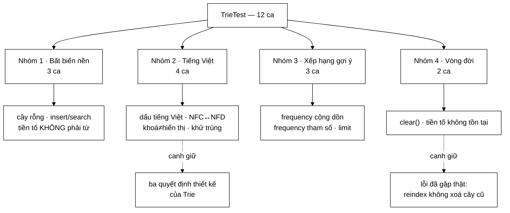

# TrieTest — mỗi đoạn Javadoc dài của `Trie` đều có một ca test mang đúng tên quyết định đó

**File nguồn:** `search-engine/src/test/java/com/vnsearch/datastructure/TrieTest.java` (144 dòng)
**Gói:** `com.vnsearch.datastructure` · **Khung:** JUnit 5 · **Số ca:** 12 · **Thời gian chạy:** ~0,03 s
**Lớp được kiểm:** [`Trie.md`](../../../../../main/java/com/vnsearch/datastructure/Trie.md)
**Đọc kèm:** [`LRUCacheTest.md`](./LRUCacheTest.md) · [`SyllableTrieTest.md`](./SyllableTrieTest.md) · [`MinHeapTest.md`](./MinHeapTest.md)

---

## 📌 Hiểu trong 30 giây

12 ca test cho cây tiền tố autocomplete. Điều đáng chú ý nhất **không phải** là
số ca, mà là **cách chúng được đặt tên**:

```
   BA QUYẾT ĐỊNH THIẾT KẾ LỚN NHẤT CỦA Trie
   ────────────────────────────────────────────────────────────
   ① khoá tra cứu ≠ chuỗi hiển thị   →  lookupKeyCanDifferFromDisplayString
   ② khử gợi ý trùng                 →  duplicateDisplayStringsAreMergedInSuggestions
   ③ chuẩn hoá Unicode NFC           →  nfcAndNfdInputsOfSameWordAreTreatedAsEqual

   ⇒ Tên ca test = tên quyết định. Đọc danh sách test là đọc được
     bản tóm tắt thiết kế, không cần mở mã nguồn.
```

Và một ca được viết vì **một lỗi đã xảy ra thật** — `clearRemovesAllWords` có
hẳn dòng chú thích ghi lại sự cố:

```
   "Bảo vệ chống lỗi đã gặp: rebuildSuggestTrie() chỉ insert thêm mà
    không xoá, khiến tiêu đề của corpus CŨ vẫn được gợi ý sau reindex."
```



---

## 1. Bố cục: 12 ca chia bốn nhóm

Bộ test không khai báo nhóm bằng `@Nested`, nhưng đọc theo thứ tự trong file thì
bốn nhóm hiện ra rất rõ:

```
   ┌─ NHÓM 1 · BẤT BIẾN NỀN CỦA MỌI TRIE ─────────────────────┐
   │  searchOnEmptyTrieReturnsFalse                            │
   │  insertAndSearchSingleWord                                │
   │  prefixOfAnInsertedWordIsNotItselfAWord      ← quan trọng │
   └───────────────────────────────────────────────────────────┘
   ┌─ NHÓM 2 · TIẾNG VIỆT (lý do lớp này tồn tại) ────────────┐
   │  vietnameseUnicodeDiacritics                              │
   │  nfcAndNfdInputsOfSameWordAreTreatedAsEqual  ← quyết định③│
   │  lookupKeyCanDifferFromDisplayString         ← quyết định①│
   │  duplicateDisplayStringsAreMergedInSuggestions ← q.định ② │
   └───────────────────────────────────────────────────────────┘
   ┌─ NHÓM 3 · XẾP HẠNG GỢI Ý ────────────────────────────────┐
   │  duplicateInsertsIncreaseFrequencyAndRankHigher           │
   │  frequencyArgumentDrivesRanking                           │
   │  getSuggestionsRespectsLimit                              │
   └───────────────────────────────────────────────────────────┘
   ┌─ NHÓM 4 · VÒNG ĐỜI VÀ ĐƯỜNG BIÊN ────────────────────────┐
   │  clearRemovesAllWords                        ← lỗi đã gặp │
   │  nonExistentPrefixReturnsEmptyList                        │
   └───────────────────────────────────────────────────────────┘
```

Thứ tự này đáng học lại: **bất biến nền trước, đặc thù nghiệp vụ sau, đường
biên cuối**. Người đọc lần đầu đi từ "Trie là gì" tới "Trie này khác Trie sách
giáo khoa ở chỗ nào" mà không phải nhảy cóc.

---

## 2. Nhóm 1 — ca quan trọng nhất là ca trông tầm thường nhất

```java
@Test
void prefixOfAnInsertedWordIsNotItselfAWord() {
    Trie trie = new Trie();
    trie.insert("hello");
    assertFalse(trie.search("hell"));
    assertTrue(trie.startsWith("hell"));
}
```

Ba dòng, và nó canh giữ **bản chất của cấu trúc dữ liệu**: sự khác nhau giữa
`search` và `startsWith`, tức là ý nghĩa của cờ `isEndOfWord`.

```
   VÌ SAO ĐÂY LÀ CA DỄ HỎNG NHẤT KHI AI ĐÓ SỬA Trie

   Chèn "hello" tạo ra chuỗi node:
       root → h → e → l → l → o
                             ↑
                        isEndOfWord = true
                        (CHỈ node cuối)

   Một cách cài đặt sai rất tự nhiên: đánh dấu isEndOfWord ở
   MỌI node trên đường đi (vì "node này đã được đi qua").

   Hậu quả: search("hell") trả về true.
   ⇒ Autocomplete gợi ý "hell", "hel", "he", "h" — mọi tiền tố
     của mọi từ trong từ điển đều thành một gợi ý.

   Ca test này bắt đúng lỗi đó, và KHÔNG có ca nào khác bắt được.
```

Hai ca còn lại trong nhóm là hàng rào rẻ tiền nhưng cần thiết:

| Ca | Bắt lỗi gì |
|---|---|
| `searchOnEmptyTrieReturnsFalse` | `findNode` trả `null` trên cây rỗng → `NullPointerException` nếu quên kiểm |
| `insertAndSearchSingleWord` | Đường đi cơ bản, kèm `assertFalse(search("javas"))` — đi quá độ dài từ đã chèn |

Chú ý chi tiết nhỏ ở `insertAndSearchSingleWord`: nó kiểm **cả hai chiều lệch**
— `"jav"` (ngắn hơn) và `"javas"` (dài hơn). Kiểm một chiều thôi thì một cài đặt
"khớp tiền tố là đủ" vẫn lọt.

---

## 3. Nhóm 2 — bốn ca chở toàn bộ phần "tiếng Việt" của lớp

Đây là nhóm đáng đọc nhất, vì nó không kiểm cấu trúc dữ liệu mà kiểm **các quyết
định sản phẩm**.

### 3.1 `lookupKeyCanDifferFromDisplayString` — quyết định ①

```java
@Test
void lookupKeyCanDifferFromDisplayString() {
    // Người Việt hay gõ không dấu, nhưng gợi ý hiện ra phải có dấu.
    Trie trie = new Trie();
    trie.insert("công nghệ", "công nghệ", 10);
    trie.insert("cong nghe", "công nghệ", 10);

    assertEquals(List.of("công nghệ"), trie.getSuggestions("công", 5),
            "Gõ có dấu phải ra gợi ý có dấu");
    assertEquals(List.of("công nghệ"), trie.getSuggestions("cong", 5),
            "Gõ KHÔNG dấu cũng phải ra gợi ý CÓ dấu");
}
```

```
   VẤN ĐỀ MÀ CA NÀY MÔ TẢ

   Trie khớp tiền tố theo TỪNG KÝ TỰ CHÍNH XÁC:
       'c' → 'ô' → 'n' → 'g'     ← nhánh "công nghệ"
       'c' → 'o' → ...            ← 'o' và 'ô' LÀ HAI KÝ TỰ KHÁC NHAU

   ⇒ Gõ "cong" không bao giờ đi tới được nhánh của "công nghệ".

   GIẢI PHÁP: chèn CÙNG MỘT MỤC HAI LẦN, hai khoá khác nhau,
   NHƯNG cả hai node đều nhớ CÙNG một chuỗi hiển thị có dấu.

       khoá "công nghệ" ─┐
                         ├→ display = "công nghệ"
       khoá "cong nghe" ─┘
```

Hai phép `assertEquals` ở đây là **hai nửa không thể tách**: kiểm mỗi chiều có
dấu thì một cài đặt bỏ hẳn khoá không dấu vẫn xanh; kiểm mỗi chiều không dấu thì
một cài đặt lỡ ghi đè `display` bằng chuỗi không dấu cũng vẫn xanh.

### 3.2 `duplicateDisplayStringsAreMergedInSuggestions` — quyết định ②, và là cái giá của ①

```java
@Test
void duplicateDisplayStringsAreMergedInSuggestions() {
    // Cùng một gợi ý được chèn 2 lần (khoá có dấu + khoá không dấu) nên
    // một tiền tố ngắn có thể chạm cả hai node; không được hiện trùng.
    Trie trie = new Trie();
    trie.insert("kinh tế", "kinh tế", 5);
    trie.insert("kinh te", "kinh tế", 5);

    List<String> suggestions = trie.getSuggestions("kin", 10);
    assertEquals(1, suggestions.size(), "Gợi ý bị lặp: " + suggestions);
    assertEquals("kinh tế", suggestions.get(0));
}
```

Đây là ví dụ đẹp về **một ca test sinh ra từ hậu quả của ca test trước**:

```
   TIỀN TỐ "kin" CHẠM CẢ HAI NHÁNH

   root → k → i → n ─┬─ h → ' ' → t → ế      (khoá có dấu)
                     └─ h → ' ' → t → e      (khoá không dấu)

   Cả hai node cuối đều mang display = "kinh tế"
   ⇒ DFS gom được HAI mục
   ⇒ Không khử trùng thì người dùng thấy:
         kinh tế
         kinh tế        ← trùng, trông như lỗi
```

Chi tiết đáng chú ý: thông điệp lỗi là `"Gợi ý bị lặp: " + suggestions` — **nối
luôn giá trị thật vào**. Khi ca này đỏ, người đọc thấy ngay danh sách bị lặp là
gì mà không phải chạy lại dưới trình gỡ lỗi. Đây là kỹ thuật nên áp dụng cho mọi
phép khẳng định trên tập hợp.

> **Vì sao gộp theo `display` chứ không theo khoá.** Hai node có khoá khác nhau
> (`"kinh tế"` vs `"kinh te"`) nhưng cùng `display`. Gộp theo khoá thì không gộp
> được gì cả. Chi tiết cách gộp — `Math::max` chứ không phải cộng dồn, và
> `LinkedHashMap` để thứ tự tất định — nằm ở
> [`Trie.md`](../../../../../main/java/com/vnsearch/datastructure/Trie.md) mục 1.1.

### 3.3 `nfcAndNfdInputsOfSameWordAreTreatedAsEqual` — quyết định ③

```java
@Test
void nfcAndNfdInputsOfSameWordAreTreatedAsEqual() {
    Trie trie = new Trie();
    String nfc = Normalizer.normalize("máy tính", Normalizer.Form.NFC);
    String nfd = Normalizer.normalize("máy tính", Normalizer.Form.NFD);

    trie.insert(nfd); // go bang to hop (dung/nfd)
    assertTrue(trie.search(nfc), "NFC va NFD cua cung 1 tu phai duoc coi la giong nhau");
}
```

Ca test này quan trọng hơn vẻ ngoài rất nhiều, vì lỗi mà nó bắt **không tái hiện
được trên máy phát triển thông thường**:

```
   HAI CÁCH MÃ HOÁ CÙNG MỘT CHỮ "á"

   NFC (dựng sẵn):   U+00E1                    → 1 char
   NFD (tổ hợp):     U+0061 U+0301  = 'a' + ́   → 2 char

   Nhìn trên màn hình: GIỐNG HỆT NHAU.
   "máy".equals("máy")  →  false

   AI SINH RA NFD:
     • macOS — hệ thống tệp và một số ô nhập trả về NFD
     • sao chép từ vài trang web / PDF
     • một số bộ gõ tiếng Việt

   ⇒ Lập trình viên dùng Windows gõ bằng Unikey sẽ KHÔNG BAO GIỜ
     gặp lỗi này. Người dùng macOS thì gặp ngay.
   ⇒ Đây chính là loại lỗi mà chỉ có test mới giữ được.
```

Cách viết ca này cũng đáng học: nó **không** viết chuỗi NFD bằng tay (thứ trông
giống hệt chuỗi NFC trong trình soạn thảo, và sẽ bị "sửa" nhầm trong lần định
dạng lại mã nguồn), mà dựng ra bằng `Normalizer.normalize(..., Form.NFD)`. Ý
định trở nên rõ ràng ngay trên mặt chữ.

### 3.4 `vietnameseUnicodeDiacritics` — hàng rào cơ bản

Ca đơn giản nhất nhóm: chèn `"máy tính"` và `"trình duyệt web"`, kiểm `search`
và `getSuggestions("máy", 5)`. Nó không kiểm quyết định thiết kế nào, mà kiểm
một thứ dễ vỡ ở tầng thấp hơn: cây có xử lý được ký tự ngoài ASCII không.

```
   VÌ SAO VẪN CẦN, DÙ TRÔNG THỪA

   Nếu Trie dùng mảng 26 phần tử thay vì HashMap<Character, TrieNode>
   — cách cài đặt phổ biến trong sách giáo khoa tiếng Anh —
   thì 'á' rơi ra ngoài chỉ số và cả lớp vô dụng với tiếng Việt.

   Ca này là ca ĐẦU TIÊN đỏ nếu ai đó "tối ưu" HashMap thành mảng.
```

---

## 4. Nhóm 3 — hai nguồn `frequency` khác nhau, hai ca khác nhau

Đây là chỗ dễ đọc lướt mà bỏ sót: `frequency` của một gợi ý đến từ **hai đường
hoàn toàn khác nhau**, và bộ test tách chúng ra thành hai ca.

| Ca | `frequency` đến từ đâu | Ngữ nghĩa |
|---|---|---|
| `duplicateInsertsIncreaseFrequencyAndRankHigher` | **cộng dồn** qua số lần `insert` | Truy vấn người dùng lặp lại |
| `frequencyArgumentDrivesRanking` | **tham số truyền thẳng** vào `insert(key, display, freq)` | Số liệu có sẵn từ corpus |

```java
// Đường 1 — cộng dồn
trie.insert("may tinh");
trie.insert("may tinh");
trie.insert("may tinh");   // frequency += 1 mỗi lần
trie.insert("may bay");
assertEquals(List.of("may tinh"), trie.getSuggestions("may", 1));

// Đường 2 — truyền thẳng
trie.insert("thể thao", "thể thao", 2);
trie.insert("thể dục",  "thể dục", 50);
assertEquals("thể dục", trie.getSuggestions("thể", 1).get(0));
```

```
   VÌ SAO PHẢI TÁCH LÀM HAI CA

   Hai đường này có thể hỏng ĐỘC LẬP với nhau:

     • Cài đặt dùng `frequency = freq` (gán) thay vì `+=` (cộng)
       → đường 1 hỏng, đường 2 vẫn đúng

     • Cài đặt bỏ qua tham số freq và luôn +1
       → đường 2 hỏng, đường 1 vẫn đúng

   Gộp thành một ca thì chỉ bắt được một nửa số lỗi.
```

Cả hai ca đều gọi `getSuggestions(prefix, 1)` — **lấy đúng một kết quả**. Đây là
cách viết chặt hơn hẳn so với lấy 5 rồi kiểm phần tử đầu: nó buộc thứ hạng số 1
phải đúng, thay vì chỉ buộc mục đó có mặt đâu đó trong danh sách.

`getSuggestionsRespectsLimit` khép nhóm bằng một hàng rào riêng cho tham số
`limit` — chèn 4 mục, xin 2, kiểm `size() == 2`.

---

## 5. Nhóm 4 — `clearRemovesAllWords`, ca sinh ra từ một sự cố có thật

```java
@Test
void clearRemovesAllWords() {
    // Bảo vệ chống lỗi đã gặp: rebuildSuggestTrie() chỉ insert thêm mà
    // không xoá, khiến tiêu đề của corpus CŨ vẫn được gợi ý sau reindex.
    ...
}
```

Dòng chú thích đó là phần giá trị nhất của cả ca test. Nó biến một ca trông như
thủ tục (`clear()` thì phải rỗng, còn gì nữa) thành **bản ghi sự cố**:

```
   SỰ CỐ ĐÃ XẢY RA

   1. Crawl corpus A  → rebuildSuggestTrie() chèn tiêu đề của A
   2. Crawl lại, ra corpus B (A đã bị thay thế hoàn toàn)
   3. rebuildSuggestTrie() chèn THÊM tiêu đề của B

   Cây giờ chứa A ∪ B.
   Người dùng gõ, nhận gợi ý là tiêu đề của corpus A —
   những trang KHÔNG CÒN TỒN TẠI trong chỉ mục.

   Bấm vào → không có kết quả.

   TRIỆU CHỨNG: "gợi ý ma" xuất hiện ngẫu nhiên, và chỉ sau khi
   reindex — nên rất khó nối với nguyên nhân.
```

Ca test kiểm **bốn** điều, không phải một:

```java
trie.clear();

assertFalse(trie.search("may tinh"),       "Sau clear() không từ nào còn tồn tại");
assertFalse(trie.startsWith("may"),        "Sau clear() không tiền tố nào còn tồn tại");
assertTrue(trie.getSuggestions("may", 10).isEmpty());

trie.insert("hoan toan moi");
assertTrue(trie.search("hoan toan moi"),   "Vẫn insert lại được sau khi clear");
```

Ba phép đầu kiểm cây đã rỗng ở **cả ba đường đọc** (`search`, `startsWith`,
`getSuggestions`) — vì một cài đặt `clear()` sai có thể xoá được đường này mà
sót đường kia.

Phép thứ tư là phép quan trọng nhất và dễ quên nhất: **cây vẫn dùng lại được
sau khi xoá**. Một cài đặt `clear()` gán `root = null` sẽ qua ba phép đầu và
ném `NullPointerException` ở phép thứ tư.

> Cách cài đúng — `root = new TrieNode()`, chi phí $O(1)$ nhờ để bộ gom rác dọn
> cây cũ — được giải thích ở
> [`Trie.md`](../../../../../main/java/com/vnsearch/datastructure/Trie.md) mục 5.

---

## 6. Kỹ thuật đáng học lại từ bộ test này

```
   ① TÊN CA TEST = TÊN QUYẾT ĐỊNH THIẾT KẾ
      lookupKeyCanDifferFromDisplayString
      ≠  testInsert2  /  testTrie3

      Đọc danh sách 12 ca là đọc được bản tóm tắt thiết kế.

   ② THÔNG ĐIỆP KHẲNG ĐỊNH NỐI KÈM GIÁ TRỊ THẬT
      assertEquals(1, suggestions.size(), "Gợi ý bị lặp: " + suggestions)
      → lúc đỏ, đọc log là đủ, không cần chạy lại

   ③ DỰNG DỮ LIỆU KHÓ BẰNG MÃ, KHÔNG VIẾT TAY
      Normalizer.normalize("máy tính", Form.NFD)
      → ý định hiện rõ, và không bị trình định dạng "sửa" nhầm

   ④ KIỂM CẢ HAI CHIỀU LỆCH
      assertFalse(search("jav"))    ← ngắn hơn
      assertFalse(search("javas"))  ← dài hơn

   ⑤ XIN limit = 1 KHI MUỐN KIỂM THỨ HẠNG
      getSuggestions("may", 1) buộc hạng nhất phải đúng,
      chặt hơn lấy 5 rồi kiểm get(0)

   ⑥ CHÚ THÍCH GHI LẠI SỰ CỐ, KHÔNG DIỄN GIẢI MÃ
      "// Bảo vệ chống lỗi đã gặp: rebuildSuggestTrie()..."
      → ca test trở thành tài liệu lịch sử
```

---

## 7. Hướng dẫn thực hành

### 7.1 Chạy

```powershell
cd search-engine

# Cả 12 ca
.\mvnw.cmd test "-Dtest=TrieTest"

# Một ca
.\mvnw.cmd test "-Dtest=TrieTest#nfcAndNfdInputsOfSameWordAreTreatedAsEqual"

# Cả gói datastructure (61 ca, ~3 giây)
.\mvnw.cmd test "-Dtest=com.vnsearch.datastructure.*Test"
```

Trên PowerShell **phải bọc `-Dtest=...` trong nháy kép**, nếu không dấu `=` bị
nuốt và Maven chạy toàn bộ bộ test.

### 7.2 Đọc kết quả

```
[INFO] Running com.vnsearch.datastructure.TrieTest
[INFO] Tests run: 12, Failures: 0, Errors: 0, Skipped: 0, Time elapsed: 0.031 s
```

Báo cáo chi tiết: `search-engine/target/surefire-reports/com.vnsearch.datastructure.TrieTest.txt`

### 7.3 Tự kiểm chứng — cố tình làm hỏng để xem ca nào đỏ

Cách nhanh nhất để tin một bộ test có tác dụng là **phá lớp gốc rồi xem đúng ca
nào bắt được**. Thử lần lượt trong `Trie.java`:

| Sửa gì trong `Trie.java` | Ca dự kiến đỏ |
|---|---|
| Bỏ dòng chuẩn hoá `Normalizer.normalize(...)` | `nfcAndNfdInputsOfSameWordAreTreatedAsEqual` |
| Đặt `isEndOfWord = true` ở mọi node trên đường đi | `prefixOfAnInsertedWordIsNotItselfAWord` |
| Bỏ bước khử trùng theo `display` | `duplicateDisplayStringsAreMergedInSuggestions` |
| Đổi `frequency += freq` thành `frequency = freq` | `duplicateInsertsIncreaseFrequencyAndRankHigher` |
| Bỏ qua tham số `freq`, luôn `+= 1` | `frequencyArgumentDrivesRanking` |
| `clear()` gán `root = null` | `clearRemovesAllWords` (ở phép khẳng định **thứ tư**) |
| Dùng `display` làm khoá tra cứu | `lookupKeyCanDifferFromDisplayString` |

Nếu một dòng sửa mà **không** ca nào đỏ, đó là một khoảng trống thật — và đáng
viết thêm ca. Đây chính là ý tưởng của *kiểm thử đột biến* (mutation testing),
làm bằng tay.

### 7.4 Cạm bẫy khi viết thêm ca cho lớp này

```
   ✗ Đừng viết chuỗi NFD trực tiếp trong mã nguồn.
     Nó trông y hệt NFC, và một lần "định dạng lại file" có thể
     lặng lẽ đổi nó thành NFC — ca test vẫn xanh nhưng không còn
     kiểm gì cả. Luôn dùng Normalizer.

   ✗ Đừng dùng getSuggestions(prefix, 5) rồi assert contains().
     Nó không kiểm được thứ hạng — mà thứ hạng mới là thứ
     autocomplete bán cho người dùng.

   ✗ Đừng giả định thứ tự khi frequency BẰNG NHAU.
     Bộ test hiện tại luôn cho frequency khác nhau ở các ca xếp
     hạng. Đó là cố ý: thứ tự khi hoà nhau không được lớp bảo đảm.
```

---

## 8. Bảng tổng hợp 12 ca

| # | Ca test | Nhóm | Tính chất được canh giữ |
|---|---|---|---|
| 1 | `searchOnEmptyTrieReturnsFalse` | 1 | Cây rỗng không nổ, `getSuggestions` trả danh sách rỗng |
| 2 | `insertAndSearchSingleWord` | 1 | Đường đi cơ bản, lệch cả hai chiều |
| 3 | **`prefixOfAnInsertedWordIsNotItselfAWord`** | 1 | **`isEndOfWord` — bản chất của Trie** |
| 4 | `vietnameseUnicodeDiacritics` | 2 | Ký tự ngoài ASCII (chặn cài đặt mảng 26 phần tử) |
| 5 | **`nfcAndNfdInputsOfSameWordAreTreatedAsEqual`** | 2 | **Chuẩn hoá NFC — quyết định ③** |
| 6 | **`lookupKeyCanDifferFromDisplayString`** | 2 | **Khoá ≠ hiển thị — quyết định ①** |
| 7 | **`duplicateDisplayStringsAreMergedInSuggestions`** | 2 | **Khử trùng — quyết định ②** |
| 8 | `duplicateInsertsIncreaseFrequencyAndRankHigher` | 3 | `frequency` **cộng dồn** qua số lần chèn |
| 9 | `frequencyArgumentDrivesRanking` | 3 | `frequency` **truyền thẳng** qua tham số |
| 10 | `getSuggestionsRespectsLimit` | 3 | Tham số `limit` |
| 11 | **`clearRemovesAllWords`** | 4 | **Sự cố "gợi ý ma" sau reindex** + tái sử dụng được |
| 12 | `nonExistentPrefixReturnsEmptyList` | 4 | `findNode` trả `null` |

---

## 9. Khoảng trống chưa phủ

```
   ✗ ĐA LUỒNG — insert và getSuggestions chạy song song.

     Đây là khoảng trống lớn nhất, và là một sự BẤT ĐỐI XỨNG
     đáng chú ý trong repo:

        LRUCache  →  CÓ concurrentAccessDoesNotCorruptState
        Trie      →  KHÔNG có ca nào

     Trong khi Trie là lớp có kịch bản tranh chấp CỤ THỂ HƠN:
     Javadoc của nó chỉ đích danh hai bên ghi/đọc đồng thời
     (SearchEngineFacade.search() ghi, /api/suggest đọc).

     Toàn bộ ReentrantReadWriteLock của lớp hiện KHÔNG có gì
     chứng minh là hoạt động.

   ✗ getSuggestions("") — tiền tố rỗng, duyệt toàn bộ cây.
     Đường đi này có thật (ô tìm kiếm vừa được xoá trắng) và
     là đường đắt nhất.

   ✗ insert bỏ qua đầu vào không hợp lệ:
       key rỗng · key null · frequency <= 0
     Lớp trả về trong im lặng, không ca nào kiểm.

   ✗ insert cùng khoá với display KHÁC nhau.
     Ngữ nghĩa hiện không được định nghĩa ở đâu: ghi đè? giữ cái đầu?

   ✗ Khoá rất dài ⇒ DFS đệ quy sâu ⇒ StackOverflowError.
     Đáng lo vì insert nhận dữ liệu từ truy vấn người dùng
     không giới hạn độ dài.

   ✗ Hoà điểm frequency — thứ tự khi hai gợi ý bằng điểm.
```

Ca đáng viết trước nhất, đối xứng với `LRUCacheTest`:

```java
@Test
void insertVaGetSuggestionsSongSongKhongLamHongCay() throws InterruptedException {
    Trie trie = new Trie();
    ExecutorService pool = Executors.newFixedThreadPool(8);
    CountDownLatch xong = new CountDownLatch(8);
    for (int t = 0; t < 4; t++) {
        pool.submit(() -> { for (int i = 0; i < 5000; i++) trie.insert("tu" + i); xong.countDown(); });
        pool.submit(() -> { for (int i = 0; i < 5000; i++) trie.getSuggestions("tu", 5); xong.countDown(); });
    }
    assertTrue(xong.await(30, TimeUnit.SECONDS), "Có luồng bị TREO — dấu hiệu cây bị hỏng");
    pool.shutdown();
    assertEquals(5, trie.getSuggestions("tu", 5).size());
}
```

Phép khẳng định trên `await` là phần quan trọng nhất: triệu chứng của hỏng cấu
trúc đồng thời thường là **treo**, không phải ngoại lệ — nên `assertTimeout` là
thứ bắt được, còn `try/catch` thì không.

---

## 10. Liên kết

- Lớp được kiểm, kèm giải thích từng quyết định thiết kế: [`Trie.md`](../../../../../main/java/com/vnsearch/datastructure/Trie.md)
- Bộ test **có** ca đa luồng — mẫu để viết ca còn thiếu ở mục 9: [`LRUCacheTest.md`](./LRUCacheTest.md)
- Biến thể Trie chuyên cho âm tiết tiếng Việt: [`SyllableTrieTest.md`](./SyllableTrieTest.md)
- Cấu trúc top-K mà `getSuggestions` dùng để xếp hạng: [`MinHeapTest.md`](./MinHeapTest.md)
- Nơi `insert` được gọi từ mọi truy vấn người dùng: [`../service/SearchEngineFacadeApiTest.md`](../service/SearchEngineFacadeApiTest.md)
- Nguồn hàm bỏ dấu dùng cho khoá không dấu: [`../index/VietnameseTokenizerTest.md`](../index/VietnameseTokenizerTest.md)
