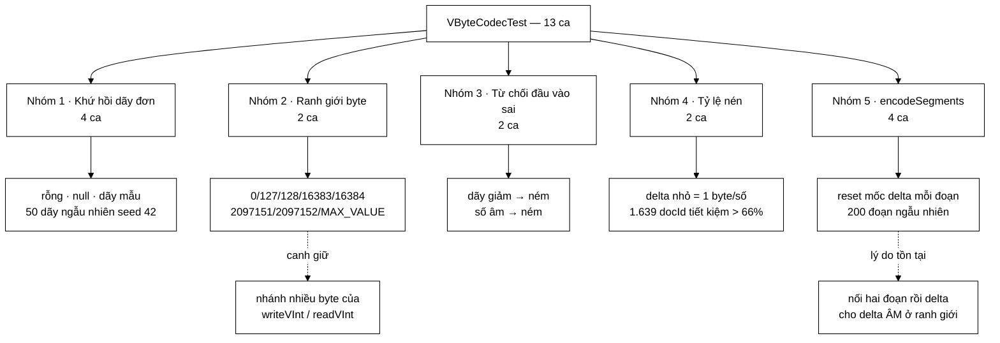

# VByteCodecTest — bộ test duy nhất trong repo mà một lỗi lọt lưới sẽ chỉ lộ ra khi chỉ mục đã đủ lớn

**File nguồn:** `search-engine/src/test/java/com/vnsearch/index/VByteCodecTest.java` (153 dòng)
**Gói:** `com.vnsearch.index` · **Khung:** JUnit 5 · **Số ca:** 13
**Lớp được kiểm:** [`VByteCodec.md`](../../../../../main/java/com/vnsearch/index/VByteCodec.md)
**Đọc kèm:** [`CompressedPostingsTest.md`](./CompressedPostingsTest.md) · [`IndexPersistenceTest.md`](./IndexPersistenceTest.md) · [`../datastructure/SparseMatrixTest.md`](../datastructure/SparseMatrixTest.md)

---

## 📌 Hiểu trong 30 giây

`VByteCodec` nén một dãy số nguyên tăng dần bằng hai bước: *delta* (lưu hiệu
thay vì giá trị) rồi *variable-byte* (mỗi số chiếm số byte tối thiểu). Cả hai
bước đều đúng gần như luôn luôn — và đó chính là vấn đề. Lỗi của một bộ mã hoá
độ dài thay đổi **không xuất hiện ở dữ liệu nhỏ**; nó nằm ở đúng chỗ mà một số
vừa vặn tràn qua ranh giới byte.

```
   VÌ SAO BỘ TEST NÀY PHẢI ÁM ẢNH VỚI GIÁ TRỊ BIÊN

   ① VByte gói 7 bit dữ liệu vào mỗi byte, bit thứ 8 là cờ "còn nữa".
        0 .. 127          → 1 byte      ← 127 = 2^7 − 1, số LỚN NHẤT còn 1 byte
      128 .. 16 383       → 2 byte      ← 128 = 2^7,     số NHỎ NHẤT phải 2 byte
     16384 .. 2 097 151   → 3 byte
     ...                     tối đa 5 byte cho int 32-bit

   ② Chỉ mục nhỏ (vài trăm tài liệu) → mọi delta đều < 127 → mọi số 1 byte
     ⇒ nhánh "ghi byte tiếp theo" của writeVInt KHÔNG BAO GIỜ CHẠY.
     Test bằng dữ liệu thật lúc mới làm sẽ xanh 100% dù nhánh đó sai hoàn toàn.

   ③ Chỉ mục lớn dần → xuất hiện delta > 127 → nhánh đó mới chạy lần đầu,
     và lúc đó lỗi hiện ra dưới dạng "posting list bị lệch", không phải
     dưới dạng ngoại lệ.

   ⇒ Ba giá trị 0 / 127 / 128 phải nằm CỨNG trong test, không đợi
     dữ liệu thật sinh ra chúng.
```



---

## 1. Bố cục: 13 ca chia năm nhóm

Bộ test tự chia đôi bằng một dòng bình luận ở dòng 96 —
`// --- encodeSegments / decodeSegments ---`. Chín ca trên là cho API dãy đơn,
bốn ca dưới là cho API nhiều đoạn.

```
   ┌─ NHÓM 1 · KHỨ HỒI DÃY ĐƠN ───────────────────────────────────┐
   │  emptyListEncodesToEmptyArray                                 │
   │  roundTripPreservesValues                                     │
   │  randomSortedListsRoundTrip           ← 50 dãy × 200 phần tử  │
   └───────────────────────────────────────────────────────────────┘
   ┌─ NHÓM 2 · RANH GIỚI BYTE ────────────────────────────────────┐
   │  handlesLargeDeltasSpanningMultipleBytes   ← 0/127/128/MAX    │
   │  encodedSizeMatchesActualEncoding          ← 1→2, 2→3 byte    │
   └───────────────────────────────────────────────────────────────┘
   ┌─ NHÓM 3 · TỪ CHỐI ĐẦU VÀO SAI ───────────────────────────────┐
   │  rejectsUnsortedInput                                         │
   │  rejectsNegativeValues                                        │
   └───────────────────────────────────────────────────────────────┘
   ┌─ NHÓM 4 · TỶ LỆ NÉN (test như một phép ĐO) ──────────────────┐
   │  smallDeltasUseOneByteEach                                    │
   │  compressionBeatsRawIntOnRealisticPostingList                 │
   └───────────────────────────────────────────────────────────────┘
   ┌─ NHÓM 5 · encodeSegments / decodeSegments ───────────────────┐
   │  segmentsRoundTripPreservesEachSegment                        │
   │  segmentBoundaryResetsDeltaBase       ← lý do API này tồn tại │
   │  segmentsRejectUnsortedWithinSegment                          │
   │  manySegmentsRoundTripOnRandomData    ← 200 đoạn ngẫu nhiên   │
   └───────────────────────────────────────────────────────────────┘
```

Nhóm 4 đáng chú ý vì nó khác loại với bốn nhóm còn lại: **nó không kiểm tính
đúng, nó kiểm tính hiệu quả**. Một cài đặt bỏ hẳn bước delta vẫn khứ hồi đúng
tuyệt đối — mọi ca ở nhóm 1, 2, 3, 5 vẫn xanh — nhưng chỉ mục phình ra bốn lần.
Nếu không có nhóm 4 thì cả lý do tồn tại của lớp này không được canh giữ bởi
bất kỳ ca nào.

---

## 2. Vì sao 127 và 128 là hai con số quan trọng nhất trong cả file

Đây là điểm cần hiểu trước khi đọc bất kỳ ca test nào.

```
   MỘT SỐ ĐƯỢC GHI RA SAO

   writeVInt(value):
       while ((value & ~0x7F) != 0)        ← "còn bit nào ngoài 7 bit thấp?"
           out.write((value & 0x7F) | 0x80)  ← 7 bit + BẬT cờ "còn nữa"
           value >>>= 7
       out.write(value & 0x7F)             ← byte cuối, cờ = 0

   value = 127 = 0b0111_1111
       127 & ~0x7F = 0        → vòng lặp KHÔNG chạy lần nào
       ghi đúng 1 byte: 0x7F

   value = 128 = 0b1000_0000
       128 & ~0x7F = 128 ≠ 0  → vòng lặp chạy
       ghi byte 1: (128 & 0x7F) | 0x80 = 0x80   ← cờ BẬT
       value >>>= 7 → 1
       ghi byte 2: 0x01                          ← cờ TẮT
       tổng 2 byte

   ⇒ 127 → 128 là chỗ DUY NHẤT trong toàn dải 0..16383 mà số byte thay đổi.
     Nếu điều kiện vòng lặp bị viết lệch một đơn vị — chẳng hạn
     `value > 0x7F` thay vì `(value & ~0x7F) != 0`, hay `>=` thay vì `>` —
     thì lỗi CHỈ hiện ra ở đúng hai giá trị này.
```

Đây là dạng lỗi *off-by-one* kinh điển, nhưng ở tầng bit. Nó không làm chương
trình ném ngoại lệ. Nó làm con trỏ byte của `readVInt` lệch đi một, và từ đó
**mọi số phía sau trong cùng mảng đều sai** — vì VByte không có mốc đồng bộ lại.

```
   TRIỆU CHỨNG THẬT KHI LỖI NÀY LỌT LƯỚI

   Chỉ mục lưu ra file JSON (base64) rồi nạp lại → posting list của một term
   giải nén ra dãy docId rác:  [3, 17, 19] trở thành [3, 2065, 2067]

   docId 2065 có thể KHÔNG TỒN TẠI      → getDocument trả null → kết quả biến mất
   docId 2065 có thể TỒN TẠI            → trả về một trang HOÀN TOÀN không liên quan

   Trường hợp thứ hai tệ hơn nhiều: không có ngoại lệ, không có log,
   chỉ là "máy tìm kiếm dạo này trả kết quả linh tinh".
```

Và cái làm dạng lỗi này nguy hiểm đặc biệt trong đúng dự án này:

```
   DỮ LIỆU NHỎ KHÔNG BAO GIỜ CHẠM TỚI NHÁNH SAI

   Javadoc của VByteCodec ghi số đo thật: term `cong_nghe` có 1.639 mục
   trải trên 5.011 tài liệu ⇒ delta trung bình ≈ 3.

   Corpus 100 trang lúc mới làm ⇒ delta cũng nhỏ ⇒ TẤT CẢ đều 1 byte.
   Corpus 5.011 trang, term hiếm chỉ xuất hiện ở doc 12 và doc 4.800
   ⇒ delta 4.788 ⇒ 2 byte ⇒ nhánh nhiều byte chạy LẦN ĐẦU.

   Nghĩa là: lỗi xuất hiện khi hệ thống ĐANG CHẠY TỐT VÀ LỚN DẦN,
   không phải lúc đang phát triển. Đó là thời điểm tệ nhất để gặp nó.
```

---

## 3. `handlesLargeDeltasSpanningMultipleBytes` — ca canh giữ các biên, và chỗ nó chưa canh hết

```java
@Test
void handlesLargeDeltasSpanningMultipleBytes() {
    int[] values = {0, 127, 128, 16_383, 16_384, 2_097_151, 2_097_152, Integer.MAX_VALUE};
    byte[] encoded = VByteCodec.encodeSorted(values);
    assertArrayEquals(values, VByteCodec.decodeSorted(encoded, values.length));
}
```

Tám giá trị được chọn theo đúng ba cặp ranh giới của bảng trong Javadoc, cộng
với `0` ở đầu và `Integer.MAX_VALUE` ở cuối. Nhưng ở đây có một chi tiết dễ đọc
lướt mà đáng dừng lại: **`encodeSorted` không mã hoá các giá trị này, nó mã hoá
HIỆU của chúng.**

| i | `values[i]` | delta ghi ra | số byte thật |
|---|---|---|---|
| 0 | 0 | 0 | 1 |
| 1 | 127 | 127 | 1 |
| 2 | 128 | 1 | 1 |
| 3 | 16 383 | 16 255 | 2 |
| 4 | 16 384 | 1 | 1 |
| 5 | 2 097 151 | 2 080 767 | 3 |
| 6 | 2 097 152 | 1 | 1 |
| 7 | `Integer.MAX_VALUE` | 2 145 386 495 | 5 |

```
   ĐỌC BẢNG TRÊN THEO CHIỀU "ĐỘ RỘNG BYTE ĐÃ ĐƯỢC CHẠY QUA"

   1 byte  ✔  (delta 0, 127, 1)
   2 byte  ✔  (delta 16 255)
   3 byte  ✔  (delta 2 080 767)
   4 byte  ✗  KHÔNG CA NÀO SINH RA DELTA TRONG 2 097 152 .. 268 435 455
   5 byte  ✔  (delta 2 145 386 495 — nhờ Integer.MAX_VALUE ở cuối)

   ⇒ Nhánh 4 byte của writeVInt/readVInt không được ca nào đi qua
     một cách CHẮC CHẮN. randomSortedListsRoundTrip cũng không:
     delta của nó tối đa 999.
```

Đây là khoảng trống thật, không phải bắt bẻ: ba giá trị `127`, `128`,
`16_383`… được chọn rất có chủ đích cho **giá trị**, nhưng vì bước delta đứng
giữa nên chủ đích đó không chuyển hết xuống tầng byte. Cách sửa rẻ nhất là kiểm
ngay trên `encodedSize` (mục 4) thay vì hy vọng dãy giá trị sinh ra đủ delta.

Ngược lại, `Integer.MAX_VALUE` ở cuối dãy là chi tiết rất đáng giữ:

```
   VÌ SAO PHẢI CÓ Integer.MAX_VALUE

   readVInt có một chốt chặn:
       shift += 7;
       if (shift > 28) throw new IllegalArgumentException("... vuot qua pham vi int 32-bit");

   Số 5 byte dùng shift 0, 7, 14, 21, 28 — CHẠM ĐÚNG mép 28.

   Viết chốt thành `if (shift >= 28)` (một sai lệch rất tự nhiên) sẽ khiến
   MỌI số 5 byte bị ném ngoại lệ. Không ca nào khác trong file phát hiện
   được: mọi delta còn lại đều ≤ 3 byte.

   Và trong hệ thống thật, số 5 byte xuất hiện đúng lúc nào?
   Khi có một term chỉ xuất hiện ở đúng một tài liệu có docId rất lớn —
   tức là ở các term HIẾM, tức là ở đuôi dài của từ vựng, tức là ở
   phần lớn từ vựng.
```

---

## 4. `encodedSizeMatchesActualEncoding` — ca có tên hứa nhiều hơn nó làm

```java
@Test
void encodedSizeMatchesActualEncoding() {
    assertEquals(1, VByteCodec.encodedSize(0));
    assertEquals(1, VByteCodec.encodedSize(127));
    assertEquals(2, VByteCodec.encodedSize(128));
    assertEquals(2, VByteCodec.encodedSize(16_383));
    assertEquals(3, VByteCodec.encodedSize(16_384));
}
```

Năm phép khẳng định này là chỗ **duy nhất** trong cả file kiểm ranh giới
127→128 và 16383→16384 một cách trực tiếp, không bị bước delta che đi. Đó là
giá trị thật của ca này.

Nhưng tên ca là `encodedSizeMatchesActualEncoding` — "khớp với phép mã hoá
thật" — trong khi thân ca **không hề gọi `encodeSorted` để đối chiếu**. Nó chỉ
kiểm `encodedSize` với các hằng số viết tay.

```
   HAI HÀM ĐANG SỐNG SONG SONG MÀ KHÔNG AI BUỘC CHÚNG BẰNG NHAU

   writeVInt(out, value)          ← quyết định số byte THẬT SỰ được ghi
       while ((value & ~0x7F) != 0) { out.write(...); value >>>= 7; }
       out.write(...)

   encodedSize(value)             ← BẢN SAO của cùng một vòng lặp
       int bytes = 1;
       while ((value & ~0x7F) != 0) { bytes++; value >>>= 7; }

   Đây là mã LẶP LẠI. Sửa một bên mà quên bên kia thì:
     • khứ hồi vẫn đúng (writeVInt vẫn tự nhất quán với readVInt)
     • mọi con số tỷ lệ nén báo cáo ra đều SAI
     • và không ca nào đỏ

   Ca test đúng với cái tên của nó phải là:
       for (int v : new int[]{0, 127, 128, 16_383, 16_384, 2_097_152, Integer.MAX_VALUE})
           assertEquals(VByteCodec.encodedSize(v),
                        VByteCodec.encodeSorted(new int[]{v}).length, "v=" + v);

   Một dòng, và nó vừa buộc hai hàm khớp nhau, vừa lấp luôn khoảng
   trống nhánh 4 byte nêu ở mục 3.
```

Đây là kiểu khoảng trống đáng chú ý nhất khi đọc một bộ test: **tên ca mô tả
một tính chất mạnh hơn thân ca thực sự kiểm**. Người đọc lướt danh sách test sẽ
tin rằng tính chất đó đã được canh giữ.

---

## 5. Hai ca khứ hồi và vì sao seed phải cố định

```java
@Test
void randomSortedListsRoundTrip() {
    Random random = new Random(42); // seed co dinh -> tai lap duoc
    for (int trial = 0; trial < 50; trial++) {
        int[] values = new int[200];
        int current = 0;
        for (int i = 0; i < values.length; i++) {
            current += random.nextInt(1000);
            values[i] = current;
        }
        byte[] encoded = VByteCodec.encodeSorted(values);
        assertArrayEquals(values, VByteCodec.decodeSorted(encoded, values.length));
    }
}
```

10 000 số qua một lượt, và điều đáng học nằm ở `new Random(42)`:

```
   SEED CỐ ĐỊNH ≠ "LƯỜI CHỌN SỐ"

   Random không seed:
     • ca đỏ trên máy CI lúc 2 giờ sáng
     • chạy lại trên máy mình → XANH
     • không ai tái lập được, ticket bị đóng là "flaky"

   Random(42):
     • cùng một dãy 10.000 số trên MỌI máy, MỌI lần chạy
     • đỏ một lần là đỏ mãi cho tới khi sửa xong
     • ca test vẫn phủ rộng hơn hẳn dãy viết tay

   Đây là cách lấy độ phủ của kiểm thử ngẫu nhiên mà không lấy
   tính bất định của nó.
```

Chi tiết thứ hai: `current += random.nextInt(1000)` — `nextInt(1000)` **có thể
trả 0**, nên dãy sinh ra là *không giảm* chứ không phải *tăng nghiêm ngặt*. Đó
không phải sơ suất mà đúng hợp đồng của lớp: `encodeSorted` chỉ ném khi
`value < previous`, còn hai giá trị bằng nhau cho delta 0 và hoàn toàn hợp lệ.

```
   VÌ SAO DELTA 0 PHẢI ĐƯỢC PHÉP — VÀ VÌ SAO ĐIỀU ĐÓ KHÔNG PHẢI CHI TIẾT VỤN

   CompressedPostings gọi encodeSorted cho mảng `offsets` (tổng tích luỹ
   số vị trí). Một posting có 0 vị trí ⇒ offset LẶP LẠI:

       tf mỗi posting  : [2, 0, 3]
       offset tích luỹ : [0, 2, 2, 5]
                             ↑  ↑
                            hai giá trị BẰNG NHAU

   Nếu ai đó "siết chặt" encodeSorted thành `value <= previous → throw`
   thì mọi chỉ mục có một term xuất hiện với 0 vị trí sẽ vỡ.

   Ca canh giữ tình huống đó KHÔNG nằm ở file này mà ở
   CompressedPostingsTest#postingWithoutPositions.
```

`roundTripPreservesValues` và `emptyListEncodesToEmptyArray` là hai hàng rào rẻ
tiền hơn. Ca rỗng đáng chú ý ở chỗ nó kiểm **ba** lối vào rỗng khác nhau trong
ba dòng: mảng độ dài 0, `null`, và giải mã mảng byte rỗng.

---

## 6. Nhóm tỷ lệ nén — hai ca kiểm *hiệu quả*, không kiểm *tính đúng*

```java
@Test
void compressionBeatsRawIntOnRealisticPostingList() {
    // Mo phong posting list that: 1.639 docId trai deu tren 5.011 tai lieu,
    // tuc hieu trung binh ~3 -> moi docId chi can 1 byte thay vi 4.
    int[] docIds = new int[1639];
    for (int i = 0; i < docIds.length; i++) {
        docIds[i] = i * 3 + (i % 2);
    }
    byte[] compressed = VByteCodec.encodeSorted(docIds);
    int rawBytes = docIds.length * Integer.BYTES;

    assertTrue(compressed.length < rawBytes / 3,
            "Nen phai tiet kiem tren 66%; thuc te " + compressed.length + " / " + rawBytes);
    assertArrayEquals(docIds, VByteCodec.decodeSorted(compressed, docIds.length));
}
```

Con số 1 639 và 5 011 không phải bịa: chúng lấy đúng từ Javadoc của
`VByteCodec` (posting list của term `cong_nghe` trên corpus thật). Công thức
`i * 3 + (i % 2)` cho delta luân phiên 4 và 2 — đúng mức delta trung bình ≈ 3
mà số đo thật cho ra.

```
   PHÉP TÍNH THẬT

   docIds  : 0, 4, 6, 10, 12, 16, ...        delta: 0, 4, 2, 4, 2, ...
   mọi delta ≤ 127  ⇒  1 byte mỗi số  ⇒  compressed.length = 1.639
   rawBytes = 1.639 × 4 = 6.556
   ngưỡng   = 6.556 / 3 = 2.185

   1.639 < 2.185  ✔  (thật ra tiết kiệm 75%, không phải 66%)
```

Ngưỡng đặt ở 66% trong khi thực tế là 75% — **cố ý nới lỏng**. Một ca test
khẳng định `compressed.length == 1639` sẽ đỏ mỗi khi ai đó đổi định dạng dù
theo hướng tốt hơn. Ngưỡng nới cho phép cài đặt tiến hoá mà vẫn chặn được thoái
hoá. Đánh đổi: nếu ai đó bỏ hẳn bước delta, `encodedSize` của các giá trị tuyệt
đối (0…4 916) là 1–2 byte, tổng khoảng 3 200 byte — **vẫn dưới ngưỡng 2 185?**
Không: 3 200 > 2 185, nên ca này vẫn đỏ. Ngưỡng được chọn vừa đủ chặt.

Thông điệp khẳng định nối luôn hai con số thật (`compressed.length + " / " +
rawBytes`) — cùng kỹ thuật với `TrieTest`: lúc đỏ, đọc log là biết ngay tệ đi
bao nhiêu, không cần chạy lại.

`smallDeltasUseOneByteEach` là phiên bản tối giản của cùng ý tưởng, và nó chặt
hơn hẳn vì dùng `assertEquals` chứ không phải ngưỡng:

```java
int[] values = {0, 1, 2, 3, 4, 5};
assertEquals(values.length, VByteCodec.encodeSorted(values).length);
```

Sáu số, sáu byte, không hơn không kém. Bất kỳ byte thừa nào — một tiêu đề, một
độ dài ghi kèm, một cờ — đều làm ca này đỏ ngay.

---

## 7. `encodeSegments` — bốn ca cho một hàm chỉ khác `encodeSorted` đúng một dòng

Nhìn mã nguồn, `encodeSegments` gần như là bản sao của `encodeSorted`. Khác
biệt duy nhất nằm ở dòng 129:

```java
for (int[] segment : segments) {
    int previous = 0; // ← reset moi doan: day la diem khac encodeSorted
```

Và `segmentBoundaryResetsDeltaBase` tồn tại chỉ để canh giữ đúng một dòng đó:

```java
@Test
void segmentBoundaryResetsDeltaBase() {
    // Day chinh la ly do encodeSegments phai ton tai: noi hai doan lai roi
    // delta hoa MOT lan se cho delta AM tai ranh gioi (100 -> 1).
    List<int[]> segments = List.of(new int[]{100}, new int[]{1});
    byte[] encoded = VByteCodec.encodeSegments(segments);
    int[][] decoded = VByteCodec.decodeSegments(encoded, new int[]{1, 1});

    assertArrayEquals(new int[]{100}, decoded[0]);
    assertArrayEquals(new int[]{1}, decoded[1], "doan sau phai bat dau lai tu 0");
}
```

```
   BÀI TOÁN MÀ CA NÀY MÔ TẢ

   positions là CHỈ SỐ TOKEN TRONG TÀI LIỆU, nên mỗi tài liệu
   bắt đầu lại từ 0:

       doc 7  : [100]        ← từ này ở token thứ 100 của doc 7
       doc 8  : [1]          ← và ở token thứ 1 của doc 8

   Nối liền rồi delta hoá MỘT lần:
       [100, 1]  →  delta [100, −99]
                                ↑
                    ÂM. Bước delta giả định dãy không giảm, và
                    giả định đó đúng TRONG một tài liệu, sai GIỮA
                    hai tài liệu.

   Chữa: previous = 0 ở đầu mỗi đoạn, đối xứng ở cả hai chiều.
```

**Một điểm cần nói thẳng về sức mạnh của ca này.** Nó canh giữ *sự đối xứng
giữa hai chiều*, không canh giữ *chi phí byte*. Nếu ai đó bỏ reset ở **cả**
`encodeSegments` **và** `decodeSegments`, phép khứ hồi vẫn đúng — `writeVInt`
với số âm ghi ra 5 byte theo bù hai và `readVInt` đọc lại đúng −99, nên
`100 + (−99) = 1`. Ca test vẫn xanh, còn chỉ mục thì phình lên 5 byte cho một
vị trí lẽ ra tốn 1 byte.

```
   ✗ Ca này KHÔNG bắt được: bỏ reset ở CẢ HAI chiều
     → đúng, nhưng ngốn 5 byte mỗi ranh giới posting.
     Trên 1.594.938 posting, đó là ~6 MB lãng phí âm thầm.

   ✓ Ca này BẮT ĐƯỢC: bỏ reset ở đúng MỘT chiều
     → dữ liệu giải nén ra rác, đây mới là lỗi hay xảy ra thật
       (sửa encode rồi quên sửa decode).

   Muốn bịt nốt lỗ trên, thêm một dòng:
       assertEquals(2, encoded.length, "moi doan mot byte");
```

Hai ca còn lại lo phần rộng: `segmentsRoundTripPreservesEachSegment` cố ý cho
đoạn thứ ba là `new int[]{}` — **đoạn rỗng nằm giữa**, tức trường hợp một
posting không có vị trí nào lọt vào giữa hai posting có vị trí; và
`manySegmentsRoundTripOnRandomData` chạy 200 đoạn với độ dài ngẫu nhiên
`random.nextInt(6)` — nghĩa là **khoảng một phần sáu số đoạn là rỗng**, phân bố
rải rác chứ không nằm ở vị trí thuận lợi.

Chi tiết đáng học ở cả hai ca: thông điệp `"doan " + i`. Khi 1 trong 200 đoạn
sai, `assertArrayEquals` không tự nói đoạn nào; nối chỉ số vào là đủ để thu hẹp
phạm vi gỡ lỗi từ 200 xuống 1.

---

## 8. Kỹ thuật đáng học lại từ bộ test này

```
   ① CHỌN GIÁ TRỊ THEO RANH GIỚI CỦA CÀI ĐẶT, KHÔNG THEO "SỐ TRÔNG TO"
      {0, 127, 128, 16383, 16384, 2097151, 2097152, MAX_VALUE}
      Mỗi cặp là một chỗ số byte nhảy. Chọn {1, 100, 999999}
      trông cũng "đa dạng" nhưng không chạm biên nào cả.

   ② KIỂM THỬ NGẪU NHIÊN VỚI SEED CỐ ĐỊNH
      new Random(42) — độ phủ của fuzzing, tính tất định của ca viết tay.

   ③ TEST CÓ THỂ KIỂM HIỆU QUẢ, KHÔNG CHỈ KIỂM ĐÚNG
      assertTrue(compressed.length < rawBytes / 3)
      Không có ca này thì lý do tồn tại của cả lớp không được canh giữ.

   ④ NGƯỠNG NỚI CHO SỐ ĐO, ĐẲNG THỨC CHO BẤT BIẾN
      < rawBytes/3  (nới — cho phép cải tiến)
      == values.length (chặt — 6 số phải đúng 6 byte)

   ⑤ NỐI GIÁ TRỊ THẬT VÀO THÔNG ĐIỆP KHẲNG ĐỊNH
      "thuc te " + compressed.length + " / " + rawBytes
      "doan " + i

   ⑥ DÙNG SỐ ĐO THẬT LÀM DỮ LIỆU TEST
      1.639 docId / 5.011 tài liệu lấy từ corpus thật, không bịa.
      Ca test và tài liệu nói cùng một con số.
```

---

## 9. Hướng dẫn thực hành

### 9.1 Chạy

```powershell
cd search-engine

# Cả 13 ca
.\mvnw.cmd test "-Dtest=VByteCodecTest"

# Một ca
.\mvnw.cmd test "-Dtest=VByteCodecTest#handlesLargeDeltasSpanningMultipleBytes"

# Cả tầng nén (VByte + CompressedPostings + CompressedText)
.\mvnw.cmd test "-Dtest=VByteCodecTest+CompressedPostingsTest+CompressedTextTest"
```

Trên PowerShell **phải bọc `-Dtest=...` trong nháy kép**, nếu không dấu `=` bị
nuốt và Maven chạy toàn bộ bộ test.

Xem tận mắt tỷ lệ nén bằng `main()` có sẵn trong lớp:

```powershell
.\mvnw.cmd -q compile exec:java "-Dexec.mainClass=com.vnsearch.index.VByteCodec"
```

### 9.2 Đọc kết quả

```
[INFO] Running com.vnsearch.index.VByteCodecTest
[INFO] Tests run: 13, Failures: 0, Errors: 0, Skipped: 0
```

Báo cáo chi tiết: `search-engine/target/surefire-reports/com.vnsearch.index.VByteCodecTest.txt`

Khi ca tỷ lệ nén đỏ, thông điệp có dạng:

```
Nen phai tiet kiem tren 66%; thuc te 6556 / 6556 ==> expected: <true> but was: <false>
```

Hai con số bằng nhau nghĩa là **bước nén không hề chạy** — đọc log là đủ để
biết, không cần gỡ lỗi.

### 9.3 Tự kiểm chứng — cố tình làm hỏng để xem ca nào đỏ

| Sửa gì trong `VByteCodec.java` | Ca dự kiến đỏ |
|---|---|
| Bỏ bước delta: `writeVInt(out, value)` thay vì `value - previous` | `compressionBeatsRawIntOnRealisticPostingList` (chỉ ca này) |
| `writeVInt`: đổi điều kiện thành `value > 0x80` | `handlesLargeDeltasSpanningMultipleBytes`, `encodedSizeMatchesActualEncoding` |
| `writeVInt`: ghi `(value & 0x7F)` không `| 0x80` (quên cờ "còn nữa") | `handlesLargeDeltasSpanningMultipleBytes`, `randomSortedListsRoundTrip` |
| `readVInt`: đổi chốt thành `if (shift >= 28) throw` | **chỉ** `handlesLargeDeltasSpanningMultipleBytes` (nhờ `Integer.MAX_VALUE`) |
| `encodeSegments`: bỏ `int previous = 0` đầu mỗi đoạn (chỉ chiều mã hoá) | `segmentBoundaryResetsDeltaBase`, `segmentsRoundTripPreservesEachSegment`, `manySegmentsRoundTripOnRandomData` |
| Bỏ `previous = 0` ở **cả hai** chiều encode và decode | **KHÔNG ca nào** — xem mục 7 |
| Bỏ kiểm `value < previous` trong `encodeSorted` | `rejectsUnsortedInput` |
| Bỏ kiểm `value < 0` | `rejectsNegativeValues` |
| `encodedSize`: khởi tạo `int bytes = 0` | `encodedSizeMatchesActualEncoding` |
| `encodedSize`: đổi `~0x7F` thành `0xFF80` (chỉ sai với số ≥ 2^16) | **KHÔNG ca nào** — không giá trị nào đủ lớn được kiểm |

Hai dòng cuối cùng chính là hai khoảng trống thật đã nêu ở mục 3 và 4. Đây là
*kiểm thử đột biến* (mutation testing) làm bằng tay: một dòng sửa mà không ca
nào đỏ là một lỗ hổng có thật.

### 9.4 Cạm bẫy khi viết thêm ca cho lớp này

```
   ✗ Đừng viết dãy giá trị rồi tưởng là đã kiểm ranh giới byte.
     encodeSorted mã hoá HIỆU. {127, 128} cho delta 127 và 1 —
     cả hai đều 1 byte, không chạm biên nào cả.
     Muốn ép một delta d thì viết {0, d}.

   ✗ Đừng dùng Random không seed.
     Ca đỏ một lần rồi xanh mãi là ca vô dụng, và tệ hơn:
     nó dạy người ta bỏ qua kết quả đỏ.

   ✗ Đừng khẳng định số byte chính xác cho dữ liệu lớn.
     smallDeltasUseOneByteEach dùng == vì 6 số nhỏ là bất biến;
     ca 1.639 docId dùng ngưỡng vì con số đó sẽ đổi khi định dạng
     tiến hoá.

   ✗ Đừng quên rằng decodeSorted TIN TUYỆT ĐỐI vào tham số count.
     Truyền count sai không ném ngoại lệ nếu dữ liệu còn đủ byte —
     nó lặng lẽ trả về dãy sai độ dài. Không ca nào canh điều này.

   ✗ Đừng thêm tiêu đề hay độ dài vào mảng byte.
     VByte ở đây CỐ Ý không tự mô tả độ dài (count lưu riêng
     trong CompressedPostings). Thêm vào là phá smallDeltasUseOneByteEach.
```

---

## 10. Bảng tổng hợp 13 ca

| # | Ca test | Nhóm | Tính chất được canh giữ |
|---|---|---|---|
| 1 | `emptyListEncodesToEmptyArray` | 1 | Ba lối vào rỗng: mảng rỗng, `null`, giải mã mảng rỗng |
| 2 | `roundTripPreservesValues` | 1 | Đường đi cơ bản của `encodeSorted`/`decodeSorted` |
| 3 | **`randomSortedListsRoundTrip`** | 1 | **10 000 số, seed 42 — độ phủ rộng mà vẫn tất định** |
| 4 | **`handlesLargeDeltasSpanningMultipleBytes`** | 2 | **Ranh giới 127/128, 16383/16384, và số 5 byte (`shift > 28`)** |
| 5 | `encodedSizeMatchesActualEncoding` | 2 | Bảng độ rộng byte — nơi duy nhất kiểm biên trực tiếp |
| 6 | `rejectsUnsortedInput` | 3 | `encodeSorted` ném thay vì ghi delta âm |
| 7 | `rejectsNegativeValues` | 3 | VByte không mã hoá được số âm |
| 8 | `smallDeltasUseOneByteEach` | 4 | 6 số = đúng 6 byte, không byte thừa nào |
| 9 | **`compressionBeatsRawIntOnRealisticPostingList`** | 4 | **Bước delta thật sự chạy — lý do tồn tại của lớp** |
| 10 | `segmentsRoundTripPreservesEachSegment` | 5 | Đoạn rỗng nằm giữa hai đoạn có dữ liệu |
| 11 | **`segmentBoundaryResetsDeltaBase`** | 5 | **Mốc delta reset mỗi đoạn — lý do `encodeSegments` tồn tại** |
| 12 | `segmentsRejectUnsortedWithinSegment` | 5 | Kiểm tăng dần vẫn áp dụng *bên trong* mỗi đoạn |
| 13 | `manySegmentsRoundTripOnRandomData` | 5 | 200 đoạn, ~1/6 rỗng, phân bố ngẫu nhiên |

---

## 11. Khoảng trống chưa phủ

```
   ✗ NHÁNH 4 BYTE (delta 2 097 152 .. 268 435 455) không được đi qua.
     Xem bảng ở mục 3. Trên chỉ mục thật, delta cỡ này xuất hiện khi
     một term hiếm chỉ có ở một tài liệu ở cuối corpus lớn.

   ✗ encodedSize KHÔNG BAO GIỜ được đối chiếu với encodeSorted, dù
     tên ca hứa đúng điều đó. Hai vòng lặp giống hệt nhau đang được
     bảo trì độc lập. Xem mục 4.

   ✗ DỮ LIỆU HỎNG khi giải mã. readVInt có hai đường ném ngoại lệ
     ("bi cat cut", "vuot qua pham vi int") mà không ca nào chạm tới.
     Đường này CÓ THẬT: file chỉ mục ghi dở khi tiến trình bị kill.

   ✗ decodeSorted với count SAI. Truyền count lớn hơn thực tế →
     ngoại lệ "cat cut"; truyền nhỏ hơn → im lặng trả dãy thiếu.
     Cả hai đều không được kiểm.

   ✗ GIÁ TRỊ BẰNG NHAU LIÊN TIẾP (delta 0) không có ca riêng ở file
     này, dù đó là tình huống THẬT của mảng offsets. Nó chỉ được kiểm
     gián tiếp qua CompressedPostingsTest#postingWithoutPositions.

   ✗ encodeSegments với số ÂM. encodeSorted có rejectsNegativeValues;
     encodeSegments có cùng phép kiểm trong mã nguồn nhưng không có ca.

   ✗ Mảng RẤT LỚN (hàng triệu phần tử) — ByteArrayOutputStream khởi tạo
     với sức chứa `sorted.length`, tức GIẢ ĐỊNH 1 byte mỗi số. Đúng cho
     dữ liệu điển hình, nhưng chưa ai đo chi phí cấp phát lại khi sai.
```

Ca đáng viết trước nhất — nó lấp cùng lúc hai khoảng trống đầu:

```java
@Test
void encodedSizeThucSuKhopVoiSoByteDuocGhiRa() {
    int[] mocRanhGioi = {0, 1, 127, 128, 16_383, 16_384,
                         2_097_151, 2_097_152, 268_435_455, 268_435_456,
                         Integer.MAX_VALUE};
    for (int giaTri : mocRanhGioi) {
        // {0, giaTri} ép ĐÚNG một delta bằng giaTri, cộng 1 byte cho số 0 đầu dãy.
        int soByte = VByteCodec.encodeSorted(new int[]{0, giaTri}).length - 1;
        assertEquals(VByteCodec.encodedSize(giaTri), soByte,
                "encodedSize noi doi tai gia tri " + giaTri);
    }
}
```

Mẹo `{0, giaTri}` là phần đáng học: nó biến một *giá trị* thành một *delta*,
đúng thứ mà `writeVInt` thật sự nhìn thấy. Không có mẹo này thì mọi ca kiểm
ranh giới đều bị bước delta làm cho vô hiệu, như đã xảy ra ở ca số 4.

---

## 12. Liên kết

- Lớp được kiểm, kèm bảng độ rộng byte và số đo tỷ lệ nén trên corpus thật: [`VByteCodec.md`](../../../../../main/java/com/vnsearch/index/VByteCodec.md)
- Người dùng chính của codec này — nơi `encodeSegments` được gọi và nơi delta 0 của mảng offsets thật sự xuất hiện: [`CompressedPostingsTest.md`](./CompressedPostingsTest.md)
- Nơi mảng byte đã nén được ghi ra đĩa dưới dạng base64, và nơi một lỗi giải mã sẽ hiện ra thành "truy vấn trả rỗng": [`IndexPersistenceTest.md`](./IndexPersistenceTest.md)
- Cùng kỹ thuật `rowPtr`/tổng tích luỹ, áp dụng cho ma trận thưa thay vì posting list: [`../datastructure/SparseMatrixTest.md`](../datastructure/SparseMatrixTest.md)
- Bất biến "posting list sắp xếp tăng dần theo docId" mà cả hai bước nén dựa vào: [`InvertedIndexTest.md`](./InvertedIndexTest.md)
- Lợi ích thứ hai của cùng bất biến đó — nhảy cóc bằng galloping search: [`PostingCursorTest.md`](./PostingCursorTest.md)
