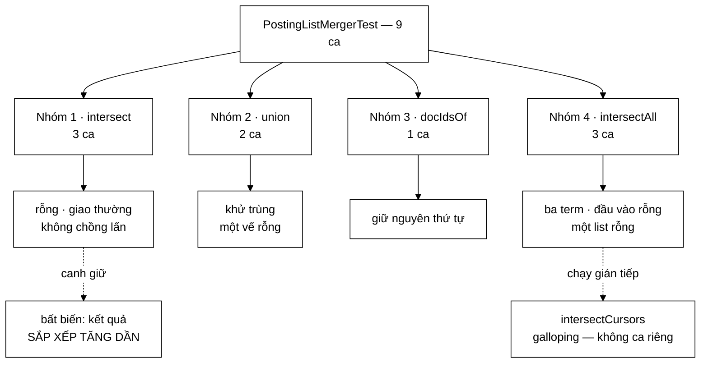

# PostingListMergerTest — chín ca phủ phần dễ nhất của lớp, và bỏ trống đúng ba thứ lớp này được sinh ra để làm

**File nguồn:** `search-engine/src/test/java/com/vnsearch/query/PostingListMergerTest.java` (79 dòng)
**Gói:** `com.vnsearch.query` · **Khung:** JUnit 5 · **Số ca:** 9
**Lớp được kiểm:** [`PostingListMerger.md`](../../../../../main/java/com/vnsearch/query/PostingListMerger.md)
**Đọc kèm:** [`QueryAstTest.md`](./ast/QueryAstTest.md) · [`../index/PostingCursorTest.md`](../index/PostingCursorTest.md) · [`CandidateResolverTest.md`](./CandidateResolverTest.md)

---

## 📌 Hiểu trong 30 giây

`PostingListMerger` là chỗ nóng nhất của tầng truy vấn: giao và hợp posting
list. Chín ca ở đây kiểm `intersect`, `union`, `docIdsOf`, `intersectAll` — và
chúng làm việc đó gọn gàng. Điều đáng nói nằm ở phần **không** được kiểm:

```
   BỐN NHÓM CHỨC NĂNG CỦA LỚP — SỐ CA TEST TRỰC TIẾP

   ① intersect / union / docIdsOf   two-pointer O(m+n)     6 ca
   ② intersectAll                   điều phối nhiều list   3 ca
   ③ intersectCursors               galloping O(m log n/m) 0 ca ✗
   ④ matchesPhrase                  khớp cụm, binary search 0 ca ✗

   ③ và ④ là hai phần Javadoc của lớp dành nhiều chữ nhất, và là
   hai phần thuật toán khó nhất. Chúng CÓ được chạy — gián tiếp,
   qua intersectAll và qua PhraseNode ở QueryAstTest — nhưng
   không có ca nào đặt tên cho tính chất của chúng.
```

Và một sự thật cấu trúc, không phải sơ suất, cần nói rõ ngay:

```
   MỘT TỐI ƯU ĐÚNG THÌ KHÔNG ĐỔI KẾT QUẢ.
   MÀ KHÔNG ĐỔI KẾT QUẢ THÌ KHÔNG CÓ TEST NÀO BẮT ĐƯỢC KHI NÓ
   BỊ GỠ BỎ.

   shortest-first, galloping search, binary search thay contains
   — cả ba đều CHỈ đổi tốc độ. Xoá sạch cả ba đi, chín ca này
   vẫn xanh hết.

   ⇒ Với loại mã này, cổng chặn không phải là unit test mà là
     phép đo. Xem mục 5.
```



---

## 1. Bố cục: 9 ca chia bốn nhóm

```
   ┌─ NHÓM 1 · intersect(List, List) ─────────────────────────┐
   │  intersectWithEmptyListsIsEmpty                           │
   │  intersectFindsCommonDocIds                               │
   │  intersectWithNoOverlapIsEmpty                            │
   └───────────────────────────────────────────────────────────┘
   ┌─ NHÓM 2 · union(List, List) ─────────────────────────────┐
   │  unionCombinesAndDeduplicates              ← quan trọng   │
   │  unionWithEmptyListReturnsTheOther                        │
   └───────────────────────────────────────────────────────────┘
   ┌─ NHÓM 3 · docIdsOf(List<Posting>) ───────────────────────┐
   │  docIdsOfExtractsInOrder                                  │
   └───────────────────────────────────────────────────────────┘
   ┌─ NHÓM 4 · intersectAll(List<List<Posting>>) ─────────────┐
   │  intersectAllOfThreeTermsFindsCommonDocs                  │
   │  intersectAllWithEmptyInputReturnsEmpty                   │
   │  intersectAllShortCircuitsWhenOneListIsEmpty              │
   └───────────────────────────────────────────────────────────┘
```

Một chi tiết dựng dữ liệu đáng nhìn kỹ:

```java
private Posting p(int docId) {
    return new Posting(docId, 1, new int[]{0});
}
```

```
   HÀM DỰNG NÀY NÓI GÌ VỀ PHẠM VI BỘ TEST

   Mọi Posting đều có  freq = 1  và  positions = {0}.
   Tức bộ test cố ý KHÔNG quan tâm tới hai trường đó.

   Điều đó hợp lý cho intersect/union/docIdsOf — chúng chỉ đọc
   docId. Nhưng nó cũng là dấu hiệu rõ nhất cho thấy
   matchesPhrase KHÔNG nằm trong tầm ngắm của file này:
   matchesPhrase làm việc hoàn toàn trên `positions`, mà mọi
   posting ở đây đều có đúng một vị trí là 0.

   ⇒ Đọc hàm dựng dữ liệu là cách nhanh nhất đoán ra một bộ test
     phủ tới đâu.
```

---

## 2. Nhóm 1 — `intersect`, và ca "không chồng lấn" bắt cái gì

```java
@Test
void intersectFindsCommonDocIds() {
    List<Integer> a = List.of(1, 3, 5, 7);
    List<Integer> b = List.of(2, 3, 5, 8);
    assertEquals(List.of(3, 5), PostingListMerger.intersect(a, b));
}
```

Dữ liệu này được chọn cẩn thận hơn vẻ ngoài:

```
   VÌ SAO CẶP (a, b) NÀY KHÔNG PHẢI TUỲ TIỆN

   a = 1  3  5  7
   b =    2  3  5  8

   Nó chứa đủ BỐN tình huống mà vòng lặp two-pointer phải xử lý:

     docA < docB  → a=1 vs b=2      (tiến i)
     docA > docB  → a=3 vs b=2      (tiến j)
     docA == docB → 3, 5            (thu hoạch, tiến cả hai)
     hết một vế   → a=7 còn, b hết  (thoát vòng, KHÔNG thêm 7)

   Tình huống cuối là tình huống dễ sai nhất: một cài đặt copy
   nhầm khuôn mẫu của `union` sẽ có hai vòng while "vét phần
   đuôi" ở cuối — và cho ra [3, 5, 7]. Ca này bắt đúng lỗi đó.
```

Ba ca của nhóm che ba lớp lỗi khác nhau:

| Ca | Bắt lỗi gì | Triệu chứng nếu hỏng |
|---|---|---|
| `intersectWithEmptyListsIsEmpty` | Vòng lặp không kiểm điều kiện dừng trước khi `get(0)` | `IndexOutOfBoundsException` ngay khi một term không có trong corpus — tức rất thường xuyên |
| `intersectFindsCommonDocIds` | Sai chiều tiến con trỏ; vét phần đuôi nhầm | Kết quả có tài liệu **không** chứa đủ các term — người dùng thấy kết quả lạc đề |
| `intersectWithNoOverlapIsEmpty` | Điều kiện `==` viết nhầm thành `<=` hay `>=` | Giao trả về gần như hợp — truy vấn nhiều từ trả về cả nghìn trang không liên quan |

`intersectWithEmptyListsIsEmpty` viết hai phép khẳng định chứ không một:

```java
assertTrue(PostingListMerger.intersect(List.of(), List.of()).isEmpty());
assertTrue(PostingListMerger.intersect(List.of(1, 2), List.of()).isEmpty());
```

Cả hai rỗng và **một** vế rỗng là hai đường khác nhau: đường thứ hai còn kiểm
rằng vế không rỗng không bị "vét đuôi" vào kết quả. Đây chính là chỗ `intersect`
và `union` khác nhau về cấu trúc, nên kiểm riêng là đúng.

---

## 3. Nhóm 2 — `union`, nơi bất biến sắp xếp được canh giữ

```java
@Test
void unionCombinesAndDeduplicates() {
    List<Integer> a = List.of(1, 3, 5);
    List<Integer> b = List.of(2, 3, 5, 8);
    assertEquals(List.of(1, 2, 3, 5, 8), PostingListMerger.union(a, b));
}
```

Một phép `assertEquals` này gánh **ba** tính chất cùng lúc, và đó là lý do nó là
ca quan trọng nhất nhóm:

```
   BA TÍNH CHẤT TRONG MỘT DÒNG

   ① ĐỦ    — mọi phần tử của a và b đều có mặt
             (1 từ a, 2 và 8 từ b)
   ② KHỬ TRÙNG — 3 và 5 có ở CẢ HAI, chỉ xuất hiện MỘT lần
   ③ SẮP XẾP TĂNG DẦN — 1,2,3,5,8

   Tính chất ③ là thứ dễ mất nhất và hại nhất khi mất.

   VÌ SAO: OrNode gọi union rồi TRẢ THẲNG kết quả lên nút cha.
   Nút cha là AndNode, và AndNode gọi intersect — mà intersect
   two-pointer CHỈ ĐÚNG khi cả hai đầu vào đã sắp xếp.

     union trả về [1,3,5,2,8]   (đúng tập, sai thứ tự)
        → intersect([1,3,5,2,8], [2,3]) trả về [3]
        → thiếu mất 2

   TRIỆU CHỨNG: truy vấn "(laptop OR máy tính) AND giá" trả về
   ÍT kết quả hơn nó phải có, một cách không đều — phụ thuộc
   docId rơi vào đâu. Không có ngoại lệ, không có log, và không
   thể tái hiện bằng cách gõ lại cùng truy vấn trên corpus khác.

   Dùng assertEquals trên cả danh sách (thay vì so tập hợp) là
   thứ duy nhất bắt được lỗi này.
```

Ca còn lại kiểm hai phần tử trung hoà:

```java
assertEquals(a, PostingListMerger.union(a, List.of()));
assertEquals(a, PostingListMerger.union(List.of(), a));
```

Kiểm **cả hai chiều** là cố ý: hai vòng `while` vét đuôi ở cuối `union` là hai
đoạn mã riêng biệt, và quên một trong hai là lỗi copy-paste kinh điển. Kiểm một
chiều thì lỗi lọt qua.

Chú ý cách so sánh: `assertEquals(a, ...)` so **nội dung**, không so danh tính.
`union` luôn dựng `ArrayList` mới, nên nếu ai đó "tối ưu" bằng cách trả thẳng
tham chiếu `a`, ca này vẫn xanh. Điều đó ở đây là chấp nhận được — nhưng đáng
biết, vì trả thẳng tham chiếu một `List.of()` bất biến rồi để tầng trên thêm
phần tử vào sẽ ném `UnsupportedOperationException` ở một chỗ rất xa.

---

## 4. Nhóm 3 và 4 — `docIdsOf` và `intersectAll`

### 4.1 `docIdsOfExtractsInOrder` — ca một dòng canh một bất biến cả tầng

```java
List<Posting> postings = List.of(p(1), p(4), p(9));
assertEquals(List.of(1, 4, 9), PostingListMerger.docIdsOf(postings));
```

`docIdsOf` chỉ là một vòng lặp trích trường. Ca này vẫn đáng có, vì nó là **cửa
vào** của mọi đường đi khác: `TermNode.evaluate` gọi thẳng nó, và bất biến "sắp
xếp tăng dần" của cả cây biểu thức bắt đầu từ đây. Một cài đặt lỡ dùng
`HashSet` để khử trùng ở giữa sẽ phá thứ tự ngay tại nguồn.

### 4.2 `intersectAllOfThreeTermsFindsCommonDocs` — ca duy nhất chạm tới galloping

```java
// term A: doc 1,2,3,4,5   term B: doc 2,3,5   term C: doc 3,5,9
List<Posting> a = List.of(p(1), p(2), p(3), p(4), p(5));
List<Posting> b = List.of(p(2), p(3), p(5));
List<Posting> c = List.of(p(3), p(5), p(9));

List<Integer> result = PostingListMerger.intersectAll(List.of(a, b, c));
assertEquals(List.of(3, 5), result);
```

```
   ĐƯỜNG ĐI THẬT CỦA CA NÀY — DÀI HƠN VẺ NGOÀI

   1. sort theo kích thước:  b(3), c(3), a(5)
      ← shortest-first. Với dữ liệu này a bị đẩy xuống cuối.

   2. intersectCursors(PostingCursor.of(b), PostingCursor.of(c))
      ← galloping search, KHÔNG phải two-pointer thuần
      → [3, 5]

   3. intersectCursorWithList(PostingCursor.of(a), [3,5])
      ← nhánh thứ ba, dùng skipTo
      → [3, 5]

   ⇒ Ca này là ca DUY NHẤT trong file chạy qua PostingCursor,
     skipTo, và cả hai hàm giao dùng cursor.

   NHƯNG: nó không đặt tên cho bất cứ tính chất nào trong số đó.
   Khi nó đỏ, thông điệp chỉ nói "expected [3,5] but was ...".
   Nguyên nhân có thể nằm ở BỐN chỗ khác nhau — trong đó có
   PostingCursor.skipTo, một lớp hoàn toàn khác.
```

Ba nhóm term được chọn lồng nhau dần (`{3,5}` là giao của cả ba, `9` chỉ có ở C,
`1` và `4` chỉ có ở A) nên kết quả `[3, 5]` phân biệt được với mọi cách hỏng đơn
giản. Đó là chỗ mạnh của ca. Chỗ yếu là nó gánh quá nhiều thứ cùng lúc.

### 4.3 Hai ca đường biên, và một cái tên hứa nhiều hơn nó kiểm

```java
@Test
void intersectAllWithEmptyInputReturnsEmpty() {
    assertTrue(PostingListMerger.intersectAll(List.of()).isEmpty());
}

@Test
void intersectAllShortCircuitsWhenOneListIsEmpty() {
    List<Posting> a = List.of(p(1), p(2));
    List<Posting> empty = List.of();
    assertTrue(PostingListMerger.intersectAll(List.of(a, empty)).isEmpty());
}
```

Ca đầu bắt lỗi thật: không có nhánh `if (postingLists.isEmpty())` thì
`sorted.get(0)` ném `IndexOutOfBoundsException`. Đường đi này xảy ra thường
xuyên hơn tưởng — mọi truy vấn mà `CandidateResolver` nới lỏng hết term đều đi
qua đây.

Ca thứ hai có vấn đề về **tên**:

```
   TÊN NÓI "SHORT CIRCUITS", KHẲNG ĐỊNH CHỈ NÓI "RỖNG"

   assertTrue(result.isEmpty())

   Một cài đặt KHÔNG hề dừng sớm — cứ giao đủ mọi cặp rồi mới
   trả về rỗng — vẫn cho đúng kết quả rỗng và vẫn xanh.

   Việc "dừng sớm" là tính chất về SỐ BƯỚC, không phải về GIÁ
   TRỊ, nên không quan sát được qua giá trị trả về.

   Muốn kiểm thật thì phải quan sát số lần gọi — ví dụ truyền
   vào một PostingCursor giả đếm số lần next()/skipTo(), rồi
   khẳng định nó bằng 0. Hiện không có gì như vậy.

   ⇒ Đây là ví dụ rõ nhất cho luận điểm ở mục 5: tối ưu không
     đổi giá trị thì unit test không canh giữ được.
```

Vẫn nên giữ ca này — nó phủ đường "một posting list rỗng", đường xảy ra ở mọi
truy vấn có một từ khoá không tồn tại. Nhưng đọc tên rồi tin rằng short-circuit
đã được canh giữ là hiểu sai.

---

## 5. Điều bộ test này về nguyên tắc **không thể** canh giữ

Lớp `PostingListMerger` tồn tại vì tốc độ. Javadoc của nó dành phần lớn dung
lượng cho ba tối ưu, kèm số đo cụ thể. Cả ba đều **vô hình** với chín ca ở trên:

| Tối ưu | Javadoc nói gì | Xoá đi thì ca nào đỏ |
|---|---|---|
| Two-pointer thay `HashSet.retainAll` | ~10,0 ms so với ~27,0 ms trên 2 danh sách 500.000 phần tử | **Không ca nào** — `retainAll` cho cùng tập, và nếu sắp lại thì cùng cả thứ tự |
| Shortest-first khi giao nhiều list | Kết quả trung gian nhỏ ngay từ đầu | **Không ca nào** — phép giao có tính giao hoán và kết hợp |
| Galloping search trong `intersectCursors` | 4005 bước so với ~48 bước | **Không ca nào** — cùng kết quả, chỉ khác số bước |

```
   HỆ QUẢ THỰC TẾ

   Một người sửa lớp này để "cho dễ đọc" — thay galloping bằng
   next() từng bước, bỏ dòng sort shortest-first — sẽ thấy toàn
   bộ bộ test XANH và commit với sự tự tin hoàn toàn.

   Chỉ tới khi corpus lớn lên mới lộ ra, dưới dạng thời gian
   truy vấn tăng dần theo tháng, không có mốc nào để truy ngược.

   CÁI CẦN CÓ KHÔNG PHẢI THÊM UNIT TEST, mà là:
     • một phép đo có mốc (benchmark có ngưỡng), hoặc
     • một test đếm số lần gọi qua cursor giả

   Cách thứ hai rẻ hơn và chạy được trên CI. Xem ca đề xuất
   ở mục 9.
```

Đây không phải lời chê bộ test. Đây là ranh giới thật của công cụ: khẳng định
trên giá trị trả về chỉ canh giữ được **tính đúng**, không canh giữ được **chi
phí**. Biết ranh giới đó là điều kiện để không tự lừa mình về mức bảo vệ đang có.

---

## 6. Kỹ thuật đáng học lại từ bộ test này

```
   ① DỮ LIỆU MẪU CHỨA ĐỦ MỌI NHÁNH CỦA VÒNG LẶP
      a = [1,3,5,7], b = [2,3,5,8]
      → docA<docB, docA>docB, docA==docB, và "hết một vế"
      Bốn nhánh của two-pointer, bốn tình huống trong một cặp.

   ② assertEquals TRÊN CẢ DANH SÁCH, KHÔNG SO TẬP HỢP
      union phải giữ THỨ TỰ, không chỉ giữ nội dung.
      So tập hợp thì bất biến quan trọng nhất mất người canh.

   ③ KIỂM CẢ HAI CHIỀU CỦA PHÉP TOÁN ĐỐI XỨNG
      union(a, []) và union([], a)
      Hai vòng vét đuôi là hai đoạn mã riêng.

   ④ HÀM DỰNG NGẮN GỌN NÓI RÕ PHẠM VI
      p(docId) cố định freq=1, positions={0}
      → tuyên bố thẳng: file này không kiểm vị trí.

   ⑤ CHÚ THÍCH GHI DỮ LIỆU DƯỚI DẠNG NGHIỆP VỤ
      "// term A: doc 1,2,3,4,5   term B: doc 2,3,5"
      Đọc một dòng là hiểu bài toán, không phải giải mã p(1),p(2).

   ⑥ (PHẢN VÍ DỤ) TÊN CA KHÔNG ĐƯỢC HỨA QUÁ KHẲNG ĐỊNH
      intersectAllShortCircuitsWhenOneListIsEmpty
      chỉ khẳng định kết quả rỗng. Tên nên khớp với thứ
      thực sự được kiểm, nếu không nó tạo cảm giác an toàn giả.
```

---

## 7. Hướng dẫn thực hành

### 7.1 Chạy

```powershell
cd search-engine
.\mvnw.cmd test "-Dtest=PostingListMergerTest"
.\mvnw.cmd test "-Dtest=PostingListMergerTest#unionCombinesAndDeduplicates"
```

Trên PowerShell **phải bọc `-Dtest=...` trong nháy kép**.

Lớp nguồn có sẵn `main` in ra kết quả của cả ba hàm giao/hợp trên một cặp
posting list mẫu — hữu ích khi cần nhìn tận mắt trước lúc viết ca mới:

```powershell
.\mvnw.cmd -q exec:java "-Dexec.mainClass=com.vnsearch.query.PostingListMerger"
```

### 7.2 Đọc kết quả

```
[INFO] Running com.vnsearch.query.PostingListMergerTest
[INFO] Tests run: 9, Failures: 0, Errors: 0, Skipped: 0
```

Báo cáo chi tiết: `search-engine/target/surefire-reports/com.vnsearch.query.PostingListMergerTest.txt`

### 7.3 Tự kiểm chứng — cố tình làm hỏng để xem ca nào đỏ

| Sửa gì trong `PostingListMerger.java` | Ca dự kiến đỏ |
|---|---|
| Thêm hai vòng vét đuôi vào cuối `intersect` (copy từ `union`) | `intersectFindsCommonDocIds` — ra `[3, 5, 7]` |
| Đổi `docA == docB` thành `docA <= docB` trong `intersect` | `intersectWithNoOverlapIsEmpty`, `intersectFindsCommonDocIds` |
| Bỏ **một** trong hai vòng vét đuôi của `union` | `unionWithEmptyListReturnsTheOther` — đúng một trong hai phép khẳng định |
| Trong `union`, khi `docA == docB` thì thêm **hai** lần | `unionCombinesAndDeduplicates` |
| Trong `union`, gom bằng `HashSet` rồi trả về | `unionCombinesAndDeduplicates` — mất thứ tự |
| Bỏ nhánh `if (postingLists.isEmpty())` của `intersectAll` | `intersectAllWithEmptyInputReturnsEmpty` — ném `IndexOutOfBoundsException` |
| Bỏ dòng `sorted.sort(...)` (shortest-first) | **Không ca nào đỏ** — chỉ chậm hơn |
| Thay `a.skipTo(docB)` bằng `a.next()` trong `intersectCursors` | **Không ca nào đỏ** — chỉ chậm hơn |
| Thay `Arrays.binarySearch` bằng quét tuyến tính trong `matchesPhrase` | **Không ca nào đỏ ở file này** |
| Đảo điều kiện `start + i` thành `start - i` trong `matchesPhrase` | **Không ca nào đỏ ở file này** — nhưng `QueryAstTest#phraseNodeRequiresConsecutivePositions` đỏ |

Bốn dòng cuối là bản đồ khoảng trống, đọc kỹ hơn ở mục 9.

### 7.4 Cạm bẫy khi viết thêm ca cho lớp này

```
   ✗ Đừng dùng assertTrue(result.containsAll(...)) cho union.
     Nó bỏ qua thứ tự — mà thứ tự là bất biến mà cả cây biểu
     thức phía trên dựa vào.

   ✗ Đừng đặt tên ca theo TỐI ƯU nếu khẳng định chỉ kiểm GIÁ TRỊ.
     "ShortCircuits", "UsesGalloping", "IsFasterThan" — ba cái
     tên này cần một cách quan sát khác assertEquals.

   ✗ Đừng truyền posting list CHƯA sắp xếp vào intersect/union
     rồi kỳ vọng nó tự xử lý. Bất biến "đã sắp xếp" là tiền đề
     của cả lớp, do SearchIndex bảo đảm. Viết ca vi phạm tiền đề
     là ghim một hành vi mà lớp không hứa.

   ✗ Đừng dùng hàm p(docId) hiện có để viết ca cho matchesPhrase.
     Mọi posting nó tạo ra đều có positions = {0}, nên mọi cụm
     hai từ đều "không liên tiếp" một cách tầm thường.
```

---

## 8. Bảng tổng hợp 9 ca

| # | Ca test | Nhóm | Tính chất được canh giữ |
|---|---|---|---|
| 1 | `intersectWithEmptyListsIsEmpty` | 1 | Vế rỗng không làm nổ chỉ số; không vét đuôi vế còn lại |
| 2 | **`intersectFindsCommonDocIds`** | 1 | **Bốn nhánh của two-pointer, kể cả "hết một vế"** |
| 3 | `intersectWithNoOverlapIsEmpty` | 1 | So sánh `==` không lỏng thành `<=`/`>=` |
| 4 | **`unionCombinesAndDeduplicates`** | 2 | **Đủ + khử trùng + SẮP XẾP TĂNG DẦN trong một dòng** |
| 5 | `unionWithEmptyListReturnsTheOther` | 2 | Cả hai vòng vét đuôi đều tồn tại |
| 6 | `docIdsOfExtractsInOrder` | 3 | Cửa vào của bất biến sắp xếp cho cả cây biểu thức |
| 7 | **`intersectAllOfThreeTermsFindsCommonDocs`** | 4 | **Đường duy nhất chạm `PostingCursor` và `skipTo`** |
| 8 | `intersectAllWithEmptyInputReturnsEmpty` | 4 | Không ném `IndexOutOfBoundsException` khi không còn term nào |
| 9 | `intersectAllShortCircuitsWhenOneListIsEmpty` | 4 | Một posting list rỗng cho kết quả rỗng (**không** kiểm được việc dừng sớm) |

---

## 9. Khoảng trống chưa phủ

```
   ✗ matchesPhrase — KHÔNG MỘT CA NÀO.

     Đây là khoảng trống lớn nhất. Hàm này:
       • là chỗ nóng nhất của tìm kiếm theo cụm
       • có số học chỉ số dễ sai nhất cả lớp (start + i)
       • có hai tối ưu được ghi hẳn thành hai mục Javadoc

     Nó CÓ được chạy gián tiếp qua PhraseNode ở QueryAstTest
     (2 ca). Nhưng đường gián tiếp đó đi qua AndNode, TermNode,
     InvertedIndex — nên khi đỏ, không chỉ ra được chỗ hỏng.

     Các trường hợp chưa ai chạm:
       · cụm rỗng (hàm trả về true — một quyết định không
         hiển nhiên, không ai ghim)
       · cụm MỘT từ
       · cụm xuất hiện NHIỀU lần trong một tài liệu
       · cụm khớp ở lần xuất hiện thứ hai của term đầu
         (vòng `for (int start : positionsByTerm[0])` phải
          thử tiếp chứ không được dừng ở lần đầu thất bại)

   ✗ intersectCursors — không có ca gọi trực tiếp.
     Nó là hàm public, và là hàm được Javadoc quảng cáo nhiều
     nhất. Muốn kiểm nó phải đi vòng qua intersectAll với dữ
     liệu vừa đúng để cursor được dùng.

   ✗ Ba tối ưu không có gì canh giữ (mục 5).

   ✗ Danh sách MỘT phần tử trong intersectAll.
     Có nhánh riêng: `if (sorted.size() == 1) return docIdsOf(...)`.
     Không ca nào đi qua.

   ✗ docId trùng nhau trong CÙNG một posting list.
     Không xảy ra nếu SearchIndex đúng — nhưng cũng không có gì
     nói rõ lớp này giả định điều đó.

   ✗ Danh sách lớn. Mọi ca đều dùng 2-5 phần tử. Lỗi tràn chỉ số
     hay lỗi ở biên khối chỉ hiện ra với dữ liệu lớn.
```

Ca đáng viết trước nhất — nó vá đồng thời khoảng trống `matchesPhrase` và cạm
bẫy `positions = {0}`:

```java
@Test
void cumKhopOLanXuatHienTHUHAICuaTermDau() {
    // doc chứa: [0]"máy_tính"  [1]"cũ"  [2]"máy_tính"  [3]"xách_tay"
    // Cụm ("máy_tính", "xách_tay") KHÔNG khớp tại vị trí 0, nhưng khớp tại 2.
    SearchIndex index = /* chỉ mục có đúng tài liệu trên */;
    assertTrue(PostingListMerger.matchesPhrase(index, List.of("máy_tính", "xách_tay"), 0),
            "Vòng lặp phải thử MỌI vị trí của term đầu, không dừng ở lần thất bại đầu tiên");
}
```

Và một ca đo được việc dừng sớm mà không cần benchmark:

```java
@Test
void intersectAllKhongDungToiCursorNaoKhiMotListRong() {
    // PostingCursor giả đếm số lần next()/skipTo() được gọi.
    DemCursor demA = new DemCursor(List.of(p(1), p(2)));
    // ... truyền vào qua một điểm nối cho phép thay PostingCursor.of ...
    assertEquals(0, demA.soLanGoi(),
            "Rỗng là phần tử hấp thụ: không được duyệt gì thêm");
}
```

Ca thứ hai cần một điểm nối (cho phép thay `PostingCursor.of`) mà lớp hiện chưa
có. Đó là cái giá của việc dùng phương thức `static` cho mọi thứ — và là một
đánh đổi có thật, không phải chi tiết vụn vặt.

---

## 10. Liên kết

- Lớp được kiểm, kèm số đo cụ thể cho ba tối ưu mà bộ test không canh giữ được: [`PostingListMerger.md`](../../../../../main/java/com/vnsearch/query/PostingListMerger.md)
- Nơi `intersect`/`union`/`matchesPhrase` thực sự được gọi, và là nơi duy nhất `matchesPhrase` được chạy: [`QueryAstTest.md`](./ast/QueryAstTest.md)
- Cấu trúc mà `intersectAll` dựa vào để nhảy cóc — đọc để hiểu ca số 7 đi qua những gì: [`../index/PostingCursorTest.md`](../index/PostingCursorTest.md)
- Nguồn của bất biến "posting list đã sắp xếp tăng dần", tiền đề của toàn bộ lớp này: [`../index/InvertedIndexTest.md`](../index/InvertedIndexTest.md)
- Tầng gọi `intersectAll` trên mọi truy vấn thật, kể cả đường nới lỏng: [`CandidateResolverTest.md`](./CandidateResolverTest.md)
- Phép đo đầu-cuối — thứ duy nhất trong repo có thể phát hiện các tối ưu ở đây bị gỡ bỏ (và cũng chỉ khi corpus đủ lớn): [`../eval/RankingQualityTest.md`](../eval/RankingQualityTest.md)
