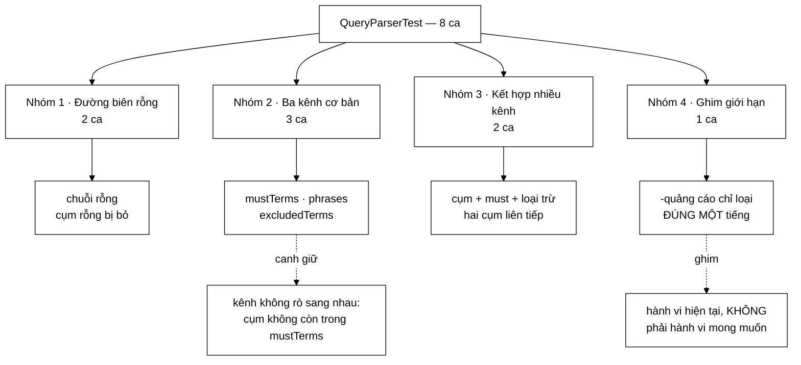

# QueryParserTest — một trong tám ca không canh giữ điều đúng, mà **ghim chặt một giới hạn đã biết**

**File nguồn:** `search-engine/src/test/java/com/vnsearch/query/QueryParserTest.java` (72 dòng)
**Gói:** `com.vnsearch.query` · **Khung:** JUnit 5 · **Số ca:** 8
**Lớp được kiểm:** [`QueryParser.md`](../../../../../main/java/com/vnsearch/query/QueryParser.md)
**Đọc kèm:** [`CandidateResolverTest.md`](./CandidateResolverTest.md) · [`QueryAstTest.md`](./ast/QueryAstTest.md) · [`../index/VietnameseTokenizerTest.md`](../index/VietnameseTokenizerTest.md)

---

## 📌 Hiểu trong 30 giây

`QueryParser` cắt chuỗi người dùng gõ thành ba kênh: term bắt buộc, cụm trong
ngoặc kép, term bị loại trừ (và hai kênh mới hơn: nhóm `OR`, bộ lọc `site:`).
Tám ca ở đây phủ ba kênh đầu. Điều đáng chú ý nhất là ca thứ sáu:

```
   MỘT CA TEST GHIM GIỚI HẠN, KHÔNG GHIM TÍNH ĐÚNG
   ───────────────────────────────────────────────────────────
   dashOnlyExcludesTheSingleFollowingSyllable

     parse("-quảng cáo")
        excludedTerms = ["quảng"]      ← chỉ MỘT tiếng bị loại
        mustTerms     = ["cáo"]        ← tiếng thứ hai thành bắt buộc

   Đây KHÔNG phải hành vi mong muốn. Người gõ "-quảng cáo" muốn
   loại cả cụm. Nhưng ca test khẳng định đúng hành vi HIỆN TẠI,
   kèm chú thích "Gioi han da biet".

   ⇒ Giá trị của nó: khi ai đó sửa parser cho đúng ý người dùng,
     ca này ĐỎ và buộc họ nhìn lại — thay vì hành vi lặng lẽ đổi
     và một truy vấn nào đó ở tầng trên hỏng theo.
```

Và một cặp khẳng định trông thừa nhưng là hàng rào chính của cả lớp:

```
   quotedPhraseIsExtractedSeparately:
       assertTrue(parsed.mustTerms().isEmpty());   ← DÒNG QUAN TRỌNG NHẤT

   Cụm đã vào kênh phrases thì KHÔNG được còn trong mustTerms.
   Nếu còn, mọi tiếng của cụm bị đếm HAI lần trong
   queryTermFrequency và trọng số truy vấn sai — âm thầm.
```



---

## 1. Bố cục: 8 ca chia bốn nhóm

Bộ test không dùng `@Nested`, nhưng đọc theo thứ tự trong file thì bốn nhóm
hiện ra rõ:

```
   ┌─ NHÓM 1 · ĐƯỜNG BIÊN RỖNG ───────────────────────────────┐
   │  emptyQueryReturnsAllEmpty                                │
   │  blankPhraseIsIgnored                                     │
   └───────────────────────────────────────────────────────────┘
   ┌─ NHÓM 2 · MỖI KÊNH MỘT CA ───────────────────────────────┐
   │  simpleQueryProducesMustTermsOnly                         │
   │  quotedPhraseIsExtractedSeparately          ← quan trọng  │
   │  dashExcludesSingleWord                                   │
   └───────────────────────────────────────────────────────────┘
   ┌─ NHÓM 3 · BA KÊNH CÙNG LÚC ──────────────────────────────┐
   │  combinedQueryWithPhraseMustAndExclusion                  │
   │  multipleQuotedPhrasesAreAllExtracted                     │
   └───────────────────────────────────────────────────────────┘
   ┌─ NHÓM 4 · GHIM GIỚI HẠN ĐÃ BIẾT ─────────────────────────┐
   │  dashOnlyExcludesTheSingleFollowingSyllable  ← đáng đọc   │
   └───────────────────────────────────────────────────────────┘
```

Thứ tự "rỗng → từng kênh → kết hợp → giới hạn" đáng học lại: người đọc lần đầu
đi từ hình dạng đơn giản nhất tới hình dạng thật của một truy vấn người dùng, và
kết thúc bằng chỗ lớp này *chưa* làm được.

Một chi tiết khai báo đáng chú ý ngay đầu file:

```java
private final QueryParser parser = new QueryParser();
```

Một `parser` duy nhất dùng lại cho cả tám ca, không có `@BeforeEach`. Đây là lựa
chọn đúng vì `QueryParser` **không có trạng thái biến đổi** — nó chỉ giữ một
`Tokenizer` bất biến. Nếu một ngày lớp này thêm bộ nhớ đệm truy vấn, dòng khai
báo trên biến thành nguồn rò trạng thái giữa các ca và phải chuyển sang
`@BeforeEach`.

---

## 2. Nhóm 1 — hai đường rỗng khác nhau, không phải một

Trông giống nhau, nhưng hai ca này đi vào **hai nhánh mã hoàn toàn khác**:

```java
@Test
void emptyQueryReturnsAllEmpty() {
    QueryParser.ParsedQuery parsed = parser.parse("");
    assertTrue(parsed.mustTerms().isEmpty());
    assertTrue(parsed.phrases().isEmpty());
    assertTrue(parsed.excludedTerms().isEmpty());
}

@Test
void blankPhraseIsIgnored() {
    QueryParser.ParsedQuery parsed = parser.parse("tin tức \"\"");
    assertTrue(parsed.phrases().isEmpty());
}
```

```
   HAI NHÁNH KHÁC NHAU

   parse("")
     → chặn ngay ở đầu phương thức:
         if (rawQuery == null || rawQuery.isBlank()) return ParsedQuery rỗng
     → KHÔNG chạm tới regex, không chạm tới tokenizer.

   parse("tin tức \"\"")
     → chuỗi KHÔNG rỗng, đi hết đường bình thường
     → regex "([^\"]*)" KHỚP, group(1) = ""
     → bị lọc bởi:  if (!matcher.group(1).isBlank())
     → và phần ngoài ngoặc "tin tức " vẫn phải tokenize bình thường

   Bỏ dòng lọc isBlank() thì:
     phrases = [ [] ]   ← một danh sách RỖNG bên trong
   Sau đó PhraseNode(terms = []) .evaluate() trả List.of(),
   AndNode giao với rỗng ⇒ TOÀN BỘ truy vấn trả về 0 kết quả.

   TRIỆU CHỨNG: người dùng gõ dư một cặp nháy kép (rất dễ xảy ra
   khi sao chép từ nơi khác) và tìm kiếm chết câm — không lỗi,
   không thông báo, chỉ là trang trắng.
```

Điểm yếu của cặp ca này: `blankPhraseIsIgnored` **chỉ** khẳng định `phrases`
rỗng, không khẳng định `mustTerms` vẫn còn `tin tức`. Một cài đặt hỏng làm mất
luôn phần ngoài ngoặc vẫn xanh. Thêm một dòng
`assertFalse(parsed.mustTerms().isEmpty())` là đủ vá.

---

## 3. Nhóm 2 — ba kênh, và kênh nào cũng phải chứng minh mình **không rò sang kênh khác**

Đây là nhóm chở phần lõi. Điểm chung của cả ba ca: mỗi ca không chỉ khẳng định
kênh của mình có gì, mà còn khẳng định **các kênh kia không có gì thừa**.

### 3.1 `quotedPhraseIsExtractedSeparately` — ca giá trị nhất nhóm

```java
@Test
void quotedPhraseIsExtractedSeparately() {
    QueryParser.ParsedQuery parsed = parser.parse("\"trình duyệt web\"");
    assertTrue(parsed.mustTerms().isEmpty());
    assertEquals(1, parsed.phrases().size());
    assertEquals("trình_duyệt_web", parsed.phrases().get(0).get(0));
}
```

Dòng đầu tiên là dòng đáng giá nhất, và nó gắn thẳng với một khối chú thích
trong mã nguồn:

```
   // Giu lai phan NGOAI ngoac vao `remaining`; neu khong, cac tieng cua
   // cum se VUA la phrase VUA la mustTerm, bi dem hai lan trong
   // queryTermFrequency va lam sai trong so truy van.
```

```
   MỘT CÀI ĐẶT SAI RẤT TỰ NHIÊN

   Cách viết ngây thơ:
       1. dùng regex TÌM các cụm  → phrases
       2. tokenize CẢ chuỗi gốc   → mustTerms

   Với "\"trình duyệt web\"":
       phrases   = [["trình_duyệt_web"]]
       mustTerms = ["trình_duyệt_web"]      ← RÒ

   Hậu quả không phải "kết quả sai" mà là "ĐIỂM sai":
       queryTermFrequency("trình_duyệt_web") = 2 thay vì 1
       ⇒ trọng số truy vấn lệch
       ⇒ thứ hạng đổi, tài liệu đúng tụt xuống

   TRIỆU CHỨNG: tìm kiếm VẪN trả về kết quả, VẪN có vẻ hợp lý,
   chỉ là thứ tự hơi khác. Không có gì để mà nghi ngờ.

   Cài đúng: cắt cụm RA KHỎI chuỗi, chỉ tokenize phần còn lại.
       remaining = ""  ⇒ mustTerms = []
```

Chi tiết thứ hai đáng chú ý: giá trị kỳ vọng là `"trình_duyệt_web"` — **một**
term, không phải ba. Ca test này vì vậy **cũng** kiểm gián tiếp rằng cụm được
tokenize như một đơn vị và từ điển từ ghép nhận ra "trình duyệt web". Đây là
kiểu ràng buộc chéo cần biết trước khi đọc kết quả đỏ (xem mục 6).

### 3.2 `simpleQueryProducesMustTermsOnly` — nơi bộ test dính vào từ điển

```java
QueryParser.ParsedQuery parsed = parser.parse("máy tính");
assertEquals(1, parsed.mustTerms().size());
assertEquals("máy_tính", parsed.mustTerms().get(0));
```

```
   RÀNG BUỘC NGẦM

   "máy tính"  →  1 term, không phải 2.

   Điều này KHÔNG do QueryParser quyết định. Nó do
   VietnameseTokenizer + từ điển từ ghép quyết định.

   ⇒ Xoá "máy tính" khỏi vietnamese-bigrams.txt
     → ca này đỏ, dù QueryParser không đổi một dòng nào.

   Đây là loại phụ thuộc mà QueryAstTest ĐÃ bị dính một lần thật
   (từ điển tăng từ 154 lên 40.000 mục, một tiền đề test cũ
   không còn đúng). Xem QueryAstTest.md mục 5.
```

Có nên coi đây là điểm yếu không? Có, nhưng đổi lại nó canh giữ **bất biến quyết
định** của lớp: truy vấn phải tokenize bằng chính tokenizer đã dùng lúc index.
`CandidateResolverTest` chọn hướng ngược lại — dựng corpus toàn từ đơn để tránh
hẳn phụ thuộc từ điển. Hai lựa chọn khác nhau, mỗi cái đúng ở chỗ của nó.

### 3.3 `dashExcludesSingleWord`

```java
QueryParser.ParsedQuery parsed = parser.parse("tin tức -giá");
assertTrue(parsed.excludedTerms().contains("giá"));
assertTrue(parsed.mustTerms().stream().noneMatch(t -> t.equals("giá")));
```

Lại đúng khuôn mẫu "kênh của tôi có, kênh kia không có". Phép khẳng định thứ hai
bắt cài đặt quên `continue` sau khi ghi vào `excludedRaw` — một lỗi một dòng mà
hậu quả là truy vấn tự mâu thuẫn: `giá` vừa bắt buộc phải có, vừa bắt buộc phải
không có, và `AndNode` trả về rỗng vĩnh viễn.

---

## 4. Nhóm 3 — kết hợp, và một ca chỉ đếm

```java
@Test
void combinedQueryWithPhraseMustAndExclusion() {
    QueryParser.ParsedQuery parsed = parser.parse("\"máy tính\" giá -cũ");
    assertEquals(1, parsed.phrases().size());
    assertEquals("máy_tính", parsed.phrases().get(0).get(0));
    assertTrue(parsed.mustTerms().contains("giá"));
    assertTrue(parsed.excludedTerms().contains("cũ"));
}
```

Ca này là ca duy nhất trong file chạy **cả ba kênh trong một lần gọi**, nên nó
bắt được lớp lỗi mà ba ca đơn kênh ở nhóm 2 không bắt được:

```
   VÌ SAO CA ĐƠN KÊNH KHÔNG ĐỦ

   Xử lý dấu "-" nằm SAU bước cắt cụm và chạy trên `remaining`.
   Nếu bước cắt cụm tính sai chỉ số (lastEnd), phần còn lại bị
   lệch và toán tử "-" nằm ở vị trí khác.

     parse("-giá")            → không đi qua nhánh cắt cụm  → xanh
     parse("\"máy tính\"")    → không có dấu "-"            → xanh
     parse("\"máy tính\" giá -cũ") → đi qua CẢ HAI          → bắt được

   Một lỗi off-by-one trong `remaining.append(rawQuery, lastEnd,
   matcher.start())` chỉ hiện ra ở ca kết hợp.
```

Ca còn lại yếu hơn hẳn:

```java
@Test
void multipleQuotedPhrasesAreAllExtracted() {
    QueryParser.ParsedQuery parsed = parser.parse("\"trình duyệt\" \"máy tính\"");
    assertEquals(2, parsed.phrases().size());
}
```

| Ca | Kiểm gì | Bỏ sót gì |
|---|---|---|
| `combinedQueryWithPhraseMustAndExclusion` | Cả ba kênh, có giá trị cụ thể | — |
| `multipleQuotedPhrasesAreAllExtracted` | **Chỉ số lượng cụm** | Nội dung hai cụm, thứ tự của chúng, và `mustTerms` có rỗng không |

Một cài đặt gộp nhầm hai cụm thành `[["trình_duyệt"], ["trình_duyệt"]]` vẫn cho
`size() == 2` và ca này vẫn xanh. `assertEquals(List.of("trình_duyệt"),
parsed.phrases().get(0))` là dòng còn thiếu.

---

## 5. Nhóm 4 — ca ghim giới hạn, và vì sao kiểu ca này đáng viết

```java
@Test
void dashOnlyExcludesTheSingleFollowingSyllable() {
    // Gioi han da biet: "-quảng cáo" chi loai tru "quảng", "cáo" van la mustTerm.
    QueryParser.ParsedQuery parsed = parser.parse("-quảng cáo");
    assertEquals(java.util.List.of("quảng"), parsed.excludedTerms());
    assertEquals(java.util.List.of("cáo"), parsed.mustTerms());
}
```

```
   VÌ SAO PARSER LÀM VẬY

   Bước quét từ chia chuỗi bằng split("\\s+"):
       ["-quảng", "cáo"]

   Vòng lặp xét TỪNG TỪ một cách độc lập:
       "-quảng" bắt đầu bằng "-"  → excludedRaw
       "cáo"    không             → mustRaw

   Toán tử "-" trong cú pháp này gắn với MỘT TỪ, không gắn với
   một cụm. Muốn loại cả cụm phải viết  -"quảng cáo"  — nhưng
   cú pháp đó KHÔNG được hỗ trợ (regex cắt cụm chạy TRƯỚC, nên
   dấu "-" đứng trước dấu nháy bị rơi lại trong `remaining`
   thành một token "-" đơn độc và bị bỏ).

   HẬU QUẢ THẬT: người dùng gõ "tin tức -quảng cáo" nghĩ mình
   đang lọc quảng cáo. Thực tế họ đang YÊU CẦU tài liệu phải
   chứa "cáo" — một tiếng gần như không liên quan gì.
   Kết quả co lại bất thường và không ai hiểu vì sao.
```

Vì sao ca này đáng tồn tại dù nó khẳng định một hành vi *không mong muốn*:

```
   ① NÓ BIẾN MỘT GIỚI HẠN NGẦM THÀNH MỘT GIỚI HẠN CÓ TÊN.
      Trước khi có ca này, hành vi trên nằm trong đầu người viết
      parser. Sau khi có, nó nằm trong danh sách test.

   ② NÓ BUỘC LẦN SỬA TIẾP THEO PHẢI CÓ Ý THỨC.
      Ai đó làm "-" gắn với cụm sẽ thấy ca này đỏ, đọc chú thích,
      và biết mình đang thay đổi hợp đồng — chứ không phải vừa
      vô tình sửa một hành vi mà tầng trên đang dựa vào.

   ③ NÓ DÙNG assertEquals TRÊN CẢ DANH SÁCH, KHÔNG DÙNG contains.
      List.of("quảng") ≠ contains("quảng"):
      cách viết này còn khẳng định "cáo" KHÔNG lọt vào
      excludedTerms — tức ghim đúng RANH GIỚI của giới hạn.
```

Cách viết ở đây chặt hơn hẳn nhóm 2, nơi dùng `contains`. Đó là lựa chọn có lý:
với một giới hạn đang được ghim, mọi lệch khỏi hành vi hiện tại đều phải bị phát
hiện, kể cả lệch theo hướng "tốt hơn".

---

## 6. Kỹ thuật đáng học lại từ bộ test này

```
   ① KHẲNG ĐỊNH CẢ CÁI KHÔNG CÓ, KHÔNG CHỈ CÁI CÓ
      quotedPhraseIsExtractedSeparately:
          assertTrue(parsed.mustTerms().isEmpty())
      Với một lớp CHIA dữ liệu vào nhiều kênh, "kênh kia rỗng"
      là nửa quan trọng hơn của hợp đồng.

   ② GHIM GIỚI HẠN ĐÃ BIẾT BẰNG MỘT CA CÓ CHÚ THÍCH
      "// Gioi han da biet: ..."
      Ca test trở thành tài liệu về những gì lớp CHƯA làm được.

   ③ DÙNG assertEquals(List.of(...)) KHI MUỐN GHIM CHẶT
      dùng contains  → chấp nhận phần tử thừa
      dùng assertEquals → không chấp nhận
      Chọn cái nào là một quyết định, không phải thói quen.

   ④ MỘT CA CHẠY NHIỀU KÊNH CÙNG LÚC
      combinedQueryWithPhraseMustAndExclusion bắt được lỗi
      off-by-one giữa các bước mà ba ca đơn kênh bỏ lọt.

   ⑤ MỘT INSTANCE DÙNG CHUNG KHI LỚP KHÔNG CÓ TRẠNG THÁI
      private final QueryParser parser = new QueryParser();
      Không @BeforeEach — đúng, và cần đọc lại nếu lớp thêm cache.
```

---

## 7. Hướng dẫn thực hành

### 7.1 Chạy

```powershell
cd search-engine
.\mvnw.cmd test "-Dtest=QueryParserTest"
.\mvnw.cmd test "-Dtest=QueryParserTest#dashOnlyExcludesTheSingleFollowingSyllable"
```

Trên PowerShell **phải bọc `-Dtest=...` trong nháy kép**, nếu không dấu `=` bị
nuốt và Maven chạy toàn bộ bộ test.

Chạy cả gói truy vấn:

```powershell
.\mvnw.cmd test "-Dtest=com.vnsearch.query.*Test"
```

### 7.2 Đọc kết quả

```
[INFO] Running com.vnsearch.query.QueryParserTest
[INFO] Tests run: 8, Failures: 0, Errors: 0, Skipped: 0
```

Báo cáo chi tiết: `search-engine/target/surefire-reports/com.vnsearch.query.QueryParserTest.txt`

Có một cách xem nhanh hơn cả chạy test: lớp nguồn có sẵn `main` in ra cả năm
kênh cho ba truy vấn mẫu.

```powershell
.\mvnw.cmd -q exec:java "-Dexec.mainClass=com.vnsearch.query.QueryParser"
```

### 7.3 Tự kiểm chứng — cố tình làm hỏng để xem ca nào đỏ

| Sửa gì trong `QueryParser.java` | Ca dự kiến đỏ |
|---|---|
| Bỏ `remaining`, tokenize thẳng `rawQuery` | `quotedPhraseIsExtractedSeparately` (dòng `mustTerms().isEmpty()`) và `combinedQueryWithPhraseMustAndExclusion` |
| Bỏ điều kiện `if (!matcher.group(1).isBlank())` | `blankPhraseIsIgnored` |
| Bỏ dòng chặn `rawQuery.isBlank()` ở đầu `parse` | **Không ca nào đỏ** — `split("\\s+")` trên chuỗi rỗng cho mảng một phần tử rỗng, và phần tử đó bị `if (word.isEmpty()) continue` bỏ qua. Xem mục 9. |
| Quên `continue`/`else` sau khi ghi `excludedRaw` | `dashExcludesSingleWord` (phép khẳng định thứ hai), `dashOnlyExcludesTheSingleFollowingSyllable` |
| Đổi `word.length() > 1` thành `word.length() >= 1` | **Không ca nào đỏ** — không có ca nào gõ một dấu `-` đơn độc |
| Cho `-` gắn với cả cụm theo sau | `dashOnlyExcludesTheSingleFollowingSyllable` — đúng như thiết kế của ca đó |
| Xoá `máy tính` khỏi từ điển từ ghép | `simpleQueryProducesMustTermsOnly`, `combinedQueryWithPhraseMustAndExclusion` — dù `QueryParser` không đổi dòng nào |
| `PHRASE_PATTERN` đổi `[^\"]*` thành `.*` (tham lam) | `multipleQuotedPhrasesAreAllExtracted` — hai cụm bị nuốt thành một |

Hai dòng "không ca nào đỏ" là kết quả có giá trị nhất của bảng này: chúng chỉ
đúng vào hai khoảng trống thật ở mục 9.

### 7.4 Cạm bẫy khi viết thêm ca cho lớp này

```
   ✗ Đừng viết kỳ vọng là danh sách các TIẾNG rời.
     parse("máy tính") cho ["máy_tính"], không phải ["máy","tính"].
     Kết quả phụ thuộc từ điển từ ghép, không phụ thuộc parser.

   ✗ Đừng dùng contains() cho ca ghim giới hạn.
     contains chấp nhận phần tử thừa, tức chấp nhận đúng thứ
     mà một ca ghim giới hạn cần bắt.

   ✗ Đừng quên khẳng định các kênh CÒN LẠI.
     Lớp này chia dữ liệu vào năm kênh; kiểm một kênh mà bỏ bốn
     kênh kia là bỏ qua nửa hợp đồng.

   ✗ Đừng viết ca cho OR và site: ở file này rồi để nguyên
     ca cũ trong QueryAstTest — sẽ thành hai bản sao trôi lệch.
     Xem mục 9, chỗ hai toán tử đó đang nằm nhầm nhà.
```

---

## 8. Bảng tổng hợp 8 ca

| # | Ca test | Nhóm | Tính chất được canh giữ |
|---|---|---|---|
| 1 | `emptyQueryReturnsAllEmpty` | 1 | Chuỗi rỗng cho ba kênh rỗng, không ném ngoại lệ |
| 2 | `blankPhraseIsIgnored` | 1 | `""` không sinh ra cụm rỗng làm chết cả truy vấn |
| 3 | `simpleQueryProducesMustTermsOnly` | 2 | Từ ghép ra **một** term; hai kênh kia rỗng |
| 4 | **`quotedPhraseIsExtractedSeparately`** | 2 | **Cụm bị cắt RA KHỎI chuỗi — chống đếm hai lần** |
| 5 | `dashExcludesSingleWord` | 2 | Term bị loại trừ không đồng thời là term bắt buộc |
| 6 | **`combinedQueryWithPhraseMustAndExclusion`** | 3 | **Ba kênh chạy cùng lúc — bắt lệch chỉ số giữa các bước** |
| 7 | `multipleQuotedPhrasesAreAllExtracted` | 3 | Nhiều cụm đều được lấy (chỉ kiểm số lượng) |
| 8 | **`dashOnlyExcludesTheSingleFollowingSyllable`** | 4 | **Ghim giới hạn: `-` gắn với một tiếng, không gắn với cụm** |

---

## 9. Khoảng trống chưa phủ

```
   ✗ TOÁN TỬ OR VÀ site: KHÔNG CÓ CA NÀO Ở FILE NÀY.

     Cả hai đều là tính năng của QueryParser, cả hai đều có mã
     phức tạp hơn hẳn phần đã được phủ:
        • OR: gom dãy liên tiếp "a OR b OR c" thành MỘT nhóm,
          rút phần tử cuối khỏi mustRaw, nhảy chỉ số i thủ công
        • site:: chuẩn hoá về chữ thường, bỏ nếu host rỗng

     Chúng CÓ được kiểm — nhưng ở QueryAstTest:
        parserBuildsOrTreeFromKeyword
        parserExtractsSiteOperator

     Đó là chỗ sai nhà. QueryAstTest lẽ ra chỉ kiểm cây biểu
     thức; hai ca kia kiểm PARSER. Hệ quả thực tế: đọc danh sách
     ca của QueryParserTest, người ta kết luận nhầm rằng parser
     chỉ hỗ trợ ba cú pháp.

     Và cả hai ca đó cũng chỉ kiểm bề mặt: describe() có chứa
     chuỗi "OR" không, siteFilter có bằng "vnexpress.net" không.
     KHÔNG ca nào kiểm dãy "a OR b OR c" gom thành một nhóm ba
     phần tử — đúng chỗ vòng lặp nhảy chỉ số dễ sai nhất.

   ✗ parse(null) — có nhánh xử lý riêng, không ca nào chạm.

   ✗ Chuỗi chỉ có khoảng trắng "   ".
     CandidateResolverTest CÓ kiểm (emptyQuery), QueryParserTest
     thì không — nên nếu nhánh isBlank() hỏng, ca đỏ nằm ở file
     khác và chỉ đúng nguyên nhân sau một hồi truy ngược.

   ✗ Dấu nháy kép LẺ: parse("máy \"tính").
     Regex không khớp, cả phần đuôi rơi vào mustTerms kèm dấu
     nháy. Hành vi hiện tại không được định nghĩa ở đâu.

   ✗ Một dấu "-" đơn độc, và "--tu".
     Mã có nhánh riêng (word.length() > 1 và !word.equals("-"))
     nhưng không ca nào đi qua.

   ✗ buildAst() KHÔNG được kiểm ở file này chút nào.
     Nó là phương thức công khai thứ hai của lớp. Toàn bộ phần
     phủ nó nằm ở QueryAstTest.

   ✗ Constructor nhận Tokenizer — bất biến quyết định lớn nhất
     của lớp (Javadoc dành hẳn một khối cho nó) không có ca nào
     chứng minh là parser DÙNG tokenizer được truyền vào.
```

Hai ca đáng viết trước nhất:

```java
@Test
void chuoiOrLienTiepGomThanhMotNhomBaVe() {
    QueryParser.ParsedQuery parsed = parser.parse("laptop OR macbook OR chromebook");
    assertEquals(1, parsed.orGroups().size(), "Phải là MỘT nhóm, không phải hai");
    assertEquals(3, parsed.orGroups().get(0).size(), "Nhóm phải có đủ ba vế");
    assertTrue(parsed.mustTerms().isEmpty(), "Vế đầu phải được RÚT khỏi mustTerms");
}

@Test
void parserDungDungTokenizerDuocTruyenVao() {
    // Tokenizer giả: mỗi tiếng là một token, không ghép từ ghép.
    Tokenizer tachTung = text -> { /* ... */ };
    QueryParser rieng = new QueryParser(tachTung);
    assertEquals(List.of("máy", "tính"), rieng.parse("máy tính").mustTerms(),
            "Parser phải dùng tokenizer TRUYỀN VÀO, không phải tự tạo cái mặc định");
}
```

Ca thứ hai canh giữ đúng bất biến mà Javadoc gọi là "BAT BIEN QUYET DINH": nếu
`QueryParser` lặng lẽ tự tạo `new VietnameseTokenizer()` bên trong thay vì dùng
cái được truyền vào, thì `EvaluationHarness` — nơi cố ý truyền tokenizer riêng —
sẽ đo một đường đi khác với đường đi thật, và mọi con số đánh giá mất giá trị mà
không có triệu chứng nào.

---

## 10. Liên kết

- Lớp được kiểm, kèm giải thích từng bước phân tích và bất biến tokenizer: [`QueryParser.md`](../../../../../main/java/com/vnsearch/query/QueryParser.md)
- Nơi hai toán tử `OR` và `site:` đang được kiểm nhầm nhà — đọc để thấy khoảng trống ở mục 9: [`QueryAstTest.md`](./ast/QueryAstTest.md)
- Người tiêu thụ trực tiếp của `ParsedQuery`, và là nơi việc chia kênh sai gây hậu quả: [`CandidateResolverTest.md`](./CandidateResolverTest.md)
- Nguồn của ràng buộc "máy tính → một term": bộ test của tokenizer và từ điển từ ghép: [`../index/VietnameseTokenizerTest.md`](../index/VietnameseTokenizerTest.md)
- Cây biểu thức mà `buildAst` dựng ra từ `ParsedQuery`: [`QueryNode.md`](../../../../../main/java/com/vnsearch/query/ast/QueryNode.md)
- Đo đầu-cuối, nơi một lỗi phân tích truy vấn hiện ra dưới dạng MRR tụt: [`../eval/RankingQualityTest.md`](../eval/RankingQualityTest.md)
