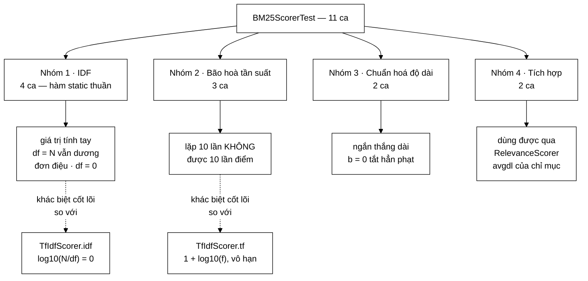

# BM25ScorerTest — ba ca test tương ứng đúng ba lời hứa mà Javadoc của `BM25Scorer` nói nó hơn TF-IDF

**File nguồn:** `search-engine/src/test/java/com/vnsearch/ranking/BM25ScorerTest.java` (147 dòng)
**Gói:** `com.vnsearch.ranking` · **Khung:** JUnit 5 · **Số ca:** 11 · **Thời gian chạy:** ~0,30 s
**Lớp được kiểm:** [`BM25Scorer.md`](../../../../../main/java/com/vnsearch/ranking/BM25Scorer.md)
**Đọc kèm:** [`TfIdfScorerTest.md`](./TfIdfScorerTest.md) · [`ScorerDecoratorTest.md`](./ScorerDecoratorTest.md) · [`../index/InvertedIndexTest.md`](../index/InvertedIndexTest.md)

---

## 📌 Hiểu trong 30 giây

Javadoc của `BM25Scorer` mở đầu bằng một khẳng định có thể sai: *"BM25 hơn
TF-IDF cosine ở ba điểm"*. Bộ test này không tin lời khẳng định đó — nó **kiểm
từng điểm một**, và mỗi điểm có ít nhất một ca test riêng.

```
   LỜI HỨA TRONG JAVADOC            →  CA TEST CANH GIỮ NÓ
   ─────────────────────────────────────────────────────────────────
   ① Tần suất bão hoà, có TRẦN      →  termFrequencySaturates
                                        (many < few * 3)

   ② Chuẩn hoá độ dài có THAM SỐ b  →  shorterDocumentWinsWhen…
                                        bParameterZeroDisablesLength…
                                        (b = 0 ⇒ hai độ dài BẰNG điểm)

   ③ IDF không bao giờ ≤ 0          →  idfStaysPositiveEvenForTerm…
                                        (df = N ⇒ vẫn 0,04652 > 0)

   ⇒ Không có lời hứa nào trong tài liệu mà không có ca test.
     Đó là thứ hiếm, và là điểm mạnh nhất của bộ test này.
```

Ba ca ở nhóm ①②③ đều được viết dưới dạng **so sánh tương đối**
(`assertTrue(a > b)`) chứ không phải khớp con số tuyệt đối — trừ nhóm IDF, nơi
công thức đóng nên tính tay được và bộ test tính tay thật.



---

## 1. Bố cục: 11 ca chia bốn nhóm — và ở đây nhóm được **viết ra**

Khác với `TrieTest` (nhóm chỉ hiện ra khi đọc theo thứ tự), file này khai báo
nhóm tường minh bằng chú thích phân cách:

```
   ┌─ // ---------- IDF ----------  (4 ca) ─────────────────────────┐
   │  idfMatchesHandComputedValue                                    │
   │  idfStaysPositiveEvenForTermInEveryDocument   ← khác biệt ③     │
   │  rarerTermsGetHigherIdf                                         │
   │  idfIsZeroForUnknownTerm                                        │
   └─────────────────────────────────────────────────────────────────┘
   ┌─ // ---------- Bão hoà tần suất ----------  (3 ca) ────────────┐
   │  termFrequencySaturates                       ← khác biệt ①     │
   │  scoreIsZeroWhenTermAbsentFromDocument                          │
   │  emptyIndexScoresZero                                           │
   └─────────────────────────────────────────────────────────────────┘
   ┌─ // ---------- Chuẩn hoá độ dài ----------  (2 ca) ────────────┐
   │  shorterDocumentWinsWhenTermFrequencyIsEqual                    │
   │  bParameterZeroDisablesLengthNormalisation    ← khác biệt ②     │
   └─────────────────────────────────────────────────────────────────┘
   ┌─ // ---------- Tích hợp ----------  (2 ca) ────────────────────┐
   │  isUsableAsRelevanceScorerAlongsideTfIdf                        │
   │  averageDocLengthIsTrackedCorrectly                             │
   └─────────────────────────────────────────────────────────────────┘
```

Ba nhóm đầu ánh xạ **một-một** với ba đoạn `<p>1.` `<p>2.` `<p>3.` trong
Javadoc của `BM25Scorer`. Đó là cách tổ chức đáng bắt chước: khi tài liệu lớp
nêu N luận điểm, bộ test nên có N nhóm mang đúng tên đó, để người sửa lớp biết
ngay mình vừa phá luận điểm nào.

Nhóm 4 thì lệch tông một chút — nó không kiểm BM25 nữa mà kiểm **khả năng thay
thế** và **chỉ mục**. Xem mục 6.

---

## 2. Nhóm IDF — nhóm duy nhất khớp con số tuyệt đối, và đó là lựa chọn đúng

`BM25Scorer.idf` là hàm `static` thuần: hai `int` vào, một `double` ra, không
đụng gì tới chỉ mục. Vì thế nó là phần duy nhất của lớp mà **tính tay được**, và
bộ test tính tay thật:

```java
@Test
void idfMatchesHandComputedValue() {
    // N=10, df=5 -> ln(1 + (10-5+0.5)/(5+0.5)) = ln(1 + 5.5/5.5) = ln(2) = 0.6931472
    assertEquals(0.6931472, BM25Scorer.idf(10, 5), 1e-7);
}
```

Cặp `(N, df) = (10, 5)` không được chọn ngẫu nhiên. Nó được chọn để **tử số
bằng mẫu số**:

```
   N = 10, df = 5

     (N − df + 0.5)     (10 − 5 + 0.5)     5.5
     ──────────────  =  ──────────────  =  ───  =  1
      (df + 0.5)          (5 + 0.5)        5.5

     ⇒ idf = ln(1 + 1) = ln 2 = 0,6931472

   Vì sao chọn cặp này thay vì (100, 7)?
   Vì kết quả là MỘT HẰNG SỐ AI CŨNG NHẬN RA. Người đọc thấy
   0.6931472 là biết ngay ln 2, và tự kiểm được phép tính trong
   đầu. Với (100, 7) thì con số trong assert chỉ là "một dãy chữ
   số ai đó chép từ output" — và nếu công thức sai từ đầu, dãy
   chữ số đó sẽ ghi lại đúng cái sai.
```

Đây là cạm bẫy phổ biến nhất khi test hàm số học: chạy hàm, chép kết quả vào
`assertEquals`, ca test xanh vĩnh viễn nhưng **không canh giữ gì cả** ngoài
"đừng thay đổi". Chọn đầu vào cho ra hằng số nhận biết được là cách thoát khỏi
cạm bẫy đó mà không cần bảng giá trị tham chiếu bên ngoài.

### 2.1 Ca quan trọng nhất cả file: `idfStaysPositiveEvenForTermInEveryDocument`

```java
@Test
void idfStaysPositiveEvenForTermInEveryDocument() {
    // Đây là khác biệt then chốt so với TF-IDF: log10(N/df) = log10(10/10) = 0,
    // còn BM25 cho ln(1 + 0.5/10.5) = ln(1.047619) = 0.0465200 > 0.
    // Nhờ vậy term phổ biến chỉ bị GIẢM trọng số chứ không bị triệt tiêu hoàn toàn.
    double idf = BM25Scorer.idf(10, 10);
    assertEquals(0.0465200, idf, 1e-7);
    assertTrue(idf > 0, "IDF của BM25 không bao giờ được âm hay bằng 0");
}
```

Ca này có **hai** phép khẳng định làm hai việc khác nhau, và cả hai đều cần:

| Phép khẳng định | Canh giữ điều gì | Hỏng khi nào |
|---|---|---|
| `assertEquals(0.0465200, …, 1e-7)` | Đúng **công thức** Robertson–Sparck Jones | Ai đó đổi `+0.5` thành `+1.0`, hoặc đổi cơ số log |
| `assertTrue(idf > 0, …)` | Đúng **tính chất** — điều thật sự quan trọng | Ai đó "đơn giản hoá" thành `Math.log((double) N / df)` |

Phép thứ hai trông thừa (nếu số đã bằng 0,04652 thì hiển nhiên > 0). Nó không
thừa: nó ghi lại **ý định** vào mã nguồn. Khi người sau đổi công thức và ca test
đỏ, họ đọc thông điệp `"IDF của BM25 không bao giờ được âm hay bằng 0"` là hiểu
ngay mình vừa phá cái gì — thay vì thấy `expected 0.0465200 but was 0.0` và kết
luận "chắc hằng số cũ lỗi thời, sửa lại là xong".

```
   VÌ SAO idf > 0 LÀ TÍNH CHẤT SỐNG CÒN

   Biến thể ngây thơ  idf = log(N / df)  hoá ÂM khi df > N/2.

     N = 5.011, term "của" xuất hiện ở 4.800 tài liệu
     log(5011 / 4800) = log(1,044) = +0,019      (vẫn dương, may)

     N = 5.011, term "và"  xuất hiện ở 5.011 tài liệu
     log(5011 / 5011) = log(1)     =  0,000      (triệt tiêu)

   Với biến thể log((N − df)/df) thì còn tệ hơn: nó ÂM, tức tài
   liệu CHỨA từ khoá bị TRỪ điểm vì chứa từ khoá.

   Triệu chứng ở môi trường thật: gõ truy vấn nhiều từ dừng
   ("giá của máy tính") thì các trang chứa đủ cả bốn từ lại xếp
   DƯỚI trang chỉ chứa "máy tính". Người dùng báo "tìm càng
   chi tiết càng ra kết quả tệ" — một triệu chứng cực khó lần ra
   nếu không có ca test này.
```

### 2.2 Hai ca còn lại — rẻ tiền nhưng bịt hai lỗ khác nhau

```java
@Test
void rarerTermsGetHigherIdf() {
    assertTrue(BM25Scorer.idf(1000, 5) > BM25Scorer.idf(1000, 500),
            "Term hiếm phải mang nhiều thông tin phân biệt hơn");
}
```

Ca này kiểm **tính đơn điệu giảm theo `df`**. Nó bắt được một lỗi mà ca tính tay
ở trên **không** bắt được: đảo chiều phân số (`(df + 0.5) / (N − df + 0.5)`).
Với `N = 10, df = 5` phân số vẫn bằng 1 nên `idfMatchesHandComputedValue` vẫn
xanh — đúng cặp số làm hằng số đẹp lại là cặp số **mù** với lỗi đảo chiều. Hai
ca bù cho nhau chính xác ở chỗ này.

`idfIsZeroForUnknownTerm` kiểm `idf(100, 0) == 0.0`. Không có nhánh này thì
`documentFrequency = 0` cho `(N + 0.5) / 0.5` — không nổ, không `NaN`, chỉ là
một **IDF khổng lồ cho một term không tồn tại**. Cộng với `termFrequency = 0` ở
mọi tài liệu thì kết quả cuối vẫn là 0, nên lỗi này im lặng tuyệt đối — cho tới
khi ai đó dùng `idf` cho việc khác (gợi ý truy vấn, chấm trọng số câu hỏi).

---

## 3. `termFrequencySaturates` — ca đáng đọc nhất, và cũng là ca lỏng nhất

```java
InvertedIndex index = new InvertedIndex();
index.addDocument(doc(0, "Máy tính", "máy tính ".repeat(3) + "tin tức hôm nay"));
index.addDocument(doc(1, "Máy tính", "máy tính ".repeat(30) + "tin tức hôm nay"));
index.addDocument(doc(2, "Khác", "nấu ăn công thức món ngon gia đình"));

BM25Scorer scorer = new BM25Scorer();
Map<String, Integer> query = Map.of("máy_tính", 1);
double few = scorer.score(query, 0, index);
double many = scorer.score(query, 1, index);

assertTrue(many > few, "Lặp nhiều hơn vẫn phải được điểm cao hơn");
assertTrue(many < few * 3,
        "Lặp gấp 10 lần chỉ được tăng điểm rất hạn chế (bão hoà), thực tế "
                + few + " -> " + many);
```

### 3.1 Hai phép khẳng định là **hai vế của một mệnh đề**

Đây là mẫu đáng học lại nhất trong cả gói `ranking`:

```
   Bão hoà KHÔNG phải "điểm ngừng tăng".
   Bão hoà là "vẫn tăng, nhưng tăng chậm dần tới một trần".

   Phát biểu đó CẦN hai bất đẳng thức, không thể một:

       many > few          ← còn tăng      (chặn dưới)
       many < few * 3      ← tăng có trần  (chặn trên)

   Bỏ chặn dưới  ⇒ cài đặt "luôn trả 0" vẫn xanh.
   Bỏ chặn trên  ⇒ cài đặt tf = f (tuyến tính thuần) vẫn xanh —
                    mà đó chính là thứ BM25 sinh ra để tránh.
```

### 3.2 Con số thật, và ngưỡng `* 3` lỏng tới mức nào

Chạy thật trên chỉ mục ba tài liệu ở trên:

| Đại lượng | doc0 (`repeat(3)`) | doc1 (`repeat(30)`) |
|---|---|---|
| `getTermFrequency("máy_tính", …)` | **4** | **31** |
| `getDocLength(…)` | 6 | 33 |
| `BM25Scorer().score(…)` | 0,88756 | 0,96317 |

Tỷ lệ thật là **1,085** — trong khi ngưỡng canh giữ là **3,0**. Tức ca test có
biên độ dư gần **ba lần**. Nói thẳng: ngưỡng này lỏng, và một cài đặt bão hoà
sai lệch vừa phải (ví dụ dùng `f/(f + k1)` mà quên phần chuẩn hoá độ dài) vẫn
có thể lọt qua. Ngưỡng `* 1,5` sẽ chặt hơn nhiều mà vẫn an toàn.

Nhưng đây là một đánh đổi có lý do: điểm BM25 phụ thuộc `avgdl` của **toàn
corpus**, mà corpus ở đây chỉ có ba tài liệu. Thêm hoặc bớt một tài liệu mẫu là
`avgdl` đổi, và tỷ lệ đổi theo. Ngưỡng lỏng làm ca test **không giòn** khi ai đó
sửa dữ liệu mẫu. Thông điệp lỗi có nối `few + " -> " + many` chính là để bù cho
sự lỏng đó: lúc đỏ, đọc log là biết ngay tỷ lệ thật bao nhiêu.

### 3.3 Chi tiết dễ bỏ qua: `tf = 4` chứ không phải 3

`repeat(3)` sinh ba lần `"máy tính "` trong thân bài, nhưng tần suất đo được là
**4**. Lý do nằm ở `InvertedIndex.indexableText`: nó ghép **tiêu đề + mô tả +
thân bài** rồi mới tách từ. Tiêu đề `"Máy tính"` đóng góp lần thứ tư.

```
   doc0:  title = "Máy tính"          → 1 token máy_tính
          body  = "máy tính " x3 …    → 3 token máy_tính
          ─────────────────────────────────────────────
          tf = 4,  docLength = 6

   Hệ quả: mọi ca test trong gói ranking dựng tài liệu bằng
   hàm doc(id, title, body) đều đang ngầm đưa TIÊU ĐỀ vào chỉ mục.
   Đặt tiêu đề "Máy tính" cho một tài liệu lẽ ra "không liên quan"
   là đủ để làm hỏng một ca test mà không hiểu vì sao.
```

Chú thích trong ca test còn ghi lại một điều nữa đáng giữ:

> *Dùng "máy tính" vì nó CÓ trong từ điển bigram nên được ghép thành một token
> "máy_tính"; các cụm chưa có trong từ điển sẽ bị tách rời.*

Đây là ghi chú **chống bẫy cho người viết ca tiếp theo**. Nếu bạn đổi từ khoá
mẫu sang một cụm không có trong từ điển ghép từ, truy vấn `Map.of("abc_xyz", 1)`
sẽ không khớp gì và ca test đỏ với lý do hoàn toàn không liên quan tới BM25.
Xem [`../index/MaxWeightSegmenterTest.md`](../index/MaxWeightSegmenterTest.md).

### 3.4 Hai ca bao vây còn lại

`scoreIsZeroWhenTermAbsentFromDocument` và `emptyIndexScoresZero` bịt hai nhánh
thoát sớm khác nhau trong `prepare`:

```
   emptyIndexScoresZero
     → totalDocs == 0  ⇒  return docId -> 0.0
       Đây là nhánh CHỐNG CHIA 0: avgDocLength = 0 thì
       lengthNorm = k1*(1 − b + b*(len/0)) = NaN, và NaN
       lan ra toàn bộ bảng xếp hạng — mọi so sánh với NaN
       đều false nên MinHeap sắp xếp ra thứ tự tuỳ ý.

   scoreIsZeroWhenTermAbsentFromDocument
     → df > 0 (term có trong corpus) nhưng tf == 0 ở doc này
       ⇒ vòng lặp `if (termFrequency == 0) continue;`
       Đây là nhánh khác hẳn, và nếu quên nó thì công thức cho
       0 * (k1+1) / (0 + lengthNorm) = 0 — tình cờ vẫn đúng.
       Ca test vì vậy canh giữ KẾT QUẢ chứ không canh nhánh.
```

Javadoc của `prepare` có ghi chú thẳng về nhánh thứ nhất: `avgDocLength = 0` xảy
ra khi trạng thái dẫn xuất `totalTokens` chưa được tính lại sau khi nạp chỉ mục
từ file. Tức đây **không** phải nhánh lý thuyết — nó từng xảy ra thật. Xem
[`../index/IndexPersistenceTest.md`](../index/IndexPersistenceTest.md).

---

## 4. Nhóm chuẩn hoá độ dài — cặp ca "bật/tắt cùng một tính năng"

Hai ca này dùng **đúng cùng một chỉ mục ba tài liệu** và **đúng cùng một truy
vấn**, chỉ khác tham số `b`:

```java
// Ca 1: b = DEFAULT_B = 0.75
assertTrue(scorer.score(query, 0, index) > scorer.score(query, 1, index),
        "Tài liệu ngắn hơn với cùng tf phải xếp trên");

// Ca 2: b = 0.0
BM25Scorer noNorm = new BM25Scorer(BM25Scorer.DEFAULT_K1, 0.0);
assertEquals(noNorm.score(query, 0, index), noNorm.score(query, 1, index), 1e-9,
        "Với b=0, độ dài tài liệu không được ảnh hưởng tới điểm");
```

Số thật đo được:

| | `b = 0,75` (mặc định) | `b = 0` |
|---|---|---|
| doc0 (`docLength = 3`) | 0,74784 | 0,47000 |
| doc1 (`docLength = 92`) | 0,26965 | **0,47000** |
| Chênh lệch | 2,77 lần | **0** |

```
   VÌ SAO CẶP NÀY MẠNH HƠN HAI CA RỜI RẠC

   Ca 1 một mình: chứng minh "có phạt độ dài".
                  Nhưng KHÔNG chứng minh phạt đó đi qua tham số b —
                  một cài đặt chia cứng cho sqrt(len) như TF-IDF
                  vẫn làm ca 1 xanh.

   Ca 2 một mình: chứng minh "b = 0 thì hai điểm bằng nhau".
                  Nhưng KHÔNG chứng minh b > 0 làm được gì —
                  một cài đặt BỎ QUA độ dài hoàn toàn cũng xanh.

   Hai ca cùng nhau: b THẬT SỰ là công tắc, và nó nối đúng vào
                     đường tính điểm. Không ca nào một mình
                     kết luận được điều đó.
```

Chi tiết `assertEquals(..., 1e-9)` ở ca 2 đáng chú ý: với `b = 0`, biểu thức
`lengthNorm = k1 * (1 − 0 + 0 * (len/avgdl))` rút gọn thành hằng số `k1`, nên
hai điểm phải bằng nhau **chính xác từng bit** chứ không chỉ xấp xỉ. Dung sai
`1e-9` ở đây là bảo hiểm chống dồn sai số dấu phẩy động, không phải thừa nhận
sai lệch. Nếu ai đó viết `b * (len/avgdl)` thành `(b * len)/avgdl + 1e-12` thì
`1e-9` vẫn nuốt — nhưng lỗi kiểu đó không tồn tại trong thực tế.

Điều **không** được kiểm: tham số `k1`. Không có ca nào chứng minh `k1` có nối
vào đường tính điểm. Xem mục 8.

---

## 5. Nhóm tích hợp — hai ca lệch tông, và một ca thật sự không kiểm `BM25Scorer`

### 5.1 `isUsableAsRelevanceScorerAlongsideTfIdf` — ca canh giữ giao diện, không canh giữ BM25

```java
Map<String, Integer> query = Map.of("máy_tính", 1);
for (RelevanceScorer scorer : java.util.List.of(new BM25Scorer(), new TfIdfScorer())) {
    assertTrue(scorer.score(query, 0, index) > scorer.score(query, 1, index),
            scorer.name() + " phải xếp tài liệu đúng chủ đề lên trên");
}
```

Ca này lặp qua **cả hai** cài đặt của `RelevanceScorer` và đòi cả hai cùng thoả
một tính chất. Đó là một *contract test* thu nhỏ: nó phát biểu điều mà **mọi**
mô hình chấm điểm phải làm được, bất kể công thức.

```
   BA THỨ NÓ CANH GIỮ MÀ CÁC CA KHÁC KHÔNG

   ① BM25Scorer THẬT SỰ implements RelevanceScorer
      → nếu ai đó gỡ `implements`, ca này KHÔNG BIÊN DỊCH ĐƯỢC.
        Lỗi ở thời điểm biên dịch, mạnh hơn mọi assert.

   ② Hai scorer thay thế được cho nhau ở cùng chỗ gọi
      → chính là điều kiện để APP_RANKING_SCORER (bm25|tfidf)
        đổi được bằng cấu hình, không phải sửa mã.

   ③ name() được gọi trong thông điệp lỗi
      → giữ cho name() không trả về null; và lúc ca đỏ, log
        chỉ đúng scorer nào hỏng thay vì "một trong hai".
```

Chi tiết ③ đáng học lại: khi một ca test chạy vòng lặp trên nhiều cài đặt, thông
điệp khẳng định **bắt buộc** phải nêu được cài đặt nào đang chạy. Không có
`scorer.name() +` ở đầu thông điệp thì lúc đỏ bạn chỉ biết "vòng lặp hỏng ở đâu
đó".

### 5.2 `averageDocLengthIsTrackedCorrectly` — ca đặt nhầm file

```java
InvertedIndex index = new InvertedIndex();
assertEquals(0.0, index.getAverageDocLength(), 1e-9);

index.addDocument(doc(0, "A", "một hai ba"));
index.addDocument(doc(1, "B", "bốn năm sáu bảy tám chín"));

double expected = (index.getDocLength(0) + index.getDocLength(1)) / 2.0;
assertEquals(expected, index.getAverageDocLength(), 1e-9);
```

Ca này **không gọi `BM25Scorer` một lần nào**. Nó kiểm `InvertedIndex`. Lý do nó
nằm ở đây có thể đoán: `avgdl` là đại lượng duy nhất mà BM25 lấy từ chỉ mục
nhưng TF-IDF không dùng, nên nếu `getAverageDocLength` sai thì **chỉ mình BM25
hỏng** — và hỏng theo kiểu khó nhìn ra (điểm vẫn có, thứ hạng vẫn ra, chỉ là
sai).

Dù vậy, chỗ đúng của nó là [`../index/InvertedIndexTest.md`](../index/InvertedIndexTest.md).
Đặt ở đây có một tác hại thật: chạy `-Dtest=InvertedIndexTest` sẽ **không** chạy
nó, nên người sửa `InvertedIndex` không thấy ca này trong vòng phản hồi của
mình.

Chi tiết viết test thì lại rất tốt: `expected` được tính từ `getDocLength(0)` và
`getDocLength(1)` chứ không phải viết cứng `(3 + 6) / 2.0`. Nhờ vậy ca test kiểm
đúng **quan hệ** "trung bình = tổng / số lượng" mà không phụ thuộc vào cách
tokenizer đếm token — mà cách đó thì đổi theo từ điển ghép từ.

---

## 6. Song song với `TfIdfScorerTest` — hai bộ test cho hai chiến lược thay thế nhau

`BM25Scorer` và `TfIdfScorer` là hai nhánh của `switch` trong
[`ScorerFactory`](../../../../../main/java/com/vnsearch/ranking/ScorerFactory.md),
chọn bằng một dòng cấu hình `app.ranking.scorer`. Vì thế hai bộ test được viết
**song song có chủ ý**:

| | `TfIdfScorerTest` (8 ca) | `BM25ScorerTest` (11 ca) |
|---|---|---|
| Kiểm `tf` static | 2 ca (`tfIsZeroForZeroFrequency`, `tfIsLogNormalized`) | **không có** — BM25 không tách `tf` ra hàm riêng |
| Kiểm `idf` static | 3 ca | 4 ca |
| `idf` khi `df = N` | `assertEquals(0.0, …)` | `assertEquals(0.0465200, …)` + `assertTrue(> 0)` |
| `idf` khi `df = 0` | có | có |
| Bão hoà tần suất | **không có** — TF-IDF không bão hoà | 1 ca, hai vế bất đẳng thức |
| Chuẩn hoá độ dài | **không có** | 2 ca (bật / tắt bằng `b`) |
| Tham số hàm dựng | không có tham số | 1 ca dùng `b = 0`; **`k1` không được kiểm** |
| Ca "đúng chủ đề xếp trên" | `docContainingTermScoresHigherThanDocWithout` | `isUsableAsRelevanceScorerAlongsideTfIdf` (kiểm cả hai) |

### 6.1 Khác biệt thật, không phải khác biệt hình thức

```
   ĐIỂM ① — CÔNG THỨC idf KHI df = N

     TfIdfScorer.idf(10, 10) = log10(10/10) = log10(1) = 0
     BM25Scorer.idf(10, 10)  = ln(1 + 0.5/10.5)        = 0,04652

     Hai bộ test KHẲNG ĐỊNH NGƯỢC NHAU trên cùng đầu vào,
     và cả hai đều đúng. Đây là chỗ dễ nhầm nhất khi ai đó
     "hợp nhất hai hàm idf cho gọn": một trong hai ca sẽ đỏ,
     và đó là điều mong muốn.

   ĐIỂM ② — HÀNH VI KHI LẶP TỪ KHOÁ

     Trên cùng chỉ mục của termFrequencySaturates:
       BM25   : 0,88756 → 0,96317   (tăng  8,5 %)
       TF-IDF : 0,11517 → 0,07637   (GIẢM 33,7 %)

     TF-IDF ở đây không chỉ "tăng chậm hơn" — nó GIẢM, vì
     docNorm = sqrt(docLength) phạt tài liệu dài nặng hơn
     phần tf = 1 + log10(f) thưởng. Đó chính là "xấp xỉ phạt
     mạnh hơn thực tế" mà Javadoc của TfIdfScorer tự thừa nhận.

     ⇒ Nếu ai đó bê ca termFrequencySaturates sang
       TfIdfScorerTest, nó sẽ đỏ ngay ở vế `many > few`.
       Ca này KHÔNG dùng chung được, và đó là lý do bộ test
       TF-IDF phải có ca riêng higherTermFrequencyInDocGivesHigherScore
       với dữ liệu ĐỘ DÀI GẦN BẰNG NHAU.

   ĐIỂM ③ — THAM SỐ

     TfIdfScorer  : không tham số, `new TfIdfScorer()`, hết.
     BM25Scorer   : hai tham số k1, b, có hằng số DEFAULT_*,
                    có kiểm tra khoảng ở hàm dựng.

     ⇒ BM25ScorerTest có thêm cả một nhóm ca không tồn tại
       ở phía TF-IDF — và vẫn còn thiếu (mục 8).
```

---

## 7. Kỹ thuật đáng học lại từ bộ test này

```
   ① CHỌN ĐẦU VÀO CHO RA HẰNG SỐ NHẬN BIẾT ĐƯỢC
      idf(10, 5) → ln 2 → 0.6931472
      Người đọc tự kiểm được. Không phải "số chép từ output".

   ② KHẲNG ĐỊNH CẢ GIÁ TRỊ LẪN TÍNH CHẤT
      assertEquals(0.0465200, idf, 1e-7);   ← công thức
      assertTrue(idf > 0, "…không bao giờ âm");  ← ý định
      Phép thứ hai trông thừa, nhưng nó là thứ người sửa mã đọc.

   ③ BÃO HOÀ CẦN HAI BẤT ĐẲNG THỨC
      many > few      (vẫn tăng)
      many < few * 3  (tăng có trần)
      Một vế thôi thì cài đặt sai lọt được.

   ④ CẶP CA BẬT / TẮT CÙNG MỘT THAM SỐ
      b = 0.75 → khác nhau
      b = 0.00 → BẰNG nhau
      Chứng minh tham số THẬT SỰ nối vào đường tính điểm.

   ⑤ VÒNG LẶP TRÊN MỌI CÀI ĐẶT CỦA GIAO DIỆN
      for (RelevanceScorer s : List.of(new BM25Scorer(), new TfIdfScorer()))
      → contract test; và gỡ `implements` là LỖI BIÊN DỊCH.

   ⑥ THÔNG ĐIỆP NỐI GIÁ TRỊ THẬT VÀ TÊN CÀI ĐẶT
      scorer.name() + " phải xếp…"
      few + " -> " + many
      → lúc đỏ, đọc log là đủ.

   ⑦ TÍNH expected TỪ API CHỨ KHÔNG VIẾT CỨNG
      double expected = (getDocLength(0) + getDocLength(1)) / 2.0;
      → ca test kiểm QUAN HỆ, không phụ thuộc cách đếm token.

   ⑧ CHÚ THÍCH GHI LẠI CẠM BẪY CỦA DỮ LIỆU MẪU
      "Dùng 'máy tính' vì nó CÓ trong từ điển bigram…"
      → người viết ca tiếp theo không sập bẫy.
```

---

## 8. Hướng dẫn thực hành

### 8.1 Chạy

```powershell
cd search-engine

# Cả 11 ca
.\mvnw.cmd test "-Dtest=BM25ScorerTest"

# Một ca
.\mvnw.cmd test "-Dtest=BM25ScorerTest#termFrequencySaturates"

# Cả hai bộ chấm điểm, để so sánh song song
.\mvnw.cmd test "-Dtest=BM25ScorerTest+TfIdfScorerTest"

# Cả gói ranking (41 ca)
.\mvnw.cmd test "-Dtest=com.vnsearch.ranking.*Test"
```

Trên PowerShell **phải bọc `-Dtest=...` trong nháy kép**, nếu không dấu `=` bị
nuốt và Maven chạy toàn bộ bộ test.

### 8.2 Đọc kết quả

```
-------------------------------------------------------------------------------
Test set: com.vnsearch.ranking.BM25ScorerTest
-------------------------------------------------------------------------------
Tests run: 11, Failures: 0, Errors: 0, Skipped: 0, Time elapsed: 0.295 s
```

Báo cáo chi tiết: `search-engine/target/surefire-reports/com.vnsearch.ranking.BM25ScorerTest.txt`

0,295 s là dài so với 0,018 s của `TfIdfScorerTest`. Chênh lệch không nằm ở BM25
mà ở việc lớp này là lớp **đầu tiên trong gói** dựng `InvertedIndex` thật, nên
nó chịu chi phí nạp từ điển ghép từ cho cả gói.

### 8.3 Tự kiểm chứng — cố tình làm hỏng để xem ca nào đỏ

| Sửa gì trong `BM25Scorer.java` | Ca dự kiến đỏ |
|---|---|
| `Math.log(1 + …)` → `Math.log((double) totalDocs / documentFrequency)` | `idfMatchesHandComputedValue`, **`idfStaysPositiveEvenForTermInEveryDocument`** |
| Đảo phân số: `(df + 0.5) / (N − df + 0.5)` | `rarerTermsGetHigherIdf` (nhưng **không** phải `idfMatchesHandComputedValue` — xem mục 2.2) |
| Đổi `+0.5` thành `+1.0` ở cả tử và mẫu | `idfMatchesHandComputedValue`, `idfStaysPositiveEvenForTermInEveryDocument` |
| Bỏ nhánh `if (documentFrequency <= 0) return 0.0;` | `idfIsZeroForUnknownTerm` |
| `total += idf * termFrequency` (bỏ mẫu số, tuyến tính thuần) | **`termFrequencySaturates`** ở vế `many < few * 3` |
| `total += idf * (k1 + 1)` (bỏ hẳn tf, hằng số) | `termFrequencySaturates` ở vế `many > few` |
| `lengthNorm = k1` (bỏ phần `b * len/avgdl`) | `shorterDocumentWinsWhenTermFrequencyIsEqual` |
| `lengthNorm = k1 * (1 − b + b * index.getDocLength(docId))` (quên chia `avgdl`) | `shorterDocumentWins…` **vẫn xanh**; `bParameterZeroDisables…` **vẫn xanh** — lỗi này KHÔNG bị bắt |
| Bỏ nhánh `if (totalDocs == 0 || avgDocLength <= 0)` | `emptyIndexScoresZero` (`NaN`, không phải ngoại lệ) |
| Gỡ `implements RelevanceScorer` | `isUsableAsRelevanceScorerAlongsideTfIdf` — **lỗi biên dịch** |
| `this.k1 = DEFAULT_K1;` (bỏ qua tham số `k1`) | **không ca nào đỏ** — xem mục 9 |
| Bỏ hai `throw new IllegalArgumentException` ở hàm dựng | **không ca nào đỏ** — xem mục 9 |
| `totalTokens` không cộng dồn trong `InvertedIndex` | `averageDocLengthIsTrackedCorrectly` |

Ba dòng cuối cho ra "không ca nào đỏ" là **khoảng trống thật**, không phải may
mắn. Đây chính là ý tưởng của *kiểm thử đột biến* (mutation testing) làm bằng
tay: dòng sửa nào không làm đỏ ca nào là dòng mã không được canh giữ.

### 8.4 Cạm bẫy khi viết thêm ca cho lớp này

```
   ✗ Đừng đặt tiêu đề chứa từ khoá cho tài liệu "không liên quan".
     doc(2, "Khác", …) được đặt tên như vậy có lý do: tiêu đề ĐI
     VÀO chỉ mục qua indexableText(). Đặt doc(2, "Máy tính khác", …)
     là làm doc2 khớp truy vấn và df đổi từ 2 thành 3 — mọi idf
     trong ca đổi theo.

   ✗ Đừng dùng cụm từ không có trong từ điển bigram làm từ khoá.
     Map.of("con_mèo", 1) sẽ không khớp gì, vì tokenizer không
     ghép "con mèo" thành một token. Ca test đỏ vì lý do hoàn
     toàn không liên quan tới BM25.

   ✗ Đừng khớp con số tuyệt đối cho score() trên chỉ mục thật.
     Chỉ idf(N, df) là hàm thuần, tính tay được. score() phụ thuộc
     avgdl của cả corpus mẫu — thêm một tài liệu là số đổi.
     Với score(), dùng so sánh tương đối.

   ✗ Đừng chỉ dựng HAI tài liệu khi muốn kiểm idf.
     Với N = 2, hầu hết term có df = 1 hoặc 2, tức idf rơi vào
     hai giá trị. Rất nhiều công thức sai vẫn cho đúng thứ tự.
     Các ca ở đây dùng ba tài liệu là mức tối thiểu, không phải
     ngẫu nhiên.

   ✗ Đừng viết assertEquals(a, b) cho double mà không có delta.
     Ở đây mọi phép so double đều có dung sai (1e-7 hoặc 1e-9).
     JUnit 5 vẫn cho phép assertEquals(double, double) không delta,
     và nó so sánh CHÍNH XÁC — một cái bẫy im lặng.
```

---

## 9. Khoảng trống chưa phủ

```
   ✗ THAM SỐ k1 KHÔNG ĐƯỢC KIỂM.
     b có tới hai ca (một bật, một tắt). k1 chỉ xuất hiện đúng
     một lần trong cả file — và ở đó nó được truyền giá trị
     MẶC ĐỊNH:
         new BM25Scorer(BM25Scorer.DEFAULT_K1, 0.0)

     Nghĩa là: `this.k1 = DEFAULT_K1;` (bỏ qua tham số) không
     làm đỏ ca nào. Cấu hình app.ranking.bm25.k1 trong
     application.properties hiện KHÔNG có gì chứng minh là
     có tác dụng.

   ✗ KIỂM TRA THAM SỐ Ở HÀM DỰNG KHÔNG ĐƯỢC KIỂM.
     BM25Scorer ném IllegalArgumentException khi k1 < 0 hoặc
     b ngoài [0, 1]. Không ca nào chạm tới hai nhánh đó.
     Bất đối xứng đáng chú ý: ScorerDecoratorTest CÓ hẳn ca
     rejectsInvalidArguments cho các Decorator, còn scorer cơ
     sở thì không.

   ✗ name() KHÔNG ĐƯỢC KIỂM TRỰC TIẾP.
     Nó chỉ được gọi trong thông điệp lỗi của một ca — tức chỉ
     chạy khi ca đó ĐỎ. Chuỗi "BM25(k1=1.2,b=0.75)" là thứ
     ScorerDecoratorTest#factoryBuildsConfiguredChain dựa vào
     (`name().startsWith("BM25")`), nên nó là hợp đồng thật.

   ✗ prepare() VÀ score() KHÔNG ĐƯỢC KIỂM LÀ NHẤT QUÁN.
     Đường nóng của ResultRanker gọi prepare(); mọi ca ở đây
     gọi score(). Hai đường hiện trùng nhau vì score() uỷ quyền
     cho prepare(), nhưng không có gì canh giữ điều đó.

   ✗ TRUY VẤN NHIỀU TERM.
     Mọi ca đều dùng Map.of("máy_tính", 1) — đúng MỘT term.
     Vòng cộng dồn `total += …` qua nhiều term chưa từng chạy
     quá một vòng.

   ✗ b = 1.0 (chuẩn hoá hoàn toàn) — biên trên của khoảng hợp lệ.
```

Hai ca đáng viết trước nhất, và cả hai đều rất rẻ:

```java
@Test
void k1CangLonThiBaoHoaCangCham() {
    // Cùng chỉ mục của termFrequencySaturates: k1 lớn ⇒ trần cao hơn ⇒
    // khoảng cách giữa doc lặp nhiều và doc lặp ít NỚI RA.
    InvertedIndex index = new InvertedIndex();
    index.addDocument(doc(0, "Máy tính", "máy tính ".repeat(3) + "tin tức hôm nay"));
    index.addDocument(doc(1, "Máy tính", "máy tính ".repeat(30) + "tin tức hôm nay"));
    index.addDocument(doc(2, "Khác", "nấu ăn công thức món ngon gia đình"));
    Map<String, Integer> query = Map.of("máy_tính", 1);

    BM25Scorer nhoHon = new BM25Scorer(0.5, BM25Scorer.DEFAULT_B);
    BM25Scorer lonHon = new BM25Scorer(3.0, BM25Scorer.DEFAULT_B);

    double tyLeNho = nhoHon.score(query, 1, index) / nhoHon.score(query, 0, index);
    double tyLeLon = lonHon.score(query, 1, index) / lonHon.score(query, 0, index);

    assertTrue(tyLeLon > tyLeNho,
            "k1 lớn hơn phải làm bão hoà chậm hơn: " + tyLeNho + " vs " + tyLeLon);
}

@Test
void hamDungTuChoiThamSoNgoaiKhoang() {
    assertThrows(IllegalArgumentException.class, () -> new BM25Scorer(-0.1, 0.75));
    assertThrows(IllegalArgumentException.class, () -> new BM25Scorer(1.2, -0.1));
    assertThrows(IllegalArgumentException.class, () -> new BM25Scorer(1.2, 1.1));
}
```

Ca đầu là ca **duy nhất** buộc `k1` phải nối vào công thức. Ca sau đưa
`BM25ScorerTest` về ngang mức với `ScorerDecoratorTest#rejectsInvalidArguments`,
xoá bỏ sự bất đối xứng nêu ở trên.

---

## 10. Bảng tổng hợp 11 ca

| # | Ca test | Nhóm | Tính chất được canh giữ |
|---|---|---|---|
| 1 | `idfMatchesHandComputedValue` | IDF | Công thức Robertson–Sparck Jones, khớp `ln 2` tính tay |
| 2 | **`idfStaysPositiveEvenForTermInEveryDocument`** | IDF | **IDF không bao giờ ≤ 0 — khác biệt cốt lõi với TF-IDF** |
| 3 | `rarerTermsGetHigherIdf` | IDF | Đơn điệu giảm theo `df` (bắt lỗi đảo phân số) |
| 4 | `idfIsZeroForUnknownTerm` | IDF | Nhánh `df = 0` — chống IDF khổng lồ cho term không tồn tại |
| 5 | **`termFrequencySaturates`** | Bão hoà | **Còn tăng nhưng có trần — hai vế bất đẳng thức** |
| 6 | `scoreIsZeroWhenTermAbsentFromDocument` | Bão hoà | `tf = 0` ở tài liệu này ⇒ đóng góp 0 |
| 7 | `emptyIndexScoresZero` | Bão hoà | Chỉ mục rỗng ⇒ 0, không phải `NaN` (chống chia 0 qua `avgdl`) |
| 8 | `shorterDocumentWinsWhenTermFrequencyIsEqual` | Độ dài | Có phạt độ dài với `b` mặc định |
| 9 | **`bParameterZeroDisablesLengthNormalisation`** | Độ dài | **`b` là công tắc thật, nối đúng vào đường tính điểm** |
| 10 | `isUsableAsRelevanceScorerAlongsideTfIdf` | Tích hợp | Hợp đồng `RelevanceScorer` — điều kiện để đổi scorer bằng cấu hình |
| 11 | `averageDocLengthIsTrackedCorrectly` | Tích hợp | `avgdl` của `InvertedIndex` (ca đặt nhầm file — xem mục 5.2) |

---

## 11. Liên kết

- Lớp được kiểm, kèm giải thích ba điểm BM25 hơn TF-IDF: [`BM25Scorer.md`](../../../../../main/java/com/vnsearch/ranking/BM25Scorer.md)
- Bộ test **song song** cho chiến lược thay thế — đọc cùng để thấy khác biệt thật giữa hai công thức: [`TfIdfScorerTest.md`](./TfIdfScorerTest.md)
- Giao diện `Strategy` khiến hai scorer thay thế được cho nhau, và `prepare` mà mọi ca ở đây đi vòng qua: [`RelevanceScorer.md`](../../../../../main/java/com/vnsearch/ranking/RelevanceScorer.md)
- Nơi `"bm25"` được chọn bằng một dòng cấu hình, và là chỗ hợp đồng `name().startsWith("BM25")` được dựa vào: [`ScorerFactory.md`](../../../../../main/java/com/vnsearch/ranking/ScorerFactory.md)
- Bộ test cho các Decorator bọc lên scorer này — nơi có ca `rejectsInvalidArguments` mà file này còn thiếu: [`ScorerDecoratorTest.md`](./ScorerDecoratorTest.md)
- Chỗ đúng của ca `averageDocLengthIsTrackedCorrectly`, và nơi giải thích `docLength` được đếm thế nào: [`../index/InvertedIndexTest.md`](../index/InvertedIndexTest.md)
- Vì sao `"máy tính"` thành một token còn cụm khác thì không — nền tảng của mọi dữ liệu mẫu trong file: [`../index/MaxWeightSegmenterTest.md`](../index/MaxWeightSegmenterTest.md)
- Nơi con số MRR 0,8989 so với 0,8537 (BM25 so với TF-IDF) được đo ra: [`../eval/RankingQualityTest.md`](../eval/RankingQualityTest.md)
